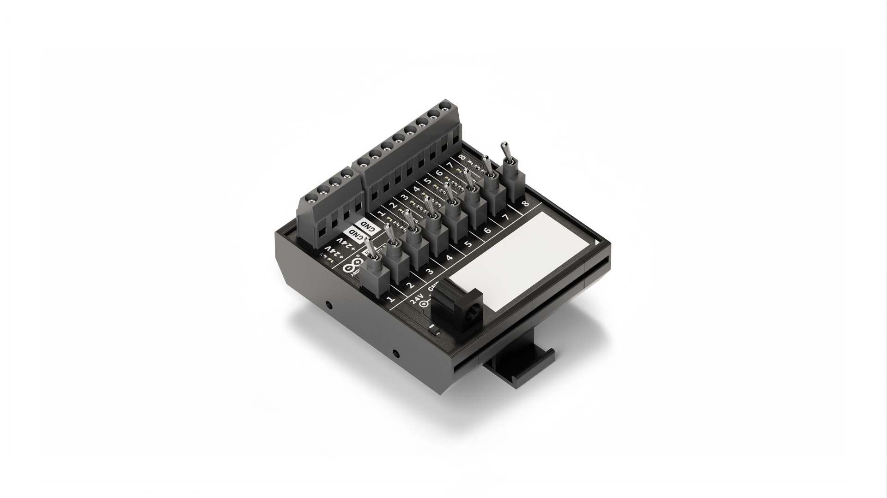
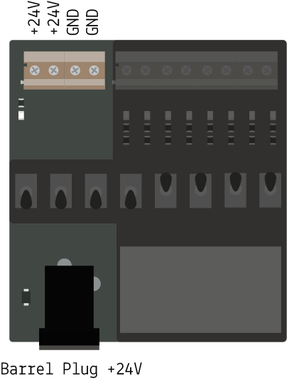
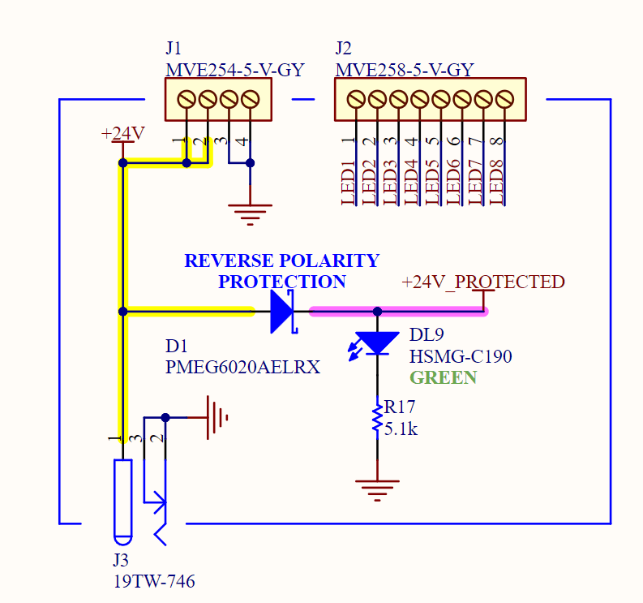
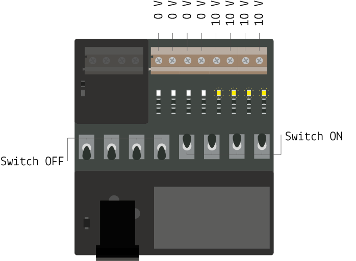
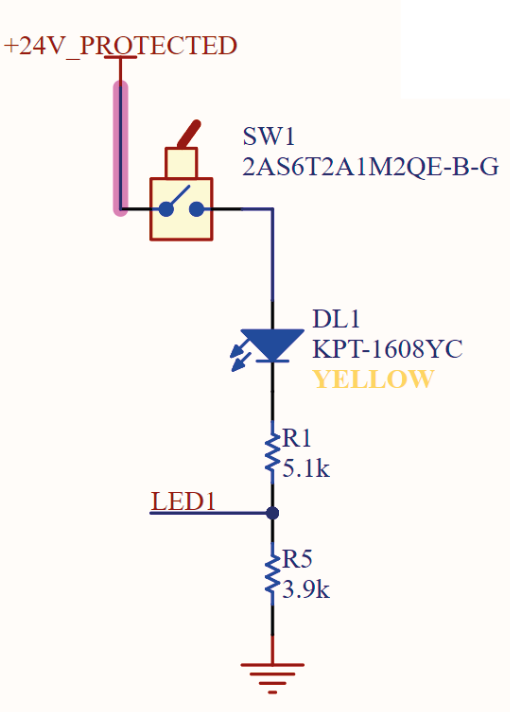
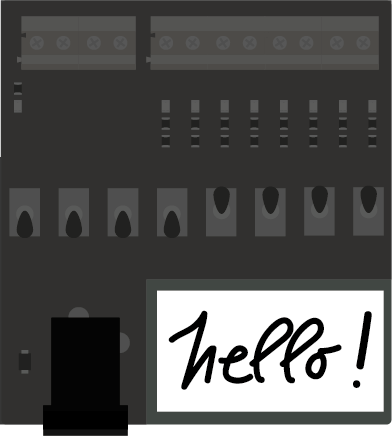
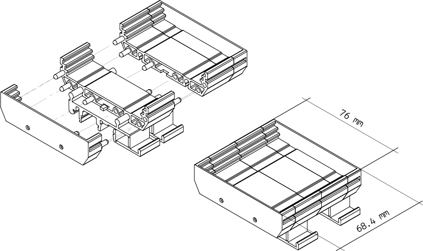

# Description
Arduino® DIN Simul8 is a digital-input-simulator and power distribution board for the Arduino Opta® family and Arduino® PLC Starter Kit. It provides eight toggle switches (0 - 10 V output) and four screw terminal for bringing the 24 V and the GROUND easily to the PLC or other board.

# Target Areas:
Pro, PLC projects, Education, Industry Ready, Building automation

# Features
**Note**: This board needs the Arduino Opta® for full functionality.

- **Toggle Switches**
    - 8 toggle switch in the middle of the board
- **LEDs** 
    - 8 leds showing the status of each toggle switches
- **Screw connectors** 
    - 2 screw connectors exposing +24 V DC
    - 2 screw connectors exposing GND
    - 8 screw connectors link to the toggle switches output (0 - 10 V)
    - 1 barrel plug (+24 V DC)
- **DIN mounting**
    - RT-072 DIN Rail Modular PCB Board Holders - 72 mm

# Contents

## Functional Overview

These are the main components of the board, other secondary components, i.e. resistors, are not listed. 

| **q.ty** | **Function**                  | **Description**                                              |
| :------: | ----------------------------- | ------------------------------------------------------------ |
|    8     | 0 - 10 V signal output         | Switch toggle SPST handle 6.1 mm bushing SPST terminal type M2 contact silver, color black |
|    8     | show switch status            | LED SMD 0603 GIA588 8mcd 120^                                |
|    1     | power plug                    | CONN PWR JACK 2.1X5.5 mm SOLDER                               |
|    1     | show main power status        | LED SMD 0603 GREEN/568 15mcd 120^                            |
|    1     | power connector               | CONN SCREW TERMINAL, pitch 5 mm, 4POS, 16 A, 450 V, 2.5 mm2 14AWG, dovetail, GREY, screw flat, housing 20x16.8x8.9 mm |
|    1     | signal connector              | CONN SCREW TERMINAL, pitch 5 mm, 8POS, 16 A, 450 V, 2.5 mm2 14AWG, dovetail, GREY, screw flat, housing 40x16.8x8.9 mm |
|    1     | protect from reverse polarity | DIODE SCHOTTKY SMD 2 A 60 V SOD123FL                           |

## Power Distribution

The board can be powered up from the barrel plug and then offer two couple of screw connector to deliver power to the PLC and other board, i.e. the Arduino® DIN Celsius board of the PLC Starter Kit.

## Deliver 8 Signal 0-10 V with Toggle Switch

Once powered up, every toggle-switch drive a 0-10 V signal:

 - 0 V when it's in is OFF position: toward the barrel plug
 - around 10 V when it's in its ON position: toward the screw connector

 as shown in the following images:

## Hello, My Name is:

At the bottom right of the board a white rectangle on the silk layer offer a space to customize the board with your name.

## Compatible Boards 

| Product name                      | SKU      | Min voltage | Max voltage |
| --------------------------------- | -------- | ----------- | ----------- |
| Arduino Opta® RS485               | AFX00001 | 12 V        | 24 V        |
| Arduino Opta® WiFi                | AFX00002 | 12 V        | 24 V        |
| Arduino Opta® Lite                | AFX00003 | 12 V        | 24 V        |
| Arduino® Portenta Machine Control | AKX00032 | 20 V        | 28 V        |
| Arduino® DIN Celsius              | ABX00098 | 20 V        | 28 V        |

**Note:** Please turn to each board's datasheet for further information about power and their capacity. 

### Application Examples

**Input board in the PLC Starter Kit:** Use the toggle switches to trigger the heat function in the DIN Celsius.

## Mechanical Information
### Enclosure Dimensions

The enclosure is equipped with a DIN clip, [here](assets/RT-072-Assembly.pdf) you can find all the other information and dimension of it.

## Certifications
### Declaration of Conformity CE DoC (EU)
We declare under our sole responsibility that the products above are in conformity with the essential requirements of the following EU Directives and therefore qualify for free movement within markets comprising the European Union (EU) and European Economic Area (EEA). 

### Declaration of Conformity to EU RoHS & REACH 211 01/19/2021
Arduino boards are in compliance with RoHS 2 Directive 2011/65/EU of the European Parliament and RoHS 3 Directive 2015/863/EU of the Council of 4 June 2015 on the restriction of the use of certain hazardous substances in electrical and electronic equipment. 

| Substance                              | **Maximum limit (ppm)** |
| -------------------------------------- | ----------------------- |
| Lead (Pb)                              | 1000                    |
| Cadmium (Cd)                           | 100                     |
| Mercury (Hg)                           | 1000                    |
| Hexavalent Chromium (Cr6+)             | 1000                    |
| Poly Brominated Biphenyls (PBB)        | 1000                    |
| Poly Brominated Diphenyl ethers (PBDE) | 1000                    |
| Bis(2-Ethylhexyl} phthalate (DEHP)     | 1000                    |
| Benzyl butyl phthalate (BBP)           | 1000                    |
| Dibutyl phthalate (DBP)                | 1000                    |
| Diisobutyl phthalate (DIBP)            | 1000                    |

Exemptions : No exemptions are claimed. 

Arduino Boards are fully compliant with the related requirements of European Union Regulation (EC) 1907 /2006 concerning the Registration, Evaluation, Authorization and Restriction of Chemicals (REACH). We declare none of the SVHCs (https://echa.europa.eu/web/guest/candidate-list-table), the Candidate List of Substances of Very High Concern for authorization currently released by ECHA, is present in all products (and also package) in quantities totaling in a concentration equal or above 0.1%. To the best of our knowledge, we also declare that our products do not contain any of the substances listed on the "Authorization List" (Annex XIV of the REACH regulations) and Substances of Very High Concern (SVHC) in any significant amounts as specified by the Annex XVII of Candidate list published by ECHA (European Chemical Agency) 1907 /2006/EC.

### Conflict Minerals Declaration 
As a global supplier of electronic and electrical components, Arduino is aware of our obligations with regards to laws and regulations regarding Conflict Minerals, specifically the Dodd-Frank Wall Street Reform and Consumer Protection Act, Section 1502. Arduino does not directly source or process conflict minerals such as Tin, Tantalum, Tungsten, or Gold. Conflict minerals are contained in our products in the form of solder, or as a component in metal alloys. As part of our reasonable due diligence Arduino has contacted component suppliers within our supply chain to verify their continued compliance with the regulations. Based on the information received thus far we declare that our products contain Conflict Minerals sourced from conflict-free areas. 

## FCC Caution
Any Changes or modifications not expressly approved by the party responsible for compliance could void the user’s authority to operate the equipment.

This device complies with part 15 of the FCC Rules. Operation is subject to the following two conditions: 

(1) This device may not cause harmful interference

(2) this device must accept any interference received, including interference that may cause undesired operation.

**FCC RF Radiation Exposure Statement:**

1. This Transmitter must not be co-located or operating in conjunction with any other antenna or transmitter.

2. This equipment complies with RF radiation exposure limits set forth for an uncontrolled environment.

3. This equipment should be installed and operated with minimum distance 20cm between the radiator & your body.

English: 
User manuals for license-exempt radio apparatus shall contain the following or equivalent notice in a conspicuous location in the user manual or alternatively on the device or both. This device complies with Industry Canada license-exempt RSS standard(s). Operation is subject to the following two conditions:

(1) this device may not cause interference

(2) this device must accept any interference, including interference that may cause undesired operation of the device.

French: 
Le présent appareil est conforme aux CNR d’Industrie Canada applicables aux appareils radio exempts de licence. L’exploitation est autorisée aux deux conditions suivantes :

(1) l’ appareil nedoit pas produire de brouillage

(2) l’utilisateur de l’appareil doit accepter tout brouillage radioélectrique subi, même si le brouillage est susceptible d’en compromettre le fonctionnement.

**IC SAR Warning:**

English 
This equipment should be installed and operated with minimum distance 20 cm between the radiator and your body.  

French: 
Lors de l’ installation et de l’ exploitation de ce dispositif, la distance entre le radiateur et le corps est d ’au moins 20 cm.

**Important:** The operating temperature of the EUT can’t exceed 85℃ and shouldn’t be lower than -40℃.

Hereby, Arduino S.r.l. declares that this product is in compliance with essential requirements and other relevant provisions of Directive 2014/53/EU. This product is allowed to be used in all EU member states. 

## Company Information
| Company name    | Arduino S.r.l                           |
| --------------- | --------------------------------------- |
| Company Address | Via Andrea Appiani 25 20900 MONZA Italy |

## Revision History
| Date       | **Revision** | **Changes**               |
| ---------- | ------------ | ------------------------- |
| 25/03/2024 | 1            | First release             |
