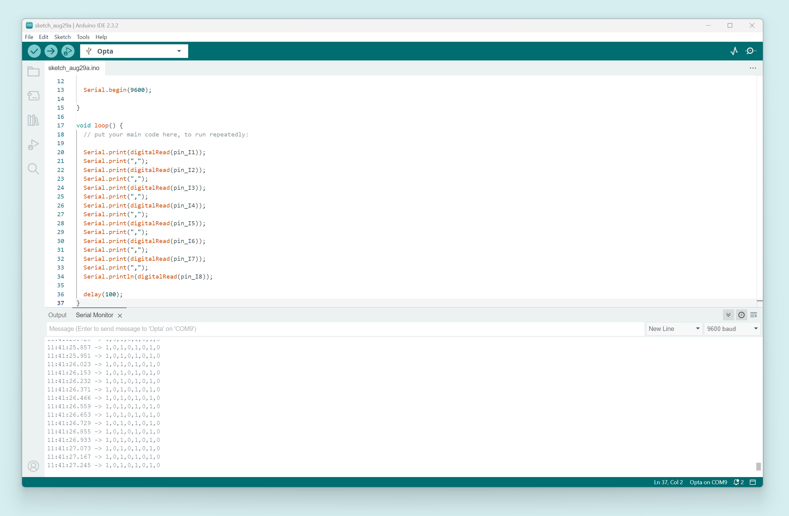
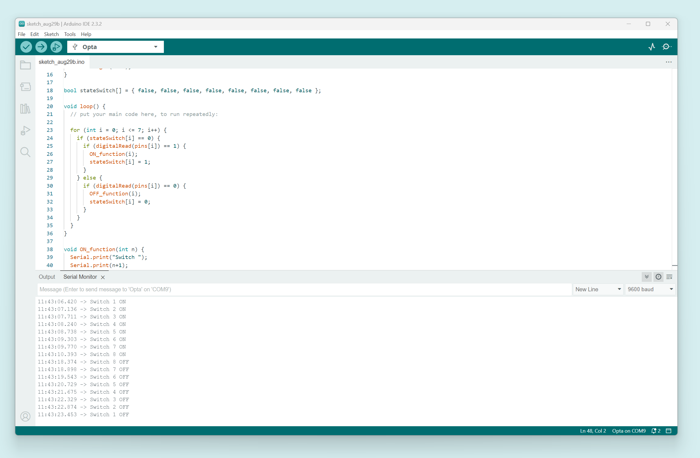

In this tutorial, you will learn how to connect the **Arduino® DIN Simul8** to the **Arduino Opta® WiFi** and implement basic functions.

## Hardware & Software Requirements

### Hardware

- [Arduino Opta® WiFi](https://store.arduino.cc/products/opta-wifi)
- Arduino® DIN Simul8
- USB-C® cable
- 24 V AC/DC power supply with barrel plug adapter
- Wiring cable for signal (x8)
- Wiring cable for power distribution (x2)

### Software

- [Arduino IDE 2](https://www.arduino.cc/en/software)

## Overview


The **DIN Simul8** is a digital input simulator and power distribution board designed for the Opta PLC family. It features eight toggle switches (0 - 10 V output) and four screw terminals, making it easy to supply 24 VDC and GND to the PLC or other boards.

***If you encounter any issues with the Opta WiFi, refer to its [user manual](https://docs.arduino.cc/tutorials/opta/user-manual/) before continuing.***

### Connections

To connect the DIN Simul8 to the PLC, you will need eight wiring cables for the signal connections and two for power.


1. Connect the power pins: +24V and GND.
2. Connect all the signal pins.

***It is recommended to use __AWG 17__ cables for all connections to ensure optimal performance and safety.***

Proper connections are crucial in an industrial project. **Always disconnect the power source before making any connections.** Use cables with lugs, or ensure that no exposed copper parts of the cables come into contact with other pins.


## Upload Test Code

Before proceeding, it is necessary to test if the components and connections are working as expected. We can do this by printing the input values to the [Serial Monitor](https://docs.arduino.cc/software/ide-v2/tutorials/ide-v2-serial-monitor/).

The Opta WiFi has eight input ports, labeled `I1` to `I8` at the top. These are mapped to pins `A0` through `A7`. To make it easier to reference each input, we can assign a variable to each port using the [`#define`](https://www.arduino.cc/reference/en/language/structure/further-syntax/define/) command, as shown below:


```arduino
#define pin_I1 A0
```

| **Opta™ Terminal** | **Arduino Pin Mapping** | **Variable**  |
|:------------------:|:-----------------------:|:-------------:|
|        `I1`        |      `A0`/`PIN_A0`      |   `pin_I1`    |
|        `I2`        |      `A1`/`PIN_A1`      |   `pin_I2`    |
|        `I3`        |      `A2`/`PIN_A2`      |   `pin_I3`    |
|        `I4`        |      `A3`/`PIN_A3`      |   `pin_I4`    |
|        `I5`        |      `A4`/`PIN_A4`      |   `pin_I5`    |
|        `I6`        |      `A5`/`PIN_A5`      |   `pin_I6`    |
|        `I7`        |      `A6`/`PIN_A6`      |   `pin_I7`    |
|        `I8`        |      `A7`/`PIN_A7`      |   `pin_I8`    |

Now, you can refer to the `I1` port on the Opta WiFi using the `pin_I1` variable.

To read the received values at each input port, you can use the [`digitalRead`](https://www.arduino.cc/reference/en/language/functions/digital-io/digitalread/) function within the `Serial.print` command:

```arduino
Serial.print(digitalRead(pin_I1));
```

Next, lets do this for each input port, separating each value with a comma (`,`). Here is the complete code:

```arduino
#define pin_I1 A0
#define pin_I2 A1
#define pin_I3 A2
#define pin_I4 A3
#define pin_I5 A4
#define pin_I6 A5
#define pin_I7 A6
#define pin_I8 A7

void setup() {
  // put your setup code here, to run once:

  Serial.begin(9600);

}

void loop() {
  // put your main code here, to run repeatedly:

  Serial.print(digitalRead(pin_I1));
  Serial.print(",");
  Serial.print(digitalRead(pin_I2));
  Serial.print(",");
  Serial.print(digitalRead(pin_I3));
  Serial.print(",");
  Serial.print(digitalRead(pin_I4));
  Serial.print(",");
  Serial.print(digitalRead(pin_I5));
  Serial.print(",");
  Serial.print(digitalRead(pin_I6));
  Serial.print(",");
  Serial.print(digitalRead(pin_I7));
  Serial.print(",");
  Serial.println(digitalRead(pin_I8));

  delay(100);
}
```

***Remember to initialize the Serial communication with the `Serial.begin` command in the `setup` function.***

***Use `Serial.println` for the last `Serial.print` to ensure the output wraps to a new line, making it easier to read.***

***Add a `delay`, such as __100ms__, to ensure stable communication over Serial.***


Each switch on the DIN Simul8 outputs is 0 V when OFF and 10 V when ON. The `digitalRead()` function will read `0` for 0 V and `1` for 10 V. 


For example, if you turn on toggle switches 1, 3, 5, and 7 while leaving 2, 4, 6, and 8 off, as shown in the image below:


The output should look like this:



## Upload Function Trigger Code

If everything works correctly, we can trigger a function when the switch changes state.

For example, we can create a function that prints `"Switch 1 ON"` when the switch is turned on and `"Switch 1 OFF"` when it is turned off.

```arduino
void ON_function() {
  Serial.println("Switch 1 ON");
}

void OFF_function() {
  Serial.println("Switch 1 OFF");
}
```

To ensure that the function only runs once when the state changes (and not continuously), we can store the current state of the switch in a variable:

```arduino
bool stateSwitch = false;
```

The function is called when the switch state changes. For instance, if the switch is currently OFF (`0`) and the state changes to ON (`1`), the `ON_function()` is triggered, and the `stateSwitch` variable is updated accordingly:

```arduino
  if (stateSwitch == 0) {
    if (digitalRead(pin_I1) == 1) {
      ON_function();
      stateSwitch = 1;
    }
  }
```

Here is the complete code, which works for toggle switch 1:

```arduino
#define pin_I1 A0
#define pin_I2 A1
#define pin_I3 A2
#define pin_I4 A3
#define pin_I5 A4
#define pin_I6 A5
#define pin_I7 A6
#define pin_I8 A7


void setup() {
  // put your setup code here, to run once:

  Serial.begin(9600);
}

bool stateSwitch = false;

void loop() {
  // put your main code here, to run repeatedly:
  
  if (stateSwitch == 0) {
    if (digitalRead(pin_I1) == 1) {
      ON_function();
      stateSwitch = 1;
    }
  } else {
    if (digitalRead(pin_I1) == 0) {
      OFF_function();
      stateSwitch = 0;
    }
  }

}

void ON_function() {
  Serial.println("Switch 1 ON");
}

void OFF_function() {
  Serial.println("Switch 1 OFF");
}
```

This code will monitor the state of toggle switch 1 and trigger the appropriate function when the switch is turned *on* or *off*.

## Upload Final Code

To make this work for all eight switches, you could repeat the `stateSwitch` variable and the `if-else` conditions eight times, but that would be a nonoptimal approach.

Instead, let's use [`arrays`](https://www.arduino.cc/reference/en/language/variables/data-types/array/) and a [`for-loop`](https://www.arduino.cc/reference/en/language/structure/control-structure/for/).

The idea is to replace the variables in the loop with arrays that store values for each switch and then use a `for-loop` to cycle through all eight inputs.

First, define an array for all the input pin definitions:

```arduino
int pins[] = { pin_I1, pin_I2, pin_I3, pin_I4, pin_I5, pin_I6, pin_I7, pin_I8 };
```

Next, create an array for the `stateSwitch` variable:

```arduino
bool stateSwitch[] = { false, false, false, false, false, false, false, false };
```

Then, you can substitute these arrays into your code:

```arduino
if (stateSwitch[ ] == 0) {
  if (digitalRead(pins[ ]) == 1) {
    ON_function();
    stateSwitch[ ] = 1;
  }
} else {
  if (digitalRead(pins[ ]) == 0) {
    OFF_function();
    stateSwitch[ ] = 0;
  }
}
```

To specify which array values to use, you can use a number from 0 to 7 inside the brackets `[]`. For example, `pins[0] = pin_I1`, `pins[1] = pin_I2`, and so on.

One way to implement this is with a [`for-loop`](https://www.arduino.cc/reference/en/language/structure/control-structure/for/). Assign a variable, like `int i`, to iterate from 0 to 7, and then use it to access each array value:

```arduino
for (int i = 0; i <= 7; i++) {
  if (stateSwitch[i] == 0) {
    if (digitalRead(pins[i]) == 1) {
      ON_function();
      stateSwitch[i] = 1;
    }
  } else {
    if (digitalRead(pins[i]) == 0) {
      OFF_function();
      stateSwitch[i] = 0;
    }
  }
}
```

This approach will work, but the `ON_function()` and `OFF_function()` will only print the state of Switch 1 unless we pass the `i` variable as an [argument](https://docs.arduino.cc/learn/programming/functions/). This way, we can print the switch number that is being toggled.

Here is the full code:

```arduino
#define pin_I1 A0
#define pin_I2 A1
#define pin_I3 A2
#define pin_I4 A3
#define pin_I5 A4
#define pin_I6 A5
#define pin_I7 A6
#define pin_I8 A7

int pins[] = { pin_I1, pin_I2, pin_I3, pin_I4, pin_I5, pin_I6, pin_I7, pin_I8 };

void setup() {
  // put your setup code here, to run once:

  Serial.begin(9600);
}

bool stateSwitch[] = { false, false, false, false, false, false, false, false };

void loop() {
  // put your main code here, to run repeatedly:

  for (int i = 0; i <= 7; i++) {
    if (stateSwitch[i] == 0) {
      if (digitalRead(pins[i]) == 1) {
        ON_function(i);
        stateSwitch[i] = 1;
      }
    } else {
      if (digitalRead(pins[i]) == 0) {
        OFF_function(i);
        stateSwitch[i] = 0;
      }
    }
  }
}

void ON_function(int n) {
  Serial.print("Switch ");
  Serial.print(n+1);
  Serial.println(" ON");
}

void OFF_function(int n) {
  Serial.print("Switch ");
  Serial.print(n+1);
  Serial.println(" OFF");
}
```

And here is what you should see on the Serial Monitor when you turn on all the switches from 1 to 8 and then off from 8 to 1:



This code will monitor the state of all eight switches and print the corresponding message whenever a switch is toggled *on* or *off*.

## Considerations

If you notice any unexpected behavior when turning a switch on or off, such as the switch appearing to toggle on and off rapidly, don't worry! This is normal and is related to a phenomenon called "debounce." To understand further, you can learn more about it [here](https://docs.arduino.cc/built-in-examples/digital/Debounce/).

## Conclusions

The Arduino DIN Simul8 provides an excellent platform to start experimenting with your coding skills in the PLC world. Try creating more functions that different combinations of switch positions can trigger, or explore any other ideas you have. Have fun!