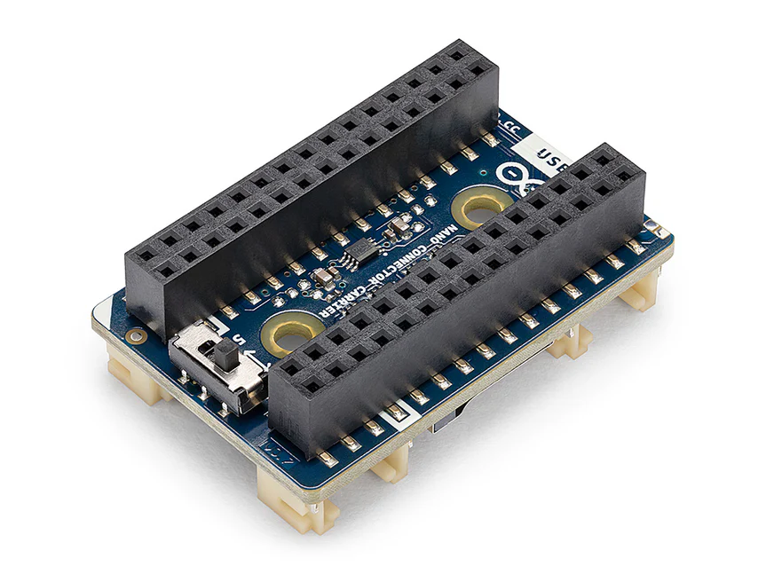

# Description

Build smarter and prototype faster with the Arduino Matter® Discovery Bundle, an all-in-one solution for creating interoperable Internet of Things (IoT) devices using Matter, the industry-backed smart home connectivity standard supported by Apple, Google, Amazon, Home Assistant, and other major platforms. At the core of this bundle is the Arduino Nano Matter board with pre-mounted headers, powered by Silicon Labs' MGM240S module for Matter-over-Thread connectivity. Combined with the Nano Connector Carrier featuring Qwiic and Grove interfaces and three Modulino® modules, this bundle enables rapid prototyping of smart home devices in minutes.

# Target Areas

Smart home automation, IoT prototyping, home automation education, Matter device development, legacy appliance retrofitting, interoperability testing

# CONTENTS
## Application Examples

The Arduino Matter® Discovery Bundle is designed for rapid prototyping of Matter-compatible smart home devices. With built-in Thread connectivity and seamless integration with major smart home ecosystems, this bundle enables developers to create interoperable IoT solutions quickly.

Discover how the Matter Discovery Bundle can accelerate your smart home projects through the following application examples:

- **Smart home device development**: Create Matter-compatible devices that work across multiple ecosystems:
  - 
<strong>Smart temperature monitoring</strong>: Use the Modulino® Thermo to build a Matter-compatible temperature and humidity sensor that integrates with Apple HomeKit, Google Home, and Amazon Alexa. Monitor environmental conditions in real-time and trigger automations based on temperature thresholds.

  - 
<strong>Presence-aware automation</strong>: Leverage the Modulino Distance with its Time-of-Flight sensor to create occupancy detection systems. Build smart room sensors that detect presence and communicate with Matter controllers to automate lighting, HVAC, and security systems.

  - 
<strong>Smart relay control</strong>: Use the Modulino Latch Relay to retrofit traditional appliances with smart capabilities. Control lights, fans, coffee makers, and other devices through Matter-compatible voice assistants and automation platforms.

- **Education and training**: Teach modern IoT connectivity standards:
  - 
<strong>STEM curriculum integration</strong>: With its 7-chapter Academy course, the bundle provides structured learning materials for understanding Matter protocol fundamentals, Thread networking and embedded programming for smart devices.

  - 
<strong>Hands-on IoT labs</strong>: Perfect for technical universities and bootcamps to deliver practical experience with industry-relevant Matter certification processes and device interoperability testing.

  - 
<strong>Professional development</strong>: Enable corporate training programs for embedded engineers and IoT developers looking to expand their expertise in Matter technology and smart home connectivity.

- **Legacy device retrofitting**: Modernize existing appliances:
  - 
<strong>Smart appliance conversion</strong>: Transform conventional electrical devices into Matter-compatible smart nodes; add voice control and automation capabilities to legacy equipment without redesigning the original appliance.

  - 
<strong>Home automation integration</strong>: Connect analog systems to Home Assistant, Apple HomeKit, or other Matter platforms. Schedule and automate legacy devices through modern smart home interfaces.

- **Interoperability testing**: Validate device compatibility across ecosystems:
  - 
<strong>Cross-platform validation</strong>: Test device behavior across Apple HomeKit, Google Home, Amazon Alexa, and Home Assistant to ensure consistent performance and compliance with Matter protocols.

  - 
<strong>Certification preparation</strong>: Use the bundle as a test bench for validating Matter protocol compliance before pursuing official CSA certification for commercial products.

## Features

### Bundle Contents

The Arduino Matter® Discovery Bundle includes all the hardware components necessary to prototype Matter-over-Thread smart home devices in no time. Below is the list of included items and their main features and specifications:

- Arduino Nano Matter with headers (SKU: ABX00137) (x1)
- Nano Connector Carrier (SKU: ASX00061) (x1)
- Modulino® Latch Relay (SKU: ABX00138) (x1)
- Modulino® Distance (SKU: ABX00102) (x1)
- Modulino® Thermo (SKU: ABX00103) (x1)
- Qwiic cables (x4)
- USB-C® cable (x1)

</img>

#### Arduino Nano Matter with Headers (SKU: ABX00137)

The Arduino Nano Matter is a compact microcontroller board powered by the Silicon Labs MGM240SD22VNA module, which features a 32-bit Arm® Cortex®-M33 processor with a DSP instruction set and a floating-point unit. This board combines Arduino's user-friendly approach with Silicon Labs' powerful Matter-over-Thread connectivity, making the popular IoT standard accessible to makers and professionals alike.

</img>

Below is a summary of the most important technical specifications of the Arduino Nano Matter board:

|        **Feature**        | **Specification**                                            |
|:-------------------------:|--------------------------------------------------------------|
|         **Module**        | Silicon Labs MGM240SD22VNA                                   |
|       **Processor**       | 32-bit Arm® Cortex®-M33 with DSP instruction and FPU         |
|     **USB Connector**     | USB-C®                                                       |
|         **Memory**        | 1536 kB Flash, 256 kB RAM                                    |
| **Wireless Connectivity** | 802.15.4 Thread®, Bluetooth® Low Energy 5.3, Bluetooth® Mesh |
|        **Antenna**        | On-board 2.4 GHz antenna                                     |
|       **Interfaces**      | I²C, SPI, UART, PWM, ADC, DAC, Digital I/Os                  |
|     **User Interface**    | User push-button, RGB LED                                    |
|        **Security**       | Secure Vault® High                                           |
|      **I/O Voltage**      | + 3.3 VDC                                                    |
|     **Input Voltage**     | + 5 VDC (nominal)                                            |
|    **Board Dimensions**   | 18 mm x 45 mm                                                |

  

    For detailed information about the Arduino Nano Matter board, please refer to its corresponding documentation available on Arduino Docs:
    <a href="https://docs.arduino.cc/hardware/nano-matter/" target="_blank" style="color: #0056b3; text-decoration: underline;">
      Arduino Nano Matter Official Documentation [1]
    </a>
  

#### Nano Connector Carrier (SKU: ASX00061)

The Nano Connector Carrier is a versatile expansion board that simplifies prototyping with Arduino Nano-form-factor boards. It provides multiple connectivity options, including Grove and Qwiic connectors for plug-and-play integration with sensors and actuators. The carrier also features a MicroSD card slot for data logging applications and a voltage selection switch for compatibility with both +3.3 VDC and +5 VDC devices.

</img>

Below is a summary of the most important technical specifications of the Nano Connector Carrier:

|   **Feature**   | **Specification**                                               |
|:---------------:|-----------------------------------------------------------------|
|  **Connectors** | Grove analog/digital I/O (x2), Grove I²C, Grove UART, Qwiic I²C |
|   **Storage**   | MicroSD card slot                                               |
|   **Headers**   | Double female board header for Nano boards                      |
| **I/O Voltage** | Switchable between +3.3 VDC and +5 VDC                          |
|  **Dimensions** | 28 mm x 43 mm                                                   |

  

    For detailed information about the Nano Connector Carrier, please refer to its corresponding documentation available on Arduino Docs:
    <a href="https://docs.arduino.cc/hardware/nano-connector-carrier/" target="_blank" style="color: #0056b3; text-decoration: underline;">
      Nano Connector Carrier Official Documentation [2]
    </a>
  

#### Modulino® Latch Relay (SKU: ABX00138)

The Modulino Latch Relay is a compact actuator module designed for controlling external devices at higher voltages. It features a latching relay that maintains its state without continuous power, making it ideal for energy-efficient smart home applications. The module connects via the Qwiic interface for simple integration with the Nano Connector Carrier and can be daisy-chained with other Modulino nodes.

</img>

Below is a summary of the most important technical specifications of the Modulino Latch Relay module:

|       **Feature**      | **Specification**                          |
|:----------------------:|--------------------------------------------|
|     **Relay Type**     | Latching relay                             |
| **Switching Capacity** | +30 VDC @ 5A                               |
|      **Interface**     | I²C (via Qwiic connector)                  |
|   **Power Indicator**  | Green LED                                  |
|     **Connectors**     | Qwiic connectors (x2, daisy-chain capable) |
|     **Dimensions**     | 41 mm x 25.36 mm                           |

  

    For detailed information about the Modulino Latch Relay module, please refer to its corresponding documentation available on Arduino Docs:
    <a href="https://docs.arduino.cc/hardware/modulino-latch/" target="_blank" style="color: #0056b3; text-decoration: underline;">
      Modulino Latch Relay Official Documentation [3]
    </a>
  

#### Modulino® Distance (SKU: ABX00102)

The Modulino Distance module is a compact sensor module featuring a Time-of-Flight (ToF) proximity sensor for accurate distance measurements. It is ideal for presence detection, object proximity sensing, and occupancy monitoring applications. The module connects via the Qwiic interface for simple integration with the Nano Connector Carrier and can be daisy-chained with other Modulino nodes.

</img>

Below is a summary of the most important technical specifications of the Modulino Distance module:

|      **Feature**      | **Specification**                          |
|:---------------------:|--------------------------------------------|
|    **Sensor Type**    | Time-of-Flight (ToF) proximity sensor      |
| **Measurement Range** | 0 to 1200 mm                               |
|     **Interface**     | I²C (via Qwiic connector)                  |
|  **Power Indicator**  | Green LED                                  |
|     **Connectors**    | Qwiic connectors (x2, daisy-chain capable) |
|     **Dimensions**    | 41 mm x 25.36 mm                           |

  

    For detailed information about the Modulino Distance module, please refer to its corresponding documentation available on Arduino Docs:
    <a href="https://docs.arduino.cc/hardware/modulino-distance/" target="_blank" style="color: #0056b3; text-decoration: underline;">
      Modulino Distance Official Documentation [4]
    </a>
  

#### Modulino® Thermo (SKU: ABX00103)

The Modulino Thermo is a compact environmental-sensing module with temperature and humidity sensors. It is designed for climate monitoring, HVAC control, and environmental data collection applications. The module connects via the Qwiic interface for simple integration with with the Nano Connector Carrier and can be daisy-chained with other Modulino nodes.

</img>

Below is a summary of the most important technical specifications of the Modulino Thermo:

|     **Feature**     | **Specification**                          |
|:-------------------:|--------------------------------------------|
|     **Sensors**     | Temperature sensor, humidity sensor        |
|    **Interface**    | I²C (via Qwiic connector)                  |
| **Power Indicator** | Green LED                                  |
|    **Connectors**   | Qwiic connectors (x2, daisy-chain capable) |
|    **Dimensions**   | 41 mm x 25.36 mm                           |

  

    For detailed information about the Modulino Thermo module, please refer to its corresponding documentation available on Arduino Docs:
    <a href="https://docs.arduino.cc/hardware/modulino-thermo/" target="_blank" style="color: #0056b3; text-decoration: underline;">
      Modulino Thermo Official Documentation [5]
    </a>
  

### Bundle Included Accessories

- Qwiic cable (x4)
- USB-A to USB-C® cable (x1)

### Bundle Related Products

- Modulino Movement (SKU: ABX00101)
- Modulino Knob (SKU: ABX00107)
- Modulino Buzzer (SKU: ABX00108)
- Modulino Pixels (SKU: ABX00109)
- Modulino Buttons (SKU: ABX00110)

## Ratings

### Recommended Operating Conditions

The table below provides a comprehensive guideline for the optimal use of the Arduino Matter Discovery Bundle, outlining typical operating conditions and design limits. The operating conditions of the Matter Discovery Bundle are largely determined by its components' specifications.

|      **Parameter**     |    **Symbol**   | **Min** | **Typ** | **Max** | **Unit** |
|:----------------------:|:---------------:|:-------:|:-------:|:-------:|:--------:|
|   USB Input Voltage¹   | VUSB |   4.8   |   5.0   |   5.5   |    VDC   |
| VIN Pad Input Voltage² |  VIN |   6.0   |   7.0   |    21   |    VDC   |
| Operating Temperature³ |  TO  |   -40   |    25   |    85   |    °C    |

1 Input voltage via USB-C® connector on the Arduino Nano Matter board.

2 Input voltage via <code>VIN</code> pad on the Arduino Nano Matter board, accessible through the Nano Connector Carrier.

3 The operating temperature represents the range for the entire bundle and not just an individual component.

<strong>Important Note:</strong> The recommended methods for powering the kit are through the USB-C® connector on the Arduino Nano Matter or via the <code>VIN</code> pad accessible through the Nano Connector Carrier. When using the <code>VIN</code> pad, ensure the input voltage is within the +6 to +21 VDC range. <strong>Do not apply power through both methods simultaneously</strong>.

## Bundle Power Supply

The Arduino Matter Discovery Bundle can be powered through the following recommended methods:

- 
<strong>USB-C® connector on the Arduino Nano Matter</strong>: Provides a +5 VDC input through the onboard USB-C® port. This is the recommended method for powering the entire bundle during development and prototyping.

- 
<strong>VIN pad via Nano Connector Carrier</strong>: The <code>VIN</code> pad on the Arduino Nano Matter is accessible through the Nano Connector Carrier's female headers, allowing external power supply connection. This pad accepts an unregulated +6 to +21 VDC input (typical +7 VDC) that is internally regulated. This method is suitable for standalone deployments or when higher current capacity is required.

<strong>Power Tip:</strong> When using the Modulino® Latch Relay module to control external devices, ensure that the external power supply for the controlled device is properly isolated from the bundle's power supply to prevent any damage.

<strong>Safety Note:</strong> Always disconnect power before making hardware changes to the bundle.

## Device Operation

### Getting Started - IDE

To program your Arduino Matter Discovery Bundle offline, install the Arduino Desktop IDE <strong>[6]</strong>. Connect the Arduino Nano Matter to your computer using the included USB-C® cable. Ensure you have installed the Silicon Labs board package through the Arduino IDE Board Manager to access Matter-specific libraries and examples.

### Getting Started - Arduino Cloud Editor

All components of the Matter Discovery Bundle work seamlessly with the Arduino Cloud Editor <strong>[7]</strong> by installing a simple plugin. The Arduino Cloud Editor is hosted online, ensuring it is always up-to-date with the latest features and support for all boards and devices. Follow <strong>[8]</strong> to start coding in the browser and upload your sketches onto the Arduino Nano Matter board.

### Getting Started - Arduino Cloud

The Matter Discovery Bundle is supported on Arduino Cloud, enabling you to log sensor data, trigger events and automate processes for smart home applications via the Arduino Nano Matter board. Take a look at the official documentation <strong>[8]</strong> to learn more about how to integrate the kit into your IoT projects.

### Matter Arduino Academy Course

The Arduino Matter Discovery Bundle includes access to a 7-chapter Arduino Academy course <strong>[10]</strong> designed to help you master Matter technology:

- <strong>Module 1</strong>: Introduction to Matter (Theory)
- <strong>Module 2</strong>: Setting Up the Arduino Nano Matter Board (Practice)
- <strong>Module 3</strong>: Matter Network Deployment (Theory)
- <strong>Module 4</strong>: Hands-On with the Arduino Nano Matter Board (Practice)
- <strong>Module 5</strong>: Advanced Features of Matter (Practice)
- <strong>Module 6</strong>: Evaluating Matter for Your Product (Theory)
- <strong>Module 7</strong>: Next Steps and Real-World Implementation (Theory)

Upon course completion, you can earn an <strong>Arduino Certified Engineer</strong> credential for Matter development.

### Sample Sketches

Sample sketches for the Matter Discovery Bundle can be found in the "Examples" menu in the Arduino IDE under the Matter library. These examples include basic Matter device implementations, sensor integration and relay control applications demonstrating smart home connectivity.

### Online Resources

Explore the endless possibilities of the Matter Discovery Bundle by checking projects on Arduino Project Hub <strong>[11]</strong>, the Arduino Library Reference <strong>[12]</strong> and the Matter Arduino Academy course <strong>[10]</strong>. Additional resources from Silicon Labs, including the Matter Developer Journey documentation<strong>[13]</strong>, provide in-depth technical information for advanced implementations.

## Mechanical Information

The Arduino Matter Discovery Bundle offers mechanical flexibility, supporting multiple configurations based on the combination of components used. This section provides the main dimensions of the individual components for reference.

### Component Dimensions

The table below summarizes the dimensions of each component included in the kit:

| **Component**          | **Width** | **Length** | **Unit** |
|:----------------------:|:---------:|:----------:|:--------:|
| Arduino Nano Matter    |    18     |     45     |    mm    |
| Nano Connector Carrier |    28     |     43     |    mm    |
| Modulino Latch Relay   |   25.36   |     41     |    mm    |
| Modulino Distance      |   25.36   |     41     |    mm    |
| Modulino Thermo        |   25.36   |     41     |    mm    |

## Product Compliance

The Arduino Matter Discovery Bundle consists of multiple individual Arduino products, each of which complies with specific regulations and certifications. For detailed product compliance information, please refer to the corresponding datasheets of each component included in the kit:

- [Arduino Nano Matter Documentation](https://docs.arduino.cc/hardware/nano-matter/) **[1]**
- [Nano Connector Carrier Documentation](https://docs.arduino.cc/hardware/nano-connector-carrier/) **[2]**
- [Modulino Latch Relay Documentation](https://docs.arduino.cc/hardware/modulino-latch//) **[3]**
- [Modulino Distance Documentation](https://docs.arduino.cc/hardware/modulino-distance/) **[4]**
- [Modulino Thermo Documentation](https://docs.arduino.cc/hardware/modulino-thermo/) **[5]**

## FCC Caution

The components of the Arduino Matter Discovery Bundle are subject to individual FCC regulations. Please refer to the FCC documentation linked in each Arduino component's datasheet for specific compliance details:

- [Arduino Nano Matter Documentation](https://docs.arduino.cc/hardware/nano-matter/) **[1]**

## Company Information

| **Company name** |              **Arduino S.r.l.**              |
|:----------------:|:--------------------------------------------:|
| Company address  | Via Andrea Appiani, 25 - 20900 Monza (Italy) |

## Reference Documentation

| **No.** |             **Reference**             | **Link**                                                         |
|:-------:|:-------------------------------------:|------------------------------------------------------------------|
|    1    |   Arduino Nano Matter Documentation   | https://docs.arduino.cc/hardware/nano-matter/                    |
|    2    |  Nano Connector Carrier Documentation | https://docs.arduino.cc/hardware/nano-connector-carrier/         |
|    3    |   Modulino Latch Relay Documentation  | https://docs.arduino.cc/hardware/modulino-latch/                 |
|    4    |    Modulino Distance Documentation    | https://docs.arduino.cc/hardware/modulino-distance/              |
|    5    |     Modulino Thermo Documentation     | https://docs.arduino.cc/hardware/modulino-thermo/                |
|    6    |         Arduino IDE (Desktop)         | https://www.arduino.cc/en/software                               |
|    7    |          Arduino Cloud Editor         | https://create.arduino.cc/editor                                 |
|    8    |    Arduino Cloud - Getting Started    | https://docs.arduino.cc/arduino-cloud/guides/overview/           |
|    9    | Matter Discovery Bundle Documentation | https://docs.arduino.cc/hardware/matter-discovery-bundle/        |
|    10   |     Arduino Academy Matter Course     | https://academy.arduino.cc/                                      |
|    11   |          Arduino Project Hub          | https://create.arduino.cc/projecthub                             |
|    12   |       Arduino Library Reference       | https://docs.arduino.cc/language-reference/                      |
|    13   | Silicon Labs Matter Developer Journey | https://www.silabs.com/support/training/matter-developer-journey |

## Document Revision History

|  **Date**  | **Revision** |       **Changes**      |
|:----------:|:------------:|:----------------------:|
| 31/12/2025 |       1      |      First release     |