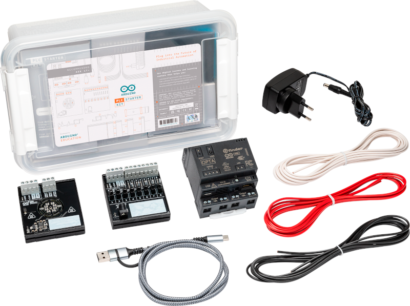
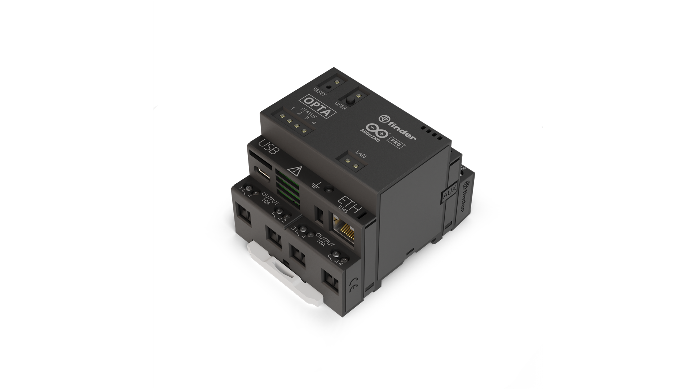
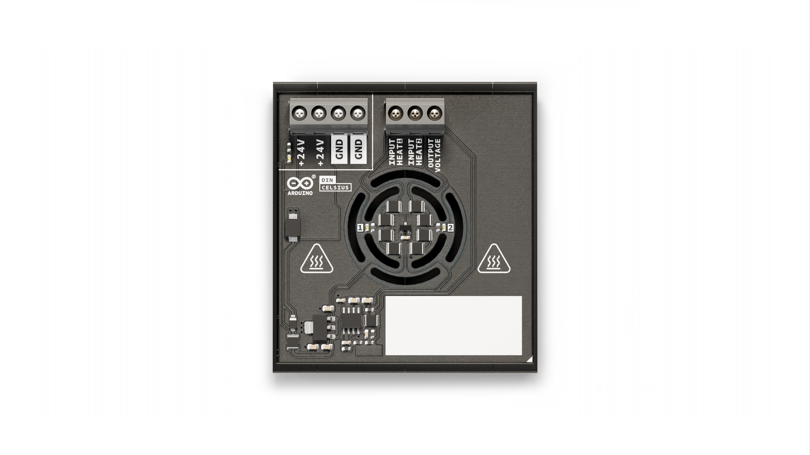
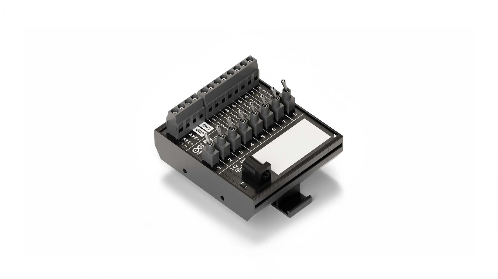
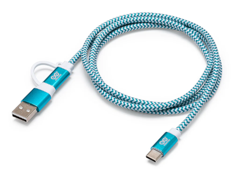
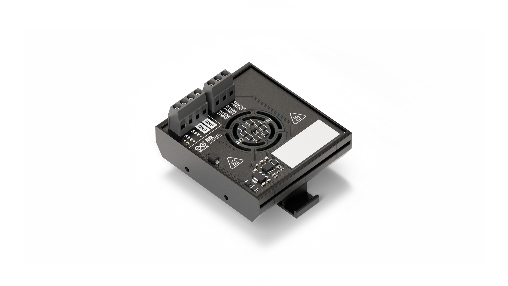
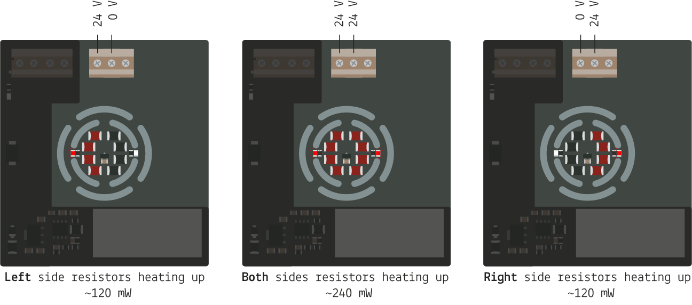
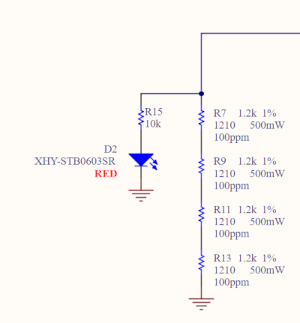
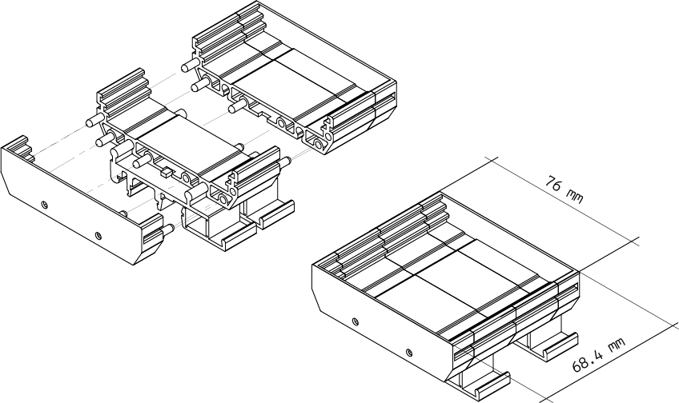

# Description
Programmable Logic Controller (PLC) technology is vital for industrial automation; however, gaps still exist between the current PLC education and industry's needs. To cultivate a robust industrial knowledge Arduino introduces the educational Arduino® PLC Starter Kit.

# Target Areas:
Pro, PLC projects, Education, Industry Ready, Building automation

# Contents

## Content of the kit
### Arduino Opta® WiFi
Arduino Opta® WiFi (SKU: AFX00002) is a secure, easy-to-use micro PLC with Industrial IoT capabilities fully certified to be used in industrial environments. Designed in partnership with Finder®, Opta® allows professionals to scale up automation projects while leveraging the Arduino ecosystem.

The Opta® family Arduino sketches and standard IEC-61131-3 PLC languages using the Arduino PLC IDE were designed with PLC engineers in mind. To know more about this PLC check its [official datasheet.](https://docs.arduino.cc/resources/datasheets/AFX00001-AFX00002-AFX00003-datasheet.pdf)

### Arduino® DIN Celsius
The output simulator (DIN Celsius) (SKU: ABX00098) features a heater resistor array and a temperature sensor. It allows you to experiment with actuators and sensors and it is ideal to be integrated into different control systems. Check section TODO to know more.

### Arduino® DIN Simul8
The input simulator (DIN Simul8) (SKU: ABX00097) includes 8x switches and power control. It is suitable for interfacing the power of your PLC application and the inputs channels with 8x SPST toggle switches as an industrial-like user interface. Check section TODO to know more.

### USB Cable
The official Arduino USB cable features a USB-C® to USB-C® with a USB-A adapter connection. This data USB cable can easily connect your Arduino boards with your chosen programming device.

### Power Brick
The kit includes a 120/240 V to 24 VDC - 1 A power supply to power the kit through the DIN Simul8 barrel jack. It can deliver 24 W and ensures a sufficient and stable power source for your application. It includes different countries power plug adapters so you can use it anywhere in the world.

### Wiring Cables
The kit includes three wiring cables (AWG 17) with a lengh of 20 cm in three colors: white, blank, and red to make the whole system connections. They can be cut into small cables depending on the project and are suitable to be used under the power specifications of the power brick: 24 VDC 1A.

### DIN Bar Mounts
The kit includes DIN bar mount plastic pieces to attach the DIN Celsius and DIN Simu8 to a DIN bar among the Arduino Opta® Wifi.

## Arduino® DIN Celsius

The Arduino® DIN Celsius offers you a mini temperature laboratory to test your PLC skills, with two independent heater circuits and one temperature sensor placed at the center of the board.

### Features
**Note**: This board needs the Arduino Opta® for full functionality.

- **Temperature sensor**
    - 1x TMP236, from -10 °C to 125 °C with an accuracy of +/- 2.5 °C
- **Heater circuits**
    - 2x independent heater circuits
- **Screw connectors**
    - 2x screw connectors exposing +24 VDC
    - 2x screw connectors exposing GND
    - 2x screw connectors for the two independent heater circuits (24 VDC)
    - 1x screw connector for the output voltage of the temperature sensor
- **DIN mounting**
    - RT-072 DIN Rail Modular PCB Board Holders - 72 mm

### Functional Overview

These are the main components of the board, other secondary components, i.e. resistors or capacitors, are not listed.

| **Qty** | **Element**                      | **Description**                                                    |
| :-----: | -------------------------------- | ------------------------------------------------------------------ |
|    1    | Temperature sensor               | TMP236A2DBZR IC SENSOR                                             |
|    4    | Left heating circuit             | RES CHIP 1210 1k2 1% 1/2W                                          |
|    4    | Right heating circuit            | RES CHIP 1210 1k2 1% 1/2W                                          |
|    2    | Heating status                   | LED SMD 0603 RED                                                   |
|    1    | Power status                     | LED SMD 0603 GREEN                                                 |
|    1    | Power connector                  | CONN SCREW TERMINAL, pitch 5mm, 4POS, 16A, 450V, 2.5mm2 |
|    1    | Input / output connectors        | CONN SCREW TERMINAL, pitch 5mm, 3POS, 16A, 450V, 2.5mm2 |
|    1    | Protection from reverse polarity | DIODE SCHOTTKY SMD 2A 60V SOD123FL                                 |

### Heating Circuits

The board provides two independent heating circuits powered by 24 V through two different screw connectors, one placed on the left side of the temperature sensor and the other on the right side, as it can be seen in the following figure:

The heat is generated by the current passing through four resistors in series being the power about 120 mW per each circuit.

### Temperature Sensor

The temperature sensor is the TMP236A2DBZR from Texas Instruments.
Here you can see its main specifications:

 - Analog out 19.5 mV/°C
 - Voltage reference of 400 mV at 0 °C
 - Maximum Accuracy: +-2.5 °C
 - Temperature-Voltage range: -10 °C to 125 °C VDD 3.1 V to 5.5 V

In order to create an analog output signal (0-10 V) a 4.9 multiplier circuit has been added before the OUTPUT VOLTAGE screw connector pin.

The relation between the temperature, the voltage of the sensor and the output voltage of the board is summarized in the following table:

| TEMPERATURE [°C] | SENSOR OUTPUT [V] | BOARD OUTPUT x4.9 [V] |
| ---------------- | ----------------- | --------------------- |
| -10              | 0.2               | 1.0                   |
| -5               | 0.3               | 1.5                   |
| 0                | 0.4               | 2.0                   |
| 5                | 0.5               | 2.4                   |
| 10               | 0.6               | 2.9                   |
| 15               | 0.7               | 3.4                   |
| 20               | 0.8               | 3.9                   |
| 25               | 0.9               | 4.4                   |
| 30               | 1.0               | 4.8                   |
| 35               | 1.1               | 5.3                   |
| 40               | 1.2               | 5.8                   |
| 45               | 1.3               | 6.3                   |
| 50               | 1.4               | 6.7                   |
| 55               | 1.5               | 7.2                   |
| 60               | 1.6               | 7.7                   |
| 65               | 1.7               | 8.2                   |
| 70               | 1.8               | 8.6                   |
| 75               | 1.9               | 9.1                   |
| 80               | 2.0               | 9.6                   |
| 85               | 2.1               | 1.,1                  |

### Custom Labelling

At the bottom right of the board a white rectangle on the silk layer offer a space to customize the board with your name.

### Compatible Boards

The Arduino® DIN Celsius it is fully compatible with the following Arduino Products:

|           Product name            |   SKU    | Min voltage | Max voltage |
| :-------------------------------: | :------: | :---------: | :---------: |
|        Arduino Opta® RS485        | AFX00001 |    12 V     |    24 V     |
|        Arduino Opta® WiFi         | AFX00002 |    12 V     |    24 V     |
|        Arduino Opta® Lite         | AFX00003 |    12 V     |    24 V     |
| Arduino® Portenta Machine Control | AKX00032 |    24 V     |    24 V     |
|        Arduino® DIN Simul8        | ABX00097 |    24 V     |    24 V     |

**Note:** Please turn to each board's datasheet for further information about their technical specifications.

### Mechanical Information
#### Enclosure Dimensions

The enclosure is equipped with a DIN clip, as it can be seen [here](assets/RT-072-Assembly.pdf) where you can find all the measures information.
