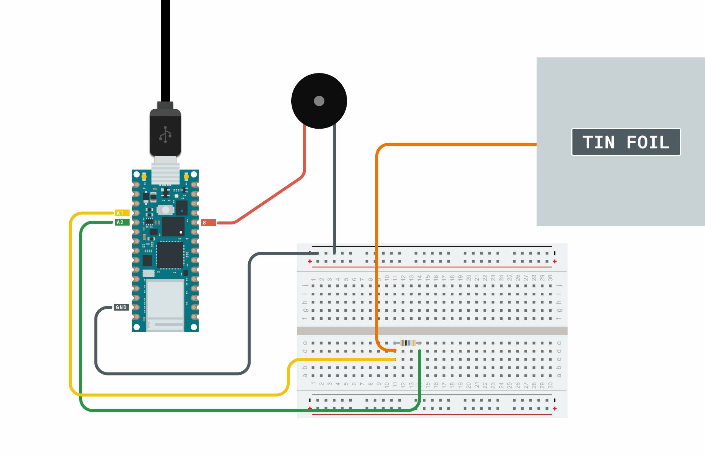
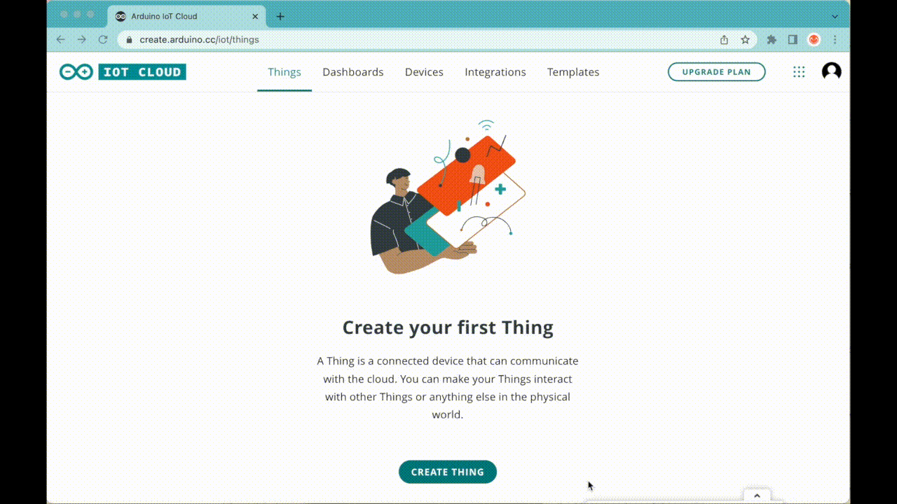

## Components and Supplies

- [Arduino IoT Bundle](https://store.arduino.cc/iot-bundle)

## Apps and Online Services

- [Arduino IoT Cloud](https://cloud.arduino.cc)
- [Arduino IoT Cloud Remote app](https://play.google.com/store/apps/details?id=cc.arduino.cloudiot&hl=en&gl=US)

## About This Project

**Create a pillow that sends your love with the help of the Arduino IoT Cloud!**

We all know that being without that special person in your life can be difficult, but what if you could send love and affection remotely over the Internet by just hugging a pillow?

Now, we can't really send hugs... but what we can send is a sweet emoji through a messaging app, triggered by you giving a pillow a hug.

When you hug the **I Love You Pillow** you will hear the sound of a heartbeat coming from the buzzer inside. Depending on the length of your hug, a different emoji will be sent to a chat box in the Arduino IoT Cloud Remote app.

Stay in touch with your loved one with this huggable device!

### In a Nutshell

In this experiment, we will use aluminium foil to create a DIY capacitive sensor that will be used to detect hugs. By hugging the pillow you can send loving emojis to your beloved.

### Components

* Buzzer
* Aluminium foil
* 1 resistor 5M ohm


Show your love with a hug!

### Learning Goals

* Introducing the Arduino IoT Cloud
* Introducing the Arduino IoT Remote app
* Managing capacitive sensors
* Creating an Arduino IoT Cloud Dashboard
* Sharing dashboards **#ProTips**

**Pro Tips** are useful but not strictly necessary steps that add a layer of complexity to the project.

### Want to Know More?

This tutorial is part of a series of experiments that familiarize you with the Arduino RP2040 and IoT. All experiments can be built using the components contained in the IoT Bundle.

* [Puzzle Box with Arduino IoT Bundle](/tutorials/iot-bundle/puzzlebox)
* [Pavlov's Cat with the Arduino IoT Bundle](/tutorials/iot-bundle/pavlovs-cat)
* [Plant Communicator with the Arduino IoT Bundle](/tutorials/iot-bundle/plant-communicator)
* [The Nerd with the Arduino IoT Bundle](/tutorials/iot-bundle/the-nerd)

### Circuit

In this project, we will be using the following circuit. In it, we have a piezo speaker connected to pin 8, a 5M ohm resistor connected between A0 and A1, with jumper wires connected to the tin foil.



### Setting up the Arduino IoT Cloud

If you are new to the Arduino IoT Cloud, check out our [Getting Started Guide](https://docs.arduino.cc/arduino-cloud/getting-started/iot-cloud-getting-started).

### Template

To connect your board to the Arduino IoT Cloud, we will use the [I Love You Pillow Template](https://create.arduino.cc/iot/templates/i-love-you-pillow). This template installs a specific sketch on your board and creates a dashboard that allows you to interact with your board: you don't need to write any code at all! 

See the image below to understand how to set it up.


**We will start by setting up the Arduino IoT Cloud by following the steps below:**

* Login to your **Arduino Create account**
* Creating a **Thing**
* Attaching a **Device**
* Adding the following **Variables**
* Adding **Network** credentials



### Variables

We will start by adding these variables:


### Programming Overview

We will gradually build the code for the project. There are three steps to this:

* Testing the chat function.
* Sending hugs to the cloud.
* The heartbeat (Final Sketch)

In each of the sections, a separate code is provided. If you have created the variables in the Thing interface correctly, the code presented can simply be copy and pasted into the cloud editor, and be uploaded to your board.

If you want to skip ahead to the final part, go to the **The Heartbeat** section which has the final sketch.

**Testing the Chat Function**

The first part in this project is to test out the **chat functionality.** The sketch below checks for whenever the string `<3` is received via the Arduino messenger widget, and sends back a heart emoji.

In order to send an emoji we will need to use **UNICODE** characters.For instance to send an heart emoji we will use “\\U00002764”. You can see the full list of unicode emoji codes [here.](https://unicode.org/emoji/charts/full-emoji-list.html)

```
#include "thingProperties.h"
void setup() {
  // Initialize serial and wait for port to open:
  Serial.begin(9600);
  delay(1500);
  // Defined in thingProperties.h
  initProperties();
  // Connect to Arduino IoT Cloud
  ArduinoCloud.begin(ArduinoIoTPreferredConnection);
  setDebugMessageLevel(2);
  ArduinoCloud.printDebugInfo();
}
void loop() {
  ArduinoCloud.update();
  if (chat == 
"
 <3
"
) {
    chat = "\U00002764";
  }
}
void onChatChange() {
//this function is automatically generated
}
void onHeartBeatChange() {
//this function is automatically generated
}
void onPressedChange() {
//this function is automatically generated
}
```

After uploading the sketch above to your **Nano RP2040 Connect** board, you need to create a messenger widget where you can send and receive messages. To achieve that, navigate to **Arduino IoT Cloud -> Dashboards -> Build Dashboard -> Add -> Messenger Widget**.

Now, you can try it out! Send `<3` via the messenger chat, and you should receive a heart. The "heart response" is sent from the physical Arduino board, and if it works, we know the connection between the Arduino Cloud and your Arduino is working!


**Sending Hugs to the Cloud**

We also want to be able to "send hugs" from the Arduino to the Arduino Cloud, and we will do so by measuring capacitance. In a nutshell, we will build a simple capacitance meter, using **tinfoil&jumperwires** connected to analog inputs.

The tinfoil will be placed inside a pillow, and when we squeeze the pillow, the capacitance will change. When the capacitance change, we will change a boolean **(pressed)** to **true**, which will be visible in a dashboard.

Upload the example sketch, connect the wires and see the result on the console:

```
#include "thingProperties.h"
void setup() {
  // Initialize serial and wait for port to open:
  Serial.begin(9600);
  delay(1500);
  // Defined in thingProperties.h
  initProperties();
  // Connect to Arduino IoT Cloud
  ArduinoCloud.begin(ArduinoIoTPreferredConnection);
  setDebugMessageLevel(2);
  ArduinoCloud.printDebugInfo();
}
void loop() {
  ArduinoCloud.update();
  if (chat == 
"
 <3
"
) {
    chat = "\U00002764";
  }
     
  int reading = analogRead(A0);
    
  //threshold set to 500, this can be adjusted to your liking
  if(reading > 500){
  pressed = true;
}
else{
  pressed = false;    
}
}
void onChatChange() {
//this function is automatically generated
}
void onHeartBeatChange() {
//this function is automatically generated
}
void onPressedChange() {
//this function is automatically generated
}
```

**The Heartbeat (and Final Sketch)**

The longer you hug, the more heartbeats you hear. The more the heart beats the more love you send (and different emoji, as well).

We will emulate the sound of a heartbeat using a buzzer and a few simple lines of code.

```
#include "thingProperties.h"
int Buzzer = 8;
void setup() {
  // Initialize serial and wait for port to open:
  Serial.begin(9600);
  delay(1500);
  // Defined in thingProperties.h
  initProperties();
  // Connect to Arduino IoT Cloud
  ArduinoCloud.begin(ArduinoIoTPreferredConnection);
  setDebugMessageLevel(2);
  ArduinoCloud.printDebugInfo();
}
void loop() {
  ArduinoCloud.update();
  if (chat == 
"
 <3
"
) {
    chat = "\U00002764";
  }
  
  int reading = analogRead(A0);
  
  //threshold set to 500, this can be adjusted to your liking
  if(reading > 500){
    pressed = true;
  
  //execute the activateBuzzer() function when threshold is being met.
  activateBuzzer();
  heart_beat +=1; //increase heart_beat value for every "heart beat".
}
else{
  pressed = false;  
}
}
void activateBuzzer() {
  tone(Buzzer, 31, 200); // tone(Pin, Note, Duration);
  delay(200);
  tone(Buzzer, 31, 400);
  delay(200);
  noTone(Buzzer);
  delay(1000);
}
void onChatChange() {
//this function is automatically generated
}
void onHeartBeatChange() {
//this function is automatically generated
}
void onPressedChange() {
//this function is automatically generated
}
```

### Dashboard

Finally, we need to build a dashboard to communicate with our loved one. In addition to the messenger widget we added to our dashboard, we will add two more widgets:

* A Gauge widget linked to the “heart\_beat” variable
* A LED widget linked to the “pressed” variable


Next, you need to download the Arduino IoT Cloud Remote app. Both iOS and Android versions are available and can be downloaded for free from the [App Store ](https://apps.apple.com/us/app/id1514358431)and [Google Play.](https://play.google.com/store/apps/details?id=cc.arduino.cloudiot) The app can be used to display and interact with your Dashboards.

After downloading the app on the device of your loved one, you can login with your Arduino Create account and open your “love-you-pillow” dashboard. Now your loved one can use the app to send and receive hugs from you virtually, via the Love You Pillow!

### #ProTip: Shareable Dashboards

Instead of logging into your account on the Arduino IoT Cloud Remote app, you can share your dashboards with any number with friends. This feature is only available if you have [the Arduino Maker subscription.](https://cloud.arduino.cc/plans?)

### Want to Know More?

This tutorial is part of a series of experiments that familiarize you with the Arduino RP2040 and IoT. All experiments can be built using the components contained in the IoT Bundle.

* [Puzzle Box with Arduino IoT Bundle](/tutorials/iot-bundle/puzzlebox)
* [Pavlov's Cat with the Arduino IoT Bundle](/tutorials/iot-bundle/pavlovs-cat)
* [Plant Communicator with the Arduino IoT Bundle](/tutorials/iot-bundle/plant-communicator)
* [The Nerd with the Arduino IoT Bundle](/tutorials/iot-bundle/the-nerd)

## Full Code

```arduino
#include "thingProperties.h"
int Buzzer = 8;
void setup() {
  // Initialize serial and wait for port to open:
  Serial.begin(9600);
  delay(1500);
  // Defined in thingProperties.h
  initProperties();
  // Connect to Arduino IoT Cloud
  ArduinoCloud.begin(ArduinoIoTPreferredConnection);
  setDebugMessageLevel(2);
  ArduinoCloud.printDebugInfo();
}
void loop() {
  ArduinoCloud.update();
  if (chat == 
"
 <3
"
) {
    chat = "\U00002764";
  }
  
  int reading = analogRead(A0);
  
  //threshold set to 500, this can be adjusted to your liking
  if(reading > 500){
    pressed = true;
  
  //execute the activateBuzzer() function when threshold is being met.
  activateBuzzer();
  heart_beat +=1; //increase heart_beat value for every "heart beat".
}
else{
  pressed = false;  
}
}
void activateBuzzer() {
  tone(Buzzer, 31, 200); // tone(Pin, Note, Duration);
  delay(200);
  tone(Buzzer, 31, 400);
  delay(200);
  noTone(Buzzer);
  delay(1000);
}
void onChatChange() {
//this function is automatically generated
}
void onHeartBeatChange() {
//this function is automatically generated
}
void onPressedChange() {
//this function is automatically generated
}
```