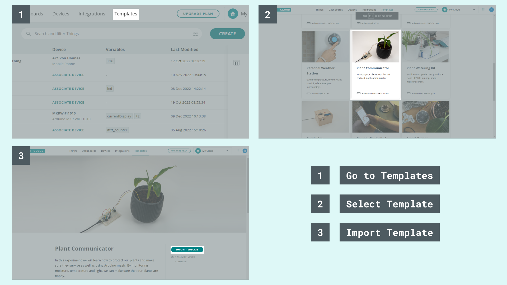
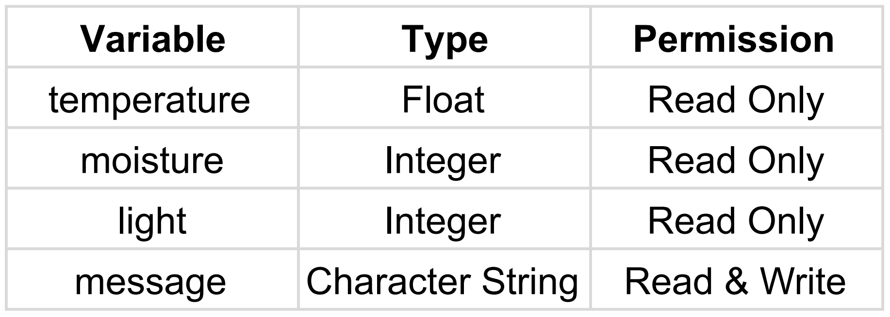
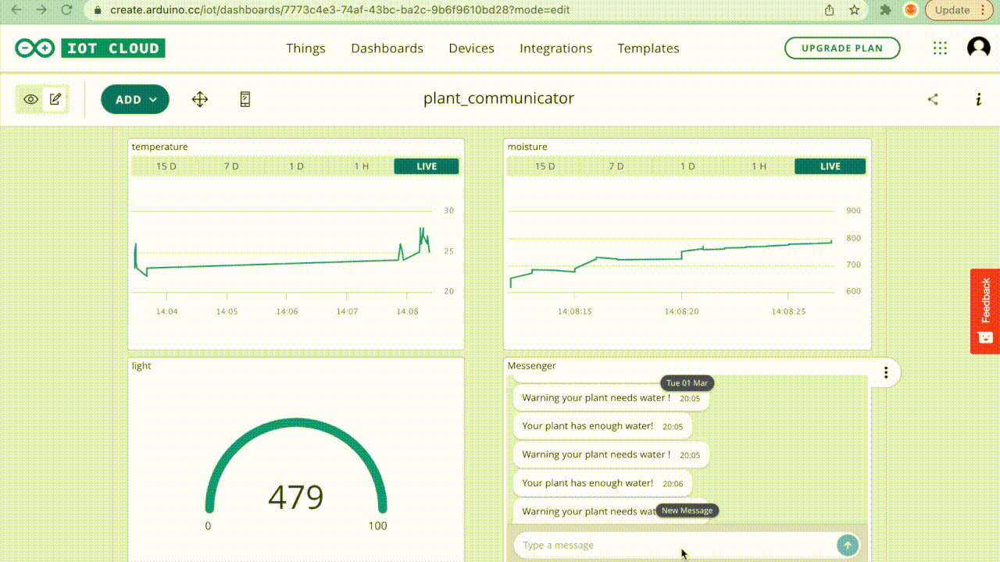

## Components and Supplies

- [Arduino IoT Bundle](https://store.arduino.cc/iot-bundle)

## Apps and Online Services

- [Arduino IoT Cloud](https://cloud.arduino.cc)
- [Arduino IoT Cloud Remote app](https://play.google.com/store/apps/details?id=cc.arduino.cloudiot&hl=en&gl=US)

## About This Project

**Create a plant communicator with the help of the Arduino IoT Cloud!**

As the English poet William Wordsworth once said:

"Your mind is the garden, your thoughts are the seeds, the harvest can be either flowers or weeds."

Keeping our plants alive can be quite the challenge as there’s a lack of clear communication between us and plants. One way to keep them happy is to bring our plants with us, but maybe we don't want to lug around with that big-ole-cactus or fern sticking out of our winter jacket pockets. Also, most plants dislike the cold. After spending months trying to communicate with our Spider Plant, we gave up and used the IoT Bundle components together with the Arduino IoT Cloud to create a device that remotely surveys the well being of any plant instead.

### In a Nutshell

In this experiment we will learn how to protect our plants and make sure they survive as well as using Arduino magic. By monitoring moisture, temperature and light, we can make sure that our plants are happy.

By the end of this project, your plant will communicate its needs with you visually and show you how it's currently doing through the Arduino IoT CLoud.

### Components

* TMP36 temperature sensor
* Phototransistor
* DIY moisture sensor

> **Note:** to achieve all the functions demonstrated in this project, you would need a subscription to the Arduino IoT Cloud. The project can be carried without an Arduino IoT Cloud subscription by removing one of the variables (Light, Temperature, or moisture).

### Learning Goals

* Introducing the Arduino IoT Cloud
* Introducing the Arduino IoT Remote app
* Building a DIY moisture sensor
* Creating an Arduino IoT Cloud Dashboard

### Want to Know More?

This tutorial is part of a series of experiments that familiarize you with the Arduino RP2040 and IoT. All experiments can be built using the components contained in the IoT Bundle.

* [I Love You Pillow with the Arduino IoT Bundle ](/tutorials/iot-bundle/i-love-you-pillow)
* [Puzzle Box with Arduino IoT Bundle ](/tutorials/iot-bundle/puzzlebox)
* [Pavlov's Cat with the Arduino IoT Bundle](/tutorials/iot-bundle/pavlovs-cat)
* [The Nerd with the Arduino IoT Bundle](/tutorials/iot-bundle/the-nerd)

### Setting up the Arduino IoT Cloud

If you are new to the Arduino IoT Cloud, check out our [Getting Started Guide](https://docs.arduino.cc/arduino-cloud/getting-started/iot-cloud-getting-started).

### Template

To connect your board to the Arduino IoT Cloud, we will use the [Plant Communicator Template](https://create.arduino.cc/iot/templates/plant-communicator). This template installs a specific sketch on your board and creates a dashboard that allows you to interact with your board: you don't need to write any code at all! 

See the image below to understand how to set it up.



We will start by setting up the Arduino IoT Cloud by following the steps below:

* **Login** to your Arduino Create account
* Creating a **Thing**
* Attaching a **Device**
* Adding **Variables**
* Adding **Network** credentials


Setting up the Arduino IoT Cloud

### Variables

We will start by adding four variables:



### Setup Hardware & Sketch

**DIY soil moisture**

Two wires placed in the soil pot form a variable resistor, whose resistance varies depending on soil moisture. This variable resistor is connected in a voltage divider configuration, and Arduino collects a voltage proportional to resistance between the 2 wires. Meaning that the more humid the soil is, the less voltage will be measured from the Arduino because the resistance in the soil decreases with its moisture. The dryer the soil is the higher resistance is. Using the 1 Mega Ohm resistor and two wires, we can create our DIY soil moisture sensor.


That value will be used to set a threshold so that the Arduino will know when your plants need water. Add the code shown below to your sketch and test the moisture levels of your plant. The values are shown in the serial monitor.

```
#include "thingProperties.h"  
int moisturePin = A2;  
/* Set this threeshold accordingly to the resistance you used */  
/* The easiest way to calibrate this value is to test the sensor in both dry and wet earth */  
int threshold = 800;  
void setup() {  
 /* Initialize serial and wait for port to open: */  
 Serial.begin(9600);  
 /* This delay gives the chance to wait for a Serial Monitor without blocking if none   is found */  
 delay(1500);  
 /* Defined in thingProperties.h */  
 initProperties();  
 /* Connect to Arduino IoT Cloud */  
 ArduinoCloud.begin(ArduinoIoTPreferredConnection);  
 /*  
 The following function allows you to obtain more information  
 related to the state of network and IoT Cloud connection and errors  
 the higher number the more granular information you’ll get.  
 The default is 0 (only errors).  
 Maximum is 4  
 */  
 setDebugMessageLevel(2);  
 ArduinoCloud.printDebugInfo();  
}  
void loop() {  
 ArduinoCloud.update();  
 moisture = get_average_moisture();  
 Serial.print("moisture ");  
 Serial.println(moisture);  
 /* assign the message variable based on water levels */  
 if (moisture > threshold) {  
 message = "Warning your plant needs water!"; /* Insert here your emergency message */  
 } else {  
 message = "Your plant has enough water!";  
 }  
 Serial.println(message);  
}  
int get_average_moisture() {  
 int tempValue = 0; /* variable to temporarily store moisture value */  
 /* make an average of 10 values to be more accurate */  
 for (int a = 0; a < 10; a++) {  
 tempValue += analogRead(moisturePin);  
 delay(100);  
 }  
 return tempValue / 10;  
}  
/*  
Since Message is READ_WRITE variable, onMessageChange() is  
executed every time a new value is received from IoT Cloud.  
*/  
void onMessageChange()  {  
 /* Add your code here to act upon Message change */  
}
```

**Light & temperature sensors**

See the schematic below to wire up the two sensors. We will use these two functions to read values from the sensors:


```
#include "thingProperties.h"  
int lightPin = A0; /*the analog pin the light sensor is connected to */  
int tempPin = A1; /*the analog pin the TMP36's Vout (sense) pin is connected to */  
int moisturePin = A2;  
/* Set this threshold accordingly to the resistance you used */  
/* The easiest way to calibrate this value is to test the sensor in both dry and wet earth */  
int threshold = 800;  
void setup() {  
 /* Initialize serial and wait for port to open: */  
 Serial.begin(9600);  
 /* This delay gives the chance to wait for a Serial Monitor without blocking if none is found */  
 delay(1500);  
 /* Defined in thingProperties.h */  
 initProperties();  
 /* Connect to Arduino IoT Cloud */  
 ArduinoCloud.begin(ArduinoIoTPreferredConnection);  
 /*  
 The following function allows you to obtain more information  
 related to the state of network and IoT Cloud connection and errors  
 the higher number the more granular information you’ll get.  
 The default is 0 (only errors).  
 Maximum is 4  
 */  
 setDebugMessageLevel(2);  
 ArduinoCloud.printDebugInfo();  
}  
void loop() {  
 ArduinoCloud.update();  
 light = analogRead(lightPin); /* assign light variable to light sensor values */  
 Serial.print("light ");  
 Serial.println(light);  
 temperature = get_temperature(); /* assign temperature variable to temperature in Celsius */  
 Serial.print("temperature ");  
 Serial.println(temperature);  
  
 moisture = get_average_moisture();  
 /* assign the message variable based on water levels */  
 if (moisture > threshold) {  
 message = "Warning your plant needs water!"; /* Insert here your emergency message */  
 } else {  
 message = "Your plant has enough water!";  
 }  
}  
int get_average_moisture() {  
 int tempValue = 0; /* variable to temporarily store moisture value */  
 /* make an average of 10 values to be more accurate */  
 for (int a = 0; a < 10; a++) {  
 tempValue += analogRead(moisturePin);  
 delay(100);  
 }  
 return tempValue / 10;  
}  
float get_temperature() {  
 int reading = analogRead(tempPin);  
 float voltage = reading * 3.3;  
 voltage /= 1024.0;  
 /* temperature in Celsius */  
 float temperatureC = (voltage - 0.5) * 100 ; /*converting from 10 mv per degree with 500 mV offset */  
 /* Convert to Fahrenheit */  
 float temperatureF = (temperatureC * 9.0 / 5.0) + 32.0;  
 return temperatureC;  
}  
void onMessageChange()  {  
 /* Add your code here to act upon Message change */  
}
```

Note that you can use the Fahrenheit units by returning temperatureF instead of temperatureC at the end of the **“get\_temperature()”** function.

### Dashboard

The final step to deploying our project is adding a control panel using the Arduino IoT Dashboards. We can navigate to **Dashboards -> Build Dashboard -> ADD,** then we can add four widget and link them to the variable as the following:

* Graph widget -> temperature variable
* Graph widget -> moisture variable
* Gauge widget -> light variable
* Messenger widget -> message variable


Now, we can see a visual representation of our sensor data.



Congratulations you have now build your own DIY plant communicator showing how your plants are doing using the IoT Bundle and IoT Cloud.

### Want to Know More?

This tutorial is part of a series of experiments that familiarize you with the Arduino IoT Bundle. All experiments can be built using the components contained in the IoT Bundle.

* [I Love You Pillow with the Arduino IoT Bundle ](/tutorials/iot-bundle/i-love-you-pillow)
* [Puzzle Box with Arduino IoT Bundle ](/tutorials/iot-bundle/puzzlebox)
* [Pavlov's Cat with the Arduino IoT Bundle](/tutorials/iot-bundle/pavlovs-cat)
* [The Nerd with the Arduino IoT Bundle](/tutorials/iot-bundle/the-nerd)

## Full Code

<iframe src="https://create.arduino.cc/editor/Arduino_Genuino/8f464fc9-2bf5-488b-8ffa-540991bf9da3/preview?embed" style="height:510px;width:100%;margin:10px 0" frameborder="0"></iframe>