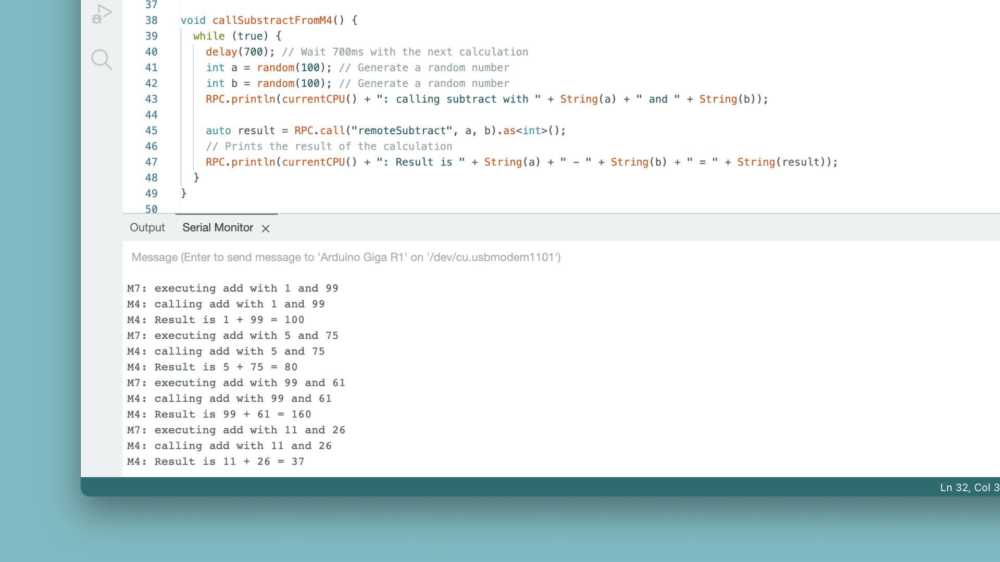

The GIGA R1's microcontroller, the **STM32H747XI** has two processor cores, the **M7** and **M4**, clocking in at 480MHz and 240Mhz respectively. 

Having two cores in a microcontroller brings significant advantage:
- You can run two "main" applications simultaneuously on each core.
- The cores can communicate with them through something called **Remote Procedure Call (RPC)**. 

## Goals

In this tutorial, we will take a closer look at how to make use of the dual core, by:
- Set up the **M7 core** as a "server", responding to calls from the M4 core.
- Set up the **M4 core** as a "client", making calls to the M7 core.
- Spawn a thread that runs independently on the M4 core.
- Learn how the `RPC` library is implemented, and how it used for communication between the M4 and M7 cores.

## Hardware & Software Needed

The hardware needed for this project:

- [GIGA R1](/hardware/giga-r1) / [GIGA R1 WiFi](/hardware/giga-r1-wifi)

You will also need a version of the Arduino IDE installed.

- [Arduino IDE](https://www.arduino.cc/en/software)

***You will also need the Arduino Mbed OS GIGA Boards core installed. You can follow the [Getting Started with GIGA R1](/tutorials/giga-r1/giga-getting-started) guide to install it.***

## Remote Procedure Call (RPC)

RPC is a method that allows programs to make requests to programs located elsewhere. It is based on the client-server model (also referred to as caller/callee), where the client (caller) makes a request to the server (callee). 

An RPC is a synchronous operation, and while a request is being made (client/caller) to another system, the operation is suspended. On return of the results, the operation is resumed. On the other side, (server/callee) performs the subroutine on request, and suspends any other operation as well. After it sends the result to the client, it resumes its operation, while waiting for another request.


### RPCs in the Arduino Environment

As some microcontrollers, including the **STM32H747XI**, have two processors, it is possible to program them both to perform individual tasks, and enable communication between them via an RPC.

The advantage of this is great, as you essentially have "two Arduino boards" running on the some board. For example, you can run a machine learning module on one of the core, while another core is connected to a network system such as the [Arduino IoT Cloud](https://create.arduino.cc/iot/). Running these applications in parallel increases performance, as you split the work load and allow them to run with less blocking code for example.


### RPC vs Multi-Threading

RPCs are often associated with, but is not identical to [multi-threading](https://github.com/arduino-libraries/Arduino_Threads). Multi-threading essentially allows you to run code asynchronously on a single processor, and create communication lines between the threads.

RPC on the other hand, is a way of communicating between two systems, or in this case, two processors.

Both methods are great to apply in more sophisticated and performance-craving projects, as you can combine the two methods to create several threads, running on separate cores.

### Use Cases

RPC and Multi-Threading can be used for several different setups. Here are some good combinations that can be considered:

- Use **Core A** for networking (e.g. publishing to a MQTT channel) and **Core B** for data recording & analysis.
- Use **Core A** for image capturing, and **Core B** for image processing.
- Use **Core A** for storing sensor data locally (USB/SD) and **Core B** for streaming it to a cloud service.

## RPC & Threads API

The RPC implementation for the GIGA R1 is based on the [RPC library](https://github.com/bcmi-labs/ArduinoCore-mbed/tree/master/libraries/RPC), a library included in the GIGA core.

To follow the tutorial in this article, it is good to become familiar with some of the core concepts & methods of this implementation.

### RPC Class

The `RPC` class contains all related RPC functions, including:
- `RPC.begin()` - initialises the library and boots the M4 core.
- `RPC.bind("name", function)` - create a defined name that is bound to a function. 
- `RPC.call("name", arg)` - calls the defined name across the cores.
- `RPC.println()` - works like the classic `Serial.println()`, but needs a receiver to work.
- `RPC.available()` - checks for any serial data. 
- `RPC.read()` - reads serial data and (optionally) you can write it to a buffer like `buffer += (char)RPC.read();`, and print it via  `Serial.print(buffer)`.

***Many of the functionalities of the `RPC` class is very similar to the classic [Serial](https://www.arduino.cc/reference/en/language/functions/communication/serial/) class, which itself depends on the [Stream](https://www.arduino.cc/reference/en/language/functions/communication/stream/) class.***

### Core Control

To control the separate cores, it is still a good idea to write a single sketch that is uploaded to both cores. 

It is rather straightforward to separate the two cores in your program, and mainly if you in each sketch include the following function:

```arduino
String currentCPU() {
  if (HAL_GetCurrentCPUID() == CM7_CPUID) {
    return "M7";
  } else {
    return "M4";
  }
}
```

Implementing this function allows you to control either core through a simple `if` statement.

```arduino
void loop(){
  if (currentCPU() == "M7") {
    //control M7
  }
  if (currentCPU() == "M4") {
    //control M4
  }
}
```

Simple as that!

### Threads

Another concept that is also important and perhaps a bit more advanced, is the concept of **threads.**

As the GIGA R1 is based on [MbedOS](https://os.mbed.com/docs/mbed-os/v6.15/apis/thread.html), we can make use of the `Thread` class.

This allows you to create tasks that run in parallel with your main application. These can either be designed to run forever, until a condition is met or after a time has elapsed. 

To use it, we need to include the following at the top of our code:

```cpp
using namespace rtos;
Thread myThread; //creates a thread
```

We can then launch the new thread by using the following command:

```arduino
myThread.start(process);

void process() {
  //put code here to run
}
```

If you'd like to terminate the thread, you can use:

```arduino
myThread.terminate()
```

***Read more about the [Thread](https://os.mbed.com/docs/mbed-os/v6.15/apis/thread.html) and [ThisThread](https://os.mbed.com/docs/mbed-os/v6.15/apis/thisthread.html) (links leads to MbedOS documentation).***

## GIGA R1 RPC Tutorial

The GIGA R1's **STM32H747XI** microcontroller includes the M7 and M4 core, which can be programmed separately. 

As described in the previous sections, these cores can perform individual tasks, but also be linked together, through RPC.

In this example, we will program each core individually, but using the **same sketch**. This sketch includes all of the functions running on separate cores, so that you can easily see what is going on. The sketch used is in itself thoroughly documented with useful hints on how it works.

### Step 1: Upload Sketch to M4 Core

To follow this tutorial, you need a version of the Arduino IDE, and the GIGA core installed. If you need help setting this up, visit the [Getting Started with GIGA R1 guide](/tutorials/giga-r1/giga-getting-started).

Installing the core also installs the dependencies, such as the `RPC` library needed.

**1.1** Open the Arduino IDE and install the required core. Connect the board to your computer, and select it in the top left corner.


**1.2** Navigate to **Tools > Flash Split** and select **1.5MB M7 + 0.5MB M4**.


**1.3** Navigate to **Tools > Target core** and select **M4 Co-processor**.


**1.4** Navigate to **File > Examples > RPC > RPC_m4** which will open a new example. Upload this code to the board.

>The example is also available just below.

```arduino
#include "Arduino.h"
#include "RPC.h"

using namespace rtos;

Thread subtractThread;

/**
 * Returns the CPU that's currently running the sketch (M7 or M4)
 * Note that the sketch has to be uploaded to both cores. 
 **/
String currentCPU() {
  if (HAL_GetCurrentCPUID() == CM7_CPUID) {
    return "M7";
  } else {
    return "M4";
  }
}

/**
 * Adds two numbers and returns the sum
 **/
int addOnM7(int a, int b) {
  Serial.println(currentCPU() + ": executing add with " + String(a) + " and " + String(b));
  delay(700); // Simulate work
  return a + b;
}

/**
 * Subtracts two numbers and returns the difference
 **/
int subtractOnM7(int a, int b) {
  Serial.println(currentCPU() + ": executing subtract with " + String(a) + " and " + String(b));
  delay(700); // Simulate work
  return a - b;
}

void callSubstractFromM4() {
  while (true) {
    delay(700); // Wait 700ms with the next calculation
    int a = random(100); // Generate a random number
    int b = random(100); // Generate a random number
    RPC.println(currentCPU() + ": calling subtract with " + String(a) + " and " + String(b));
    
    auto result = RPC.call("remoteSubtract", a, b).as<int>();
    // Prints the result of the calculation
    RPC.println(currentCPU() + ": Result is " + String(a) + " - " + String(b) + " = " + String(result));
  }
}

void setup() {

  pinMode(LED_BUILTIN, OUTPUT);

  // Initialize RPC library; this also boots the M4 core
  RPC.begin();
  Serial.begin(115200);
  //while (!Serial) {} // Uncomment this to wait until the Serial connection is ready

  // Both CPUs will execute this instruction, just at different times
  randomSeed(analogRead(A0)); // Initializes the pseudo-random number generator

  if (currentCPU() == "M7") {
    // M7 CPU becomes the server, so it makes two functions available under the defined names
    RPC.bind("remoteAdd", addOnM7);
    RPC.bind("remoteSubtract", subtractOnM7);
  } 

  if (currentCPU() == "M4") {
    // M4 CPU becomes the client, so spawns a thread that will call subtractOnM7() every 700ms
    subtractThread.start(callSubstractFromM4);
  }
}

void loop() {

  if (currentCPU() == "M4") {
    // On M4 let's blink an LED. While it's blinking, the callSubstractFromM4() thread is running, 
    // so it will execute roughly 3 times (2000 / 700 ms)
    digitalWrite(LED_BUILTIN, LOW);
    delay(1000);
    digitalWrite(LED_BUILTIN, HIGH);
    delay(1000);

    int a = random(100);
    int b = random(100);
    // PRC.print works like a Serial port, but it needs a receiver (in this case the M7) 
    // to actually print the strings to the Serial port
    RPC.println(currentCPU() + ": calling add with " + String(a) + " and " + String(b));
    // Let's invoke addOnM7() and wait for a result.
    // This will be delayed by the forced delay() in addOnM7() function
    // Exercise: if you are not interested in the result of the operation, what operation would you invoke?
    auto result = RPC.call("remoteAdd", a, b).as<int>();    
    RPC.println(currentCPU() + ": Result is " + String(a) + " + " + String(b) + " = " + String(result));
  }
  
  if (currentCPU() == "M7") {
    // On M7, let's print everything that is received over the RPC1 stream interface
    // Buffer it, otherwise all characters will be interleaved by other prints
    String buffer = "";
    while (RPC.available()) {
      buffer += (char)RPC.read(); // Fill the buffer with characters
    }

    if (buffer.length() > 0) {
      Serial.print(buffer);
    }
  }
}
```

**1.5** Upload the sketch to the board. You have now uploaded a sketch to the **M4 core**.

### Step 2: Upload Sketch to M7 Core

This step is almost identical to Step 1, and we will upload the exact same code. The only action we need to do is changing the **Target Core**.

**2.1** Navigate to **Tools > Target core** and select **Main Core**.

**2.2** Upload the same sketch to the board (from Step 1.4).

**2.3** Open the Serial Monitor, where you should see some calculations printed. 



### Code Example Explained

The example sketch is well documented itself, but let's summarize what this example does:
- The M4 and M7 cores are programmed with an **identical** sketch. From inside the sketch, the `currentCPU()` is used frequently to check which core is being used.
- A thread called `subtractThread` is created which loops the `callSubstractFromM4()` function (only on M4 core).
- On the M7, two functions, `addOnM7()` and `subtractOnM7()` are made available to be called via `RPC`. To call them, we use the `"remoteAdd"` and `"remoteSubtract"` strings.
- These functions can be called from the M4, by simply using `RPC.call("remoteAdd", a, b)` (`a` and `b` the value returned).

The functions demonstrated in this example are very primitive, they only add, or subtract two values. 

But it demonstrates the key concept, which is that we are making use of both cores: one as a server (M7) and one as a client (M4). Simply put, the M4 requests a service to be performed, and the M7 executes it, and returns the values.

***Please note that in this example, we are using `delay()` to simulate a task being performed. It is not very practical to use the `delay()` function, particularly for higher performance applications, as it is a blocking function.*** 

## Conclusion

At the end of this tutorial, we have achieved communication between the M4 and the M7 core, via something called **RPC**.

The GIGA R1 is at a really good advantage due to this feature, as it can perform tasks in parallel, and limit the use of blocking code. 

We presented earlier in this article, some good [use cases](#use-cases), and some key concepts that are valuable to learn when working with two cores on a microcontroller.