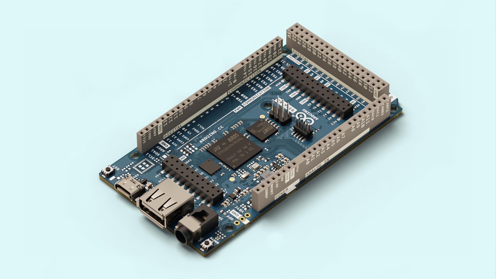
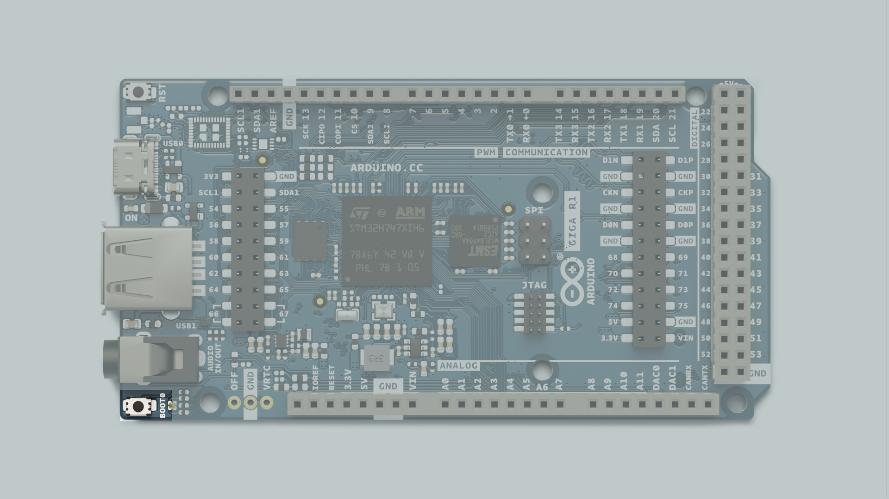
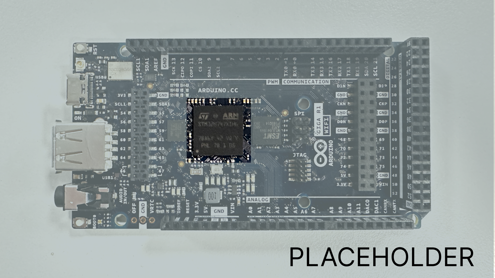
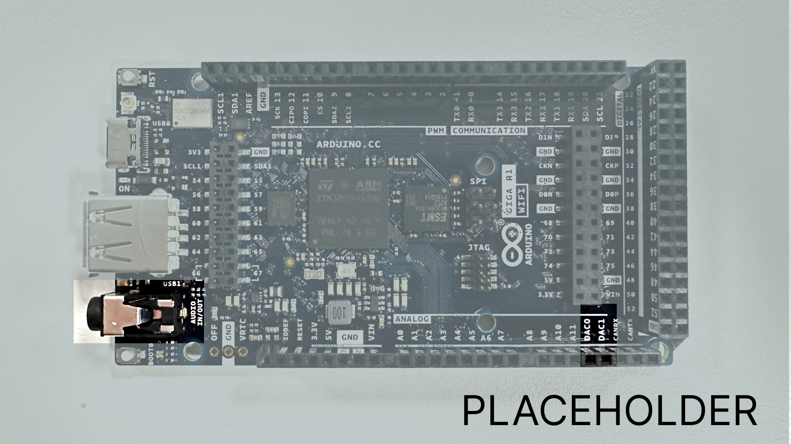
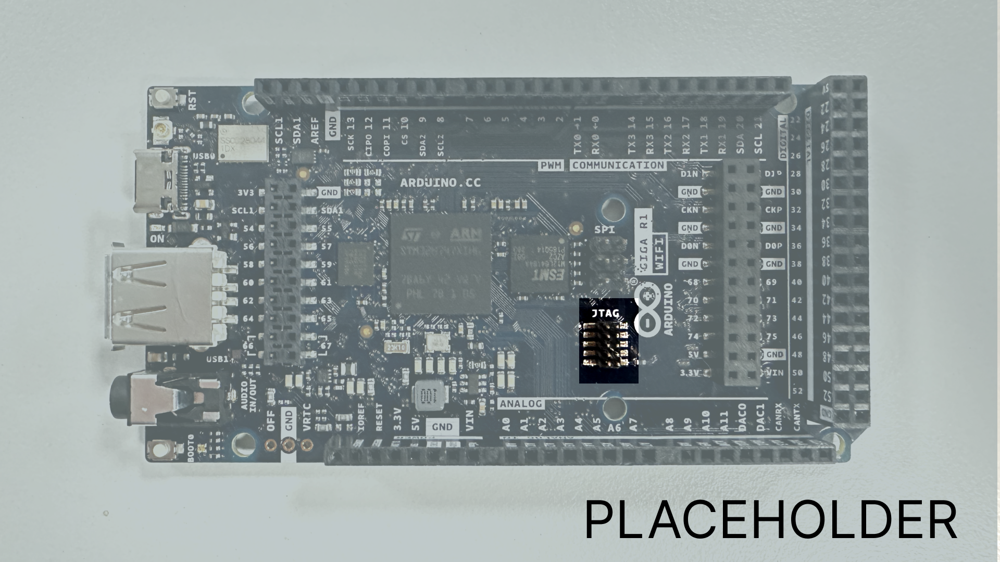
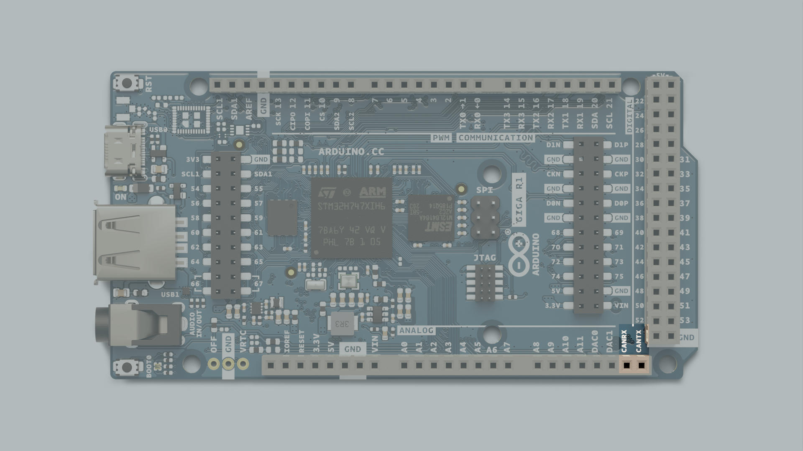
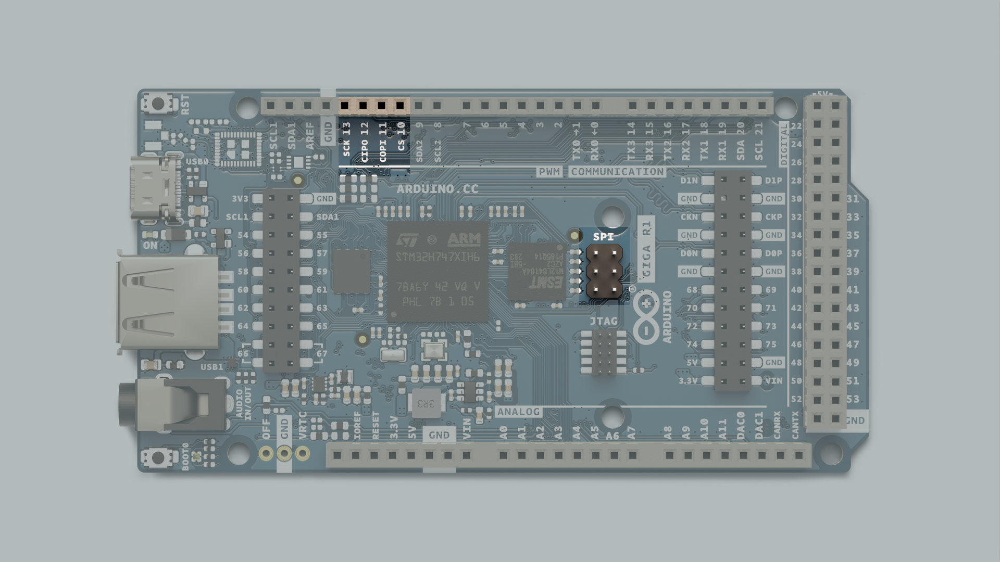
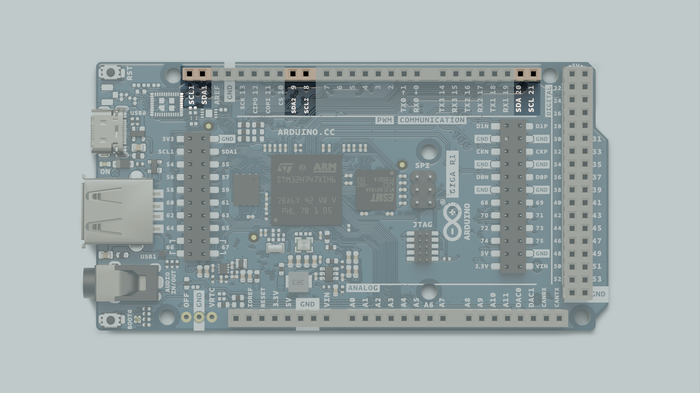

The **Arduino GIGA R1** is one of our most feature-packed Arduino boards to date, supported by the same powerful, ML-capable, dual-core microcontroller found in the Pro family's Portenta H7. It features support for display connectors, USB-host, an Audio Jack, an Arducam connector, a CAN bus, 4 UART Serial Ports, 2 I2C buses, dedicated DAC Pins, and much, much more. 

This article is a collection of resources and guides to make use of every great feature of this powerful hardware.

You can also visit the documentation platform for the [Arduino GIGA R1](/hardware/giga-r1)

## Datasheet
The full datasheets are available as a downloadable PDF from the link below:

- [Download the Arduino GIGA R1 datasheet](docs.arduino.cc/resources/datasheets/ABX00067-datasheet.pdf)

## Power Supply

To power the **Arduino GIGA R1** you may either use a USB-C cable, or the VIN pin. 

If you're using the USB-C connector you must power it with 5V.

Powering the board with the VIN pin gives you more options, as you can safely power the board with any voltage between 6-24V.

By connecting the OFF pin to GND you can cut the power supply to the board, turning it off completely. Read more about this feature in the [OFF-pin](#off-pin) section of this article

It should however be noted that the internal operating voltage of the microcontroller is 3.3V, and you should not apply voltages higher than that to the GPIO pins.

## Installation

The **Arduino GIGA R1** can be programmed through:

- The **Classic Arduino IDE 1.8.X**, 
- the **Arduino IDE 2.0.X**, 
- the OpenMV IDE,
- and the Web-editor. 

To set the board up to be programmed with the OpenMV IDE in MicroPython, check out the [Boot0 section](#boot0) of this article.

### Core
The Arduino GIGA R1 uses the [Arduino Core for mbed devices](https://github.com/arduino/ArduinoCore-mbed).

### Boot0
Pressing and holding the button labelled `BOOT0` on the board while powering the board will boot it into DFU-mode (Device Firmware Update), letting you reflash the bootloader without the use of external hardware, if you were to ever need to. 



The state of this button can also be read from a sketch while it is running, giving you a basic interactive component without needing to do any wiring.

To read the state of the Boot0 button in your sketch, you use this line of code:
```arduino
digitalRead(PC_13);
```

Booting the board into DFU-mode will also let you configure it with the OpenMV IDE to program the board with MicroPython, to for example deploy a trained ML model analysing a real time camera feed.

## STM32H747XI Microcontroller

The Arduino GIGA R1 boards feature the powerful dual core **STM32H747XI** microcontroller found on the Arduino PRO familys Portenta H7 board, but in a form factor accessible to any maker who has tinkered with an Arduino board before. 

The **STM32H747XI** is a powerful dual core chip, capable of being programmed with a high-level language such as MicroPython on one core, while simultaneously running Arduino compiled code on the other, and having the two programs communicate with each other seamlessly.



The microcontroller operates on a voltage of 3.3V, applying a higher voltage than that, such as 5V, to a pin might damage the microcontroller.

## RAM
The **Arduino GIGA R1** has 1 MB of SRAM that is internal to the processor, and 8MB of SDRAM which you can access and write to. 

To access the SDRAM you need to use the SDRAM library, include it in your sketch with:
```arduino
#include "SDRAM.h"
```

Before writing to the SDRAM, you need to allocate it, the following code will create an array that reserves 7MB of the SDRAM for you to write to.
```arduino
 uint8_t* myVeryBigArray = (uint8_t*)SDRAM.malloc(7 * 1024 * 1024);
```
If you now store any data in this array, it will be written to SDRAM.
```arduino
for (int i = 0; i<128; i++) {
        myVeryBigArray[i] = i;
    }
```

When you no longer need to use the SDRAM, you can free it, so it can be used for other things.
```arduino
SDRAM.free(myVeryBigArray);
```


## Flash Memory
The **Arduino GIGA R1** has 2MB of internal, and 16MB of external Flash storage.
The external Flash storage on the **Arduino GIGA R1** is QSPI and can be accessed and used to store data. If you need to, you can configure the board to act as a USB flash drive, so you can store files such as images, audio, and more.

The GIGA firmware has full support for FATFS and littleFS.

To access the QSPI flash storage as a USB flash drive, you need to follow a few steps, first you need to update the WiFi modules firmware, then you need to create partitions on the flash storage, before finally exposing the partitions to be detected by a computer. These three steps are broken down into different built in example sketches that conveniently all come with the GIGA core.

Firstly, navigate in the IDE menu to `File > Examples > STM32H747_System > WiFiFirmwareUpdater` and upload the sketch to your board. 

In the Serial monitor you will now be able to interface with the board. Follow the instructions by sending a "**y**" in the monitor. You will now see the progress of the firmware update, don't power off the board until you see a message telling you that it is safe.

After completing this, the next step is to partition the flash storage. Navigate to `File > Examples > STM32H747_System > QSPIFormat` and upload the sketch. From here, your interaction with the board will be very similar to when you updated the WiFi firmware. In the serial monitor, you will get the option to choose from two partition schemes. For this purpose, partition scheme 1 is good. Again, send "**y**" in the serial monitor and wait for confirmation before powering the board off. 

Lastly, navigate to `File > Examples > USB Mass Storage > AccessFlashAsUSBDisk` and upload the sketch. 

Once this is completed, you should now see a new storage device connected as a portable storage device in your computer.

This can be very useful, as this flash storage **does not get deleted when you upload a new sketch to the board.** Meaning that you can store files on the board, and then upload a new sketch that can access and use those files without the need for an SD card and card reader.

***Note: In this configuration, the USB serial port used for serial communication with the computer is occupied, so you won't be able to send or read information in the serial monitor. **This includes uploading new sketches.** To upload a new sketch you need to put the **Arduino GIGA R1** in DFU mode by double pressing the RST button.***

## Audio Jack
The **Arduino GIGA R1** features an audio jack, with 2x DAC channels, and 1x ADC channel, meaning that it is capable of reading input from a microphone, as well as outputting sound through a speaker. 



The Audio jack is connected to pins A12 and A13, also labelled DAC0 and DAC1.

Both of these come with caveats, though. As there is no amplifier circuit on the board itself, driving a high impedance speaker directly without an amplifier circuit could cause damage to the board, and microphone input without an amplifier circuit between the microphone and the board may sound dim. 

In the coming sections we will provide resources and basic information on how to use the audio jack as both an input and an output. 


### Output
In order to output audio from the DAC, you can use the `AdvancedAnalogRedux` library from Arduino. You will need to connect a speaker to your board either with the headphone jack or the dac pins.

Include the library and setup the DAC with the following code in the beginning of your sketch, outside of the `void setup()` function:

```arduino
#include "AdvancedDAC.h"

AdvancedDAC dac(A12);

```

Then, initialize the library, and check that everything went as expected with the following piece of code:

```arduino
 if (!dac.begin(AN_RESOLUTION_12, 8000, 32, 64)) {
        Serial.println("Failed to start DAC!");
        while (1);
    }
```

Then lastly, add the following code to `void loop()` to start:
```arduino
if (dac.available()) {

        // Get a free buffer for writing
        SampleBuffer buf = dac.dequeue();

        // Write data to buffer
        for (int i=0; i<buf.size(); i++) {
            buf.data()[i] =  (i % 2 == 0) ? 0: 0xfff;
        }

        // Write the buffer data to DAC
        dac.write(buf);
    }
```

The options for audio playback and generation on your Arduino GIGA R1 are **much** more vast than this, however. To learn about audio playback in depth, check out the [audio guide](../giga-audio/content.md).

### Input
The audio jack on the Arduino GIGA R1 is not just connected to the DAC pins, however, but are also connected to pin A7, for microphone capabilities. 

To take advantage of this, you can use the `AdvancedAnalogRedux` library from Arduino, start off by including the library and setting up the pin as an advanced ADC pin in the beginning of your sketch, outside of `void setup()`.

```arduino
#include "AdvancedADC.h"

AdvancedADC adc(A7);
```

Now, initialise the library and run a check to make sure everything went as expected with the following code within `void setup()`:
```arduino

  Serial.begin(9600);

  // Resolution, sample rate, number of samples per channel, and queue depth of the ADC
   if (!adc.begin(AN_RESOLUTION_16, 16000, 32, 64)) {
       Serial.println("Failed to start analog acquisition!");
       while (1);
   }
```
Finally, read the ADC, and store it in a way that you can use it, do this within `void loop()`:
```arduino
  if (adc.available()) {
        SampleBuffer buf = adc.read();

        // Print first sample
        Serial.println(buf[0]);

        // Release the buffer to return it to the pool
        buf.release();
```

The options for audio input on your Arduino GIGA R1 are **much** more vast than this, however. To learn about audio recording in depth, check out the [audio guide](../giga-audio/content.md).

## MIPI Display Interface
The **STM32H747XI** has an internal 2D graphics accelerator with support for resolutions up to 1024x768, it also has the ability to encode and decode JPEG codec. This is what allows the **Arduino GIGA R1** to boast a 2 lane MIPI display interface. 

This means that the **Arduino GIGA R1** is capable of driving a touch-display large enough to build a substantial user interface. The [LVGL](https://lvgl.io) library is a powerful tool to quickly build a responsive interface.

## USBHost
The USB-A port you find on the **Arduino GIGA R1** is configured as a host-only port, meaning that it cannot be used to program the board, instead it is used to connect peripherals to the board. The board can receive keyboard input effectively enabling a few hundred more inputs without any wiring, or be used to read files off of a USB flash drive, if you for example want to play audio files on a speaker you have plugged in the audio jack.

There are several libraries you can use for the USBHost capabilities of the Arduino GIGA R1: 

- USBHost
- HIDHost
- PluggableUSBHID
- USBKeyboard

Some of these libraries are built in to the core and therefore you won't be required to download them separately. 

To learn in depth about how to use these powerful features, read the [USBHost Guide](../giga-usb/giga-usb.md) that contains in-depth walkthroughs for each of them.

## RTC

The **Arduino GIGA R1** features an RTC pin, giving you the ability to power the timekeeping circuitry with a coin cell battery to keep the time even when your board is turned off, for low power timekeeping. 

The following sketch will continuously print the time in the Serial monitor.
```arduino
#include "mbed.h"
#include <mbed_mktime.h>

constexpr unsigned long printInterval { 1000 };
unsigned long printNow {};

void setup() {
  Serial.begin(9600);
  RTCset();
}

void loop() {
      if (millis() > printNow) {
        Serial.print("System Clock:          ");
        Serial.println(getLocaltime());
        printNow = millis() + printInterval;
    }
}

void RTCset()  // Set cpu RTC
{    
  tm t;
            t.tm_sec = (0);       // 0-59
            t.tm_min = (52);        // 0-59
            t.tm_hour = (14);         // 0-23
            t.tm_mday = (18);   // 1-31
            t.tm_mon = (11);       // 0-11  "0" = Jan, -1 
            t.tm_year = ((22)+100);   // year since 1900,  current year + 100 + 1900 = correct year
            set_time(mktime(&t));       // set RTC clock                                 
}

String getLocaltime()
{
    char buffer[32];
    tm t;
    _rtc_localtime(time(NULL), &t, RTC_4_YEAR_LEAP_YEAR_SUPPORT);
    strftime(buffer, 32, "%Y-%m-%d %k:%M:%S", &t);
    return String(buffer);
}
```

To get accurate time, you'll want to change the values in `void RTCset()` to whatever time it is when you're starting this clock. As long as the VRTC pin is connected to power, the clock will keep ticking and time will be kept accurately.

## Camera Interface
The Arduino GIGA features an onboard arducam compatible connector, with support for **parallel**. 

Programming the board in the **MicroPython** language using the **OpenMV IDE** easily lets you get started with a neural network analysing a realtime camera feed with ML. 

## JTAG
The **Arduino GIGA R1** features a 2x5 pin JTAG (Joint Test Action Group) connector, giving advanced debug functionalities for more advanced users. 



## CAN Bus
The **Arduino GIGA R1** features a dedicated CAN bus. 



>**Note:** the CAN bus does not include a built in transceiver. If you need to use the CAN bus, you can add a transceiver as a breakout board.

CAN, or **Controller Area Network**, is a communication standard that allows microcontroller-based devices to communicate with each other without the need for a host computer. This means that building a complex system with many different subsystems within becomes much easier. 

This makes the **Arduino GIGA R1** a powerful option for complex multilayered systems, as it can be integrated into existing systems or be used to build a new one from scratch. 

The CAN pins on the **Arduino GIGA R1** are labelled `CANRX` and `CANTX`

## SPI 
The **Arduino GIGA R1** features two separate SPI (Serial Peripheral Interface) buses, one is configured on the 6 pin header labelled SPI, and the other is broken out into pin connections on the board. 

The pins used for SPI on the **Arduino GIGA R1** are the following:

(CIPO) - D12
(COPI) - D11
(SCK) - D13
(CS) - D10



To use SPI, we first need to include the [SPI](https://www.arduino.cc/en/reference/SPI) library.
```arduino
#include <SPI.h>
```
Inside `void setup()` we need to initialize the library
```arduino
SPI.begin()
```

## I2C Pins
I2C lets you connect multiple I2C compatible devices in series using only two pins. The controller will send out information through the I2C bus to a 7 bit address, meaning that the technical limit of I2C devices on a single line is 128. Practically, you're never gonna reach 128 devices before other limitations kick in.

The **Arduino GIGA R1** has three separate I2C buses of which two are usable without external components, letting you control more devices.

The pins used for I2C on the **Arduino GIGA R1** are the following:
- SDA - D20
- SCL - D21
- SDA1 
- SCL1
- SDA2 - D9
- SCL2 - D8



To connect I2C devices you will need to include the [Wire](https://www.arduino.cc/reference/en/language/functions/communication/wire/) library at the top of your sketch.
```arduino
#include <Wire.h>
```

Inside `void setup()` you need to initialize the library.
```arduino
Wire.begin()
```

And to write something to a device connected via I2C, we can use the following commands:
```arduino
Wire.beginTransmission(1); //begin transmit to device 1
Wire.write(byte(0x00)); //send instruction byte 
Wire.write(val); //send a value
Wire.endTransmission(); //stop transmit
```

If you pay close attention you may notice that there are three sets of I2C pins. The two first sets (SDA, SCL, SDA1, SCL1) have internal pullup resistors connected to them which are required to make them function as I2C pins. 

If you want to use the third set (SDA2, SCL2) as I2C pins you will need to use external pullup resistors.

## Serial/UART Pins
The **Arduino GIGA R1** supports, like every other Arduino board, serial communication with UART (Universal Asynchronous, Receiver-Transmitter). However, the **Arduino GIGA R1** board features 4 separate serial ports. 

This not only means that you may print different values to different ports and monitor them separately, which is useful enough in and of itself, but that you may also communicate with **4 different serial enabled devices** simultaneously. 

The pins used for UART on the **Arduino GIGA R1** are the following:

- RX0 - D0
- TX0 - D1
- RX1 - D19
- TX1 - D18
- RX2 - 17
- TX2 - 16
- RX3 - 15
- TX3 - 14

Each Serial port works in the same way as the one you're used to, but you use different functions to target them:
```arduino
Serial.begin(9600);
Serial1.begin(9600);
Serial2.begin(9600);
Serial3.begin(9600);
```

To send and receive data through UART, we will first need to set the baud rate inside `void setup()`.

```arduino
Serial1.begin(9600);
```

To read incoming data, we can use a while loop() to read each individual character and add it to a string.

```arduino
  while(Serial1.available()){
    delay(2);
    char c = Serial1.read();
    incoming += c;
  }
```

And to write something, we can use the following command:

```arduino
Serial1.write("Hello world!");
```

## Pins
The **Arduino GIGA R1** gives you access to more pins than any other Arduino board that is this accessible for makers. Many of them have special features that will be accounted for in the upcoming sections of this article. Keep reading to learn what you can do with them. 

If you just need a quick overview of the pins functionality, this is a full table of all the IO pins on the **Arduino GIGA R1**  

| Pin  | Function | Notes                   |
| ---- | -------- | ----------------------- |
| 0    | TX       | Serial communication    |
| 1    | RX       | Serial communication    |
| 2    | PWM      | PWM, Digital IO pin     |
| 3    | PWM      | PWM, Digital IO pin     |
| 4    | PWM      | PWM, Digital IO pin     |
| 5    | PWM      | PWM, Digital IO pin     |
| 6    | PWM      | PWM, Digital IO pin     |
| 7    | PWM      | PWM, Digital IO pin     |
| 8    | PWM/SCL2 | PWM, Digital IO, I2C    |
| 9    | PWM/SDA2 | PWM, Digital IO, I2C    |
| 10   | PWM/CS   | PWM, Digital IO, SPI    |
| 11   | PWM/COPI | PWM, Digital IO, SPI    |
| 12   | PWM/CIPO | PWM, Digital IO, SPI    |
| 13   | PWM/SCK  | PWM, Digital IO, SPI    |
| 14   | TX3      | Serial communication    |
| 15   | RX3      | Serial communication    |
| 16   | TX2      | Serial communication    |
| 17   | RX2      | Serial communication    |
| 18   | TX1      | Serial communication    |
| 19   | RX1      | Serial communication    |
| 20   | SDA      | Digital IO, I2C         |
| 21   | SCL      | Digital IO, I2C         |
| 22   | GPIO     | Digital IO pin          |
| 23   | GPIO     | Digital IO pin          |
| 24   | GPIO     | Digital IO pin          |
| 25   | GPIO     | Digital IO pin          |
| 26   | GPIO     | Digital IO pin          |
| 27   | GPIO     | Digital IO pin          |
| 28   | GPIO     | Digital IO pin          |
| 29   | GPIO     | Digital IO pin          |
| 30   | GPIO     | Digital IO pin          |
| 31   | GPIO     | Digital IO pin          |
| 32   | GPIO     | Digital IO pin          |
| 33   | GPIO     | Digital IO pin          |
| 34   | GPIO     | Digital IO pin          |
| 35   | GPIO     | Digital IO pin          |
| 36   | GPIO     | Digital IO pin          |
| 37   | GPIO     | Digital IO pin          |
| 38   | GPIO     | Digital IO pin          |
| 39   | GPIO     | Digital IO pin          |
| 40   | GPIO     | Digital IO pin          |
| 41   | GPIO     | Digital IO pin          |
| 42   | GPIO     | Digital IO pin          |
| 43   | GPIO     | Digital IO pin          |
| 44   | GPIO     | Digital IO pin          |
| 45   | GPIO     | Digital IO pin          |
| 46   | GPIO     | Digital IO pin          |
| 47   | GPIO     | Digital IO pin          |
| 48   | GPIO     | Digital IO pin          |
| 49   | GPIO     | Digital IO pin          |
| 50   | GPIO     | Digital IO pin          |
| 51   | GPIO     | Digital IO pin          |
| 52   | GPIO     | Digital IO pin          |
| 53   | GPIO     | Digital IO pin          |
| 54   | GPIO     | Digital IO pin          |
| 55   | GPIO     | Digital IO pin          |
| 56   | GPIO     | Digital IO pin          |
| 57   | GPIO     | Digital IO pin          |
| 58   | GPIO     | Digital IO pin          |
| 59   | GPIO     | Digital IO pin          |
| 60   | GPIO     | Digital IO pin          |
| 61   | GPIO     | Digital IO pin          |
| 62   | GPIO     | Digital IO pin          |
| 63   | GPIO     | Digital IO pin          |
| 64   | GPIO     | Digital IO pin          |
| 65   | GPIO     | Digital IO pin          |
| 66   | GPIO     | Digital IO pin          |
| 67   | GPIO     | Digital IO pin          |
| 68   | GPIO     | Digital IO pin          |
| 69   | GPIO     | Digital IO pin          |
| 70   | GPIO     | Digital IO pin          |
| 71   | GPIO     | Digital IO pin          |
| 72   | GPIO     | Digital IO pin          |
| 73   | GPIO     | Digital IO pin          |
| 74   | GPIO     | Digital IO pin          |
| 75   | GPIO     | Digital IO pin          |
| A0   | Analog in| Analog In               |
| A1   | Analog in| Analog In               |
| A2   | Analog in| Analog In               |
| A3   | Analog in| Analog In               |
| A4   | Analog in| Analog In               |
| A5   | Analog in| Analog In               |
| A6   | Analog in| Analog In               |
| A7   | Analog in| Analog In               |
| A8   | Analog in| Analog In               |
| A9   | Analog in| Analog In               |
| A10  | Analog in| Analog In               |
| A11  | Analog in| Analog In               |
| A12  | DAC0     | Analog In, DAC          |
| A13  | DAC1     | Analog In, DAC          |
| A14  | CANRX    | Analog In, CAN          |
| A15  | CANTX    | Analog In, CAN          |


### Analog Pins
The **Arduino GIGA R1** has 12 analog input pins that can be read with a resolution of 16 Bits, by using the `analogRead()` function.
```arduino
value = analogRead(pin, value);
```

The reference voltage of these pins is 3.3V. 

Pins A8, A9, A10 and A11 can not be used as GPIO, but are limited to use as analog input pins.


### PWM Pins
PWM (Pulse Width Modulation) capability allows a digital pin to emulate analog output by flickering on and off very fast letting you, among other things, dim LEDs connected to digital pins. 

The **Arduino GIGA R1** has 12 PWM capable pins, the PWM capable pins are 2-12. You may use them as analog output pins with the function: 
```arduino
analogWrite(pin, value);
```

### Digital Pins
The **Arduino GIGA R1** features more pins than any other Arduino board for makers, a full 76 digital pins. Though many of them serve another purpose and shouldn't be used for GPIO if you have other pins available.

- 0 - RX0
- 1 - TX0
- 8 - SCL2
- 9 - SDA2
- 10 - CS
- 11 - COPI
- 12 - CIPO
- 13 - SCK 
- 14 - TX3
- 15 - RX3
- 16 - TX2
- 17 - RX2
- 18 - TX1
- 19 - RX1
- 20 - SDA
- 21 - SCL 

The reference voltage of all digital pins is 3.3V.

### DAC Pins
The **Arduino GIGA R1** also has two DAC pins, A12 & A13, that can act as genuine analog output pins which means they are even more capable than PWM pins.
```arduino
analogWrite(pin, value);
```


These DAC pins have a default write resolution of 8-bits. This means that values that are written to the pin should be between 0-255.

However you may change this write resolution if you need to, to up to 12-bits:
```arduino
analogWriteResolution(12);
```

### OFF Pin
On the **Arduino GIGA R1** you will find a pin labelled **"OFF"**. If you connect this pin to ground, the board will power down even if power is supplied to the board.

You can install a flip-switch to the board to let you turn your device on and off easily, which can be a handy option for a more permanent fixture. 

## Miscellaneous 

### Interrupts 
If you're creating a project that relies heavily on accurate sensordata, and therefore need to ensure that you read the record any change in value, it can be difficult to write a program that does anything else well. This is because the microcontroller is busy trying to read the values constantly. To get around this you can use interrupts that can let you can be useful for reading input from for example a rotary encoder or a push button without putting any code in your loop function. 

This feature might be extra valuable to the maker with an **Arduino GIGA R1**, as their circuit gets more and more complex.

All GPIO pins on the **Arduino GIGA R1** can be used for interrupts. 

The syntax for creating an interrupt function should be included in `void setup()` and is as follows:
```arduino
attachInterrupt(digitalPinToInterrupt(pin), ISR, mode)
```

- `pin` represents the pin number of the pin your input sensor is connected to, 
- `ISR` is the function that is called whenever the interrupt is triggered, and should be defined bt you somewhere in your sketch.
- `mode` defines when the interrupt should be triggered, and can be one of four pre-defined modes.

The different modes that can be used are: 
- `LOW` triggers the interrupt when the pin is low.
- `CHANGE` triggers whenever the pin changes values.
- `RISING` triggers when the pin goes from low to high. 
- `FALLING` triggers when the pin goes from high to low.

This example sketch will turn on or off an LED connected to pin 13 whenever a pushbutton connected to pin 2 is pressed or released:

```arduino
const byte ledPin = 13;
const byte interruptPin = 2;
volatile byte state = LOW;

void setup() {
  pinMode(ledPin, OUTPUT);
  pinMode(interruptPin, INPUT_PULLUP);
  attachInterrupt(digitalPinToInterrupt(interruptPin), blink, CHANGE);
}

void loop() {
  digitalWrite(ledPin, state);
}

void blink() {
  state = !state;
}
```
