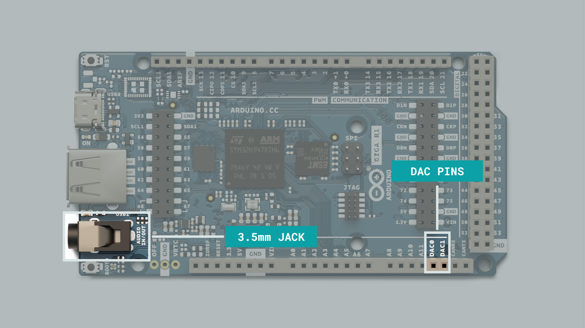
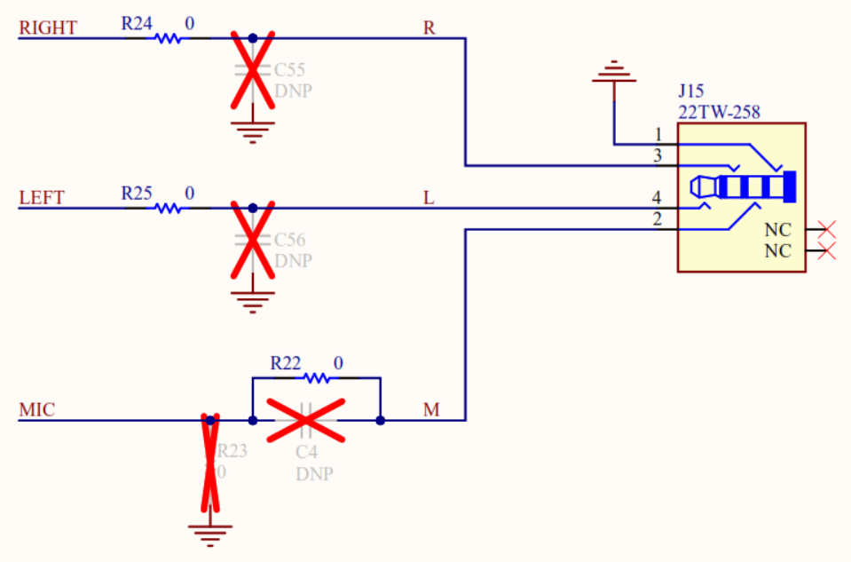

The GIGA R1 is one of the most feature-packed boards from Arduino up to date. In the GIGA R1, you can find the powerful STM32H747XI, a dual-core 32-bit Arm® Cortex® microcontroller from STMicroelectronics; this is the same microcontroller found in the Arduino Portenta H7 family boards. This guide will show you how to use the Arduino ecosystem to turn a versatile and powerful board like the GIGA R1 into a professional audio tool suitable for everyone, from hobbyists to professionals. Let's start with the audio pins of the GIGA R1!

## Audio Pins and Connectors

The GIGA gives you access to more pins than any other Arduino board accessible for makers. Many have unique features; we will focus on the pins that have audio features or can be used for developing audio applications. Audio pins and connectors in the GIGA can be divided into three important groups:

- Analog-to-Digital Converters (ADC) pins
- Digital-to-Analog Converters (DAC) pins
- Tip, Ring, Ring, Sleeve (TRRS) 3.5mm jack

The image below shows the position of the audio pins and connectors of the GIGA R1:


The table below explains the full functionality of the listed on it; notice that some pins have more than one functionality, such as `DAC0`, `DAC1`, `CANRX`, and `CANTX`:

|  Pin  |  Functionality |
|:-----:|:--------------:|
|   A0  |       ADC      |
|   A1  |       ADC      |
|   A2  |       ADC      |
|   A3  |       ADC      |
|   A4  |       ADC      |
|   A5  |       ADC      |
|   A6  |       ADC      |
|   A7  |       ADC      |
|   A8  |       ADC      |
|   A9  |       ADC      |
|  A10  |       ADC      |
|  A11  |       ADC      |
|  DAC0 |   ADC and DAC  |
|  DAC1 |   ADC and DAC  |
| CANRX | ADC and CAN RX |
| CANTX | ADC and CAN TX |

Pins `A7`, `DAC0`, and `DAC1` can also be accessed via the built-in TRRS 3.5mm jack. `DAC0` is connected to ring 1 (right channel), `DAC1` is connected to the tip (left channel), and `A7` is connected to ring 2 (microphone) of the jack, as shown in the schematic below:


## Analog-to-Digital Converters 

An analog-to-digital converter (ADC) is a device that converts an analog voltage, or signal, into digital data. The GIGA R1 microcontroller, the STM32H747XI, embeds three ADCs whose resolution can be configured to 8, 10, 12, 14, or 16 bits. Each ADC shares up to 20 external channels that can be accessed in the GIGA R1 board through pins `A0`, `A1`, `A2`, `A3`, `A4`, `A5`, `A6`, `A7`, `A8`, `A9`, `A10`, and `A11`; pins `DAC0`, `DAC1`, `CANRX`, and `CANTX` can also be used as ADCs.


The GIGA R1 ADCs can be used with the [built-in analog input/output functions of the Arduino programming language](https://www.arduino.cc/reference/de/language/functions/analog-io/analogread/), though they only provide the basic functionalities of the ADCs. To use all of the capabilities of the DACs from the GIGA R1, we can use the `AdvancedAnalogRedux` library from Arduino. Let's check some interesting examples that show some capabilities of the GIGA R1 ADCs!

### Using Two GIGA R1 ADCs Simultaneously

The following example code show how to use two GIGA R1 ADCs simultaneously with the `AdvancedAnalogRedux` library from Arduino:

```arduino
#include "AdvancedADC.h"

AdvancedADC adc1(A0);
AdvancedADC adc2(A1);
uint64_t last_millis = 0;

void setup() {
    Serial.begin(9600);

    // Resolution, sample rate, number of samples per channel, and queue depth of the ADC
    if (!adc1.begin(AN_RESOLUTION_16, 16000, 32, 64)) {
        Serial.println("Failed to start analog acquisition!");
        while (1);
    }
    
    // Resolution, sample rate, number of samples per channel, and queue depth of the ADC
    if (!adc2.begin(AN_RESOLUTION_16, 8000, 32, 64)) {
        Serial.println("Failed to start analog acquisition!");
        while (1);
    }
}

void adc_print_buf(AdvancedADC &adc) {
    if (adc.available()) {
        SampleBuffer buf = adc.read();

        // Print first sample
        Serial.println(buf[0]);

        // Release the buffer to return it to the pool
        buf.release();
    }
}

void loop() {
    if (millis() - last_millis > 1) {
        adc_print_buf(adc1);
        adc_print_buf(adc2);
        last_millis = millis();
    }
}
```

### Visualizing Two GIGA R1 ADCs Simultaneously in the Serial Plotter

The following example code shows how to use two GIGA R1 ADCs simultaneously with the `AdvancedAnalogRedux` library from Arduino and displays the readings via the Serial Plotter of the Arduino IDE:

```arduino
#include "AdvancedADC.h"

AdvancedADC adc(A0, A1);
uint64_t last_millis = 0;

void setup() {
    Serial.begin(9600);

    // Resolution, sample rate, number of samples per channel, and queue depth of the ADC
    if (!adc.begin(AN_RESOLUTION_16, 16000, 32, 128)) {
        Serial.println("Failed to start analog acquisition!");
        while (1);
    }
}

void loop() {
    if (adc.available()) {
        SampleBuffer buf = adc.read();
        
        // Process the buffer
        if ((millis() - last_millis) > 20) {
          Serial.println(buf[0]);   // Sample from the first channel
          Serial.println(buf[1]);   // Sample from the second channel
          last_millis = millis();
        }

        // Release the buffer to return it to the pool
        buf.release();
    }
}
```

## Digital-to-Analog Converters 

A digital-to-analog converter (DAC) is a device that has a function opposite to that of the analog-to-digital converter (ADC); a DAC converts digital data to an analog voltage. The GIGA R1 microcontroller, the STM32H747XI, features two 12-bit buffered DAC channels that can convert two digital signals into two analog voltage signals. Some of the features of the DACs found in the GIGA R1 are the following:

- 8-bit or 12-bit monotonic output
- Left or right data alignment in 12-bit mode
- Dual DAC channel independent or simultaneous conversions 
- DMA capability for each channel
- External triggers for conversion
- Input voltage reference or internal voltage reference
- Analog waveform generation

The GIGA R1 DACs are named `DAC0` and `DAC1`; they can be found on pins `A12` and `A13` correspondingly, as shown in the image below:



Besides pins `A12` and `A13`, `DAC0` and `DAC1` can also be accessed via the built-in TRRS 3.5mm jack. `DAC0` is connected to the right channel (tip), while `DAC1` is connected to the left channel (ring) of the input jack as shown in the schematic below:



The GIGA R1 DACs can be used with the built-in analog input/output functions of the Arduino programming language, though they only provide the basic functionalities of the DACs. To use all of the capabilities of the DACs from the GIGA R1, we can use the `AdvancedAnalogRedux` library from Arduino. Let's check some interesting examples that show some capabilities of the GIGA R1 DACs!

### Waveform Generation with the GIGA R1 DACs

Waveform generation is an exciting application used in audio systems, for example, synthesizers, for audio signal generation.

***Synthesizers create audio signals by generating waveforms but also by changing their characteristics.***

The following example shows how to output an 8kHz square wave on `DAC0`:

```arduino
#include "AdvancedDAC.h"

AdvancedDAC dac1(A12);

void setup() {
    Serial.begin(9600);

    while (!Serial) {}

    // Resolution, sample rate, number of samples per channel, and queue depth of the DAC
    if (!dac1.begin(AN_RESOLUTION_12, 8000, 32, 64)) {
        Serial.println("Failed to start DAC1!");
        while (1);
    }
}

void dac_output_sq(AdvancedDAC &dac_out) {
    if (dac_out.available()) {

        // Get a free buffer for writing
        SampleBuffer buf = dac_out.dequeue();

        // Write data to buffer
        for (int i=0; i<buf.size(); i++) {
            buf.data()[i] =  (i % 2 == 0) ? 0: 0xfff;
        }

        // Write the buffer data to DAC
        dac_out.write(buf);
    }
}

void loop() {
    dac_output_sq(dac1);
}
```

It is also possible to simultaneously output at both DAC channels, `DAC0` and `DAC1`. The following example generates an 8kHz square wave on `DAC0`, while a 16kHz square wave is generated on `DAC1`:

```arduino
#include "AdvancedDAC.h"

AdvancedDAC dac1(A12);
AdvancedDAC dac2(A13);

void setup() {
    Serial.begin(9600);

    while (!Serial) {}

    // Resolution, sample rate, number of samples per channel, and queue depth of the DAC
    if (!dac1.begin(AN_RESOLUTION_12, 8000, 32, 64)) {
        Serial.println("Failed to start DAC1!");
        while (1);
    }

    if (!dac2.begin(AN_RESOLUTION_12, 16000, 32, 64)) {
        Serial.println("Failed to start DAC2!");
        while (1);
    }
}

void dac_output_sq(AdvancedDAC &dac_out) {
    if (dac_out.available()) {
      
        // Get a free buffer for writing
        SampleBuffer buf = dac_out.dequeue();
        
        // Write data to buffer
        for (int i=0; i<buf.size(); i++) {
          buf.data()[i] =  (i % 2 == 0) ? 0: 0xfff;
        }
        
        // Writethe buffer to DAC
        dac_out.write(buf);
    }
}

void loop() {
  dac_output_sq(dac1);
  dac_output_sq(dac2);
}
```

A 32kHz sine wave output on `DAC0` can be generated using the following example:

```arduino
#include "AdvancedDAC.h"
AdvancedDAC dac1(A12);

uint16_t lut[] = {
    0x0800,0x08c8,0x098f,0x0a52,0x0b0f,0x0bc5,0x0c71,0x0d12,0x0da7,0x0e2e,0x0ea6,0x0f0d,0x0f63,0x0fa7,0x0fd8,0x0ff5,
    0x0fff,0x0ff5,0x0fd8,0x0fa7,0x0f63,0x0f0d,0x0ea6,0x0e2e,0x0da7,0x0d12,0x0c71,0x0bc5,0x0b0f,0x0a52,0x098f,0x08c8,
    0x0800,0x0737,0x0670,0x05ad,0x04f0,0x043a,0x038e,0x02ed,0x0258,0x01d1,0x0159,0x00f2,0x009c,0x0058,0x0027,0x000a,
    0x0000,0x000a,0x0027,0x0058,0x009c,0x00f2,0x0159,0x01d1,0x0258,0x02ed,0x038e,0x043a,0x04f0,0x05ad,0x0670,0x0737
};

static size_t lut_size = sizeof(lut) / sizeof(lut[0]);

void setup() {
    Serial.begin(9600);
    
    // Resolution, sample rate, number of samples per channel, and queue depth of the DAC
    if (!dac1.begin(AN_RESOLUTION_12, 32000 * lut_size, 64, 128)) {
        Serial.println("Failed to start DAC1!");
        while (1);
    }
}

void loop() {
    static size_t lut_offs = 0;

    if (dac1.available()) {
        // Get a free buffer for writing
        SampleBuffer buf = dac1.dequeue();

        // Write data to buffer
        for (size_t i=0; i<buf.size(); i++, lut_offs++) {
            buf[i] =  lut[lut_offs % lut_size];
        }

        // Write the buffer to DAC
        dac1.write(buf);
    }
}
```

### Playback with the GIGA R1 DACs

The GIGA R1 12-bit DAC channels can also be used to create a simple mono or stereo audio playback. In the following example, we will use a USB drive as our source for a .WAV audio files and output them using custom libraries to help us process these files. A 3.5mm audio jack-compatible speaker is also required for the audio playback output.

The libraries we are going to use are the following:

- `USBHostMbed5.h`
- `DigitalOut.h`
- `FATFileSystem.h`
- `AdvancedDAC.h` 

The `AdvancedDAC` library contains the necessary functions that enable us to use the advanced capabilities of the GIGA R1 DACs. The custom library `wav_seeker` will be used to process .WAV audio files; this library adapts the algorithm based on `wave_player` library by Steve Ravet. 

An USB drive will be required with WAV format audio files. The USB drive must be formatted with MBR partition scheme and FAT32 file system for correct operation with the GIGA R1. Our recommendation is [Audacity](https://www.audacityteam.org/), a free, open-source, cross-platform, and easy-to-use audio software for formatting the USB drive.

***It is recommendable to format the audio file as 16-bit PCM Mono at 44,000Hz.***

Three lines of code are essential to notice in the example. The first line of code is in which we will define the USB drive to read. We must determine the `USB_DRIVE_NAME` field with the respective USB drive name:

```arduino 
mbed::FATFileSystem usb("USB_DRIVE_NAME");
```
The second line of code defines the desired audio file to be played. We will need to fill out the complete audio file name, replacing `AUDIO_SAMPLE`, which points to the file to be read:

```arduino
  FILE *f = fopen("/USB_DRIVE_NAME/AUDIO_SAMPLE.wav", "r+");
```

And lastly, the third line of code is the call to the playback function. This function requires three arguments: file to be playback, DAC to be used, and verbosity (optional):

```arduino
wav_play_rl(f, dac1, false);
```

The complete example code is shown below (the `wav_seeker` library can be accessed [here](assets/wav_seeker.zip)):

```arduino
/*
 * GIGA R1 - Audio Playback
 * Simple wav format audio playback via 12-Bit DAC output by reading from a USB drive.
*/

#include <USBHostMbed5.h>
#include <DigitalOut.h>
#include <FATFileSystem.h>

// AdvancedDAC library is included inside wav_seeker library
#include "wav_seeker.h"
AdvancedDAC dac1(A12);

USBHostMSD msd;
mbed::FATFileSystem usb("USB_DRIVE_NAME");

void setup() {
  Serial.begin(115200);
  while (!Serial);

  delay(2500);
  Serial.println("Starting USB File Read example...");

  // If you are using a Max Carrier, uncomment the following line:
  //start_hub();

  while (!msd.connect()) {
    delay(1000);
  }

  Serial.println("Mounting USB device...");
  int err =  usb.mount(&msd);
  if (err) {
    Serial.print("Error mounting USB device!");
    Serial.println(err);
    while (1);
  }

  // Read the file
  Serial.print("Read done!");
  mbed::fs_file_t file;
  struct dirent *ent;
  int dirIndex = 0;
  int res = 0;
  Serial.println("Open file...");
  
  // 16-bit PCM Mono 16kHz realigned noise reduction
  FILE *f = fopen("/USB_DRIVE_NAME/AUDIO_SAMPLE.wav", "r+");

  // Crucial (from mBed)
  wav_play_rl(f, dac1, false);
 
  // Close the file 
  Serial.println("File closing");
  fflush(stdout);
  err = fclose(f);
  if (err < 0) {
    Serial.print("fclose error: ");
    Serial.print(strerror(errno));
    Serial.print(" (");
    Serial.print(-errno);
    Serial.print(")");
  } else {
    Serial.println("File closed!");
  } 
}

void loop() {

}
```

Once you have the setup and the code ready, you can upload it to the GIGA R1 board and play the audio file of your choice. The example can playback 3 to 4 seconds of an audio file.

### Tone Generation with the GIGA R1 DACs

Let's experiment more with the GIGA R1 features; in the following example, we will connect a keyboard to the GIGA R1. The keyboard in the example is used to generate different waveforms: 

```arduino
#include "AdvancedDAC.h"
#include "HIDHost.h"

//REDIRECT_STDOUT_TO(Serial)
Keyboard keyb;

AdvancedDAC dac1(A12);

boolean newData = false;
bool wave_uturn = false;

// Specific to sine mod 
int sin_freq = 220;
int sin_ampl = 127;

static byte ndx = 0;
char endMarker = '\n';
char rk[] = "";

// Custom mode
// Sine wave value 
long long slice_buf;
uint16_t globalDAC_Buffer[256];
uint16_t neutralDAC_Buffer[256];

static size_t GLOBBuf_size = sizeof(globalDAC_Buffer) / sizeof(globalDAC_Buffer[0]);

void dac12bit_ctrl(uint16_t reqBuffer[], size_t buf_formfactor) {
  static size_t buf_offs = 0;

  if (dac1.available()) {
    // Get a free buffer for writing
    SampleBuffer buf = dac1.dequeue();

    // Write data to buffer
    for (size_t i=0; i<buf.size(); i++, buf_offs++) {
        buf[i] =  reqBuffer[buf_offs % buf_formfactor];
    }

    // Write the buffer to DAC
    for(uint8_t i=0; i<5; i++) {
      dac1.write(buf);
    }

    // Spacing (TEMPORAL) - For some reason it makes faster 
    buf = dac1.dequeue();

    // Write data to buffer
    for (size_t i=0; i<buf.size(); i++) {
        buf[i] =  0;
    }

    for(uint8_t i=0; i<50; i++) {
      dac1.write(buf);
    }
    
  }

}

void waveform_gen(){
  if (newData == true) {
    newData = false;
    
    // Basic waveforms generated from iterations
    if (strcmp("q",(char*)rk) == 0) {
      // Simple Triangle wave
      Serial.println(F("trig"));

      for (uint8_t i = 0; i < 255; i++){
        slice_buf = abs((i % 255) - 127);
        // Scaling up from 8 bit to 12 bit resol data
        globalDAC_Buffer[i] += (slice_buf<<=4);
        //Serial.println(globalDAC_Buffer[i]);
      }
    }

    if (strcmp("w",(char*)rk) == 0) {
      // Simple square wave
      Serial.println(F("squa"));

      for (uint8_t i=0; i<255; i++) {
        slice_buf = (i % 255) < 127 ? 127 : 0;
        // Scaling up from 8 bit to 12-bit data
        globalDAC_Buffer[i] += (slice_buf<<=4);
      }
    }

    // Default fixed sine wave
    if (strcmp("e",(char*)rk) == 0) {
      // Sine wave
      Serial.println(F("Sine fixed"));

      for (uint8_t i=0; i<255; i++) {
        slice_buf = 127 * sin((float)i / 10);
        // Scaling up from 8 bit to 12 bit resolution
        globalDAC_Buffer[i] += (slice_buf<<=4);
      }
    }

    // Variable sine wave
    if (strcmp("t",(char*)rk) == 0) {
      // Sine wave
      Serial.println(F("sine modded"));

      // Variable
      for (uint8_t i=0; i<255; i++) {
        slice_buf = sin_ampl * sin(2*(3.1415)*(sin_freq)*(float)i);
        // Scaling up from 8-bit to 12-bit resolution
        globalDAC_Buffer[i] += (slice_buf<<=4);
      }
    }

    if (strcmp("r",(char*)rk) == 0) {
      // Triangular concave SQRTX
      Serial.println(F("Concave sqrt"));

      for (uint8_t i=0; i<255; i++) {
        slice_buf = pow(abs((i % 255) - 127), 0.5);
        // Scaling up from 8 bit to 12 bit resol data
        globalDAC_Buffer[i] += (slice_buf<<=4);
      }
    }
/*
    // Currently crashes GIGA
    if (strcmp("y",(char*)rk) == 0) {
      Serial.println(F("Sawtooth"));

      // Sawtooth generation (very rough)
      for (uint8_t i=0; i<256; i++){
        // Simply incrementing to fit into buffer of 64 samples to complete 4096 (can be done to generate deep bass sound)
        slice_buf = i; 
        globalDAC_Buffer[i] += (slice_buf<<=4);
      }
    }*/

    // Non-waveform generator functions
    if (strcmp("h",(char*)rk) == 0) {
      // Increase sine wave frequency
      Serial.println(F("sine freq +"));
      if (sin_freq < 6500) {
        sin_freq += 100;
      } else {
        sin_freq = 6500;
        Serial.println(F("max frequency"));
      }
    }

    if (strcmp("l",(char*)rk) == 0) {
      // Decrease sine wave frequency
      Serial.println(F("Sine freq - "));
      if (sin_freq > 100){
        sin_freq -= 100;
      } else {
        sin_freq = 100;
        Serial.println(F("min frequency"));
      }
    }

    if (strcmp("o",(char*)rk) == 0) {
      // Increase sine wave amplitude
      Serial.println(F("sine ampl +"));
      if (sin_ampl < 256) {
        sin_ampl += 10;
      } else {
        sin_ampl = 256;
        Serial.println(F("max ampl"));
      }
    }

    if (strcmp("p",(char*)rk) == 0) {
      // Decrease sine wave amplitude
      Serial.println(F("sine ampl -"));
      if (sin_ampl > 10){
        sin_ampl -= 10;
      } else {
        sin_ampl = 10;
        Serial.println(F("min ampl"));
      }
    }

    if (strcmp("R",(char*)rk) == 0) {
      // Sine wave spec Neutral
      Serial.println(F("sine spec neut"));
      sin_ampl = 127;
      sin_freq = 220;
    }

    if (strcmp("U",(char*)rk) == 0) {
      // Tone generation mode change - ON
      if (wave_uturn == false){
        Serial.println(F("Consistent waveform mix - ON"));
        wave_uturn = true;
      } 
    }
    
    // Null buffer for null audio output
    if (strcmp("n",(char*)rk) == 0){
      // Imitate audio pause 
      Serial.println(F("Null Audio"));

      for (uint8_t i=0; i<255; i++){
        globalDAC_Buffer[i] = slice_buf=0;
      }
    }
  }
}

void waveform_gen_uturn() {
  if (newData = true && wave_uturn == true) {
    newData = false;
    
    // Basic waveforms generated from iterations
    if (strcmp("q",(char*)rk) == 0) {
      // Simple Triangle wave
      Serial.println(F("trig"));

      for (uint8_t i=0; i<255; i++) {
        slice_buf = abs((i % 255) - 127);
        // Scaling up from 8 bit to 12 bit resol data
        globalDAC_Buffer[i] += (slice_buf<<=4);
        //Serial.println(globalDAC_Buffer[i]);
      }
    }

    if (strcmp("w",(char*)rk) == 0) {
      // Simple Square wave
      Serial.println(F("squa"));

      for (uint8_t i=0; i<255; i++) {
        slice_buf = (i % 255) < 127 ? 127 : 0;
        // Scaling up from 8 bit to 12 bit resolution
        globalDAC_Buffer[i] += (slice_buf<<=4);
      }
    }

    if (strcmp("t",(char*)rk) == 0) {
      // Sine wave
      Serial.println(F("sine modded"));

      // variable
      for (uint8_t i=0; i<255; i++) {
        slice_buf = sin_ampl * sin(2*(3.1415)*(sin_freq)*(float)i);
        // Scaling up from 8 bit to 12 bit resol data
        globalDAC_Buffer[i] += (slice_buf<<=4);
      }
    }

    if (strcmp("r",(char*)rk) == 0) {
      // Triangular Concave SQRTX
      Serial.println(F("Concave sqrt"));

      for (uint8_t i=0; i<255; i++) {
        slice_buf = pow(abs((i % 255) - 127), 0.5);
        // Scaling up from 8 bit to 12 bit resolution
        globalDAC_Buffer[i] += (slice_buf<<=4);
      }
    }
    
    if (strcmp("K",(char*)rk) == 0) {
      // Tone generation mode change - OFF
      if (wave_uturn == true) {
        Serial.println(F("Consistent waveform mix - OFF"));
        wave_uturn = false;
      } 
    }
  }
}

void setup() {
  Serial.begin(115200);

  while (!Serial) {
  }

  // Initializing keyboard interface
  pinMode(PA_15, OUTPUT);
  keyb.begin();

  // DAC initialization
  if (!dac1.begin(AN_RESOLUTION_12, 44100, 256, 512)) {
      Serial.println("Failed to start DAC1 !");
      while (1);
  }
}

void loop() {
  //Serial.println(F("Loop beg"));
  if (keyb.available() > 0 && newData == false) {
    rk[0] = keyb.read();
    Serial.println(rk);
    newData = true;
  }
  
  // ****************************************************************************
  // Input standby
  // Caution: Very long - Requires to be shortened & not applied correctly to DAC
  // ****************************************************************************
  waveform_gen();
  waveform_gen_uturn();
  dac12bit_ctrl(globalDAC_Buffer, GLOBBuf_size);