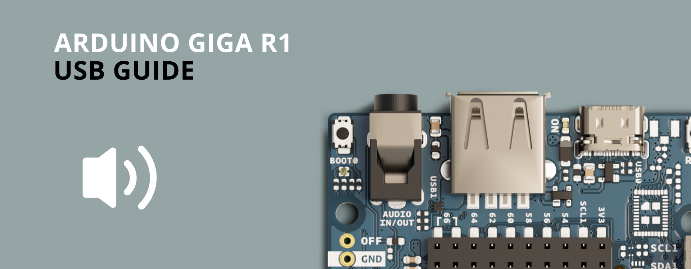

The GIGA R1 is one of the most feature-packed boards from Arduino up to date. In the GIGA R1, you can find the powerful, dual-core STM32H747XI microcontroller from STMicroelectronics; this is the same microcontroller found in the Arduino Portenta H7 family boards. This guide will show you how to use the Arduino ecosystem to turn a versatile and powerful board like the GIGA R1 into a professional audio tool suitable for everyone, from hobbyists to professionals.

## Digital-to-Analog Converters 

A digital-to-analog converter (DAC) is a device that has a function opposite to that of the analog-to-digital converter (ADC); it converts digital data to an analog voltage. The GIGA R1 microcontroller, the STM32H747XI, features two 12-bit, 2-channel DACs that support audio features useful for audio applications such as man-machine interfaces and low-cost music players. Analog waveform generation can also be achieved with the GIGA's R1 DACs. The GIGA R1 DACs are named `DAC0` and `DAC1`; they can be found on pins `A12` and `A13` correspondingly.

To use all of the capabilities of the DACs from the GIGA R1, we can use de `AdvancedAnalogRedux` library from Arduino. Here is an example that generates an 8kHz square wave on `DAC0` (`A12`):

```arduino
#include "AdvancedDAC.h"

AdvancedDAC dac1(A12);

void setup() {
    Serial.begin(9600);

    while (!Serial) {

    }

    if (!dac1.begin(AN_RESOLUTION_12, 8000, 32, 64)) {
        Serial.println("Failed to start DAC1 !");
        while (1);
    }
}

void dac_output_sq(AdvancedDAC &dac_out) {
    if (dac_out.available()) {

        // Get a free buffer for writing.
        SampleBuffer buf = dac_out.dequeue();

        // Write data to buffer.
        for (int i=0; i<buf.size(); i++) {
            buf.data()[i] =  (i % 2 == 0) ? 0: 0xfff;
        }

        // Writethe buffer to DAC.
        dac_out.write(buf);
    }
}

void loop() {
    dac_output_sq(dac1);
}
```

### Playback with the GIGA R1 DACs