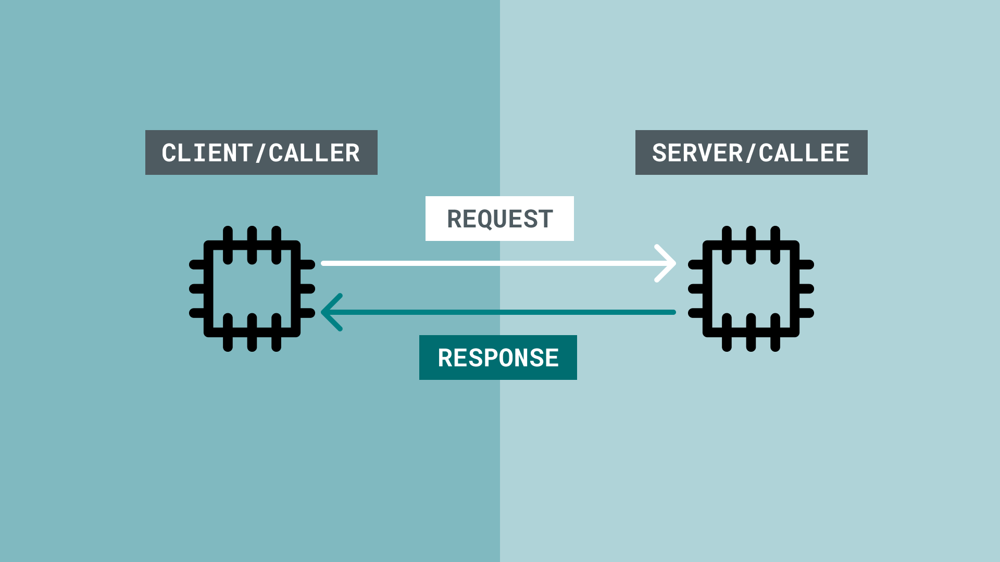
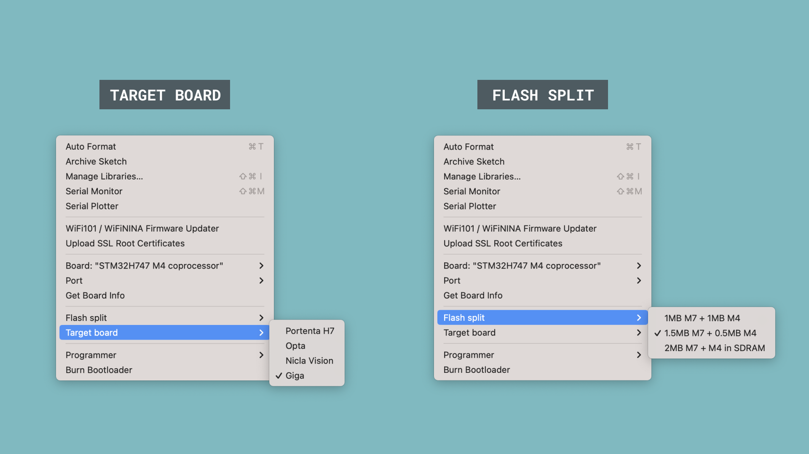

***PLEASE NOTE: This article is still in progress.***

The GIGA R1's microcontroller, the **STM32H747XI** has two processor cores, the **M7** and **M4**, clocking in at 480MHz and 240Mhz respectively. 

Having two cores in a microcontroller brings a significant advantage, to run two main applications simultaneuously, and communicate with them through something called **Remote Procedure Call (RPC)**. 

## Goals

In this tutorial, we will take a closer look at how to make use of the dual core, by:
- Set up and run MicroPython on the M7 core.
- Set up and run Arduino code on the M4 core.
- Link, or bind, the two cores through RPC, using a specific serial protocol.
- Control a servo motor by requesting the service from the M7 to the M4.

## Hardware & Software Needed

The hardware needed for this project:

- [GIGA R1](/hardware/giga-r1) / [GIGA R1 WiFi](/hardware/giga-r1-wifi)
- Servo motor.

For programming the M4 core (C++):

- [Arduino IDE](https://www.arduino.cc/en/software)

For programming the M7 core (MicroPython):

- [dfu-util](https://dfu-util.sourceforge.net/)
- [firmware.dfu](linktofw)

You will also need a MicroPython supported editor, such as:
- [Arduino Lab for MicroPython](https://labs.arduino.cc/en/labs/micropython)
- [Thonny](https://thonny.org/)

***The installation for `dfu-util` varies between operation systems. For installation using [brew.sh](https://formulae.brew.sh/formula/dfu-util) simply use `brew install dfu-util`.***

## Remote Procedure Call (RPC)

RPC is a method that allows programs to make requests to programs located elsewhere. It is based on the client-server model (also referred to as caller/callee), where the client (caller) makes a request to the server (callee). 

An RPC is a synchronous operation, and while a request is being made (client/caller) to another system, the operation is suspended. On return of the results, the operation is resumed. On the other side, (server/callee) performs the subroutine on request, and suspends any other operation as well. After it sends the result to the client, it resumes its operation, while waiting for another request.



### RPCs in the Arduino Environment

As some microcontrollers, including the STM32H747XI, has two processors, it is possible to program them both to perform individual tasks, and enable communication between them via an RPC.

The advantage of this is great, as you essentially have "two" Arduino boards running (on the some board). For example, you can run a machine learning module on one of the core, while another core is connected to a network system such as the [Arduino IoT Cloud](https://create.arduino.cc/iot/). Running these applications in parallel increases performance, as you split the work load and allow them to run with less blocking code for example.


### RPC vs Multi-Threading

This is a similar, but not identical to [multi-threading on Arduino boards](https://github.com/arduino-libraries/Arduino_Threads). Multi-threading essentially allows you to run code asynchronously on a single processor, and create communication lines between the threads. While RPC is similar, it differs as communication can be set up between two remote systems (such as two different processors, in this case).

Both methods are great to apply in more sophisticated and performance-craving projects, as you can combine the two methods to create several threads, running on separate cores.

### Use Cases

RPC and Multi-Threading can be used for several different setups. Here are some good combinations that can be considered:

- Use **Core A** for networking (e.g. publishing to a MQTT channel) and **Core B** for data recording & analysis.
- Use **Core A** for image capturing, and **Core B** for image processing.
- Use **Core A** for storing sensor data locally (USB/SD) and **Core B** for streaming it to a cloud service.

## GIGA R1 RPC Example

The GIGA R1's STM32H747XI microcontroller includes the M7 and M4 core. In this example, we will:
- Install MicroPython on the M7 core (this is the main core).
- Load a script that sets up the **M7 as a server/callee**.
- Upload a sketch to the **M4 that sets it up as a client/caller**.  
- Make a request from the M4 to the M7.

### 1. Upload Sketch to M4 Core

We will start by uploading a sketch to the M4 core, which will be running Arduino code. This requires the [Arduino IDE](https://www.arduino.cc/en/software) to be installed, as well as the **Arduino MbedOS OS GIGA Boards** core installed.

**1.1.** Open the Arduino IDE, and the board manager (in the menu to the left). Install the **Arduino MbedOS OS GIGA Boards** package.

**1.2.** Now we need to select the right board. This is **not** the GIGA R1, as the default is H7. We instead need to select the **STM32H747 M4 coprocessor**. This is the M4 on the GIGA R1.

**1.3.** With the board selected, you will now have the option to select **Flash Split** and **Target Board**. These are manual options available in the **Tools** section of the IDE. Here, we need to select the **1.5MB M7 + 0.5MB M4** configuration for the Flash Split, and **Giga** for Target Board.



**1.4.** Upload the following sketch to the board:

```arduino
#include "RPC.h"
#include <Servo.h>

uint32_t servo_new(uint32_t id) {
  Servo* servo = new Servo();
  return (uint32_t)servo;
}

void servo_attach(uint32_t id, int pin) {
  Servo* servo = (Servo*)id;
  servo->attach(pin);
}

void servo_write(uint32_t id, float angle) {
  Servo* servo = (Servo*)id;
  servo->write(angle);
}

void setup() {
  RPC.begin();
  RPC.bind("servo_new", servo_new);
  RPC.bind("servo_attach", servo_attach);
  RPC.bind("servo_write", servo_write);
}

void loop() {
  delay(1000);
}
```

### 2. Installing MicroPython

To install MicroPython on the GIGA R1, you will need to flash a specific MicroPython firmware to the **M7 processor.** This requires the [dfu-util](https://dfu-util.sourceforge.net/) tool.

**2.1.** Download the [MicroPython firmware for GIGA R1](/micropython).

**2.2.** Download [dfu-util](https://dfu-util.sourceforge.net/) (also available via [brew.sh](https://formulae.brew.sh/formula/dfu-util)). Make sure the tool is added to PATH on your machine.

**2.3.** Open a terminal, and navigate to the directory where you saved the downloaded MicroPython firmware.

**2.4.** Double tap the reset button on the GIGA R1 (while it is powered). This will enter bootloader mode.

**2.5.** Finally, load the MicroPython firmware, by using the following command:

```
$ dfu-util -w -a 0 -d 2341:0366 -D <firmware>.dfu
```

This will start an uploading process that can be tracked in the terminal. Once it is done, the green LED will be pulsing. Success!

Make sure to reset the board before continuing (tap the reset button).

### 3. MessagePack

***[MessagePack]() is a serialization protocol made by Peter Hinch that we are using in this implementation to communicate between the cores.***

In order to implement an RPC between the M4 and M7 cores, we use MessagePack, or the `umsg` module. This module needs to be present on your board, so that we can use it a MicroPython script (it is not part of the MicroPython installation). 

When we install MicroPython on the M7 core, we create a mass storage device that we can simply drag and drop files to.

**3.1.** First, download the [umsg module]() and unpack it.

**3.2.** Open the mass storage device (available in e.g. finder), and drag only the `umsg` folder to the root of the mass storage device.

You now have the `umsg` module available on your board, and can be called from a MicroPython script.

### 4. Load MicroPython Script

The final step is to load a MicroPython script to the M7 that will interact with the M4 core, essentially using the "server-client" protocol.

**4.1.** Open the MicroPython editor (such as [Arduino Lab for MicroPython](https://labs.arduino.cc/en/labs/micropython)).

**4.2.** Select/connect your board. You can test out if it is connected properly to your computer by running a simple `print ("test")`. If it shows in the REPL, it works.

**4.3.** Paste the script below to the editor, and press the play/run button.

```python
import arduino
arduino.init()
servo = arduino.Servo()
servo.attach(6)
servo.write(64)
```

This basic script includes the API for controlling a servo motor. But, the main difference here, is that the servo motor is controlled on the M4 core.

When for example `servo.attach(6)` is run, this action is not executed on the M7 core, but instead requested to run on the M4. 

You can revisit [the code in the first step](#1-upload-sketch-to-m4-core), to understand how the link is made between the MicroPython script, and the Arduino sketch.

## Conclusion

At the end of this tutorial, we have achieved the communication between the M4 and the M7 core, via something called **RPC**. The example used in this tutorial is a servo motor, but there are of course many more alternatives that you can choose from.
