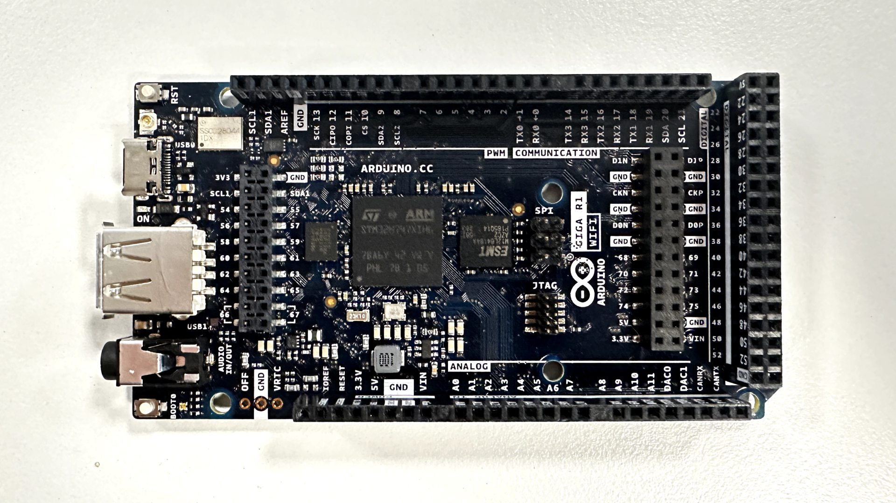
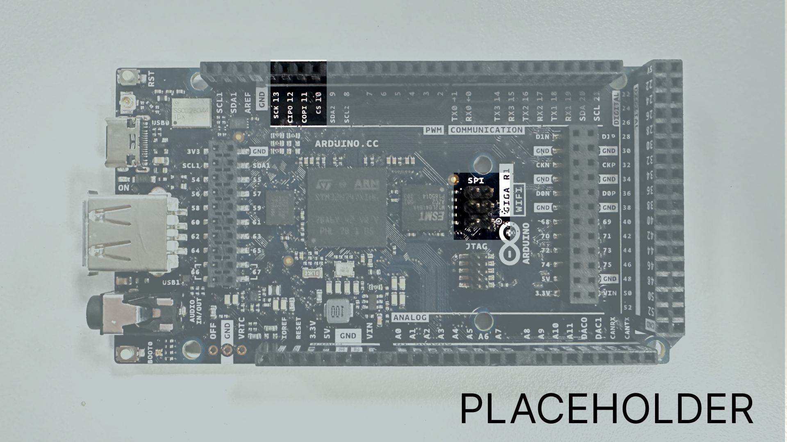
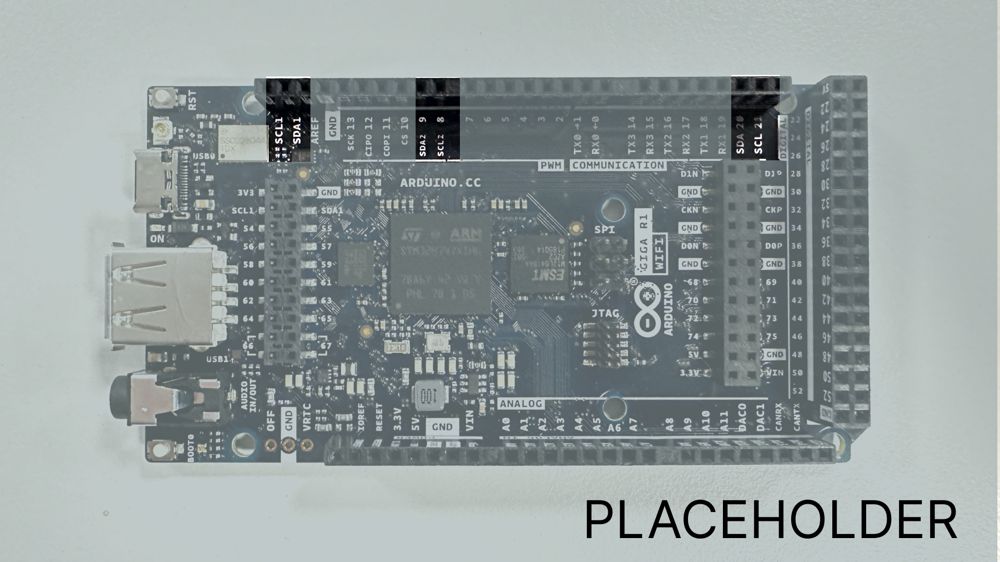

The **Arduino GIGA R1** is one of our most feature-packed Arduino boards to date, supported by the same powerful, ML-capable, dual-core microcontroller found in the Pro family's Portenta H7. It features support for display connectors, USB-host, an Audio Jack, an Arducam connector, a CAN bus, 4 UART Serial Ports, 2 I2C busses, dedicated DAC Pins, and much, much more. 

This article is a collection of resources and guides to make use of every great feature of this powerful hardware.

You can also visit the documentation platform for the [Arduino GIGA R1](http://docs.arduino.cc)

## Datasheet
The full datasheets are available as a downloadable PDF from the link below:

- [Download the Arduino GIGA R1 datasheet](http//docs.arduino.cc)

## Installation

The **Arduino GIGA R1** can be programmed through the:

-  **Classic Arduino IDE 1.8.X**, 
- the **Arduino IDE 2.0.X**, 
- the OpenMV IDE,
- and the Web-editor. 

To set the board up to be programmed with the OpenMV IDE in MicroPython, check out the [Boot0 section]() of this article.

### Core
The Arduino GIGA R1 uses the [GIGA core]().

### Boot0
Pressing and holding the button labelled `BOOT0` on the board while powering the board will boot it into DFU-mode (Device Firmware Update), letting you reflash the bootloader without the use of external hardware, if you were to ever need to. 


The state of this button can also be read from a sketch while it is running, giving you a basic interactive component without needing to do any wiring.

Booting the board into DFU-mode will also let you configure it with the OpenMV IDE to program the board with MicroPython, to for example deploy a trained ML model analysing a real time camera feed.

To learn more about this feature, and how you can use it, check out [this tutorial.]()

## Arduino IoT Cloud

The Arduino GIGA R1 is compatible with the [Arduino IoT Cloud](https://create.arduino.cc/iot/things), a cloud service that allows you to create IoT applications in just minutes.

If you need help to get started, you can go through the [Arduino IoT Cloud getting started guide](https://docs.arduino.cc/arduino-cloud/getting-started/iot-cloud-getting-started).

## STM32H747XI Microcontroller

The Arduino GIGA R1 boards feature the powerful dual core **STM32H747XI** microcontroller found on the Arduino PRO familys Portenta H7 board, but in a form factor accessible to any maker who has tinkered with an Arduino board before. 

The **STM32H747XI** is a powerful dual core chip, capable of being programmed with a high-level language such as MicroPython on one core, while simultaneously running Arduino compiled code on the other, and having the two programs communicate with each other seamlessly.

The microcontroller operates on a voltage of 3.3V, applying a higher voltage than that, such as 5V, to a pin might damage the microcontroller.

## Audio Jack
The **Arduino GIGA R1** features an audio jack, with 2x DAC channels, and 1x ADC channel, meaning that it is capable of reading input from a microphone, as well as outputting sound through a speaker. 


Both of these come with caveats, though. As there is no amplifier circuit on the board itself, driving a high impedance speaker directly without an amplifier circuit could cause damage to the board, and microphone input without an amplifier circuit between the microphone and the board may sound dim. 

In the coming sections we will provide resources and basic information on how to use the audio jack as both an input and an output. 


### Output

### Input

## MIPI Display Interface
The **STM32H747XI** has an internal 2D graphics accelerator with support for resolutions up to 1024x768, it also has the ability to encode and decode JPEG codec. This is what allows the **Arduino GIGA R1** to boast a 2 lane MIPI display interface. 


This means that the **Arduino GIGA R1** is capable of driving a touch-display large enough to build a substantial user interface. The [LVGL](https://lvgl.io) library is a powerful tool to quickly build a responsive interface.

Check out [this tutorial]() to learn how to build an interface with the LVGL library.

## USBHost
The USB-A port you find on the **Arduino GIGA R1** is configured as a host-only port, meaning that it cannot be used to program the board, instead it is used to connect peripherals to the board. The board can receive keyboard input, or be used to read files off of a USB flash drive, if you for example want to play audio files on a speaker you have plugged in the audio jack.

- [Library for USB-Host]()

To learn in depth about how to use this powerful feature, read the [USBHost Guide.]()

## Dual Core Processing
As mentioned previously, the microcontroller on the **Arduino GIGA R1** is a dual core processor, and can therefore run two separate programs simultaneously. The cores can be programmed separately and are capable of sharing information with each other. 

When writing a program that is supposed to use both cores, you will be required to forcefully boot the second core. For most programs there really is no reason to use both, and for that reason it is by default unbooted. However it is a powerful option to have, and one that you can easily make use of if you want to continuously monitor and process sensor values. 

You boot the second core by adding the function:
```
bootM4();
```
at the beginning of the sketch for your primary core, in the board selector you choose to program either the primary M7 core, or the secondary M4 core.

It is also possible to program both cores with just one sketch, though this quickly becomes an unwieldy, inefficient and **difficult** way to work.

To learn more about dual core processing on the **Arduino GIGA R1** and **GIGA R1 WiFi**, check out the tutorial below:

- [Dual Core Processing](https://docs.arduino.cc/tutorials/portenta-h7/dual-core-processing)

## Camera interface
The Arduino GIGA features an onboard arducam compatible connector, with support for **parallel**. 


Programming the board in the **MicroPython** language using the **OpenMV IDE** easily lets you get started with a neural network analysing a realtime camera feed with ML. 

## JTAG
The **Arduino GIGA R1** features a 2x5 pin JTAG (Joint Test Action Group) connector, giving advanced debug functionalities for more advanced users. 

Check out [this tutorial]() to learn how to use the JTAG connector on the **Arduino GIGA R1**. 


## CAN Bus
The **Arduino GIGA R1** features a dedicated CAN bus. 


>**Note:** the CAN bus does not include a built in transceiver. If you need to use the CAN bus, you can add a transciever as a breakout board.

CAN, or **Controller Area Network**, is a communication standard that allows microcontroller-based devices to communicate with each other without the need for a host computer. This means that building a complex system with many different subsystems within becomes much easier. 

This makes the **Arduino GIGA R1** a powerful option for complex multilayered systems, as it can be integrated into existing systems or be used to build a new one from scratch. 

The CAN pins on the **Arduino GIGA R1** are labelled `CANRX` and `CANTX`

For more information on how to use the CAN bus on your **Arduino GIGA R1**, check out [this tutorial.]()

- [Using the CAN bus on the Arduino GIGA]()

## SPI 
The **Arduino GIGA R1** features two separate SPI (Serial Peripheral Interface) busses, one is configured on the 6 pin header labelled SPI, and the other is broken out into pin connections on the board. 

The pins used for SPI on the **Arduino GIGA R1** are the following:

(CIPO) - D12
(COPI) - D11
(SCK) - D13
(CS) - D10



To use SPI, we first need to include the [SPI](https://www.arduino.cc/en/reference/SPI) library.
```
#include <SPI.h>
```
Inside `void setup()` we need to initialize the library
```
SPI.begin()
```

## I2C Pins
I2C lets you connect multiple I2C compatible devices in series using only two pins. The controller will send out information through the I2C bus to a 7 bit address, meaning that the technical limit of I2C devices on a single line is 128. Practically, you're never gonna reach 128 devices before other limitations kick in.

The **Arduino GIGA R1** has three separate I2C busses of which two are usable without external components, letting you control more devices.

The pins used for I2C on the **Arduino GIGA R1** are the following:
- SDA - D20
- SCL - D21
- SDA1 
- SCL1
- SDA2 - D9
- SCL2 - D8



To connect I2C devices you will need to include the [Wire](https://www.arduino.cc/reference/en/language/functions/communication/wire/) library at the top of your sketch.
```
#include <Wire.h>
```

Inside `void setup()` you need to initialize the library.
```
Wire.begin()
```

And to write something to a device connected via I2C, we can use the following commands:
```
Wire.beginTransmission(1); //begin transmit to device 1
Wire.write(byte(0x00)); //send instruction byte 
Wire.write(val); //send a value
Wire.endTransmission(); //stop transmit
```

If you pay close attention you may notice that there are three sets of I2C pins. The two first sets (SDA, SCL, SDA1, SCL1) have internal pullup resistors connected to them which are required to make them function as I2C pins. 

If you want to use the third set (SDA2, SCL2) as I2C pins you will need to use external pullup resistors.

## UART Pins
The **Arduino GIGA R1** supports, like every other Arduino board, serial communication with UART (Universal Asynchronous, Receiver-Transmitter). However, the **Arduino GIGA R1** board features 4 separate serial ports. 

This not only means that you may print different values to different ports and monitor them separately, which is useful enough in and of itself, but that you may also communicate with **4 different serial enabled devices** simultaneously. 

The pins used for UART on the **Arduino GIGA R1** are the following:

- RX0 - D0
- TX0 - D1
- RX1 - D19
- TX1 - D18
- RX2 - 17
- TX2 - 16
- RX3 - 15
- TX3 - 14

Each Serial port works in the same way as the one you're used to, but you use different functions to target them:
```
Serial.begin(9600);
Serial1.begin(9600);
Serial2.begin(9600);
Serial3.begin(9600);
```

To send and receive data through UART, we will first need to set the baud rate inside `void setup()`.

```
Serial1.begin(9600);
```

To read incoming data, we can use a while loop() to read each individual character and add it to a string.

```
  while(Serial1.available()){
    delay(2);
    char c = Serial1.read();
    incoming += c;
  }
```

And to write something, we can use the following command:

```
Serial1.write("Hello world!");
```

## Pins
The **Arduino GIGA R1** gives you access to more pins than any other Arduino board that is this accessible for makers. Many of them have special features that will be accounted for in the upcoming sections of this article. Keep reading to learn what you can do with them. 

### Analog Pins
The **Arduino GIGA R1** has 12 analog input pins that can be read with a resolution of 16 Bits, by using the `analogRead()` function.
```
value = analogRead(pin, value);
```

The reference voltage of these pins is 3.3V. 

Pins A8, A9, A10 and A11 can not be used as GPIO, but are limited to use as analog input pins.


### PWM Pins
PWM (Pulse Width Modulation) capability allows a digital pin to emulate analog output by flickering on and off very fast letting you, among other things, dim LEDs connected to digital pins. 

On the **Arduino GIGA R1** all digital pins are PWM capable, and to make use of them you use:
```
analogWrite(pin, value);
```

### Digital Pins
The **Arduino GIGA R1** features more pins than any other Arduino board for makers, a full 76 digital pins. Though many of them serve a purpose and shouldn't be used for GPIO if you have other pins available.

- 0 - RX0
- 1 - TX0
- 8 - SCL2
- 9 - SDA2
- 10 - CS
- 11 - COPI
- 12 - CIPO
- 13 - SCK 
- 14 - TX3
- 15 - RX3
- 16 - TX2
- 17 - RX2
- 18 - TX1
- 19 - RX1
- 20 - SDA
- 21 - SCL 

The reference voltage of all digital pins is 3.3V.

### DAC Pins
The **Arduino GIGA R1** also has two DAC pins, A12 & A13, that can act as genuine analog output pins which means they are even more capable than PWM pins.
```
analogWrite(pin, value);
```


These DAC pins have a default write resolution of 8-bits. This means that values that are written to the pin should be between 0-255.

However you may change this write resolution if you need to, to up to 12-bits:
```
analogWriteResolution(12);
```

### OFF Pin
On the **Arduino GIGA R1** you will find a pin labelled **"OFF"**. If you connect this pin to ground, the board will power down even if power is supplied to the board.

You can install a flip-switch to the board to let you turn your device on and off easily, which can be a handy option for a more permanent fixture. 

Read more about this feature, and learn when and how to use it by checking out this [this tutorial.]()

## Miscellaneous 
