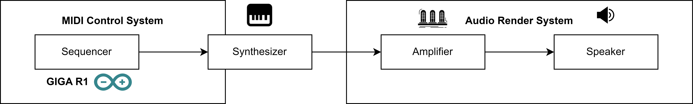
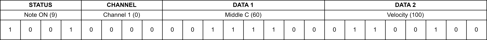
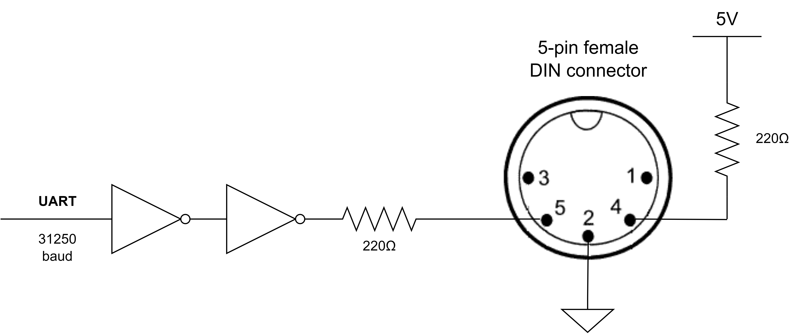

## Overview

When we talk about MIDI, we usually think about a sound machine, but in reality, MIDI is entirely different, although it is essential in sound production. In this tutorial, we will learn the basics of MIDI control systems and how to implement one using the Arduino ecosystem, particularly the GIGA R1.

## Goals

- Learn how MIDI can control audio devices
- Learn how to implement a MIDI control system using the Arduino ecosystem

### Required Hardware and Software

- Arduino GIGA R1 (x1)
- [Arduino IDE 1.8.10+](https://www.arduino.cc/en/software), [Arduino IDE 2.0+](https://www.arduino.cc/en/software), or [Arduino Web Editor](https://www.arduino.cc/en/software)
- If you choose the offline Arduino IDE, you must install the following library: [`MIDIUSB`](https://github.com/arduino-libraries/MIDIUSB)

## MIDI Control Systems

The Musical Instrument Digital Interface (MIDI) is a widely used digital control system in music production; it combines a hardware interface with an asynchronous serial communication protocol. Since 1982 (40 years ago!), when the MIDI 1.0 specification was released for the first time, it has been a standard in the music production industry. One of the main characteristics of MIDI is its simplicity; because of this, it has been adapted to other digital interfaces, such as USB, Ethernet, and Bluetooth® for audio control. The original MIDI hardware interface used a 5-pin DIN connector; to avoid noise problems between connected MIDI devices, an optocoupler was placed between. A basic MIDI control system is shown in the image below:



A MIDI controller, usually called a sequencer, controls an audio synthesizer. The sequencer sends MIDI data into the synthesizer that tells it what to do, precisely what notes to generate, and when to do it. Notice that the MIDI controller, the sequencer, does not generate any audio signal or produce any sound. The synthesizer is in charge of generating audio signals at the command of the MIDI controller data. 

***MIDI does not produce any sound; it just describes it.***

### MIDI Control Messages

MIDI control messages are described in the image below:



Common MIDI messages are 3-byte messages that consist of a control byte and two data bytes configured as follows:

- **`STATUS`**: four bits that define the MIDI message type, where `1000` (decimal 8) is `note OFF`, and `1001` (decimal 9) is `note ON`
- **`CHANNEL`**: four bits (1-16) that define the MIDI message channel is intended for; the count starts from binary 0.
- **`DATA 1`**: defines a 7-bit note number from C-2 (0) to G8 (127)
- **`DATA 2`**: defines the velocity of a note (from 0 to 127)

> A single MIDI control system can be connected to up to 16 devices! 

Although MIDI use in the music production industry is still widespread, it has some limitations. MIDI 1.0 does not provide any feedback to the sequencer from the MIDI devices, for example, from a synthesizer; communication was proposed in the specification just in one direction. To address this issue, the MIDI Manufacturers Association (MMA) recently introduced a major MIDI 1.0 protocol revision: the MIDI 2.0 specification. In MIDI 2.0 specification, device profiling and bi-directional communication are the most significant changes. 

## MIDI and the Arduino Ecosystem

There are two ways to implement a MIDI control system using the Arduino ecosystem. The first is to implement MIDI over USB using the `MIDIUSB` library from Arduino and a USB-native Arduino board; the second one is MIDI over Serial through a 5-pin DIN connector. We will discuss both ways in the sections below. But before we discuss MIDI over USB and MIDI over Serial, let's talk about the standard MIDI out hardware interface described in the image below:



The schematic above describes the standard MIDI output hardware interface published by the MMA in 1985. The interface consists of a UART transmitter sending data at 31250 baud through two operational amplifiers and a 220Ω current limiting resistor (defined in the MIDI specification) to pin 5 of a 5-pin DIN connector. Pin 4 of the DIN connector is set to +5VDC (also using a 220Ω current limiting resistor), while pin 2 of the DIN connector is set to GND. Pin 1 and 3 are not used in the standard MIDI output hardware interface. This information is essential to design and implementing MIDI control systems from scratch and for using MIDI sound modules that use a 5-pin DIN connector; MIDI can also be found over USB, Ethernet, and Bluetooth®; in those cases, the hardware interface changes accordingly to each technology. 

Now that we know the standard MIDI out hardware interface, let's talk about MIDI over USB!

### MIDI USB

One of the most straightforward ways to send MIDI commands is over USB since you don't have to worry about the hardware interface. In this example, we will use the `MIDIUSB` library from Arduino and a USB-native Arduino board, the GIGA R1. As a MIDI sound module, we will use the free, cross-platform sample player software [sforzando](https://www.plogue.com/products/sforzando.html); install it and check out its [user manual](https://s3.amazonaws.com/sforzando/sforzando_guide.pdf). 

The example we will implement is a simple melody player based on Tom Igoe's work on sound and Arduino. The implemented melody is Piano Phase, a minimalist composition by the American composer Steve Reich, written in 1967 for two pianos. The characteristics of this melody are the following:

- Twelve notes long, each note is a sixteenth note 
- Repeated indefinitely on two pianos, with each piano shifting its tempo slightly to create phase shifting
- Written to be played at 72 beats per minute (BPM) in common time

The following sketch implements a simple MIDI player over USB using the `MIDIUSB` library from Arduino; if you are using the offline Arduino IDE, remember to install this library, this can be done using the IDE's Library Manager:

```arduino 
/*
  Simple MIDI player over USB
  This sketch generates a melody over MIDI 

  Created by Tom Igoe
*/

#include <MIDIUSB.h>

// Beats per minute, duration of a beat in ms
int bpm = 72;
float beatDuration = 60.0 / bpm * 1000;

// Melody sequence array (Piano Phase by Steve Reich)
int melody[] = {64, 66, 71, 73, 74, 66, 64, 73, 71, 66, 74, 73};

// Note in the melody array to play
int noteCounter = 0;

void setup() {}

void loop() {
  // Play a note of the melody array
  // 0x90 = note on command, channel 0
  // 127 = full volume
  midiCommand(0x90, melody[noteCounter], 127);
  int noteDuration = beatDuration/4;
  delay(noteDuration);

  // Turn the note off and increment noteCounter to play the following note in the melody array
  // 0x90 = note off command, channel 0
  // 127 = no volume
  midiCommand(0x80, melody[noteCounter], 0);
  noteCounter++;

  // Keep noteCounter between 0 and 11
  noteCounter = noteCounter % 12;
}

// midiCommand function
// This function send a MIDI command using the MIDIUSB library
// First parameter of the function is the event type (top 4 bits of the command byte)
// Second parameter is the complete command byte (event type and channel)
// Third and fourth parameter are the first and second data bytes
void midiCommand(byte cmd, byte data1, byte  data2) {
  midiEventPacket_t midiMsg = {cmd >> 4, cmd, data1, data2};
  MidiUSB.sendMIDI(midiMsg);
}
```

If everything is ok, you should be able to upload the sketch into your GIGA R1 board. You will notice that nothing happens. This is because this sketch is only sending MIDI commands. To hear the melody, you need a MIDI sound module, in this case sforzando software. Open the software, the first thing we need to do is to set up the MIDI input preferences. This can be done by navigating to **Tools > Preferences...**, in the **Input MIDI Devices** box, select your GIGA R1 board as a MIDI input device. 

***If you are using sforzando in Windows, you must run it as administrator.***

Now, we must add an instrument file. The instrument file can be added by navigating to Instrument > import, then select the .sfz file of the sound bank downloaded before. In this example, we will use the [clean electric guitar sound bank](https://freepats.zenvoid.org/ElectricGuitar/clean-electric-guitar.html) from the [Free Banks Project](https://freepats.zenvoid.org/about.html); you can find more instrument files in the Free Banks Project. That's it! You should be hearing the melody now.

### MIDI Serial

Since MIDI is an asynchronous serial data protocol, it can also be implemented without any dedicated library like the `MIDIUSB` library from Arduino by sending the MIDI commands via the board's Serial port. This can be helpful when you send MIDI commands to MIDI sound modules that do not have a built-in USB port but a 5-pin DIN connector. In that case, remember you must implement the hardware interface described before to avoid any damage to your board or the sound module. 

The following sketch implements the simple MIDI player shown before over Serial1:

```arduino 
/*
  Simple MIDI player over Serial1
  This sketch generates a melody over MIDI 

  Created by Tom Igoe
*/

// Beats per minute, duration of a beat in ms
int bpm = 72;
float beatDuration = 60.0 / bpm * 1000;

// Melody sequence array (Piano Phase by Steve Reich)
int melody[] = {64, 66, 71, 73, 74, 66, 64, 73, 71, 66, 74, 73};

// Note in the melody array to play
int noteCounter = 0;

void setup() {
  // Initialize debug Serial port at 9600 bauds
  Serial.begin(9600);

  // Initialize MIDI Serial port at 31250 bauds
  Serial1.begin(31250);

}

void loop() {
  // Play a note of the melody array
  // 0x90 = note on command, channel 0
  // 127 = full volume
  midiCommand(0x90, melody[noteCounter], 127);
  int noteDuration = beatDuration/4;
  delay(noteDuration);

  // Turn the note off and increment noteCounter to play the following note in the melody array
  // 0x90 = note off command, channel 0
  // 127 = no volume
  midiCommand(0x80, melody[noteCounter], 0);
  noteCounter++;

  // Keep noteCounter between 0 and 11
  noteCounter = noteCounter % 12;
}

// midiCommand function
// This function send a MIDI command using the MIDIUSB library
// First parameter of the function is the event type (top 4 bits of the command byte)
// Second parameter is the complete command byte (event type and channel)
// Third and fourth parameter are the first and second data bytes
void midiCommand(byte cmd, byte data1, byte  data2) {
  Serial1.write(cmd);     
  Serial1.write(data1);   
  Serial1.write(data2);   
}
```

Follow the same steps described before with the sforzando software, you should be hearing now the melody. 

## Conclusion

## References