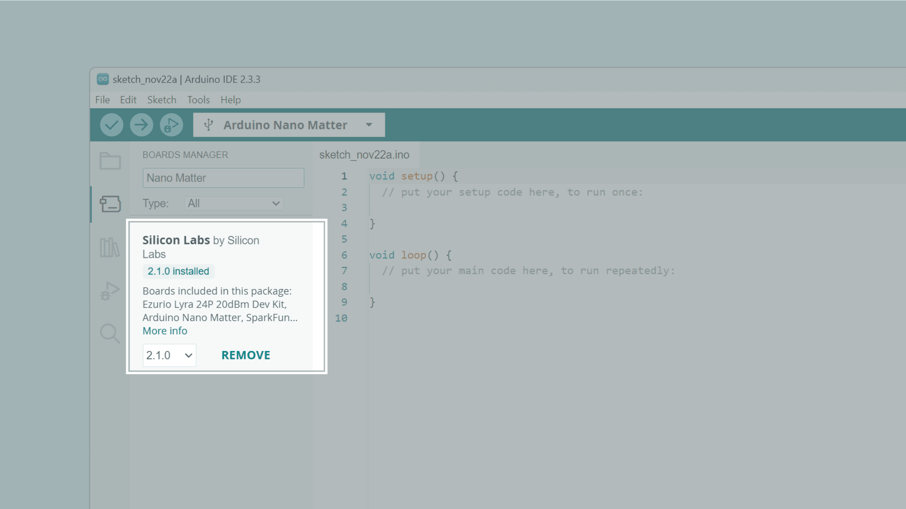
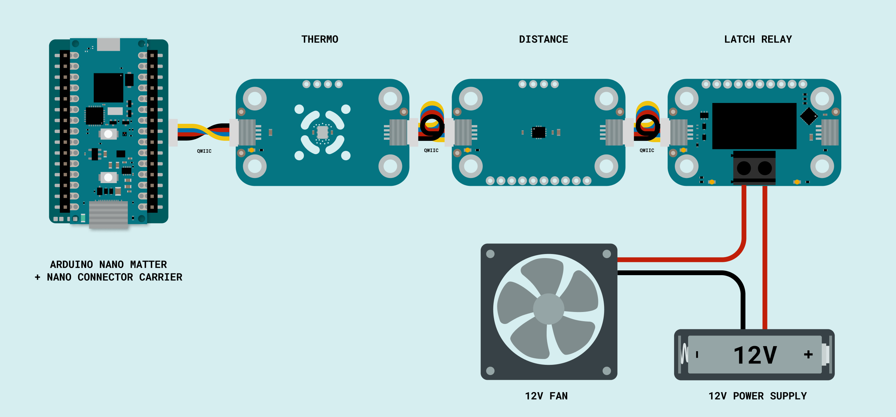
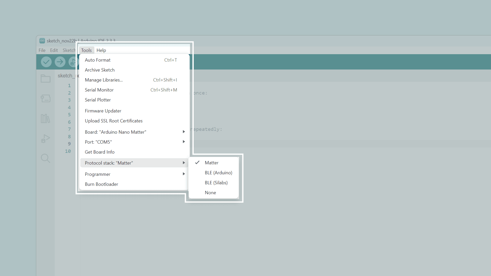

**Note:** This tutorial is part of the Arduino Matter Discovery Bundle.

## Overview

In this project, we will explore how to build a Matter®-compatible smart thermostat using the **Arduino® Nano™ Matter** and Modulino® ecosystem.
The goal is to control a home heating system based on two key factors: ambient temperature and human presence.

By utilizing the Matter® protocol, this system integrates natively with major smart home platforms such as Amazon Alexa, Google Home™, and Apple Home. This allows you to monitor climate data and manage your heating directly through your preferred home assistant.

### How It Works

The system relies on three primary modules: a temperature sensor, a proximity sensor, and a relay. When the ambient temperature drops below a customizable threshold AND presence is detected in the room, the relay activates the heating system. If the room becomes unoccupied OR the temperature rises above the set threshold, the system automatically switches the heating off to conserve energy.

## Hardware & Software Needed

To build this project, you will need the following components from the **Arduino® Matter Discovery Bundle**:

*   **[Arduino IDE](/software/ide-v2)**: The development environment used to program the board.
*   **[Arduino Nano Matter](/hardware/nano-matter)**: The central processing unit of the project. It manages both the local execution of the heating logic and the communication with the Matter network.
*   **[Arduino Nano Connector Carrier](/hardware/nano-connector-carrier)**: This board acts as the essential interface for the setup. It hosts the Arduino Nano Matter and provides the Qwiic connector necessary to link the Modulino modules.
*   **[Modulino Thermo](/hardware/modulino-thermo)**: This module provides ambient temperature and humidity readings. It serves as the primary feedback sensor to determine if the room requires heating.
*   **[Modulino Distance](/hardware/modulino-distance)**: Utilizing a Time-of-Flight (ToF) sensor, this module measures the distance of objects in its field of view. It is used here as an occupancy sensor to confirm human presence before activating the system.
*   **[Modulino Latch Relay](/hardware/modulino-latch)**: This acts as the physical switch for the heating system’s thermostat terminals.
*   **Qwiic Cables**: These standardized 4-pin cables allow you to daisy-chain all Modulino modules to the Nano Connector Carrier.

### Download the Project Code

[](assets/matter_smart_thermostat.zip)

Download the complete project code [here](assets/matter_smart_thermostat.zip).

### Board Core and Libraries

The **Silicon Labs** core contains the libraries and examples required to use the board’s features, such as Matter, Bluetooth® Low Energy, and its I/O capabilities. To install the Nano Matter core, navigate to **Tools > Board > Boards Manager** or click the Boards Manager icon in the left tab of the IDE. In the Boards Manager tab, search for `Nano Matter` and install the latest `Silicon Labs` core version.



## Hardware Setup

The hardware assembly uses the Qwiic connector for a plug-and-play configuration. The Arduino Nano Matter is seated on the Nano Connector Carrier, with the Modulino Thermo, Distance, and Latch Relay connected in a daisy-chain using Qwiic cables.



The Modulino Latch Relay manages the heating switching logic. It uses a bistable mechanism that preserves its state (ON/OFF) even during power loss.

**Note:** **SAFETY WARNING**: This module is designed for DC loads only (Max 30 V). Due to exposed contacts, it is not safe for 250 V AC switching.

While a real-world application would interface with a professional heating system’s low-voltage thermostat terminals, for this demonstration we use the relay to control a 12 V DC fan.
This allows you to safely simulate the system's heating cycles in a controlled environment.

## The Matter Protocol

Matter is the universal communication standard that allows smart devices from different manufacturers to work together locally and securely in a smart home network.
It uses Device Profiles to standardize how a product (like a light or a lock) communicates with a smart home ecosystem.

### The Thermostat Profile

By utilizing the dedicated Matter Thermostat Profile, this project is instantly recognized as a native climate controller by platforms like Apple Home, Google Home, and Home Assistant.
This profile allows the system to:

*   **Monitor Climate**: Real-time reporting of the current ambient temperature.
*   **Set Targets**: Remote adjustment of the Heating Setpoint (your desired temperature) directly from a smartphone.
*   **Define Limits**: Set minimum and maximum temperature boundaries to prevent accidental overheating or energy waste.
*   **Manage Modes**: Switch the entire system between different operational modes, such as turning the heating off or enabling the active heating cycle.

## The Library

To implement these features, Arduino provides a comprehensive Matter library (https://github.com/SiliconLabs/arduino/tree/main/libraries/Matter) that simplifies the integration of the protocol into your sketch. This library is built on top of the [Silicon Labs Arduino Core](https://github.com/SiliconLabs/arduino), which provides the foundation for the Nano Matter board.

## Programming

In the Arduino IDE upper menu, navigate to **Tools > Protocol stack** and select **Matter**.



## Code Deep Dive

The sketch integrates the Arduino Matter library with the Modulino ecosystem and follows a clear pattern: it polls the environmental sensors, updates the Matter profile, and executes the local thermostat logic.

### 1. Initialization and Setup

In the `setup()`, the first step is to initialize communication with the Modulino nodes and start the Matter stack. A crucial part of this process is the commissioning check: if the board is not yet paired with a smart home hub, the code retrieves and prints an onboarding URL to the Serial Monitor, which provides the QR Code needed for pairing. For a complete explanation of the pairing procedure and commissioning flow, see the Matter section in the [Nano Matter user manual](https://docs.arduino.cc/tutorials/nano-matter/user-manual/#matter).

```cpp
void setup() {
  Modulino.begin();
  thermo.begin();
  distance.begin();
  relay.begin();

  Matter.begin();
  matter_thermostat.begin();

  // Wait for commissioning and connection to the Thread network
  while (!Matter.isDeviceCommissioned() || !matter_thermostat.is_online()) {
    delay(200);
  }
}
```

### 2. Data Synchronization

Inside the `loop()`, the device acts as a bridge between the physical environment and the digital interface:

*   **Temperature Update**: We read the real-time value from the Modulino Thermo and send it to the smart home app using `set_local_temperature()`.
*   **Reading the Setpoint**: We retrieve the target temperature (set by the user on their smartphone) using `get_heating_setpoint()`.

```cpp
float currentTemp = thermo.getTemperature();
matter_thermostat.set_local_temperature(currentTemp);

float setpoint = matter_thermostat.get_heating_setpoint();
```

### 3. Presence Detection

We utilize the Modulino Distance sensor to determine if the room is occupied. If the sensor detects an object at a distance of less than 1 meter (1000 mm), the system considers the room "occupied."

```cpp
bool personPresent = (distance.get() < 1000);
```

### 4. Decision Logic

The heating system activation occurs only if all conditions are met simultaneously: the system mode must be set to "HEAT", the ambient temperature must be below the setpoint, and presence must be detected.

*   `relay.set()`: Sends a pulse to close the contact of the bistable relay (Heating system ON).
*   `relay.reset()`: Opens the contact (Heating system OFF), saving energy if the room is empty or the target temperature is reached.

```cpp
if (mode == MatterThermostat::thermostat_mode_t::HEAT && currentTemp < setpoint && personPresent) {
    relay.set();
} else {
    relay.reset();
}
```

## Conclusion & Future Improvements

This project shows how the Arduino Nano Matter and Modulino ecosystem turn the complex Matter protocol into a simple, plug-and-play DIY project. In just a few steps, you can build a professional-grade controller that is fully integrated with the world's leading smart home platforms.
Thanks to the Modulino ecosystem, expanding the project is effortless:

*   **Modulino Pixels**: Add visual status indicators (e.g., Red for heating, Blue for idle).
*   **Modulino Knob**: Implement a physical dial for manual temperature overrides.
*   **Modulino Buzzer**: Set up audible alerts for critical temperature thresholds.

## Complete Code

```cpp
#include <Matter.h>
#include <MatterThermostat.h>
#include <Arduino_Modulino.h>

MatterThermostat matter_thermostat;

ModulinoThermo thermo;
ModulinoDistance distance;
ModulinoLatchRelay relay;

void setup() {
  Serial.begin(115200);

  // Initialize Modulino modules
  Modulino.begin();
  thermo.begin();
  distance.begin();
  relay.begin();

  // Initialize Matter protocol
  Matter.begin();
  matter_thermostat.begin();

  Serial.println("Matter Thermostat Initialized");
  // Check for Commissioning (pairing with your Smart Home App)
  // If not commissioned, it will print the QR code URL in the Serial Monitor
  if (!Matter.isDeviceCommissioned()) {
    Serial.println("Device not commissioned. Scan the QR code in the Serial Monitor:");
    Serial.printf("Manual pairing code: %s
", Matter.getManualPairingCode().c_str());
    Serial.printf("QR code URL: %s
", Matter.getOnboardingQRCodeUrl().c_str());
  }

  while (!Matter.isDeviceCommissioned()) {
    delay(200);
  }

  // Wait for connection to the Matter network
  Serial.println("Waiting for Thread network...");
  while (!Matter.isDeviceThreadConnected()) {
    delay(200);
  }
  
  // Wait for the Matter device to be online within the fabric
  Serial.println("Waiting for Matter device discovery...");
  while (!matter_thermostat.is_online()) {
    delay(200);
  }

  Serial.println("Matter Smart Thermostat is online and ready.");
}

void loop() {
  // 1. Sync physical sensor data to Matter App
  float currentTemp = thermo.getTemperature();
  Serial.print("Current Indoor Temperature: ");
  Serial.print(currentTemp);
  Serial.println("°C");
  matter_thermostat.set_local_temperature(currentTemp);
  
  // 2. Retrieve user-defined setpoint and mode from Matter Smart Home system
  float setpoint = matter_thermostat.get_heating_setpoint();
  MatterThermostat::thermostat_mode_t mode = matter_thermostat.get_system_mode();
 
  // 3. Presence Detection (Distance < 1000mm indicates a person in the room)
  bool personPresent = false;
  if (distance.available()) {
    // We use 1000mm (1m) as the threshold for presence
    if (distance.get() < 1000) {
      Serial.print("Person detected: ");
      Serial.print(distance.get());
      Serial.println("mm");
      personPresent = true;
    }
  }

  // 4. Operational Logic
  // The heating system turns ON only if: 
  // - Mode is set to HEAT in the app
  // - Current temperature is below the setpoint
  // - A person is detected in the room

  if (mode == MatterThermostat::thermostat_mode_t::HEAT && 
      currentTemp < setpoint && 
      personPresent) {
    
    // Check current relay status to avoid unnecessary I2C writes
    // status 1 = ON (set)
    if (relay.getStatus() != 1) { 
      relay.set(); 
      Serial.println("Action: Heating ON");
    }
  } 
  else {
    // Heating turns OFF if any condition fails:
    // Room is empty, target temperature is reached, or Mode is set to OFF
    if (relay.getStatus() != 0) { // status 0 = OFF (reset)
      relay.reset();
      Serial.println("Action: Heating OFF");
    }
  }

  delay(1000); 
}
```
