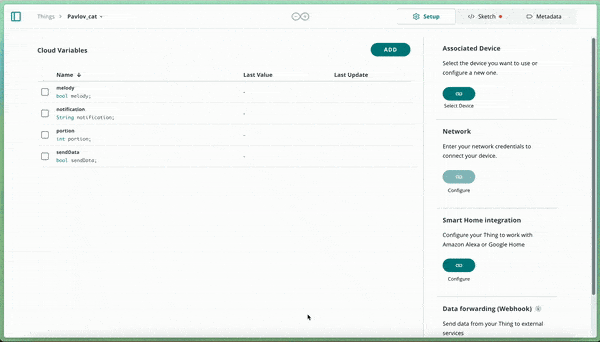

## Components and Supplies

- [Arduino IoT Bundle](https://store.arduino.cc/iot-bundle)
- 9V battery (generic)
- [9V Battery Clip](https://www.newark.com/22C4351?COM=ref_hackster)

## Apps and Online Services

- [Arduino IoT Cloud](https://cloud.arduino.cc)
- [Arduino IoT Cloud Remote app](https://play.google.com/store/apps/details?id=cc.arduino.cloudiot&hl=en&gl=US)

## About This Project

**Train your cat with the help of the Arduino IoT Cloud!**

If you ever tried to train a cat, you know how hard it is. Cats are their own masters, but now you have the chance to let the cats do your bidding using this IoT-enabled device.

**Welcome to Pavlov's Cat Experiment!**

In this project, you will learn how to teach your cat when it is (and isn't) dinner time using nothing but the components in the IoT Bundle and some cardboard.

And we all know that cats already love cardboard boxes! Every time the cat hears a certain melody, it receives food. A light sensor detects the presence of a cat.

Another melody does nothing. See how this will work? You will be able to monitor your cat's progression over time and set the food dispensing rate from your phone.

**Disclaimer:** **No cats were hurt in the development of this experiment. Also, no guarantee that the cat will eat the food, but you get the picture, right?**

### In a Nutshell

You will be able to build your own food dispenser by following these simple step-by-step instructions. The dispenser is basically just some cardboard and a servo motor with some added Arduino magic.

Using the Arduino IoT Cloud Dashboard, you can set the amount of food to be dispensed and trigger the melodies played with the buzzer.

A light sensor is used to detect if the cat reacted to the melody and got to the food.

**Get the cardboard blueprint for this project** [here!](https://hacksterio.s3.amazonaws.com/uploads/attachments/387170/pavlovcase_ShVm1OJRIF.dxf)

### Components

* Servo moto
* Phototransistor
* 220 ohm resistor
* Buzzer


### Learning Goals

In this experiment you will learn how to:

* Introducing the Arduino IoT Cloud
* Introducing the Arduino IoT Remote app
* Play a melody using your Arduino
* Include additional tabs in your code
* Creating an Arduino IoT Cloud Dashboard

### Want to Know More?

This tutorial is part of a series of experiments that familiarize you with the Arduino RP2040 and IoT. All experiments can be built using the components contained in the IoT Bundle.

* [I Love You Pillow with Arduino IoT Bundle ](/tutorials/iot-bundle/i-love-you-pillow)
* [Puzzle Box with Arduino IoT Bundle ](/tutorials/iot-bundle/puzzlebox)
* [Plant Communicator with the Arduino IoT Bundle ](/tutorials/iot-bundle/plant-communicator)
* [The Nerd with the Arduino IoT Bundle](/tutorials/iot-bundle/the-nerd)

### Setting up the Arduino IoT Cloud

If you are new to the Arduino IoT Cloud, check out our [Getting Started Guide](https://docs.arduino.cc/arduino-cloud/getting-started/iot-cloud-getting-started).

### Template

To connect your board to the Arduino IoT Cloud, we will use the [Pavlov's Cat Template](https://create.arduino.cc/iot/templates/pavlovs-cat). This template installs a specific sketch on your board and creates a dashboard that allows you to interact with your board: you don't need to write any code at all! 

See the image below to understand how to set it up.


**We will start by setting up the Arduino IoT Cloud by following the steps below:**

* **Login** to your Arduino Create account
* Creating a **Thing**
* Attaching a **Device**
* Adding **Variables**
* Adding **Network** credentials


### Variables

We wills start by adding four variables:


### Setup Hardware & Sketch

**Play the Song**

The next section explains how to play a melody using a piezo buzzer and your Arduino.


Connect the buzzer to **digital pin 7**, as shown in the picture above. Now, navigate into the Arduino Web Editor through **Thing > Sketch tab > open full editor.** This will open up our automatically generated sketch in the full Arduino Web Editor. Next we need to add an extra tab containing all the necessary notes to play the song. Click the arrow on the right side to add a new tab called `"pitches.h"`. See the GIF below for more detailed steps:



Paste the following code into `"pitches.h"`.

```arduino
#define NOTE_B0 31
#define NOTE_C1 33
#define NOTE_CS1 35
#define NOTE_D1 37
#define NOTE_DS1 39
#define NOTE_E1 41
#define NOTE_F1 44
#define NOTE_FS1 46
#define NOTE_G1 49
#define NOTE_GS1 52
#define NOTE_A1 55
#define NOTE_AS1 58
#define NOTE_B1 62
#define NOTE_C2 65
#define NOTE_CS2 69
#define NOTE_D2 73
#define NOTE_DS2 78
#define NOTE_E2 82
#define NOTE_F2 87
#define NOTE_FS2 93
#define NOTE_G2 98
#define NOTE_GS2 104
#define NOTE_A2 110
#define NOTE_AS2 117
#define NOTE_B2 123
#define NOTE_C3 131
#define NOTE_CS3 139
#define NOTE_D3 147
#define NOTE_DS3 156
#define NOTE_E3 165
#define NOTE_F3 175
#define NOTE_FS3 185
#define NOTE_G3 196
#define NOTE_GS3 208
#define NOTE_A3 220
#define NOTE_AS3 233
#define NOTE_B3 247
#define NOTE_C4 262
#define NOTE_CS4 277
#define NOTE_D4 294
#define NOTE_DS4 311
#define NOTE_E4 330
#define NOTE_F4 349
#define NOTE_FS4 370
#define NOTE_G4 392
#define NOTE_GS4 415
#define NOTE_A4 440
#define NOTE_AS4 466
#define NOTE_B4 494
#define NOTE_C5 523
#define NOTE_CS5 554
#define NOTE_D5 587
#define NOTE_DS5 622
#define NOTE_E5 659
#define NOTE_F5 698
#define NOTE_FS5 740
#define NOTE_G5 784
#define NOTE_GS5 831
#define NOTE_A5 880
#define NOTE_AS5 932
#define NOTE_B5 988
#define NOTE_C6 1047
#define NOTE_CS6 1109
#define NOTE_D6 1175
#define NOTE_DS6 1245
#define NOTE_E6 1319
#define NOTE_F6 1397
#define NOTE_FS6 1480
#define NOTE_G6 1568
#define NOTE_GS6 1661
#define NOTE_A6 1760
#define NOTE_AS6 1865
#define NOTE_B6 1976
#define NOTE_C7 2093
#define NOTE_CS7 2217
#define NOTE_D7 2349
#define NOTE_DS7 2489
#define NOTE_E7 2637
#define NOTE_F7 2794
#define NOTE_FS7 2960
#define NOTE_G7 3136
#define NOTE_GS7 3322
#define NOTE_A7 3520
#define NOTE_AS7 3729
#define NOTE_B7 3951
#define NOTE_C8 4186
#define NOTE_CS8 4435
#define NOTE_D8 4699
#define NOTE_DS8 4978
/* notes in the melody */
int melodyOne[] = {
NOTE_C4, NOTE_G3, NOTE_G3, NOTE_A3, NOTE_G3, 0, NOTE_B3, NOTE_C4
};
/* note durations: 4 = quarter note, 8 = eighth note, etc. */
int noteDurationsOne[] = {
4, 8, 8, 4, 4, 4, 4, 4
};
int melodyTwo[] = {
NOTE_C5, NOTE_C5, NOTE_A4, NOTE_C5, 0, NOTE_G4, NOTE_C5, NOTE_F5, NOTE_E5, NOTE_C5, NOTE_C5
};
/* note durations: 4 = quarter note, 8 = eighth note, etc. */
int noteDurationsTwo[] = {
2, 2, 4, 4, 8, 4, 4, 4, 4, 4 , 4
};
```

Now, we need to go back to our main sketch to play the melody. In order to use the notes we need to add `#include "pitches.h"` at the top of our code.

Inside **setup()** we need to add our **buzzerPin** as **Output.** At the bottom of the code we will add a function called **playMelody()** with three parameters: **melody,durations** and **numberOfNotes.**

To test our melody we can call the playMelody function inside **loop()** with our parameters in place.

```arduino
void loop() {
  playMelody(melodyOne, noteDurationsOne, 8);
  delay(5000);
}
```

Copy the code below to test the melody

```arduino
#include "thingProperties.h"
#include "pitches.h"
int buzzerPin = 7;
void setup() {
  /* Initialize serial and wait for port to open: */
  Serial.begin(9600);
  /* This delay gives the chance to wait for a Serial Monitor without blocking if none is found */
  delay(1500);
  pinMode(buzzerPin, OUTPUT);
  /* Defined in thingProperties.h */
  initProperties();
  /* Connect to Arduino IoT Cloud */
  ArduinoCloud.begin(ArduinoIoTPreferredConnection);
  
/*
The following function allows you to obtain more information
related to the state of network and IoT Cloud connection and errors
the higher number the more granular information you’ll get.
The default is 0 (only errors).
Maximum is 4
*/
setDebugMessageLevel(2);
ArduinoCloud.printDebugInfo();
}
void loop() {
  ArduinoCloud.update();
  playMelody(melodyOne, noteDurationsOne, 8);
  delay(5000);
}
void playMelody(int melody[], int noteDurations[], int numberOfNotes ) {
  Serial.println("Playing melody");
  for (int thisNote = 0; thisNote < numberOfNotes; thisNote++) {
  /* to calculate the note duration, take one second divided by the note type.
  e.g. quarter note = 1000 / 4, eighth note = 1000/8, etc. */
  int noteDuration = 1000 / noteDurations[thisNote];
  tone(buzzerPin, melody[thisNote], noteDuration);
  /* to distinguish the notes, set a minimum time between them.
  the note's duration + 30% seems to work well */
  int pauseBetweenNotes = noteDuration * 1.30;
  delay(pauseBetweenNotes);
  /* stop the tone playing */
  noTone(buzzerPin); 
  }
}
/*
Since Notification is READ_WRITE variable, onNotificationChange() is
executed every time a new value is received from IoT Cloud.
*/
void onNotificationChange()  {
/* Add your code here to act upon Notification change */
}
/*
Since SendData is READ_WRITE variable, onSendDataChange() is
executed every time a new value is received from IoT Cloud.
*/
void onSendDataChange()  {
/* Add your code here to act upon SendData change */
}
/*
Since Portion is READ_WRITE variable, onPortionChange() is
executed every time a new value is received from IoT Cloud.
*/
void onPortionChange()  {
/* Add your code here to act upon Portion change */
}
/*
Since Melody is READ_WRITE variable, onMelodyChange() is
executed every time a new value is received from IoT Cloud.
*/
void onMelodyChange()  {
/* Add your code here to act upon Melody change */
}
```

**Detect the Cat!**

In order to detect the presence of the cat we will use a **phototransistor**, which is able to measure the light intensity and therefore if someone has passed close to it. Connect the sensor to the **A0 pin** as shown below.


**Note that we used a 220 ohm resistor.**

To read values from the sensor we will only need to assign a **variable** to **analogRead(A0)**. Since we are interested in detecting the cat presence only after the melody, and just for a certain amount of time we can use the following logic:

```arduino
#include "thingProperties.h"
#include "pitches.h"
int buzzerPin = 7;
unsigned long timer;
bool startDetecting = true;
int threshold = 200;
void setup() {
  /* Initialize serial and wait for port to open: */
  Serial.begin(9600);
  /* This delay gives the chance to wait for a Serial Monitor without blocking if none is found */
  delay(1500);
  
  pinMode(buzzerPin, OUTPUT);
  timer = millis();
  
  /* Defined in thingProperties.h */
  initProperties();
  
  /* Connect to Arduino IoT Cloud */
  ArduinoCloud.begin(ArduinoIoTPreferredConnection);
/*
The following function allows you to obtain more information
related to the state of network and IoT Cloud connection and errors
the higher number the more granular information you’ll get.
The default is 0 (only errors).
Maximum is 4
*/
setDebugMessageLevel(2);
ArduinoCloud.printDebugInfo();
}
void loop() {
  ArduinoCloud.update();
  
  if (startDetecting) {
    int value = analogRead(A0);
    if (value < threshold) {
      Serial.println("cat detected!");
      startDetecting = false;
    } else if (millis() - timer < 12000) {
      Serial.println("no cat detected in the past two minutes");
      startDetecting = false;
    }
  }
}
void playMelody(int melody[], int noteDurations[], int numberOfNotes ) {
  Serial.println("Playing melody");
  for (int thisNote = 0; thisNote < numberOfNotes; thisNote++) {
  /* to calculate the note duration, take one second divided by the note type.
  e.g. quarter note = 1000 / 4, eighth note = 1000/8, etc. */
  int noteDuration = 1000 / noteDurations[thisNote];
  tone(buzzerPin, melody[thisNote], noteDuration);
  /* to distinguish the notes, set a minimum time between them.
  the note's duration + 30% seems to work well */
  int pauseBetweenNotes = noteDuration * 1.30;
  delay(pauseBetweenNotes);
  /* stop the tone playing */
  noTone(buzzerPin); 
  }
}
/*
Since Notification is READ_WRITE variable, onNotificationChange() is
executed every time a new value is received from IoT Cloud.
*/
void onNotificationChange()  {
/* Add your code here to act upon Notification change */
}
/*
Since SendData is READ_WRITE variable, onSendDataChange() is
executed every time a new value is received from IoT Cloud.
*/
void onSendDataChange()  {
/* Add your code here to act upon SendData change */
}
/*
Since Portion is READ_WRITE variable, onPortionChange() is
executed every time a new value is received from IoT Cloud.
*/
void onPortionChange()  {
/* Add your code here to act upon Portion change */
}
/*
Since Melody is READ_WRITE variable, onMelodyChange() is
executed every time a new value is received from IoT Cloud.
*/
void onMelodyChange()  {
/* Add your code here to act upon Melody change */
}
```

Note that we use themillis()function to set a timer. `millis()` gives us the time in milliseconds since the board was up and running. We can use it to set timers and trigger events after a certain amount of time.

**We also use a threshold** to determine if the cat was detected. That threshold is arbitrary, you can set it according to your light condition.

**Add the Servo Motor**

> **Note:** for the servo motor you will need a 9V battery which is not included in the IoT Bundle! Alternatively you can use another external power supply such as a phone charger with open ended cables.

The servo is used to open the box and deliver food. Note that we will use the portion variable to set the amount of time the servo has to remain turned 90 degrees. We will be able to change the portion value through the Arduino IoT Cloud Dashboard.


Attach the **servo** to **pin 6** as shown above. To control the will make us of the servo library by adding `#include "servo.h"` at the top. We also need to initialize a variable setting the starting position of the servo by adding `Servo myservo` under our libraries and inside `setup()` add `myservo.attach(6)` which tells the program which pin we are using.

Inside the **loop()** function we also need to change some things as we put the project together. We only want to dispense food if the portion size is set and the melody has been played. We also want to start detecting if a cat is approaching and log the time it needed to arrive to the serial port.

Finally, we can add a function below `playMelody()` called `moveServo()`.

```
#include "thingProperties.h"
#include "pitches.h"
#include "Servo.h"
Servo myservo;
int pos = 0;
int buzzerPin = 7;
unsigned long timer;
bool startDetecting = true;
int threshold = 200;
void setup() {
  /* Initialize serial and wait for port to open: */
  Serial.begin(9600);
  /* This delay gives the chance to wait for a Serial Monitor without blocking if none is found */
  delay(1500);
  
  pinMode(buzzerPin, OUTPUT);
  timer = millis();
  
  /* Defined in thingProperties.h */
  initProperties();
  
  /* Connect to Arduino IoT Cloud */
  ArduinoCloud.begin(ArduinoIoTPreferredConnection);
/*
The following function allows you to obtain more information
related to the state of network and IoT Cloud connection and errors
the higher number the more granular information you’ll get.
The default is 0 (only errors).
Maximum is 4
*/
setDebugMessageLevel(2);
ArduinoCloud.printDebugInfo();
}
void loop() {
  ArduinoCloud.update();
  if (sendData) { /* Checks if there are some updates */
    if (melody) {
      if (portion > 0) { /* if Melody AND food */
        notification = "Dispensing " + String(portion) + " portion of food       right   now"; /* notification of dispensed food */
        playMelody(melodyOne, noteDurationsOne, 8);
        moveServo();
        startDetecting = true;
        timer = millis();
    } else if (portion == 0) { /* if Melody and NO food */
        notification = "At your command";
        playMelody(melodyTwo, noteDurationsTwo, 11);
        startDetecting = true;
        timer = millis();
      }
   } else if (!melody) {
       notification = "Hello! \n Please turn the melody ON to train your cat";
    }
}
if (startDetecting) {
  int value = analogRead(A0);
  if (value < 200) {
    String TimeValue = String((millis() - timer) / 1000);
    notification = "Cat detected! \nTime to reach the feeder: " + TimeValue + " seconds";
    startDetecting = false;
  } else if (millis() - timer > 120000) {
    notification= "No cat detected in the past two minutes";
    startDetecting = false;
  }
}
delay(1000);
}
void playMelody(int melody[], int noteDurations[], int numberOfNotes ) {
  Serial.println("Playing melody");
  for (int thisNote = 0; thisNote < numberOfNotes; thisNote++) {
  /* to calculate the note duration, take one second divided by the note type.
  e.g. quarter note = 1000 / 4, eighth note = 1000/8, etc. */
  int noteDuration = 1000 / noteDurations[thisNote];
  tone(buzzerPin, melody[thisNote], noteDuration);
  /* to distinguish the notes, set a minimum time between them.
  the note's duration + 30% seems to work well */
  int pauseBetweenNotes = noteDuration * 1.30;
  delay(pauseBetweenNotes);
  /* stop the tone playing */
  noTone(buzzerPin); 
  }
}
void moveServo() {
  if (portion > 0){
    Serial.println("moving servo");
    for (pos = 0; pos <= 90; pos += 1) {
    /* goes from 0 degrees to 90 degrees */
    myservo.write(pos);  /* tell servo to go to position in variable 'pos' */
    delay(15);           /* waits 15ms for the servo to reach the position */
    }
    delay(portion * 300);  /* keep the box open for a time interval based on the amount of food you want to deliver */
    for (pos = 90; pos >= 0; pos -= 1) {
/* goes from 90 degrees to 0 degrees */
      myservo.write(pos);   /* tell servo to go to position in variable 'pos' */
      delay(15);           /* waits 15ms for the servo to reach the position */
    }
  }
}
/*
Since Notification is READ_WRITE variable, onNotificationChange() is
executed every time a new value is received from IoT Cloud.
*/
void onNotificationChange()  {
/* Add your code here to act upon Notification change */
}
/*
Since SendData is READ_WRITE variable, onSendDataChange() is
executed every time a new value is received from IoT Cloud.
*/
void onSendDataChange()  {
/* Add your code here to act upon SendData change */
}
/*
Since Portion is READ_WRITE variable, onPortionChange() is
executed every time a new value is received from IoT Cloud.
*/
void onPortionChange()  {
/* Add your code here to act upon Portion change */
}
/*
Since Melody is READ_WRITE variable, onMelodyChange() is
executed every time a new value is received from IoT Cloud.
*/
void onMelodyChange()  {
/* Add your code here to act upon Melody change */
}
```

### Dashboard

The final step to deploying our project is adding a control panel using the Arduino IoT Dashboards. We can navigate to **Dashboards > Build Dashboard > ADD**, then we can add four widget and link them to the variable as the following:

* Messenger widget -> notification variable
* Slider widget -> portion variable
* Push button widget -> sendData variable
* Switch widget -> melody variable


Congratulations! Now you can upload the full sketch below and test your Pavlov Cat Machine!

### Want to Know More?

This tutorial is part of a series of experiments that familiarize you with the Arduino IoT Bundle. All experiments can be built using the components contained in the IoT Bundle.

* [I Love You Pillow with the Arduino IoT Bundle ](/tutorials/iot-bundle/i-love-you-pillow)
* [Puzzle Box with Arduino IoT Bundle ](/tutorials/iot-bundle/puzzlebox)
* [Plant Communicator with the Arduino IoT Bundle ](/tutorials/iot-bundle/plant-communicator)
* [The Nerd with the Arduino IoT Bundle](/tutorials/iot-bundle/the-nerd)

## Full Code

<iframe src="https://create.arduino.cc/editor/Arduino_Genuino/9d4af26d-4a07-4523-9f34-2642e85fb3a9/preview?embed" style="height:510px;width:100%;margin:10px 0" frameborder="0"></iframe>