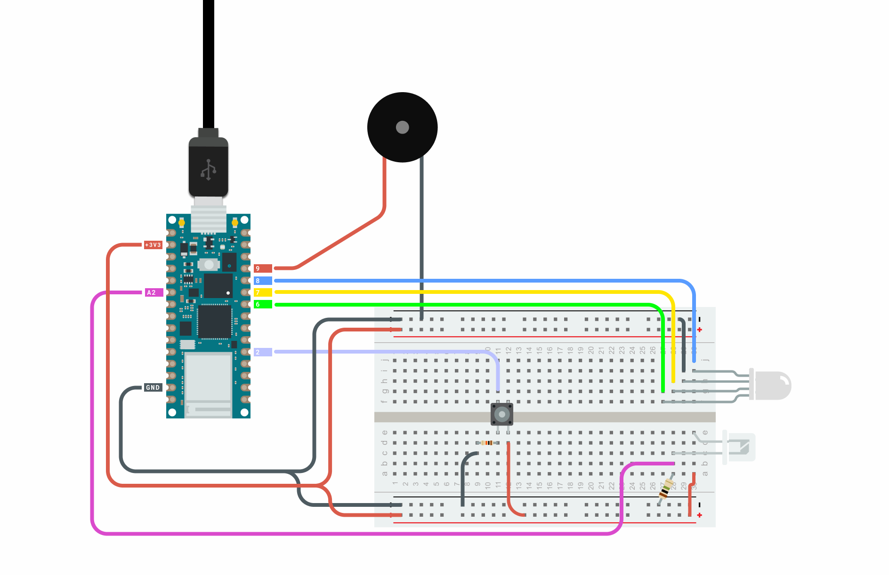
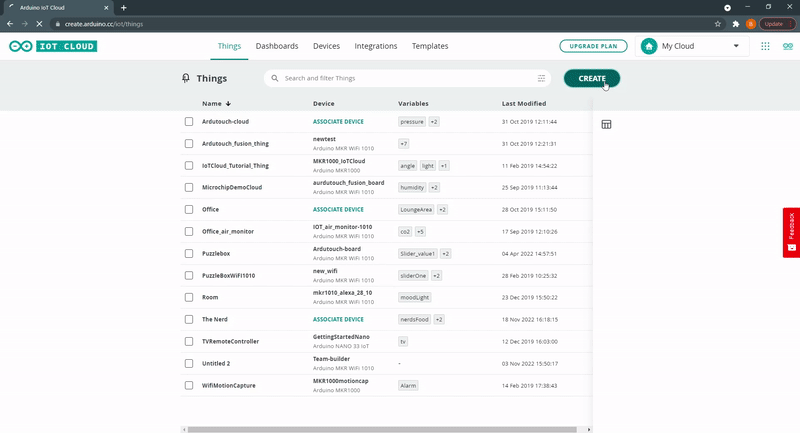
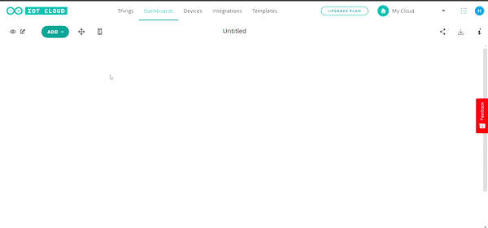

## Components and Supplies

- [Arduino IoT Bundle](https://store.arduino.cc/iot-bundle)

## Apps and Online Services

- [Arduino Cloud](https://cloud.arduino.cc)

## About This Project

**Create a desktop pet with the help of the Arduino Cloud!**

The Nerd is a desktop electronic pet that survives by eating and some sunlight. For it to thrive, you must feed it periodically and expose it to sunlight. If it is running out of food, it will communicate an SOS in Morse code using its built-in piezo speaker.

### In a Nutshell

The Nerd will need food which you can give it by pressing its button. Otherwise, it will die. The nerd will be connected to the Arduino Cloud, where we can visualize the amount of food the Nerd has and the level of light it is in. If the Nerd runs out of food, it will die dramatically, making a lot of noise.

### Components

* RGB LED
* Phototransistor
* Buzzer
* Push button
* 1M Ohm resistor
* 10K Ohm resistor

### Learning Goals

* Introducing the Arduino Cloud
* Introducing the Arduino IoT Cloud Remote app
* Managing sensors with the Arduino Cloud
* Creating an Arduino Cloud Dashboard

### Want to Know More?

This tutorial is part of a series of experiments that familiarise you with the Arduino MKR IoT Bundle. All experiments can be built using the components contained in the Arduino MKR IoT Bundle.

* [I Love You Pillow with the Arduino IoT Bundle ](/tutorials/iot-bundle/i-love-you-pillow)
* [Puzzle Box with Arduino IoT Bundle ](/tutorials/iot-bundle/puzzlebox)
* [Plant Communicator with the Arduino IoT Bundle ](/tutorials/iot-bundle/plant-communicator)
* [Pavlov's Cat with the Arduino IoT Bundle](/tutorials/iot-bundle/pavlovs-cat)

### Circuit

In this project, we will be using the following circuit. In it, we have a 1M Ohm resistor connected between the ground and the A2 pin used for the phototransistor. And a 10k Ohm resistor connected between between ground and the push button.



***Make sure to place the phototransistor in reverse polarity, meaning the long leg is connected to A2 and the short leg is connected to 3.3 V.***

### Setting up the Arduino Cloud

If you are new to the Arduino Cloud, check out our [Getting Started Guide](https://docs.arduino.cc/arduino-cloud/getting-started/iot-cloud-getting-started).

### Template

To connect your board to the Arduino Cloud, we will use [The Nerd Template](https://create.arduino.cc/iot/templates/the-nerd). This template installs a specific sketch on your board and creates a dashboard that allows you to interact with your board: you don't need to write any code at all! 

See the image below to understand how to set it up.


Creating a new thing and dashboard is easy. First, go to the Arduino Cloud site [here](https://create.arduino.cc/iot). Setting up the Cloud consists of the following parts:

* Creating a **Thing**
* Attaching a **Device**
* Adding **Variables**
* Adding **Network** credentials



### Variables

We will start by adding three variables:

- `nerdsFood` - `INT` - `READ ONLY`

- `nerdsLight` - `INT` - `READ ONLY`

### Dashboard

The next step to deploying our project is adding a control panel using the Arduino IoT Dashboards. We can navigate to **Dashboards > Build Dashboard > ADD**, then we can add two widgets and link them to the variable as the following:

* Gauge widget -> nerdsFood (max. 12)
* Gauge widget -> nerdsLight (max. 500)



### Setup Hardware & Sketch

**Keeping track of the Nerd's food**

To keep track of the Nerd's food we will be using an **int** variable. When the Nerd is in enough sunlight and the button is pressed it will be fed. Making a sound so you know that it received the food. The RGB LED will change color depending on the Nerd's hunger state.

```
/* Set color status feedback */
if(nerdsFood < 4){        /* if starving show red */
    setColor(255, 0, 0);  /* Red */
}
else if(nerdsFood >= 4 && nerdsFood < 8){
    setColor(255, 255, 0); /* yellow */
}
else{
    setColor(0, 255, 0); /* green */
}
```

To keep track of time, we store a timestamp using `millis()` at a specific event, such as when the food supply is last decremented. Then, at regular intervals, we compare the current `millis()` value with this stored timestamp to determine if a certain amount of time has elapsed. For example, if we want to decrease the food supply every 10 minutes, we check if the difference between the current millis() value and the stored timestamp is greater than or equal to 600,000 milliseconds (10 minutes in milliseconds).

The max food storage is set to 12, this can be expanded by changing the threshold in the "**if"** operator, and don't forget to update the tracker on the dashboard as well so you can accurately track the food that the Nerd has.

```arduino
 if (currentMillis - previousMillis >= interval) {
    // save the last time you called onNerdsTimeChange 
    previousMillis = currentMillis;

    // call the eating function
    eating();
  }
```

```arduino
void eating() {
  if(nerdsFood > 0){
    nerdsFood--;
    delay(200);
  }
```

The Nerd will start with 2 food the first time it wakes up, then this value will be tracked by the Cloud. If it dies it will start over with 2 food as well.

```arduino
  if(nerdsFood == 0 && justWokeUp == false && !sosTriggered){
    // DIE :(
    SOS();
    sosTriggered = true;
  }
```

**Checking the light level**

To check so that our Nerd gets enough sunlight we will use a Phototransistor. Keeping track of the light level with the **nerdsLight** Cloud variable.

```
int sensorPin = A2;
nerdsLight = analogRead(sensorPin);
```

When the Nerd first wakes up, this is when the device is started and the Nerd first receives sunlight. It will make a sound and blink its light. Then the variable will be checked every time you try to give the Nerd some food. The threshold of the light level can be changed if you are having trouble feeding the Nerd. You can use the Cloud to check what values you get when the Nerd is in the light, and then change the threshold here in the code:

```
if(nerdsFood < 12 && nerdsLight > 300)
```

**Time tracker with the Arduino Cloud**

The Nerd will get hungry every 10 minutes and eat the food it has been given. To keep track of when the Nerd gets hungry we will use a time variable from the Arduino Cloud. We will use the auto-generated functions we get from the Arduino Cloud to make the changes to the Nerd's food when it eats. This function will be executed after an amount of time has passed. The time is determined in the nerdsTime variable configuration. In this example we set the time to be 10 minutes, this has to be stated in seconds.

### Want to Know More?

This tutorial is part of a series of experiments that familiarize you with the Arduino IoT Bundle. All experiments can be built using the components contained in the IoT Bundle.

* [I Love You Pillow with the Arduino IoT Bundle ](/tutorials/iot-bundle/i-love-you-pillow)
* [Puzzle Box with Arduino IoT Bundle ](/tutorials/iot-bundle/puzzlebox)
* [Plant Communicator with the Arduino IoT Bundle ](/tutorials/iot-bundle/plant-communicator)
* [Pavlov's Cat with the Arduino IoT Bundle](/tutorials/iot-bundle/pavlovs-cat)

## Full Code

***Note: For the code to work you also need `thingProperties.h` which is automatically generated when creating a Cloud sketch.***

```arduino
#include "thingProperties.h"

// RGB LED pins 
int redPin = 6; 
int greenPin = 8; 
int bluePin = 7; 

int buzzerPin = 9;
int sensorPin = A2;
int buttonPin = 2;  // the number of the pushbutton pin

bool justWokeUp = true;
bool sosTriggered = false;
int buttonState = 0;

unsigned long previousMillis = 0;
const long interval = 600000;  // 10 minutes interval in milliseconds

void setup() {
  Serial.begin(9600);
  delay(1500); 
  initProperties();
  ArduinoCloud.begin(ArduinoIoTPreferredConnection);
  setDebugMessageLevel(2);
  ArduinoCloud.printDebugInfo();

  pinMode(redPin, OUTPUT); 
  pinMode(greenPin, OUTPUT); 
  pinMode(bluePin, OUTPUT); 
  pinMode(buttonPin, INPUT);

  nerdsFood = 5;
}

void loop() {
  ArduinoCloud.update();
  
  unsigned long currentMillis = millis();

  nerdsLight = analogRead(sensorPin);
  buttonState = digitalRead(buttonPin);

  // Awaking notification
  if(nerdsLight < 300 && justWokeUp){

    //Print wake up message
    Serial.println("woke up");

    setColor(0, 255, 0); // green 
    tone(buzzerPin, 262, 1000); // tone(Pin, Note, Duration);
    delay(2000);
    setColor(0, 0, 0); // off 
    noTone(buzzerPin);
    delay(1000);
    justWokeUp = false;
  }

  if (buttonState == HIGH && !sosTriggered) {
    if(nerdsFood < 12 && nerdsLight > 300){
      nerdsFood++;
      tone(buzzerPin, 40, 300); // tone(Pin, Note, Duration);
      delay(100);
      tone(buzzerPin, 40, 300); // tone(Pin, Note, Duration);
      delay(100);
      noTone(buzzerPin);
    }
    delay(100);
  }
  
  // Set color status feedback
  if(nerdsFood < 4){ // if starving show red
    setColor(255, 0, 0); // Red 
  }
  else if(nerdsFood >= 4 && nerdsFood < 8){
    setColor(255, 255, 0); // yellow 
  }
  else{ 
    setColor(0, 255, 0); // green 
  }
  
 if (currentMillis - previousMillis >= interval) {
    // save the last time you called onNerdsTimeChange 
    previousMillis = currentMillis;

    // call the hungry function
    eating();
  }
  
  if(nerdsFood == 0 && justWokeUp == false && !sosTriggered){
    // DIE :(
    SOS();
    sosTriggered = true;
  }
  
}


void SOS(){
  for(int a = 0; a < 3; a++){  
    setColor(255, 0, 0); // Red 
    tone(buzzerPin, 262, 4); // tone(Pin, Note, Duration);
    delay(100);
    setColor(0, 0, 0); // off 
    noTone(buzzerPin);
    delay(50);
  }
  
  delay(1000);
  for(int a = 0; a < 3; a++){  
    setColor(255, 0, 0); // Red 
    tone(buzzerPin, 262, 2000); // tone(Pin, Note, Duration);
    delay(1000);
  }
  
  for(int a = 0; a < 3; a++){  
    setColor(255, 0, 0); // Red 
    tone(buzzerPin, 262, 100); // tone(Pin, Note, Duration);
    delay(100);
    setColor(0, 0, 0); // off 
    noTone(buzzerPin);
    delay(50);
  }
  delay(1000);
}

// Send RGB values to the LED pins 
void setColor(int red, int green, int blue){ 
 analogWrite(redPin, red); 
 analogWrite(greenPin, green); 
 analogWrite(bluePin, blue);   
}

void eating(){
  if(nerdsFood > 0){
    nerdsFood--;
    delay(200);
  }
}


```
