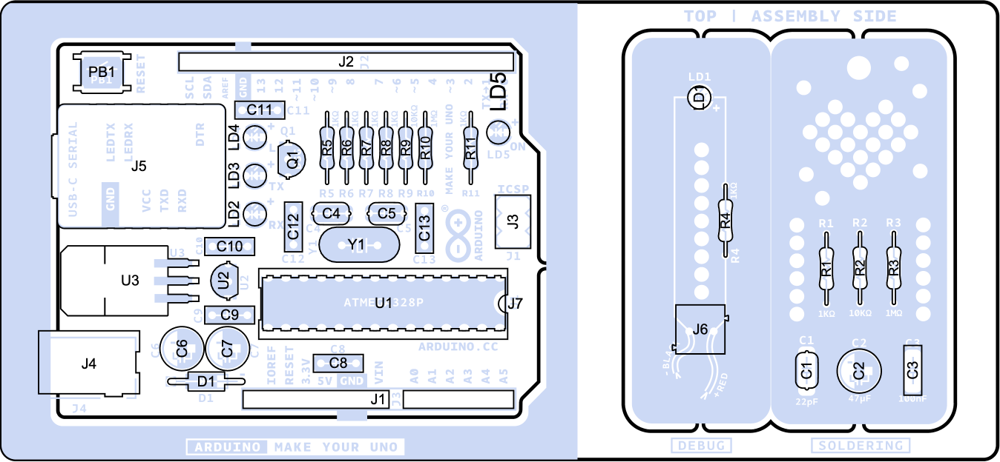

# Description
The **Arduino Make Your UNO Kit** is the perfect kit to learn the basics of electronics and coding by assembling your own **Arduino UNO**. Become familiar with soldering by mounting every single component, unleash your creativity with the **Audio Synth Shield**, and learn how to code using your new **Arduino UNO** board to create amazing projects!

# Target areas:
Maker, introduction, education

# Features
<table>
    <thead>
        <tr>
            <th colspan="3" style="width:auto;text-align:center">Make Your UNO board</th>
        </tr>
        <tr>
            <th>Component</th>
            <th colspan="3">Details</th>
        </tr>
    </thead>
    <tbody>
        <tr>
         <td rowspan="3">ATMega328P Processor</td>
         <td>Memory</td>
         <td colspan="2">
            
AVR CPU at up to 16 MHz

            
32kB Flash

            
2kB SRAM

            
1kB EEPROM

         </td>
        </tr>
        <tr>
            <td>Security</td>
            <td colspan="2">
                
Power On Reset (POR)

                
Brown Out Detection (BOD)

            </td>
        </tr>
        <tr>
            <td>Peripherals</td>
            <td colspan="2">
                
2x 8-bit Timer/Counter with a dedicated period register and compare channels

                
1x 16-bit Timer/Counter with a dedicated period register, input capture and compare channels 

                
1x USART with fractional baud rate generator and start-of-frame detection

                
1x controller/peripheral Serial Peripheral Interface (SPI)

                
1x Dual mode controller/peripheral I2C

                
1x Analog Comparator (AC) with a scalable reference input

                
Watchdog Timer with separate on-chip oscillator

                
6x PWM channels

                
Interrupt and wake-up on pin change

            </td>
        </tr>
        <tr>
            <td rowspan="4">USB-C® Serial PCB Board</td>
            <td colspan="3"> 
The USB-C® Serial PCB contains the ATMega16U2 processor and a USB-C® socket to program and power the board.
</td>
        </tr>
        <tr>
            <td>ATMega16U2 Processor</td>
            <td colspan="2">8-bit AVR® RISC-based microcontroller</td>
        </tr>
        <tr>
            <td>Memory</td>
                <td colspan="2">
                    
16 KB ISP Flash

                    
512B EEPROM

                    
512B SRAM

                    
debugWIRE interface for on-chip debugging and programming

                </td>
        </tr>
        <tr>
            <td>Power</td>
            <td colspan="2">2.7V-5.5V</td>
        </tr>
    </tbody>
</table>

<table>
    <thead>
        <tr>
            <th colspan="4" style="width:auto;text-align:center">Audio Synth Shield</th>
        </tr>
        <tr>
            <th>Component</th>
            <th colspan="3">Details</th>
        </tr>
    </thead>
    <tbody>
        <tr>
            <td rowspan="4">Audio Synth Shield</td>
            <td colspan="1">Potentiometers</td>
            <td colspan="2">
                
5x 10kΩ - Trimmer potentiometer - User programmable

                
1x 10kΩ - Trimmer potentiometer - Directly connected to the audio amplifier

            </td>
            <tr>
            <td rowspan="2">Audio</td>
            <td>
                
Amplifier: LM386

            </td>
            <td>
                
Class-AB

                
4Ω Load

                
0.325W

            </td>
            </tr>
            <tr>
                <td>
                    
Speaker: L50EJ

                </td>
                <td>
                    
Impedance @2kHz: 8Ω

                    
Max Power 0.5W

                    
Output: 81dB +-3dB

                    
Diameter 45mm

                    
Weight: 48g

                </td>
            </tr>
        </tr>
    </tbody>
</table>

# CONTENTS
## The Kit
### Application Examples
The **Arduino Make Your UNO kit** is like any **Arduino UNO** board but created by yourself. The **Arduino UNO** (from here on referred to as UNO) board is the flagship product of Arduino
Regardless if you are new to the world of electronics or will use the **UNO** as a tool for education purposes or industry-related tasks.

**First entry to electronics:** If this is your first project within coding and electronics, get started with our most used and documented board **UNO** and create one by yourself using the **Arduino Make Your UNO kit** is a great choice. It is equipped with the well-known ATmega328P processor, 14 digital input/output pins, 6 analog inputs, USB connections, ICSP header and a reset button. This board includes everything you will need for a great first experience with Arduino.

**Education purposes:** Although the UNO board has been with us for about ten years, it is still widely used for various educational purposes and scientific projects. The **Arduino Make Your UNO kit** is the perfect way to teach and learn about basic circuits, electronics components, soldering and coding microcontrollers, being the perfect board to create basic and advanced projects of all kinds.

**Audio synthesizer for educational and artistic performances**: The kit comes with an **Audio Synth Shield** that can be attached to the **Arduino Make Your UNO** to learn about and experiment with audio synthesizers, being a perfect device to play and experiment in the classroom and at the same time a great instrument for artistic performances.

### Related Products (Not Included)
* [Arduino UNO R3 (A000066)](https://store.arduino.cc/products/arduino-uno-rev3) and [Arduino UNO R3 SMD (A000066)](https://store.arduino.cc/products/arduino-uno-rev3-smd)
* [Arduino Starter Kit (K000007)](https://store.arduino.cc/products/arduino-starter-kit-multi-language)
* [Tinkerkit Braccio Robot (T050000)](https://store.arduino.cc/products/tinkerkit-braccio-robot)
* [Arduino 4 Relays Shield (A000110)](https://store.arduino.cc/products/arduino-4-relays-shield)
* [Arduino 9 Axis Motion Shield (A000070)](https://store.arduino.cc/products/arduino-9-axis-motion-shield)
* [Arduino Ethernet Shield 2 (A000024)](https://store.arduino.cc/products/arduino-ethernet-shield-2)
* [Arduino Motor Shield Rev3 (A000079)](https://store.arduino.cc/products/arduino-motor-shield-rev3)

### Solution Overview
The **Arduino Make Your UNO kit** contains different boards. Besides the **UNO** board, the kit contains two additional small boards that helps the user to learn to solder its first components before starting to solder the main board. The small board with the heart shape is just for practising and it does not have any circuit or utility while the small board that contains the LED and the resistor can be powered with a 9V battery to turn on the LED.

Once the kit is assembled, the user can solder and assemble the **Audio Synth Shield** board and connect it on top of the **Make Your UNO** board to use the kit as an audio synthesizer.

## Ratings
### Recommended Operating Conditions

| Description                                      | Min            | Max            |
| ------------------------------------------------ | -------------- | -------------- |
| Conservative thermal limits for the whole board | -40 °C (-40°F) | 85 °C ( 185°F) |

**NOTE:** In extreme temperatures, the EEPROM, voltage regulator, and the crystal oscillator, might not work as expected due to the temperature conditions.

### Power Consumption

| Symbol  | Description                                       | Min | Typ | Max | Unit |
| ------- | ------------------------------------------------- | --- | --- | --- | ---- |
| VINMax  | Maximum input voltage from Jack connector/VIN pad | 6   | -   | 20  | V    |
| VUSBMax | Maximum input voltage from USB connector          |     | -   | 5.5 | V    |
| PMax    | Maximum Power Consumption                         | -   | -   | xx  | mA   |

## Make Your UNO Board
### Functional Overview
#### Board Topology And Bill Of Materials

The **BOM** or **Bill Of Materials** of the **Arduino Make Your UNO kit** is made up of common components that can be found on the market. Use this list to reference and/or replace a damaged component if necessary. The designator references can be found written on the board and inside the board source files.

| **Designator**                | **Quantity** | **Description**                                  |
| ----------------------------- | ------------ | ------------------------------------------------ |
| C3, C8, C9, C10, C11, C12, C13| 7            | Capacitor THD 100nF 63V                          |
| C1, C4, C5                    | 3            | Capacitor THD 22pF 50V C0G 5%                    |
| C2, C6, C7                    | 3            | Capacitor ALUM POL THD 47µF 25V                  |
| D1                            | 1            | Rectifier diode \[1N4007\]                       |
| J1                            | 1            | UNO header connector - analog I/Os 14 positions  |
| J2                            | 1            | UNO header connector - digital I/Os 18 positions |
| J3                            | 1            | SPI header                                       |
| J4                            | 1            | Power supply jack, 6 position                    |
| J5                            | 1            | USB-C® to Serial breakout board                   |
| J7                            | 1            | IC socket connector dual in place 28 positions   |
| LD1, LD2, LD3, LD4            | 4            | LED Yellow diffused, 3mm                         |
| LD5                           | 1            | LED Green diffused, 3mm                          |
| PB1                           | 1            | Push-Button                                      |
| Q1                            | 1            | N-Channel Mosfet Transistor 0.2A                 |
| R1, R4, R5, R6, R7, R8, R11   | 7            | Axial resistor 1kΩ, 1/4W, 5%                     |
| R2, R9                        | 2            | Axial resistor 10kΩ, 1/4W, 5%                    |
| R3, R10                       | 2            | Axial resistor 1MΩ, 1/4w, 5%                     |
| U2                            | 1            | LDO Regulator 3.3V                               |
| Y1                            | 1            | Quartz crystal oscillator 16MHz 20pF THD         |
|                               | 1            | PCB Arduino Make Your UNO                        |
|                               | 1            | Jumper wire Red 15cm                             |
|                               | 1            | Jumper wire Black 15cm                           |

Some of the components listed above are available in a replacement pack on the <ins>[Arduino Store](https://store.arduino.cc/products/arduino-replacements-pack)</ins>.

### Processor
The Main Processor is an ATmega328P running at up to 20 MHz. Most of its pins are connected to the external headers, however, some are reserved for internal communication with the USB Bridge coprocessor (**ATMega16U2**) inside the **USB-C® Serial PCB Board**.

### Power Tree

### Board Operation
#### Official Instructions
The official documentation provided by Arduino to solder the entire kit is hosted at <ins>[https://makeyouruno.arduino.cc](https://makeyouruno.arduino.cc/)</ins>

#### Getting Started - IDE
If you want to program your **UNO** while offline you need to install the Arduino Desktop IDE [1]. To connect the **UNO** to your computer, you’ll need a USB-C® cable. This also provides power to the board, as indicated by the LED.

#### Getting Started - Arduino Web Editor
All Arduino boards, including this one, work out-of-the-box on the Arduino Web Editor [2] by just installing a simple plugin.

The Arduino Web Editor is hosted online, therefore it will always be up-to-date with the latest features and support for all boards. Follow [3] to start coding on the browser and upload your sketches onto your board.

#### Getting Started - Arduino IoT Cloud
All Arduino IoT-enabled products are supported on Arduino IoT Cloud which allows you to log, graph and analyze sensor data, trigger events, and automate your home or business. In the case of the **UNO** and the **Make Your UNO** boards, you will need additional hardware to connect them to the cloud.

#### Sample Sketches
Sample sketches for the **UNO** can be found either in the “Examples” menu in the Arduino IDE.

#### Online Resources
Now that you have gone through the basics of what you can do with the board you can explore the endless possibilities it provides by checking exciting projects on ProjectHub [4], the Arduino Library Reference [5] and the online store [6] where you will be able to complement your board with sensors, actuators and more.

### Connector Pinouts

#### JANALOG

| Pin | **Function** | **Type**         | **Description**                                       |
| --- | ------------ | ---------------- | ----------------------------------------------------- |
| 1   | NC           | NC               | Not connected                                         |
| 2   | IOREF        | IOREF            | Reference for digital logic voltage - connected to 5V |
| 3   | Reset        | Reset            | Reset                                                 |
| 4   | +3V3         | Power            | +3.3V Power Rail                                      |
| 5   | +5V          | Power            | +5V Power Rail                                        |
| 6   | GND          | Power            | Ground                                                |
| 7   | GND          | Power            | Ground                                                |
| 8   | VIN          | Power            | Voltage Input                                         |
| 9   | A0           | Analog/GPIO      | Analog input 0 / GPIO                                 |
| 10  | A1           | Analog/GPIO      | Analog input 1 / GPIO                                 |
| 11  | A2           | Analog/GPIO      | Analog input 2 / GPIO                                 |
| 12  | A3           | Analog/GPIO      | Analog input 3 / GPIO                                 |
| 13  | A4/SDA       | Analog input/I2C | Analog input 4 / I2C Data line                        |
| 14  | A5/SCL       | Analog input/I2C | Analog input 5 /I2C Clock line                        |

#### JDIGITAL

| Pin | **Function** | **Type**     | **Description**                              |
| --- | ------------ | ------------ | -------------------------------------------- |
| 1   | D0           | Digital/GPIO | Digital pin 0 / GPIO                         |
| 2   | D1           | Digital/GPIO | Digital pin 1 / GPIO                         |
| 3   | D2           | Digital/GPIO | Digital pin 2 / GPIO                         |
| 4   | D3           | Digital/GPIO | Digital pin 3 / GPIO                         |
| 5   | D4           | Digital/GPIO | Digital pin 4 / GPIO                         |
| 6   | D5           | Digital/GPIO | Digital pin 5 / GPIO                         |
| 7   | D6           | Digital/GPIO | Digital pin 6 / GPIO                         |
| 8   | D7           | Digital/GPIO | Digital pin 7 / GPIO                         |
| 9   | D8           | Digital/GPIO | Digital pin 8 / GPIO                         |
| 10  | D9           | Digital/GPIO | Digital pin 9 / GPIO                         |
| 11  | SS           | Digital      | SPI Chip Select                              |
| 12  | COPI         | Digital      | SPI1 Controller Out Peripheral In            |
| 13  | CIPO         | Digital      | SPI Controller In Controller Out             |
| 14  | SCK          | Digital      | SPI serial clock output                      |
| 15  | GND          | Power        | Ground                                       |
| 16  | AREF         | Digital      | Analog reference voltage                     |
| 17  | A4/SD4       | Digital      | Analog input 4 / I2C Data line (duplicated)  |
| 18  | A5/SD5       | Digital      | Analog input 5 / I2C Clock line (duplicated) |

### Mechanical Information
#### Board Outline & Mounting Holes
The **Arduino Make Your UNO kit** shares with the standard **UNO** boards the same shape and external mechanical board outline. The most important difference is the new USB-C® connector instead of the classical USB Type-B one. The external shape and dimensions, pin headers, mounting holes and jack barrel connector are located in the same place as a standard **UNO** board, being compatible with most of the shields and peripheral devices done for the **UNO** board.

## The Audio Synth Shield
The kit comes with an **Audio Synth Shield** that can be attached to the **Arduino Make Your UNO** to learn about and experiment with audio synthesizers. The shield has six trimmers to control different audio signal parameters plus a mono amplifier that can be connected to the 8 ohm speaker that comes with the kit or to any other audio output.

### Functional Overview
#### Board Topology and Bill of Materials

The **BOM** (Bill Of Materials) of the **Audio Synth Shield** is made up of common components that can be found on the market. Use this list to reference and/or replace a damaged component if necessary. The designator references can be found written on the board and inside the board source files.

| **Designator**         | **Quantity** | **Description**                             |
| ---------------------- | ------------ | ------------------------------------------- |
| C1                     | 1            | Capacitor 47nF 50V 5%                       |
| C2                     | 1            | Capacitor 47µF 25V                          |
| C3                     | 1            | Capacitor 100nF 63V                         |
| C4                     | 1            | Capacitor 220µF 25V                         |
| R1                     | 1            | Axial resistor 100kΩ, 1/4W, 5%                |
| R2                     | 1            | Axial resistor 10Ω, 1/4W, 5%               |
| R3, R4, R5, R6, R7, R8 | 6            | Potentiometer 10kΩ - TRIMMER                |
| J1                     | 1            | UNO header digital connector A 8 positions  |
| J2                     | 1            | UNO header digital connector B 10 positions |
| J3                     | 1            | UNO header analog connector A 6 positions   |
| J4                     | 1            | UNO header analog connector B 8 positions   |
| K1, K2, K3, K4, K5, K6 | 6            | Potentiometer's KNOB D6/9mm                 |
| S1                     | 1            | Paper Speaker 8Ω 1W                         |
| U1                     | 1            | Audio Amplifier, 0.325W                     |
|                        | 1            | PCB Synth Audio shield                      |

### Connector Pinouts
#### JANALOG

| Pin | **Function** | **Type**     | **Description**              |
| --- | ------------ | ------------ | ---------------------------- |
| 5   | +5V          | Power        | +5V Power Rail               |
| 9   | A0           | Analog Input | Analog input 0 /GPIO         |
| 10  | A1           | Analog Input | Analog input 1 /GPIO         |
| 11  | A2           | Analog Input | Analog input 2 /GPIO         |
| 12  | A3           | Analog Input | Analog input 3 /GPIO         |
| 13  | A4/SDA       | Analog Input | Analog input 4/I2C Data line |

#### JDIGITAL

| Pin | **Function** | **Type** | **Description**                    |
| --- | ------------ | -------- | ---------------------------------- |
| 10  | D9           | OUTPUT   | Audio output to Amplifier's AUX IN |
| 15  | GND          | GND      | Ground                             |

### Mechanical Information
#### Board Outline & Mounting Holes
The **Arduino Make Your UNO kit** shares with the standard **UNO** boards the same shape and external mechanical board outline. The most important difference is the new USB-C® connector instead of the classical USB Type-B one. The external shape and dimensions, pin headers, mounting holes and jack barrel connector are located in the same place as a standard **UNO** board, being compatible with most of the shields and peripheral devices done for the **UNO** board.

#### Potentiometers Outline

## Certifications
### Declaration of Conformity CE DoC (EU)
We declare under our sole responsibility that the products above are in conformity with the essential requirements of the following EU Directives and therefore qualify for free movement within markets comprising the European Union (EU) and European Economic Area (EEA).

| Directive                                           | Conforms To                                       |
| --------------------------------------------------- | ------------------------------------------------- |
| ROHS 2 Directive 2011/65/EU                         | EN50581:2012                                      |
| Directive 2014/35/EU. (LVD)                         | EN 60950-1:2006/A11:2009/A1:2010/A12:2011/AC:2011 |
| Directive 2004/40/EC & 2008/46/EC & 2013/35/EU, EMF | EN 62311:2008                                     |

### Declaration of Conformity to EU RoHS & REACH 211 01/19/2021
Arduino boards are in compliance with RoHS 2 Directive 2011/65/EU of the European Parliament and RoHS 3 Directive 2015/863/EU of the Council of 4 June 2015 on the restriction of the use of certain hazardous substances in electrical and electronic equipment.

| Substance                              | **Maximum limit (ppm)** |
| -------------------------------------- | ----------------------- |
| Lead (Pb)                              | 1000                    |
| Cadmium (Cd)                           | 100                     |
| Mercury (Hg)                           | 1000                    |
| Hexavalent Chromium (Cr6+)             | 1000                    |
| Poly Brominated Biphenyls (PBB)        | 1000                    |
| Poly Brominated Diphenyl ethers (PBDE) | 1000                    |
| Bis(2-Ethylhexyl} phthalate (DEHP)     | 1000                    |
| Benzyl butyl phthalate (BBP)           | 1000                    |
| Dibutyl phthalate (DBP)                | 1000                    |
| Diisobutyl phthalate (DIBP)            | 1000                    |

Exemptions: No exemptions are claimed.

Arduino Boards are fully compliant with the related requirements of European Union Regulation (EC) 1907 /2006 concerning the Registration, Evaluation, Authorization and Restriction of Chemicals (REACH). We declare none of the SVHCs (https://echa.europa.eu/web/guest/candidate-list-table), the Candidate List of Substances of Very High Concern for authorization currently released by ECHA, is present in all products (and also package) in quantities totaling in a concentration equal or above 0.1%. To the best of our knowledge, we also declare that our products do not contain any of the substances listed on the "Authorization List" (Annex XIV of the REACH regulations) and Substances of Very High Concern (SVHC) in any significant amounts as specified by the Annex XVII of Candidate list published by ECHA (European Chemical Agency) 1907 /2006/EC.

### Conflict Minerals Declaration
As a global supplier of electronic and electrical components, Arduino is aware of our obligations with regards to laws and regulations regarding Conflict Minerals, specifically the Dodd-Frank Wall Street Reform and Consumer Protection Act, Section 1502. Arduino does not directly source or process conflict minerals such as Tin, Tantalum, Tungsten, or Gold. Conflict minerals are contained in our products in the form of solder, or as a component in metal alloys. As part of our reasonable due diligence Arduino has contacted component suppliers within our supply chain to verify their continued compliance with the regulations. Based on the information received thus far we declare that our products contain Conflict Minerals sourced from conflict-free areas.

## FCC Caution
Any Changes or modifications not expressly approved by the party responsible for compliance could void the user’s authority to operate the equipment.

This device complies with part 15 of the FCC Rules. Operation is subject to the following two conditions:

(1) This device may not cause harmful interference

(2) this device must accept any interference received, including interference that may cause undesired operation.

**FCC RF Radiation Exposure Statement:**

1. This Transmitter must not be co-located or operating in conjunction with any other antenna or transmitter.

2. This equipment complies with RF radiation exposure limits set forth for an uncontrolled environment.

3. This equipment should be installed and operated with minimum distance 20cm between the radiator & your body.

English:
User manuals for license-exempt radio apparatus shall contain the following or equivalent notice in a conspicuous location in the user manual or alternatively on the device or both. This device complies with Industry Canada license-exempt RSS standard(s). Operation is subject to the following two conditions:

(1) this device may not cause interference

(2) this device must accept any interference, including interference that may cause undesired operation of the device.

French:
Le présent appareil est conforme aux CNR d’Industrie Canada applicables aux appareils radio exempts de licence. L’exploitation est autorisée aux deux conditions suivantes :

(1) l’ appareil nedoit pas produire de brouillage

(2) l’utilisateur de l’appareil doit accepter tout brouillage radioélectrique subi, même si le brouillage est susceptible d’en compromettre le fonctionnement.

**IC SAR Warning:**

English
This equipment should be installed and operated with minimum distance 20 cm between the radiator and your body.

French:
Lors de l’ installation et de l’ exploitation de ce dispositif, la distance entre le radiateur et le corps est d ’au moins 20 cm.

**Important:** The operating temperature of the EUT can’t exceed 85℃ and shouldn’t be lower than -40℃.

Hereby, Arduino S.r.l. declares that this product is in compliance with essential requirements and other relevant provisions of Directive 2014/53/EU. This product is allowed to be used in all EU member states.

## Company Information

| Company name    | Arduino S.r.l                           |
| --------------- | --------------------------------------- |
| Company Address | Via Andrea Appiani 25 20900 MONZA Italy |

## Reference Documentation

| Reference                 | **Link**                                                                                            |
| ------------------------- | --------------------------------------------------------------------------------------------------- |
| Arduino IDE (Desktop)     | https://www.arduino.cc/en/software                                                                  |
| Arduino IDE (Cloud)       | https://create.arduino.cc/editor                                                                    |
| Cloud IDE Getting Started | https://create.arduino.cc/projecthub/Arduino_Genuino/getting-started-with-arduino-web-editor-4b3e4a |
| Project Hub               | https://create.arduino.cc/projecthub?by=part&part_id=11332&sort=trending                            |
| Library Reference         | https://www.arduino.cc/reference/en/                                                                |
| Online Store              | https://store.arduino.cc/                                                                           |

## Revision History

| Date       | **Revision** | **Changes**       |
| ---------- | ------------ | ----------------- |
| 01/11/2022 | 1            | First release     |