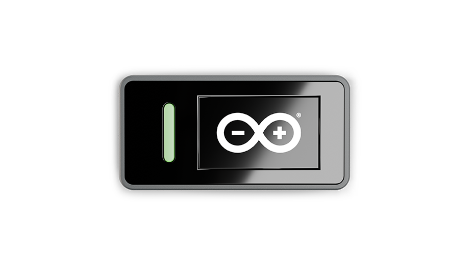

# Description

Arduino® Nesso N1 (hereafter Nesso N1) is a compact, all-in-one IoT development kit powered by the ESP32-C6 microcontroller, a single-core 32-bit RISC-V CPU running at up to 160 MHz. Designed for remote monitoring and automation applications, Nesso N1 combines multiple wireless protocols, such as Wi-Fi® 6, Bluetooth® 5.3, Thread®, and LoRa® into a sleek, portable form factor with an integrated 1.14" touch display and rechargeable 250 mAh battery. Built-in sensors include a 6-axis IMU, passive buzzer, and infrared transmitter, with expansion capabilities through Grove, Qwiic, and M5StickC HAT-compatible connectors.

Nesso N1 can be programmed using Arduino IDE, MicroPython, or UIFlow* (2.0), and integrates seamlessly with Arduino Cloud for remote device management and data visualization. With comprehensive documentation, ready-to-use examples, and compatibility with Arduino Modulino® nodes and third-party accessories, Nesso N1 accelerates the development of connected devices for smart homes, industrial automation, and environmental monitoring.

  <strong>* UIFlow v2.0 Support:</strong> UIFlow support is not yet available. Support will be available by the end of Q4 2025.

# Target Areas

Smart home automation, remote monitoring, Industrial IoT (IIoT), environmental sensing, wearables, prototyping, STEM

# CONTENTS

## Application Examples

Nesso N1 combines multi-protocol wireless connectivity (Wi-Fi® 6, Bluetooth® 5.3, Thread, LoRa®) with integrated sensors, a touch display, and battery operation, making it a versatile platform for IoT applications. Alongside expansion via Grove, Qwiic, and HAT connectors, it supports Arduino Modulino® nodes and third-party Qwiic, Grove, and M5StickC HAT accessories for diverse connected device projects.

**Smart Home Hub:** Central control hub for smart home devices, integrating with platforms like Home Assistant via Wi-Fi®, Thread, or LoRa® connectivity.

- **IR to IoT Gateway:** Transforms traditional infrared remote-controlled devices (TVs, air conditioners, fans) into smart, connected appliances controllable via Wi-Fi® or cloud platforms.

- **Environmental Monitoring:** Remote weather stations and sensor nodes monitoring temperature, humidity, and air quality with external sensors, logging data to Arduino Cloud via LoRa®.

- **Industrial IoT Edge Node:** Aggregates sensor data from factory equipment using multiple wireless protocols, transmitting real-time machine status and predictive maintenance alerts to cloud platforms.

- **Asset Tracking:** Monitors equipment location and status in warehouses, construction sites, or logistics operations using integrated IMU and wireless connectivity.

- **Agriculture Monitoring:** Connects soil moisture, weather, and irrigation sensors via LoRa® or Thread to optimize resource usage in precision agriculture applications.

- **Education and Prototyping:** Hands-on learning platform for IoT protocols (Wi-Fi® 6, Bluetooth® 5.3, Thread, LoRa®) and rapid development of connected device proof-of-concepts with pre-configured hardware.

- **Home Automation:** Custom automation systems including automated lighting, security systems, and environmental controls when combined with Modulino nodes or Grove sensors.

## Features

### General Specifications Overview

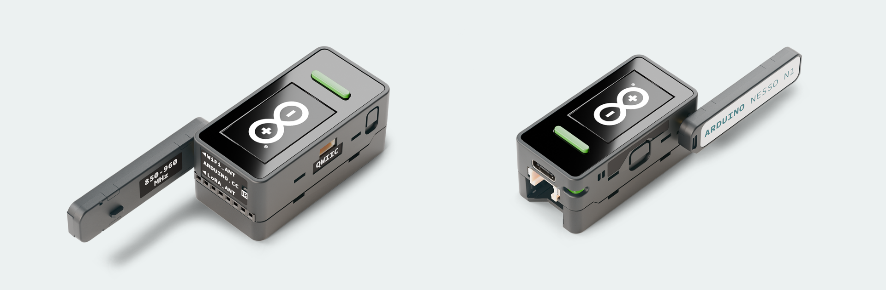

#### Processing and Memory

| **Component**   | **Details**                                                                                                                                                           |
|-----------------|-----------------------------------------------------------------------------------------------------------------------------------------------------------------------|
| Microcontroller | - ESP32-C6 RISC-V 32-bit single-core CPU @ 160 MHz - Wi-Fi® 6 (802.11ax), Bluetooth® 5.3, 802.15.4 (Thread/Zigbee®) - 16 MB external Flash (GD25Q128/W25Q128) |
| System Memory   | - 1536 kB on-chip Flash - 512 kB on-chip SRAM - 16 MB external Flash for application storage                                                                  |

#### Connectivity and Wireless

| **Component**       | **Details**                                                                                                                                                                                       |
|---------------------|---------------------------------------------------------------------------------------------------------------------------------------------------------------------------------------------------|
| Wireless (ESP32-C6) | - 2.4 GHz Wi-Fi® 6 (802.11ax) - Bluetooth® 5.3 LE - 802.15.4 Thread/Zigbee® - Dedicated FPC antenna                                                                                   |
| LoRa® Module        | - SX1262 transceiver (850-960 MHz) - Detachable external IPEX4 antenna - FM8625H LNA for receive path - SGM13005L4 amplifier for transmit path - Antenna storage within enclosure |
| USB Interface       | - USB-C connector - 5V DC input for charging and programming - USB 3.0 data interface                                                                                                     |

#### Display and User Interface

| **Component**    | **Details**                                                                                                             |
|------------------|-------------------------------------------------------------------------------------------------------------------------|
| Display          | - 1.14" IPS LCD - ST7789P3 driver @ SPI communication - Resolution: 135 × 240 pixels - 262K colors (18-bit) |
| Touch Controller | - FT6336U capacitive touch controller - I²C communication                                                           |
| User Buttons     | - 2× programmable buttons (KEY1, KEY2) - 1× power button (long-press reset function)                                |
| LEDs             | - 1× green user programmable LED - 1× blue power/status LED                                                         |
| Audio Feedback   | - Passive buzzer (4 kHz) - GPIO-controlled                                                                          |
| Infrared         | - IR LED transmitter - Remote control and signal transmission capability                                            |

#### Sensors and Expansion

| **Component**   | **Details**                                                                                                                                                     |
|-----------------|-----------------------------------------------------------------------------------------------------------------------------------------------------------------|
| IMU Sensor      | - BMI270 6-axis IMU - 3-axis accelerometer + 3-axis gyroscope - I²C communication - Motion and orientation detection                                |
| Expansion Ports | - Grove connector (HY2.0-4P): I²C, GPIO, power - Qwiic connector (PH1.0-4P): I²C interface - 8-pin HAT port: M5StickC HAT-compatible (GPIO, ADC, power) |

#### Power System

| **Component**      | **Details**                                                                                                                                                                                      |
|--------------------|--------------------------------------------------------------------------------------------------------------------------------------------------------------------------------------------------|
| Battery            | - 250 mAh lithium polymer battery (3.7 - 4.2 V) - Integrated within enclosure                                                                                                                |
| Power Management   | - AW32001ECSR charge controller with power path management - BQ27220YZFR battery fuel gauge (real-time capacity, voltage, current monitoring) - Over-current and over-voltage protection |
| Voltage Regulation | - JW5712 DC-DC buck converter (battery to 3.3V system rail) - SGM6603 boost converter (3.3V to 5V output for peripherals)                                                                    |
| Input Voltage      | - USB-C®: 5V DC input - Battery nominal: 3.7 V (3.7 - 4.2 V range)                                                                                                                           |

### Related Products

- Arduino Modulino® Family 
- Grove sensors and actuators (I²C, GPIO)
- Qwiic ecosystem modules
- M5StickC HAT accessories
- LoRa® antennas (850-960 MHz, IPEX4 connector)

## Ratings

### Input Power

| **Source**     | **Voltage Range** | **Maximum Current** | **Connector**    |
|----------------|------------------:|--------------------:|------------------|
| USB-C®         |               5 V |           up to 1 A | USB-C® connector |
| Battery (LiPo) |       3.7 - 4.2 V |             250 mAh | Internal         |

Nesso N1 is powered via a USB-C® connector accepting 5 V DC input for charging and operation, or through the integrated 250 mAh lithium polymer battery. The AW32001 power management IC handles charge control and power path management, allowing simultaneous charging and operation. Use a USB power source rated for at least 5 V at 1 A to ensure proper charging and operation during peak power consumption (e.g., Wi-Fi® transmission, display backlight at maximum, LoRa® transmission).

Two main power functions are performed as follows: 

- 
<strong>Battery charging:</strong> The AW32001 provides intelligent charge management with over-current and over-voltage protection. Charge current is automatically regulated based on input power availability and battery state.

- 
<strong>Battery monitoring:</strong> The BQ27220 fuel gauge continuously monitors battery voltage, current, and remaining capacity. Battery status data is accessible via I²C interface for real-time reporting.

### Recommended Operating Conditions

Use the limits below to define the operating environment, thermal margins, and power source specifications:

| **Parameter**         | **Symbol**      | **Minimum** | **Typical** | **Maximum** | **Unit** |
|-----------------------|-----------------|:-----------:|:-----------:|:-----------:|:--------:|
| USB-C® input          | `V_USB`         |     4.75    |     5.0     |     5.25    |    V     |
| Battery voltage       | `V_BAT`         |     3.0     |     3.7     |     4.2     |    V     |
| 3.3V system rail      | `V_SYS`         |     3.1     |     3.3     |     3.5     |    V     |
| Operating temperature | `T_OP`          |      0      |      -      |     40      |    °C    |

  
<strong>Operating Conditions:</strong> <em>Minimum</em> values represent the lowest continuous operating point. Brief drops below these levels may cause a brownout or reset. <em>Typical</em> represents nominal design conditions. <em>Maximum</em> must not be exceeded to prevent damage. For battery voltage, 3.0 V represents the low-battery cutoff threshold, and 4.2 V is the fully charged state. The operating temperature range refers to the ambient air temperature near the device.

### On-Board Voltage Rails

| **Voltage** | **Rail**     | **Origin / Regulator**                                                |
|------------:|--------------|-----------------------------------------------------------------------|
|       5.0 V | `V_USB`      | USB-C® input                                                          |
| 3.7 - 4.2 V | `V_BAT`      | Internal lithium polymer battery                                      |
|       3.3 V | `SYS_3.3V`   | JW5712 buck converter from battery (main system rail)                 |
|       5.0 V | `INT_5VOUT`  | SGM6603 boost converter from 3.3V rail (for peripherals requiring 5V) |

## Functional Overview

### Pinout

### Block Diagram

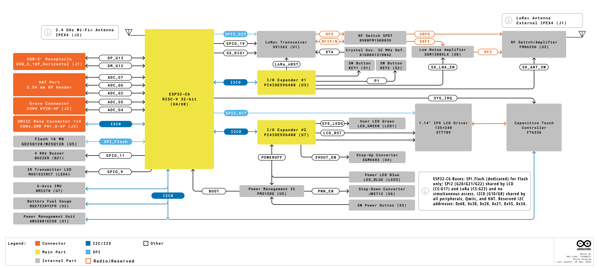

### Power Supply

Nesso N1 uses a power management architecture optimized for battery-powered IoT applications. The system takes 5 V DC input via the USB-C® connector, which provides the AW32001ECSR power management IC. This IC manages charge control for the 250 mAh lithium polymer battery (3.7 - 4.2 V nominal) and provides power path management, allowing simultaneous charging and operation.

The JW5712 DC-DC buck converter steps down the battery voltage to generate the main 3.3 V system rail (<code>SYS_3.3V</code>), which powers the ESP32-C6 microcontroller, sensors, display controller, and most system peripherals. For peripherals requiring 5 V operation (such as certain HAT accessories), the SGM6603 boost converter steps up the 3.3 V rail to provide a regulated 5V output (<code>INT_5VOUT</code>).

The BQ27220YZFR fuel gauge IC continuously monitors battery voltage, current, and state of charge through dedicated sense connections to the battery. Real-time battery status information is accessible via the I²C interface. The system includes comprehensive protection circuitry against over-current, over-voltage, and reverse polarity conditions.

When USB power is disconnected, the device operates entirely from battery power. The power management system automatically transitions between power sources without disrupting operations.

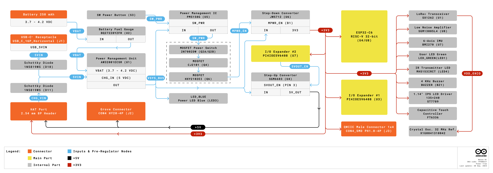

The integrated 250 mAh lithium polymer battery (3.7 - 4.2 V nominal) provides portable operation for remote and mobile applications. The BQ27220 fuel gauge continuously monitors battery voltage, current, and remaining capacity in real-time, with status data accessible via I²C interface for integration into user applications. Typical runtime varies based on wireless activity (Wi-Fi®, Bluetooth®, LoRa® transmission frequency), display brightness settings, and connected peripheral power consumption.

To maximize battery life, leverage the ESP32-C6's deep sleep modes when inactive, reducing power consumption to minimal levels. Display backlight brightness can be reduced or disabled entirely when visual feedback is not required. Unused wireless radios (Wi-Fi®, Bluetooth®, or LoRa®) should be disabled to conserve power.

The BMI270 IMU's interrupt outputs enable motion-triggered wake-up, allowing the system to remain in low-power mode until physical movement is detected. For LoRa® applications, Class A operation provides the lowest power consumption profile, which is ideal for battery-powered sensor nodes with infrequent uplink transmissions.

**Power Button Behavior:**
- **Single press:** Turns on the device if powered down or resets if done while operating
- **Double press:** Turns off the device
- **Long press:** Enters Download/Bootloader mode (works both when the device is on or off)

## UI & Indicators

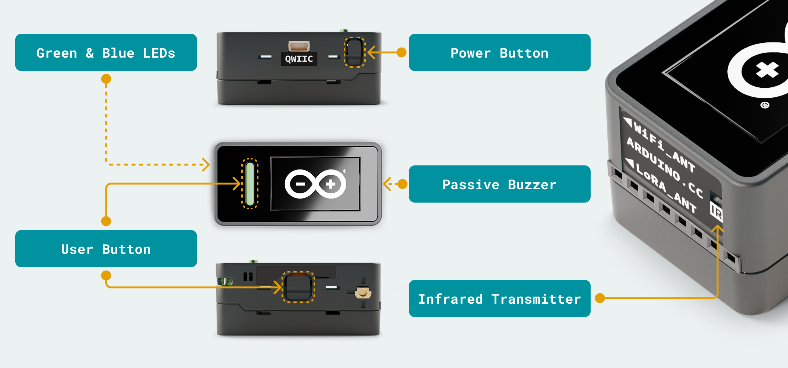

- **Green User LED (LED1):** Programmable user LED controlled by ESP32-C6 GPIO. Available for custom application feedback and status indication.

- **Blue Power LED (LED3):** Indicates power status. Illuminated when the device is powered on (tied to VBUS rail via current-limiting resistor).

- **Programmable Buttons:**
  - **KEY1 (S1):** User-programmable button connected to I/O expander P0
  - **KEY2 (S2):** User-programmable button connected to I/O expander P1

- **Power Button (SW_PWR):** Controls device power state. Single-press turns on the device if powered down or resets if done while operating. Double-press turns off the device. Long press enters Download/Bootloader mode.

- **Buzzer (BZ1):** 4 kHz passive buzzer driven by `GPIO11` through transistor driver circuit. Provides audio feedback for alarms, notifications, and user interactions.

- **Infrared Transmitter (LED4):** IR LED driven by `GPIO9` through transistor driver circuit. Enables remote control of IR-compatible devices (TVs, air conditioners, etc.).

## Microcontroller and Processing

### ESP32-C6 Microcontroller

The ESP32-C6 is a single-core 32-bit RISC-V microcontroller running at up to 160 MHz, designed specifically for IoT applications requiring multiple wireless protocols. It integrates 2.4 GHz Wi-Fi® 6 (802.11ax), Bluetooth® 5.3 LE, and IEEE 802.15.4 (Thread/Zigbee®) radios on a single chip, reducing component count and system complexity.

**Key specifications:**
- 32-bit RISC-V single-core processor @ 160 MHz maximum
- 1536 kB on-chip Flash, 512 kB on-chip SRAM
- 16 MB external Flash (GD25Q128 / W25Q128) via SPI interface for application storage
- Hardware cryptographic accelerators (AES, SHA, RSA)
- Low-power modes for battery-operated applications

**Wireless capabilities:**
- **Wi-Fi® 6 (802.11ax):** 2.4 GHz band, supports target wake time (TWT) for power savings
- **Bluetooth® 5.3 LE:** Low energy mode for peripheral and beacon applications
- **802.15.4 (Thread/Zigbee®):** Mesh networking capability for smart home and industrial applications

  <strong>Note:</strong> The Wi-Fi® and Bluetooth® connectivity uses a dedicated FPC antenna integrated into the device. Removing or modifying the FPC antenna may cause wireless connectivity to stop working.

**Peripheral interfaces:**
- Multiple GPIO pins with configurable functions
- I²C, SPI, UART communication interfaces
- PWM outputs for LED control, servo motors
- ADC inputs for analog sensor reading
- Touch sensor support on select GPIO

### LoRa® Configuration

The SX1262 LoRa® transceiver provides long-range, low-power wireless connectivity in the 850–960 MHz frequency range. It connects to the ESP32-C6 via SPI interface and includes a dedicated low-noise amplifier (SGM13005L4) on the receive path and RF switch (FM8625H) for antenna path selection. The module supports both LoRa® and FSK modulation with a detachable IPEX4 antenna that can be stored within the device enclosure when not in use.

| **Parameter**       | **Specification**                       |
|---------------------|-----------------------------------------|
| Maximum TX power    | +22 dBm                                 |
| RX sensitivity      | -147 dBm @ SF12 (low data rate mode)    |
| Frequency range     | 850-960 MHz (region-dependent)          |
| Modulation          | LoRa® and FSK                           |

To use the LoRa® module, connect the detachable antenna to the IPEX4 connector on the device. For compact storage when the antenna is not needed, it can be detached and inserted into the dedicated storage slot within the enclosure, maintaining the device's sleek form factor.

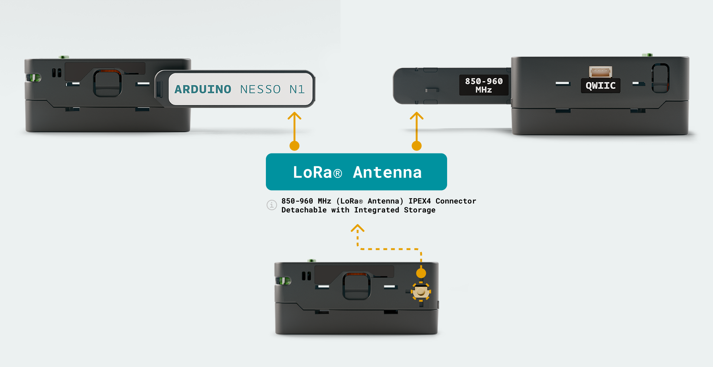

  <strong>Important:</strong> Always attach the LoRa® antenna before transmitting. Operating the LoRa® transmitter without an antenna can damage the SX1262 module due to reflected RF power.

The SX1262 operates in region-specific frequency bands: 868 MHz for Europe (863–870 MHz), 915 MHz for North America and Australia (902–928 MHz), and 923 MHz for Asia (920–925 MHz). Proper frequency configuration is required based on your deployment region to comply with local regulations.

For LoRa® network connectivity, configure the appropriate frequency, spreading factor (SF7–SF12), bandwidth, and coding rate based on your application requirements. Software libraries are available for configuring and using the LoRa® transceiver with the SX1262 module.

### I/O Expansion

Two PI4IOE5V6408 I²C I/O expanders provide additional GPIO pins for the system. These devices operate on the shared I²C bus with configurable addresses, allowing control of a wider range of peripherals while keeping the ESP32-C6's native GPIO resources for other functions.

The first expander manages display control signals, status indicators, and power monitoring functions. The second expander handles user interface elements such as programmable buttons, manages LoRa® transceiver control signals, and provides GPIO for external expansion connectors. The I/O expanders also offer interrupt capability for event detection.

## Peripherals

### Grove Connector (J2)

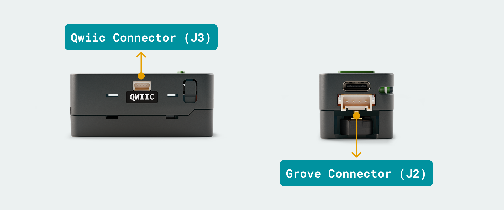

**Grove HY2.0-4P Connector** connects Grove ecosystem sensors and actuators with a custom pinout.

| **Pin** | **Signal** | **Description**                 |
|--------:|------------|---------------------------------|
|       1 | GND        | Ground                          |
|       2 | 5VOUT      | 5 V output from boost converter |
|       3 | GROVE_IO_0 | GPIO 5                          |
|       4 | GROVE_IO_1 | GPIO 4                          |

The Grove connector provides both power (5V from boost converter) and signal connections. IO_0 and IO_1 are controlled through the GPIO 5 and 4, accessible via I²C commands. Use this connector for Grove modules requiring 5V operation or GPIO control.

  <strong>Note:</strong> This connector uses a custom pinout that differs from standard Grove connectors. Verify pin compatibility before connecting standard Grove modules.

### Qwiic Connector (J3)

**Qwiic PH1.0-4P Connector** provides standardized I²C connectivity for Qwiic/Stemma QT ecosystem modules and Arduino Modulino nodes.

| **Pin** | **Signal** | **Description**              |
|--------:|------------|------------------------------|
|       1 | GND        | Ground                       |
|       2 | 3.3V       | 3.3 V system power           |
|       3 | SDA        | I²C data (shared bus)        |
|       4 | SCL        | I²C clock (shared bus)       |

The Qwiic connector shares the main I²C bus with internal peripherals (BMI270 IMU, BQ27220 fuel gauge, touch controller, I/O expander). I²C pull-up resistors are provided on the SDA and SCL lines. Maximum I²C bus speed is 400 kHz (Fast Mode).

  <strong>I²C Bus Considerations:</strong> Multiple devices share the same I²C bus. Ensure connected modules use unique I²C addresses to avoid conflicts. The system I²C addresses include: BMI270 (0x68/0x69), BQ27220 (0x55), FT6336U (0x38), PI4IOE5V6408 (0x20/0x21 selectable).

### HAT Connector (J4)

**8-Pin HAT Connector** compatible with M5StickC HAT accessory ecosystem. Provides GPIO, ADC, and power connections for stackable expansion modules.

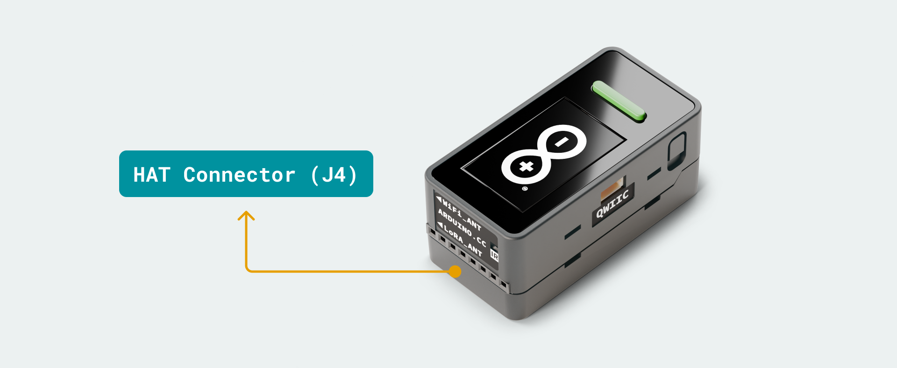

| **Pin** | **Signal** | **Function**                                              |
|--------:|------------|-----------------------------------------------------------|
|       1 | GND        | Ground                                                    |
|       2 | 5VOUT      | 5V boost converter output (INT_5VOUT)                     |
|       3 | D1         | GPIO7 (ADC capable, HAT_IO3)                              |
|       4 | D3         | GPIO6 (ADC capable, HAT_IO2)                              |
|       5 | D2         | GPIO2 (ADC capable, HAT_IO1)                              |
|       6 | VBAT       | Battery voltage (SYS_VBAT)                                |
|       7 | 3V3        | 3.3V system power output (SYS_3.3V)                       |
|       8 | 5VIN       | Input voltage from external source (SYS_VIN)              |

The HAT connector provides access to battery voltage, regulated power rails, and GPIO/ADC capable pins for connecting M5StickC-compatible accessories. GPIO2, GPIO6, and GPIO7 are ESP32-C6 pins capable of analog-to-digital conversion for sensor applications.

### Display and Touch Interface

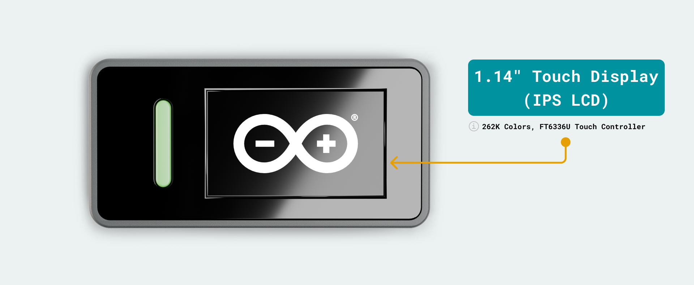

The integrated 1.14" IPS LCD features a 135 × 240 pixel resolution with 262K color depth (18-bit color), driven by the ST7789P3 controller. The display connects via SPI interface, which is shared with external Flash memory and the LoRa® module. Dedicated control signals include LCD_CS (chip select), LCD_RS (register select), and LCD_BL (backlight enable). The backlight is GPIO-controlled and supports PWM dimming for adjustable brightness levels.

The FT6336U capacitive touch controller allows single-point touch detection on the display. It communicates via the shared I²C bus alongside other internal peripherals. It provides an interrupt output (INT_LINE) for touch event notification, allowing power management through event-driven wake-up.

 <strong>SPI Bus Sharing:</strong> The display controller shares the SPI bus with external Flash memory and LoRa® module. Chip select lines ensure only one device communicates at a time. Use appropriate delays and CS control in firmware to prevent bus conflicts.

### IMU Sensor

The BMI270 enables motion and orientation detection, gesture recognition, and activity tracking applications. Interrupt outputs can wake the ESP32-C6 from sleep mode when motion events occur, enabling ultra-low-power monitoring applications. Its characteristics are:

- 3-axis accelerometer (±2 g, ±4 g, ±8 g, ±16 g ranges)
- 3-axis gyroscope (±125°/s to ±2000°/s ranges)
- I²C interface (address 0x68 or 0x69 selectable)
- Interrupt outputs (INT1, INT2) for motion detection, tap detection, orientation change
- Low-power modes for battery conservation
- Motion-triggered wake-up capability

### Audio and Infrared

The onboard passive buzzer operates at 4 kHz and is GPIO-controlled via a transistor driver circuit. It provides audible feedback for notifications, alarms, and user interactions, allowing applications that require audio alerts or confirmation tones.

An infrared LED transmitter enables remote control applications for IR-compatible consumer devices such as TVs, air conditioners, and fans. The IR transmitter is GPIO-controlled via a transistor driver. It supports standard infrared remote control protocols, allowing the Nesso N1 to function as a universal remote or IoT gateway for traditional IR-based devices.

### Programming Options

Nesso N1 supports multiple programming methods:

- **Arduino IDE** [1]
- **MicroPython**
- **UIFlow v2.0***

  <strong>* UIFlow v2.0 Support:</strong> UIFlow support is not yet available. UIFlow v2.0 support is on the way for Nesso N1, with availability expected by the end of Q4 2025. This will provide a visual programming interface for rapid prototyping and educational applications.

## Device Operation

### Getting Started - IDE

If you want to program your Nesso N1 while offline you need to install the Arduino® Desktop IDE **[1]**. To connect the Nesso N1 to your computer, you will need a Type-C® USB cable, which can also provide power to the board, as indicated by the green power LED (LED1).

### Getting Started - Arduino Cloud

All Arduino IoT enabled products are supported on Arduino Cloud **[2]** which allows you to log, graph and analyze sensor data, trigger events, and automate your home or business.

### Online Resources

Now that you have gone through the basics of what you can do with the board you can explore the endless possibilities it provides by checking existing projects on Arduino Project Hub **[4]**, the Arduino Library Reference **[5]**, and the online store **[6]**; where you will be able to complement your board with sensors, actuators and more.

## Mechanical Information

Nesso N1 features a compact, ergonomic design optimized for portable IoT applications. The device measures 48 mm × 24 mm × 14 mm (without antenna storage) or 48 mm × 24 mm × 21.1 mm (with antenna stored in integrated slot). The pre-assembled enclosure eliminates the need for additional mechanical design, allowing immediate deployment in prototypes and final products.

**Device Dimensions (without antenna storage):**
- Length: 48 mm
- Width: 24 mm  
- Height: 14 mm

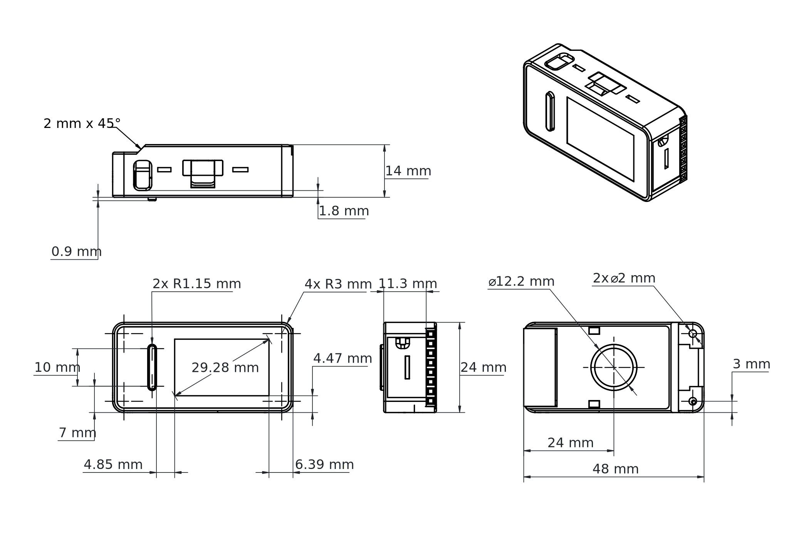

**Device Dimensions (with antenna storage):**
- Length: 48 mm
- Width: 24 mm
- Height: 21.1 mm

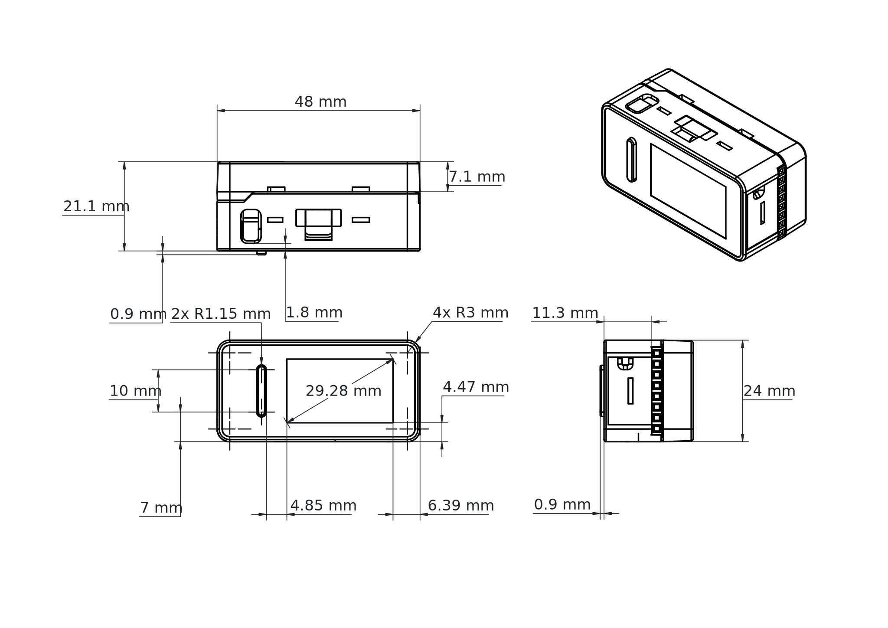

**LoRa® Antenna Dimensions (detachable):**
- Length: 45.5 mm
- Width: 10.8 mm
- Height: 4.8 mm
- Connector: IPEX4 standard

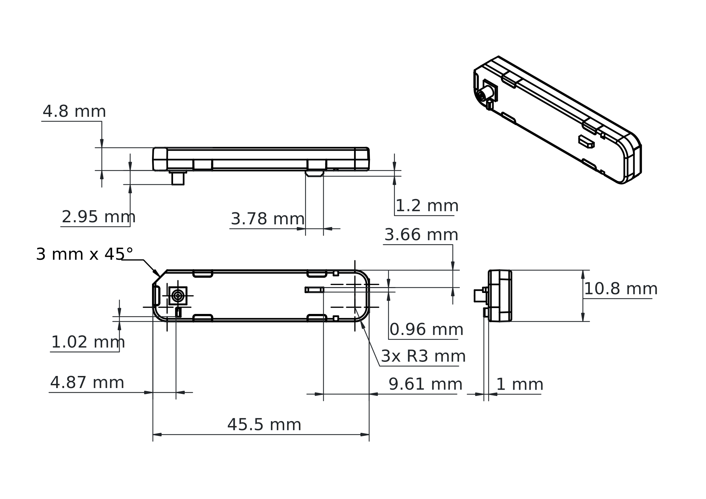

## Certifications

### Declaration of Conformity CE DoC (EU)

English: We declare under our sole responsibility that the products above are in conformity with the essential requirements of the following EU Directives and therefore qualify for free movement within markets comprising the European Union (EU) and European Economic Area (EEA).

French: Nous déclarons sous notre seule responsabilité que les produits indiqués ci-dessus sont conformes aux exigences essentielles des directives de l'Union européenne mentionnées ci-après, et qu'ils remplissent à ce titre les conditions permettant la libre circulation sur les marchés de l'Union européenne (UE) et de l'Espace économique européen (EEE).

### Declaration of Conformity to EU RoHS & REACH

Arduino boards are in compliance with Directive 2011/65/EU of the European Parliament and Directive 2015/863/EU of the Council of 4 June 2015 on the restriction of the use of certain hazardous substances in electrical and electronic equipment.

| **Substance**                          | **Maximum Limit (ppm)** |
|----------------------------------------|-------------------------|
| Lead (Pb)                              | 1000                    |
| Cadmium (Cd)                           | 100                     |
| Mercury (Hg)                           | 1000                    |
| Hexavalent Chromium (Cr6+)             | 1000                    |
| Poly Brominated Biphenyls (PBB)        | 1000                    |
| Poly Brominated Diphenyl ethers (PBDE) | 1000                    |
| Bis(2-Ethylhexyl) phthalate (DEHP)     | 1000                    |
| Benzyl butyl phthalate (BBP)           | 1000                    |
| Dibutyl phthalate (DBP)                | 1000                    |
| Diisobutyl phthalate (DIBP)            | 1000                    |

Exemptions: No exemptions are claimed.

Arduino boards are fully compliant with the related requirements of European Union Regulation (EC) 1907/2006 concerning the Registration, Evaluation, Authorization and Restriction of Chemicals (REACH). We declare none of the SVHCs (https://echa.europa.eu/web/guest/candidate-list-table), the Candidate List of Substances of Very High Concern for authorization currently released by ECHA, is present in all products (and also package) in quantities totaling in a concentration equal or above 0.1%. To the best of our knowledge, we also declare that our products do not contain any of the substances listed on the "Authorization List" (Annex XIV of the REACH regulations) and Substances of Very High Concern (SVHC) in any significant amounts as specified by the Annex XVII of Candidate list published by ECHA (European Chemical Agency) 1907/2006/EC.

### Conflict Minerals Declaration

As a global supplier of electronic and electrical components, Arduino is aware of our obligations with regards to laws and regulations regarding Conflict Minerals, specifically the Dodd-Frank Wall Street Reform and Consumer Protection Act, Section 1502. Arduino does not directly source or process conflict minerals such as Tin, Tantalum, Tungsten, or Gold. Conflict minerals are contained in our products in the form of solder, or as a component in metal alloys. As part of our reasonable due diligence Arduino has contacted component suppliers within our supply chain to verify their continued compliance with the regulations. Based on the information received thus far we declare that our products contain Conflict Minerals sourced from conflict-free areas.

## FCC Caution

Any Changes or modifications not expressly approved by the party responsible for compliance could void the user's authority to operate the equipment.

This device complies with part 15 of the FCC Rules. Operation is subject to the following two conditions:

(1) This device may not cause harmful interference

(2) this device must accept any interference received, including interference that may cause undesired operation.

**FCC RF Radiation Exposure Statement:**

1. This Transmitter must not be co-located or operating in conjunction with any other antenna or transmitter.

2. This equipment complies with RF radiation exposure limits set forth for an uncontrolled environment.

3. This equipment should be installed and operated with a minimum distance of 20 cm between the radiator & your body.

English:

User manuals for licence-exempt radio apparatus shall contain the following or equivalent notice in a conspicuous location in the user manual or alternatively on the device or both. This device complies with Industry Canada licence-exempt RSS standard(s). Operation is subject to the following two conditions:

(1) this device may not cause interference

(2) this device must accept any interference, including interference that may cause undesired operation of the device.

French:

Le présent appareil est conforme aux CNR d'Industrie Canada applicables aux appareils radio exempts de licence. L'exploitation est autorisée aux deux conditions suivantes:

(1) l'appareil ne doit pas produire de brouillage

(2) l'utilisateur de l'appareil doit accepter tout brouillage radioélectrique subi, même si le brouillage est susceptible d'en compromettre le fonctionnement.

**IC SAR Warning:**

English:
This equipment should be installed and operated with a minimum distance of 20 cm between the radiator and your body.

French:
Lors de l'installation et de l'exploitation de ce dispositif, la distance entre le radiateur et le corps est d'au moins 20 cm.

**Important:** The operating temperature of the EUT can't exceed 40°C and shouldn't be lower than 0°C.

Hereby, Arduino S.r.l. declares that this product is in compliance with essential requirements and other relevant provisions of Directive 2014/53/EU. This product is allowed to be used in all EU member states.

## Company Information

| Company name | Arduino S.r.l.                             |
|--------------|--------------------------------------------|
| Address      | Via Andrea Appiani 25, 20900 Monza (Italy) |

## Documentation Reference

| No. | Reference                      | Link                                                                                     |
|:---:|--------------------------------|------------------------------------------------------------------------------------------|
|  1  | Arduino IDE (Desktop)          | [https://www.arduino.cc/en/Main/Software](https://www.arduino.cc/en/Main/Software)       |
|  2  | Arduino Cloud                  | [https://cloud.arduino.cc/](https://cloud.arduino.cc/)                                   |
|  3  | Arduino Nesso N1 Documentation | [https://docs.arduino.cc/hardware/nesso-n1/](https://docs.arduino.cc/hardware/nesso-n1/) |
|  4  | Project Hub                    | [https://create.arduino.cc/projecthub](https://create.arduino.cc/projecthub)             |
|  5  | Library Reference              | [https://github.com/arduino-libraries/](https://github.com/arduino-libraries/)           |
|  6  | Arduino Store                  | [https://store.arduino.cc/](https://store.arduino.cc/)                                   |

## Document Revision History

|  **Date**  | **Revision** | **Changes**                           |
|:----------:|:------------:|---------------------------------------|
| 20/11/2025 |     1.1      | Added UIFlow v2.0 support information |
| 14/10/2025 |      1       | First release                         |