## Introduction

Motor condition monitoring is crucial in industrial settings, where unexpected equipment failures can lead to significant downtime and high maintenance costs. This application note demonstrates how to construct a motor anomaly detection system utilizing the Nesso N1 development kit, its onboard 6-axis Inertial Measurement Unit (IMU), and Edge Impulse®.


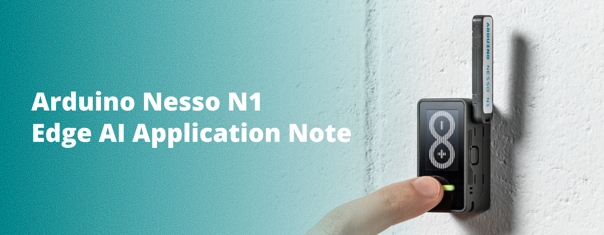

The developed system monitors vibration patterns in real-time to identify unusual operating conditions that may signal mechanical problems, wear, or potential failures. The system utilizes machine learning to identify vibration patterns that deviate from regular motor operation, enabling predictive maintenance. The Nesso N1's multiple connectivity options (Wi-Fi® 6, LoRa®, Thread, and Bluetooth® 5.3) enable flexible deployment in various industrial environments, ranging from local monitoring to long-range remote sensing applications.


## Goals

This application note will help you to:

- Build a motor anomaly detection system that monitors vibration patterns in real-time using the Nesso N1's built-in 6-axis IMU sensor.
- Collect and analyze vibration data from motors to create baseline patterns and detect changes.
- Train a machine learning model using Edge Impulse to detect anomalies based on vibration data.
- Deploy the trained model directly to the Nesso N1 development kit for real-time anomaly detection without needing cloud connectivity.
- Set up visual and audio feedback through the kit's built-in RGB LED, touch display, and buzzer to show detected anomalies and system status.
- Leverage the Nesso N1's multiple connectivity protocols (Wi-Fi® 6, LoRa®, Thread, Bluetooth® 5.3) to transmit alerts and data to remote monitoring systems.

- Create industrial predictive maintenance solutions using cost-effective embedded intelligence in a compact, pre-assembled enclosure.

## Hardware and Software Requirements

### Hardware Requirements

- [Arduino Nesso N1 development kit](https://store.arduino.cc/products/nesso-n1) (x1)
- [USB-C® cable](https://store.arduino.cc/products/usb-cable2in1-type-c) (x1)
- Motor or rotating equipment for testing (for example, a small DC motor or fan) (x1)
- Power supply for the motor (if needed) (x1)
- Mounting accessories or adhesive tape to secure the Nesso N1 to the motor (x1 set)

### Software Requirements

- [Arduino IDE 2.0+](https://www.arduino.cc/en/software) or [Arduino Web Editor](https://create.arduino.cc/editor)
- [ESP32 Arduino Core](https://github.com/espressif/arduino-esp32) (needed for the Nesso N1 ESP32-C6 processor)
- [Edge Impulse account](https://studio.edgeimpulse.com/) (free tier available)
- [Edge Impulse CLI tools](https://docs.edgeimpulse.com/docs/cli-installation) for data collection

***The Nesso N1 development kit features a powerful ESP32-C6 processor with a single-core 32-bit RISC-V CPU running at up to 160 MHz, 16 MB NOR Flash memory and 512 KB SRAM for machine learning tasks. The onboard 6-axis IMU (BMI270) eliminates the need for external accelerometer connections. For complete hardware specifications, see the [Nesso N1 documentation](https://docs.arduino.cc/hardware/nesso-n1/).***

## Hardware Setup Overview

The electrical connections for the motor anomaly detection system are simplified with the Nesso N1 development kit, as all its essential components are integrated into a single, compact device.

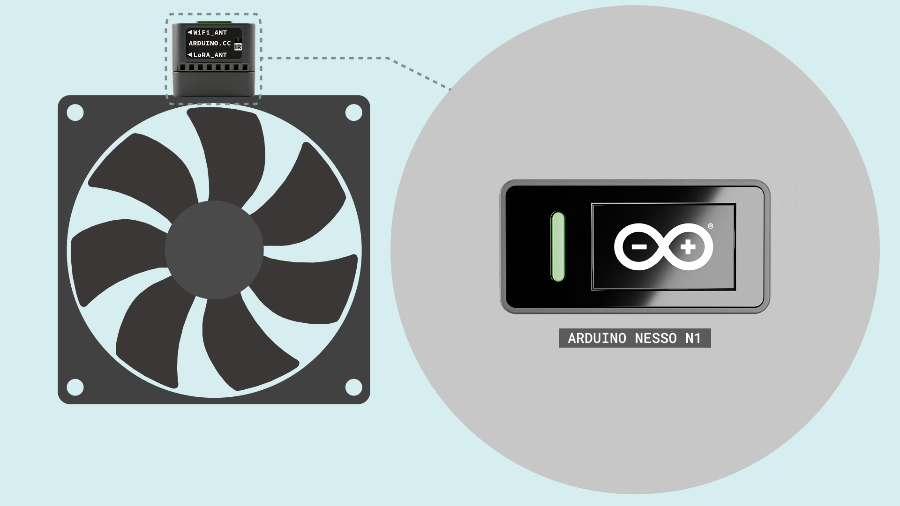

This diagram shows the system components using the Nesso N1 development kit. **The Nesso N1 acts as an all-in-one solution**, combining the kit's microcontroller (ESP32-C6), onboard IMU (BMI270), wireless connectivity, display, and battery in a single enclosed unit. **The onboard 6-axis IMU collects vibration data** from the motor through direct physical coupling when the device is mounted on the motor housing.

The Nesso N1 operates from its built-in rechargeable lithium-polymer battery or can be powered via the USB-C connector with a +5 VDC supply. The compact form factor (18 mm x 45 mm) and integrated enclosure make it ideal for direct mounting on motor equipment without the need for additional protective housing.

***__Important note__: This power setup is for testing and demonstration purposes only. In real industrial environments, proper power system design should include electrical isolation, noise filtering, surge protection, and compliance with industrial safety standards for your specific application.***

### Physical Mounting Considerations

Proper mounting of the Nesso N1 is essential for effective vibration monitoring. The development kit must be securely attached to the motor housing or equipment using appropriate mechanical fasteners or industrial-grade adhesive. A good mechanical connection between the mounting surface and the device guaranteess accurate vibration transmission from the motor to the onboard IMU.

The Nesso N1's enclosed design provides basic protection against dust and minor vibrations, making it suitable for many industrial environments. However, additional protective measures may be needed in extreme conditions.

***For this application note, we will use a computer cooling fan to simulate motor operation and demonstrate the anomaly detection system. The Nesso N1 can be mounted directly on top of the fan using double-sided adhesive tape or a custom 3D-printed mounting bracket, providing a stable and consistent mounting solution for testing.***

## Understanding Motor Vibration Analysis

Motor vibrations contain valuable information about the mechanical condition of the equipment. Regular motor operation produces characteristic vibration patterns that stay relatively consistent during healthy operation. Abnormal conditions manifest as changes in vibration amplitude, frequency content, or timing patterns.

### Common Motor Faults

Common motor faults that can be detected through vibration analysis include:

- **Bearing wear**: Creates higher frequency components and increased vibration levels across all axes
- **Misalignment**: Produces specific frequency patterns related to rotational speed, typically appearing in radial directions
- **Imbalance**: Results in increased vibration at the main rotational frequency, primarily in radial directions
- **Looseness**: Causes widespread increases in vibration across multiple frequencies and directions
- **Electrical issues**: May create vibrations at twice the line frequency due to magnetic field changes

### The Role of the IMU in Vibration Monitoring

The Nesso N1's onboard BMI270 6-axis IMU combines a 3-axis accelerometer and 3-axis gyroscope, providing complete motion sensing capabilities for vibration analysis. The accelerometer measures linear acceleration along the X, Y, and Z axes, capturing the intensity and direction of vibrations. The gyroscope complements this by detecting rotational movements, which can indicate wobbling or angular vibrations in the motor.

The BMI270 offers several advantages for industrial vibration monitoring:

- High sensitivity and low noise for detecting subtle vibration changes
- Programmable measurement ranges (±2g to ±16g for accelerometer)
- High sampling rates up to 1.6 kHz for capturing fast vibration events
- Built-in digital filters to reduce noise and improve signal quality
- Low power consumption, extending battery life in the Nesso N1

This integrated sensor approach eliminates the need for external accelerometer wiring, ensuring consistent and reliable measurements. The digital I²C interface between the BMI270 and the ESP32-C6 microcontroller enables noise-immune data transmission, which is important to have in electrically noisy industrial environments.

### Data Collection Strategy

The Nesso N1 collects vibration data at regular intervals to build a complete picture of the motor's behavior. The system samples the IMU at 100 Hz, providing sufficient resolution to capture vibration patterns up to 50 Hz, as per the Nyquist theorem. This sampling rate covers most mechanical vibration frequencies found in typical motor applications.

Each data collection window consists of 200 samples (2 seconds of data), providing enough information for the machine learning model to identify patterns while keeping computational requirements manageable. The Nesso N1's 512 KB SRAM provides ample buffer space for storing multiple windows of vibration data during processing.

## Simple Vibration Monitor Example Sketch

Now that we have covered the hardware components and vibration analysis basics, let's look at the software that enables vibration data collection. Before implementing intelligent anomaly detection, we need to collect training data representing normal motor operation for Edge Impulse, a platform that simplifies embedded AI development.

Edge Impulse needs training data in a specific format to build effective anomaly detection models. Our data collection sketch formats the IMU readings so Edge Impulse can analyze normal operation patterns and create a model that identifies when new data differs from these patterns.

This section breaks down the example sketch and guides you through its functionality. We will explore how the IMU is initialized, how vibration data is collected at consistent intervals, and how the results are formatted for Edge Impulse data collection and model training.

The complete example sketch is shown below.

```arduino
/**
  Motor Vibration Data Collection for Edge Impulse
  Name: motor_vibration_collector.ino
  Purpose: This sketch reads 6-axis IMU data from the onboard BMI270 sensor
  of the Nesso N1 development kit. The data is formatted for Edge Impulse
  data collection and training, with real-time display visualization.
  
  @version 1.0 01/11/25
  @author Arduino Product Experience Team
*/

#include <Arduino_BMI270_BMM150.h>
#include <M5GFX.h>

// Display instance
M5GFX display;

// Sampling parameters
const int sampleRate = 100;                             // 100 Hz
const unsigned long sampleTime = 1000 / sampleRate;     // 10ms between samples

// Data collection variables
unsigned long lastSample = 0;

void setup() {
  // Initialize USB serial communication at 115200 baud
  Serial.begin(115200);
  for (auto startNow = millis() + 2500; !Serial && millis() < startNow; delay(500));
  
  // Initialize display
  display.begin();
  display.setRotation(1); // Landscape mode
  display.setTextColor(TFT_WHITE, TFT_BLACK);
  display.fillScreen(TFT_BLACK);
  display.setTextSize(1.5);
  display.setTextDatum(MC_DATUM);
  display.drawString("- Initializing IMU...", display.width() / 2, display.height() / 2);
  
  // Initialize IMU
  if (!IMU.begin()) {
    Serial.println("- Failed to initialize BMI270 IMU!");
    display.fillScreen(TFT_BLACK);
    display.setTextColor(TFT_RED, TFT_BLACK);
    display.drawString("- IMU Failed!", display.width() / 2, display.height() / 2);
    while (1);
  }
  
  Serial.println("- Motor Vibration Data Collector (BMI270)");
  Serial.println("- 6-axis sensor initialized!");
  
  // Display sensor information
  Serial.print("- Accelerometer sample rate: ");
  Serial.print(IMU.accelerationSampleRate());
  Serial.println(" Hz");
  
  // Wait for sensor stabilization
  delay(500);
  
  // Test initial reading
  float testX, testY, testZ;
  if (IMU.accelerationAvailable()) {
    IMU.readAcceleration(testX, testY, testZ);
    
    Serial.print("- Initial readings (g): X=");
    Serial.print(testX, 3);
    Serial.print(", Y=");
    Serial.print(testY, 3);
    Serial.print(", Z=");
    Serial.println(testZ, 3);

    Serial.println("- Sensor ready (values already in g units)");
  }
  
  Serial.println("- Streaming continuous data for Edge Impulse!");
  Serial.println("- Data format: X_accel,Y_accel,Z_accel");
  
  // Setup display for live data
  display.fillScreen(TFT_BLACK);
  display.setTextSize(1.5);
  display.setTextDatum(TL_DATUM);
  display.drawString("- Motor Vibration Data:", 5, 5);
  display.drawString("- X:", 5, 30);
  display.drawString("- Y:", 5, 45);
  display.drawString("- Z:", 5, 60);
  display.drawString("g", 100, 30);
  display.drawString("g", 100, 45);
  display.drawString("g", 100, 60);
  
  delay(1000);
}

void loop() {
  unsigned long currentTime = millis();
  
  if (currentTime - lastSample >= sampleTime) {
    float xAccel, yAccel, zAccel;
    bool dataValid = false;
    
    // Read new acceleration data from the IMU
    if (IMU.accelerationAvailable()) {
      IMU.readAcceleration(xAccel, yAccel, zAccel);
      dataValid = true;
    }
    
    // Output CSV format for Edge Impulse
    if (dataValid) {
      Serial.print(xAccel, 4);
      Serial.print(",");
      Serial.print(yAccel, 4);
      Serial.print(",");
      Serial.println(zAccel, 4);
      
      // Update display with current values
      display.fillRect(45, 30, 50, 45, TFT_BLACK);
      display.setTextColor(TFT_GREEN, TFT_BLACK);
      display.setTextSize(1.5);
      display.setCursor(40, 30);
      display.printf("%+.3f", xAccel);
      display.setCursor(40, 45);
      display.printf("%+.3f", yAccel);
      display.setCursor(40, 60);
      display.printf("%+.3f", zAccel);
    }
    
    lastSample = currentTime;
  }
}
```

The following sections will help you understand the main components of the example sketch, which can be divided into the following areas:

- Sensor selection and initialization
- Hardware configuration and calibration
- Data collection timing and control
- Signal processing and conversion
- Edge Impulse data formatting

### Sensor Selection and Initialization

The sketch begins by including the necessary libraries for the Nesso N1's integrated components:
```arduino
#include <Arduino_BMI270_BMM150.h>
#include <M5GFX.h>

// Display instance
M5GFX display;
```

In this code:

- The `Arduino_BMI270_BMM150` library provides access to the onboard 6-axis IMU of the Nesso N1
- The `M5GFX` library controls the 1.14" touch display

### Hardware Configuration and Calibration

Before we can collect vibration data, we need to configure the Nesso N1 development kit to interface with its onboard BMI270 IMU.

**BMI270 Configuration**

For the Nesso N1, the configuration is simplified as the BMI270 is factory-calibrated and internally connected:

```arduino
// Initialize IMU
if (!IMU.begin()) {
  Serial.println("- Failed to initialize BMI270 IMU!");
  while (1);
}

Serial.println("- Motor Vibration Data Collector (BMI270)");
Serial.println("- 6-axis sensor initialized!");

// Display sensor information
Serial.print("- Accelerometer sample rate: ");
Serial.print(IMU.accelerationSampleRate());
Serial.println(" Hz");
```

In this code:

- The IMU is initialized with its default settings
- No pin assignments are needed as the IMU is internally connected via I²C

### Data Collection Timing and Control

To guarantees accurate vibration analysis and successful machine learning training, we need consistent data collection timing. These parameters control how data is gathered:

```arduino
// Sampling parameters
const int sampleRate = 100;                             // 100 Hz
const unsigned long sampleTime = 1000 / sampleRate;     // 10 ms between samples
```

In this code:

- Sample rate of 100 Hz captures enough frequency response for detecting most motor faults
- Sample time calculation determines the precise timing needed between measurements

### Signal Processing and Conversion

Once we have the sensor readings, the BMI270 IMU provides pre-processed digital values ready for use.

**BMI270 Signal Processing**

For the onboard BMI270 IMU, the data is already processed and calibrated:

```arduino
// Read new acceleration data from the IMU
if (IMU.accelerationAvailable()) {
  IMU.readAcceleration(xAccel, yAccel, zAccel);
  dataValid = true;
}
```

In this code:

- `IMU.accelerationAvailable()` checks if new data is ready from the IMU
- The acceleration values are returned directly in **g** units

### Edge Impulse Data Formatting

The final step formats our acceleration data so it can be used with Edge Impulse data collection tools:

```arduino
// Output CSV format for Edge Impulse
if (dataValid) {
  Serial.print(xAccel, 4);
  Serial.print(",");
  Serial.print(yAccel, 4);
  Serial.print(",");
  Serial.println(zAccel, 4);
}
```

In this code:

- CSV format with four decimal places gives us the precision needed for machine learning training
- Single-line output per sample makes it easy to integrate with the Edge Impulse data forwarder
- Comma separation follows standard CSV format that most data processing tools expect
- The display provides real-time visual feedback of the acceleration values

After uploading the example sketch to the Nesso N1 development kit, you should see the following output in the Arduino IDE's Serial Monitor:

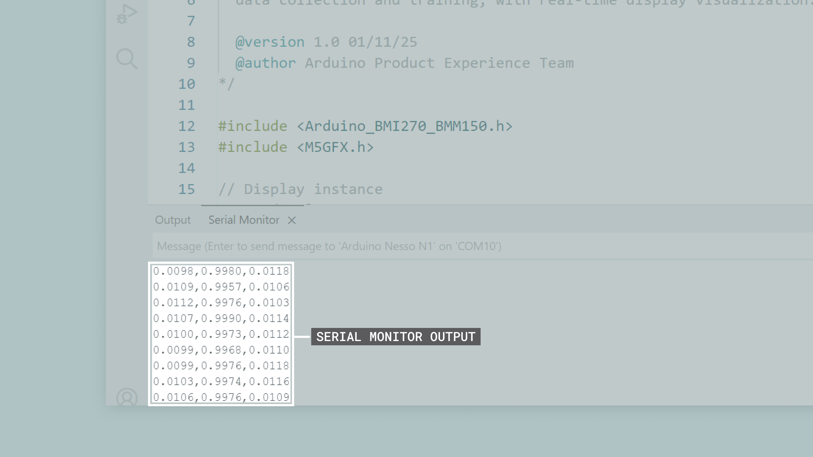

### Optional: Display Visualization

The Nesso N1's built-in 1.14" touch display provides real-time visual feedback during data collection, which is particularly useful for verifying proper sensor mounting and monitoring vibration levels without needing a serial connection.

**Display Setup**

The display initialization configures the screen orientation and text properties:

```arduino
// Initialize display
display.begin();
display.setRotation(1);                    // Landscape mode for better data layout
display.setTextColor(TFT_WHITE, TFT_BLACK);
display.fillScreen(TFT_BLACK);
display.setTextSize(1.5);                  // Readable size for the small screen
```

**Real-time Data Visualization**

The display updates with each new sensor reading, showing the acceleration values for all three axes:

```arduino
// Update display with current values
display.fillRect(45, 30, 50, 45, TFT_BLACK);  // Clear previous values only
display.setTextColor(TFT_GREEN, TFT_BLACK);
display.setTextSize(1.5);
display.setCursor(40, 30);
display.printf("%+.3f", xAccel);              // Format with sign and 3 decimals
display.setCursor(40, 45);
display.printf("%+.3f", yAccel);
display.setCursor(40, 60);
display.printf("%+.3f", zAccel);
```

In this code:

- The `fillRect()` function clears only the area where values are displayed, preserving the labels
- Green text color provides good contrast against the black background
- The `printf()` format guarantees consistent display with sign (+/-) and three decimal places
- Values update at 100 Hz

This visual feedback helps during setup by:

- Confirming the IMU is responding to vibrations
- Verifying proper mounting (values should change when motor runs)
- Monitoring data quality without a computer connection
- Providing immediate indication of sensor saturation or disconnection

After uploading the example sketch to the Nesso N1 development kit, you should see the following output in the Nesso N1's built-in 1.14" touch display:

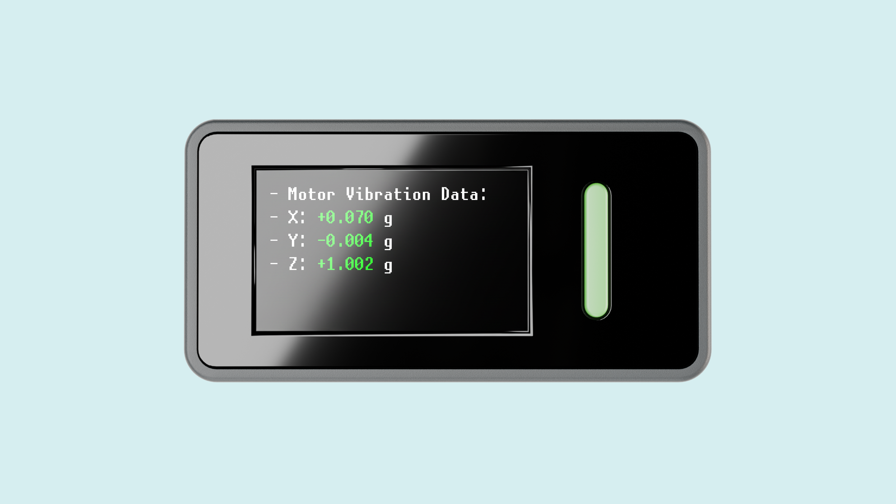

### Complete Example Sketch

Download the complete data collection example sketch [here](assets/motor_vibration_collector.zip).

[](assets/motor_vibration_collector.zip)

## Connecting the Vibration Monitor to Edge Impulse

As vibration-based condition monitoring becomes more important for predictive maintenance, connecting our data collection system to Edge Impulse enables the development of intelligent anomaly detection models. Edge Impulse provides a complete platform for embedded machine learning, allowing us to transform raw vibration data into useful insights about motor health.

In this section, we will connect the vibration monitor to Edge Impulse platform to collect training data, develop machine learning models and deploy intelligent anomaly detection directly to the Nesso N1 development kit. This connection transforms our simple vibration monitor into an intelligent system that can detect motor anomalies without needing cloud connectivity.

***If you are new to Edge Impulse, please check out [this tutorial](https://docs.edgeimpulse.com/docs/tutorials/end-to-end-tutorials/time-series/continuous-motion-recognition/) for an introduction to the platform.***

### Setting up Edge Impulse Account and Project

The first step involves creating an Edge Impulse account and setting up a new project for motor anomaly detection. These steps establish the foundation for machine learning model development:

**(1) Create Account**: Register for a free Edge Impulse account at [studio.edgeimpulse.com](https://studio.edgeimpulse.com/)

**(2) New Project**: Create a new project with the following settings:

- Enter a project name (for example, "`nesso-n1-anomaly-detection`")
- Choose project type: Personal (free tier with 60 min job limit, 4 GB data limit)
- Choose project setting: Private (recommended for this application)

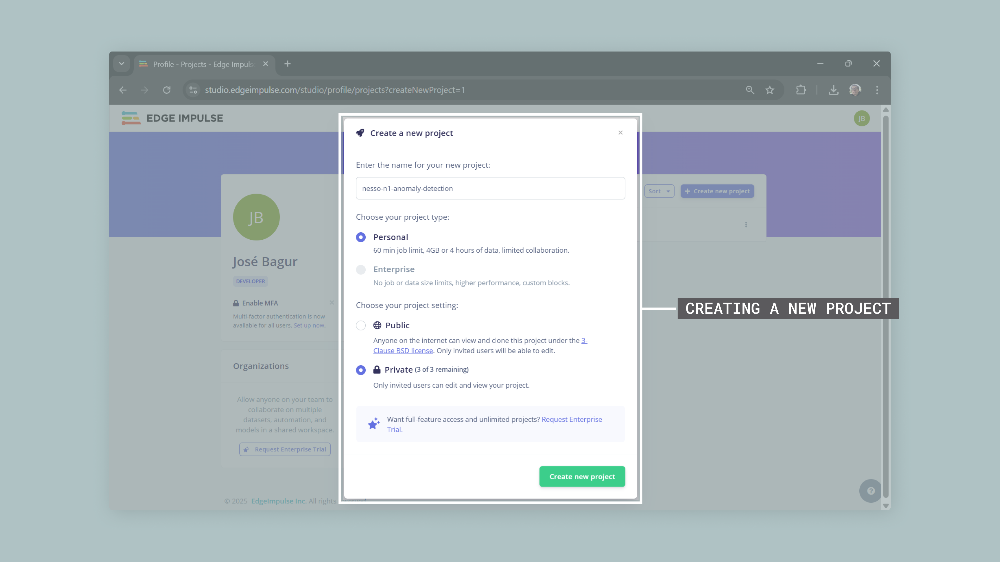

**(3) Project Configuration**: Once created, the project will be ready for data collection. Sampling frequency and window settings will be configured later during impulse design.

### Data Collection with Edge Impulse CLI

The Edge Impulse CLI provides tools for streaming data directly from the Nesso N1 to the Edge Impulse platform. This eliminates manual file transfers and enables efficient data collection.

#### Installing Edge Impulse CLI

Before you can collect data from the Nesso N1, you need to install the Edge Impulse CLI tools on your computer. The installation process varies depending on your operating system.

Prerequisites:

- [Node.js](https://nodejs.org/en) 14 or higher
- [Python 3](https://www.python.org/downloads/)

For detailed installation instructions specific to your operating system, follow the [official Edge Impulse CLI installation guide](https://docs.edgeimpulse.com/docs/tools/edge-impulse-cli/cli-installation).

Verify the installation with the following command:

```bash
edge-impulse-daemon --version
```

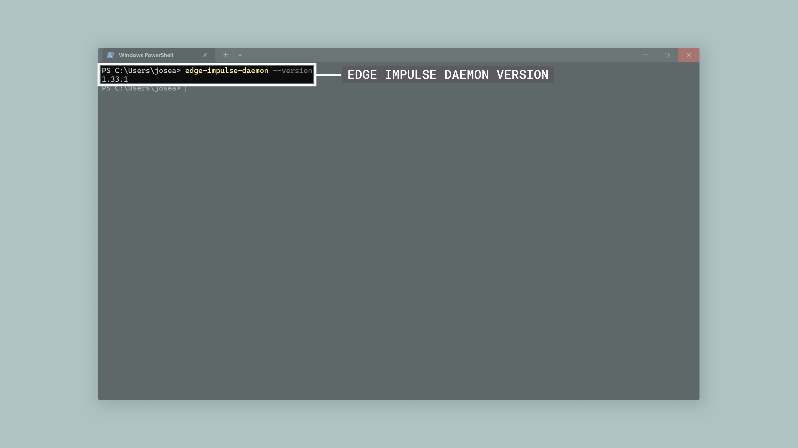

#### Setting up Data Forwarding

Now that you have the CLI installed, you can set up data forwarding to stream vibration data directly from your Nesso N1 to Edge Impulse.

Connect your Nesso N1 to your computer via USB-C cable and upload the data collection sketch. Then open a terminal and run the following command:

```bash
edge-impulse-data-forwarder
```

The tool will guide you through the setup process:

1. **Login**: Enter your Edge Impulse username/email and password when prompted
2. **Select Device**: Choose the correct serial port for your Nesso N1 development kit (for example, `COM10`)
3. **Data Detection**: The tool will automatically detect the data frequency (100 Hz) and number of sensor axes (3)
4. **Name Axes**: When asked "What do you want to call them?", enter: `X`,`Y`,`Z`
5. **Device Name**: Give your device a name (for example, `nesso-n1`)
6. **Project Connection**: If you have multiple projects, the tool will ask which Edge Impulse project you want to connect the device to. Select your motor anomaly detection project.

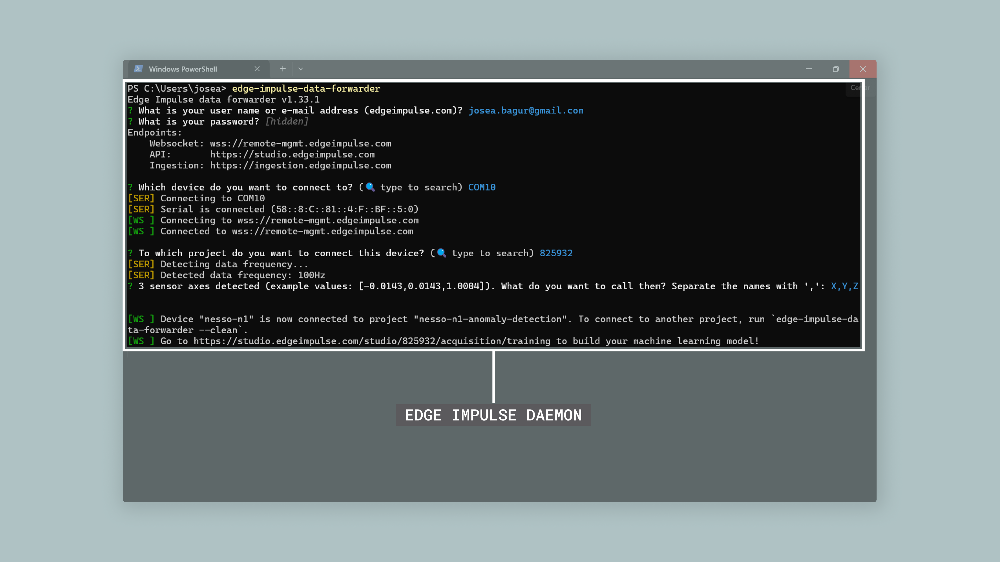

Once configured, the forwarder will stream data from your Nesso N1 board to Edge Impulse. You can verify the device connection by checking the "Devices" tab in Edge Impulse Studio. You can then start collecting training data for your machine learning model.

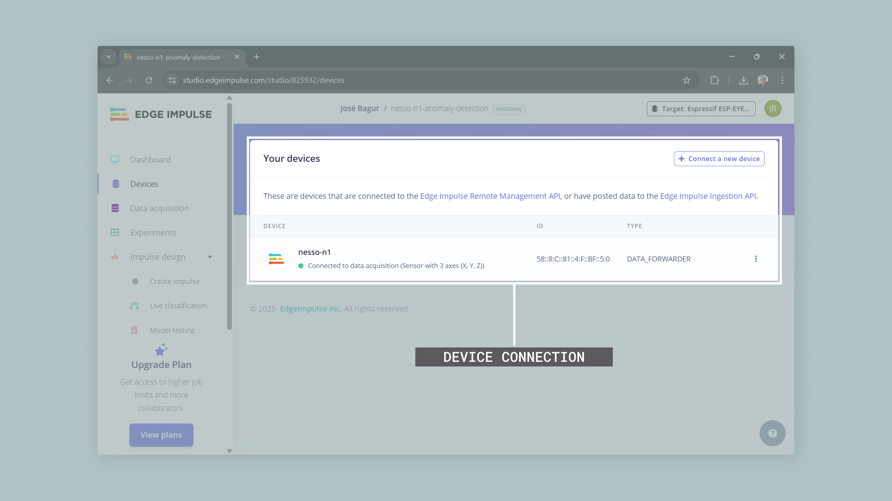

#### Data Collection Process

With the data forwarder running, you can now collect training data for your anomaly detection model. For effective anomaly detection, you need high-quality data representing normal motor operation in different states.

Start by mounting the accelerometer securely to the motor housing. You will collect two types of normal operation data:

1. **Idle data collection**: With the motor turned off, **collect 2 to 5 minutes of "idle" operation** data through multiple two second windows. This captures the baseline vibration environment without motor operation. Label all data as `idle` in Edge Impulse Studio.

2. **Nominal data collection**: With the motor running under normal operating conditions, **collect 2 to 5 minutes of "nominal" operation** data through multiple two second windows. Vary motor load conditions slightly to capture different normal operating scenarios. Label all data as `nominal` in Edge Impulse Studio.

Edge Impulse can automatically split your collected data into **training (80%) and testing (20%) sets**. The 4 to 10 minutes total of data guarantees you have enough samples for both training the model and validating its performance on unseen data.

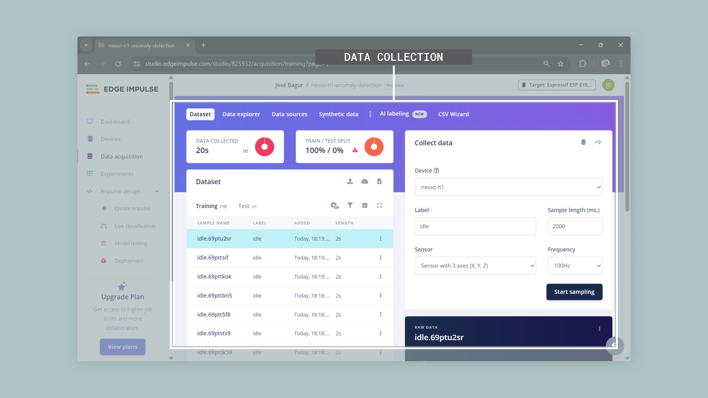

After data collection, review the collected samples in Edge Impulse Studio for consistency. Check for proper amplitude ranges and no clipping, verify sample rate consistency and timing accuracy and remove any corrupted or unusual samples from the training set.

***__Important note__: The anomaly detection model learns what "normal" looks like from both idle and nominal data. Any future vibration patterns that significantly differ from these learned patterns will be flagged as anomalies. This approach allows the system to detect unknown fault conditions without needing examples of actual motor failures.***

### Training the Anomaly Detection Model

Once you have collected sufficient `idle` and `nominal` operation data, the next step involves configuring and training the machine learning model for anomaly detection.

#### Impulse Design Configuration

Within Edge Impulse Studio, configure the impulse design with appropriate processing and learning blocks. Navigate to the "Impulse design" tab and set up the following blocks:

1. **Input Block**: Configure time series data with window size of 1000 ms, window increase of 100 ms, and frequency of 100 Hz to match your data collection sampling rate.
2. **Processing Block**: Add "Spectral Analysis" block for frequency domain feature extraction
3. **Classification Learning Block**: Add "Classification (Keras)" to distinguish between `idle` and `nominal` operating states.
4. **Learning Block**: Select "Anomaly Detection (K-means)" for unsupervised learning approach

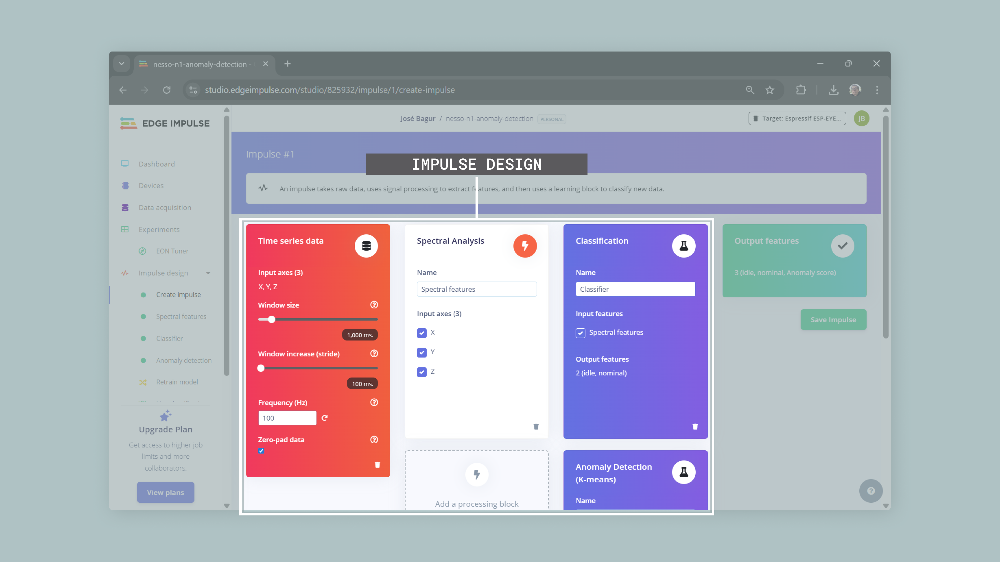

This dual approach provides a more robust monitoring system where the classifier identifies the current operating state (`idle` vs `nominal`) while the anomaly detector flags unusual patterns that don't fit either normal category.

#### Feature Extraction Configuration

The spectral analysis block extracts relevant features from the raw vibration signals. Configure the following parameters optimized for the Nesso N1's BMI270 IMU:

- **Type**: None (no filter) to preserve all frequency information from the IMU
- **Cut-off frequency**: Not applicable when filter type is None
- **Order**: Not applicable when filter type is None
- **FFT length**: 64 points for efficient processing on the ESP32-C6
- **Take log of spectrum**: Disable this option for more linear response with the BMI270
- **Overlap FFT frames**: Enable this option to increase the number of features extracted from each window

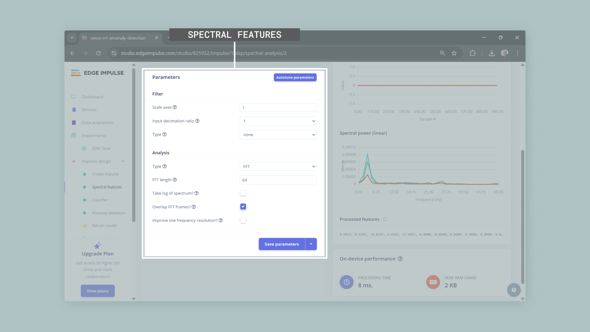

***__Important note__: The BMI270 IMU in the Nesso N1 provides very clean digital data, so heavy filtering is not necessary. Using no filter with a smaller FFT length (64 points) provides better discrimination between `idle` and `nominal` states while reducing computational load on the ESP32-C6 processor.***

#### Model Training Process

Follow these steps to train the anomaly detection model using the collected idle and nominal operation data:

**(1) Generate Features**: Before clicking "Generate features", enable "Calculate feature importance" to identify which frequency bands are most relevant for distinguishing between idle and nominal states. Then click "Generate features" to extract spectral features from all training data. Edge Impulse will process your data and create the feature vectors needed for training.

**(2) Feature Explorer**: Review the feature explorer visualization to verify data quality and feature separation between your idle and nominal classes.

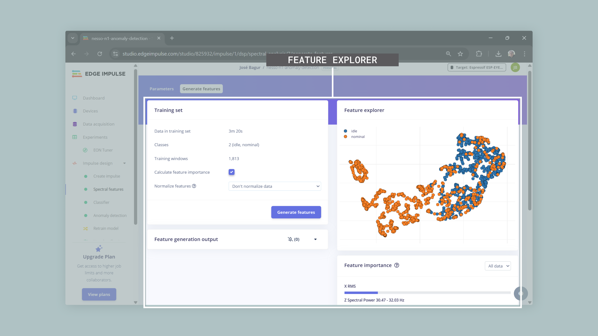

**(3) Train Classification Model**: Navigate to the "Classifier" tab and configure the neural network with the following simplified settings optimized for the Nesso N1:

- Number of training cycles: 50 (increased for better convergence)
- Learning rate: 0.001 (slightly higher for faster training)
- Neural network architecture: Configure dense layers with 20 neurons (first layer) and 10 neurons (second layer) to provide efficient pattern recognition without overfitting
- Validation set size: 20%

Start training and monitor the accuracy metrics.

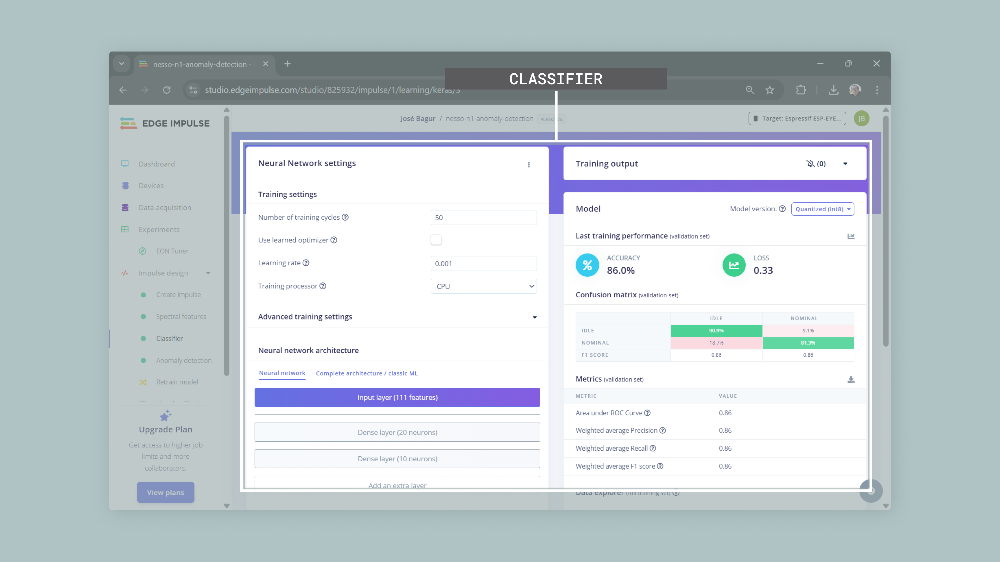

**(4) Train Anomaly Detection Model**: Navigate to the "Anomaly detection" tab and configure K-means clustering with reduced complexity:

- **Cluster count**: 12 clusters (reduced from 32) for more stable anomaly scores
- **Axes selection**: Use "Select suggested axes" to automatically choose the most relevant spectral features
- Click "Start training" to train the anomaly detection model

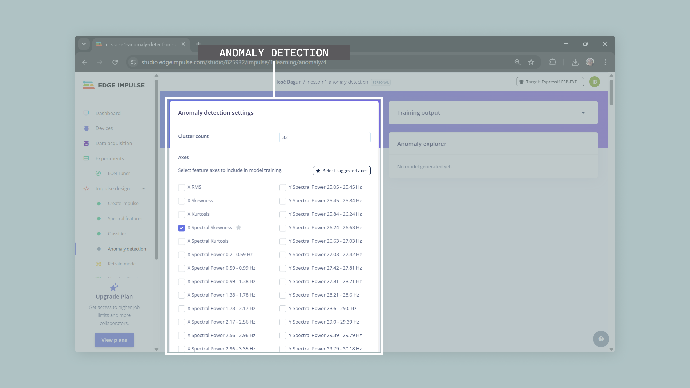

***__Important note__: Using 12 clusters instead of 32 produces more reasonable anomaly scores (typically in the 0 to 5 range) that are easier to threshold in your application. The BMI270's high sensitivity means fewer clusters are needed to map normal operation patterns effectively.***

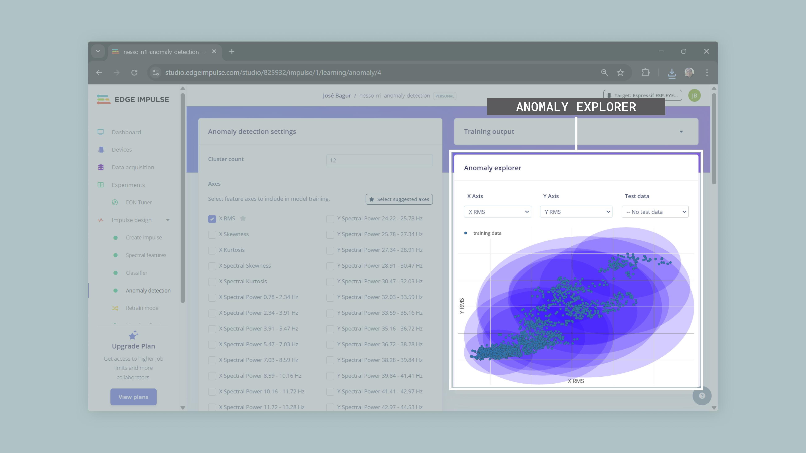

#### Special Considerations for the Nesso N1

The Nesso N1's integrated BMI270 IMU has high sensitivity and low noise, which requires some adjustments to the typical training approach:

1. **Gravity Compensation**: The BMI270 always measures 1g acceleration due to gravity. Make sure your training data includes the device in its intended mounting orientation.

2. **Micro-vibration Sensitivity**: The IMU can detect very small vibrations. Collect `idle` data in a truly vibration-free environment, or the model may struggle to distinguish idle from nominal states.

3. **Data Collection Duration**: Due to the sensor's stability, you may need only 5 to 10 minutes each of idle and nominal data rather than the 10 to 15 minutes suggested for analog sensors.

4. **Threshold Calibration**: After deployment, expect to adjust the anomaly threshold based on your specific motor and environment. Start with a threshold of 2.0 and adjust based on false positive/negative rates.

***__Important note__: If the model consistently misclassifies idle as nominal, the IMU may be detecting ambient vibrations or electrical noise. Consider adding a magnitude-based override in your Arduino code to force `idle` classification when vibration levels are below a certain threshold (typically 0.02g variation from baseline).***

#### Model Validation and Testing

After training completion, validate both model performances using the following methods:

- **Live Classification**: Use the "Live classification" feature with data collected directly from the Nesso N1
- **Classification Performance**: Verify >95% accuracy for `idle`/`nominal` distinction
- **Anomaly Score Range**: Confirm anomaly scores stay below 2.0 for normal operation
- **Edge Cases**: Test with motor at different speeds and loads
- **Environmental Testing**: Verify performance with ambient vibrations present

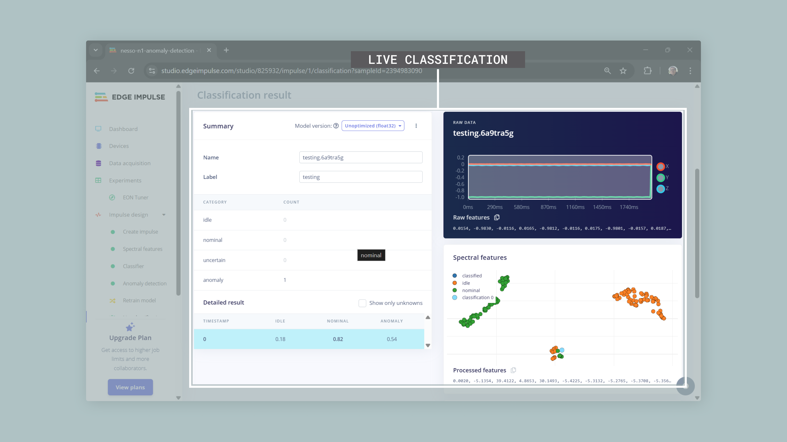

### Model Deployment

After successful training and validation, deploy the model as an Arduino library:

1. **Deployment Section**: Navigate to the "Deployment" tab in Edge Impulse Studio
2. **Arduino Library**: Select "Arduino library" as the deployment target
3. **Optimization Settings**: Choose `int8` quantization for memory efficiency on the ESP32-C6
4. **EON Compiler**: Enable "Enable EON Compiler" for optimized performance
5. **Download Library**: Download the generated Arduino library ZIP file
6. **Library Installation**: Install in Arduino IDE using "Sketch > Include Library > Add .ZIP Library"

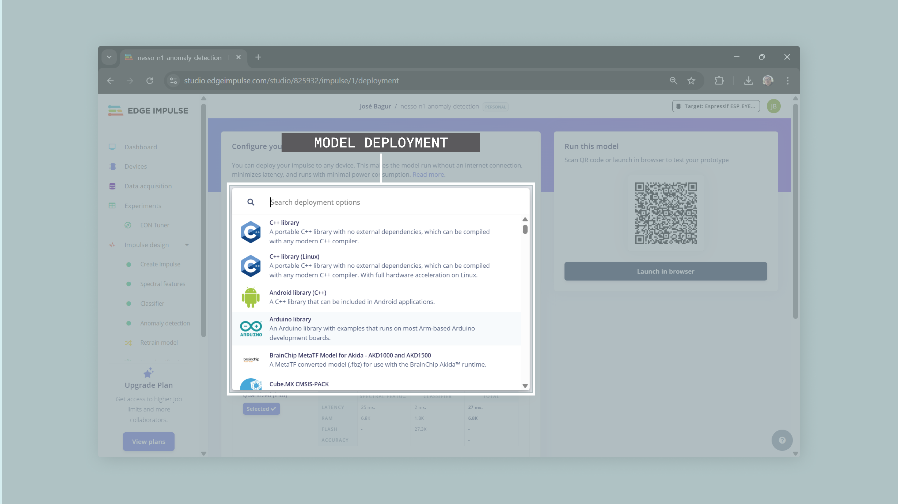

The generated library is optimized for the Nesso N1's ESP32-C6 processor, providing efficient real-time inference with typical processing times under 20ms for both classification and anomaly detection.

## Improving the Vibration Monitor with Machine Learning

Now that we have trained our machine learning models, we can create a smart vibration monitor that automatically detects motor problems in real-time.

The enhanced system does two things: it identifies whether the motor is running (nominal) or stopped (idle), and it alerts you when it detects unusual vibration patterns that might indicate a problem. This all happens directly on the Nesso N1 development kit without needing an internet connection.

The smart monitoring system can do the following:

- Tell if the motor is running (nominal) or stopped (idle)
- Detect unusual vibrations that might indicate problems
- Provide full-screen color-coded visual feedback for immediate status recognition
- Work continuously without needing internet or cloud services

The complete enhanced example sketch is shown below:

```arduino
/**
  Intelligent Motor Anomaly Detection System
  Name: motor_anomaly_detection_nesso.ino
  Purpose: This sketch implements real-time motor anomaly detection using
  the Nesso N1's integrated BMI270 IMU and Edge Impulse machine learning 
  model with full-screen visual feedback for predictive maintenance.
  
  @version 5.0 01/11/25
  @author Arduino Product Experience Team
*/

// Include the Edge Impulse library (name will match your project name)
#include <nesso-n1-anomaly-detection_inferencing.h>

// Include libraries for Nesso's IMU and display control
#include <Arduino_BMI270_BMM150.h>
#include <M5GFX.h>

// Display instance for the 1.14" touch screen
M5GFX display;

// Data buffers for model inference
static float buffer[EI_CLASSIFIER_DSP_INPUT_FRAME_SIZE] = { 0 };
static float inference_buffer[EI_CLASSIFIER_DSP_INPUT_FRAME_SIZE];

// Maximum accepted acceleration range (±2g)
#define MAX_ACCEPTED_RANGE  2.0f

// Detection parameters
const float ANOMALY_THRESHOLD = 3.0f;   // Threshold for anomaly detection
const float WARNING_THRESHOLD = 1.5f;   // Warning zone threshold
const float IDLE_THRESHOLD = 0.02f;     // Vibration threshold for idle detection

// System status variables
int totalInferences = 0;
int anomalyCount = 0;
unsigned long lastInferenceTime = 0;
const unsigned long INFERENCE_INTERVAL = 2000; // Inference interval in milliseconds

// Buffer management variables
bool bufferFilled = false;
int sampleCount = 0;

// Current state tracking
String currentState = "INITIALIZING";
bool currentAnomaly = false;

// Function declarations
float ei_get_sign(float number);
int raw_feature_get_data(size_t offset, size_t length, float *out_ptr);
void runInference();
void updateFullScreenDisplay(String state, bool anomaly);
float calculateVibrationLevel();
void processResults(ei_impulse_result_t result, float vibration);

/**
  Initializes the IMU, display, and machine learning system.
  Configures the Nesso N1 for optimal performance with the
  Edge Impulse model and prepares for real-time anomaly detection.
*/
void setup() {
    // Initialize serial communication at 115200 baud
    Serial.begin(115200);
    while (!Serial && millis() < 3000);
    
    Serial.println("- Nesso N1 Motor Anomaly Monitor");
    
    // Initialize the 1.14" touch display
    display.begin();
    display.setRotation(1);  // Set to landscape orientation
    display.fillScreen(TFT_BLACK);
    display.setTextSize(2);
    display.setTextColor(TFT_WHITE, TFT_BLACK);
    display.setTextDatum(MC_DATUM);
    display.drawString("INITIALIZING...", display.width() / 2, display.height() / 2);
    
    // Initialize BMI270 IMU sensor
    if (!IMU.begin()) {
        Serial.println("- ERROR: Failed to initialize IMU!");
        display.fillScreen(TFT_RED);
        display.setTextColor(TFT_WHITE, TFT_RED);
        display.drawString("IMU FAILED!", display.width() / 2, display.height() / 2);
        while (1);  // Halt execution on IMU failure
    }
    
    Serial.println("- BMI270 IMU initialized!");
    Serial.print("- Sample rate: ");
    Serial.print(IMU.accelerationSampleRate());
    Serial.println(" Hz");
    
    // Verify Edge Impulse model configuration
    if (EI_CLASSIFIER_RAW_SAMPLES_PER_FRAME != 3) {
        Serial.println("ERROR: EI_CLASSIFIER_RAW_SAMPLES_PER_FRAME should be 3");
        while (1);  // Halt execution on configuration error
    }
    
    Serial.println("\n- Edge Impulse Model loaded!");
    Serial.print("- Project: ");
    Serial.println(EI_CLASSIFIER_PROJECT_NAME);
    
    Serial.println("\n- Filling buffer...");
    
    // Display starting message while buffer fills
    display.fillScreen(TFT_DARKGREY);
    display.setTextColor(TFT_WHITE, TFT_DARKGREY);
    display.drawString("STARTING...", display.width() / 2, display.height() / 2);
    
    delay(1000);
}

/**
  Main loop that continuously collects vibration data and performs
  real-time classification and anomaly detection using the embedded
  machine learning models.
*/
void loop() {
    // Calculate the next sampling tick for precise timing
    uint64_t next_tick = micros() + (EI_CLASSIFIER_INTERVAL_MS * 1000);
    
    // Shift the buffer by 3 samples to create a rolling window
    numpy::roll(buffer, EI_CLASSIFIER_DSP_INPUT_FRAME_SIZE, -3);
    
    // Wait for new acceleration data from the IMU
    float x, y, z;
    while (!IMU.accelerationAvailable()) {
        delayMicroseconds(10);
    }
    
    // Read acceleration values (already in g units)
    IMU.readAcceleration(x, y, z);
    
    // Store new data at the end of the buffer
    buffer[EI_CLASSIFIER_DSP_INPUT_FRAME_SIZE - 3] = x;
    buffer[EI_CLASSIFIER_DSP_INPUT_FRAME_SIZE - 2] = y;
    buffer[EI_CLASSIFIER_DSP_INPUT_FRAME_SIZE - 1] = z;
    
    // Clip acceleration values to the maximum accepted range
    for (int i = 0; i < 3; i++) {
        float* val = &buffer[EI_CLASSIFIER_DSP_INPUT_FRAME_SIZE - 3 + i];
        if (fabs(*val) > MAX_ACCEPTED_RANGE) {
            *val = ei_get_sign(*val) * MAX_ACCEPTED_RANGE;
        }
    }
    
    // Track buffer filling progress during initialization
    if (!bufferFilled) {
        sampleCount++;
        if (sampleCount >= EI_CLASSIFIER_DSP_INPUT_FRAME_SIZE / 3) {
            bufferFilled = true;
            Serial.println("- Buffer filled, starting monitoring...\n");
        }
    }
    
    // Maintain precise sampling rate
    uint64_t time_to_wait = next_tick - micros();
    if (time_to_wait > 0 && time_to_wait < 1000000) {
        delayMicroseconds(time_to_wait);
    }
    
    // Execute inference at the specified interval
    if (bufferFilled && (millis() - lastInferenceTime >= INFERENCE_INTERVAL)) {
        lastInferenceTime = millis();
        runInference();
    }
}

/**
  Executes the Edge Impulse inference on collected vibration data.
  Processes the data through both classification and anomaly detection
  models to determine motor state and detect unusual patterns.
*/
void runInference() {
    // Copy the current buffer for inference processing
    memcpy(inference_buffer, buffer, EI_CLASSIFIER_DSP_INPUT_FRAME_SIZE * sizeof(float));
    
    // Calculate vibration level for additional state verification
    float vibration = calculateVibrationLevel();
    
    // Create signal structure for Edge Impulse
    signal_t signal;
    signal.total_length = EI_CLASSIFIER_DSP_INPUT_FRAME_SIZE;
    signal.get_data = &raw_feature_get_data;
    
    // Run the Edge Impulse classifier
    ei_impulse_result_t result = { 0 };
    EI_IMPULSE_ERROR res = run_classifier(&signal, &result, false);
    
    if (res != EI_IMPULSE_OK) {
        Serial.printf("- ERROR: Failed to run classifier (%d)!\n", res);
        return;
    }
    
    // Override classification if vibration indicates clear idle state
    if (vibration < IDLE_THRESHOLD) {
        for (size_t ix = 0; ix < EI_CLASSIFIER_LABEL_COUNT; ix++) {
            if (strcmp(ei_classifier_inferencing_categories[ix], "idle") == 0) {
                result.classification[ix].value = 0.99f;
            } else {
                result.classification[ix].value = 0.01f;
            }
        }
    }
    
    // Process and display the inference results
    processResults(result, vibration);
}

/**
  Processes inference results and updates the full-screen display.
  Analyzes classification confidence and anomaly scores to determine
  the current motor state and trigger appropriate visual feedback.
*/
void processResults(ei_impulse_result_t result, float vibration) {
    totalInferences++;
    
    // Find the classification with highest confidence
    String bestLabel = "unknown";
    float bestValue = 0;
    
    Serial.printf("- Inference #%d\n", totalInferences);
    
    for (size_t ix = 0; ix < EI_CLASSIFIER_LABEL_COUNT; ix++) {
        if (result.classification[ix].value > bestValue) {
            bestValue = result.classification[ix].value;
            bestLabel = String(ei_classifier_inferencing_categories[ix]);
        }
    }
    
    Serial.printf("- State: %s (%.0f%% confidence)\n", bestLabel.c_str(), bestValue * 100);
    Serial.printf("- Vibration: %.4f g\n", vibration);
    
    // Evaluate anomaly detection results
    bool isAnomaly = false;
    
#if EI_CLASSIFIER_HAS_ANOMALY
    float anomalyScore = result.anomaly;
    Serial.printf("- Anomaly score: %.3f", anomalyScore);
    
    if (anomalyScore < WARNING_THRESHOLD) {
        Serial.println(" [NORMAL]");
    } else if (anomalyScore < ANOMALY_THRESHOLD) {
        Serial.println(" [WARNING]");
    } else {
        Serial.println(" [ANOMALY!]");
        isAnomaly = true;
        anomalyCount++;
    }
#endif
    
    // Update display only when state or anomaly status changes
    if (bestLabel != currentState || isAnomaly != currentAnomaly) {
        currentState = bestLabel;
        currentAnomaly = isAnomaly;
        updateFullScreenDisplay(currentState, currentAnomaly);
    }
    
    Serial.printf("- Timing: DSP %d ms, Classification %d ms\n\n", 
                  result.timing.dsp, result.timing.classification);
}

/**
  Updates the full-screen display with color-coded motor status.
  Provides immediate visual feedback using background colors:
  Blue for idle, Green for nominal operation, Red for anomalies.
*/
void updateFullScreenDisplay(String state, bool anomaly) {
    uint16_t bgColor;
    uint16_t textColor;
    String displayText;
    
    if (anomaly) {
        // Anomaly detected - Display red background with white text
        bgColor = TFT_RED;
        textColor = TFT_WHITE;
        displayText = "ANOMALY";
        Serial.println(">>> Display: RED - ANOMALY");
    } else if (state == "idle") {
        // Motor idle - Display blue background with white text
        bgColor = TFT_BLUE;
        textColor = TFT_WHITE;
        displayText = "IDLE";
        Serial.println(">>> Display: BLUE - IDLE");
    } else if (state == "nominal") {
        // Normal operation - Display green background with black text
        bgColor = TFT_GREEN;
        textColor = TFT_BLACK;
        displayText = "NOMINAL";
        Serial.println(">>> Display: GREEN - NOMINAL");
    } else {
        // Unknown state - Display grey background with white text
        bgColor = TFT_DARKGREY;
        textColor = TFT_WHITE;
        displayText = "UNKNOWN";
        Serial.println(">>> Display: GREY - UNKNOWN");
    }
    
    // Fill entire screen with the status color
    display.fillScreen(bgColor);
    
    // Configure text properties for centered display
    display.setTextColor(textColor, bgColor);
    display.setTextSize(3);
    display.setTextDatum(MC_DATUM);
    
    // Draw the status text in the center of the screen
    display.drawString(displayText, display.width() / 2, display.height() / 2);
}

/**
  Calculates the vibration level from collected acceleration data.
  Removes gravity component and computes the average magnitude
  of vibration across multiple samples.
*/
float calculateVibrationLevel() {
    float sum = 0;
    int samples = min(30, EI_CLASSIFIER_DSP_INPUT_FRAME_SIZE / 3);
    
    // Calculate vibration magnitude for each sample
    for (int i = 0; i < samples; i++) {
        float x = buffer[i * 3];
        float y = buffer[i * 3 + 1];
        float z = buffer[i * 3 + 2] - 1.0f;  // Remove gravity component
        sum += sqrt(x*x + y*y + z*z);
    }
    
    return sum / samples;
}

/**
  Returns the sign of a number.
  Used for clipping acceleration values to the maximum range.
*/
float ei_get_sign(float number) {
    return (number >= 0.0) ? 1.0 : -1.0;
}

/**
  Callback function for Edge Impulse library to access feature data.
  Provides the machine learning model with vibration data in the
  required format for inference processing.
*/
int raw_feature_get_data(size_t offset, size_t length, float *out_ptr) {
    memcpy(out_ptr, inference_buffer + offset, length * sizeof(float));
    return 0;
}
```

The following sections will help you understand the main components of the enhanced example sketch, which can be divided into the following areas:

- Edge Impulse library integration
- Real-time data collection using the integrated IMU
- Machine learning inference execution
- Visual feedback system with full-screen color coding

### Edge Impulse Library Integration and IMU Setup

The enhanced sketch starts by including the Edge Impulse library and configuring the integrated BMI270 IMU sensor.

```arduino
// Include the Edge Impulse library (name will match your project name)
#include <nesso-n1-anomaly-detection_inferencing.h>

// Include libraries for IMU and display control
#include <Arduino_BMI270_BMM150.h>
#include <M5GFX.h>

// Detection parameters
const float ANOMALY_THRESHOLD = 3.0f;   // Adjusted for K-means clustering
const float IDLE_THRESHOLD = 0.02f;     // Vibration threshold for idle detection

// Data buffers for the models
static float buffer[EI_CLASSIFIER_DSP_INPUT_FRAME_SIZE] = { 0 };
static float inference_buffer[EI_CLASSIFIER_DSP_INPUT_FRAME_SIZE];
```

The library contains both the classification model (to identify if the motor is idle or running) and the anomaly detection model (to spot unusual vibrations). The integrated BMI270 IMU provides calibrated digital acceleration data directly in g units, eliminating the need for analog-to-digital conversion or manual calibration.

### Machine Learning Inference Execution

The system analyzes the collected vibration data using both machine learning models to determine motor state and detect anomalies.

```arduino
/**
  Executes the Edge Impulse inference on collected vibration data.
  Processes the data through both classification and anomaly detection
  models to determine motor state and detect unusual patterns.
*/
void runInference() {
    // Copy the current buffer for inference processing
    memcpy(inference_buffer, buffer, EI_CLASSIFIER_DSP_INPUT_FRAME_SIZE * sizeof(float));
    
    // Calculate vibration level for additional state verification
    float vibration = calculateVibrationLevel();
    
    // Create signal structure for Edge Impulse
    signal_t signal;
    signal.total_length = EI_CLASSIFIER_DSP_INPUT_FRAME_SIZE;
    signal.get_data = &raw_feature_get_data;
    
    // Run the Edge Impulse classifier
    ei_impulse_result_t result = { 0 };
    EI_IMPULSE_ERROR res = run_classifier(&signal, &result, false);
    
    if (res != EI_IMPULSE_OK) {
        Serial.printf("- ERROR: Failed to run classifier (%d)!\n", res);
        return;
    }
    
    // Override classification if vibration indicates clear idle state
    if (vibration < IDLE_THRESHOLD) {
        for (size_t ix = 0; ix < EI_CLASSIFIER_LABEL_COUNT; ix++) {
            if (strcmp(ei_classifier_inferencing_categories[ix], "idle") == 0) {
                result.classification[ix].value = 0.99f;
            } else {
                result.classification[ix].value = 0.01f;
            }
        }
    }
    
    // Process and display the inference results
    processResults(result, vibration);
}
```

This function performs the complete inference pipeline. It first copies the rolling buffer data, calculates the current vibration level, and then runs the Edge Impulse classifier. If the vibration level is very low (below 0.02g), it overrides the classification to force an "idle" state, which helps compensate for the high sensitivity of the BMI270 IMU.

### Processing Results and Anomaly Detection

After inference, the system processes the results to determine the motor state and check for anomalies:

```arduino
/**
  Processes inference results and updates the full-screen display.
  Analyzes classification confidence and anomaly scores to determine
  the current motor state and trigger appropriate visual feedback.
*/
void processResults(ei_impulse_result_t result, float vibration) {
    totalInferences++;
    
    // Find the classification with highest confidence
    String bestLabel = "unknown";
    float bestValue = 0;
    
    for (size_t ix = 0; ix < EI_CLASSIFIER_LABEL_COUNT; ix++) {
        if (result.classification[ix].value > bestValue) {
            bestValue = result.classification[ix].value;
            bestLabel = String(ei_classifier_inferencing_categories[ix]);
        }
    }
    
    // Evaluate anomaly detection results
    bool isAnomaly = false;
    
#if EI_CLASSIFIER_HAS_ANOMALY
    float anomalyScore = result.anomaly;
    
    if (anomalyScore > ANOMALY_THRESHOLD) {
        isAnomaly = true;
        anomalyCount++;
    }
#endif
    
    // Update display only when state changes
    if (bestLabel != currentState || isAnomaly != currentAnomaly) {
        currentState = bestLabel;
        currentAnomaly = isAnomaly;
        updateFullScreenDisplay(currentState, currentAnomaly);
    }
}
```

This function analyzes the inference results to find the most likely motor state (idle or nominal) and checks if the anomaly score exceeds the threshold. It only updates the display when the state actually changes, avoiding unnecessary screen refreshes.

### Visual Feedback System

The Nesso N1's display provides immediate visual feedback using full-screen color coding:

```arduino
/**
  Updates the full-screen display with color-coded motor status.
  Provides immediate visual feedback using background colors:
  Blue for idle, Green for nominal operation, Red for anomalies.
*/
void updateFullScreenDisplay(String state, bool anomaly) {
    uint16_t bgColor;
    uint16_t textColor;
    String displayText;
    
    if (anomaly) {
        bgColor = TFT_RED;
        textColor = TFT_WHITE;
        displayText = "ANOMALY";
    } else if (state == "idle") {
        bgColor = TFT_BLUE;
        textColor = TFT_WHITE;
        displayText = "IDLE";
    } else if (state == "nominal") {
        bgColor = TFT_GREEN;
        textColor = TFT_BLACK;
        displayText = "NOMINAL";
    }
    
    display.fillScreen(bgColor);
    display.setTextColor(textColor, bgColor);
    display.setTextSize(3);
    display.setTextDatum(MC_DATUM);
    display.drawString(displayText, display.width() / 2, display.height() / 2);
}
```

This function creates a clear, unmistakable visual indication of the motor status that can be seen from across a room. After uploading the enhanced sketch to the Nesso N1 development kit, the display will show real-time motor status with color-coded feedback:

- **Blue screen with "IDLE"**: Motor is stopped
- **Green screen with "NOMINAL"**: Motor is running normally
- **Red screen with "ANOMALY"**: Unusual vibration pattern detected

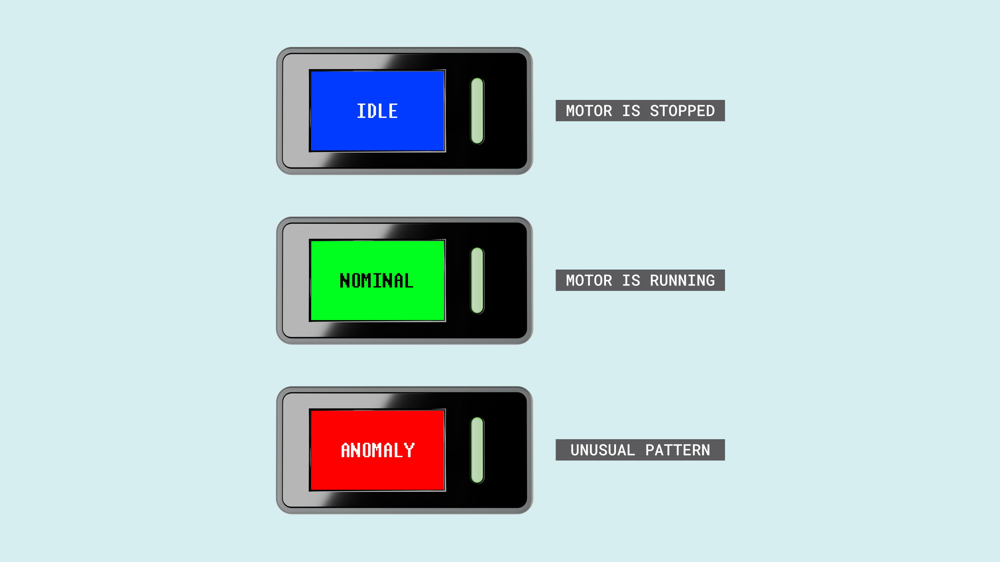

The IDE's Serial Monitor also provides detailed information including classification confidence, anomaly scores, and timing metrics for debugging and performance monitoring.

### Complete Enhanced Example Sketch

The complete intelligent motor anomaly detection sketch can be downloaded [here](assets/motor_anomaly_detection_nesso.zip).

[](assets/motor_anomaly_detection_nesso.zip)

### System Integration Considerations

When deploying the intelligent anomaly detection system in industrial environments, consider the following factors based on your sensor choice:

- **Environmental Protection**: Protect the Nano R4 board and accelerometer from dust, moisture and temperature extremes using appropriate enclosures rated for the operating environment.
- **Mounting Stability**: Make sure secure mechanical mounting of both the accelerometer sensor and the Nano R4 enclosure to prevent sensor movement that could affect measurement accuracy.
- **Power Management**: Implement appropriate power supply filtering and protection circuits, especially in electrically noisy industrial environments with motor drives and switching equipment.
- **Calibration Procedures**: Establish baseline measurements for each motor installation to account for mounting variations and motor-specific characteristics that may affect anomaly thresholds.
- **Maintenance Integration**: Plan integration with existing maintenance management systems through data logging interfaces or communication protocols for complete predictive maintenance programs.

## Arduino IoT Cloud Integration

The motor anomaly detection system can be extended with remote monitoring capabilities through [Arduino Cloud](https://cloud.arduino.cc/), enabling real-time status visualization from anywhere with internet connectivity. This integration maintains all local functionality while adding cloud-based dashboard indicators for remote monitoring. 

***__Important Note__: The Arduino Cloud integration requires the `ArduinoIoTCloud` library and the ESP32 boards core. Install the ESP32 boards core through the Arduino IDE Boards Manager by searching for and installing "esp32" by Espressif Systems. For the `ArduinoIoTCloud` library, use the IDE's Library Manager to search and install `ArduinoIoTCloud` by Arduino, accepting all dependencies when prompted.***

### Cloud Architecture Overview

The cloud integration implements a three-state monitoring system using `boolean` variables that mirror the local display states. Each state (`idle`, `nominal`, and `anomaly`) is represented by an exclusive boolean indicator on the Arduino Cloud dashboard, guaranteeing clear and immediate visual feedback for remote operators.

The system maintains bidirectional synchronization between the Nesso N1 development kit and the Arduino Cloud platform, updating dashboard widgets in real-time as motor conditions change. This architecture complement remote monitoring capabilities rather than replace local visualization, providing redundancy and flexibility in deployment scenarios.

### Setting Up Arduino Cloud Components

**A. Create Device**

Begin by establishing the device identity in the Arduino Cloud platform:

1. Navigate to the [Arduino Cloud "**Devices**" page](https://app.arduino.cc/devices)
2. Click the **+ CREATE** button in the top right corner
3. Select "**Any device**" from the Setup Device dialog
4. Click **CONTINUE** to generate device credentials
5. Adjust the device name if desired (for example, "Nesso-Motor-Monitor")
6. Save the generated Device ID and Secret Key securely
7. Confirm credential storage and click "**CONTINUE**"

**B. Create Thing**

Configure the Thing to represent your motor monitoring system:

1. Open the [Arduino Cloud "**Things**" page](https://app.arduino.cc/things)
2. Click "**+ THING**" to create a new Thing
3. Rename the Thing to "Motor_Anomaly_Monitor" using the dropdown menu
4. Add three Cloud Variables with the specifications shown below
5. Associate the Thing with your previously created Device using the "**Select Device**" button

**Cloud variables to add:**

| **Variable Name** | **Type** | **Permission** | **Update Policy** |
|:-----------------:|:--------:|:--------------:|:-----------------:|
|       `idle`      |  Boolean |    Read Only   |     On Change     |
|     `nominal`     |  Boolean |    Read Only   |     On Change     |
|     `anomaly`     |  Boolean |    Read Only   |     On Change     |

**C. Create Dashboard**

Design the visual interface for remote monitoring:

1. Access the [Arduino Cloud Dashboards page](https://app.arduino.cc/dashboards)
2. Click "**+ DASHBOARD**" to create a new dashboard
3. Rename the dashboard to "Motor Status Monitor"
4. Enter Edit mode and click "**ADD**" to add widgets
5. Select the "**THINGS**" tab and choose your Motor_Anomaly_Monitor Thing
6. Configure three STATUS widgets (idle in blue, nominal inn green, and anomaly in red)
7. Arrange widgets horizontally for optimal visibility
8. Click DONE to save the dashboard configuration

### Complete Cloud-Enabled Sketch

The complete enhanced example sketch with Arduino Cloud integration is shown below:

```arduino
/**
  Intelligent Motor Anomaly Detection System - Arduino Cloud Edition
  Name: motor_anomaly_detection_cloud.ino
  Purpose: This sketch implements real-time motor anomaly detection using
  the Nesso N1's integrated BMI270 IMU and Edge Impulse machine learning 
  model with Arduino IoT Cloud integration for remote monitoring through
  three boolean state indicators.
  
  @version 6.0 01/11/25
  @author Arduino Product Experience Team
*/

// Include Arduino Cloud configuration and connection handler
#include "thingProperties.h"

// Include the Edge Impulse library (name will match your project name)
#include <nesso-n1-anomaly-detection_inferencing.h>

// Include libraries for Nesso's IMU and display control
#include <Arduino_BMI270_BMM150.h>
#include <M5GFX.h>

// Display instance for the 1.14" touch screen
M5GFX display;

// Data buffers for model inference
static float buffer[EI_CLASSIFIER_DSP_INPUT_FRAME_SIZE] = { 0 };
static float inference_buffer[EI_CLASSIFIER_DSP_INPUT_FRAME_SIZE];

// Maximum accepted acceleration range (±2g)
#define MAX_ACCEPTED_RANGE  2.0f

// Detection parameters
const float ANOMALY_THRESHOLD = 3.0f;   // Threshold for anomaly detection
const float WARNING_THRESHOLD = 1.5f;   // Warning zone threshold
const float IDLE_THRESHOLD = 0.02f;     // Vibration threshold for idle detection

// System status variables
int totalInferences = 0;
int anomalyCount = 0;
unsigned long lastInferenceTime = 0;
const unsigned long INFERENCE_INTERVAL = 2000; // Inference interval in milliseconds

// Buffer management variables
bool bufferFilled = false;
int sampleCount = 0;

// Current state tracking
String currentState = "INITIALIZING";
bool currentAnomaly = false;

// Cloud connection status
bool cloudConnected = false;

// Function declarations
float ei_get_sign(float number);
int raw_feature_get_data(size_t offset, size_t length, float *out_ptr);
void runInference();
void updateFullScreenDisplay(String state, bool anomaly);
float calculateVibrationLevel();
void processResults(ei_impulse_result_t result, float vibration);
void updateCloudStates(String state, bool isAnomaly);
void onCloudConnect();
void onCloudDisconnect();

/**
  Initializes the IMU, display, machine learning system, and Arduino Cloud.
  Configures the Nesso N1 for optimal performance with the Edge Impulse model
  and establishes connection to Arduino IoT Cloud for remote monitoring.
*/
void setup() {
    // Initialize serial communication at 115200 baud
    Serial.begin(115200);
    // Don't wait too long for Serial in case running standalone
    unsigned long serialStart = millis();
    while (!Serial && millis() - serialStart < 3000);
    
    Serial.println("- Nesso N1 Motor Anomaly Monitor with Cloud");
    Serial.println("- Version 6.0 - Arduino IoT Cloud Integration");
    
    // Initialize the 1.14" touch display
    display.begin();
    display.setRotation(1);  // Set to landscape orientation
    display.fillScreen(TFT_BLACK);
    display.setTextSize(2);
    display.setTextColor(TFT_WHITE, TFT_BLACK);
    display.setTextDatum(MC_DATUM);
    display.drawString("CLOUD CONNECT", display.width() / 2, display.height() / 2);
    
    // Initialize Arduino Cloud properties defined in thingProperties.h
    initProperties();
    
    // Connect to Arduino IoT Cloud with preferred connection method
    ArduinoCloud.begin(ArduinoIoTPreferredConnection);
    ArduinoCloud.addCallback(ArduinoIoTCloudEvent::CONNECT, onCloudConnect);
    ArduinoCloud.addCallback(ArduinoIoTCloudEvent::DISCONNECT, onCloudDisconnect);
    
    // Set debug message level for cloud connection troubleshooting
    setDebugMessageLevel(2);
    ArduinoCloud.printDebugInfo();
    
    Serial.println("- Connecting to Arduino IoT Cloud...");
    
    // Attempt cloud connection with 30 second timeout
    unsigned long cloudStart = millis();
    while (!ArduinoCloud.connected() && millis() - cloudStart < 30000) {
        ArduinoCloud.update();
        delay(100);
    }
    
    if (ArduinoCloud.connected()) {
        Serial.println("- Connected to Arduino IoT Cloud!");
        cloudConnected = true;
    } else {
        Serial.println("- Cloud connection timeout - continuing offline");
        cloudConnected = false;
    }
    
    // Initialize all cloud state variables to false
    idle = false;
    nominal = false;
    anomaly = false;
    
    // Update display for IMU initialization phase
    display.fillScreen(TFT_BLACK);
    display.drawString("INITIALIZING...", display.width() / 2, display.height() / 2);
    
    // Initialize BMI270 IMU sensor
    if (!IMU.begin()) {
        Serial.println("- ERROR: Failed to initialize IMU!");
        display.fillScreen(TFT_RED);
        display.setTextColor(TFT_WHITE, TFT_RED);
        display.drawString("IMU FAILED!", display.width() / 2, display.height() / 2);
        while (1) {
            ArduinoCloud.update(); // Keep cloud connection alive during error
            delay(100);
        }
    }
    
    Serial.println("- BMI270 IMU initialized!");
    Serial.print("- Sample rate: ");
    Serial.print(IMU.accelerationSampleRate());
    Serial.println(" Hz");
    
    // Verify Edge Impulse model configuration
    if (EI_CLASSIFIER_RAW_SAMPLES_PER_FRAME != 3) {
        Serial.println("ERROR: EI_CLASSIFIER_RAW_SAMPLES_PER_FRAME should be 3");
        while (1) {
            ArduinoCloud.update();
            delay(100);
        }
    }
    
    Serial.println("\n- Edge Impulse Model loaded!");
    Serial.print("- Project: ");
    Serial.println(EI_CLASSIFIER_PROJECT_NAME);
    
    Serial.println("\n- Filling buffer...");
    
    // Display starting message while buffer fills
    display.fillScreen(TFT_DARKGREY);
    display.setTextColor(TFT_WHITE, TFT_DARKGREY);
    display.drawString("STARTING...", display.width() / 2, display.height() / 2);
    
    delay(1000);
}

/**
  Main loop that continuously collects vibration data, performs real-time
  classification and anomaly detection, and updates both local display
  and Arduino Cloud dashboard indicators.
*/
void loop() {
    // Update Arduino Cloud connection and synchronize variables
    ArduinoCloud.update();
    
    // Calculate the next sampling tick for precise timing
    uint64_t next_tick = micros() + (EI_CLASSIFIER_INTERVAL_MS * 1000);
    
    // Shift the buffer by 3 samples to create a rolling window
    numpy::roll(buffer, EI_CLASSIFIER_DSP_INPUT_FRAME_SIZE, -3);
    
    // Wait for new acceleration data from the IMU
    float x, y, z;
    while (!IMU.accelerationAvailable()) {
        delayMicroseconds(10);
    }
    
    // Read acceleration values (already in g units)
    IMU.readAcceleration(x, y, z);
    
    // Store new data at the end of the buffer
    buffer[EI_CLASSIFIER_DSP_INPUT_FRAME_SIZE - 3] = x;
    buffer[EI_CLASSIFIER_DSP_INPUT_FRAME_SIZE - 2] = y;
    buffer[EI_CLASSIFIER_DSP_INPUT_FRAME_SIZE - 1] = z;
    
    // Clip acceleration values to the maximum accepted range
    for (int i = 0; i < 3; i++) {
        float* val = &buffer[EI_CLASSIFIER_DSP_INPUT_FRAME_SIZE - 3 + i];
        if (fabs(*val) > MAX_ACCEPTED_RANGE) {
            *val = ei_get_sign(*val) * MAX_ACCEPTED_RANGE;
        }
    }
    
    // Track buffer filling progress during initialization
    if (!bufferFilled) {
        sampleCount++;
        if (sampleCount >= EI_CLASSIFIER_DSP_INPUT_FRAME_SIZE / 3) {
            bufferFilled = true;
            Serial.println("- Buffer filled, starting monitoring...\n");
        }
    }
    
    // Maintain precise sampling rate
    uint64_t time_to_wait = next_tick - micros();
    if (time_to_wait > 0 && time_to_wait < 1000000) {
        delayMicroseconds(time_to_wait);
    }
    
    // Execute inference at the specified interval
    if (bufferFilled && (millis() - lastInferenceTime >= INFERENCE_INTERVAL)) {
        lastInferenceTime = millis();
        runInference();
    }
}

/**
  Executes the Edge Impulse inference on collected vibration data.
  Processes the data through both classification and anomaly detection
  models to determine motor state and detect unusual patterns.
*/
void runInference() {
    // Copy the current buffer for inference processing
    memcpy(inference_buffer, buffer, EI_CLASSIFIER_DSP_INPUT_FRAME_SIZE * sizeof(float));
    
    // Calculate vibration level for additional state verification
    float vibration = calculateVibrationLevel();
    
    // Create signal structure for Edge Impulse
    signal_t signal;
    signal.total_length = EI_CLASSIFIER_DSP_INPUT_FRAME_SIZE;
    signal.get_data = &raw_feature_get_data;
    
    // Run the Edge Impulse classifier
    ei_impulse_result_t result = { 0 };
    EI_IMPULSE_ERROR res = run_classifier(&signal, &result, false);
    
    if (res != EI_IMPULSE_OK) {
        Serial.printf("- ERROR: Failed to run classifier (%d)!\n", res);
        return;
    }
    
    // Override classification if vibration indicates clear idle state
    if (vibration < IDLE_THRESHOLD) {
        for (size_t ix = 0; ix < EI_CLASSIFIER_LABEL_COUNT; ix++) {
            if (strcmp(ei_classifier_inferencing_categories[ix], "idle") == 0) {
                result.classification[ix].value = 0.99f;
            } else {
                result.classification[ix].value = 0.01f;
            }
        }
    }
    
    // Process and display the inference results
    processResults(result, vibration);
}

/**
  Processes inference results and updates both the full-screen display
  and Arduino Cloud dashboard. Analyzes classification confidence and
  anomaly scores to determine the current motor state and trigger
  appropriate visual feedback locally and remotely.
*/
void processResults(ei_impulse_result_t result, float vibration) {
    totalInferences++;
    
    // Find the classification with highest confidence
    String bestLabel = "unknown";
    float bestValue = 0;
    
    Serial.printf("- Inference #%d", totalInferences);
    if (cloudConnected) {
        Serial.println(" [Cloud: Connected]");
    } else {
        Serial.println(" [Cloud: Offline]");
    }
    
    for (size_t ix = 0; ix < EI_CLASSIFIER_LABEL_COUNT; ix++) {
        if (result.classification[ix].value > bestValue) {
            bestValue = result.classification[ix].value;
            bestLabel = String(ei_classifier_inferencing_categories[ix]);
        }
    }
    
    Serial.printf("- State: %s (%.0f%% confidence)\n", bestLabel.c_str(), bestValue * 100);
    Serial.printf("- Vibration: %.4f g\n", vibration);
    
    // Evaluate anomaly detection results
    bool isAnomaly = false;
    
#if EI_CLASSIFIER_HAS_ANOMALY
    float anomalyScore = result.anomaly;
    Serial.printf("- Anomaly score: %.3f", anomalyScore);
    
    if (anomalyScore < WARNING_THRESHOLD) {
        Serial.println(" [NORMAL]");
    } else if (anomalyScore < ANOMALY_THRESHOLD) {
        Serial.println(" [WARNING]");
    } else {
        Serial.println(" [ANOMALY!]");
        isAnomaly = true;
        anomalyCount++;
    }
#endif
    
    // Update display and cloud only when state or anomaly status changes
    if (bestLabel != currentState || isAnomaly != currentAnomaly) {
        currentState = bestLabel;
        currentAnomaly = isAnomaly;
        updateFullScreenDisplay(currentState, currentAnomaly);
        updateCloudStates(currentState, currentAnomaly);
    }
    
    Serial.printf("- Timing: DSP %d ms, Classification %d ms\n\n", 
                  result.timing.dsp, result.timing.classification);
}

/**
  Updates Arduino Cloud dashboard variables based on motor state.
  Sets one of three boolean indicators (idle, nominal, anomaly) to true
  while ensuring the others are false, providing exclusive state indication
  for remote monitoring through the IoT Cloud dashboard.
*/
void updateCloudStates(String state, bool isAnomaly) {
    // Reset all state indicators to false
    idle = false;
    nominal = false;
    anomaly = false;
    
    // Set the appropriate state indicator based on current condition
    if (isAnomaly) {
        anomaly = true;
        Serial.println(">>> Cloud Update: ANOMALY = true");
    } else if (state == "idle") {
        idle = true;
        Serial.println(">>> Cloud Update: IDLE = true");
    } else if (state == "nominal") {
        nominal = true;
        Serial.println(">>> Cloud Update: NOMINAL = true");
    }
    
    // Force immediate cloud variable synchronization
    ArduinoCloud.update();
}

/**
  Updates the full-screen display with color-coded motor status.
  Provides immediate visual feedback using background colors:
  Blue for idle, Green for nominal operation, Red for anomalies.
  Also displays cloud connection status in the corner.
*/
void updateFullScreenDisplay(String state, bool isAnomaly) {
    uint16_t bgColor;
    uint16_t textColor;
    String displayText;
    
    if (isAnomaly) {
        // Anomaly detected - Display red background with white text
        bgColor = TFT_RED;
        textColor = TFT_WHITE;
        displayText = "ANOMALY";
        Serial.println(">>> Display: RED - ANOMALY");
    } else if (state == "idle") {
        // Motor idle - Display blue background with white text
        bgColor = TFT_BLUE;
        textColor = TFT_WHITE;
        displayText = "IDLE";
        Serial.println(">>> Display: BLUE - IDLE");
    } else if (state == "nominal") {
        // Normal operation - Display green background with black text
        bgColor = TFT_GREEN;
        textColor = TFT_BLACK;
        displayText = "NOMINAL";
        Serial.println(">>> Display: GREEN - NOMINAL");
    } else {
        // Unknown state - Display grey background with white text
        bgColor = TFT_DARKGREY;
        textColor = TFT_WHITE;
        displayText = "UNKNOWN";
        Serial.println(">>> Display: GREY - UNKNOWN");
    }
    
    // Fill entire screen with the status color
    display.fillScreen(bgColor);
    
    // Configure text properties for centered display
    display.setTextColor(textColor, bgColor);
    display.setTextSize(3);
    display.setTextDatum(MC_DATUM);
    
    // Draw the status text in the center of the screen
    display.drawString(displayText, display.width() / 2, display.height() / 2);
    
    // Add cloud connection status indicator in top-left corner
    display.setTextSize(1);
    display.setTextDatum(TL_DATUM);
    if (cloudConnected) {
        display.drawString("CLOUD: ON", 5, 5);
    } else {
        display.drawString("CLOUD: OFF", 5, 5);
    }
}

/**
  Calculates the vibration level from collected acceleration data.
  Removes gravity component and computes the average magnitude
  of vibration across multiple samples for accurate state detection.
*/
float calculateVibrationLevel() {
    float sum = 0;
    int samples = min(30, EI_CLASSIFIER_DSP_INPUT_FRAME_SIZE / 3);
    
    // Calculate vibration magnitude for each sample
    for (int i = 0; i < samples; i++) {
        float x = buffer[i * 3];
        float y = buffer[i * 3 + 1];
        float z = buffer[i * 3 + 2] - 1.0f;  // Remove gravity component
        sum += sqrt(x*x + y*y + z*z);
    }
    
    return sum / samples;
}

/**
  Callback function triggered when Arduino Cloud connection is established.
  Updates the cloud connection status and synchronizes the current motor
  state with the cloud dashboard for immediate remote visibility.
*/
void onCloudConnect() {
    cloudConnected = true;
    Serial.println(">>> Arduino IoT Cloud CONNECTED");
    
    // Synchronize current state with cloud dashboard on connection
    updateCloudStates(currentState, currentAnomaly);
}

/**
  Callback function triggered when Arduino Cloud connection is lost.
  Updates the connection status to allow the system to continue
  operating in offline mode while attempting reconnection.
*/
void onCloudDisconnect() {
    cloudConnected = false;
    Serial.println(">>> Arduino IoT Cloud DISCONNECTED");
}

/**
  Returns the sign of a number.
  Used for clipping acceleration values to the maximum range.
*/
float ei_get_sign(float number) {
    return (number >= 0.0) ? 1.0 : -1.0;
}

/**
  Callback function for Edge Impulse library to access feature data.
  Provides the machine learning model with vibration data in the
  required format for inference processing.
*/
int raw_feature_get_data(size_t offset, size_t length, float *out_ptr) {
    memcpy(out_ptr, inference_buffer + offset, length * sizeof(float));
    return 0;
}
```

The cloud-enabled sketch extends the original motor anomaly detection code with Arduino Cloud integration. The implementation requires two primary files: the main sketch and two supporting configuration files.

### Supporting Configuration Files

#### Thing Properties Configuration

Create a `thingProperties.h` file in the Arduino IDE in a new tab (Ctrl + Shift + N)  to define cloud variables and connection parameters:

```arduino
/**
  Arduino IoT Cloud Thing Properties Configuration
  Defines cloud variables and connection settings for remote monitoring
*/

#include <ArduinoIoTCloud.h>
#include "arduino_secrets.h"

// Cloud dashboard state indicators
bool idle;      // Motor in idle state
bool nominal;   // Normal operation
bool anomaly;   // Anomaly detected

void initProperties() {    
    // Register state variables
    ArduinoCloud.addProperty(idle, READ, ON_CHANGE, NULL);
    ArduinoCloud.addProperty(nominal, READ, ON_CHANGE, NULL);
    ArduinoCloud.addProperty(anomaly, READ, ON_CHANGE, NULL);
    
    ArduinoCloud.setBoardId(SECRET_DEVICE_ID);
    ArduinoCloud.setSecretDeviceKey(SECRET_DEVICE_KEY);
}

// Network connection handler
WiFiConnectionHandler ArduinoIoTPreferredConnection(SECRET_WIFI_SSID, SECRET_WIFI_PASS);
```

#### Arduino Secrets Configuration

Create an `arduino_secrets.h` file in the Arduino IDE in a new tab (Ctrl + Shift + N) to store sensitive credentials (created and stored before):

```arduino
// Credentials for your Wi-Fi access point.
#define SECRET_WIFI_SSID "your-wifi-network-name"
#define SECRET_WIFI_PASS "your-wifi-password"

// Device ID is not actually secret, but is defined alongside the secret key for convenience.
#define SECRET_DEVICE_ID "your-device-secret-id"
#define SECRET_DEVICE_KEY "your-device-secret-key"
```

### Cloud Integration Implementation

The cloud-enabled sketch version maintains all original functionality while adding remote monitoring capabilities. Key modifications include the following:

#### Initialization Enhancements

The setup function now initializes cloud connectivity before starting motor monitoring:

```arduino
void setup() {
    // Initialize display with cloud connection status
    display.drawString("CLOUD CONNECT", display.width() / 2, display.height() / 2);
    
    // Initialize Arduino Cloud
    initProperties();
    ArduinoCloud.begin(ArduinoIoTPreferredConnection);
    ArduinoCloud.addCallback(ArduinoIoTCloudEvent::CONNECT, onCloudConnect);
    ArduinoCloud.addCallback(ArduinoIoTCloudEvent::DISCONNECT, onCloudDisconnect);
    
    // Attempt connection with timeout
    unsigned long cloudStart = millis();
    while (!ArduinoCloud.connected() && millis() - cloudStart < 30000) {
        ArduinoCloud.update();
        delay(100);
    }
    
    // Continue with IMU and model initialization...
}
```

#### State Synchronization

The system updates cloud variables whenever the motor state changes:

```arduino
void updateCloudStates(String state, bool isAnomaly) {
    // Reset all indicators
    idle = false;
    nominal = false;
    anomaly = false;
    
    // Set appropriate state
    if (isAnomaly) {
        anomaly = true;
    } else if (state == "idle") {
        idle = true;
    } else if (state == "nominal") {
        nominal = true;
    }
    
    // Force cloud synchronization
    ArduinoCloud.update();
}
```

#### Connection Management

Callback functions handle cloud connection events:

```arduino
void onCloudConnect() {
    cloudConnected = true;
    Serial.println(">>> Arduino IoT Cloud CONNECTED");
    updateCloudStates(currentState, currentAnomaly);
}

void onCloudDisconnect() {
    cloudConnected = false;
    Serial.println(">>> Arduino IoT Cloud DISCONNECTED");
}
```

#### Monitoring and Operation

Once deployed, the system provides dual monitoring capabilities:

**Local Display**: 

The Nesso N1's display continues to show real-time status with color-coded backgrounds:
- **Blue**: Motor idle (no vibration detected)
- **Green**: Nominal operation (normal vibration patterns)
- **Red**: Anomaly detected (abnormal vibration patterns)

Also, a small indicator in the corner of the Nesso N1's display shows cloud connection status ("CLOUD: ON" or "CLOUD: OFF").


**Remote Dashboard**: 

The Arduino Cloud dashboard displays three STATUS widgets that mirror the local display state. Only one STATUS wiget is active at any time, providing clear status indication for remote monitoring. The system maintains full offline functionality, automatically reconnecting to the cloud when network connectivity is restored.

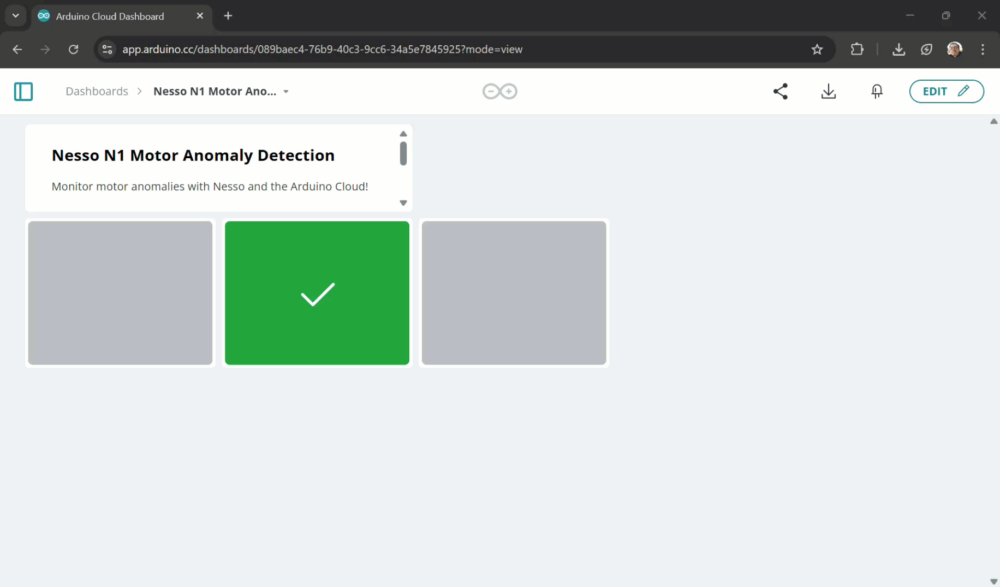

This cloud integration transforms the motor anomaly detection system into an EdgeAIoT solution, enabling predictive maintenance teams to monitor multiple motors remotely while maintaining the reliability and responsiveness of local edge computing.

### Complete Enhanced Example Sketch

The complete intelligent motor anomaly detection sketch with Arduino Cloud integration can be downloaded [here](assets/motor_anomaly_detection_cloud.zip).

[](assets/motor_anomaly_detection_cloud.zip)

## Conclusions

This application note demonstrates how to implement motor anomaly detection using the Nesso N1 development kit, combining Edge Impulse machine learning with Arduino Cloud for industrial predictive maintenance applications.

The solution uses the Nesso N1's ESP32-S3 dual-core processor to perform real-time anomaly detection directly on-device with inference times under 20 milliseconds, while Arduino Cloud integration enables remote monitoring without compromising edge processing performance.
The unsupervised K-means clustering approach requires only normal operation data for training, making it practical for industrial deployment where fault data may be scarce. This methodology effectively detects previously unseen fault conditions that deviate from established normal patterns.

The dual-mode architecture, featuring edge processing with cloud connectivity, provides system resilience through continued operation during network interruptions, while also offering remote monitoring capabilities when connected. Visual feedback through both local display and cloud dashboard widgets delivers intuitive status indication for operators and remote maintenance teams.s


## Next Steps

Building upon this foundation, several enhancements can further improve the motor anomaly detection system:

- **Multi-Sensor Fusion**: Integrate additional sensors such as temperature, current or acoustic sensors to provide a more complete view of motor health and improve detection accuracy. The onboard IMU's built-in gyroscope can provide additional motion analysis capabilities.
- **Wireless Communication**: Add wireless connectivity using the onboard LoRa module to enable remote monitoring and integration with existing plant systems.
- **Advanced Analysis**: Implement data logging for trend analysis, industrial protocol integration for SCADA systems or multi-class fault classification to distinguish between different types of motor problems.

The foundation provided in this application note enables rapid development of custom motor monitoring solutions tailored to specific industrial requirements, with the flexibility to choose the sensor option that best fits your application needs.