The **Arduino® Nesso N1** is an all-in-one enclosed development board. Based on the ESP32-C6 System on Chip (SoC), it integrates a suite of communication protocols, including 2.4 GHz Wi-Fi® 6, Bluetooth® 5.3 LE, 802.15.4 (Thread/Zigbee®), and long-range LoRa®. It also includes a 1.14" color touchscreen, buttons, and a built-in LiPo battery for immediate user interaction in portable applications.

This document serves as a comprehensive user manual for the Nesso N1, providing technical specifications, set up guides, and detailed explanations of its features to help you bring your projects to life.

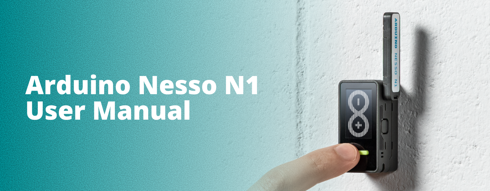

## Hardware and Software Requirements

### Hardware Requirements

- [Nesso N1](https://store.arduino.cc/products/nesso-n1) (x1)
- [USB-C® cable](https://store.arduino.cc/products/usb-cable2in1-type-c) (x1)

### Software Requirements

- [Arduino IDE](https://www.arduino.cc/en/software) (v2.0 or higher recommended)
- [ESP32 Boards core by Espressif](https://github.com/espressif/arduino-esp32) (v3.3.3 or higher)

*Note: Safe battery management requires version 3.3.5 or higher (pending release).*

## Product Overview

The Nesso N1 packs a rich set of features into a compact and portable form factor. It includes an integrated color touchscreen, multiple sensors, programmable buttons, and extensive expansion options, all powered by a rechargeable LiPo battery with power management.

### Product Architecture

- **ESP32-C6 SoC**: A powerful single-core RISC-V microcontroller with integrated Wi-Fi® 6, Bluetooth® 5.3 LE, and an 802.15.4 radio supporting Thread and Zigbee® for low-power mesh networking.
- **SX1262 LoRa® Module**: A long-range, low-power LoRa® transceiver for communication in remote or challenging environments.
- **1.14" Color Touchscreen**: An intuitive IPS display for user interaction and data visualization.
- **BMI270 IMU**: A 6-axis Inertial Measurement Unit for precise motion and orientation sensing.
- **Rechargeable Battery**: A built-in 250 mAh LiPo battery with a sophisticated power management system for portable applications.
- **Expansion Connectors**: Standard Grove and Qwiic interfaces, plus an 8-pin port compatible with the M5StickC HAT series for easy hardware expansion.
- **Onboard Peripherals**: Includes an infrared (IR) transmitter, a buzzer for audio feedback, a built-in LED, and two programmable user buttons.

### Pinout

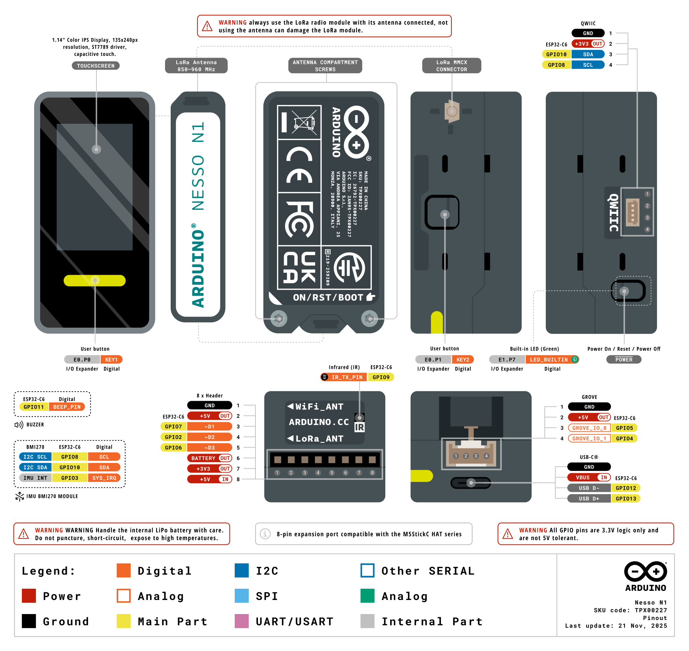

The full pinout is available and downloadable as a PDF from the link below:

- [Nesso N1 pinout](../../downloads/TPX00227-full-pinout.pdf)

### Datasheet

The full datasheet is available as a downloadable PDF from the link below:

- [Nesso N1 datasheet](/resources/datasheets/TPX00227-datasheet.pdf)


## Installation

The Nesso N1 is programmed using the desktop Arduino IDE. To get started, you will need to install the appropriate board package.

### Arduino IDE

To use the board in the Arduino IDE, you must install the latest version of the **esp32 by Espressif Systems** package. Support for the Nesso N1 requires version **3.3.3** or newer.

1.  Open the Arduino IDE.
2.  Navigate to **Boards Manager** (**Tools > Board > Boards Manager...**).
3.  Search for **"esp32"** and find the package by **Espressif Systems**.
4.  Click the **Install** (or **Update**) button.
5.  Once installed, select **Arduino Nesso N1** from the **Tools > Board > esp32** menu.

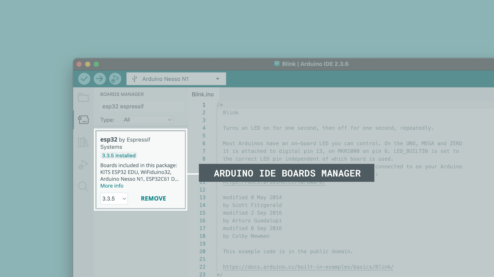

### Arduino Cloud Editor

Direct support for the Nesso N1 in the **Arduino Cloud Editor** (the online web IDE) is coming soon. Currently, the Cloud Editor does not support the specific ESP32 core version required for this board.

Please use the **Arduino IDE** (desktop version) to compile and upload code to the Nesso N1.

## Arduino IoT Cloud

Although the Nesso N1 cannot yet be programmed directly via the Cloud Editor, you can still use it with **Arduino IoT Cloud** dashboards and variables. This is done by configuring it as a "Manual Device" and uploading the sketch from your desktop IDE.

Follow these steps to connect your Nesso N1 to the Cloud.

### 1. Create a Manual Device

1.  Go to the [Arduino IoT Cloud Devices page](https://app.arduino.cc/devices).
2.  Click **+ DEVICE**.
3.  Select **Any Device** (under Manual Setup).
4.  Click **Continue**.
5.  Name your device (e.g., "MyNessoN1") and confirm.
6.  **Important:** A screen will appear with your **Device ID** and **Secret Key**. Save these credentials in a secure place immediately; you will not be able to view the Secret Key again.
7.  **Check the box** confirming you have saved your credentials and click **Continue**.

### 2. Create a Thing

1.  Go to the [Things page](https://app.arduino.cc/things).
2.  Click **+ THING** to create a new Thing.
3.  Click **Select Device** and associate it with the "Manual Device" you just created.
4.  Click **ADD** in Cloud Variables section to create a test variable: **Name**: `led`, **Type**: Boolean, **Permission**: Read & Write, **Update Policy**: On Change.
5.  Click **Add Variable** to confirm.

### 3. Create a Dashboard

1.  Go to the [Dashboards page](https://app.arduino.cc/dashboards).
2.  Click **+ DASHBOARD** and click **EDIT**.
3.  Click **ADD** and select the **Things** tab.
4.  Select your Thing and create a widget for the `led` variable (a Switch widget is recommended).
5.  Click **DONE**.

### 4. Program the Board via Desktop IDE

Because "Manual Devices" do not automatically generate a downloadable sketch, you must create one manually.

1.  Open the **Arduino IDE** on your computer.
2.  Install the **ArduinoIoTCloud** library via the Library Manager (**Tools > Manage Libraries...**).
3.  Create a new sketch (**File > New Sketch**).
4.  To keep your credentials secure, create a new tab named `arduino_secrets.h` (click the 3-dot icon near the tab bar > **New Tab**).
5.  Paste the following code into `arduino_secrets.h` and fill in your details:

    ```cpp
    #define SECRET_WIFI_SSID "YOUR_WIFI_SSID"
    #define SECRET_WIFI_PASS "YOUR_WIFI_PASSWORD"
    #define SECRET_DEVICE_ID "YOUR_DEVICE_ID" // From Step 1
    #define SECRET_DEVICE_KEY "YOUR_SECRET_KEY" // From Step 1
    ```

6.  Create another new tab named `thingProperties.h` and paste the following configuration code:

    ```cpp
    #include <ArduinoIoTCloud.h>
    #include <Arduino_ConnectionHandler.h>
    #include "arduino_secrets.h"

    void onLedChange();

    bool led;

    WiFiConnectionHandler ArduinoIoTPreferredConnection(SECRET_WIFI_SSID, SECRET_WIFI_PASS);

    void initProperties(){
      ArduinoCloud.addProperty(led, Permission::ReadWrite).onUpdate(onLedChange);
      
      ArduinoCloud.setBoardId(SECRET_DEVICE_ID);
      ArduinoCloud.setSecretDeviceKey(SECRET_DEVICE_KEY);
    }
    ```

7.  Finally, paste the main application code into your `.ino` file:

    ```cpp
    #include "thingProperties.h"

    void setup() {
      Serial.begin(115200);
      delay(1500); // Wait for Serial Monitor

      // Initialize the Nesso N1 built-in LED
      pinMode(LED_BUILTIN, OUTPUT);
      
      // Initialize Cloud properties and connection
      initProperties();
      ArduinoCloud.begin(ArduinoIoTPreferredConnection);
      
      // Set debug level to see connection status in Serial Monitor
      setDebugMessageLevel(2);
      ArduinoCloud.printDebugInfo();
    }

    void loop() {
      ArduinoCloud.update();
    }

    // This function is called whenever the 'led' variable changes in the Cloud
    void onLedChange() {
      // The Nesso N1 LED uses inverted logic (LOW is ON)
      if (led) {
        digitalWrite(LED_BUILTIN, LOW);
      } else {
        digitalWrite(LED_BUILTIN, HIGH);
      }
    }
    ```

8.  Select **Arduino Nesso N1** as your board and upload the sketch.
9.  Open the **Serial Monitor** to verify the connection. Once connected, you can toggle the switch on your Cloud Dashboard to control the LED on the board.

## First Use

### Unboxing the Product

When opening the Nesso N1 box, you will find the device and a hexagon key. The device comes pre-assembled in a sleek enclosure.

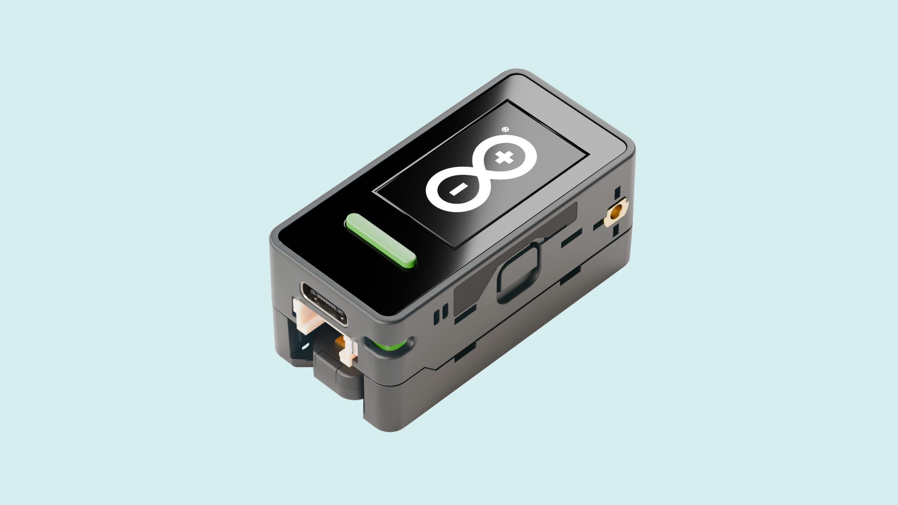

The detachable LoRa® antenna is conveniently stored in a compartment on the back of the device. You can slide it out to connect it to the MMCX connector for long-range communication.

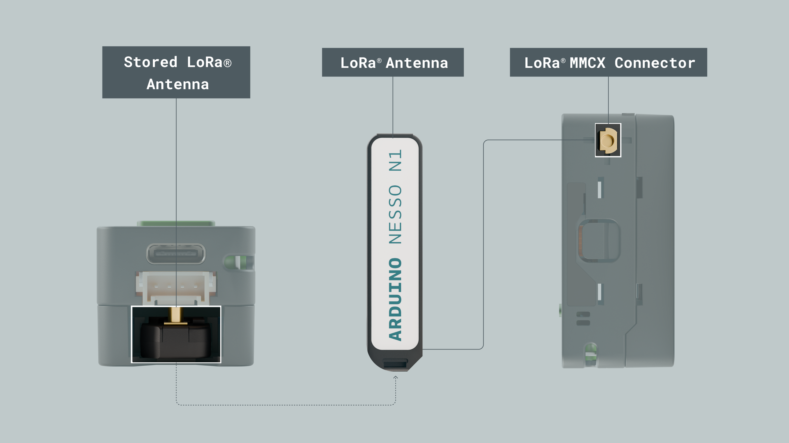

For projects where a slimmer profile is desired, the included hexagon key can be used to remove the antenna storage compartment, making the device thinner.

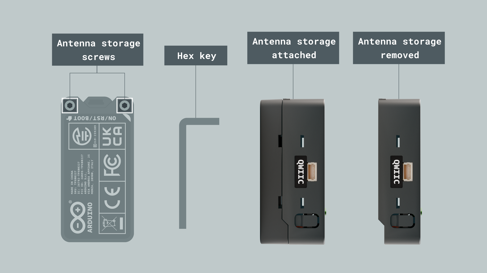

***The Nesso N1 does not include a USB-C® cable, which is required to connect the board to your computer. A compatible cable is [available separately here](https://store.arduino.cc/products/usb-cable2in1-type-c).***

## Power Supply

The Nesso N1 can be powered in three ways:

- **USB-C® Connector**: Provide a regulated 5 V DC supply through the USB-C® port. This method also charges the internal battery.
- **Built-in Battery**: The onboard 250 mAh LiPo battery allows the device to operate untethered. **(Note: Please see the Battery section below for critical safety information regarding battery usage with the current software version.)**
- **VIN Pin**: You can use the `VIN` pin on the 8-pin expansion header to power the board from an external 5 V DC source.

***WARNING: Handle the internal LiPo battery with care. Do not puncture, short-circuit, or expose it to high temperatures.***

## Battery Management

The board incorporates a power management system featuring the **AW32001** power path management chip and the **BQ27220** battery monitoring chip.

### ⚠️ CRITICAL WARNING: Battery Software Support Pending

Full support for the Nesso N1 battery management system (BMS) requires the **esp32** board package version **3.3.5** (or newer), which is currently pending release.

**Do not attempt to enable battery charging with the current board package (version 3.3.4 or older).**

Allowing the battery to fully deplete while using the current software may cause the device to become unresponsive and fail to power on, even when connected to USB.

**Recommendation:**
*   **Power the device exclusively via USB-C** until the software update is available.
*   **Do not** call `battery.enableCharge()` in your sketches.

Once the updated board package is released, this manual will be updated with instructions for safe battery management.

## Microcontroller (ESP32-C6)

At the core of the Nesso N1 is the **ESP32-C6**, a highly integrated SoC from Espressif.

### Key Features

- **CPU**: Single-core 32-bit RISC-V, up to 160 MHz.
- **Memory (on-chip)**: 512 kB SRAM.
- **Memory (external)**: 16 MB Flash.

The ESP32-C6 features a comprehensive set of connectivity options:

- 2.4 GHz Wi-Fi® 6 (802.11ax).
- Bluetooth® 5.3 Low Energy.
- 802.15.4 radio for Thread and Zigbee® protocols.
- Support for the Matter protocol.

***WARNING: All GPIO pins are 3.3 V logic only and are not 5 V tolerant.***

## Pins

The Nesso N1 exposes a variety of pins for interacting with internal and external hardware. Some pins are connected directly to the ESP32-C6, while others are managed by two PI4IOE5V6408 I/O expanders to provide additional functionality.

### Direct ESP32-C6 Pins

These pins are directly controlled by the main microcontroller.

| Pin Name     | GPIO | Function                                   |
| :----------- | :--- | :----------------------------------------- |
| `SDA`        | 10   | I2C Data                                   |
| `SCL`        | 8    | I2C Clock                                  |
| `MOSI`       | 21   | SPI Master Out Slave In                    |
| `MISO`       | 22   | SPI Master In Slave Out                    |
| `SCK`        | 20   | SPI Serial Clock                           |
| `IR_TX_PIN`  | 9    | Infrared Transmitter Output                |
| `BEEP_PIN`   | 11   | Buzzer Output                              |
| `GROVE_IO_0` | 5    | Grove Connector I/O                        |
| `GROVE_IO_1` | 4    | Grove Connector I/O                        |
| `LORA_IRQ`   | 15   | LoRa® Module Interrupt Request             |
| `LORA_CS`    | 23   | LoRa® Module Chip Select (SPI)             |
| `LORA_BUSY`  | 19   | LoRa® Module Busy Indicator                |
| `SYS_IRQ`    | 3    | System Interrupt (from IMU & I/O expander) |
| `LCD_CS`     | 17   | LCD Chip Select (SPI)                      |
| `LCD_RS`     | 16   | LCD Register Select                        |
| `D1`         | 7    | 8-pin Header Digital I/O                   |
| `D2`         | 2    | 8-pin Header Digital I/O                   |
| `D3`         | 6    | 8-pin Header Digital I/O                   |

### I/O Expander Pins

The Nesso N1 uses two PI4IOE5V6408 I/O expanders (addresses `0x43` and `0x44`) to manage additional pins over the I2C bus. These pins are accessed in code using special `ExpanderPin` objects, which are pre-defined as part of the Nesso N1 board package. You do not need to include any extra libraries to use them.

| Pin Object            | Expander Port | Function                         |
| :-------------------- | :------------ | :------------------------------- |
| `KEY1`                | E0.P0         | Programmable Button 1            |
| `KEY2`                | E0.P1         | Programmable Button 2            |
| `LORA_LNA_ENABLE`     | E0.P5         | LoRa® Low-Noise Amplifier Enable |
| `LORA_ANTENNA_SWITCH` | E0.P6         | LoRa® RF Antenna Switch Control  |
| `LORA_ENABLE`         | E0.P7         | LoRa® Module Reset/Enable        |
| `POWEROFF`            | E1.P0         | System Power Off Control         |
| `LCD_RESET`           | E1.P1         | LCD Reset                        |
| `GROVE_POWER_EN`      | E1.P2         | Grove Connector Power Enable     |
| `VIN_DETECT`          | E1.P5         | External Power (VIN) Detection   |
| `LCD_BACKLIGHT`       | E1.P6         | LCD Backlight Control            |
| `LED_BUILTIN`         | E1.P7         | Onboard Status LED (Green)       |

***Because expander E1 already occupies I2C address `0x44`, any external device that also uses `0x44` cannot share the bus. The Modulino Thermo module uses address `0x44`, so it is not compatible with the Nesso N1 when connected through the Qwiic connector.***


The configuration of a digital pin is done in the `setup()` function with the `pinMode()` function:

```arduino
// Pin configured as an input
pinMode(D1, INPUT);

// Pin configured as an output
pinMode(D1, OUTPUT);

// Pin configured as an input with internal pull-up resistor enabled
pinMode(D1, INPUT_PULLUP);
```

The state of a digital pin configured as an input can be read using `digitalRead()`:

```arduino
// Read pin state and store it in a variable
int buttonState = digitalRead(KEY1);
```

The state of a digital pin configured as an output can be changed using `digitalWrite()`:

```arduino
// Set pin HIGH
digitalWrite(D1, HIGH);

// Set pin LOW
digitalWrite(D1, LOW);
```

### PWM Pins

The Nesso N1 has three PWM (Pulse Width Modulation) capable pins, accessible via the **8-pin expansion header**:

| Pin Name | GPIO | Function          |
| :------- | :--- | :---------------- |
| `D1`     | 7    | Digital I/O / PWM |
| `D2`     | 2    | Digital I/O / PWM |
| `D3`     | 6    | Digital I/O / PWM |

This functionality can be used with the built-in `analogWrite()` function. By default, the resolution is 8-bit (value 0-255), but it can be configured up to 16-bit using `analogWriteResolution()`.

```arduino
// Set PWM resolution to 10-bit (0-1023)
analogWriteResolution(10);

// Set pin D1 to a 50% duty cycle
analogWrite(D1, 512);
```

### Analog Pins (ADC)

The Nesso N1 provides access to two analog input pins through its onboard **Grove connector**. These pins, `GROVE_IO_0` (GPIO5) and `GROVE_IO_1` (GPIO4), are connected to the ESP32-C6's 12-bit Analog-to-Digital Converter (ADC).

***Please note that these analog inputs are not available on the standard pin headers and must be accessed using a Grove-compatible cable.***

The `analogRead()` function will return a value between 0 and 4095, corresponding to an input voltage range of 0 V to 3.3 V.

```arduino
// Read the analog value from the Grove connector pin
int sensorValue = analogRead(GROVE_IO_0);
```

## Communication

The Nesso N1 supports several wired communication protocols for interfacing with sensors, displays, and other devices.

### I2C

The Nesso N1 supports I2C communication, which allows data transmission between the board and other I2C-compatible devices. The pins used for the I2C communication protocol are the following:

| Microcontroller Pin | Arduino Pin Mapping |
| :------------------ | :------------------ |
| GPIO8               | `SCL`               |
| GPIO10              | `SDA`               |

To use I2C communication, include the `Wire` library at the top of your sketch. The `Wire` library provides functions for I2C communication:

```cpp
#include <Wire.h>
```

In the `setup()` function, initialize the I2C library. On the Nesso N1, all I2C communication, including the Qwiic connector, is handled by the primary `Wire` object.

```cpp
// Initialize the primary I2C bus
Wire.begin();
```

To scan for connected I2C devices and verify their addresses, you can use the following example sketch. This is a useful utility to ensure your hardware is connected and recognized correctly.

```cpp
#include <Wire.h>

void setup() {
  // Initialize the I2C bus
  Wire.begin();
  
  // Initialize Serial for printing the results
  Serial.begin(115200);
  while (!Serial); // Wait for Serial to be ready
  
  Serial.println("\nI2C Scanner");
  Serial.println("Scanning for I2C devices...");
}

void loop() {
  byte error, address;
  int nDevices;

  nDevices = 0;
  for (address = 1; address < 127; address++) {
    // The i2c_scanner uses the return value of
    // the Write.endTransmisstion to see if
    // a device did acknowledge to the address.
    Wire.beginTransmission(address);
    error = Wire.endTransmission();

    if (error == 0) {
      Serial.print("I2C device found at address 0x");
      if (address < 16) {
        Serial.print("0");
      }
      Serial.println(address, HEX);
      nDevices++;
    } else if (error == 4) {
      Serial.print("Unknown error at address 0x");
      if (address < 16) {
        Serial.print("0");
      }
      Serial.println(address, HEX);
    }
  }
  if (nDevices == 0) {
    Serial.println("No I2C devices found\n");
  } else {
    Serial.println("Scan complete.\n");
  }
  
  delay(5000); // Wait 5 seconds before scanning again
}
```


### SPI

The board features one Serial Peripheral Interface (SPI) bus, which is used internally to communicate with the LoRa® module and the color display.

- **MOSI**: GPIO21
- **MISO**: GPIO22
- **SCK**: GPIO20

While these pins are primarily used by onboard components, they can be shared with external SPI devices if you use a separate, available digital pin as a Chip Select (CS).

### UART

The Nesso N1 has two hardware UART (Serial) ports.

- **`Serial`**: This object corresponds to the primary UART, which is connected to the USB-C® port. It is used for programming the board and for communication with the Arduino IDE's Serial Monitor. It is not connected to any external pins.

- **`Serial1`**: This is a secondary hardware UART that can be mapped to any available GPIO pins. This allows you to establish serial communication with external devices like GPS modules or other microcontrollers using pins on the **8-pin expansion header** or the **Grove connector**.

To use `Serial1`, you must specify the RX and TX pins in the `Serial1.begin()` function. The following example shows how to set up a UART on pins `D1` (TX) and `D2` (RX).

```arduino
// D1 (GPIO7) will be TX1
// D2 (GPIO2) will be RX1

void setup() {
  // Initialize USB Serial for debugging
  Serial.begin(115200);

  // Initialize Serial1 on D1 and D2
  // Format: Serial1.begin(baudrate, config, rxPin, txPin);
  Serial1.begin(9600, SERIAL_8N1, D2, D1);
  
  Serial.println("UART communication example started.");
  Serial.println("Anything you type here will be sent from D1.");
}

void loop() {
  // If data is available from USB Serial, send it to Serial1 (D1)
  if (Serial.available()) {
    char c = Serial.read();
    Serial1.print(c);
  }

  // If data is available from Serial1 (D2), send it to USB Serial
  if (Serial1.available()) {
    char c = Serial1.read();
    Serial.print(c);
  }
}
```


## Buttons and LED

The Nesso N1 features several physical controls for user interaction.

### Power Button

The Nesso N1 has a multi-function button for power control:

- **Click (from off state)**: Power on.
- **Click (from on state)**: Reset the device.
- **Double-click (from on state)**: Power off.
- **Long press**: Enter Download/Bootloader mode (works both when the device is on or off).

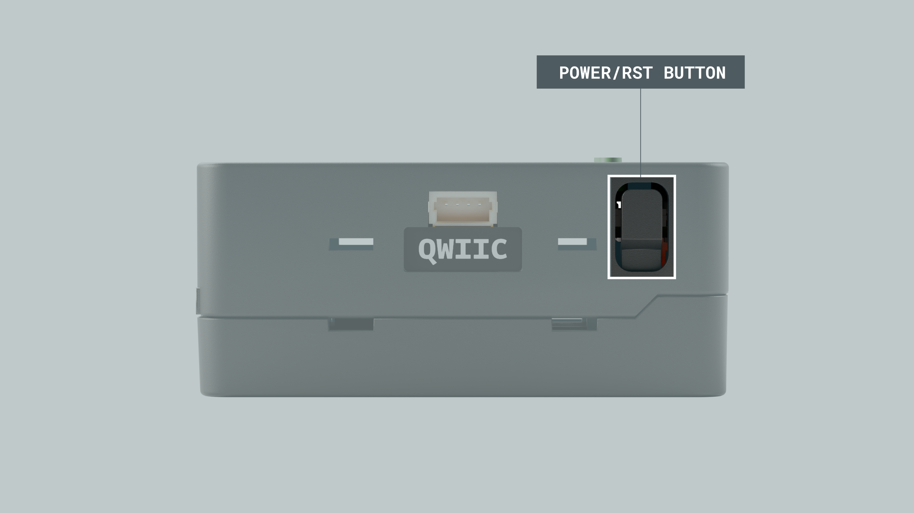


Additionally, the `POWEROFF` expander pin allows you to shut down the device programmatically.


### User Buttons

The board has two physical buttons, **KEY1** and **KEY2**, that are connected to the I/O expander.  These can be read using `digitalRead()`.

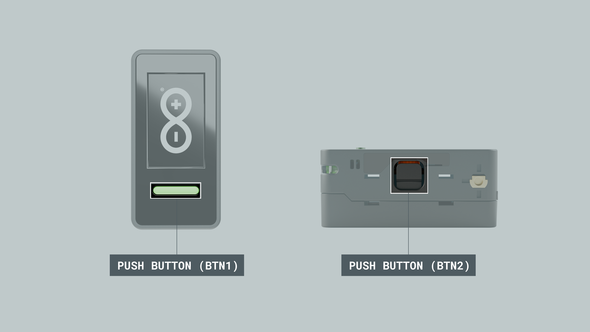

```arduino
void setup() {
  Serial.begin(115200);
  pinMode(KEY1, INPUT_PULLUP);
  pinMode(KEY2, INPUT_PULLUP);
}

void loop() {
  if (digitalRead(KEY1) == LOW) {
    Serial.println("Button 1 pressed!");
    delay(200); // Simple debounce
  }
  if (digitalRead(KEY2) == LOW) {
    Serial.println("Button 2 pressed!");
    delay(200); // Simple debounce
  }
}
```

### Built-in Programmable LED

The board has an onboard green LED that can be controlled using the `LED_BUILTIN` object. It is visible on the side of the board through the power button gaps.

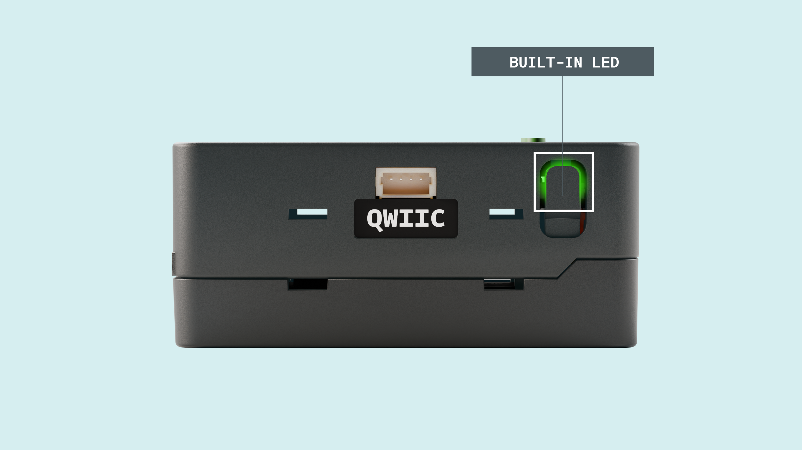

```arduino
void setup() {
  // Configure the built-in LED as an output
  pinMode(LED_BUILTIN, OUTPUT);
}

void loop() {
  // Blink the LED
  digitalWrite(LED_BUILTIN, LOW); // Turn LED ON
  delay(500);
  digitalWrite(LED_BUILTIN, HIGH); // Turn LED OFF
  delay(500);
}
```

***Please note that `LED_BUILTIN` uses inverted logic. Writing `LOW` to the pin turns the LED on, while writing `HIGH` turns it off.***


## Display & Touchscreen

The Nesso N1 features a 1.14-inch IPS color touchscreen with a resolution of 135 x 240 pixels, providing a vibrant and intuitive interface for your projects.

- **Display Controller**: ST7789, controlled via SPI.
- **Touch Controller**: FT6336U, controlled via I2C.

The display can be programmed using the [**M5GFX**](https://github.com/m5stack/M5GFX) library, which is a powerful graphics library that simplifies drawing text, shapes, and images. You can install it from the Arduino IDE Library Manager by searching for "M5GFX".

### Basic Text Display

The following example initializes the display and prints a simple text string.

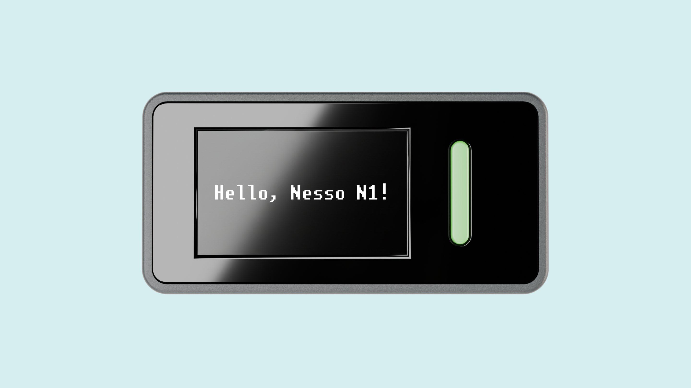

```arduino
#include <M5GFX.h>

M5GFX display; // Create a display instance

void setup() {
  display.begin();
  display.setRotation(1); // Set to landscape mode

  // Set text properties
  display.setTextDatum(MC_DATUM); // Middle-Center datum for text alignment
  display.setTextColor(TFT_WHITE, TFT_BLACK); // White text, black background
  display.setTextSize(2);

  // Clear the screen and draw the string
  display.fillScreen(TFT_BLACK);
  display.drawString("Hello, Nesso N1!", display.width() / 2, display.height() / 2);
}

void loop() {
  // Nothing to do in the loop
}
```

### Drawing Shapes and Colors

The M5GFX library includes functions for drawing basic geometric shapes. You can use predefined color constants (e.g., `TFT_RED`, `TFT_GREEN`, `TFT_BLUE`) or specify 16-bit RGB565 color values.

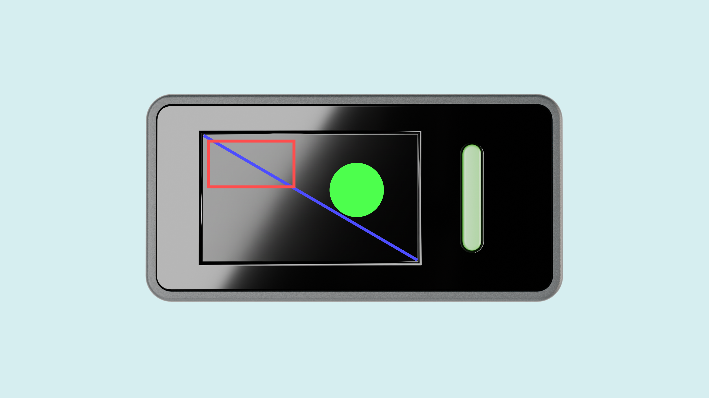

```arduino
#include <M5GFX.h>

M5GFX display;

void setup() {
  display.begin();
  display.setRotation(1);
  display.fillScreen(TFT_BLACK);

  // Draw a red rectangle outline
  display.drawRect(10, 10, 100, 50, TFT_RED);

  // Draw a filled green circle
  display.fillCircle(180, 60, 30, TFT_GREEN);

  // Draw a blue diagonal line
  display.drawLine(0, 0, display.width(), display.height(), TFT_BLUE);
}

void loop() {
}
```

### Handling Touch Input

This example demonstrates how to read touch coordinates. It displays an initial message in the center of the screen. When you touch the screen, a "cursor" (a small circle) will appear at the point of contact, and the X/Y coordinates will be displayed in a fixed position at the center of the screen, updating in real-time as you move your finger.


```arduino
#include <M5GFX.h>

M5GFX display;

void setup() {
  display.begin();
  display.setRotation(1); // Set to landscape mode
  display.fillScreen(TFT_BLACK);

  // Set text properties that will be used for all text in this sketch
  display.setTextDatum(MC_DATUM); // Middle-Center datum for text alignment
  display.setTextColor(TFT_WHITE);
  display.setTextSize(2);

  // Display the initial message centered on the screen
  display.drawString("Touch the screen", display.width() / 2, display.height() / 2);
}

void loop() {
  // Create a structure to hold touch data
  lgfx::touch_point_t tp;

  // Check if the screen is being touched
  if (display.getTouch(&tp)) {
    // Clear the screen to update both the circle and the text
    display.fillScreen(TFT_BLACK);
    
    // Draw a white circle at the current touch coordinates
    display.fillCircle(tp.x, tp.y, 5, TFT_WHITE);

    // Create a string with the updated coordinates
    String coords = "X:" + String(tp.x) + " Y:" + String(tp.y);

    // Draw the coordinates string at the FIXED center of the screen
    display.drawString(coords, display.width() / 2, display.height() / 2);
  }
  
  delay(20); // Small delay for responsiveness
}
```


#### Finding More Examples

The M5GFX library is incredibly versatile and supports advanced features like displaying images (JPG/PNG), using custom fonts, and creating complex animations with sprites. The best way to learn these techniques is by exploring the official examples provided with the library.

You can find a comprehensive collection of examples covering all major features in the [**M5GFX GitHub repository**](https://github.com/m5stack/M5GFX/tree/master/examples/Basic). These examples can be opened directly in the Arduino IDE after you have installed the library.


## Connectivity

The Nesso N1 is a versatile IoT device, equipped with a comprehensive suite of wireless protocols to suit a wide range of applications, from local device communication to long-range data transmission.

### Wi-Fi®

The ESP32-C6 features **Wi-Fi® 6 (802.11ax)**, offering higher efficiency, lower latency, and improved performance in dense wireless environments compared to older standards. This makes it ideal for applications requiring a reliable and fast connection to a local network or the internet.

#### Wi-Fi® Connection Example

This example demonstrates the most basic Wi-Fi® functionality: connecting to a network. It initializes the Wi-Fi® module, attempts to connect to a specified network, and prints the assigned IP address to the Serial Monitor once connected.

```arduino
#include <WiFi.h>

// Replace with your network credentials
const char* ssid = "YOUR_SSID";
const char* password = "YOUR_PASSWORD";

void setup() {
  Serial.begin(115200);
  delay(1000); // Give serial a moment to initialize

  Serial.println("Connecting to Wi-Fi...");
  
  // Start Wi-Fi connection
  WiFi.begin(ssid, password);

  // Wait until the connection is established
  while (WiFi.status() != WL_CONNECTED) {
    delay(500);
    Serial.print(".");
  }

  Serial.println("\nConnected!");
  Serial.print("IP address: ");
  Serial.println(WiFi.localIP());
}

void loop() {
  // Nothing to do in the loop for this basic example
  delay(1000);
}
```

### Bluetooth® Low Energy

The Nesso N1 supports **Bluetooth® 5.3 Low Energy (LE)**, enabling efficient, short-range communication with smartphones, sensors, and other BLE-enabled devices.

***WARNING: The ESP32 board package includes its own library for Bluetooth® that conflicts with the standard `ArduinoBLE` library. If you have the `ArduinoBLE` library installed in your IDE, you may encounter compilation errors. To resolve this, you must uninstall the `ArduinoBLE` library from the Library Manager before compiling sketches for the Nesso N1.***

#### Simple BLE Server Example

This basic example turns your Nesso N1 into a simple Bluetooth® peripheral. It creates a BLE server that advertises a specific name ("Nesso N1 BLE Server"). You can use a free BLE scanner app on your phone to verify that your Nesso N1 appears in the list of nearby devices.

```arduino
#include <BLEDevice.h>
#include <BLEServer.h>
#include <BLEUtils.h>

// See https://www.uuidgenerator.net/ to create your own unique UUIDs
#define SERVICE_UUID "4fafc201-1fb5-459e-8fcc-c5c9c331914b"

void setup() {
  Serial.begin(115200);
  Serial.println("Starting BLE Server...");

  // 1. Initialize the BLE device and set its name
  BLEDevice::init("Nesso N1 BLE Server");

  // 2. Create the BLE Server
  BLEServer *pServer = BLEDevice::createServer();

  // 3. Create a BLE Service using the UUID
  BLEService *pService = pServer->createService(SERVICE_UUID);

  // 4. Start the service. A service must be started before it can be advertised.
  pService->start();

  // 5. Get the advertising object and add the service UUID to the advertisement
  BLEAdvertising *pAdvertising = BLEDevice::getAdvertising();
  pAdvertising->addServiceUUID(SERVICE_UUID);
  
  // 6. Start advertising
  BLEDevice::startAdvertising();
  
  Serial.println("Device is now advertising. Check for 'Nesso N1 BLE Server' on your phone.");
}

void loop() {
  // The main work is done in the setup; the loop can be empty for this example.
  delay(2000);
}
```

### Thread

**Thread** is a low-power, secure, and self-healing mesh networking protocol based on IPv6. Two Nesso N1 boards can form a minimal Thread network on their own, without needing an external border router. One device will automatically become the "Router" for the network, and the other will join as a "Child".

This test is performed by interacting directly with the OpenThread Command Line Interface (CLI) via the Serial Monitor.

#### Thread CLI Sketch (Upload to Both Boards)

This sketch simply starts the OpenThread stack and opens a console on the Serial Monitor, giving you direct access to the CLI. Upload this exact same sketch to **both** of your Nesso N1 boards.

```arduino
#include "OThreadCLI.h"
void setup() {
  Serial.begin(115200);
  // Initialize the OpenThread stack but do not autostart the network interface.
  // This gives us manual control via the CLI.
  OThreadCLI.begin(false);
  Serial.println("OpenThread CLI started. Type 'help' for a list of commands.");
  // Start the console to pass Serial input directly to the CLI
  OThreadCLI.startConsole(Serial);
}
void loop() {
  // The console handles all the work. The loop can be empty.
}
```

#### How to Test Manually via CLI

You will need two separate Serial Monitor windows, one for each Nesso N1.

1.  **Prepare:** Upload the sketch above to both boards. Connect both boards to your computer and open a Serial Monitor for each one.

2.  **Form a Network (Board 1):** In the Serial Monitor for your first board, create a new Thread network.

    ```
    dataset init new
    ```

    The board should respond with `Done`. Then, commit the new network settings:

    ```
    dataset commit active
    ```
    
    It will respond with `Done`.

3.  **Get the Network Key (Board 1):** Get the key for the network you just created.

    ```
    networkkey
    ```

    It will print a 32-character hexadecimal string. **Copy this key.**

4.  **Start the Network (Board 1):** Enable the radio and start the Thread protocol.

    ```
    ifconfig up
    thread start
    ```

    After a few seconds, this board will become the network leader. You can verify this by typing `state`, which should return `leader`.

5.  **Join the Network (Board 2):** In the Serial Monitor for your second board, use the key you copied from Board 1.

    ```
    dataset networkkey <paste-the-32-char-key-here>
    ```

    Replace `<paste-the-32-char-key-here>` with the key. It should respond with `Done`. Then, commit the settings:

    ```
    dataset commit active
    ```

6.  **Start the Network (Board 2):** Enable the radio and start the Thread protocol.

    ```
    ifconfig up
    thread start
    ```

    After a few seconds, this board will join the network. You can verify this by typing `state`, which should return `child`.

7.  **Set up the Server (Board 1):** In the Serial Monitor for your first board, set up a UDP listener on port `1234`.

    ```
    udp open
    udp bind :: 1234
    ```

    Both commands should respond with `Done`. This board is now listening for messages.

8.  **Send a Message (Board 2):** In the Serial Monitor for your second board, you must also open a UDP socket before you can send.

    ```
    udp open
    ```

    Once it responds with `Done`, send a UDP message to all devices on the Thread network.

    ```
    udp send ff03::1 1234 Hello!
    ```

    `ff03::1` is a multicast address that means "all Thread devices here.".

9.  **Verify Communication:**

    The Serial Monitor for **Board 2** (the client) should respond with `Done`.

    The Serial Monitor for **Board 1** (the server) should print a message showing it received the packet, for example: `8 bytes from fdde:ad00:beef:0:35e3:3c2f:273f:9442 Hello!`.

You have now successfully sent and received a message over a peer-to-peer Thread network.

### Zigbee®

The Nesso N1's 802.15.4 radio allows it to act as a **Zigbee® End Device**, enabling it to join existing Zigbee® mesh networks. This is ideal for creating low-power devices like sensors or light controllers that integrate with popular smart home hubs.

To compile this example, you must configure the following settings in the Arduino IDE:
- Navigate to **Tools > Zigbee Mode** and select **End device**.
- Navigate to **Tools > Partition Scheme** and select **Zigbee SPIFF 4MB**.

#### Zigbee® Light Bulb Example

This example configures the Nesso N1 to act as a simple Zigbee® On/Off light bulb. It cannot be tested with a second Nesso N1 running the same code. Instead, it is designed to be added to an existing Zigbee® network controlled by a central hub.

```arduino
#ifndef ZIGBEE_MODE_ED
#error "Zigbee end device mode is not selected in Tools->Zigbee mode"
#endif

#include "Zigbee.h"

// Define the Zigbee endpoint for the light
#define ZIGBEE_LIGHT_ENDPOINT 10

// Create a ZigbeeLight object
ZigbeeLight zbLight = ZigbeeLight(ZIGBEE_LIGHT_ENDPOINT);

// Callback function to control the LED
void setLED(bool value) {
  // The built-in LED is active-low, so we invert the logic
  digitalWrite(LED_BUILTIN, !value);
}

void setup() {
  Serial.begin(115200);

  // Initialize the built-in LED
  pinMode(LED_BUILTIN, OUTPUT);
  digitalWrite(LED_BUILTIN, HIGH); // Start with LED OFF

  // Set a manufacturer and model name for the Zigbee device
  zbLight.setManufacturerAndModel("Arduino", "Nesso-Light");

  // Set the callback function that gets called when a command is received
  zbLight.onLightChange(setLED);

  // Add the light endpoint to the Zigbee core
  Zigbee.addEndpoint(&zbLight);

  // Start the Zigbee stack
  if (!Zigbee.begin()) {
    Serial.println("Zigbee failed to start! Rebooting...");
    ESP.restart();
  }
  
  Serial.println("Zigbee started. Waiting to connect to a network...");
}

void loop() {
  // The Zigbee stack runs in the background.
  // The main loop can be used for other tasks or left empty.
  delay(1000);
}
```

#### How to Test

1.  Upload the sketch to your Nesso N1.
2.  You will need a **Zigbee® Hub/Coordinator**. Many popular smart home devices have this functionality built-in, such as the Amazon Echo (4th Gen, Plus, Studio, Show 10), Philips Hue Bridge, or Samsung SmartThings Hub.
3.  Open the companion app for your hub (e.g., Amazon Alexa app, Philips Hue app).
4.  Put your hub into pairing or "discover devices" mode.
5.  The hub should discover a new light bulb named "Arduino Nesso-Light".
6.  Once paired, you can add the device to a room and control the Nesso N1's built-in LED by toggling the light on and off in the app.

### Matter

**Matter** is a smart home connectivity standard that aims to unify the ecosystem, allowing devices from different brands to work together seamlessly. The Nesso N1 supports Matter communication over both **Wi-Fi®** and **Thread**.

The choice of transport is determined by **compile-time definitions** you add at the top of your sketch.

#### Matter On/Off Light Example

This example turns your Nesso N1 into a simple On/Off light bulb. The same code works for both Matter over Wi-Fi® and Matter over Thread. After commissioning, you can control the Nesso N1's built-in LED from your smart home app.

```arduino
#include <Matter.h>
// Include WiFi.h only if you plan to use Matter over Wi-Fi
#include <WiFi.h>

// --- Transport Layer Configuration ---
// To use Matter over Thread, include the three defines below.
// To use Matter over Wi-Fi, comment out or remove these three defines.
#define CONFIG_ENABLE_CHIPOBLE 1        // Enables BLE for commissioning
#define CHIP_DEVICE_CONFIG_ENABLE_THREAD 1 // Enables the Thread stack
#define CHIP_DEVICE_CONFIG_ENABLE_WIFI 0   // CRITICAL: Disables the Wi-Fi stack
// -------------------------------------

// --- For Matter over Wi-Fi only ---
const char* ssid = "YOUR_SSID";
const char* password = "YOUR_PASSWORD";
// ------------------------------------

// Create an On/Off Light Endpoint
MatterOnOffLight OnOffLight;

// This callback function is executed when a Matter controller sends a command
bool setLightOnOff(bool state) {
  Serial.printf("Received Matter command: Light %s\r\n", state ? "ON" : "OFF");
  
  // Control the built-in LED (inverted logic: LOW is ON)
  digitalWrite(LED_BUILTIN, state ? LOW : HIGH);
  
  return true; // Return true to confirm the command was successful
}

void setup() {
  pinMode(LED_BUILTIN, OUTPUT);
  digitalWrite(LED_BUILTIN, HIGH); // Start with the LED off
  Serial.begin(115200);
  delay(1000);

  // --- For Matter over Wi-Fi only ---
  if (!CHIP_DEVICE_CONFIG_ENABLE_THREAD) {
    Serial.printf("Connecting to %s ", ssid);
    WiFi.begin(ssid, password);
    while (WiFi.status() != WL_CONNECTED) {
      delay(500);
      Serial.print(".");
    }
    Serial.println(" Connected");
  }
  // ------------------------------------

  // Initialize the OnOffLight endpoint with an initial state of OFF
  OnOffLight.begin(false);
  // Attach the callback function to handle state changes
  OnOffLight.onChange(setLightOnOff);

  // Start the Matter service.
  Matter.begin();
  
  // If the device was already commissioned, sync its LED state on boot
  if (Matter.isDeviceCommissioned()) {
    Serial.println("Matter Node is already commissioned. Ready for use.");
    setLightOnOff(OnOffLight.getOnOff());
  }
}

void loop() {
  // This block periodically prints the pairing information until the device is commissioned
  if (!Matter.isDeviceCommissioned()) {
    static unsigned long lastPrintTime = 0;
    if (millis() - lastPrintTime > 5000) {
      Serial.println("\n----------------------------------------------------");
      Serial.println("Matter Node not commissioned. Waiting for pairing...");
      Serial.printf("Manual pairing code: %s\r\n", Matter.getManualPairingCode().c_str());
      Serial.println("----------------------------------------------------");
      lastPrintTime = millis();
    }
  }
  
  // A small delay is needed to allow background tasks to run
  delay(100);
}
```

#### How to Configure and Test Your Matter Device

The same sketch can be used for both Matter over Wi-Fi® and Matter over Thread. The behavior is controlled by **compile-time flags** at the top of the code.

**1. To Run as Matter over Wi-Fi®:**
*   **Action:** In the sketch, **comment out or delete** the three `#define` flags related to Thread. Fill in your Wi-Fi® credentials in the `ssid` and `password` variables.
*   **Requirements:** Your Nesso N1 and Matter Controller (e.g., smartphone) must be on the same Wi-Fi® network.

**2. To Run as Matter over Thread:**
*   **Action:** In the sketch, ensure the three `#define` flags for Thread are **active and not commented out**.
*   **Requirements:** You must have a **Thread Border Router** (e.g., a compatible Google Nest Hub or Apple HomePod) active on your network.

**3. Commissioning the Device:**
After uploading the correctly configured sketch:
1.  Open the Serial Monitor. A manual pairing code will be printed every few seconds.
2.  Open your Matter Controller app (e.g., Google Home, Apple Home) and choose to add a new device.
3.  When prompted, enter the manual pairing code from the Serial Monitor to complete the setup.

**4. Control the Device:** Once commissioned, a new light bulb device will appear in your app or be controllable via the command line tool. You can now toggle it on and off to control the Nesso N1's built-in LED.

### LoRa®

The onboard **SX1262** module provides long-range, low-power communication capabilities, operating in the 850–960 MHz frequency range. It comes with a detachable external antenna that connects via an MMCX connector.

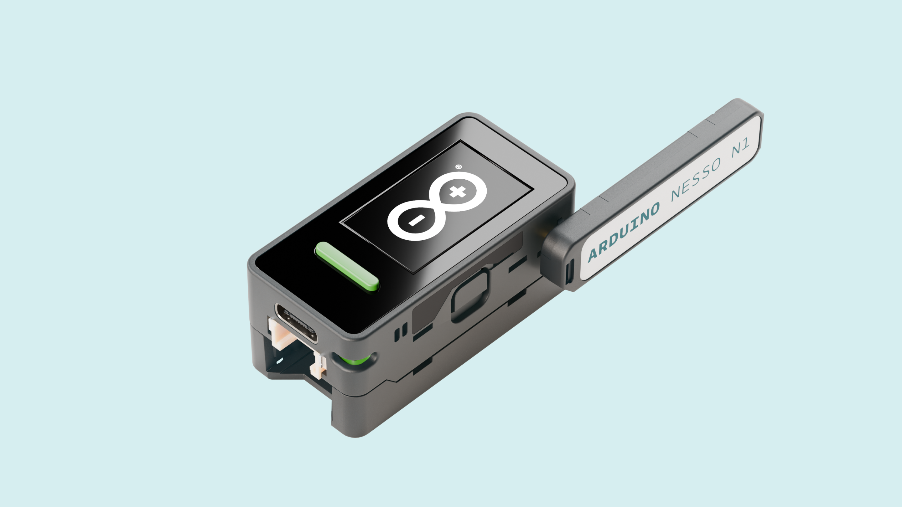

***WARNING: To avoid damage to your board, always use the LoRa® module with the antenna attached.***

The LoRa® module is controlled via SPI and several dedicated pins on both the ESP32-C6 and the I/O expander.

| Pin Name              | GPIO | Expander Port | Function                         |
| :-------------------- | :--- | :------------ | :------------------------------- |
| `MOSI`                | 21   |               | SPI Master Out Slave In          |
| `MISO`                | 22   |               | SPI Master In Slave Out          |
| `SCK`                 | 20   |               | SPI Serial Clock                 |
| `LORA_IRQ`            | 15   |               | LoRa® Module Interrupt Request   |
| `LORA_CS`             | 23   |               | LoRa® Module Chip Select (SPI)   |
| `LORA_BUSY`           | 19   |               | LoRa® Module Busy Indicator      |
| `LORA_LNA_ENABLE`     |      | E0.P5         | LoRa® Low-Noise Amplifier Enable |
| `LORA_ANTENNA_SWITCH` |      | E0.P6         | LoRa® RF Antenna Switch Control  |
| `LORA_ENABLE`         |      | E0.P7         | LoRa® Module Reset/Enable        |

#### LoRa® Peer-to-Peer (P2P) Examples

The following examples demonstrate basic LoRa® peer-to-peer (P2P) communication using the [RadioLib](https://github.com/jgromes/RadioLib) library. This is the foundational step for testing your hardware and building more complex network applications.

**LoRa® Transmitter Example**

This example configures the Nesso N1 to send a "Hello World!" packet every five seconds. 

***WARNING: You must configure the LoRa® frequency (`LORA_FREQUENCY`) variable to match your geographical region. to a value that is legal for your geographical region. Transmitting on an unauthorized frequency can result in fines. Common frequencies are 915.0 MHz for North America/Australia, 868.0 MHz for Europe, and 433.0 MHz for Asia.***

```arduino
#include <RadioLib.h>

// LoRa® frequency regions
// Europe: 868.0
// North America: 915.0
// Australia: 915.0
// Asia: 433.0

const float LORA_FREQUENCY = ; // Set the LoRa® frequency based on your region

// Initialize the radio module, passing RADIOLIB_NC for the reset pin.
// The reset will be handled manually.
SX1262 radio = new Module(LORA_CS, LORA_IRQ, RADIOLIB_NC, LORA_BUSY);

// Counter for transmitted packets
int packetCounter = 0;

void setup() {
  Serial.begin(115200);

  // Manually reset the LoRa module using the expander pin for reliability.
  pinMode(LORA_ENABLE, OUTPUT);
  digitalWrite(LORA_ENABLE, LOW);
  delay(10);
  digitalWrite(LORA_ENABLE, HIGH);
  delay(10);

  // Initialize the LoRa® module
  Serial.print(F("[SX1262] Initializing... "));
  int state = radio.begin(LORA_FREQUENCY);
  if (state != RADIOLIB_ERR_NONE) {
    Serial.print(F("failed, code "));
    Serial.println(state);
    while (true);
  }
  Serial.println(F("success!"));
}

void loop() {
  Serial.print(F("[SX1262] Transmitting packet... "));

  // Create a packet with a counter
  String packet = "Hello from Nesso N1! #" + String(packetCounter++);
  int state = radio.transmit(packet);

  if (state == RADIOLIB_ERR_NONE) {
    Serial.println(F("success!"));
  } else {
    Serial.print(F("failed, code "));
    Serial.println(state);
  }
  
  delay(5000); // Wait 5 seconds between transmissions
}
```

**LoRa® Receiver Example**

This example configures a second Nesso N1 to listen for LoRa® packets and print them to the Serial Monitor. It uses a simple polling method where the main loop waits until a packet is received.

```arduino
#include <RadioLib.h>

// LoRa® frequency regions
// Europe: 868.0
// North America: 915.0
// Australia: 915.0
// Asia: 433.0

const float LORA_FREQUENCY = ; // Set the LoRa® frequency based on your region

// Initialize the radio module, passing RADIOLIB_NC for the reset pin.
SX1262 radio = new Module(LORA_CS, LORA_IRQ, RADIOLIB_NC, LORA_BUSY);

void setup() {
  Serial.begin(115200);

  // Manually reset the LoRa module.
  pinMode(LORA_ENABLE, OUTPUT);
  digitalWrite(LORA_ENABLE, LOW);
  delay(10);
  digitalWrite(LORA_ENABLE, HIGH);
  delay(10);

  // Initialize the LoRa® module.
  Serial.print(F("[SX1262] Initializing... "));
  int state = radio.begin(LORA_FREQUENCY);
  if (state != RADIOLIB_ERR_NONE) {
    Serial.print(F("failed, code "));
    Serial.println(state);
    while (true);
  }

  // Start listening for LoRa packets.
  Serial.print(F("[SX1262] Starting to listen... "));
  state = radio.startReceive();
  if (state != RADIOLIB_ERR_NONE) {
    Serial.print(F("failed, code "));
    Serial.println(state);
    while (true);
  }
  Serial.println(F("success!"));
}

void loop() {
  // Create a string to store the received message.
  String str;
  
  // Try to receive a packet.
  int state = radio.receive(str);

  if (state == RADIOLIB_ERR_NONE) {
    // Packet was received successfully.
    Serial.print(F("\n[SX1262] Received packet: "));
    Serial.println(str);

    // Print packet statistics.
    Serial.print(F("[SX1262] RSSI: "));
    Serial.print(radio.getRSSI());
    Serial.print(F(" dBm, SNR: "));
    Serial.print(radio.getSNR());
    Serial.println(F(" dB"));

  } else if (state == RADIOLIB_ERR_CRC_MISMATCH) {
    Serial.println(F("[SX1262] CRC error!"));
  } else if (state != RADIOLIB_ERR_RX_TIMEOUT) {
    // Some other error occurred. Timeout is expected and ignored.
    Serial.print(F("[SX1262] Failed, code "));
    Serial.println(state);
  }
}
```

***Please note: because the `LORA_ENABLE` pin is on an I/O expander, it cannot be passed directly to the RadioLib library constructor. The library must be initialized with the reset pin set to `RADIOLIB_NC` and it is best practice to perform a manual reset in setup.***

#### Configuring for Public LoRa® Networks

The onboard SX1262 module can be configured to communicate on public LoRa® networks such as [**The Things Network (TTN)**](https://www.thethingsnetwork.org/) or [**Helium**](https://helium.com/). These networks operate on specific frequencies and use defined radio parameters based on regional plans (e.g., `EU868`, `US915`, `AU915`). To ensure your device can be heard by gateways in your area, you must first configure your LoRa® radio to match your region's frequency.

## Onboard Sensors & Peripherals

### 6-Axis IMU

The **BMI270** is a high-performance 6-axis Inertial Measurement Unit (IMU) that combines a 3-axis accelerometer and a 3-axis gyroscope. It connects to the ESP32-C6 via the I2C bus (`SCL` on GPIO8, `SDA` on GPIO10) and provides an interrupt signal on `SYS_IRQ` (GPIO3). It is ideal for motion tracking, gesture recognition, and orientation sensing.

Here is a minimal example using the [Arduino_BMI270_BMM150](https://github.com/arduino-libraries/arduino_bmi270_bmm150)  library:

```arduino
#include <Arduino_BMI270_BMM150.h>

void setup() {
  Serial.begin(115200);
  while (!Serial); // Wait for serial port to connect

  Serial.println("Initializing IMU...");
  if (!IMU.begin()) {
    Serial.println("Failed to initialize IMU!");
    while (1);
  }

  Serial.print("Accel Rate: ");
  Serial.print(IMU.accelerationSampleRate());
  Serial.println(" Hz");

  Serial.print("Gyro Rate: ");
  Serial.print(IMU.gyroscopeSampleRate());
  Serial.println(" Hz");

  Serial.println("X\tY\tZ\t\t| X\tY\tZ");
  Serial.println("Accel (g)\t\t| Gyro (°/s)");
}

void loop() {
  float ax, ay, az;
  float gx, gy, gz;

  if (IMU.accelerationAvailable() && IMU.gyroscopeAvailable()) {
    IMU.readAcceleration(ax, ay, az);
    IMU.readGyroscope(gx, gy, gz);

    Serial.print("aX:");
    Serial.print(ax, 2);
    Serial.print(" aY:");
    Serial.print(ay, 2);
    Serial.print(" aZ:");
    Serial.print(az, 2);
    Serial.print("\t gX:");
    Serial.print(gx, 2);
    Serial.print(" gY:");
    Serial.print(gy, 2);
    Serial.print(" gZ:");
    Serial.println(gz, 2);
  }

  delay(100);
}
```

#### Visualizing the Output

After uploading the sketch, open the **Serial Plotter** (**Tools > Serial Plotter**) in the Arduino IDE. As you move the Nesso N1, you will see the sensor data graphed in real-time.

By using the checkboxes in the Serial Plotter window, you can isolate different data streams. The animation below shows the accelerometer data (`aX`, `aY`, `aZ`) as the device is tilted.

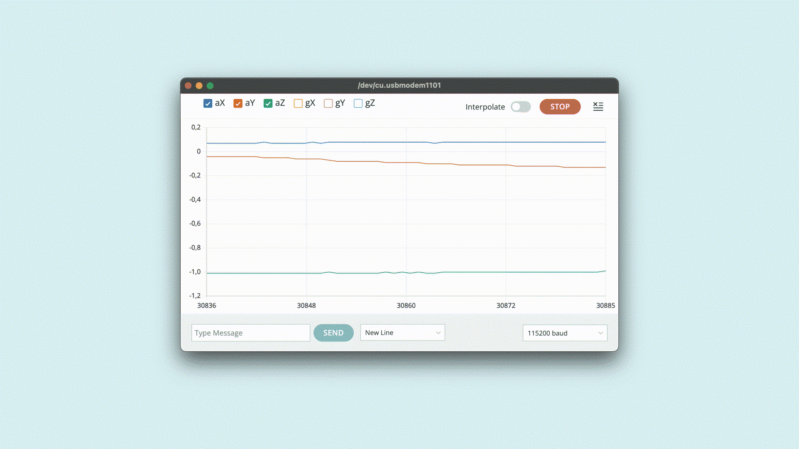

Similarly, you can deselect the accelerometer variables and view only the gyroscope data (`gX`, `gY`, `gZ`) to visualize the rate of rotation, as shown here.

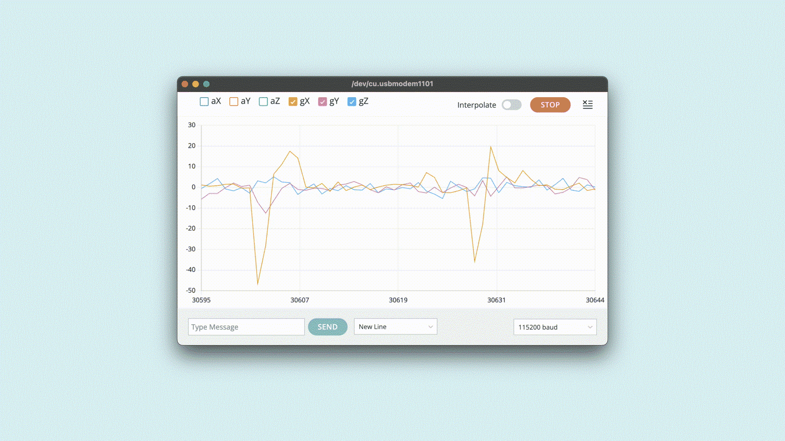


### Buzzer

A passive buzzer connected to `BEEP_PIN` (GPIO11) provides audible feedback. You can generate simple tones using the standard `tone()` function.

```arduino
void setup() {
  // No setup needed for tone()
}

void loop() {
  // Play a 1 kHz tone for 500 ms
  tone(BEEP_PIN, 1000, 500);
  delay(2000);
}
```

### Infrared (IR) Transmitter

An onboard IR LED connected to `IR_TX_PIN` (GPIO9) allows the Nesso N1 to function as a remote control for various electronic devices.

Here is an example using the [IRremote](https://github.com/Arduino-IRremote/Arduino-IRremote) library to send a NEC command:

```arduino
#include <IRremote.h>

void setup() {
  Serial.begin(115200);
  IrSender.begin(IR_TX_PIN);
}

void loop() {
  Serial.println("Sending IR signal...");
  // Send a NEC command: Address 0x01, Command 0x04
  IrSender.sendNEC(0x01, 0x04, 1);
  delay(2000);
}
```

***Please note: There is a known hardware timer conflict between the `tone()` function and the IRremote library. To use both features in the same sketch, you must fully reset the pin and re-initialize the IR sender before each transmission. First, set the pin mode to INPUT to release it from the timer, then call `IrSender.begin()` to reconfigure it for IR.***

## Expansion Ports

### Voltage Compatibility Considerations

Before connecting any external components to your Nesso N1, it is important to understand its voltage characteristics to prevent damage to your sensors and modules:

**The Nesso N1 operates at 3.3 VDC**, which means:

- All digital I/O pins use 3.3 VDC logic levels (HIGH = 3.3 VDC, LOW = 0 VDC).
- Analog inputs can safely accept 0 to 3.3 VDC.
- Communication pins (I2C, SPI, UART) operate at 3.3 VDC logic levels.

**For 5 VDC components**, you must add **external level shifters** for digital communication pins.

Always check your component's datasheet for voltage specifications before connecting. When in doubt, use a multimeter to verify voltage levels or add protective level shifting.

### Qwiic Connector

The Nesso N1 features an onboard Qwiic connector that provides a simple, tool-free solution for connecting I2C devices. The Qwiic ecosystem, developed by SparkFun, has become an industry standard for rapid prototyping, allowing you to connect sensors, displays, and other peripherals without soldering or complex wiring.

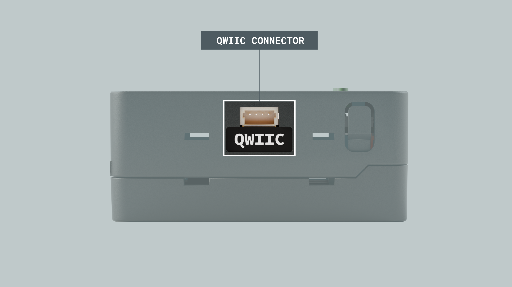

The Qwiic system’s key advantages include:

- **Plug-and-play connectivity**: No breadboards, jumper wires, or soldering required.
- **Polarized connectors**: Prevents accidental reverse connections.
- **Daisy-chain capability**: Connect multiple devices in series.
- **Standard pinout**: Compatible across all Qwiic ecosystem devices.

***The Qwiic connector on the Nesso N1 is connected to the primary I2C bus, which uses the standard `Wire` object. The connector provides a 3.3 V supply, making it ideal for modern sensors.***

***__Important:__ The Modulino Thermo module cannot be used with the Nesso N1 Qwiic connector because both the module and an internal I/O expander use I2C address `0x44`.***

The Qwiic connector allows you to interface with our Modulino family for solder-free project development, except for the Modulino Thermo module on the Qwiic port.

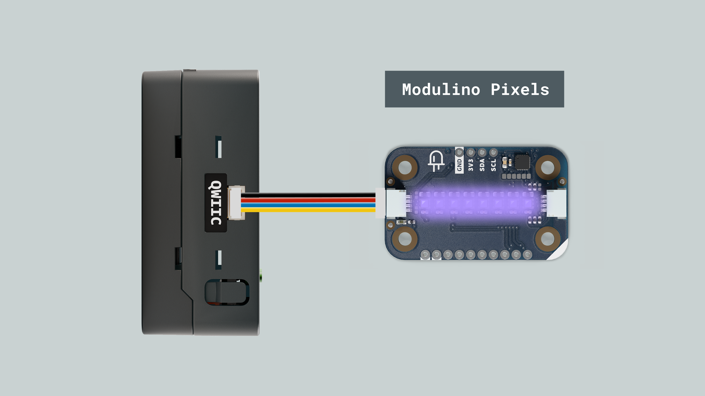

You can check our [Modulino family](https://store.arduino.cc/collections/modulino) where you will find a variety of **sensors** and **actuators** to expand your projects.


### Grove Connector

The Nesso N1 also includes one standard **Grove** connector. It provides a 5 V interface with two digital I/O pins (`GROVE_IO_0` on GPIO5, `GROVE_IO_1` on GPIO4), making it compatible with the extensive ecosystem of [Grove modules](https://search.arduino.cc/search?q=grove%20module&tab=store), including those from [M5Stack](https://shop.m5stack.com/pages/search-results-page?q=grove&page=1&rb_tags=ACTUATORS%7CSENSOR) and [Arduino Sensor Kit](https://store.arduino.cc/products/sensor-kit-base).

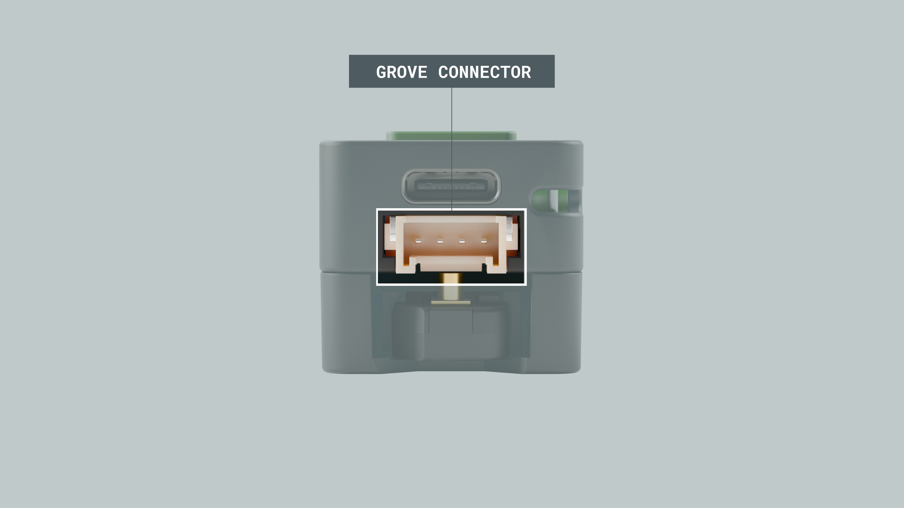

### 8-Pin Expansion Port

An 8 pin female header provides access to additional I/O and power pins. It is designed to be fully compatible with the **M5StickC HAT** series of expansion boards, so you can easily add modules for sensors, inputs, and extra connectivity. You can explore the range of compatible HATs on the [M5Stack store](https://shop.m5stack.com/collections/for-stick).

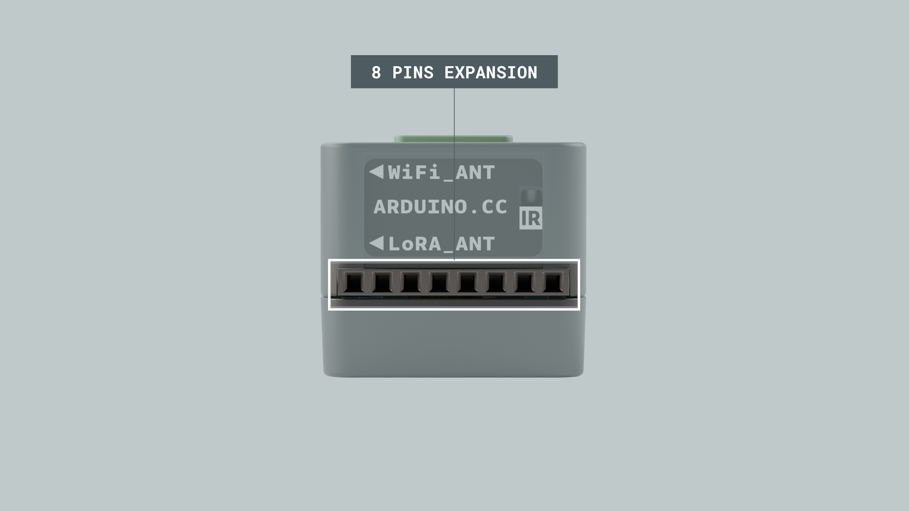

| #    | Pin Name      | GPIO | Function                      |
| :--- | :------------ | :--- | :---------------------------- |
| 1    | `GND`         | -    | Ground                        |
| 2    | `+5V OUT`     | -    | 5 V Output                    |
| 3    | `D1`          | 7    | Digital PWM I/O               |
| 4    | `D2`          | 2    | Digital PWM I/O               |
| 5    | `D3`          | 6    | Digital PWM I/O               |
| 6    | `BATTERY OUT` | -    | Direct Battery Voltage Output |
| 7    | `+3V3 OUT`    | -    | 3.3 V Output                  |
| 8    | `+5V IN`      | -    | 5 V Input (VIN)               |

***The `BATTERY OUT` pin provides the direct, unregulated voltage from the LiPo battery. Be cautious when using this pin, as the voltage will vary depending on the charge level.***

#### Using I2C M5StickC Compatible HATs

M5StickC HATs that use I2C expect the bus on the D1 and D3 pins of this connector. On the Nesso N1 you must explicitly remap the I2C pins in your sketch so that:

- `D1` (GPIO7) is SCL  
- `D3` (GPIO6) is SDA  

Initialize the I2C bus like this:

```arduino
#include <Wire.h>

void setup() {
  // SDA on D3 (GPIO6), SCL on D1 (GPIO7)
  Wire.begin(D3, D1);
}
```

## Support

If you encounter any issues or have questions while working with the Arduino Nesso N1, we provide various support resources to help you find answers and solutions.

### Help Center

Explore our [Help Center](https://support.arduino.cc/hc/en-us), which offers a comprehensive collection of articles and guides for our products. The Arduino Help Center is designed to provide in-depth technical assistance and help you make the most of your device.

### Forum

Join our community forum to connect with other Nesso N1 users, share your experiences, and ask questions. The forum is an excellent place to learn from others, discuss issues, and discover new ideas and projects related to the Nesso N1.

- [Nesso N1 category in the Arduino Forum](https://forum.arduino.cc/c/official-hardware/kits/nesso-n1/225)

### Contact Us

Please get in touch with our support team if you need personalized assistance or have questions not covered by the help and support resources described before. We are happy to help you with any issues or inquiries about the Nesso N1.

- [Contact us page](https://www.arduino.cc/en/contact-us/)
