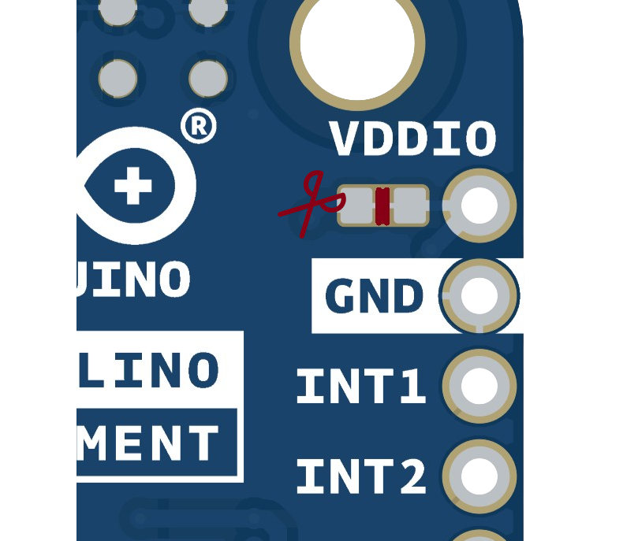

<!---
Feature Image: A descriptive image of the product to identify it on the first page of the Datasheet. Image must be put inside the "assets" folder and be named "featured.png" Actual Image for example purposes.
-->


# Description

<!---
Description: A paragraph describing the product in an official and commercial way. This text is normally taken from the official description inside the Product Sales brief slides and adapted the text if necessary to the datasheet. The actual text is for examples purposes.
-->
	
The Plug and Make Kit features the Arduino R4 board with built-in Wi-Fi® capabilities, enabling connectivity and opening the doors to integration with the Arduino IoT Cloud plataform. This kit includes a selection of 7 modules, all easily connectable via I2C Qwiic cables. Tailor your project to perfection by selecting the sensors and inputs that best suit your needs, and experience a completely solder-free way to easily build your ideas. Dive into the world of electronics with hands-on learning and intuitive module interaction, empowering you to innovate and create with unparalleled ease and flexibility.

# Target Areas

<!---
Target Areas: Tags about the main keywords of the product, can be taken from the sales brief or asking the Project Manager about the right ones. Tags must be first letter in caps and must be separated by commas. Actual tags for example purposes.
-->

Maker, beginner, education

# Contents
## Application Examples

<div style="text-align:justify;">
The Plug and Make Kit, featuring the Arduino UNO R4 WiFi, offers a seamless and user-friendly introduction to IoT and electronics. With its extensive array of modular sensors and components, this kit is designed to simplify project development and enhance learning experiences. The I2C Qwiic cable connectivity ensures quick and easy customization of your projects, making it an ideal choice for a variety of applications. Below are some examples of how this kit can be utilized:

- **Smart Home Automation:** Utilize the kit to build smart home devices that can monitor and control various environmental factors. With sensors for temperature, humidity, and movement, create a system that automates climate control, security, and lighting. The onboard WiFi allows for remote monitoring and control through the Arduino IoT Cloud or other third-party services.

- **Environmental Monitoring:** Leverage the kit's sensors to develop a comprehensive environmental monitoring system. Measure and track data such as air quality, temperature, and humidity levels. The kit's modular design facilitates effortless expansion with additional sensors, providing the flexibility to adapt to evolving project requirements. Data can be logged and analyzed through the Arduino IoT Cloud, providing real-time insights and alerts.

- **Interactive Learning Tools:** The kit's interactive modules, including buttons, RGB LEDs, and buzzers, can be used to create engaging educational tools. Develop projects that teach coding, electronics, and IoT concepts in a hands-on manner. The plug-and-play nature of the kit simplifies setup and reduces the learning curve, making it perfect for classrooms and educational workshops.
</div>


## Features
### Contains

<!---
General Specifications Overview: This section covers the main technical descriptions and a full summary of the main technical specifications of the product. The section normally starts with another descriptive 3/4 lines paragraph this time focused mostly on the technical features of the product plus a table with its main technical specifications. It is important to note that this section and the following related one where the product specifications are broken down into detail in new sections and tables hugely vary from product to product, being really important to cover all the main technical features of each product properly. That info will be expanded later in the specific sections related to that feature. The actual text and the following table are intended for example purposes.
-->

The Plug and Make Kit offers an intuitive and effortless introduction to the world of IoT and electronics. Featuring the powerful Arduino UNO R4 WiFi, this kit enables seamless integration with the Arduino IoT Cloud for a smooth, wireless experience. With its array of modular sensors and components connectable via I2C Qwiic cables, the kit allows for easy customization of your projects. Equipped with a diverse range of sensors and interactive modules, this kit provides the tools you need to create dynamic and engaging projects with ease. Perfect for both beginners and experienced makers, the Plug and Make Kit empowers you to explore and innovate effortlessly.


| **SKU**            | *Name**                       | **Purpose**                                             | **Quantity**  |
| -------------- | -------------------------- |-----------------------------------------------------|-----------|
| ABX00080       | Arduino UNO R4 WiFi        | Programmable board with WiFi                        | 1         |
| ASX00071       | Plate Node                 | Fix firmly an UNO and some nodes on it              | 1         |
| ABX00101       | Modulino Movement                   | Measure acceleration and rotation     | 1         |
| ABX00102       | Modulino Distance                   | Time of flight, finds distances                     | 1         |
| ABX00103       | Modulino Thermo                     | Measure temperature and humidity                    | 1         |
| ABX00107       | Modulino Knob                       | Rotary encoder for input                            | 1         |
| ABX00108       | Modulino Buzzer                    | Produce sound                                       | 1         |
| ABX00109       | Modulino Pixels                     | 8 RGB LEDs for display                              | 1         |
| ABX00110       | Modulino Buttons                    | 3 push buttons for input                            | 1         |


### Arduino UNO R4 WiFi
#### Description
The Arduino® UNO R4 WiFi is the first UNO board to feature a 32-bit microcontroller and an ESP32-S3 Wi-Fi® module (ESP32-S3-MINI-1-N8). It features a RA4M1 series microcontroller from Renesas (R7FA4M1AB3CFM#AA0), based on a 48 MHz Arm® Cortex®-M4 microprocessor. The UNO R4 WiFi's memory is larger than its predecessors, with 256 kB flash, 32 kB SRAM, and 8 kB of EEPROM. This board is ideal for entry-level projects, easy IoT applications, and projects requiring a built-in 12x8 LED matrix for animations and displays.


#### Tech Specs
| **Specification**         | **Details**                         |
|---------------------------|-------------------------------------|
| **Microcontroller**       | Renesas RA4M1 (R7FA4M1AB3CFM#AA0)   |
| **Clock Speed**           | 48 MHz                              |
| **Operating Voltage**     | 5 V (RA4M1), 3.3 V (ESP32-S3)       |
| **Memory**                | 256 kB Flash, 32 kB SRAM, 8 kB EEPROM |
| **Peripherals**           | Capacitive Touch Sensing Unit (CTSU), USB 2.0 Full-Speed Module, 14-bit ADC, Up to 12-bit DAC, Operational Amplifier (OPAMP) |
| **Communication**         | 1x UART, 1x SPI, 1x I2C, 1x CAN (external transceiver required) |
| **Wi-Fi**                 | 802.11 b/g/n (Wi-Fi 4), up to 150 Mbps |
| **Bluetooth**             | Bluetooth 5                         |
| **Power Supply**          | 6-24 V via VIN, 5 V via USB-C®      |
| **LED Matrix**            | 12x8 red LEDs, fully programmable   |
| **Additional Features**   | Real-time Clock (RTC), Memory Protection Unit (MPU), DAC, DMA |

#### Pinout
| **Pin**                   | **Function**                        |
|---------------------------|-------------------------------------|
| GND                       | Ground                              |
| 3V3                       | 3.3V Power Rail                     |
| 5V                        | 5V Power Rail                       |
| VIN                       | Voltage Input                       |
| SDA                       | I2C Data                            |
| SCL                       | I2C Clock                           |
| A0                        | Analog Input 0 / DAC                |
| A1                        | Analog Input 1 / OPAMP+             |
| A2                        | Analog Input 2 / OPAMP-             |
| A3                        | Analog Input 3 / OPAMPOut           |
| A4                        | Analog Input 4 / I2C Serial Data (SDA) |
| A5                        | Analog Input 5 / I2C Serial Clock (SCL) |
| D0                        | Digital I/O 0 / UART RX             |
| D1                        | Digital I/O 1 / UART TX             |
| D2-D13                    | Digital I/O 2-13                    |
| D14 (TXD)                 | Serial Transmit (UART)              |
| D15 (RXD)                 | Serial Receive (UART)               |
| CANRX                     | CAN Receiver (requires transceiver) |
| CANTX                     | CAN Transmitter (requires transceiver) |


## Power Options

Power can either be supplied via the VIN pin, or via USB-C® connector. If power is supplied via VIN, the ISL854102FRZ buck converter steps the voltage down to 5 V.

Both VUSB and VIN pins are connected to the ISL854102FRZ buck converter, with Schottky diodes in place for reverse polarity & overvoltage protection respectively.

Power via USB supplies about ~4.7 V (due to Schottky drop) to the RA4M1 MCU.

The linear regulator (SGM2205-3.3XKC3G/TR) converts 5 V from either the buck converter or USB, and provides 3.3 V to a number of components, including the ESP32-S3 module.

### Power Tree


### Pin Voltage

The general operating voltage for UNO R4 WiFi is 5 V, however the ESP32-S3 module's operating voltage is 3.3 V.

**Note:** It is **very** important that ESP32-S3's pins (3.3 V) do not come in contact with any of the RA4M1's pins (5 V), as this may damage the circuits.

### Pin Current

The GPIOs on the R7FA4M1AB3CFM#AA0 microcontroller can safely handle up to 8 mA of current. Never connect devices that draw higher current directly to a GPIO as this may damage the circuit.

For powering e.g. servo motors, always use an external power supply.

<div style="page-break-after:always;"></div>

#### Mechanical Information


### Plate Node
#### Description
The Plate Node is designed to provide a stable and secure mounting solution for your Arduino UNO R4 WiFi and additional nodes. Measuring 140x140x1.6mm with 3.5mm holes, it ensures that your setup remains firm and organized, making it easier to manage your components and connections, particularly useful in complex projects where multiple sensors and modules need to be fixed in place to ensure consistent performance.

#### Tech Specs
| **Specification** | **Details** |
|-------------------|-------------|
| Dimensions        | 140x140x1.6mm |
| Holes             | 3.5mm       |

#### Mechanical Information


## Modules

### General Characteristics
#### Description
The Plug and Make Kit modules offer a versatile and user-friendly introduction to IoT and electronics. Designed for seamless integration, these modules allow for easy expansion with additional sensors and components, providing a flexible platform to meet diverse project requirements. The modules can be easily connected using Qwiic cables, enabling straightforward daisy-chaining of multiple modules via I2C. This design makes it perfect for both beginners and advanced users, enabling them to experiment and create with ease.

#### PCB Specifications
- 2 layers
- Solder mask color: blue
- Silkscreen color: white
- Surface finish: HAL LF (silver for “exposed copper”)
- Minimum isolation: 0.127mm
- Minimum trace width: 0.127mm

#### Mechanical Information
- Board dimensions: 41mm x 25.36mm
- Board thickness: 1.6mm, tolerance ± 0.2mm
- 4 mounting holes, nominal diameter 3.2mm, tolerance -0mm, +0.2mm
- Hole to hole quotes: 16mm vertical, 32mm horizontal
- Green power LED powered by +3V3 net, with 1kΩ series resistor
- Power LED nominal current consumption: 1mA ≈ (3.3V - 2.2V) / 1kΩ


#### I2C Side Connectors
At least x2 connectors, JST pitch 1mm compatible like SM04B-SRSS-TB

#### Pinout


#### Version Number
Version number on bottom copper, below solder mask. Location is always on the top right corner (bottom view).


#### Modules with Microcontroller
All modules that have a added microcontroller for interfacing, such as the knob, buzzer, buttons, and pixels, have footprints allowing for the optional mounting of I2C pullups. However, these pullups are not mounted by default. This table allows to easily check this information, “x” in the table means that the pullup of that pin is not mounted.

| Board            | SKU      | PA6 | PA7 | PA8 | PC14 | PC15 | PF2 |
|------------------|----------|-----|-----|-----|------|------|-----|
| Modulino Knob   | ABX00107 |     |     |  x  |      |      |     |
| Modulino Buzzer   | ABX00108 |  x  |     |     |      |      |     |
| Modulino Pixels      | ABX00109 |     |     |  x  |      |      |     |
| Modulino Buttons    | ABX00110 |     |     |     |      |      |     |

### Movement
#### Description
The MOVEMENT module, featuring the LSM6DSOXTR sensor, measures acceleration, rotation, and temperature, providing comprehensive data for motion detection applications. It's ideal for projects involving gesture recognition, pedometers, and vibration monitoring.

#### Tech Specs
| **Specification**     | **Details**                                         |
|-----------------------|-----------------------------------------------------|
| Sensor                | LSM6DSOXTR                                          |
| Supply Voltage        | Min: 1.71 V, Max: 3.6 V                             |
| Power Consumption     | Gyro: 0.55 mA, Accel: 170 µA                        |
| Range                 | ±125 dps to ±2000 dps                               |
| Accuracy              | Accel: ±20 mg, Gyro: ±1 dps                         |
| Resolution            | Accel: 0.061 mg/LSB to 0.488 mg/LSB, Gyro: 4.375 mdps/LSB to 70 mdps/LSB |
| Communication         | SPI, I²C, MIPI I3CSM                                |

#### Pinout

##### 1x4 Header
| **Pin** | **Net Name** | **Function**  |
|---------|--------------|---------------|
| GND     | GND          | Ground        |
| 3V3     | +3V3         | Power Supply  |
| SDA     | SDA_1        | I2C Data      |
| SCL     | SCL_1        | I2C Clock     |


##### LSM6DSOXTR Signals
| **Pin**   | **Net Name**    | **Function**             |
|-----------|-----------------|--------------------------|
| VDDIO     | +3V3            | 3V3 (cuttable)           |
| GND       | GND             | Ground                   |
| INT1      | INT1_1          | Interrupt 1 (Sensor)     |
| INT2      | INT2_1          | Interrupt 2 (Sensor)     |
| SDX       | SDx_1           | SPI Data X               |
| SCX       | SCx_1           | SPI Clock X              |
| SDO/SA0   | SDO/SA0_1       | SPI Data Out / I2C Addr  |
| CS        | CS_1            | SPI Chip Select          |
| OCSAUX    | OCS_Aux_1       | Auxiliary Output         |

1x4 Header for GND, 3V3, SDA, SCL. These holes provide a place to mount header pins if desired.

1x10 header for LSM6DSOXTR signals. These holes provide a place to mount header pins if desired.

It is possible to make VDDIO independent from +3V3 by cutting its solder jumper.


LSM6DSOXTR interrupts INT1 and INT2 are available on the header.

With the header pins and cutting the appropriate solder jumpers, it is possible to control the LSM6DSOXTR with 3-wire SPI or 4-wire SPI, connecting other sensors to it. Check the LSM6DSOXTR datasheet for more details.

It is possible to change the I2C adress for the module with a small hardware change. For this the exposed pads on the bottom of the board corresponding with the desired adress (0x6A or 0x6B) must be separated shorted together and the oposite set of pads needs to be separated. Image for reference is changing from the (default) 0x6A to 0x6B.
Please remember to disconnect the modules when making these changes.


LSM6DSOXTR has several advanced features to control other compatible sensors with its “machine learning capabilities,” which can be empowered with a combination of advanced FW code, the headers, and the solder jumper on board. Check the LSM6DSOXTR datasheet for more details.

#### Mechanical Information


### Distance
#### Description
The DISTANCE module, featuring the VL53L4CDV0DH/1 sensor, provides accurate distance measurements using time-of-flight technology. It's perfect for applications requiring precise distance sensing, such as robotics and proximity sensors.

#### Tech Specs
| **Specification**   | **Details**                                         |
|---------------------|-----------------------------------------------------|
| Sensor              | VL53L4CDV0DH/1                                      |
| Supply Voltage      | Min: 2.6 V, Max: 3.5 V                              |
| Power Consumption   | 40 mA (peak), 24 mA active ranging, 4mA I2C         |
| Range               | 0 to 1200mm                                         |
| Accuracy            | ±7 mm to ±3%                                        |
| Resolution          | 1 mm                                                |
| Communication       | I2C                                                 |

#### Pinout

##### 1x4 Header
| **Pin** | **Net Name** | **Function**  |
|---------|--------------|---------------|
| GND     | GND          | Ground        |
| 3V3     | +3V3         | Power Supply  |
| SDA     | SDA_1        | I2C Data      |
| SCL     | SCL_1        | I2C Clock     |

##### VL53L4CDV0DH/1 Signals
| **Pin**   | **Net Name**  | **Function**              |
|-----------|---------------|---------------------------|
| GPIO1     | GPIO1_1       | Digital output (Sensor)   |
| XSHUT     | XSHUT_1       | Shutdown (Sensor)         |

1x4 header for GND, 3V3, SDA, SCL. These holes provide a place to mount header pins if desired.

1x4 header for VL53L4CDV0DH/1 signals. These holes provide a place to mount header pins if desired.

GPIO1 open drain interrupt output, with onboard 10kΩ pullup to 3V3.

XSHUT active low digital input, with onboard 10kΩ pullup to 3V3.

#### Mechanical Information


### Thermo
#### Description
The THERMO module, featuring the HS3003 sensor, measures both temperature and humidity. It's suitable for environmental monitoring and climate control applications.

#### Tech Specs
| **Specification**   | **Details**                                         |
|---------------------|-----------------------------------------------------|
| Sensor              | HS3003                                              |
| Supply Voltage      | Min: 2.3 V, Max: 5.5 V                              |
| Power Consumption   | 24.4 µA (14-bit resolution, 3.3V supply)            |
| Range               | 0% to 100% RH, -40°C to +125°C                      |
| Accuracy            | Humidity: ±2.8%RH, Temperature: ±0.25°C             |
| Resolution          | Humidity: 14-bit, Temperature: 14-bit               |
| Communication       | I2C                                                 |

#### Pinout

##### 1x4 Header
| **Pin** | **Net Name** | **Function**  |
|---------|--------------|---------------|
| GND     | GND          | Ground        |
| 3V3     | +3V3         | Power Supply  |
| SDA     | SDA_1        | I2C Data      |
| SCL     | SCL_1        | I2C Clock     |

1x4 header for GND, 3V3, SDA, SCL. These holes provide a place to mount header pins if desired.

#### Mechanical Information


### Knob
#### Description
The KNOB module includes a quadrature rotary encoder with an SPST switch, using the STM32C011F4 microcontroller for digital communication. This setup allows precise control for user interfaces and adjustments in various applications. All of the microcontroller boards have the footprints to provide the option to mount I2C pullups, but no pullups are mounted.

#### Tech Specs
| **Specification**   | **Details**                                         |
|---------------------|-----------------------------------------------------|
| Sensor              | Quadrature Rotary Encoder                           |
| Microcontroller     | STM32C011F4                                         |
| Supply Voltage      | Min: 2.0 V, Max: 3.6 V                              |
| Power Consumption   | 3.4 mA                                              |
| Range               | 360° continuous                                     |
| Accuracy            | Internal Oscillator: ±1%                            |
| Resolution          | 12-bit ADC                                          |
| Communication       | I2C, USART, SPI, I2S                                |

#### Pinout

##### 1x4 Header
| **Pin** | **Net Name** | **Function**  |
|---------|--------------|---------------|
| GND     | GND          | Ground        |
| 3V3     | +3V3         | Power Supply  |
| SDA     | SDA_1        | I2C Data      |
| SCL     | SCL_1        | I2C Clock     |

##### Encoder Signals
| **Pin**   | **Net Name**             | **Function**           |
|-----------|--------------------------|------------------------|
| PA0       | PA0_1                    | PinA (Encoder)         |
| PA1       | PA1_1                    | PinB (Encoder)         |
| PA2       | PA2_1                    | Switch (Encoder)       |
| RX1       | PA10_USART1_RX_1         | UART Receive           |
| TX1       | PA9_USART1_TX_1          | UART Transmit          |
| SWDIO     | PA13_SWDIO_1             | SWD Data               |
| SWCLK     | PA14_SWCLK_BOOT0_1       | SWD Clock              |
| PF2       | PF2_NRST_1               | NRST                   |

1x4 header for GND, 3V3, SDA, SCL. These holes provide a place to mount header pins if desired.

1x10 header for encoder and microcontroller signals. This header can be used to read the encoder from an external controller, to use the microcontroller pins for other purposes, or to reprogram the microcontroller using its SWD interface. These holes provide a place to mount header pins if desired.

#### Mechanical Information


### Buzzer
#### Description
The BUZZER module contains a single buzzer and uses the STM32C011F4 microcontroller for digital communication, making it suitable for producing sound alerts and notifications in various projects. All of the microcontroller boards have the footprints to provide the option to mount I2C pullups, but no pullups are mounted.

#### Tech Specs
| **Specification**   | **Details**                                         |
|---------------------|-----------------------------------------------------|
| Sensor              | 1 Buzzer                                            |
| Microcontroller     | STM32C011F4                                         |
| Supply Voltage      | Min: 2.0 V, Max: 3.6 V                              |
| Power Consumption   | 6.4 mA                                              |
| Accuracy            | ADC: ±2 LSB typical INL                             |
| Resolution          | 12-bit ADC                                          |
| Communication       | I2C                                                 |

#### Pinout

##### 1x4 Header
| **Pin** | **Net Name** | **Function**  |
|---------|--------------|---------------|
| GND     | GND          | Ground        |
| 3V3     | +3V3         | Power Supply  |
| SDA     | SDA_1        | I2C Data      |
| SCL     | SCL_1        | I2C Clock     |

##### Buzzer and Microcontroller Signals
| **Pin**   | **Net Name**             | **Function**           |
|-----------|--------------------------|------------------------|
| PA0       | PA0_1                    | + (Buzzer)             |
| RX1       | PA10_USART1_RX_1         | UART Receive           |
| TX1       | PA9_USART1_TX_1          | UART Transmit          |
| SWDIO     | PA13_SWDIO_1             | SWD Data               |
| SWCLK     | PA14_SWCLK_BOOT0_1       | SWD Clock              |
| PF2       | PF2_NRST_1               | NRST                   |

1x4 header for GND, 3V3, SDA, SCL. These holes provide a place to mount header pins if desired.

1x8 header for buzzer and microcontroller signals. This header can be used to actuate the buzzer from an external 3.3V source, to use the microcontroller pins for other purposes, or to reprogram the microcontroller using its SWD interface. These holes provide a place to mount header pins if desired.

#### Mechanical Information


### Pixels
#### Description
The PIXELS module includes eight LC8822-2020 RGB LEDs and uses the STM32C011F4 microcontroller for digital communication, perfect for creating colorful displays and lighting effects in your projects. All of the microcontroller boards have the footprints to provide the option to mount I2C pullups, but no pullups are mounted.

#### Tech Specs
| **Specification**   | **Details**                                         |
|---------------------|-----------------------------------------------------|
| Sensor              | Eight LC8822-2020                                   |
| Microcontroller     | STM32C011F4                                         |
| Supply Voltage      | Min: 2.0 V, Max: 3.6 V                              |
| Power Consumption   | 33mA @ 3.3V * 8 + 3.4 mA                            |
| Resolution          | 12-bit ADC                                          |
| Communication       | I2C, USART, SPI, I2S                                |

#### Pinout

##### 1x4 Header
| **Pin** | **Net Name** | **Function**  |
|---------|--------------|---------------|
| GND     | GND          | Ground        |
| 3V3     | +3V3         | Power Supply  |
| SDA     | SDA_1        | I2C Data      |
| SCL     | SCL_1        | I2C Clock     |

##### LC8822-2020 and Microcontroller Signals
| **Pin**   | **Net Name**             | **Function**           |
|-----------|--------------------------|------------------------|
| CO        | CO_1                     | Clock Out              |
| DO        | DO_1                     | Data Out               |
| RX1       | PA10_USART1_RX_1         | UART Receive           |
| TX1       | PA9_USART1_TX_1          | UART Transmit          |
| SWDIO     | PA13_SWDIO_1             | SWD Data               |
| SWCLK     | PA14_SWCLK_BOOT0_1       | SWD Clock              |
| PF2       | PF2_NRST_1               | NRST                   |

1x4 header for GND, 3V3, SDA, SCL. These holes provide a place to mount header pins if desired.

1x10 header for LC8822-2020 and microcontroller signals. This header can be used to add more LC8822-2020 to the chain. The header also has other microcontroller pins usable for other purposes or to reprogram the microcontroller using its SWD interface. These holes provide a place to mount header pins if desired.

#### Mechanical Information


### Buttons
#### Description
The BUTTONS module includes three SPST push buttons and three yellow LEDs, using the STM32C011F4 microcontroller for digital communication. It's ideal for creating interactive input interfaces. All of the microcontroller boards have the footprints to provide the option to mount I2C pullups, but no pullups are mounted.

#### Tech Specs
| **Specification**   | **Details**                                         |
|---------------------|-----------------------------------------------------|
| Sensor              | 3 SPST Push Buttons                                 |
| Microcontroller     | STM32C011F4                                         |
| Supply Voltage      | Min: 2.0 V, Max: 3.6 V                              |
| Power Consumption   | 2.5 mA * 3 + 3.4 mA                                 |
| Accuracy            | ADC: ±2 LSB typical INL                             |
| Resolution          | 12-bit ADC                                          |
| Communication       | I2C, USART, SPI, I2S                                |

#### Pinout

##### 1x4 Header
| **Pin** | **Net Name** | **Function**  |
|---------|--------------|---------------|
| GND     | GND          | Ground        |
| 3V3     | +3V3         | Power Supply  |
| SDA     | SDA_1        | I2C Data      |
| SCL     | SCL_1        | I2C Clock     |

##### Pushbutton and Microcontroller Signals
| **Pin**   | **Net Name**             | **Function**           |
|-----------|--------------------------|------------------------|
| PA0       | PA0_1                    | A (Pushbutton)         |
| PA1       | PA1_1                    | B (Pushbutton)         |
| PA2       | PA2_1                    | C (Pushbutton)         |
| RX1       | PA10_USART1_RX_1         | UART Receive           |
| TX1       | PA9_USART1_TX_1          | UART Transmit          |
| SWDIO     | PA13_SWDIO_1             | SWD Data               |
| SWCLK     | PA14_SWCLK_BOOT0_1       | SWD Clock              |
| PF2       | PF2_NRST_1               | NRST                   |
1x4 header for GND, 3V3, SDA, SCL. These holes provide a place to mount header pins if desired.

1x10 header for pushbutton signals and microcontroller signals. This header can be used to read the pushbuttons status from an external 3.3V controller, to use the microcontroller pins for other purposes, or to reprogram the microcontroller using its SWD interface. These holes provide a place to mount header pins if desired.

#### Mechanical Information


## Software

### Libraries and Sketches
The Plug and Make Kit is compatible with the Modulino library, which can be found at the following link: [Modulino library link](https://github.com/arduino-libraries/Modulino).

### I2C Connections on UNO R4 WiFi
- **Wire** on headers A4, A5
- **Wire1** on QWIIC connector

Keep in mind that by default the Modulino library assumes the QWIIC connector is going to be used, therefore by default it is using the Wire1.

When connecting the Modulino boards to the UNO R4 WiFi headers, or to the Portenta on Mid Carrier, remember to modify the code to use Wire instead of Wire1.

Example code to connect the Modulino boards:

```cpp
#include "Modulino.h"
#include "Wire.h"

ModulinoDistance distance;

void setup() {
  Serial.begin(115200);
  Modulino.begin(Wire);
  distance.begin();
}

void loop() {
  Serial.println(distance.get());
}
```

### I2C Address Reference

| **Board Silk Name** | **Sensor/Device**        | **Default I2C Address (HEX)** | **Editable Solder Jumper Addresses (HEX)** |
|----------------------|--------------------------|------------------------------|------------------------------------|
| MOVEMENT             | LSM6DSOXTR               | 0x6A                         | 0x6A, 0x6B                         |
| DISTANCE             | VL53L4CDV0DH/1           | 0x29                         | -                                  |
| THERMO               | HS3003                   | 0x44                         | -                                 |
| BUZZER               | ADD BUZZER MODEL TODO                | 0x3C                         | -                                  |
| KNOB                 | Quadrature Rotary Encoder | 0x76                         | -                                  |
| PIXELS               | Eight LC8822-2020        | 0x6C                         | -                                  |
| BUTTONS              | 3 SPST Push Buttons      | 0x7C                         | -                                  |

With the provided sketch, users can change the default I2C address of the microcontroller firmware. Assigning different addresses allows users to connect multiple boards of the same type in a chain.

To facilitate this, a white rectangle is positioned on the bottom silk of the board, where users can write the new I2C address directly on the board itself.

TODO add sketch and image of the rectangle


## Accessories (Included / Not Included)

<!---
Accessories: This section lists some of the related accessories that come or not with the product, like USB cables, antennas or batteries. It is important to put in whether the accessory is included or not. Actual items only for purposes examples.
-->
- 24 M3x10 screws (Included)
- 20 M3 bolts (Included)
- 4 M3x20 female spacers (Included)
- 7 Female-to-Female I2C cables (with QWICC connectors)
- USB-C® cable (Not included)

## Related Products

<!---
Related products: This section lists some of the related products like shields or others. Ask and align with the Project Manager responsible for the product and check the sales brief. It is important to put the SKU of each item. Actual items are only for example purposes.
-->

TODO Get this info


## Rating

## Recommended Operating Conditions

| Symbol          | Description                          | Min | Typ | Max | Unit |
| --------------- | ------------------------------------ | --- | --- | --- | ---- |
| V<sub>IN</sub>  | Input voltage from VIN pad / DC Jack | 6   | 7.0 | 24  | V    |
| V<sub>USB</sub> | Input voltage from USB connector     | 4.8 | 5.0 | 5.5 | V    |
| T<sub>OP</sub>  | Operating Temperature                | -40 | 25  | 85  | °C   |

**Note:** V<sub>DD</sub> controls the logic level and is connected to the 5V power rail. V<sub>AREF</sub> is for the analog logic.


### Block Diagram


### Product Topology


### Getting Started - IDE

If you want to program your Arduino U while offline you need to install the Arduino® Desktop IDE **[1]**. To connect the **Arduino UNO R4 WiFi** to your computer, you will need a USB-C cable, which can also provide power to the board, as indicated by the LED (DL1).

### Getting Started - Arduino Web Editor

All Arduino boards, including this one, work out-of-the-box on the Arduino® Web Editor **[2]**, by just installing a simple plugin.

The Arduino Web Editor is hosted online, therefore it will always be up-to-date with the latest features and support for all boards. Follow **[3]** to start coding on the browser and upload your sketches onto your board.

### Getting Started - Arduino Cloud

All Arduino IoT enabled products are supported on Arduino Cloud which allows you to log, graph and analyze sensor data, trigger events, and automate your home or business.

### Online Resources

Now that you have gone through the basics of what you can do with the board you can explore the endless possibilities it provides by checking exciting projects on ProjectHub **[4]**, the Arduino Library Reference **[5]**, and the online store **[6]**; where you will be able to complement your board with sensors, actuators and more.

### Board Recovery

<!---
Board Recovery:  Make sure to explain how to put the board in recovery mode. If that information is not available, please remove.
-->

All Arduino boards have a built-in bootloader which allows flashing the board via USB. In case a sketch locks up the processor and the board is not reachable anymore via USB, it is possible to enter bootloader mode by doubletapping the reset button right after the power-up.


<div style="page-break-after: always;"></div>


## Certifications

<!---
Important legal information regarding certifications, only change the section "Certification Summary and double check with the Certification and Project Manager of the product the information written.
-->

### Certifications Summary

<!---
Certification Summary: A table including the main certification of the products. Add certifications serial names if possible.
-->

| **Certification** | **Status** |
|:-----------------:|:----------:|
|  CE/RED (Europe)  |     Yes    |
|     UKCA (UK)     |     Yes    |
|     FCC (USA)     |     Yes    |
|    IC (Canada)    |     Yes    |
| MIC/Telec (Japan) |     Yes    |
|  RCM (Australia)  |     Yes    |
|        RoHS       |     Yes    |
|       REACH       |     Yes    |
|        WEEE       |     Yes    |

### Declaration of Conformity CE DoC (EU)

<p style="text-align: justify;">We declare under our sole responsibility that the products above are in conformity with the essential requirements of the following EU Directives and therefore qualify for free movement within markets comprising the European Union (EU) and European Economic Area (EEA).</p>

### Declaration of Conformity to EU RoHS & REACH 211 01/19/2021

<p style="text-align: justify;">Arduino boards are in compliance with RoHS 2 Directive 2011/65/EU of the European Parliament and RoHS 3 Directive 2015/863/EU of the Council of 4 June 2015 on the restriction of the use of certain hazardous substances in electrical and electronic equipment.</p>

| Substance                              | **Maximum limit (ppm)** |
|----------------------------------------|-------------------------|
| Lead (Pb)                              | 1000                    || **Date**   | **Revision** | **Changes**               |
| ---------- | ------------ | ------------------------- |
| 02/11/2023 | 2            | Flashing Mode Description |
| 25/10/2023 | 1            | First Release             |
| Poly Brominated Biphenyls (PBB)        | 1000                    |
| Poly Brominated Diphenyl ethers (PBDE) | 1000                    |
| Bis(2-Ethylhexyl) phthalate (DEHP)     | 1000                    |
| Benzyl butyl phthalate (BBP)           | 1000                    |
| Dibutyl phthalate (DBP)                | 1000                    |
| Diisobutyl phthalate (DIBP)            | 1000                    |

Exemptions: No exemptions are claimed.

<p style="text-align: justify;">Arduino Boards are fully compliant with the related requirements of European Union Regulation (EC) 1907 /2006 concerning the Registration, Evaluation, Authorization and Restriction of Chemicals (REACH). We declare none of the SVHCs (https://echa.europa.eu/web/guest/candidate-list-table), the Candidate List of Substances of Very High Concern for authorization currently released by ECHA, is present in all products (and also package) in quantities totaling in a concentration equal or above 0.1%. To the best of our knowledge, we also declare that our products do not contain any of the substances listed on the "Authorization List" (Annex XIV of the REACH regulations) and Substances of Very High Concern (SVHC) in any significant amounts as specified by the Annex XVII of Candidate list published by ECHA (European Chemical Agency) 1907 /2006/EC.</p>

### Conflict Minerals Declaration

<p style="text-align: justify;">As a global supplier of electronic and electrical components, Arduino is aware of our obligations with regard to laws and regulations regarding Conflict Minerals, specifically the Dodd-Frank Wall Street Reform and Consumer Protection Act, Section 1502. Arduino does not directly source or process conflict minerals such as Tin, Tantalum, Tungsten, or Gold. Conflict minerals are contained in our products in the form of solder or as a component in metal alloys. As part of our reasonable due diligence, Arduino has contacted component suppliers within our supply chain to verify their continued compliance with the regulations. Based on the information received thus far we declare that our products contain Conflict Minerals sourced from conflict-free areas.</p>

### FCC Caution

Any Changes or modifications not expressly approved by the party responsible for compliance could void the user’s authority to operate the equipment.

This device complies with part 15 of the FCC Rules. Operation is subject to the following two conditions:

(1) This device may not cause harmful interference

(2) this device must accept any interference received, including interference that may cause undesired operation.

**FCC RF Radiation Exposure Statement:**

1. This Transmitter must not be co-located or operating in conjunction with any other antenna or transmitter.

2. This equipment complies with RF radiation exposure limits set forth for an uncontrolled environment.

3. This equipment should be installed and operated with a minimum distance of 20 cm between the radiator & your body.

**Note:** This equipment has been tested and found to comply with the limits for a Class B digital
device, pursuant to part 15 of the FCC Rules. These limits are designed to provide
reasonable protection against harmful interference in a residential installation. This equipment
generates, uses and can radiate radio frequency energy and, if not installed and used in
accordance with the instructions, may cause harmful interference to radio communications.
However, there is no guarantee that interference will not occur in a particular installation. If
this equipment does cause harmful interference to radio or television reception, which can be
determined by turning the equipment off and on, the user is encouraged to try to correct the
interference by one or more of the following measures:
- Reorient or relocate the receiving antenna.
- Increase the separation between the equipment and receiver.
- Connect the equipment into an outlet on a circuit different from that to which the
receiver is connected.
- Consult the dealer or an experienced radio/TV technician for help.

English:
User manuals for license-exempt radio apparatus shall contain the following or equivalent notice in a conspicuous location in the user manual or alternatively on the device or both. This device complies with Industry Canada license-exempt RSS standard(s). Operation is subject to the following two conditions:

(1) this device may not cause interference

(2) this device must accept any interference, including interference that may cause undesired operation of the device.

French:
Le présent appareil est conforme aux CNR d’Industrie Canada applicables aux appareils radio exempts de licence. L’exploitation est autorisée aux deux conditions suivantes:

(1) l’ appareil nedoit pas produire de brouillage

(2) l’utilisateur de l’appareil doit accepter tout brouillage radioélectrique subi, même si le brouillage est susceptible d’en compromettre le fonctionnement.

**IC SAR Warning:**

English:
This equipment should be installed and operated with a minimum distance of 20 cm between the radiator and your body.

French:
Lors de l’ installation et de l’ exploitation de ce dispositif, la distance entre le radiateur et le corps est d ’au moins 20 cm.

**Important:** The operating temperature of the EUT can’t exceed 85℃ and shouldn’t be lower than -40℃.

Hereby, Arduino S.r.l. declares that this product is in compliance with essential requirements and other relevant provisions of Directive 2014/53/EU. This product is allowed to be used in all EU member states.

# Company Information

<!---
Company information: Make sure is updated and always the same.
-->

| Company name    | Arduino SRL                                   |
|-----------------|-----------------------------------------------|
| Company Address | Via Andrea Appiani, 25 - 20900 MONZA（Italy)  |


# Reference Documentation

<!---
Reference Documentation: Make sure the quotes this is coherent with the "Device Operation" section.
-->

| Ref                       | Link                                                                                                                                                                                           |
| ------------------------- | ---------------------------------------------------------------------------------------------------------------------------------------------------------------------------------------------- |
| Arduino IDE (Desktop)     | [https://www.arduino.cc/en/Main/Software](https://www.arduino.cc/en/Main/Software)                                                                                                             |
| Arduino IDE (Cloud)       | [https://create.arduino.cc/editor](https://create.arduino.cc/editor)                                                                                                                           |
| Cloud IDE Getting Started | [https://docs.arduino.cc/cloud/web-editor/tutorials/getting-started/getting-started-web-editor](https://docs.arduino.cc/cloud/web-editor/tutorials/getting-started/getting-started-web-editor) |
| Project Hub               | [https://create.arduino.cc/projecthub?by=part&part_id=11332&sort=trending](https://create.arduino.cc/projecthub?by=part&part_id=11332&sort=trending)                                           |
| Library Reference         | [https://github.com/arduino-libraries/](https://github.com/arduino-libraries/)                                                                                                                 |
| Online Store              | [https://store.arduino.cc/](https://store.arduino.cc/)                                                                                                                                         |

## Revision History

<!---
Revision History: Every time there are updates or important changes a new line must be added. Always use date format: dd/mm/yyyy, put the revisions sorted by the most recent one. Put simple but descriptive information in the "Changes" column.
-->

|  **Date**  | **Revision** |                      **Changes**                       |
| :--------: | :----------: | :----------------------------------------------------: |
| 14/03/2023 |      1       |                     First release                      |

