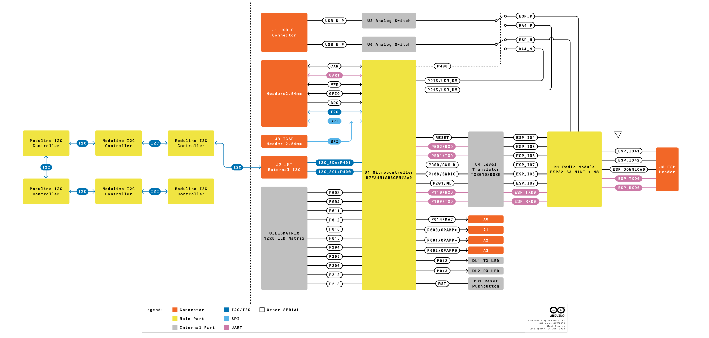
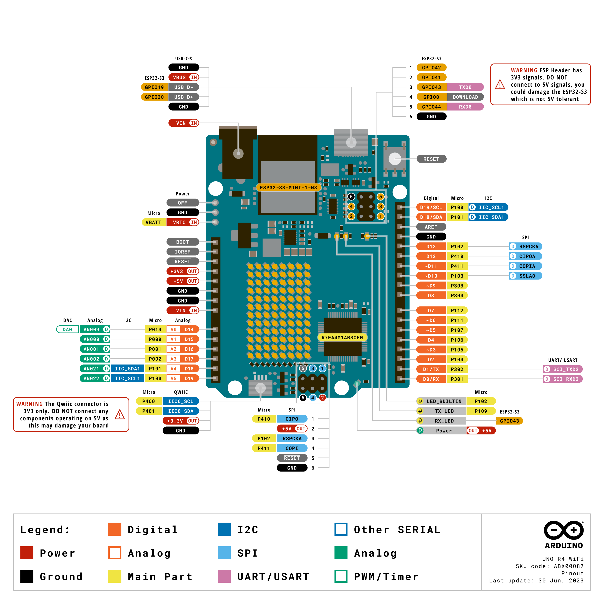
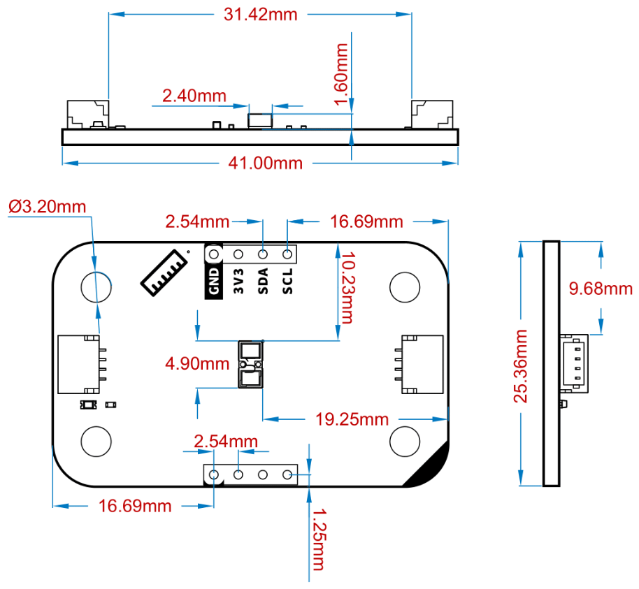
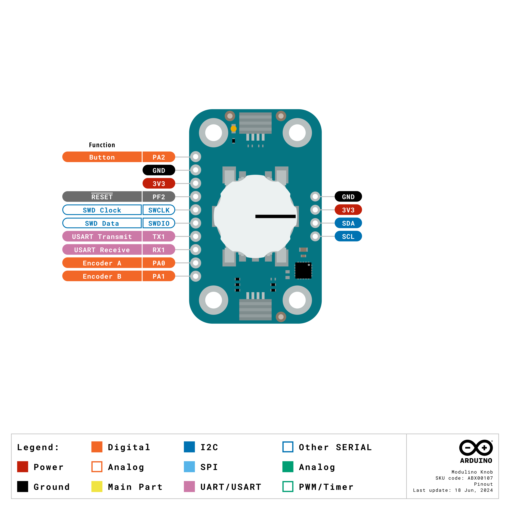
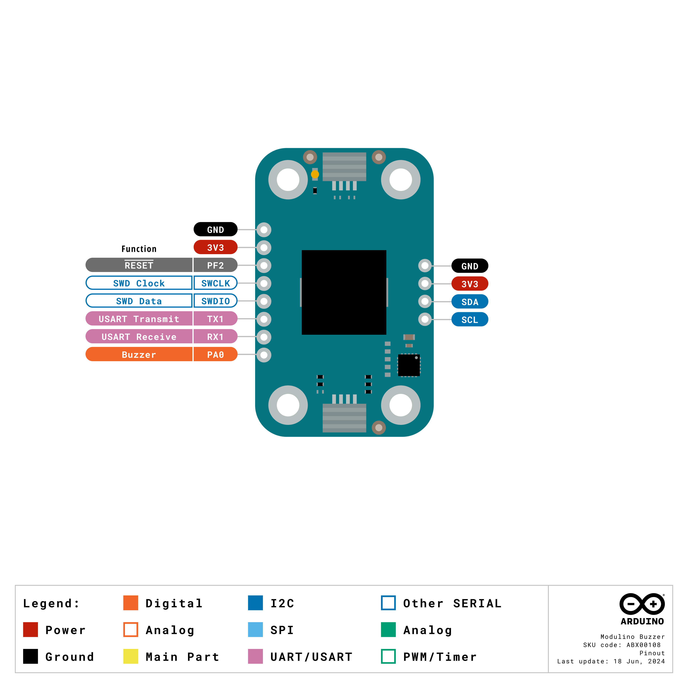
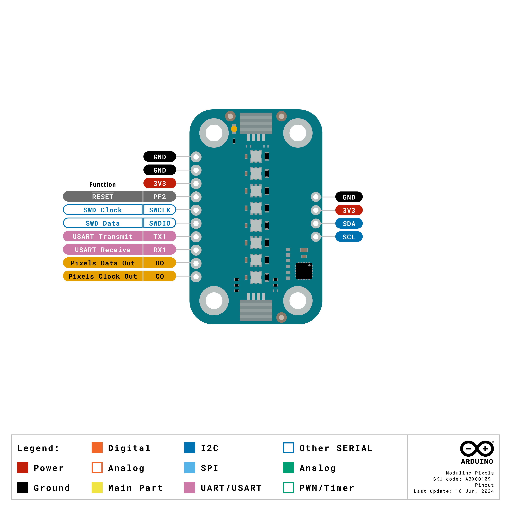
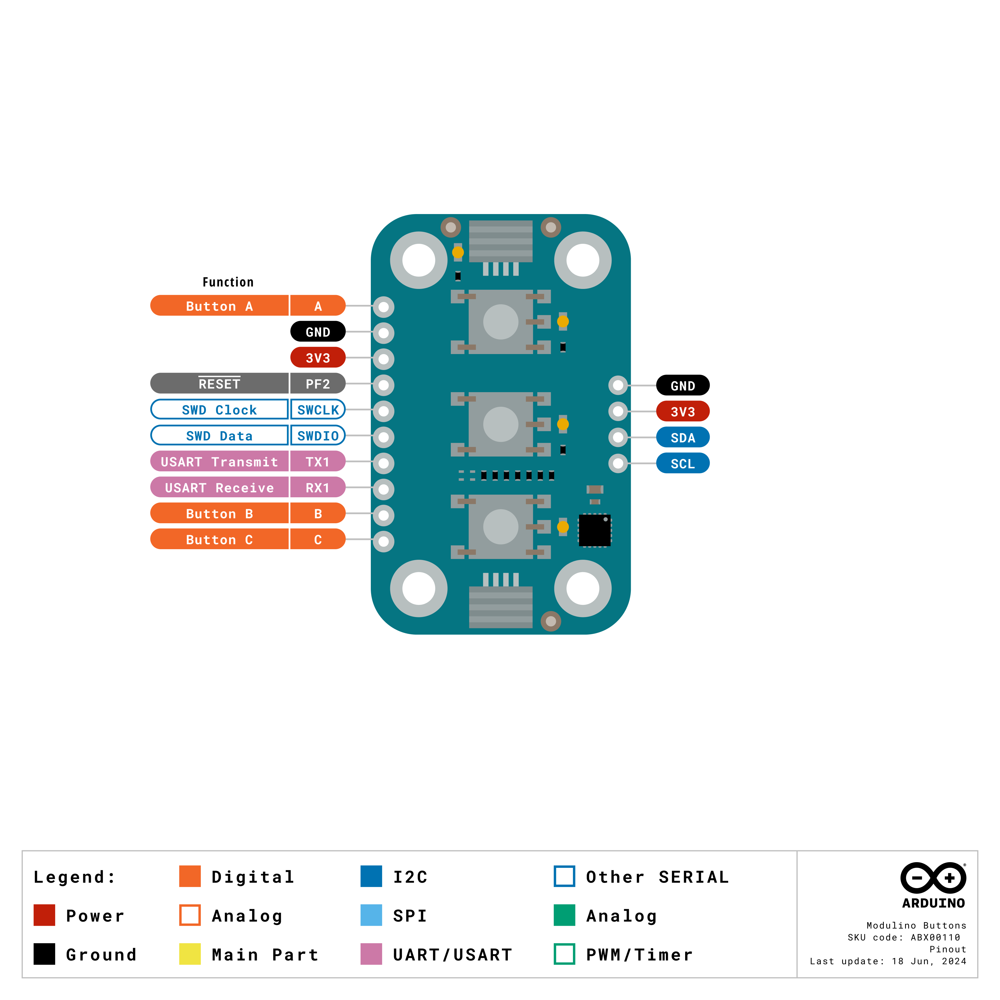

# Description

The Arduino® Plug and Make Kit features the Arduino® UNO R4 WiFi with built-in Wi-Fi® capabilities, enabling connectivity and opening the doors to integration with the Arduino® Cloud platform. This kit includes a selection of seven Modulino® nodes, all easily connectable via I2C Qwiic cables. Tailor your project to perfection by selecting the sensors and inputs that best suit your needs, and experience a completely solder-free way to easily build your ideas. Dive into the world of electronics with hands-on learning and intuitive module interaction, empowering you to innovate and create with unparalleled ease and flexibility.

# Target Areas

Maker, beginner, education

# Contents

## Application Examples

The Plug and Make Kit, featuring the Arduino® UNO R4 WiFi, offers a seamless and user-friendly introduction to IoT and electronics. With its extensive array of modular sensors and components, this kit is designed to simplify project development and enhance learning experiences. The I2C Qwiic cable connectivity ensures quick and easy customization of your projects, making it an ideal choice for a variety of applications. Below are some examples of how this kit can be utilized:

- **Interactive Learning Tools:** The kit's interactive Modulino® nodes, including buttons, RGB LEDs, and buzzers, can be used to create engaging educational tools. Develop projects that teach coding, electronics, and IoT concepts in a hands-on manner. The plug-and-play nature of the kit simplifies setup and reduces the learning curve, making it perfect for classrooms and educational workshops.

- **Environmental Monitoring:** Leverage the kit's sensors to develop a comprehensive environmental monitoring system. Measure and track data such as air quality, temperature, and humidity levels. The kit's modular design facilitates effortless expansion with additional sensors, providing the flexibility to adapt to evolving project requirements. Data can be logged and analyzed through the Arduino® Cloud, providing real-time insights and alerts.

- **Smart Home Automation:** Utilize the kit to build smart home devices that can monitor and control various environmental factors. With sensors for temperature, humidity, and movement, create a system that automates climate control, security, and lighting. The onboard Wi-Fi® allows for remote monitoring and control through the Arduino® Cloud or other third-party services.

## Features

The Plug and Make Kit offers an intuitive and effortless introduction to the world of IoT and electronics. Featuring the powerful Arduino® UNO R4 WiFi, this kit enables seamless integration with the Arduino® Cloud for a smooth, wireless experience. With its array of modular sensors and components connectable via I2C Qwiic cables, the kit allows for easy customization of your projects. Equipped with a diverse range of sensors and interactive Modulino® nodes, this kit provides the tools you need to create dynamic and engaging projects with ease. Perfect for both beginners and experienced makers.

### Kit Content

| **SKU**  | **Name**             | **Purpose**                            | **Quantity** |
| -------- | -------------------- | -------------------------------------- | ------------ |
| ABX00080 | Arduino® UNO R4 WiFi | Programmable main board                | 1            |
| ASX00071 | Modulino® Base       | Base plate for UNO and Modulino® nodes | 1            |
| ABX00101 | Modulino® Movement   | Measure acceleration and rotation      | 1            |
| ABX00102 | Modulino® Distance   | Time of flight, finds distances        | 1            |
| ABX00103 | Modulino® Thermo     | Measure temperature and humidity       | 1            |
| ABX00107 | Modulino® Knob       | Rotary encoder for input               | 1            |
| ABX00108 | Modulino® Buzzer     | Produce sound                          | 1            |
| ABX00109 | Modulino® Pixels     | 8x RGB LEDs for display                | 1            |
| ABX00110 | Modulino® Buttons    | 3x push buttons for input              | 1            |

### Accessories

| **Item Name**        | **Included** | **Quantity** |
| -------------------- | ------------ | ------------ |
| USB-C® cable         | Yes          | 1            |
| I2C Qwiic cables     | Yes          | 7            |
| M3x10 screws         | Yes          | 24           |
| M3 bolts             | Yes          | 20           |
| M3x20 female spacers | Yes          | 4            |

### Microcontroller

| **Feature**             | **Description**                                                                                                               |
| ----------------------- | ----------------------------------------------------------------------------------------------------------------------------- |
| **Product Name**        | Arduino® UNO R4 WiFi                                                                                                          |
| **Microcontroller**     | Renesas RA4M1 (R7FA4M1AB3CFM#AA0)                                                                                             |
| **Clock Speed**         | 48 MHz                                                                                                                        |
| **Power Supply**        | 6-24 VDC via VIN, 5 VDC via USB-C®                                                                                            |
| **Operating Voltage**   | 5 V (RA4M1)                                                                                                                   |
| **Memory**              | 256 kB Flash, 32 kB SRAM, 8 kB EEPROM                                                                                         |
| **Peripherals**         | Capacitive Touch Sensing Unit (CTSU), USB® 2.0 Full-Speed Module, 14-bit ADC, Up to 12-bit DAC, Operational Amplifier (OPAMP) |
| **Communication**       | 1x UART, 1x SPI, 1x I2C, 1x CAN (external transceiver required)                                                               |
| **Wi-Fi®**              | 802.11 b/g/n (Wi-Fi® 4), up to 150 Mbps                                                                                       |
| **Bluetooth®**          | Bluetooth® 5                                                                                                                  |
| **LED Matrix**          | 12x8 red LEDs, fully programmable                                                                                             |
| **Additional Features** | Real-time Clock (RTC), Memory Protection Unit (MPU), DAC, DMA                                                                 |
| **Certifications**      | CE/RED, UKCA, FCC, IC, RoHS, REACH, WEEE                                                                                      |

## Related Products

- _SKU: ASX00027_ - [Arduino® Sensor Kit](https://store.arduino.cc/products/arduino-sensor-kit)

- _SKU: K000007_ - [Arduino® Starter Kit](https://store.arduino.cc/products/arduino-starter-kit-multi-language)

- _SKU: AKX00026_ - [Arduino® Oplà IoT Kit](https://store.arduino.cc/products/opla-iot-kit)

## Rating

### Recommended Operating Conditions

| Symbol          | Description                          | Min | Typ | Max | Unit |
| --------------- | ------------------------------------ | --- | --- | --- | ---- |
| VIN  | Input voltage from VIN pad / DC Jack | 6   | 7.0 | 24  | V    |
| VUSB | Input voltage from USB connector     | 4.8 | 5.0 | 5.5 | V    |
| TOP  | Operating Temperature                | -40 | 25  | 85  | °C   |

**Note:** VDD controls the logic level and is connected to the 5V power rail. VAREF is for the analog logic.

## Block Diagram

The Plug and Make Kit is a combination of the Arduino UNO R4 Wifi board connected to different Modulino® nodes boards through and I2C bus as can be seen in the following block diagram.

## Functional Overview - Arduino UNO R4 WiFi

### Pinout

The Arduino® UNO R4 WiFi pinout is shown in the following figure.

| **Pin**   | **Function**                                    |
| --------- | ----------------------------------------------- |
| GND       | Ground                                          |
| 3.3 V     | 3.3 V Power Rail                                |
| 5V        | 5V Power Rail                                   |
| VIN       | Voltage Input                                   |
| SDA       | I2C Data                                        |
| SCL       | I2C Clock                                       |
| A0        | Analog Input 0 / DAC                            |
| A1        | Analog Input 1 / OPAMP+                         |
| A2        | Analog Input 2 / OPAMP-                         |
| A3        | Analog Input 3 / OPAMPOut                       |
| A4        | Analog Input 4 / I2C Serial Data (SDA)          |
| A5        | Analog Input 5 / I2C Serial Clock (SCL)         |
| D0        | Digital I/O 0 / UART RX                         |
| D1        | Digital I/O 1 / UART TX                         |
| D2-D13    | Digital I/O 2-13                                |
| D14 (TXD) | Serial Transmit (UART)                          |
| D15 (RXD) | Serial Receive (UART)                           |
| CANRX     | CAN Receiver (requires external transceiver)    |
| CANTX     | CAN Transmitter (requires external transceiver) |

### Power Specifications

#### Supply Options

Power for the Arduino® UNO R4 WiFi can be supplied through either the VIN pin or the USB-C® connector.

- **VIN Pin:** When power is supplied via the VIN pin, the ISL854102FRZ buck converter reduces the voltage to 5 V. This input is protected by Schottky diodes for reverse polarity and overvoltage protection.

- **USB-C Connector:** Power supplied via the USB-C connector provides approximately 4.7 V to the RA4M1 MCU, accounting for the voltage drop due to the Schottky diodes.

#### Power Tree

The power distribution system ensures proper voltage levels for all components. The ISL854102 buck converter and SGM2205 regulator manage voltage regulation. Diodes for protection are also represented.

#### Pin Specifications

The general operating voltage for UNO R4 WiFi is 5 V while the ESP32-S3 module's operating voltage is 3.3 V.

It is very important that ESP32-S3's pins (3.3 V) do not come in contact with any of the RA4M1's pins (5 V), as this may damage the circuits. The GPIOs on the R7FA4M1AB3CFM#AA0 microcontroller can safely handle up to 8 mA of current. Never connect devices that draw higher current directly to a GPIO as this may damage the circuit. For powering e.g. servo motors, always use an external power supply.

### Mechanical Information

Layout for dimensions and mounting hole locations for secure attachment.

## Modulino® Base

The Modulino® Base is designed to provide a stable and secure mounting solution for your Arduino® UNO R4 WiFi and additional nodes. Measuring 140x140x1.6 mm with 3.5 mm holes, it ensures that your setup remains firm and organized, making it easier to manage your components and connections.

### Mechanical Information

| **Specification**     | **Details**    |
| --------------------- | -------------- |
| Dimensions            | 140x140x1.6 mm |
| Holes size (diameter) | 3.5 mm         |

## Modulino® Nodes

The Modulino® nodes offer a versatile and user-friendly introduction to IoT and electronics. Designed for seamless integration, these nodes allow for easy expansion with additional sensors and components, providing a flexible platform to meet diverse project requirements. The Modulino® nodes can be easily connected using Qwiic cables, enabling straightforward daisy-chaining of multiple nodes via I2C. This design makes it perfect for both beginners and advanced users, enabling them to experiment and create with ease.

### General Characteristics

The Modulino® nodes provide a straightforward introduction to IoT and electronics. These nodes connect easily using Qwiic cables for I2C communication, simplifying the setup. This modular design is ideal for both beginners and experienced users.

All Modulino® nodes share common features such as standardized connectors, blue solder mask, and consistent mechanical dimensions and hole locations, ensuring compatibility.

#### Mechanical Information

- Board dimensions: 41 mm x 25.36 mm
- Board thickness: 1.6 mm, tolerance ± 0.2 mm
- 4 mounting holes, nominal diameter 3.2 mm, tolerance -0 mm, +0.2 mm
- Hole-to-hole quotes: 16 mm vertical, 32 mm horizontal
- Green power LED powered by 3V3 net, with 1 kΩ series resistor
- Power LED nominal current consumption: 1mA ≈ (3.3 V - 2.2 V) / 1 kΩ

#### I2C Side Connectors

All Modulino® nodes have at least two 4-pin surface mount connectors from the JST SM Series with a 1.0 mm pitch. These connectors are used to connect nodes between them and to the microcontroller.

#### I2C Address Reference

Each Modulino® node of the kit is designed to be connected to the Arduino® UNO R4 WiFi microcontroller using the Qwiic connectors available on both sides of the Modulino® nodes. The first node is connected to the microcontroller while the rest are connected to the latest one creating a physical "daisy-chain" connection that, from the communication point of view, is an I2C bus line where all the devices are connected acting the Arduino® UNO R4 WiFi as the controller and the Modulino® nodes as the targets.

In the case multiple nodes of the same kind are connected to the I2C "daisy-chain", they may have the same I2C default address, causing communication problems. All Modulino® nodes are designed to have the possibility of having different I2C addresses via hardware or firmware changes as presented in the following table.

| **Board Silk Name** | **Sensor/Actuator**     | **Modulino® I2C Address (HEX)** | **Editable Addresses (HEX)**                    | **Hardware I2C Address (HEX)** |
| ------------------- | ----------------------- | ------------------------------ | ----------------------------------------------- | ------------------------------ |
| MODULINO MOVEMENT   | LSM6DSOXTR              | 0x6A                           | 0x6A, 0x6B (via solder jumper)                  | 0x6A & 0x7E                    |
| MODULINO DISTANCE   | VL53L4CDV0DH/1          | 0x29                           | Any custom address (via software configuration) | 0x29                           |
| MODULINO THERMO     | HS3003                  | 0x44                           | Any custom address (via software configuration) | 0x44                           |
| MODULINO BUZZER     | PKLCS1212E4001          | 0x3C                           | Any custom address (via software configuration) | 0x1E                           |
| MODULINO KNOB       | PEC11J-9215F-S0015      | 0x76                           | Any custom address (via software configuration) | 0x3A                           |
| MODULINO PIXELS     | Eight LC8822-2020       | 0x6C                           | Any custom address (via software configuration) | 0x36                           |
| MODULINO BUTTONS    | Three SPST Push Buttons | 0x7C                           | Any custom address (via software configuration) | 0x3E                           |

**Please note:** When scanning for I2C addresses connected to the bus, the boards might identify themselves using the **Hardware I2C Address** listed in the last column of the table. However, you should always use the **Modulino® I2C Address** provided in your code if using the official Modulino® library.

With the provided software, users can change the default I2C address of the dedicated I2C interface controller firmware. Assigning different addresses allows users to connect multiple boards of the same type in a chain.
To facilitate this, a white rectangle is positioned on the bottom silk of the board, where users can write the new I2C address directly on the board itself.

<strong>Note:</strong> The maximum number of Modulino® nodes that can be connected together using this configuration is dependent on the power source and total consumption of the system plus the total length of the cables used. In our tests the maximum number of Modulino® nodes connected together and powered via the USB Type-C of the microcontroller is approximately 50 nodes.

### Modulino® Nodes With Dedicated I2C Interface Controller

These nodes use an additional chip to handle I2C communication when there is a lack of native I2C support, ensuring the experience is consistent across every Modulino® node within the Plug and Make Kit.

#### Pull-up Resistors

These nodes have pads for optional I2C pull-up mounting in both data lines to avoid communication problems in case the I2C bus is not working as it should. No resistors are mounted by default but in case the resistors are need 4.7 K resistors in an SMD 0402 format are recommended.

These are positioned near the Qwiic connector on the power LED side except on the Modulino® Buttons where it can be found between the button B and C.

### Modulino® Movement

The Modulino® Movement, featuring the LSM6DSOXTR sensor, measures acceleration, rotation, and temperature, providing comprehensive data for motion detection applications. It's ideal for projects involving gesture recognition, pedometers, and vibration monitoring.

#### Technical Specifications

| **Specification** | **Details**                                                              |
| ----------------- | ------------------------------------------------------------------------ |
| Sensor            | LSM6DSOXTR                                                               |
| Supply Voltage    | Min: 1.71 V, Max: 3.6 V                                                  |
| Power Consumption | Accel: 170 µA, Gyro: 0.55 mA                                             |
| Range             | ±125 dps to ±2000 dps                                                    |
| Accuracy          | Accel: ±20 mg, Gyro: ±1 dps                                              |
| Resolution        | Accel: 0.061 mg/LSB to 0.488 mg/LSB, Gyro: 4.375 mdps/LSB to 70 mdps/LSB |
| Communication     | SPI, I2C, MIPI I3CSM                                                     |

#### Pinout

**1x4 Header**

| **Pin** | **Function** |
| ------- | ------------ |
| GND     | Ground       |
| 3.3 V   | Power Supply |
| SDA     | I2C Data     |
| SCL     | I2C Clock    |

The above pads are generic to all Modulino® nodes and they are on the same bus as the Qwiic connectors. These provide a place to mount header pins if desired.

**1x10 Header with LSM6DSOXTR signals**

| **Pin** | **Function**            |
| ------- | ----------------------- |
| VDDIO   | 3.3 V (cuttable)        |
| GND     | Ground                  |
| INT1    | Interrupt 1 (Sensor)    |
| INT2    | Interrupt 2 (Sensor)    |
| SDO/SA0 | SPI Data Out / I2C Addr |
| SDX     | SPI Data X              |
| SCX     | SPI Clock X             |
| CS      | SPI Chip Select         |
| SDOAUX  | Auxiliary Output        |
| OCSAUX  | Auxiliary Output        |

It is possible to make VDDIO independent from the 3.3 V power net by cutting its solder jumper.

#### Mechanical Information

### Modulino® Distance

The Modulino® Distance, featuring the VL53L4CDV0DH/1 sensor, provides accurate distance measurements using time-of-flight technology. It's perfect for applications requiring precise distance sensing, such as robotics and proximity sensors.

#### Technical Specifications

| **Specification** | **Details**                                  |
| ----------------- | -------------------------------------------- |
| Sensor            | VL53L4CDV0DH/1                               |
| Supply Voltage    | Min: 2.6 V, Max: 3.5 V                       |
| Power Consumption | 40 mA (peak), 24 mA active ranging, 4 mA I2C |
| Range             | 0 to 1200 mm                                 |
| Accuracy          | ±7 mm to ±3%                                 |
| Resolution        | 1 mm                                         |
| Communication     | I2C                                          |

#### Pinout

**1x4 Header**

| **Pin** | **Function** |
| ------- | ------------ |
| GND     | Ground       |
| 3.3 V   | Power Supply |
| SDA     | I2C Data     |
| SCL     | I2C Clock    |

The above pads are generic to all Modulino® nodes and they are on the same bus as the Qwiic connectors. These provide a place to mount header pins if desired.

**1x4 Header with VL53L4CDV0DH/1 signals**

| **Pin** | **Function**                     |
| ------- | -------------------------------- |
| GPIO1   | Digital output (Distance Sensor) |
| XSHUT   | Shutdown (Distance Sensor)       |

These provide a place to mount header pins if desired. GPIO1 open-drain interrupt output, with onboard 10 kΩ pullup resistor to 3.3 V. XSHUT actives low digital input with onboard 10 kΩ pullup resistor to 3.3 V.

#### Mechanical Information

### Modulino® Thermo

The Modulino® Thermo, featuring the HS3003 sensor, measures both temperature and humidity. It's suitable for environmental monitoring and climate control applications.

#### Technical Specifications

| **Specification** | **Details**                               |
| ----------------- | ----------------------------------------- |
| Sensor            | HS3003                                    |
| Supply Voltage    | Min: 2.3 V, Max: 5.5 V                    |
| Power Consumption | 24.4 µA (14-bit resolution, 3.3 V supply) |
| Range             | 0% to 100% RH, -40°C to +125°C            |
| Accuracy          | Humidity: ±2.8%RH, Temperature: ±0.25°C   |
| Resolution        | Humidity: 14-bit, Temperature: 14-bit     |
| Communication     | I2C                                       |

#### Pinout

**1x4 Header**

| **Pin** | **Function** |
| ------- | ------------ |
| GND     | Ground       |
| 3.3 V   | Power Supply |
| SDA     | I2C Data     |
| SCL     | I2C Clock    |

The above pads are generic to all Modulino® nodes and they are on the same bus as the Qwiic connectors. These provide a place to mount header pins if desired.

#### Mechanical Information

### Modulino® Knob

The Modulino® Knob includes a quadrature rotary encoder with an SPST switch, using the STM32C011F4 chip for digital communication. This setup allows precise control for user interfaces and adjustments in various applications. All of the Modulino® nodes that use dedicated I2C interface controllers have the footprints to provide the option to mount I2C pullup resistors, but no resistors are mounted.

#### Technical Specifications

| **Specification** | **Details**               |
| ----------------- | ------------------------- |
| Sensor            | Quadrature Rotary Encoder |
| Microcontroller   | STM32C011F4               |
| Supply Voltage    | Min: 2.0 V, Max: 3.6 V    |
| Power Consumption | 3.4 mA                    |
| Range             | 360°                      |
| Accuracy          | Internal Oscillator: ±1%  |
| Resolution        | 12-bit ADC                |
| Communication     | I2C, USART, SPI, I2S      |

#### Pinout

**1x4 Header**

| **Pin** | **Function** |
| ------- | ------------ |
| GND     | Ground       |
| 3.3 V   | Power Supply |
| SDA     | I2C Data     |
| SCL     | I2C Clock    |

The above pads are generic to all Modulino® nodes and they are on the same bus as the Qwiic connectors. These provide a place to mount header pins if desired.

**1x10 Header for Encoder signals**

| **Pin** | **Function**     |
| ------- | ---------------- |
| PA0     | PinA (Encoder)   |
| PA1     | PinB (Encoder)   |
| PA2     | Switch (Encoder) |
| RX1     | UART Receive     |
| TX1     | UART Transmit    |
| SWDIO   | SWD Data         |
| SWCLK   | SWD Clock        |
| PF2     | NRST             |

This header can be used to read the encoder from an external controller, to use the dedicated I2C IC for other purposes, or to reprogram the chip its SWD interface. These provide a place to mount header pins if desired.

#### Mechanical Information

### Modulino® Buzzer

The Modulino® Buzzer contains a single buzzer and uses the STM32C011F4 chip for digital communication, making it suitable for producing sound alerts and notifications in various projects. All of the Modulino® nodes that use dedicated I2C interface controllers have the footprints to provide the option to mount I2C pullup resistors, but no resistors are mounted.

#### Technical Specifications

| **Specification** | **Details**             |
| ----------------- | ----------------------- |
| Actuator          | 1x Buzzer               |
| Microcontroller   | STM32C011F4             |
| Supply Voltage    | Min: 2.0 V, Max: 3.6 V  |
| Power Consumption | 6.4 mA                  |
| Accuracy          | ADC: ±2 LSB typical INL |
| Resolution        | 12-bit ADC              |
| Communication     | I2C                     |

#### Pinout

**1x4 Header**

| **Pin** | **Function** |
| ------- | ------------ |
| GND     | Ground       |
| 3.3 V   | Power Supply |
| SDA     | I2C Data     |
| SCL     | I2C Clock    |

The above pads are generic to all Modulino® nodes and they are on the same bus as the Qwiic connectors. These provide a place to mount header pins if desired.

**1x8 Header for Buzzer and I2C interface chip signals**

| **Pin** | **Function**  |
| ------- | ------------- |
| PA0     | Buzzer Signal |
| RX1     | UART Receive  |
| TX1     | UART Transmit |
| SWDIO   | SWD Data      |
| SWCLK   | SWD Clock     |
| PF2     | NRST          |

This header can be used to actuate the buzzer from an external 3.3 V source, to use the dedicated I2C IC for other purposes, or to reprogram the chip its SWD interface. These provide a place to mount header pins if desired.

#### Mechanical Information

### Modulino® Pixels

The Modulino® Pixels includes eight LC8822-2020 RGB LEDs and uses the STM32C011F4 chip for digital communication, perfect for creating colorful displays and lighting effects in your projects. All of the Modulino® nodes that use dedicated I2C interface controllers have the footprints to provide the option to mount I2C pullup resistors, but no resistors are mounted.

#### Technical Specifications

| **Specification** | **Details**                |
| ----------------- | -------------------------- |
| Actuator          | Eight LC8822-2020          |
| Microcontroller   | STM32C011F4                |
| Supply Voltage    | Min: 2.0 V, Max: 3.6 V     |
| Power Consumption | 33mA @ 3.3 V \* 8 + 3.4 mA |
| Resolution        | 12-bit ADC                 |
| Communication     | I2C, USART, SPI, I2S       |

#### Pinout

**1x4 Header**

| **Pin** | **Function** |
| ------- | ------------ |
| GND     | Ground       |
| 3.3 V   | Power Supply |
| SDA     | I2C Data     |
| SCL     | I2C Clock    |

The above pads are generic to all Modulino® nodes and they are on the same bus as the Qwiic connectors. These provide a place to mount header pins if desired.

**1x10 Header for LC8822-2020 and I2C interface controller**

| **Pin** | **Function**  |
| ------- | ------------- |
| CO      | Clock Out     |
| DO      | Data Out      |
| RX1     | UART Receive  |
| TX1     | UART Transmit |
| SWDIO   | SWD Data      |
| SWCLK   | SWD Clock     |
| PF2     | NRST          |

The header can be used to add more LC8822-2020 RGB's LED in a daisy chain configuration.

It also has other I2C interface controller IC pins usable for other purposes or for reprogramming it using its SWD interface. These provide a place to mount header pins if desired.

#### Mechanical Information

### Modulino® Buttons

The Modulino® Buttons includes three SPST push buttons and three yellow LEDs, using the STM32C011F4 chip for digital communication. It's ideal for creating interactive input interfaces. All of the Modulino® nodes that use dedicated I2C interface controllers have the footprints to provide the option to mount I2C pullup resistors, but no resistors are mounted.

#### Technical Specifications

| **Specification** | **Details**             |
| ----------------- | ----------------------- |
| Sensor            | 3x SPST Push Buttons    |
| Microcontroller   | STM32C011F4             |
| Supply Voltage    | Min: 2.0 V, Max: 3.6 V  |
| Power Consumption | 2.5 mA \* 3 + 3.4 mA    |
| Accuracy          | ADC: ±2 LSB typical INL |
| Resolution        | 12-bit ADC              |
| Communication     | I2C, USART, SPI, I2S    |

#### Pinout

**1x4 Header**

| **Pin** | **Function** |
| ------- | ------------ |
| GND     | Ground       |
| 3.3 V   | Power Supply |
| SDA     | I2C Data     |
| SCL     | I2C Clock    |

The above pads are generic to all Modulino® nodes and they are on the same bus as the Qwiic connectors. These provide a place to mount header pins if desired.

**1x10 Header for Push button and I2C interface controller**

| **Pin** | **Function**    |
| ------- | --------------- |
| PA0     | A (Push-button) |
| PA1     | B (Push-button) |
| PA2     | C (Push-button) |
| RX1     | UART Receive    |
| TX1     | UART Transmit   |
| SWDIO   | SWD Data        |
| SWCLK   | SWD Clock       |
| PF2     | NRST            |

This header can be used to read the push-button status from an external 3.3 V controller, to use the I2C interface IC pins for other purposes, or to reprogram it using the SWD interface. These provide a place to mount header pins if desired.

#### Mechanical Information

## Device Operation

### Getting Started - IDE

If you want to program your Arduino® Plug and Make Kit while offline you need to install the Arduino® Desktop IDE **[1]**. To connect the **Arduino® UNO R4 WiFi** to your computer, you will need a USB-C® cable, which can also provide power to the board, as indicated by the LED (DL1).

### Getting Started - The Plug and Make Kit

To learn more about how to use this kit and quickly build useful and interesting projects with it, please refer to the dedicated course available at **[2]** as well as the official documentation **[3]**.

### Getting Started - Arduino Cloud Editor

All Arduino® boards, including this one, work out-of-the-box on the Arduino® Cloud Editor **[4]**, by just installing a simple plugin.

The Arduino® Cloud Editor is hosted online, therefore it will always be up-to-date with the latest features and support for all boards. Follow **[5]** to start coding on the browser and upload your sketches onto your board.

### Getting Started - Arduino Cloud

All Arduino® IoT enabled products are supported on Arduino® Cloud which allows you to log, graph, analyze sensor data, trigger events, and automate your home or business.

### Online Resources

Now that you have gone through the basics of what you can do with the board you can explore the endless possibilities it provides by checking exciting projects on ProjectHub **[6]**, the Arduino® Library Reference **[7]**, and the online store **[8]**; where you will be able to complement your board with sensors, actuators and more.

### Board Recovery

All Arduino® boards have a built-in bootloader which allows flashing the board via USB. In case a sketch locks up the processor and the board is not reachable anymore via USB, it is possible to enter bootloader mode by double-tapping the reset button right after the power-up.

# Certifications

## Certifications Summary

| **Certification** | **Status** |
| :---------------: | :--------: |
|  CE/RED (Europe)  | Certified  |
|     UKCA (UK)     | Certified  |
|     FCC (USA)     | Certified  |
|    IC (Canada)    | Certified  |
|       RoHS        | Certified  |
|       REACH       | Certified  |
|       WEEE        | Certified  |

## Declaration of Conformity CE DoC (EU)

We declare under our sole responsibility that the products above are in conformity with the essential requirements of the **Radio Equipment Directive (RED) 2014/53/EU** and **RoHS Directive 2011/65/EU** and therefore qualify for free movement within markets comprising the European Union (EU) and European Economic Area (EEA).

The full text of the EU Declaration of Conformity is available at the following link:

- [Product Compliance list](https://docs.arduino.cc/certifications/)(https://docs.arduino.cc/certifications/).

## Declaration of Conformity to EU RoHS & REACH 211 01/19/2021

Arduino boards are in compliance with RoHS 2 Directive 2011/65/EU of the European Parliament and RoHS 3 Directive 2015/863/EU of the Council of 4 June 2015 on the restriction of the use of certain hazardous substances in electrical and electronic equipment.

| Substance                              | **Maximum limit (ppm)** |
| -------------------------------------- | ----------------------- |
| Lead (Pb)                              | 1000                    |
| Cadmium (Cd)                           | 100                     |
| Mercury (Hg)                           | 1000                    |
| Hexavalent Chromium (Cr6+)             | 1000                    |
| Poly Brominated Biphenyls (PBB)        | 1000                    |
| Poly Brominated Diphenyl ethers (PBDE) | 1000                    |
| Bis(2-Ethylhexyl) phthalate (DEHP)     | 1000                    |
| Benzyl butyl phthalate (BBP)           | 1000                    |
| Dibutyl phthalate (DBP)                | 1000                    |
| Diisobutyl phthalate (DIBP)            | 1000                    |

Exemptions: No exemptions are claimed.

Arduino Boards are fully compliant with the related requirements of European Union Regulation (EC) 1907 /2006 concerning the Registration, Evaluation, Authorization and Restriction of Chemicals (REACH). We declare none of the SVHCs (https://echa.europa.eu/web/guest/candidate-list-table), the Candidate List of Substances of Very High Concern for authorization currently released by ECHA, is present in all products (and also package) in quantities totaling in a concentration equal or above 0.1%. To the best of our knowledge, we also declare that our products do not contain any of the substances listed on the "Authorization List" (Annex XIV of the REACH regulations) and Substances of Very High Concern (SVHC) in any significant amounts as specified by the Annex XVII of Candidate list published by ECHA (European Chemical Agency) 1907 /2006/EC.

## Conflict Minerals Declaration

As a global supplier of electronic and electrical components, Arduino is aware of our obligations with regard to laws and regulations regarding Conflict Minerals, specifically the Dodd-Frank Wall Street Reform and Consumer Protection Act, Section 1502. Arduino does not directly source or process conflict minerals such as Tin, Tantalum, Tungsten, or Gold. Conflict minerals are contained in our products in the form of solder or as a component in metal alloys. As part of our reasonable due diligence, Arduino has contacted component suppliers within our supply chain to verify their continued compliance with the regulations. Based on the information received thus far we declare that our products contain Conflict Minerals sourced from conflict-free areas.

## FCC Caution

Any Changes or modifications not expressly approved by the party responsible for compliance could void the user’s authority to operate the equipment.

This device complies with part 15 of the FCC Rules. Operation is subject to the following two conditions:

1. This device may not cause harmful interference.
2. This device must accept any interference received, including interference that may cause undesired operation.

**FCC RF Radiation Exposure Statement:**

1. This Transmitter must not be co-located or operating in conjunction with any other antenna or transmitter.
2. This equipment complies with RF radiation exposure limits set forth for an uncontrolled environment.
3. This equipment should be installed and operated with a minimum distance of 20 cm between the radiator & your body.

**Note:** This equipment has been tested and found to comply with the limits for a Class B digital device, pursuant to part 15 of the FCC Rules. These limits are designed to provide reasonable protection against harmful interference in a residential installation. This equipment generates, uses and can radiate radio frequency energy and, if not installed and used in accordance with the instructions, may cause harmful interference to radio communications. However, there is no guarantee that interference will not occur in a particular installation. If this equipment does cause harmful interference to radio or television reception, which can be determined by turning the equipment off and on, the user is encouraged to try to correct the interference by one or more of the following measures:

- Reorient or relocate the receiving antenna.
- Increase the separation between the equipment and receiver.
- Connect the equipment into an outlet on a circuit different from that to which the receiver is connected.
- Consult the dealer or an experienced radio/TV technician for help.

English:
User manuals for license-exempt radio apparatus shall contain the following or equivalent notice in a conspicuous location in the user manual or alternatively on the device or both. This device complies with Industry Canada license-exempt RSS standard(s). Operation is subject to the following two conditions:

1. this device may not cause interference.
2. this device must accept any interference, including interference that may cause undesired operation of the device.

French:
Le présent appareil est conforme aux CNR d’Industrie Canada applicables aux appareils radio exempts de licence. L’exploitation est autorisée aux deux conditions suivantes:

1. l’appareil nedoit pas produire de brouillage.
2. l’utilisateur de l’appareil doit accepter tout brouillage radioélectrique subi, même si le brouillage est susceptible d’en compromettre le fonctionnement.

**IC SAR Warning:**

English:
This equipment should be installed and operated with a minimum distance of 20 cm between the radiator and your body.

French:
Lors de l’installation et de l’exploitation de ce dispositif, la distance entre le radiateur et le corps est d’au moins 20 cm.

**Important:** The operating temperature of the EUT can’t exceed 85 ℃ and shouldn’t be lower than -40 ℃.

Hereby, Arduino S.r.l. declares that this product is in compliance with essential requirements and other relevant provisions of Directive 2014/53/EU. This product is allowed to be used in all EU member states.

# Company Information

| Company name    | Arduino SRL                                  |
| --------------- | -------------------------------------------- |
| Company Address | Via Andrea Appiani, 25 - 20900 MONZA（Italy) |

# Reference Documentation

| Ref                       | Link                                                                                                         |
| ------------------------- | ------------------------------------------------------------------------------------------------------------ |
| Arduino IDE (Desktop)     | [https://www.arduino.cc/en/Main/Software](https://www.arduino.cc/en/Main/Software)                           |
| Arduino Courses           | [https://www.arduino.cc/education/courses](https://www.arduino.cc/education/courses)                         |
| Arduino Documentation     | [https://docs.arduino.cc/](https://docs.arduino.cc/)                                                         |
| Arduino Cloud Editor      | [https://app.arduino.cc/sketches](https://app.arduino.cc/sketches)                                           |
| Cloud IDE Getting Started | [https://docs.arduino.cc/arduino-cloud/guides/editor/](https://docs.arduino.cc/arduino-cloud/guides/editor/) |
| Project Hub               | [https://projecthub.arduino.cc/](https://projecthub.arduino.cc/)                                             |
| Library Reference         | [https://docs.arduino.cc/libraries/](https://docs.arduino.cc/libraries/)                                     |
| Online Store              | [https://store.arduino.cc/](https://store.arduino.cc/)                                                       |

# Revision History

| **Date**   | **Revision** | **Changes**                          |
| ---------- | ------------ | ------------------------------------ |
| 04/02/2025 | 4            | Add Certification Link               |
| 06/12/2024 | 3            | Updated I2C information              |
| 05/09/2024 | 2            | Cloud Editor updated from Web Editor |
| 11/07/2024 | 1            | First release                        |
