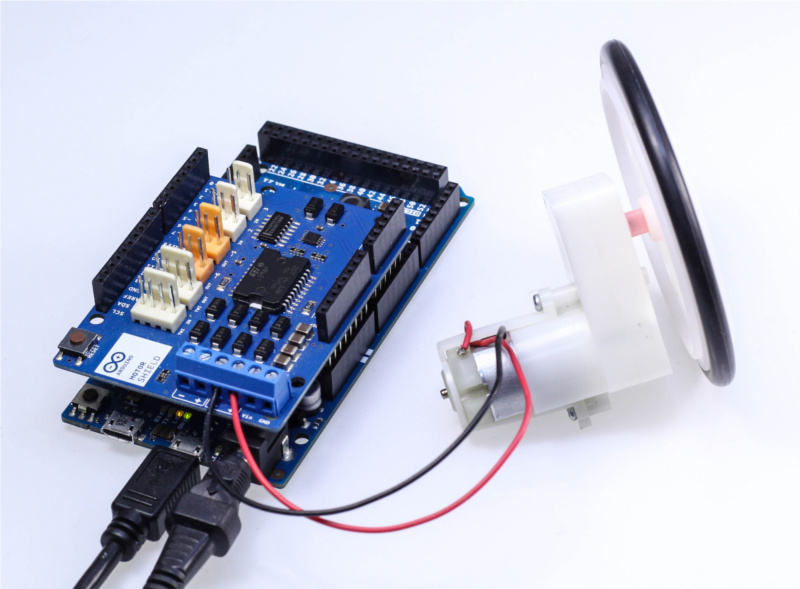

## Hardware Required

- Arduino Due
- Arduino Motor Shield
- DC motor
- Wall wart power supply

## Circuit

To build the circuit you need to mount the Arduino Motor Shield on top of the Arduino Due. Then you have to connect the two wires that comes out of the DC motor to the screw drivers terminals of the Motor Shield channel A. Last thing connect your wall wart power supply adapter to the DC connector of the Arduino Due. You must choose it respecting the voltage requirements of your DC motor. With the fan that we used in this example we provided 12V to the board.

Then plug your Arduino board into your computer, start the Arduino IDE 1.5, and enter the code below.



Arduino Due, Motor Shield and fan connected together.

## Code

```arduino

const int
PWM_A   = 3,
DIR_A   = 12,
BRAKE_A = 9,
SNS_A   = A0;


void setup() {
  // Configure the A output
  pinMode(BRAKE_A, OUTPUT);  // Brake pin on channel A
  pinMode(DIR_A, OUTPUT);    // Direction pin on channel A

  // Open Serial communication
  Serial.begin(9600);
  Serial.println("Motor shield DC motor Test:\n");
}

void loop() {

// Set the outputs to run the motor forward

  digitalWrite(BRAKE_A, LOW);  // setting brake LOW disable motor brake
  digitalWrite(DIR_A, HIGH);   // setting direction to HIGH the motor will spin forward

  analogWrite(PWM_A, 255);     // Set the speed of the motor, 255 is the maximum value

  delay(5000);                 // hold the motor at full speed for 5 seconds
  Serial.print("current consumption at full speed: ");
  Serial.println(analogRead(SNS_A));

// Brake the motor

  Serial.println("Start braking\n");
  // raising the brake pin the motor will stop faster than the stop by inertia
  digitalWrite(BRAKE_A, HIGH);  // raise the brake
  delay(5000);

// Set the outputs to run the motor backward

  Serial.println("Backward");
  digitalWrite(BRAKE_A, LOW);  // setting againg the brake LOW to disable motor brake
  digitalWrite(DIR_A, LOW);    // now change the direction to backward setting LOW the DIR_A pin

  analogWrite(PWM_A, 255);     // Set the speed of the motor

  delay(5000);
  Serial.print("current consumption backward: ");
  Serial.println(analogRead(SNS_A));

  // now stop the motor by inertia, the motor will stop slower than with the brake function
  analogWrite(PWM_A, 0);       // turn off power to the motor

  Serial.print("current brake: ");
  Serial.println(analogRead(A0));
  Serial.println("End of the motor shield test with DC motors. Thank you!");


  while(1);
}
```
