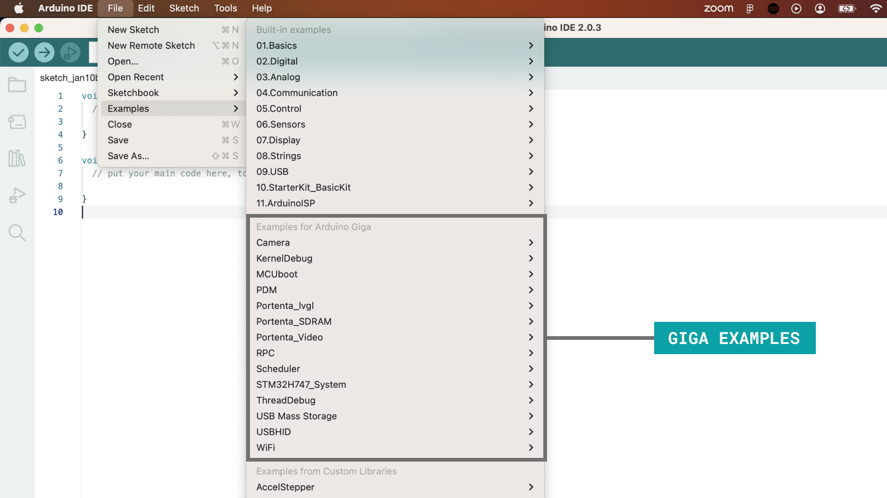

To use the [Arduino GIGA R1 WiFi](/hardware/giga-r1-wifi) board, you will need to install the GIGA board package, which is part of the [Arduino Core for mbed devices](https://github.com/arduino/ArduinoCore-mbed).

To install it, you will need a version of the Arduino IDE, which you can download from the [Arduino Software page](). In this guide, we will use the latest version of the IDE (2.0.x).

## Software & Hardware Needed

- [Arduino GIGA R1 WiFi](/hardware/giga-r1-wifi)
- [Arduino IDE](https://docs.arduino.cc/software/ide-v2)

***You can also use the [Web Editor](https://create.arduino.cc/editor) which comes with all Arduino boards pre-installed.*** 

## Download & Install IDE

1. First, we need to download the Arduino IDE, which can be done from the [Arduino Software page](https://www.arduino.cc/en/software/).
2. Install the Arduino IDE on your local machine.
3. Open the Arduino IDE.

## Install Board Package

To install the GIGA board package, open the "Board Manager" from the menu to the left. Search for **"GIGA"** and install the latest version (or the version you want to use).

You should now be able to select your board in the board selector. You will need to have your board connected to your computer via the USB-C connector at this point.

Congratulations, you have now successfully installed the GIGA board package via the Arduino IDE.

## Compile & Upload Sketches

To compile and upload sketches, you can use the:
- **Checkmark** for compiling code.
- **Right arrow** to upload code.

There are several examples available for the GIGA R1 board, which can be accessed directly in the IDE, through **File > Examples**. These examples can be used directly without external libraries.

## Summary

In this tutorial, we have installed the GIGA board package, using the Arduino IDE.

For any issues regarding the GIGA board package, please refer to the [Arduino Core for mbed devices](https://github.com/arduino/ArduinoCore-mbed).
