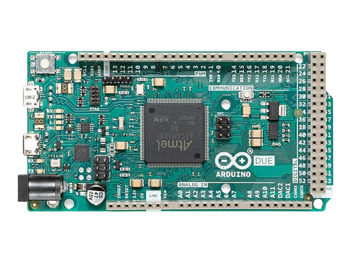
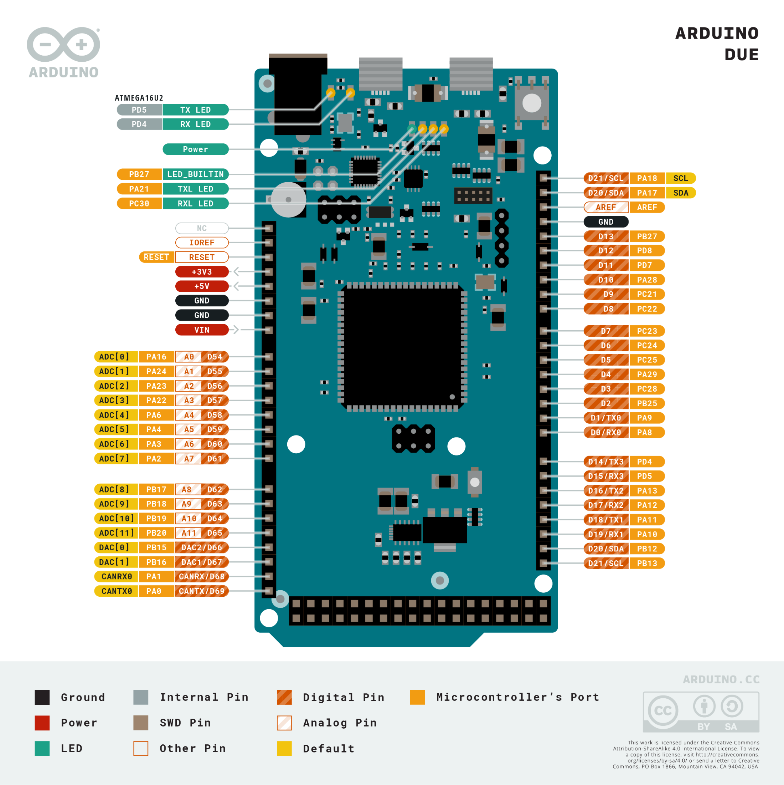
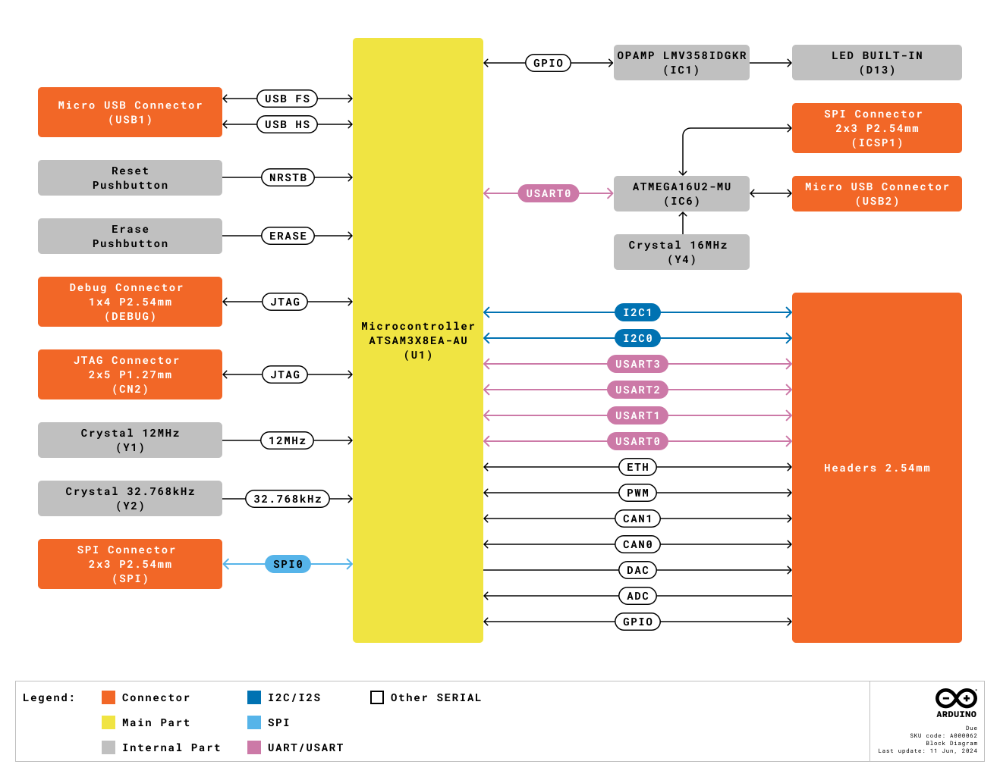
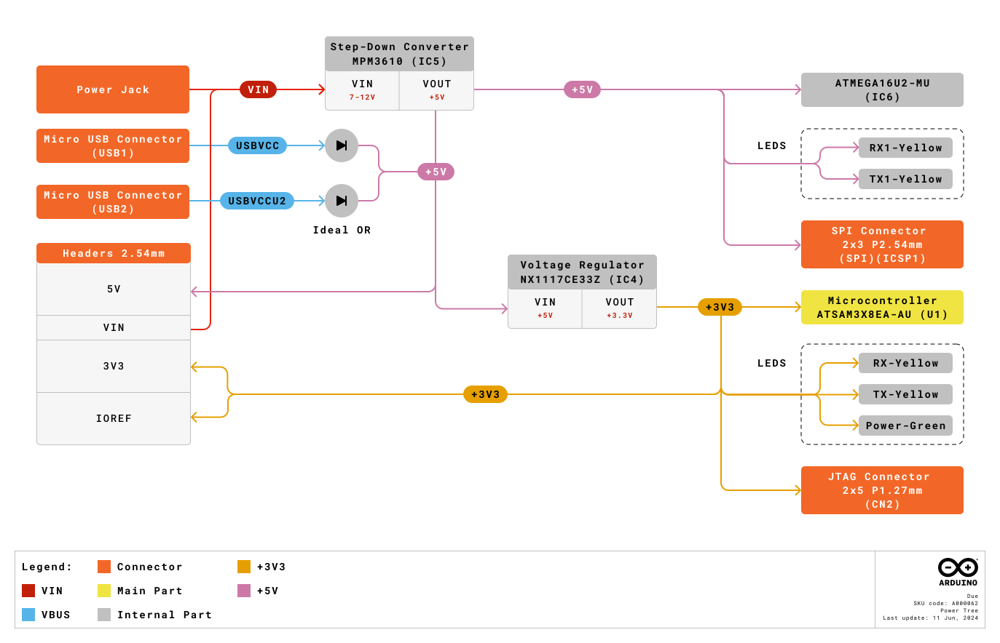
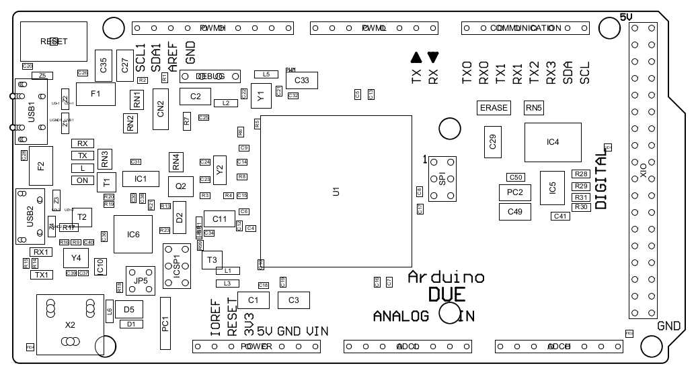
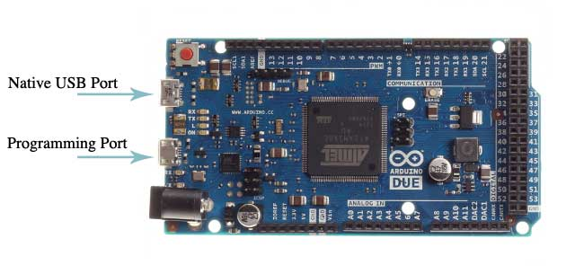
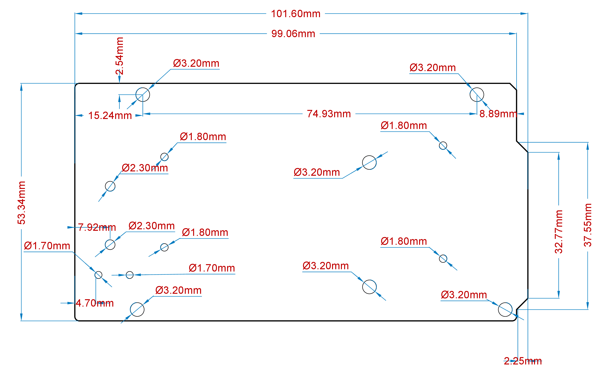
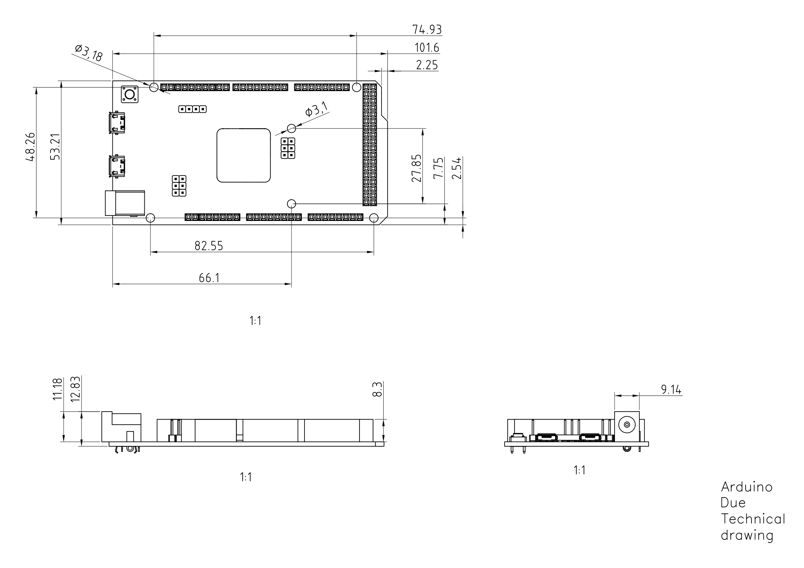

# Description

The Arduino Due is a groundbreaking microcontroller board featuring the Atmel SAM3X8E ARM Cortex-M3 CPU, making it the first Arduino board built around a 32-bit ARM core microcontroller. With its 54x digital input/output pins, 12x analog inputs, 4x UARTs, USB OTG capability, and 84 MHz clock, the Due offers enhanced performance and versatility for a wide range of projects. Compatible with all Arduino shields designed for operation at 3.3 V and compliant with the 1.0 Arduino pinout standard, the Due is a powerful tool for both beginners and experienced makers alike.

# Target Areas

Embedded Systems Development, Robotics, 3D Printing, CNC Machines, Prototyping

# Contents
## Application Examples

The Arduino Due combines the performance of the Atmel SAM3X8E microcontroller with the flexibility of the Arduino platform, offering a versatile solution for developers, hobbyists, and professionals alike. With its 32-bit architecture and clock speed of 84 MHz, the Due delivers robust performance for demanding applications.

- **Embedded Systems Development:** The Arduino Due can be utilized to create a real-time data acquisition system for monitoring and analyzing environmental parameters in industrial settings. By interfacing sensors such as temperature, humidity, and pressure sensors with the Due's abundant I/O pins, developers can capture real-time data and process it using the Due's powerful microcontroller. The system can then transmit this data wirelessly or via USB to a host computer for analysis, allowing for continuous monitoring and remote management of critical processes.

- **Robotics:** The Arduino Due can serve as the brain of an autonomous mobile robot capable of navigating and interacting with its environment. By integrating sensors such as ultrasonic range finders, gyroscopes, and encoders, developers can equip the robot with perception capabilities to sense its surroundings and detect obstacles. Using the Due's abundant I/O pins and powerful processing capabilities, algorithms for localization, mapping, and path planning can be implemented to enable autonomous navigation. Additionally, actuators such as motors or servos can be controlled by the Due to execute motion commands, allowing the robot to move and manipulate objects in its environment autonomously.

- **3D Printing & CNC Machines:** The Arduino Due can function as a versatile controller for DIY projects. By interfacing stepper motor drivers and end-stop switches with the Due's numerous I/O pins, enthusiasts can create their own 3D printers or CNC machines. The Due's high-speed processing capabilities enable precise control of stepper motors for accurate positioning and movement.

- **Prototyping:** The Arduino Due serves as an invaluable tool for quickly iterating and testing new ideas for IoT devices. By leveraging the Due's extensive I/O capabilities and compatibility with various sensors, communication modules, and actuators, developers can rapidly assemble and test prototypes of IoT devices. Whether it is a smart home sensor node, a weather station, or a remote monitoring system, the Arduino Due provides a flexible platform for integrating components, writing firmware, and validating functionality. With the Due's support for Arduino libraries and easy-to-use development environment, prototypers can focus on innovation and experimentation, accelerating the process of bringing ideas to fruition.

## Features

### General Specifications Overview

The Arduino Due is a versatile microcontroller board designed for a wide range of applications. Powered by the Atmel SAM3X8E ARM Cortex-M3 CPU, it offers high performance and a robust set of features, making it suitable for complex projects. The Due's 32-bit architecture provides enhanced processing capabilities compared to traditional Arduino boards. Designed with a similar form factor to the Arduino® Mega, it maintains compatibility with most Arduino shields through its extensive set of I/O pins and headers. The following table summarizes the board's main features.

| Feature               | Description                                                                                |
| --------------------- | ------------------------------------------------------------------------------------------ |
| Microcontroller       | **Atmel SAM3X8E ARM Cortex-M3**  32-bit ARM Cortex-M3 / 84 MHz Clock speed                 |
| Memory                | **SAM3X** 512 KB Flash / 96 KB SRAM (divided into two banks: 64 KB and 32 KB)              |
| USB-to-serial         | **ATmega16U2** connected to the SAM3X hardware UART                                        |
| Digital Inputs        | Digital Inputs not 5 V compatible (x54)                                                    |
| Analog Inputs         | The Due's analog inputs pins measure from ground to a maximum value of 3.3 V (x12)         |
| PWM Pins              | PWM Pins with 8 bits resolution (x12)                                                      |
| Communication         | UART (x4), I2C (x2), SPI (x1 SPI header),  Native USB port (x1), Programming USB port (x1) |
| Power                 | Input voltage (VIN): 7-12 VDC / DC Current per I/O Pin: 8 mA                               |
| Dimensions            | 101.6 mm x 53.34 mm                                                                        |
| Weight                | 36 g                                                                                       |
| Operating Temperature | -40 °C to +85 °C                                                                           |
| Certifications        | CE/RED, UKCA, FCC, IC, RCM, RoHS, REACH, WEEE                                              |

### Microcontroller

| Component                | Details                                                                                        |
| ------------------------ | ---------------------------------------------------------------------------------------------- |
| Atmel SAM3X8E            | 32-bit ARM Cortex-M3 at 84 MHz                                                                 |
| Flash Memory             | 512 KB                                                                                         |
| Programming Memory       | 96 KB SRAM (divided into two banks: 64 KB and 32 KB)                                           |

### Inputs

| Characteristics               | Details                               |
| ----------------------------- | ------------------------------------- |
| Number of inputs              | 54x digital inputs, 12x analog inputs |
| Inputs overvoltage protection | Yes                                   |
| Antipolarity protection       | Yes                                   |

### Outputs

| Characteristics                       | Details                                             |
| ------------------------------------- | --------------------------------------------------- |
| DAC1 and DAC2                         | True analog output 12-bits resolution (4096 levels) |
| PWM outputs                           | 12x PWM outputs                                     |

## Accessories

- USB Cable Type-A Male to Micro Type-B Male (Not included)

## Related Products

- Arduino Mega Proto Shield Rev3 (A000080)
- Arduino 4 Relays Shield (A000110)
- Arduino Motor Shield Rev3 (A000079)

## Rating
### Recommended Operating Conditions

| Symbol          | Description                      | Min                | Typ | Max                | Unit |
| --------------- | -------------------------------- | ------------------ | --- | ------------------ | ---- |
| VIN  | Input voltage from VIN pad       | 6.0                | 7.0 | 16                 | V    |
| VUSB | Input voltage from USB connector | 4.8                | 5.0 | 5.5                | V    |
| VDD  | Input high-level voltage         | 0.7*VDD |     | VDD     | V    |
| VIL  | Input low-level voltage          | 0                  |     | 0.3*VDD | V    |
| TOP  | Operating Temperature            | -40                | 25  | 85                 | °C   |

**Note:** VDD controls the logic level and is connected to the 3.3 V power rail. VAREF is for the analog logic.

### Power Specification

| Property          | Min | Typ | Max | Unit |
| ----------------- | --- | --- | --- | ---- |
| Supply voltage    | 7.0 | -   | 12  | V    |
| Permissible range | 6.0 | -   | 16  | V    |

<strong>Safety Note:</strong> Unlike most traditional Arduino boards, the Arduino Due board runs at 3.3 V. Keep in mind the maximum voltage that the I/O pins can tolerate is 3.3 V. Applying voltages higher than 3.3 V to any I/O pin could damage the board.

### Current Consumption

| Parameter                                       | Symbol         | Min | Typ | Max | Unit |
| ----------------------------------------------- | -------------- | --- | --- | --- | ---- |
| Normal Mode Current Consumption                 | INM | 130 | --- | 800 | mA   |

## Functional Overview

### Pinout

The Arduino Due pinout is shown in the following figure.

<strong>Safety Note:</strong> Disconnect power before board modifications to avoid short-circuiting.

### Full Pinout Table

The full pinout of the Arduino Due is available in the following tables.

#### Board's 24-Pin Header

| Pin | Function | Type    | Description                                              |
| --- | -------- | ------- | -------------------------------------------------------- |
| 1   | NC       | NC      | Not Connected                                            |
| 2   | IOREF    | IOREF   | Reference for digital logic voltage - connected to 3.3 V |
| 3   | Reset    | Reset   | Reset                                                    |
| 4   | +3V3     | Power   | +3V3 Power Rail                                          |
| 5   | +5V      | Power   | +5V Power Rail                                           |
| 6   | GND      | Power   | Ground                                                   |
| 7   | GND      | Power   | Ground                                                   |
| 8   | VIN      | Power   | Voltage Input                                            |
| 9   | A0       | Analog  | Analog input 0 / GPIO                                    |
| 10  | A1       | Analog  | Analog input 1 / GPIO                                    |
| 11  | A2       | Analog  | Analog input 2 / GPIO                                    |
| 12  | A3       | Analog  | Analog input 3 / GPIO                                    |
| 13  | A4       | Analog  | Analog input 4 / GPIO                                    |
| 14  | A5       | Analog  | Analog input 5 / GPIO                                    |
| 15  | A6       | Analog  | Analog input 6 / GPIO                                    |
| 16  | A7       | Analog  | Analog input 7 / GPIO                                    |
| 17  | A8       | Analog  | Analog input 8 / GPIO                                    |
| 18  | A9       | Analog  | Analog input 9 / GPIO                                    |
| 19  | A10      | Analog  | Analog input 10 / GPIO                                   |
| 20  | A11      | Analog  | Analog input 11 / GPIO                                   |
| 21  | DAC0     | Analog  | Digital to Analog Converter 0                            |
| 22  | DAC1     | Analog  | Digital to Analog Converter 1                            |
| 23  | CANRX    | Digital | CAN Bus Receiver                                         |
| 24  | CANTX    | Digital | CAN Bus Transmitter                                      |

<caption>Board's 24-Pin Header pinout</caption>

#### Board's 26-Pin Header

| Pin | Function | Type    | Description                                       |
| --- | -------- | ------- | ------------------------------------------------- |
| 1   | D21/SCL1 | Digital | GPIO 21 / I2C 1 Clock                             |
| 2   | D20/SDA1 | Digital | GPIO 20 / I2C 1 Dataline                          |
| 3   | AREF     | Digital | Analog Reference Voltage                          |
| 4   | GND      | Power   | Ground                                            |
| 5   | D13/SCK  | Digital | GPIO 13 / SPI Clock (PWM~)                        |
| 6   | D12/CIPO | Digital | GPIO 12 / SPI Controller In Peripheral Out (PWM~) |
| 7   | D11/COPI | Digital | GPIO 11 / SPI Controller Out Peripheral In (PWM~) |
| 8   | D10/CS   | Digital | GPIO 10 / SPI Chip Select (PWM~)                  |
| 9   | D9/SDA2  | Digital | GPIO 9 / I2C 2 Dataline (PWM~)                    |
| 10  | D8/SCL2  | Digital | GPIO 8 / I2C 2 Clockline (PWM~)                   |
| 11  | D7       | Digital | GPIO 7 (PWM~)                                     |
| 12  | D6       | Digital | GPIO 6 (PWM~)                                     |
| 13  | D5       | Digital | GPIO 5 (PWM~)                                     |
| 14  | D4       | Digital | GPIO 4 (PWM~)                                     |
| 15  | D3       | Digital | GPIO 3 (PWM~)                                     |
| 16  | D2       | Digital | GPIO 2 (PWM~)                                     |
| 17  | D1/TX0   | Digital | GPIO 1 / Serial 0 Transmitter                     |
| 18  | D0/TX0   | Digital | GPIO 0 / Serial 0 Receiver                        |
| 19  | D14/TX3  | Digital | GPIO 14 / Serial 3 Transmitter                    |
| 20  | D15/RX3  | Digital | GPIO 15 / Serial 3 Receiver                       |
| 21  | D16/TX2  | Digital | GPIO 16 / Serial 2 Transmitter                    |
| 22  | D17/RX2  | Digital | GPIO 17 / Serial 2 Receiver                       |
| 23  | D18/TX1  | Digital | GPIO 18 / Serial 1 Transmitter                    |
| 24  | D19/RX1  | Digital | GPIO 19 / Serial 1 Receiver                       |
| 25  | D20/SDA  | Digital | GPIO 20 / I2C 0 Dataline                          |
| 26  | D21/SCL  | Digital | GPIO 21 / I2C 0 Clock                             |

<caption>Board's 26-Pin Header pinout</caption>

#### SPI

The board provides an SPI interface and full access to its pinout as it can be seen in the following table.

| Pin | Function | Type     | Description                  |
|-----|----------|----------|------------------------------|
| 1   | CIPO     | Internal | Controller In Peripheral Out |
| 2   | +5V      | Internal | Power Supply of 5V           |
| 3   | SCK      | Internal | Serial Clock                 |
| 4   | COPI     | Internal | Controller Out Peripheral In |
| 5   | RESET    | Internal | Reset                        |
| 6   | GND      | Internal | Ground                       |

<caption>SPI pinout</caption>

#### Digital Pins D22 - D53 LHS

| Pin | Function | Type    | Description    |
|-----|----------|---------|----------------|
| 1   | +5V      | Power   | +5V Power Rail |
| 2   | D22      | Digital | GPIO 22        |
| 3   | D24      | Digital | GPIO 24        |
| 4   | D26      | Digital | GPIO 26        |
| 5   | D28      | Digital | GPIO 28        |
| 6   | D30      | Digital | GPIO 30        |
| 7   | D32      | Digital | GPIO 32        |
| 8   | D34      | Digital | GPIO 34        |
| 9   | D36      | Digital | GPIO 36        |
| 10  | D38      | Digital | GPIO 38        |
| 11  | D40      | Digital | GPIO 40        |
| 12  | D42      | Digital | GPIO 42        |
| 13  | D44      | Digital | GPIO 44        |
| 14  | D46      | Digital | GPIO 46        |
| 15  | D48      | Digital | GPIO 48        |
| 16  | D50      | Digital | GPIO 50        |
| 17  | D52      | Digital | GPIO 52        |
| 18  | GND      | Power   | Ground         |

<caption>D22 - D53 LHS pinout</caption>

#### Digital Pins D22 - D53 RHS

| Pin | Function | Type    | Description    |
|-----|----------|---------|----------------|
| 1   | +5V      | Power   | +5V Power Rail |
| 2   | D23      | Digital | GPIO 23        |
| 3   | D25      | Digital | GPIO 25        |
| 4   | D27      | Digital | GPIO 27        |
| 5   | D29      | Digital | GPIO 29        |
| 6   | D31      | Digital | GPIO 31        |
| 7   | D33      | Digital | GPIO 33        |
| 8   | D35      | Digital | GPIO 35        |
| 9   | D37      | Digital | GPIO 37        |
| 10  | D39      | Digital | GPIO 39        |
| 11  | D41      | Digital | GPIO 41        |
| 12  | D43      | Digital | GPIO 43        |
| 13  | D45      | Digital | GPIO 45        |
| 14  | D47      | Digital | GPIO 47        |
| 15  | D49      | Digital | GPIO 49        |
| 16  | D51      | Digital | GPIO 51        |
| 17  | D53      | Digital | GPIO 53        |
| 18  | GND      | Power   | Ground         |

<caption>D22 - D53 RHS pinout</caption>

#### JTAG Pins

The board provides access to the debugging interface using the JTAG pins as it can be seen in the following table.

| Pin | Function | Type    | Description      |
|-----|----------|---------|------------------|
| 1   | Reset    | Reset   | Reset            |
| 2   | GND      | Power   | GROUND           |
| 3   | TDI      | Digital | Test Data In     |
| 4   | N/C      |    -    | Not Connected    |
| 5   | TDO      | Digital | Test Data Out    |
| 6   | GND      | Power   | GROUND           |
| 7   | TCK      | Digital | Test Clock       |
| 8   | GND      | Power   | GROUND           |
| 9   | TMS      | Digital | Test Mode Select |
| 10  | +3V3     | Power   | +3V3 Power Rail  |

<caption>Debugging's JTAG pinout</caption>

### Block Diagram

The block diagram with the main parts of the product can be checked in the following image:

### Power Supply

The Arduino Due can be powered in multiple ways:

- USB Type-B port (Native port and Programming port).
- Using an external voltage source connected to VIN pin, which has a recommended voltage range of 7-12 VCC.
- The Power Jack: The Due can be powered using a DC power supply connected to the power jack, which accepts a voltage range of 7 to 12 V.

**It is essential to note that the Arduino Due operates at 3.3 V, so any external power source must be regulated to this voltage level. Additionally, the power supply should be able to provide sufficient current for the board's operation and any connected peripherals.**

### Product Topology

In the following drawing you can see the main integrated circuits and passive components of the Arduino Due board.

| **Ref.** | **Description**             |
| -------- | --------------------------- |
| U1       | Atmel SAM3X8E ARM Cortex-M3 |
| USB1     | Native USB port             |
| USB2     | Programming USB port        |
| X2       | Power Jack VIN 7-12 VCC     |
| ERASE    | ERASE Button                |
| RESET    | Reset Button                |
| DEBUG    | Debug JTAG pinnout          |
| SPI      | SPI pinout                  |
| ICSP1    | ICSPI1 Pinout               |

#### JTAG Connector

Debugging capabilities are integrated directly into the Arduino Due and are accessible via the 6-pin JTAG connector.

| Pin | Function | Type    | Description      |
|-----|----------|---------|------------------|
| 1   | Reset    | Reset   | Reset            |
| 2   | GND      | Power   | GROUND           |
| 3   | TDI      | Digital | Test Data In     |
| 4   | N/C      |    -    | Not Connected    |
| 5   | TDO      | Digital | Test Data Out    |
| 6   | GND      | Power   | GROUND           |
| 7   | TCK      | Digital | Test Clock       |
| 8   | GND      | Power   | GROUND           |
| 9   | TMS      | Digital | Test Mode Select |
| 10  | +3V3     | Power   | +3V3 Power Rail  |

<caption>JTAG pinout</caption>

#### Native USB Port

The Arduino Due's Native USB port features a USB Type-B connector. This port allows the board to communicate directly with a computer as a USB device, enabling functionalities such as USB host/device capabilities and USB OTG (On-The-Go) functionality.

#### Programming USB Port

This port allows the board to be programmed and powered via a USB connection to a computer. It facilitates serial communication between the Arduino Due and the computer, enabling the uploading of sketches and interaction with the Arduino IDE. The port is connected to the ATmega16U2 microcontroller, which acts as a USB-to-serial converter, simplifying the programming process. When connected to a computer, the Arduino IDE recognizes the board as a COM port, enabling seamless communication for programming and debugging purposes.

#### Board's 24-Pin Header Connector

The 24-pin header connector provides a range of interfaces and general-purpose pins essential for various applications

These pins offer a range of functionalities, including analog and digital input/output, power supply connections, analog-to-digital, digital-to-analog conversion and CAN bus communication.

| Pin | Function | Type    | Description                                             |
| --- | -------- | ------- | ------------------------------------------------------- |
| 1   | NC       | NC      | Not Connected                                           |
| 2   | IOREF    | IOREF   | Reference for digital logic voltage - connected to 3.3V |
| 3   | Reset    | Reset   | Reset                                                   |
| 4   | +3V3     | Power   | +3V3 Power Rail                                         |
| 5   | +5V      | Power   | +5V Power Rail                                          |
| 6   | GND      | Power   | Ground                                                  |
| 7   | GND      | Power   | Ground                                                  |
| 8   | VIN      | Power   | Voltage Input                                           |
| 9   | A0       | Analog  | Analog input 0 / GPIO                                   |
| 10  | A1       | Analog  | Analog input 1 / GPIO                                   |
| 11  | A2       | Analog  | Analog input 2 / GPIO                                   |
| 12  | A3       | Analog  | Analog input 3 / GPIO                                   |
| 13  | A4       | Analog  | Analog input 4 / GPIO                                   |
| 14  | A5       | Analog  | Analog input 5 / GPIO                                   |
| 15  | A6       | Analog  | Analog input 6 / GPIO                                   |
| 16  | A7       | Analog  | Analog input 7 / GPIO                                   |
| 17  | A8       | Analog  | Analog input 8 / GPIO                                   |
| 18  | A9       | Analog  | Analog input 9 / GPIO                                   |
| 19  | A10      | Analog  | Analog input 10 / GPIO                                  |
| 20  | A11      | Analog  | Analog input 11 / GPIO                                  |
| 21  | DAC0     | Analog  | Digital to Analog Converter 0                           |
| 22  | DAC1     | Analog  | Digital to Analog Converter 1                           |
| 23  | CANRX    | Digital | CAN Bus Receiver                                        |
| 24  | CANTX    | Digital | CAN Bus Transmitter                                     |

<caption>Board's 24-Pin Header pinout</caption>

#### Board's 26-Pin Header Connector

The 26-pin header connector on the Arduino Due offers a comprehensive set of interfaces and versatile pins crucial for diverse applications

These pins offer a range of functionalities, including digital input/output, serial communication, PWM (Pulse Width Modulation) outputs, and I2C (Inter-Integrated Circuit) communication.

| Pin | Function | Type    | Description                                       |
| --- | -------- | ------- | ------------------------------------------------- |
| 1   | D21/SCL1 | Digital | GPIO 21 / I2C 1 Clock                             |
| 2   | D20/SDA1 | Digital | GPIO 20 / I2C 1 Dataline                          |
| 3   | AREF     | Digital | Analog Reference Voltage                          |
| 4   | GND      | Power   | Ground                                            |
| 5   | D13/SCK  | Digital | GPIO 13 / SPI Clock (PWM~)                        |
| 6   | D12/CIPO | Digital | GPIO 12 / SPI Controller In Peripheral Out (PWM~) |
| 7   | D11/COPI | Digital | GPIO 11 / SPI Controller Out Peripheral In (PWM~) |
| 8   | D10/CS   | Digital | GPIO 10 / SPI Chip Select (PWM~)                  |
| 9   | D9/SDA2  | Digital | GPIO 9 / I2C 2 Dataline (PWM~)                    |
| 10  | D8/SCL2  | Digital | GPIO 8 / I2C 2 Clockline (PWM~)                   |
| 11  | D7       | Digital | GPIO 7 (PWM~)                                     |
| 12  | D6       | Digital | GPIO 6 (PWM~)                                     |
| 13  | D5       | Digital | GPIO 5 (PWM~)                                     |
| 14  | D4       | Digital | GPIO 4 (PWM~)                                     |
| 15  | D3       | Digital | GPIO 3 (PWM~)                                     |
| 16  | D2       | Digital | GPIO 2 (PWM~)                                     |
| 17  | D1/TX0   | Digital | GPIO 1 / Serial 0 Transmitter                     |
| 18  | D0/TX0   | Digital | GPIO 0 / Serial 0 Receiver                        |
| 19  | D14/TX3  | Digital | GPIO 14 / Serial 3 Transmitter                    |
| 20  | D15/RX3  | Digital | GPIO 15 / Serial 3 Receiver                       |
| 21  | D16/TX2  | Digital | GPIO 16 / Serial 2 Transmitter                    |
| 22  | D17/RX2  | Digital | GPIO 17 / Serial 2 Receiver                       |
| 23  | D18/TX1  | Digital | GPIO 18 / Serial 1 Transmitter                    |
| 24  | D19/RX1  | Digital | GPIO 19 / Serial 1 Receiver                       |
| 25  | D20/SDA  | Digital | GPIO 20 / I2C 0 Dataline                          |
| 26  | D21/SCL  | Digital | GPIO 21 / I2C 0 Clock                             |

<caption>Board's 26-Pin Header pinout</caption>

#### SPI

These pins facilitate communication between the Arduino Due and external SPI devices 

| Pin | Function | Type     | Description                  |
| --- | -------- | -------- | ---------------------------- |
| 1   | CIPO     | Internal | Controller In Peripheral Out |
| 2   | +5V      | Internal | Power Supply of 5 V          |
| 3   | SCK      | Internal | Serial Clock                 |
| 4   | COPI     | Internal | Controller Out Peripheral In |
| 5   | RESET    | Internal | Reset                        |
| 6   | GND      | Internal | Ground                       |

<caption>SPI pinout</caption>

#### D22 to D53 on Left and Right Side

These digital pins provide a wide range of GPIO (General Purpose Input/Output) capabilities for interfacing with external sensors, actuators, and other digital devices in Arduino Due projects. 

| Pin | Function | Type    | Description    |
|-----|----------|---------|----------------|
| 1   | +5V      | Power   | +5V Power Rail |
| 2   | D22      | Digital | GPIO 22        |
| 3   | D24      | Digital | GPIO 24        |
| 4   | D26      | Digital | GPIO 26        |
| 5   | D28      | Digital | GPIO 28        |
| 6   | D30      | Digital | GPIO 30        |
| 7   | D32      | Digital | GPIO 32        |
| 8   | D34      | Digital | GPIO 34        |
| 9   | D36      | Digital | GPIO 36        |
| 10  | D38      | Digital | GPIO 38        |
| 11  | D40      | Digital | GPIO 40        |
| 12  | D42      | Digital | GPIO 42        |
| 13  | D44      | Digital | GPIO 44        |
| 14  | D46      | Digital | GPIO 46        |
| 15  | D48      | Digital | GPIO 48        |
| 16  | D50      | Digital | GPIO 50        |
| 17  | D52      | Digital | GPIO 52        |
| 18  | GND      | Power   | Ground         |

<caption>D22 - D53 LHS pinout</caption>

| Pin | Function | Type    | Description    |
|-----|----------|---------|----------------|
| 1   | +5V      | Power   | +5V Power Rail |
| 2   | D23      | Digital | GPIO 23        |
| 3   | D25      | Digital | GPIO 25        |
| 4   | D27      | Digital | GPIO 27        |
| 5   | D29      | Digital | GPIO 29        |
| 6   | D31      | Digital | GPIO 31        |
| 7   | D33      | Digital | GPIO 33        |
| 8   | D35      | Digital | GPIO 35        |
| 9   | D37      | Digital | GPIO 37        |
| 10  | D39      | Digital | GPIO 39        |
| 11  | D41      | Digital | GPIO 41        |
| 12  | D43      | Digital | GPIO 43        |
| 13  | D45      | Digital | GPIO 45        |
| 14  | D47      | Digital | GPIO 47        |
| 15  | D49      | Digital | GPIO 49        |
| 16  | D51      | Digital | GPIO 51        |
| 17  | D53      | Digital | GPIO 53        |
| 18  | GND      | Power   | Ground         |

<caption>D22 - D53 RHS pinout</caption>

## Device Operation

### Getting Started - IDE

If you want to program your Arduino Due while offline you need to install the Arduino® Desktop IDE **[1]**. To connect the Arduino Due to your computer, you will need a USB Type-B cable, which can also provide power to the board, as indicated by the LED (DL1).

### Getting Started - Arduino Cloud Editor

All Arduino boards, including this one, work out-of-the-box on the Arduino® Cloud Editor **[2]**, by just installing a simple plugin.

The Arduino Cloud Editor is hosted online, therefore it will always be up-to-date with the latest features and support for all boards. Follow **[3]** to start coding on the browser and upload your sketches onto your board.

### Getting Started - Arduino Cloud

All Arduino IoT enabled products are supported on Arduino Cloud which allows you to log, graph and analyze sensor data, trigger events, and automate your home or business.

### Online Resources

Now that you have gone through the basics of what you can do with the board you can explore the endless possibilities it provides by checking exciting projects on ProjectHub **[4]**, the Arduino Library Reference **[5]**, and the online store **[6]**; where you will be able to complement your board with sensors, actuators and more.

### Board Recovery

All Arduino boards have a built-in bootloader which allows flashing the board via USB. In case a sketch locks up the processor and the board is not reachable anymore via USB, it is possible to enter bootloader mode by double-tapping the reset button right after the power-up.

## Mechanical Information

The Arduino Due is a microcontroller board measuring 101.52 mm x 53.3 mm, featuring two USB-B connectors and a big quantity of GPIO pins headers.

### Board Dimensions

The Arduino Due board outline and mounting holes dimensions are shown in the figure below; all the dimensions are in mm.

### Board Connectors

Connectors of the Arduino Due are placed on the left side of the board; their placement is shown in the figure below. All the dimensions are in mm.

## Certifications

### Certifications Summary

| **Certification** | **Status** |
|:-----------------:|:----------:|
|  CE/RED (Europe)  |    Yes     |
|     UKCA (UK)     |    Yes     |
|     FCC (USA)     |    Yes     |
|    IC (Canada)    |    Yes     |
|  RCM (Australia)  |    Yes     |
|        RoHS       |    Yes     |
|       REACH       |    Yes     |
|        WEEE       |    Yes     |

### Declaration of Conformity CE DoC (EU)

We declare under our sole responsibility that the products above are in conformity with the essential requirements of the following EU Directives and therefore qualify for free movement within markets comprising the European Union (EU) and European Economic Area (EEA).

### Declaration of Conformity to EU RoHS & REACH 211 01/19/2021

Arduino boards are in compliance with RoHS 2 Directive 2011/65/EU of the European Parliament and RoHS 3 Directive 2015/863/EU of the Council of 4 June 2015 on the restriction of the use of certain hazardous substances in electrical and electronic equipment.

| Substance                              | **Maximum limit (ppm)** |
|----------------------------------------|-------------------------|
| Lead (Pb)                              | 1000                    |
| Cadmium (Cd)                           | 100                     |
| Mercury (Hg)                           | 1000                    |
| Hexavalent Chromium (Cr6+)             | 1000                    |
| Poly Brominated Biphenyls (PBB)        | 1000                    |
| Poly Brominated Diphenyl ethers (PBDE) | 1000                    |
| Bis(2-Ethylhexyl) phthalate (DEHP)     | 1000                    |
| Benzyl butyl phthalate (BBP)           | 1000                    |
| Dibutyl phthalate (DBP)                | 1000                    |
| Diisobutyl phthalate (DIBP)            | 1000                    |

Exemptions: No exemptions are claimed.

Arduino Boards are fully compliant with the related requirements of European Union Regulation (EC) 1907 /2006 concerning the Registration, Evaluation, Authorization and Restriction of Chemicals (REACH). We declare none of the SVHCs (https://echa.europa.eu/web/guest/candidate-list-table), the Candidate List of Substances of Very High Concern for authorization currently released by ECHA, is present in all products (and also package) in quantities totaling in a concentration equal or above 0.1%. To the best of our knowledge, we also declare that our products do not contain any of the substances listed on the "Authorization List" (Annex XIV of the REACH regulations) and Substances of Very High Concern (SVHC) in any significant amounts as specified by the Annex XVII of Candidate list published by ECHA (European Chemical Agency) 1907 /2006/EC.

### Conflict Minerals Declaration

As a global supplier of electronic and electrical components, Arduino is aware of our obligations with regard to laws and regulations regarding Conflict Minerals, specifically the Dodd-Frank Wall Street Reform and Consumer Protection Act, Section 1502. Arduino does not directly source or process conflict minerals such as Tin, Tantalum, Tungsten, or Gold. Conflict minerals are contained in our products in the form of solder or as a component in metal alloys. As part of our reasonable due diligence, Arduino has contacted component suppliers within our supply chain to verify their continued compliance with the regulations. Based on the information received thus far we declare that our products contain Conflict Minerals sourced from conflict-free areas.

### FCC Caution

Any Changes or modifications not expressly approved by the party responsible for compliance could void the user’s authority to operate the equipment.

This device complies with part 15 of the FCC Rules. Operation is subject to the following two conditions:

(1) This device may not cause harmful interference

(2) this device must accept any interference received, including interference that may cause undesired operation.

**FCC RF Radiation Exposure Statement:**

1. This Transmitter must not be co-located or operating in conjunction with any other antenna or transmitter.

2. This equipment complies with RF radiation exposure limits set forth for an uncontrolled environment.

3. This equipment should be installed and operated with a minimum distance of 20 cm between the radiator & your body.

**Note:** This equipment has been tested and found to comply with the limits for a Class B digital
device, pursuant to part 15 of the FCC Rules. These limits are designed to provide
reasonable protection against harmful interference in a residential installation. This equipment
generates, uses and can radiate radio frequency energy and, if not installed and used in
accordance with the instructions, may cause harmful interference to radio communications.
However, there is no guarantee that interference will not occur in a particular installation. If
this equipment does cause harmful interference to radio or television reception, which can be
determined by turning the equipment off and on, the user is encouraged to try to correct the
interference by one or more of the following measures:
- Reorient or relocate the receiving antenna.
- Increase the separation between the equipment and receiver.
- Connect the equipment into an outlet on a circuit different from that to which the
receiver is connected.
- Consult the dealer or an experienced radio/TV technician for help.

English:
User manuals for license-exempt radio apparatus shall contain the following or equivalent notice in a conspicuous location in the user manual or alternatively on the device or both. This device complies with Industry Canada license-exempt RSS standard(s). Operation is subject to the following two conditions:

(1) this device may not cause interference

(2) this device must accept any interference, including interference that may cause undesired operation of the device.

French:
Le présent appareil est conforme aux CNR d’Industrie Canada applicables aux appareils radio exempts de licence. L’exploitation est autorisée aux deux conditions suivantes:

(1) l’ appareil nedoit pas produire de brouillage

(2) l’utilisateur de l’appareil doit accepter tout brouillage radioélectrique subi, même si le brouillage est susceptible d’en compromettre le fonctionnement.

**IC SAR Warning:**

English:
This equipment should be installed and operated with a minimum distance of 20 cm between the radiator and your body.

French:
Lors de l’ installation et de l’ exploitation de ce dispositif, la distance entre le radiateur et le corps est d ’au moins 20 cm.

**Important:** The operating temperature of the EUT can’t exceed 85℃ and shouldn’t be lower than -40℃.

Hereby, Arduino S.r.l. declares that this product is in compliance with essential requirements and other relevant provisions of Directive 2014/53/EU. This product is allowed to be used in all EU member states.

# Company Information

| Company name    | Arduino SRL                                   |
|-----------------|-----------------------------------------------|
| Company Address | Via Andrea Appiani, 25 - 20900 MONZA（Italy)  |

# Reference Documentation

| Ref                       | Link                                                                                                                                                                                           |
| ------------------------- | ---------------------------------------------------------------------------------------------------------------------------------------------------------------------------------------------- |
| Arduino IDE (Desktop)     | [https://www.arduino.cc/en/Main/Software](https://www.arduino.cc/en/Main/Software)                                                                                                             |
| Arduino IDE (Cloud)       | [https://create.arduino.cc/editor](https://create.arduino.cc/editor)                                                                                                                           |
| Cloud IDE Getting Started | [https://docs.arduino.cc/cloud/web-editor/tutorials/getting-started/getting-started-web-editor](https://docs.arduino.cc/cloud/web-editor/tutorials/getting-started/getting-started-web-editor) |
| Project Hub               | [https://create.arduino.cc/projecthub?by=part&part_id=11332&sort=trending](https://create.arduino.cc/projecthub?by=part&part_id=11332&sort=trending)                                           |
| Library Reference         | [https://github.com/arduino-libraries/](https://github.com/arduino-libraries/)                                                                                                                 |
| Online Store              | [https://store.arduino.cc/](https://store.arduino.cc/)                                                                                                                                         |

## Revision History

|  **Date**  | **Revision** |  **Changes**  |
| :--------: | :----------: | :-----------: |
| 12/06/2024 |      1       | First release |

# 中文 (ZH)

# 描述

Arduino Due 是一款开创性的微控制器板，采用 Atmel SAM3X8E ARM Cortex-M3 CPU，是首款围绕 32 位 ARM 内核微控制器构建的 Arduino 板。Due 具有 54 个数字输入/输出引脚、12 个模拟输入、4 个 UART、USB OTG 功能和 84 MHz 时钟，可为各种项目提供更强的性能和多功能性。Due 兼容所有工作电压为 3.3 V 的 Arduino 扩展板，并符合 1.0 Arduino 引脚布局标准，是初学者和经验丰富的创客们的强大工具。

# 目标领域

嵌入式系统开发、机器人技术、3D 打印、数控机床、原型设计

# 目录
## 应用示例

Arduino Due 集 Atmel SAM3X8E 微控制器的性能和 Arduino 平台的灵活性于一身，为开发人员、业余爱好者和专业人士提供了一种多功能解决方案。Due 采用 32 位架构，时钟频率为 84 MHz，可为要求苛刻的应用提供强大的性能。

- **嵌入式系统开发：** Arduino Due 可用于创建实时数据采集系统，以监测和分析工业环境参数。通过将温度、湿度和压力传感器等传感器与 Due 丰富的 I/O 引脚连接，开发人员可以捕获实时数据，并使用 Due 功能强大的微控制器进行处理。然后，系统可以通过无线或 USB 将这些数据传输到主机进行分析，从而实现对关键过程的持续监测和远程管理。

- **机器人技术：** Arduino Due 可作为自主移动机器人的大脑，能够导航并与环境互动。通过集成超声波测距仪、陀螺仪和编码器等传感器，开发人员可以为机器人配备感知能力，以感知周围环境并检测障碍物。利用 Due 丰富的 I/O 引脚和强大的处理能力，可以实施定位、绘图和路径规划算法，从而实现自主导航。此外，Due 还可控制电机或伺服器等执行器来执行运动指令，使机器人能够自主移动和操控环境中的物体。

- **3D 打印和数控机床：** Arduino Due 可作为 DIY 项目的多功能控制器。通过将步进电机驱动器和限位开关与 Due 的众多 I/O 引脚相连接，爱好者们可以制造自己的 3D 打印机或数控机床。Due 的高速处理能力可精确控制步进电机，实现精确定位和移动。

- **原型设计：** Arduino Due 是快速迭代和测试物联网设备新想法的宝贵工具。利用 Due 广泛的输入/输出功能以及与各种传感器、通信模块和执行器的兼容性，开发人员可以快速组装和测试物联网设备原型。无论是智能家居传感器节点、气象站还是远程监控系统，Arduino Due 都提供了一个灵活的平台，便于集成组件、编写固件和验证功能。凭借 Due 对 Arduino 库的支持和易于使用的开发环境，原型设计人员可以专注于创新和实验，加速将想法转化为现实的过程。

## 特点

### 一般规格概述

Arduino Due 是一款多功能微控制器板，专为各种应用而设计。它采用 Atmel SAM3X8E ARM Cortex-M3 CPU，性能卓越，功能强大，适用于复杂的项目。与传统的 Arduino 板相比，Due 的 32 位架构提供了更强的处理能力。它采用与 Arduino® Mega 相似的外形设计，通过丰富的 I/O 引脚和接头与大多数 Arduino 扩展板保持兼容。下表总结了该电路板的主要特点。

| 特点               | 描述                                                                                |
| --------------------- | ------------------------------------------------------------------------------------------ |
| 微控制器       | **Atmel SAM3X8E ARM Cortex-M3**  32 位 ARM Cortex-M3 / 84 MHz 时钟频率                 |
| 内存                | **SAM3X** 512 KB 闪存/ 96 KB SRAM（分为两个存储区：64 KB 和 32 KB）              |
| USB 转串行接口         | **ATmega16U2** 连接到 SAM3X 硬件 UART                                        |
| 数字输入        | 不兼容 5 V 的数字输入（x54）                                                    |
| 模拟输入         | Due 的模拟输入引脚从接地到 3.3 V 的最大值 (x12)         |
| PWM 引脚              | 分辨率为 8 位的 PWM 引脚（x12）                                                      |
| 通信         | UART (x4), I2C (x2), SPI (x1 SPI 接头),  原生 USB 端口（1个），编程 USB 端口（1个） |
| 电源                 | 输入电压 (VIN): 7-12 VDC / 每个 I/O 引脚的直流电流：8 mA                               |
| 尺寸            | 101.6 mm x 53.34 mm                                                                        |
| 重量                | 36 g                                                                                       |
| 工作温度 | -40 °C 至 +85 °C                                                                           |
| 认证        | CE/RED、UKCA、FCC、IC、RCM、RoHS、REACH、WEEE                                              |

### 微控制器

| 组件                | 详细信息                                                                                        |
| ------------------------ | ---------------------------------------------------------------------------------------------- |
| Atmel SAM3X8E            | 32 位 ARM Cortex-M3，时钟频率：84 MHz                                                                 |
| 闪存             | 512 KB                                                                                         |
| 编程内存       | 96 KB SRAM（分为两个存储区：64 KB 和 32 KB）                                           |

### 输入

| 特点               | 详细信息                               |
| ----------------------------- | ------------------------------------- |
| 输入数量              | 54 个数字输入，12 个模拟输入 |
| 输入过压保护 | 是                                   |
| 反极性保护       | 是                                   |

### 输出

| 特点                       | 详细信息                                             |
| ------------------------------------- | --------------------------------------------------- |
| DAC1 和 DAC2                         | 真值模拟输出 12 位分辨率（4096 个电平） |
| PWM 输出                           | 12 个 PWM 输出                                     |

## 配件

- USB 电缆 Type-A 公端转 Micro Type-B 公端（不包括在内）

## 相关产品

- Arduino Mega Proto Shield Rev3 (A000080) 
- Arduino 4 Relays Shield (A000110)
- Arduino Motor Shield Rev3 (A000079)

## 额定值
### 建议运行条件

| 符号          | 描述                      | 最小值                | 典型值 | 最大值                | 单位 |
| --------------- | -------------------------------- | ------------------ | --- | ------------------ | ---- |
| VIN  | 来自 VIN 焊盘的输入电压       | 6.0                | 7.0 | 16                 | V    |
| VUSB | 来自 USB 连接器的输入电压 | 4.8                | 5.0 | 5.5                | V    |
| VDD  | 输入高电平电压         | 0.7*VDD |     | VDD     | V    |
| VIL  | 输入低电平电压          | 0                  |     | 0.3*VDD | V    |
| TOP  | 工作温度            | -40                | 25  | 85                 | °C   |

**注：** VDD 控制逻辑电平并与 3.3 V 电源轨相连VAREF 用于模拟逻辑。

### 电源规格

| 特性          | 最小值 | 典型值 | 最大值 | 单位 |
| ----------------- | --- | --- | --- | ---- |
| 电源电压    | 7.0 | -   | 12  | V    |
| 允许范围 | 6.0 | -   | 16  | V    |

<strong>安全注意事项:</strong> 与大多数传统的 Arduino 电路板不同，Arduino Due 电路板工作电压为 3.3V。请注意，I/O 引脚能够承受的最大电压为 3.3V。为任何 I/O 引脚使用高于 3.3V 的电压可能会损坏电路板。

### 电流消耗

| 参数                                       | 符号         | 最小值 | 典型值 | 最大值 | 单位 |
| ----------------------------------------------- | -------------- | --- | --- | --- | ---- |
| 正常模式下的电流消耗                 | INM | 130 | --- | 800 | mA   |

## 功能概述

### 引脚布局

Arduino Due 的引脚布局如下图所示。

<strong>安全注意事项:</strong> 在修改电路板之前，请断开电源，以避免短路。

### 完整引脚配置表

Arduino Due 的完整引脚配置如下表所示。

#### 电路板的 24 引脚接头

| 引脚 | 功能 | 类型    | 描述                                              |
| --- | -------- | ------- | -------------------------------------------------------- |
| 1   | NC       | NC      | 未连接                                            |
| 2   | IOREF    | IOREF   | 数字逻辑电压参考 - 连接到 3.3 V |
| 3   | Reset    | 复位   | 复位                                                    |
| 4   | +3V3     | 电源   | +3V3 电源轨                                          |
| 5   | +5V      | 电源   | +5V 电源轨                                           |
| 6   | GND      | 电源   | 接地                                                   |
| 7   | GND      | 电源   | 接地                                                   |
| 8   | VIN      | 电源   | 电压输入                                            |
| 9   | A0       | 模拟  | 模拟输入0 / GPIO                                    |
| 10  | A1       | 模拟  | 模拟输入1 / GPIO                                    |
| 11  | A2       | 模拟  | 模拟输入2 / GPIO                                    |
| 12  | A3       | 模拟  | 模拟输入3 / GPIO                                    |
| 13  | A4       | 模拟  | 模拟输入4 / GPIO                                    |
| 14  | A5       | 模拟  | 模拟输入5 / GPIO                                    |
| 15  | A6       | 模拟  | 模拟输入6 / GPIO                                    |
| 16  | A7       | 模拟  | 模拟输入7 / GPIO                                    |
| 17  | A8       | 模拟  | 模拟输入8 / GPIO                                    |
| 18  | A9       | 模拟  | 模拟输入9 / GPIO                                    |
| 19  | A10      | 模拟  | 模拟输入10 / GPIO                                   |
| 20  | A11      | 模拟  | 模拟输入11 / GPIO                                   |
| 21  | DAC0     | 模拟  | 数字模拟转换器 0                            |
| 22  | DAC1     | 模拟  | 数字模拟转换器 1                            |
| 23  | CANRX    | 数字 | CAN 总线接收器                                         |
| 24  | CANTX    | 数字 | CAN 总线发射器                                      |

<caption>电路板的 24 引脚接头引脚布局</caption>

#### 电路板的 26 引脚接头

| 引脚 | 功能 | 类型    | 描述                                       |
| --- | -------- | ------- | ------------------------------------------------- |
| 1   | D21/SCL1 | 数字 | GPIO 21/ I2C 1 时钟                             |
| 2   | D20/SDA1 | 数字 | GPIO 20 / I2C 1 数据线                          |
| 3   | AREF     | 数字 | 模拟参考电压                          |
| 4   | GND      | 电源   | 接地                                            |
| 5   | D13/SCK  | 数字 | GPIO 13 / SPI 时钟 (PWM~)                        |
| 6   | D12/CIPO | 数字 | GPIO 12 / SPI 控制器输入外设输出 (PWM~) |
| 7   | D11/COPI | 数字 | GPIO 11 / SPI 控制器输出外设输入 (PWM~) |
| 8   | D10/CS   | 数字 | GPIO 10 / SPI 芯片选择 (PWM~)                  |
| 9   | D9/SDA2  | 数字 | GPIO 9 / I2C 2 数据线 (PWM~)                    |
| 10  | D8/SCL2  | 数字 | GPIO 8 / I2C 2 时钟线 (PWM~)                   |
| 11  | D7       | 数字 | GPIO 7 (PWM~)                                     |
| 12  | D6       | 数字 | GPIO 6 (PWM~)                                     |
| 13  | D5       | 数字 | GPIO 5 (PWM~)                                     |
| 14  | D4       | 数字 | GPIO 4 (PWM~)                                     |
| 15  | D3       | 数字 | GPIO 3 (PWM~)                                     |
| 16  | D2       | 数字 | GPIO 2 (PWM~)                                     |
| 17  | D1/TX0   | 数字 | GPIO 1 / 串行 0 发射器                      |
| 18  | D0/TX0   | 数字 | GPIO 0 / 串行 0 接收器                         |
| 19  | D14/TX3  | 数字 | GPIO 14 / 串行 3 发射器                     |
| 20  | D15/RX3  | 数字 | GPIO 15 / 串行 3 接收器                        |
| 21  | D16/TX2  | 数字 | GPIO 16 / 串行 2 发射器                     |
| 22  | D17/RX2  | 数字 | GPIO 17 / 串行 2 接收器                        |
| 23  | D18/TX1  | 数字 | GPIO 18 / 串行 1 发射器                     |
| 24  | D19/RX1  | 数字 | GPIO 19 / 串行 1 接收器                        |
| 25  | D20/SDA  | 数字 | GPIO 20 / I2C 0 数据线                          |
| 26  | D21/SCL  | 数字 | GPIO 21/ I2C 0 时钟                             |

<caption>电路板的 26 引脚接头引脚布局</caption>

#### SPI

该电路板提供 SPI 接口和完整的引脚布局，如下表所示。

| 引脚 | 功能 | 类型     | 描述                  |
|-----|----------|----------|------------------------------|
| 1   | CIPO     | 内部 | 控制器输入外设输出 |
| 2   | +5V      | 内部 | 5 V 的电源           |
| 3   | SCK      | 内部 | 串行时钟                 |
| 4   | COPI     | 内部 | 控制器输出外设输入 |
| 5   | RESET    | 内部 | 复位                        |
| 6   | GND      | 内部 | 接地                       |

<caption>SPI 引脚布局</caption>

#### 数字引脚 D22 - D53 LHS

| 引脚 | 功能 | 类型    | 描述    |
|-----|----------|---------|----------------|
| 1   | +5V      | 电源   | +5V 电源轨 |
| 2   | D22      | 数字 | GPIO 22        |
| 3   | D24      | 数字 | GPIO 24        |
| 4   | D26      | 数字 | GPIO 26        |
| 5   | D28      | 数字 | GPIO 28        |
| 6   | D30      | 数字 | GPIO 30        |
| 7   | D32      | 数字 | GPIO 32        |
| 8   | D34      | 数字 | GPIO 34        |
| 9   | D36      | 数字 | GPIO 36        |
| 10  | D38      | 数字 | GPIO 38        |
| 11  | D40      | 数字 | GPIO 40        |
| 12  | D42      | 数字 | GPIO 42        |
| 13  | D44      | 数字 | GPIO 44        |
| 14  | D46      | 数字 | GPIO 46        |
| 15  | D48      | 数字 | GPIO 48        |
| 16  | D50      | 数字 | GPIO 50        |
| 17  | D52      | 数字 | GPIO 52        |
| 18  | GND      | 电源   | 接地         |

<caption>D22 - D53 LHS 引脚布局</caption>

#### 数字引脚 D22 - D53 LHS

| 引脚 | 功能 | 类型    | 描述    |
|-----|----------|---------|----------------|
| 1   | +5V      | 电源   | +5V 电源轨 |
| 2   | D23      | 数字 | GPIO 23        |
| 3   | D25      | 数字 | GPIO 25        |
| 4   | D27      | 数字 | GPIO 27        |
| 5   | D29      | 数字 | GPIO 29        |
| 6   | D31      | 数字 | GPIO 31        |
| 7   | D33      | 数字 | GPIO 33        |
| 8   | D35      | 数字 | GPIO 35        |
| 9   | D37      | 数字 | GPIO 37        |
| 10  | D39      | 数字 | GPIO 39        |
| 11  | D41      | 数字 | GPIO 41        |
| 12  | D43      | 数字 | GPIO 43        |
| 13  | D45      | 数字 | GPIO 45        |
| 14  | D47      | 数字 | GPIO 47        |
| 15  | D49      | 数字 | GPIO 49        |
| 16  | D51      | 数字 | GPIO 51        |
| 17  | D53      | 数字 | GPIO 53        |
| 18  | GND      | 电源   | 接地         |

<caption>D22 - D53 RHS 引脚布局</caption>

#### JTAG 复位

该电路板通过 JTAG 引脚提供调试接口的访问权限，如下表所示。

| 引脚 | 功能 | 类型    | 描述      |
|-----|----------|---------|------------------|
| 1   | Reset    | 复位   | 复位            |
| 2   | GND      | 电源   | 接地           |
| 3   | TDI      | 数字 | 测试数据输入     |
| 4   | N/C      |    -    | 未连接    |
| 5   | TDO      | 数字 | 测试数据输出    |
| 6   | GND      | 电源   | 接地           |
| 7   | TCK      | 数字 | 测试时钟       |
| 8   | GND      | 电源   | 接地           |
| 9   | TMS      | 数字 | 测试模式选择 |
| 10  | +3V3     | 电源   | +3V3 电源轨  |

<caption>调试的 JTAG 引脚布局</caption>

### 方框图

产品主要部件框图见下图：

### 电源

可通过多种方式为 Arduino Due 提供电源：

- USB Type-B 接口（原生接口和编程接口）。
- 使用外部电压源连接到 VIN 引脚，建议的电压范围为 7-12 VCC。
- 电源插孔：可使用连接到电源插孔的直流电源为 Arduino Due 提供电源，支持的电压范围为 7 至 12 V。

**必须注意的是，Arduino Due 的工作电压为 3.3 V，因此任何外部电源都必须调节到这一电压水平。此外，电源应能为电路板的运行和任何连接的外设提供足够的电流。**

### 产品拓扑结构

在下图中，您可以看到 Arduino Due 电路板的主要集成电路和被动元件。

| **编号** | **描述**             |
| -------- | --------------------------- |
| U1       | Atmel SAM3X8E ARM Cortex-M3 |
| USB1     | 原生 USB 端口             |
| USB2     | 编程 USB 端口        |
| X2       | 电源插孔 VIN 7-12 VCC     |
| ERASE    | 擦除按钮                |
| RESET    | 复位按钮                |
| DEBUG    | 调试 JTAG 引脚布局          |
| SPI      | SPI 引脚布局                  |
| ICSP1    | ICSPI1 引脚布局               |

#### JTAG 连接器

调试功能直接集成到 Arduino Due 中，可通过 6 针 JTAG 连接器访问。

| 引脚 | 功能 | 类型    | 描述      |
|-----|----------|---------|------------------|
| 1   | Reset    | 复位   | 复位            |
| 2   | GND      | 电源   | 接地           |
| 3   | TDI      | 数字 | 测试数据输入     |
| 4   | N/C      |    -    | 未连接    |
| 5   | TDO      | 数字 | 测试数据输出    |
| 6   | GND      | 电源   | 接地           |
| 7   | TCK      | 数字 | 测试时钟       |
| 8   | GND      | 电源   | 接地           |
| 9   | TMS      | 数字 | 测试模式选择 |
| 10  | +3V3     | 电源   | +3V3 电源轨  |

<caption>JTAG 引脚布局</caption>

#### 原生 USB 端口

Arduino Due 的原生 USB 端口采用 USB Type-B 接口。该端口允许电路板作为 USB 设备与计算机直接通信，从而实现 USB 主机/设备功能和 USB OTG（On-The-Go）功能。

#### 编程 USB 端口

该端口允许通过 USB 连接计算机对电路板进行编程和供电。它有助于 Arduino Due 与计算机之间的串行通信，从而支持上传程序并与 Arduino IDE 交互。该端口与 ATmega16U2 微控制器相连，后者充当 USB 转串口转换器，简化了编程过程。当连接到计算机时，Arduino IDE 会将电路板识别为 COM 端口，从而实现无缝通信，达到编程和调试的目的。

#### 电路板的 24 引脚接头连接器

24 引脚接头连接器提供各种应用所需的接口和通用引脚。

这些引脚提供一系列功能，包括模拟和数字输入/输出、电源连接、模数转换、数模转换和 CAN 总线通信。

| 引脚 | 功能 | 类型    | 描述                                             |
| --- | -------- | ------- | ------------------------------------------------------- |
| 1   | NC       | NC      | 未连接                                           |
| 2   | IOREF    | IOREF   | 数字逻辑电压参考 - 连接到 3.3 V |
| 3   | Reset    | 复位   | 复位                                                   |
| 4   | +3V3     | 电源   | +3V3 电源轨                                         |
| 5   | +5V      | 电源   | +5V 电源轨                                          |
| 6   | GND      | 电源   | 接地                                                  |
| 7   | GND      | 电源   | 接地                                                  |
| 8   | VIN      | 电源   | 电压输入                                           |
| 9   | A0       | 模拟  | 模拟输入 0 / GPIO                                   |
| 10  | A1       | 模拟  | 模拟输入 1 / GPIO                                   |
| 11  | A2       | 模拟  | 模拟输入2 / GPIO                                   |
| 12  | A3       | 模拟  | 模拟输入3 / GPIO                                   |
| 13  | A4       | 模拟  | 模拟输入4 / GPIO                                   |
| 14  | A5       | 模拟  | 模拟输入5 / GPIO                                   |
| 15  | A6       | 模拟  | 模拟输入6 / GPIO                                   |
| 16  | A7       | 模拟  | 模拟输入7 / GPIO                                   |
| 17  | A8       | 模拟  | 模拟输入8 / GPIO                                   |
| 18  | A9       | 模拟  | 模拟输入9 / GPIO                                   |
| 19  | A10      | 模拟  | 模拟输入10 / GPIO                                  |
| 20  | A11      | 模拟  | 模拟输入11 / GPIO                                  |
| 21  | DAC0     | 模拟  | 数字模拟转换器 0                           |
| 22  | DAC1     | 模拟  | 数字模拟转换器 1                           |
| 23  | CANRX    | 数字 | CAN 总线接收器                                        |
| 24  | CANTX    | 数字 | CAN 总线发射器                                     |

<caption>电路板的 24 引脚接头引脚布局</caption>

#### 电路板的 26 引脚接头连接器

Arduino Due 上的 26 针接头连接器提供了一套全面的接口和多功能引脚，对各种应用至关重要。

这些引脚提供一系列功能，包括数字输入/输出、串行通信、PWM（脉宽调制）输出和 I2C（集成电路总线）通信。

| 引脚 | 功能 | 类型    | 描述                                       |
| --- | -------- | ------- | ------------------------------------------------- |
| 1   | D21/SCL1 | 数字 | GPIO 21/ I2C 1 时钟                             |
| 2   | D20/SDA1 | 数字 | GPIO 20 / I2C 1 数据线                          |
| 3   | AREF     | 数字 | 模拟参考电压                          |
| 4   | GND      | 电源   | 接地                                            |
| 5   | D13/SCK  | 数字 | GPIO 13 / SPI 时钟 (PWM~)                        |
| 6   | D12/CIPO | 数字 | GPIO 12 / SPI 控制器输入外设输出 (PWM~) |
| 7   | D11/COPI | 数字 | GPIO 11 / SPI 控制器输出外设输入 (PWM~) |
| 8   | D10/CS   | 数字 | GPIO 10 / SPI 芯片选择 (PWM~)                  |
| 9   | D9/SDA2  | 数字 | GPIO 9 / I2C 2 数据线 (PWM~)                    |
| 10  | D8/SCL2  | 数字 | GPIO 8 / I2C 2 时钟线 (PWM~)                   |
| 11  | D7       | 数字 | GPIO 7 (PWM~)                                     |
| 12  | D6       | 数字 | GPIO 6（PWM~）                                     |
| 13  | D5       | 数字 | GPIO 5 (PWM~)                                     |
| 14  | D4       | 数字 | GPIO 4 (PWM~)                                     |
| 15  | D3       | 数字 | GPIO 3 (PWM~)                                     |
| 16  | D2       | 数字 | GPIO 2 (PWM~)                                     |
| 17  | D1/TX0   | 数字 | GPIO 1 / 串行 0 发射器                      |
| 18  | D0/TX0   | 数字 | GPIO 0 / 串行 0 接收器                         |
| 19  | D14/TX3  | 数字 | GPIO 14 / 串行 3 发射器                     |
| 20  | D15/RX3  | 数字 | GPIO 15 / 串行 3 接收器                        |
| 21  | D16/TX2  | 数字 | GPIO 16 / 串行 2 发射器                     |
| 22  | D17/RX2  | 数字 | GPIO 17 / 串行 2 接收器                        |
| 23  | D18/TX1  | 数字 | GPIO 18 / 串行 1 发射器                     |
| 24  | D19/RX1  | 数字 | GPIO 19 / 串行 1 接收器                        |
| 25  | D20/SDA  | 数字 | GPIO 20 / I2C 0 数据线                          |
| 26  | D21/SCL  | 数字 | GPIO 21/ I2C 0 时钟                             |

<caption>电路板的 26 引脚接头引脚布局</caption>

#### SPI

这些引脚有助于 Arduino Due 与外部 SPI 设备之间的通信。

| 引脚 | 功能 | 类型     | 描述                  |
| --- | -------- | -------- | ---------------------------- |
| 1   | CIPO     | 内部 | 控制器输入外设输出 |
| 2   | +5V      | 内部 | 5 V 的电源          |
| 3   | SCK      | 内部 | 串行时钟                 |
| 4   | COPI     | 内部 | 控制器输出外设输入 |
| 5   | RESET    | 内部 | 复位                        |
| 6   | GND      | 内部 | 接地                       |

<caption>SPI 引脚布局</caption>

#### 左侧和右侧的 D22 至 D53

这些数字引脚提供了广泛的 GPIO（通用输入/输出）功能，用于连接 Arduino Due 项目中的外部传感器、执行器和其他数字设备。

| 引脚 | 功能 | 类型    | 描述    |
|-----|----------|---------|----------------|
| 1   | +5V      | 电源   | +5V 电源轨 |
| 2   | D22      | 数字 | GPIO 22        |
| 3   | D24      | 数字 | GPIO 24        |
| 4   | D26      | 数字 | GPIO 26        |
| 5   | D28      | 数字 | GPIO 28        |
| 6   | D30      | 数字 | GPIO 30        |
| 7   | D32      | 数字 | GPIO 32        |
| 8   | D34      | 数字 | GPIO 34        |
| 9   | D36      | 数字 | GPIO 36        |
| 10  | D38      | 数字 | GPIO 38        |
| 11  | D40      | 数字 | GPIO 40        |
| 12  | D42      | 数字 | GPIO 42        |
| 13  | D44      | 数字 | GPIO 44        |
| 14  | D46      | 数字 | GPIO 46        |
| 15  | D48      | 数字 | GPIO 48        |
| 16  | D50      | 数字 | GPIO 50        |
| 17  | D52      | 数字 | GPIO 52        |
| 18  | GND      | 电源   | 接地         |

<caption>D22 - D53 LHS 引脚布局</caption>

| 引脚 | 功能 | 类型    | 描述    |
|-----|----------|---------|----------------|
| 1   | +5V      | 电源   | +5V 电源轨 |
| 2   | D23      | 数字 | GPIO 23        |
| 3   | D25      | 数字 | GPIO 25        |
| 4   | D27      | 数字 | GPIO 27        |
| 5   | D29      | 数字 | GPIO 29        |
| 6   | D31      | 数字 | GPIO 31        |
| 7   | D33      | 数字 | GPIO 33        |
| 8   | D35      | 数字 | GPIO 35        |
| 9   | D37      | 数字 | GPIO 37        |
| 10  | D39      | 数字 | GPIO 39        |
| 11  | D41      | 数字 | GPIO 41        |
| 12  | D43      | 数字 | GPIO 43        |
| 13  | D45      | 数字 | GPIO 45        |
| 14  | D47      | 数字 | GPIO 47        |
| 15  | D49      | 数字 | GPIO 49        |
| 16  | D51      | 数字 | GPIO 51        |
| 17  | D53      | 数字 | GPIO 53        |
| 18  | GND      | 电源   | 接地         |

<caption>D22 - D53 RHS 引脚布局</caption>

## 电路板操作

### 入门指南 - IDE

如需在离线状态下对 Arduino Due 进行编程，则需要安装 Arduino® Desktop IDE **[1]**。若要将 Arduino Due 连接到计算机，则需要使用 USB Type-B 电缆，如 LED 指示灯 (DL1) 所示，该电缆还可以为电路板提供电源。

### 入门指南 - Arduino Cloud Editor

包括本电路板在内的所有 Arduino 电路板，都可以在 Arduino® Cloud Editor **[2]**上开箱即用，只需安装一个简单的插件即可。

Arduino Cloud Editor 是在线托管的，因此它将始终提供最新功能并支持所有电路板。接下来**[3]**开始在浏览器上编码并将程序上传到您的电路板上。

### 入门指南 - Arduino Cloud

Arduino Cloud 支持所有支持 IoT 功能的 Arduino 产品，让您可以记录、绘制和分析传感器数据，触发事件，实现家庭或企业自动化。

### 在线资源

现在，您已经了解该电路板的基本功能，就可以通过查看 Project Hub **[4]**、Arduino® Library Reference **[5]** 和在线商店 **[6]** 上的精彩项目来探索它所提供的无限可能性；在这些项目中，您可以为电路板配备传感器、执行器等。

### 电路板恢复

所有 Arduino 电路板都配置有内置的引导加载程序，可以通过 USB 对电路板进行刷新。如果某一程序锁定了处理器，且无法通过 USB 再次访问电路板，则可以在上电后立即双击复位按钮进入引导加载程序模式。

## 机械层信息

Arduino Due 是一块微控制器电路板，尺寸为 101.52 毫米 x 53.3 毫米，具有两个 USB-B 接口和大量 GPIO 引脚接头。

### 电路板尺寸

Arduino Due 电路板的外形和安装孔尺寸如下图所示；所有尺寸均以毫米为单位。

### 电路板连接器

Arduino Due 的连接器位于电路板左侧；其位置如下图所示。所有尺寸均以毫米为单位。

## 认证

### 认证摘要

| **认证** | **状态** |
|:-----------------:|:----------:|
|  CE/RED（欧洲）  |    是     |
|     UKCA（英国）     |    是     |
|     FCC（美国）     |    是     |
|    IC（加拿大）    |    是     |
|  RCM（澳大利亚）  |    是     |
|        RoHS       |    是     |
|       REACH       |    是     |
|        WEEE       |    是     |

### 符合性声明 CE DoC（欧盟）

我们在此郑重声明，上述产品符合以下欧盟指令的基本要求，因此有资格在包括欧盟（EU）和欧洲经济区（EEA）在内的市场内自由流通。

### 声明符合欧盟 RoHS 和 REACH 211 01/19/2021

Arduino 电路板符合欧洲议会关于限制在电子电气设备中使用某些有害物质的 RoHS 2 指令 2011/65/EU 和欧盟理事会于 2015 年 6 月 4 日颁布的关于限制在电子电气设备中使用某些有害物质的 RoHS 3 指令 2015/863/EU。

| 物质                              | **最大限值 (ppm)** |
|----------------------------------------|-------------------------|
| 铅 (Pb)                              | 1000                    |
| 镉 (Cd)                           | 100                     |
| 汞 (Hg)                           | 1000                    |
| 六价铬（Cr6+）             | 1000                    |
| 多溴联苯（PBB）        | 1000                    |
| 多溴联苯醚（PBDE） | 1000                    |
| 邻苯二甲酸二(2-乙基己)酯 (DEHP)     | 1000                    |
| 邻苯二甲酸丁苄酯 (BBP)           | 1000                    |
| 邻苯二甲酸二丁酯（DBP）                | 1000                    |
| 邻苯二甲酸二异丁酯（DIBP）            | 1000                    |

豁免：未申请任何豁免。

Arduino 电路板完全符合欧盟法规 (EC) 1907/2006 中关于化学品注册、评估、许可和限制 (REACH) 的相关要求。我们声明，所有产品（包括包装）中的 SVHC (https://echa.europa.eu/web/guest/candidate-list-table), （欧洲化学品管理局目前发布的《高度关注物质候选授权清单》）含量总浓度均未超过 0.1%。据我们所知，我们还声明，我们的产品不含 ECHA（欧洲化学品管理局）1907/2006/EC 公布的候选清单附件 XVII 中规定的“授权清单”（REACH 法规附件 XIV）和高度关注物质 (SVHC) 所列的任何物质。

### 冲突矿产声明

作为电子和电气元件的全球供应商，Arduino 意识到我们有义务遵守有关冲突矿产的法律法规，特别是《多德-弗兰克华尔街改革与消费者保护法案》第 1502 条。Arduino 不直接采购或加工锡、钽、钨或金等冲突矿物。冲突矿物以焊料的形式或作为金属合金的组成部分存在于我们的产品中。作为我们合理尽职调查的一部分，Arduino 已联系供应链中的元件供应商，以核实他们是否始终遵守法规的相关规定。根据迄今收到的信息，我们声明我们的产品中含有来自非冲突地区的冲突矿物。

### FCC 警告

任何未经合规性负责方明确批准的更改或修改都可能导致用户无权操作设备。

本设备符合 FCC 规则第 15 部分的规定。操作须满足以下两个条件：

(1) 此设备不会造成有害干扰。

(2) 此设备必须接受接收到的任何干扰，包括可能导致不良操作的干扰。

**FCC 射频辐射暴露声明：**

1. 此发射器不得与任何其他天线或发射器放置在同一位置或同时运行。

2. 此设备符合为非受控环境规定的射频辐射暴露限值。

3. 安装和操作本设备时，辐射源与您的身体之间至少应保持 20 厘米的距离。

**注：** 本设备已经过测试，符合 FCC 规则第 15 部分规定的 B 类数字设备限值。
这些限值旨在为住宅安装提供合理保护，防止有害干扰。本设备会产生、使用和辐射射频能量，如果未按照说明进行安装和使用，可能会对无线电通信造成有害干扰。但是，不能保证在特定安装环境中不会产生干扰。如果本设备确实对无线电或电视接收造成有害干扰，可通过关闭再打开本设备来确定，建议用户采取以下一项或多项措施来尝试消除干扰：
- 重新调整接收天线的方向或位置。
- 增加设备与接收器之间的距离。
- 将设备连接到与接收器连接的电路不同的插座上
。
- 向经销商或有经验的无线电/电视技术人员寻求帮助。

English: 
User manuals for license-exempt radio apparatus shall contain the following or equivalent notice in a conspicuous location in the user manual or alternatively on the device or both. This device complies with Industry Canada license-exempt RSS standard(s). Operation is subject to the following two conditions:

(1) this device may not cause interference

(2) this device must accept any interference, including interference that may cause undesired operation of the device.

French:
Le présent appareil est conforme aux CNR d’Industrie Canada applicables aux appareils radio exempts de licence. L’exploitation est autorisée aux deux conditions suivantes :

(1) l’ appareil nedoit pas produire de brouillage

(2) l’utilisateur de l’appareil doit accepter tout brouillage radioélectrique subi, même si le brouillage est susceptible d’en compromettre le fonctionnement.

**IC SAR警告：**

English
This equipment should be installed and operated with a minimum distance of 20 cm between the radiator and your body.

French:
Lors de l’ installation et de l’ exploitation de ce dispositif, la distance entre le radiateur et le corps est d ’au moins 20 cm.

**重要提示：** EUT 的工作温度不能超过 85°C，也不能低于 -40°C。

Arduino S.r.l. 特此声明，本产品符合 2014/53/EU 指令的基本要求和其他相关规定。本产品允许在所有欧盟成员国使用。

# 公司信息

| 公司名称    | Arduino SRL                                   |
|-----------------|-----------------------------------------------|
| 公司地址 | Via Andrea Appiani, 25 - 20900 MONZA（意大利）  |

# 参考资料

| 参考资料                       | 链接                                                                                                                                                                                           |
| ------------------------- | ---------------------------------------------------------------------------------------------------------------------------------------------------------------------------------------------- |
| Arduino IDE (Desktop)     | [https://www.arduino.cc/en/Main/Software](https://www.arduino.cc/en/Main/Software)                                                                                                             |
| Arduino IDE (Cloud)       | [https://create.arduino.cc/editor](https://create.arduino.cc/editor)                                                                                                                           |
| Cloud IDE 入门指南 | [https://docs.arduino.cc/cloud/web-editor/tutorials/getting-started/getting-started-web-editor](https://docs.arduino.cc/cloud/web-editor/tutorials/getting-started/getting-started-web-editor) |
| Arduino Project Hub               | [https://create.arduino.cc/projecthub?by=part&part_id=11332&sort=trending](https://create.arduino.cc/projecthub?by=part&part_id=11332&sort=trending)                                           |
| 库参考         | [https://github.com/arduino-libraries/](https://github.com/arduino-libraries/)                                                                                                                 |
| 在线商店              | [https://store.arduino.cc/](https://store.arduino.cc/)                                                                                                                                         |

## 修订记录

|  **日期**  | **版次** |  **变更**  |
| :--------: | :----------: | :-----------: |
| 12/06/2024 |      1       | 首次发布 |

