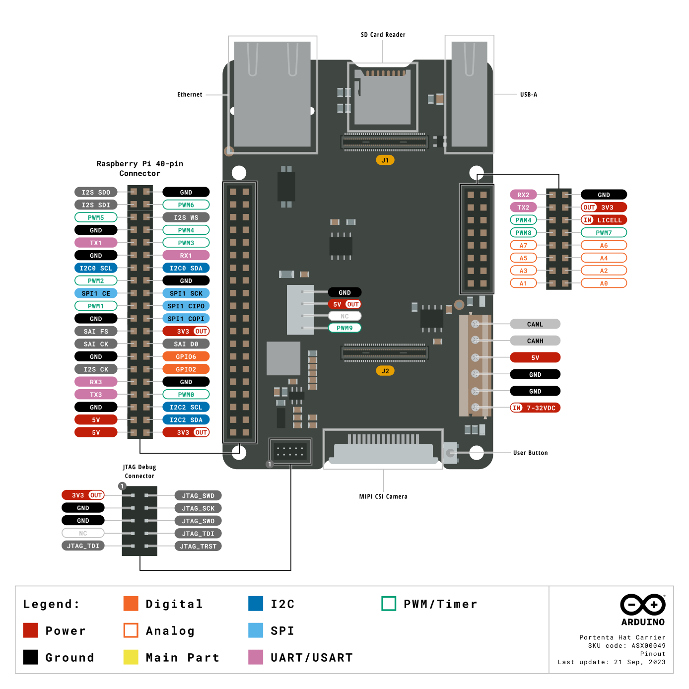

<!---
Feature Image: A descriptive image of the product to identify it on the first page of the Datasheet. Image must be put inside the "assets" folder and be named "featured.png" Actual Image for example purposes.
-->

# Description

<!---
Description: A paragraph describing the product in an official and commercial way. This text is normally taken from the official description inside the Product Sales brief slides and adapted the text if necessary to the datasheet. The actual text is for examples purposes.
-->

The Arduino GIGA R1 WiFi brings the power of the STM32H7 to the Mega form factor, being the first Mega board to include onboard Wi-Fi® and Bluetooth® connectivity. The board provides 76 digital inputs/outputs (13 with PWM capability), 14 analog inputs and 2 analog outputs (DAC) all easily accessible via pin headers. The STM32 microprocessor with dual-core Cortex® M7 and Cortex® M4, together with onboard memory and audio jack enables you to perform machine learning and signal processing on the edge.

# Target Areas

<!---
Target Areas: Tags about the main keywords of the product, can be taken from the sales brief or asking the Project Manager about the right ones. Tags must be first letter in caps and must be separated by commas. Actual tags for example purposes.
-->

3D printing, Signal Processing, Maker, Robotics

# Contents
## Application Examples

<!---
Application Examples: Section regarding main application examples of the product. Normally consists of an initial descriptive paragraph of the product explaining some of its main features to be applied on intended fields and three bullet points examples of application. Information is normally taken from the sales brief or Project Manager. Mandatory for Pro products, recommended for Maker and Education. The actual text is intended for example purposes.
-->

The GIGA R1 WiFi combines the best of the Portenta H7 and the Mega 2560. A generous amount of I/O easily accessible via pins allows for easy and fast testing of new ideas and solutions. The STM32H7 has ample power to handle machine-learning tasks. Your IoT projects can even benefit from the Arduino Cloud with the help of the onboard secure element and its wireless connectivity.

- **3D Printing:** The Mega form factor has been very popular for creating 3D printers. Connect sensors to the high-resolution ADC interfaces for high-performance sensing of the 3D printing process. Together with the dual-core computing power, controls the printing process like never before. Monitor filament usage and print status locally over Bluetooth® or from anywhere in the world with the Arduino Cloud, or any other third-party service, and its Wi-Fi® features.

- **Audio Processing:** The GIGA R1 WiFi provides a 3.5 mm audio input/output to easily interact with audio signals in the environment. Analyse and create audio signals directly on the board. Connect a microphone and control a wide range of digital and analog devices. Create your own musical instrument and change the note through the various inputs. Create an online concert with the Arduino Cloud or any other third-party service and connect with people all over the world.

- **Data acquisition device:** Thanks to the numerous analog inputs, including the jack connector (J15) and the two DAC outputs with a resolution of up to 12 bits, you can create your own data acquisition device. Make your own multimeter or even an oscilloscope and create an online dashboard with the Arduino Cloud or any other third-party service. Design your own electrochemical experiments, apply custom current/voltage waveforms and check the status of your experiment from the comfort of your home.

## Features
### General Specifications Overview

<!---
General Specifications Overview: This section covers the main technical descriptions and a full summary of the main technical specifications of the product. The section normally starts with another descriptive 3/4 lines paragraph this time focused mostly on the technical features of the product plus a table with its main technical specifications. It is important to note that this section and the following related one where the product specifications are broken down into detail in new sections and tables hugely vary from product to product, being really important to cover all the main technical features of each product properly. That info will be expanded later in the specific sections related to that feature. The actual text and the following table are intended for example purposes.
-->

The Portenta C33 is a powerful microcontroller board designed for low-cost IoT applications. Based on the high-performance R7FA6M5BH2CBG microcontroller from Renesas®, it offers a range of key features and a low-power design that make it well-suited for a variety of applications. The board has been designed with the same form factor as the Portenta H7 and is backward compatible, making it fully compatible with all Portenta family shields and carriers through its MKR-styled and high-density connectors. The following table summarizes the board's main features.

| Feature               | Description                                                                          |
| --------------------- | ------------------------------------------------------------------------------------ |
| Microcontroller       | Dual-core **STM32H747XIH6** 32-bit Arm® Cortex®-M7 and 32-bit Arm® 32-bit Cortex®-M4 |
| Memory                | **STM32H747XI** 2 MB Flash / 1 MB RAM                                                |
| Digital Inputs        | Digital Inputs 5 V compatible (x76)                                                  |
| Analog Inputs         | Analog inputs with a voltage range of 3,3.8 V (x12)                                  |
| PWM Pins              | PWM Pins with 8 bits resolution (x13)                                                |
| Secure Element        | ATECC608A-MAHDA-T Module (x1)                                                        |
| Communication         | UART (x4), I2C (x3), SPI (x2), CAN (external transceiver required) (x1)              |
| Camera                | 20 pin Arducam camera connector                                                      |
| Display               | D1N, D0N, D1P, D0P, CKN, CKP, D68-D75                                                |
| Audio                 | 3-pins Audio Jack Connector                                                          |
| Power                 | Input voltage (VIN): 6-24 V / DC Current per I/O Pin: 8 mA                           |
| Dimensions            | 114 mm x 86.5 mm                                                                     |
| Weight                | 67 g                                                                                 |
| Operating Temperature | -40 °C to +85 °C                                                                     |
| Certifications        | CE, FCC, IC, RoHS, REACH, UKCA, WEEE, Japan (No Radio)                               |

### Microcontroller

<!---
Subsection about a Main Feature: The subsection inside features and under General Specification Overview to talk about some of the main features of the product, from the microprocessor's main specifications to the wifi chipset, Camera, Audio, Important Interfaces like CAN, etc. Ideally those sections should contain an initial 2/3 line paragraph, a table or multiple tables explaining the main specs and related media like images or schemas to explain better the technical specifications. Warnings and Note blocks regarding special things of the feature to take into account are also recommended it.
-->

| Component                | Details                                                                                        |
| ------------------------ | ---------------------------------------------------------------------------------------------- |
| ST STM32H747XI Processor | Dual-core Arm® Cortex®-M7 core at up to 480 MHz + Arm® 32-bit Cortex®-M4 core at up to 240 MHz |
| Flash Memory             | 2 MB of Flash Memory with read-while-write support                                             |
| Programming Memory       | 1 MB of RAM                                                                                    |

### Inputs

<!---
Subsection about a Main Feature: The subsection inside features and under General Specification Overview talks about some of the main features of the product, from the microprocessor's main specifications, to the wifi chipset, Camera, Audio, Important Interfaces like CAN, etc. Ideally those sections should contain an initial 2/3 line paragraph, a table or multiple tables explaining the main specs and related media like images or schemas to explain better the technical specifications. Warnings and Note blocks regarding special things of the feature to take into account are also recommended.
-->

| Characteristics               | Details                  |
| ----------------------------- | ------------------------ |
| Number of inputs              | 8x Analog/Digital inputs |
| Inputs overvoltage protection | yes                      |
| Antipolarity protection       | yes                      |
| Input impedance               | 8.9 kΩ                   |

### Outputs

<!---
Subsection about a Main Feature: The subsection inside features and under General Specification Overview talks about some of the main features of the product, from the microprocessor's main specifications, to the wifi chipset, Camera, Audio, Important Interfaces like CAN, etc. Ideally those sections should contain an initial 2/3 line paragraph, a table or multiple tables explaining the main specs and related media like images or schemas to explain better the technical specifications. Warnings and Note blocks regarding special things of the feature to take into account are also recommended it.
-->

| Characteristics                       | Details                                          |
| ------------------------------------- | ------------------------------------------------ |
| Number of outputs                     | 4x relays (NO)                                   |
| Max current per relay                 | 10 A                                             |
| Max peak current per relay            | 15 A                                             |
| Continuous current per terminal       | 10 A                                             |
| Short-circuit protection              | No, external fuse required                       |
| Relay rated voltage                   | 250 VAC                                          |
| Relay Max voltage                     | 400 VAC                                          |
| Rated load AC1                        | 2500 VA                                          |
| Rated load AC15 (230 VAC)             | 500 VA                                           |
| Breaking capacity DC1: 24/30/110/220V | 10/4/0.3/0.12 A                                  |
| Minimum switching load                | 300 mW (5 V/5 mA)                                |
| Max output line length (unshielded)   | 100 m                                            |
| Relay response time from state 0 to 1 | 6 ms for relay output                            |
| Relay response time from state 1 to 0 | 4 ms for relay output                            |
| Bounce time NO                        | 3 ms                                             |
| Bounce time NC                        | 6 ms                                             |
| Relay mechanical durability           | 10 million cycles                                |
| Relay electrical durability           | 10 thousand cycles with a resistive load of 10 A |

### Communication

<!---
Subsection about a Main Feature: The subsection inside features and under General Specification Overview talks about some of the main features of the product, from the microprocessor's main specifications, to the wifi chipset, Camera, Audio, Important Interfaces like CAN, etc. Ideally those sections should contain an initial 2/3 line paragraph, a table or multiple tables explaining the main specs and related media like images or schemas to explain better the technical specifications. Warnings and Note blocks regarding special things of the feature to take into account are also recommended.
-->

| Interfaces            | Type                                       | Protocols/Technologies supported                     |
| --------------------- | ------------------------------------------ | ---------------------------------------------------- |
| Ethernet              | 10/100BASE-T Port                          | TCP/IP, MODBUS TCP                                   |
| RS-485                | Half-duplex without termination resistance | MODBUS RTU, Custom serial communication              |
| Wireless connectivity | Wi-Fi®                                     | 2.4 GHz                                              |
| Wireless connectivity | Bluetooth® Low Energy                      | 4.2 supported by firmware, 5.1 supported by hardware |

### Security

<!---
Subsection about a Main Feature: The subsection inside features and under General Specification Overview talks about some of the main features of the product, from the microprocessor's main specifications, to the wifi chipset, Camera, Audio, Important Interfaces like CAN, etc. Ideally those sections should contain an initial 2/3 line paragraph, a table or multiple tables explaining the main specs and related media like images or schemas to explain better the technical specifications. Warnings and Note blocks regarding special things of the feature to take into account are also recommended it.
-->

| Component                   | Details                                                           |
| --------------------------- | ----------------------------------------------------------------- |
| ATECC608B Crypto Microchip® | Cryptographic co-processor with secure hardware-based key storage |
|                             | Protected storage for up to 16 Keys, certificates, or data        |
|                             | Networking key management support                                 |
|                             | Secure boot support                                               |
|                             | Guaranteed unique 72-bit serial number                            |

## Accessories (<included / not included>)

<!---
Accessories: This section lists some of the related accessories that comes or not with the product, like USB cables, antennas or batteries. It is important to put in the accessory is included or not. Actual items only for purposes examples.
-->

- Micro UFL antenna (Included)
- USB-C® cable (Not included)
- USB 2.0 Type-A cable (Not included)

## Related Products

<!---
Related products: This section lists some of the related products like shields or others. Ask and align with the Project Manager responsible for the product and check the sales brief. It is important to put the SKU of each item. Actual items are only for example purposes.
-->

- Arduino Mega Proto Shield Rev3 (A000080)
- Arduino 4 Relays Shield (A000110)
- Arduino Motor Shield Rev3 (A000079)

## Rating

<!---
Rating: This section is really important from the technical point of view, containing important information regarding the minimum and maximum values of this like voltage and current. The better the information is, the fewer support tickets the company will receive due to burn boards.
-->

### Recommended Operating Conditions

<!---
Recommended Operating Conditions/Power Specifications: This section contains the minimum, typical and Maximum main values, normally related to voltage, current and temperature, but there can be additional specifications depending on the product. Table for example purposes. Warnings or Notes are recommended in case the product needs them to make sure the user does not commit mistakes.
-->

| Description                 | Value                     |
| --------------------------- | ------------------------- |
| Temperature Operating Range | -20...50 °C               |
| Protection degree rating    | IP20                      |
| Pollution degree            | 2 conforming to IEC 61010 |

**Note:** VDD controls the logic level and is connected to the 3.3V power rail. VAREF is for the analog logic.

### Power Specification

<!---
Recommended Operating Conditions/Power Specifications: This section contains the minimum, typical and Maximum main values, normally related to voltage, current and temperature, but there can be additional specifications depending on the product. Table for example purposes. Warnings or Notes are recommended in case the product needs them to make sure the user does not commit mistakes.
-->

| Property               | Min   | Typ | Max  | Unit |
|----------------------- |------ |-----|------|------|
| Supply voltage         | 12    | -   | 24   | V    |
| Permissible range      | 10.2  | -   | 27.6 | V    |
| Power consumption (12V)| 0.6   | -   | 2    | W    |
| Power consumption (24V)| 0.6   | -   | 2.2  | W    |

### Current Consumption

<!---
Current Consumption: This section contains information about the current consumption of the product. This information is really useful but always tricky to get and can help users understand the real estimated current consumption in different scenarios like sleep modes.
-->

| Parameter                                       | Symbol         | Min | Typ | Max | Unit |
| ----------------------------------------------- | -------------- | --- | --- | --- | ---- |
| Deep Sleep Mode Current Consumption1 | IDS | -   | 86  | -   | µA   |
| Normal Mode Current Consumption2     | INM | -   | 180 | -   | mA   |

## Functional Overview

<!---
Functional Overview: The functional overview contains important information about the product in terms of pinout, block diagram, mechanical information, power tree and much more. Sections and text for example purposes.
-->

### Pinout

<!---
Pinout: It is always interesting to show the pinout of the product inside the datasheet. Pinout and texxt for example purposes.
-->

The Portent Hat Carrier pinout is shown in in the following figure.

<!---
Notes and warnings: If the product has some important tips to take into account regarding its pins it can be a good idea to put that information as a warning. Note code for example purposes
-->

<strong>Safety Note:</strong> Disconnect power before board modifications. Avoid short-circuiting. Refer to the full guide for more safety tips.

### Full Pinout Table

<!---
Full Pinout Table: The full pinout tables are done only necessary in case of really complex products intended for the professional sector. These tables are extracted from the Pinout Table Spreadsheet normally done before the graphical simple pinout and used as an internal tool. Following text and tables for exampe purposes.
-->

The full pinout of the Portenta Hat Carrier is available in the following tables sorted by element/connector.

#### 16-Pin Header (J6)

| Pin number | Silkscreen |   Power Net   | Portenta HD Standard Pin |                           High-Density Pin                           |    Interface     |
| :--------: | :--------: | :-----------: | :----------------------: | :------------------------------------------------------------------: | :--------------: |
|     1      |     A0     |               |        ANALOG_A0         |                                J2-73                                 |                  |
|     2      |     A1     |               |        ANALOG_A1         |                                J2-75                                 |                  |
|     3      |     A2     |               |        ANALOG_A2         |                                J2-77                                 |                  |
|     4      |     A3     |               |        ANALOG_A3         |                                J2-79                                 |                  |
|     5      |     A4     |               |        ANALOG_A4         |                                J2-74                                 |                  |
|     6      |     A5     |               |        ANALOG_A5         |                                J2-76                                 |                  |
|     7      |     A6     |               |        ANALOG_A6         |                                J2-78                                 |                  |
|     8      |     A7     |               |        ANALOG_A7         |                                J2-80                                 |                  |
|     9      |    PWM7    |               |          PWM_7           |                                J2-64                                 |                  |
|     10     |    PWM8    |               |          PWM_8           |                                J2-66                                 |                  |
|     11     |   LICELL   |               |          LICELL          |                                 J2-7                                 | RTC Power Source |
|     12     |    PWM4    |               |          GPIO_0          |                                J2-46                                 |                  |
|     13     |    3V3     | +3V3_PORTENTA |           VCC            |                      J2-23, J2-34, J2-43, J2-69                      |                  |
|     14     |    TX2     |               |        SERIAL2_TX        |                                J2-26                                 |    UART 2 TX     |
|     15     |    GND     |      GND      |           GND            | J1-22, J1-31, J1-42, J1-47, J1-54, J2-24, J2-33, J2-44, J2-57, J2-70 |                  |
|     16     |    RX2     |               |        SERIAL2_RX        |                                J2-28                                 |    UART 2 RX     |

<caption>Table 6: 16-Pin Header (J6) pinout</caption>

<!---
Div page break tags: Sometimes the format is not perfect and some sections are added/cut in the pages we do not want to. This kind of div page break tasks can be used to fix those problems
-->

#### Power Block CAN Bus (J9)

| Pin number | Silkscreen  |  Power Net   | Portenta HD Standard Pin |                           High-Density Pin                           |   Interface    |
| :--------: | :---------: | :----------: | :----------------------: | :------------------------------------------------------------------: | :------------: |
|     1      | VIN 7-32VDC | INPUT_7V-32V |                          |                                                                      |                |
|     2      |     GND     |     GND      |           GND            | J1-22, J1-31, J1-42, J1-47, J1-54, J2-24, J2-33, J2-44, J2-57, J2-70 |                |
|     3      |     GND     |     GND      |           GND            | J1-22, J1-31, J1-42, J1-47, J1-54, J2-24, J2-33, J2-44, J2-57, J2-70 |                |
|     4      |     5V      |     +5V      |           VIN            |                  J1-21, J1-24, J1-32, J1-41, J1-48                   |                |
|     5      |    CANH     |              |                          |                          J1-49 (Through U1)                          | CAN BUS - CANH |
|     6      |    CANL     |              |                          |                          J1-51 (Through U1)                          | CAN BUS - CANL |

<caption>Table 7: Power Block CAN Bus (J9) pinout</caption>

### Block Diagram

<!---
Block Diagram: The block diagram is really important from the technical point of view and for certification purposes. Must be good and consistent with Arduino`s visual style. Raw diagram is created by the R&D team and adapted and converted to the final one by the content team using Figma. Clock signals are mandatory for certification purposes. Diagram and text for example purposes.
-->

The block diagram with the main parts of the product can be checked in the following image:

### Power Supply

<!---
Power tree: The power tree is really important from the technical point of view and for certification purposes. Must be good and consistent with Arduino`s visual style. Raw diagram is created by the R&D team and adapted and converted to the final one by the content team using Figma. Diagram and text for example purposes.
-->

The Portenta C33 can be powered through one of these interfaces:

- USB-C® port
- 3.7 V single-cell lithium-ion/lithium-polymer battery, connected through the onboard battery connector
- External 5 V power supply connected through the MKR-styled pins

The recommended minimum battery capacity is 700 mAh. The battery is connected to the board via a disconnectable crimp-style connector as shown in Figure 3. The battery connector part number is BM03B-ACHSS-GAN-TF(LF)(SN). 

The following diagram shows the power options available on the Portenta C33 and illustrates the main system power architecture.

### Product Topology

<!---
Product Topology: Product topology is an important section of the datasheet and a combination of two elements: the diagram with the main components references, and the table listing and describing those main components. It is important to describe only the components interesting for the final user, so capacitors, resistors and other passive components should not be described in this section as a general rule. Image and text for example purposes
-->

| **Ref.** | **Description**                         | **Ref.** | **Description**                     |
|----------|-----------------------------------------|----------|-------------------------------------|
| U1       | STM32H7 Dual Core Microcontroller IC    | U8       | AT25SF128A-MHB-T 16 MB Flash IC     |
| U3       | AS4C4M16SA 8MB SDRAM IC                 | U4       | ATECC608A-MAHDA-T Secure Element IC |
| U5       | LBEE5KL1DX-883 Wi-Fi®/Bluetooth® Module | U6       | MP2322GQH Buck Converter 3.3V IC    |
| U7       | MP2269GD-Z Buck Converter 5V IC         | JANALOG  | Analog input/output headers         |
| JDIGITAL | Digital input/output headers            | JSIDE    | Digital input/output headers        |
| SPI      | SPI headers                             | JTAG     | JTAG Headers                        |
| J2       | USB 2.0 A Host                          | J15      | 3.5 mm audio in/out                 |
| PB1      | RESET Button                            | PB2      | BOOT0 button                        |
| J14      | Micro UFL connector                     | J5       | Camera                              |
| J6       | Camera                                  | DL1      | Power LED                           |
| DL2      | RGB SMLP34RGB2W3 Common anode LED       | J12      | CX90B-16P USB-C® connector          |

<!---
Product Topology specific subsections: Different subsections about specific features and important parts of the product can be added inside the product topology, explaining for example more information about the microprocessors, the MIPI camera connectos, the GPS connectivity, the GPIO pins, JTAG connectors, USB, etc etc. Some of the Portenta Hat Carrier specific sections has been added as a nice example.
-->

#### High-Density Connectors (J1-J2)

The High-Density connectors (J1-J2) provide connectivity with the Portenta family boards. For detailed information, refer to the Portenta Hat Carrier pinout and the respective documentation for the Portenta family boards. In Figure 6, the Portenta X8 board High-Density connectors pinout is shown as an example.

#### JTAG Connector (J3)

Debugging capabilities are integrated directly into the Portenta Hat Carrier and are accessible via the 10-pin JTAG connector (J3) shown in Figure 7.

#### USB-A (J4)

The onboard USB-A connector (female), shown in Figure 7, is integrated in the Portenta Hat Carrier for multiple purposes, including:

- Connecting external peripherals such as mouse devices, keyboards, USB cameras, hubs, and hard drives.
- Data logging using a USB memory stick.

#### 40-Pin Header Connector (J5)

The Portenta Hat Carrier features a 40-pin header connector as shown in Figure 8, making it compatible with most of the Raspberry Pi® Hats available on the market.

The main interfaces and general-purpose pins available through this connector include:

- SPI (x1)
- I2S (x1)
- SAI (x1)
- 5 VDC (x2)
- 3.3 VDC (x2)
- I2C (x2)
- UART (without flow control) (x2)
- PWM (x7)
- GND (x8)
- GPIO (x26)

#### MicroSD Card Slot (J7)

The onboard microSD card slot can be used for:

- Data logging operations
- Media purposes

## Device Operation

### Getting Started - IDE

If you want to program your GIGA R1 WiFi while offline you need to install the Arduino® Desktop IDE **[1]**. To connect the GIGA R1 WiFi to your computer, you will need a Type-C® USB cable, which can also provide power to the board, as indicated by the LED (DL1).

### Getting Started - Arduino Web Editor

All Arduino boards, including this one, work out-of-the-box on the Arduino® Web Editor **[2]**, by just installing a simple plugin.

The Arduino Web Editor is hosted online, therefore it will always be up-to-date with the latest features and support for all boards. Follow **[3]** to start coding on the browser and upload your sketches onto your board.

### Getting Started - Arduino Cloud

All Arduino IoT enabled products are supported on Arduino Cloud which allows you to log, graph and analyze sensor data, trigger events, and automate your home or business.

### Online Resources

Now that you have gone through the basics of what you can do with the board you can explore the endless possibilities it provides by checking exciting projects on ProjectHub **[4]**, the Arduino Library Reference **[5]**, and the online store **[6]**; where you will be able to complement your board with sensors, actuators and more.

### Board Recovery

All Arduino boards have a built-in bootloader which allows flashing the board via USB. In case a sketch locks up the processor and the board is not reachable anymore via USB, it is possible to enter bootloader mode by double-tapping the reset button right after the power-up.

# Mechanical Information

## Pinout

### Three-Pins Header - J1
| Pin | Function | Type    | Description             |
|-----|----------|---------|-------------------------|
| 1   | OFF      | Digital | 3V3 Enable Pin (U6)     |
| 2   | GND      | Power   | Ground                  |
| 3   | VRTC     | Reset   | Real Time Clock Battery |

### Analog

| Pin  | Function   | Type      | Description                                     |
| ---- | ---------- | --------- | ----------------------------------------------- |
|  1   | NC         | NC        | Not Connected                                   |
|  2   | IOREF      | IOREF     | Reference for digital logic V - connected to 3.3V |
|  3   | Reset      | Reset     | Reset                                           |
|  4   | +3V3       | Power     | +3V3 Power Rail                                 |
|  5   | +5V        | Power     | +5V Power Rail                                  |
|  6   | GND        | Power     | Ground                                          |
|  7   | GND        | Power     | Ground                                          |
|  8   | VIN        | Power     | Voltage Input                                   |
|  9   | A0         | Analog    | Analog input 0 /GPIO                            |
|  10  | A1         | Analog    | Analog input 1 /GPIO                            |
|  11  | A2         | Analog    | Analog input 2 /GPIO                            |
|  12  | A3         | Analog    | Analog input 3 /GPIO                            |
|  13  | A4         | Analog    | Analog input 4 /GPIO                            |
|  14  | A5         | Analog    | Analog input 5 /GPIO                            |
|  15  | A6         | Analog    | Analog input 6 /GPIO                            |
|  16  | A7         | Analog    | Analog input 7 /GPIO                            |
|  17  | A8         | Analog    | Analog input 8 /GPIO                            |
|  18  | A9         | Analog    | Analog input 9 /GPIO                            |
|  19  | A10        | Analog    | Analog input 10 /GPIO                           |
|  20  | A11        | Analog    | Analog input 11 /GPIO                           |
|  21  | DAC0       | Analog    | Digital to Analog Converter 0                   |
|  22  | DAC1       | Analog    | Digital to Analog Converter 1                   |
|  23  | CANRX      | Digital   | CAN Bus Receive                                 |
|  24  | CANTX      | Digital   | CAN Bus Transfer                                |

### Digital

| Pin | Function | Type    | Description                                     |
| --- | -------- | ------- | ----------------------------------------------- |
| 1   | D21/SCL1 | Digital | GPIO 21/I2C 1 Clock                             |
| 2   | D20/SDA1 | Digital | GPIO 20/I2C 1 Dataline                          |
| 3   | AREF     | Digital | Analog Reference Voltage                        |
| 4   | GND      | Power   | Ground                                          |
| 5   | D13/SCK  | Digital | GPIO 13/SPI Clock (PWM~)                        |
| 6   | D12/CIPO | Digital | GPIO 12/SPI Controller In Peripheral Out (PWM~) |
| 7   | D11/COPI | Digital | GPIO 11/SPI Controller Out Peripheral In (PWM~) |
| 8   | D10/CS   | Digital | GPIO 10/SPI Chip Select (PWM~)                  |
| 9   | D9/SDA2  | Digital | GPIO 9/I2C 2 Dataline (PWM~)                    |
| 10  | D8/SCL2  | Digital | GPIO 8/I2C 2 Clockline (PWM~)                   |
| 11  | D7       | Digital | GPIO 7 (PWM~)                                   |
| 12  | D6       | Digital | GPIO 6 (PWM~)                                   |
| 13  | D5       | Digital | GPIO 5 (PWM~)                                   |
| 14  | D4       | Digital | GPIO 4 (PWM~)                                   |
| 15  | D3       | Digital | GPIO 3 (PWM~)                                   |
| 16  | D2       | Digital | GPIO 2 (PWM~)                                   |
| 17  | D1/TX0   | Digital | GPIO 1 / Serial 0 Transmitter                   |
| 18  | D0/TX0   | Digital | GPIO 0 / Serial 0 Receiver                      |
| 19  | D14/TX3  | Digital | GPIO 14 / Serial 3 Transmitter                  |
| 20  | D15/RX3  | Digital | GPIO 15 / Serial 3 Receiver                     |
| 21  | D16/TX2  | Digital | GPIO 16 / Serial 2 Transmitter                  |
| 22  | D17/RX2  | Digital | GPIO 17 / Serial 2 Receiver                     |
| 23  | D18/TX1  | Digital | GPIO 18 / Serial 1 Transmitter                  |
| 24  | D19/RX1  | Digital | GPIO 19 / Serial 1 Receiver                     |
| 25  | D20/SDA  | Digital | GPIO 20 / I2C 0 Dataline                        |
| 26  | D21/SCL  | Digital | GPIO 21 / I2C 0 Clock                           |

### STM32 ICSP

| Pin | Function | Type     | Description                  |
|-----|----------|----------|------------------------------|
| 1   | CIPO     | Internal | Controller In Peripheral Out |
| 2   | +5V      | Internal | Power Supply of 5V           |
| 3   | SCK      | Internal | Serial Clock                 |
| 4   | COPI     | Internal | Controller Out Peripheral In |
| 5   | RESET    | Internal | Reset                        |
| 6   | GND      | Internal | Ground                       |

### Digital Pins D22 - D53 LHS

| Pin | Function | Type    | Description    |
|-----|----------|---------|----------------|
| 1   | +5V      | Power   | +5V Power Rail |
| 2   | D22      | Digital | GPIO 22        |
| 3   | D24      | Digital | GPIO 24        |
| 4   | D26      | Digital | GPIO 26        |
| 5   | D28      | Digital | GPIO 28        |
| 6   | D30      | Digital | GPIO 30        |
| 7   | D32      | Digital | GPIO 32        |
| 8   | D34      | Digital | GPIO 34        |
| 9   | D36      | Digital | GPIO 36        |
| 10  | D38      | Digital | GPIO 38        |
| 11  | D40      | Digital | GPIO 40        |
| 12  | D42      | Digital | GPIO 42        |
| 13  | D44      | Digital | GPIO 44        |
| 14  | D46      | Digital | GPIO 46        |
| 15  | D48      | Digital | GPIO 48        |
| 16  | D50      | Digital | GPIO 50        |
| 17  | D52      | Digital | GPIO 52        |
| 18  | GND      | Power   | Ground         |

### Digital Pins D22 - D53 RHS

| Pin | Function | Type    | Description    |
|-----|----------|---------|----------------|
| 1   | +5V      | Power   | +5V Power Rail |
| 2   | D23      | Digital | GPIO 23        |
| 3   | D25      | Digital | GPIO 25        |
| 4   | D27      | Digital | GPIO 27        |
| 5   | D29      | Digital | GPIO 29        |
| 6   | D31      | Digital | GPIO 31        |
| 7   | D33      | Digital | GPIO 33        |
| 8   | D35      | Digital | GPIO 35        |
| 9   | D37      | Digital | GPIO 37        |
| 10  | D39      | Digital | GPIO 39        |
| 11  | D41      | Digital | GPIO 41        |
| 12  | D43      | Digital | GPIO 43        |
| 13  | D45      | Digital | GPIO 45        |
| 14  | D47      | Digital | GPIO 47        |
| 15  | D49      | Digital | GPIO 49        |
| 16  | D51      | Digital | GPIO 51        |
| 17  | D53      | Digital | GPIO 53        |
| 18  | GND      | Power   | Ground         |

## Mounting Holes And Board Outline

 

# Certifications

## Declaration of Conformity CE DoC (EU)

We declare under our sole responsibility that the products above are in conformity with the essential requirements of the following EU Directives and therefore qualify for free movement within markets comprising the European Union (EU) and European Economic Area (EEA).

## Declaration of Conformity to EU RoHS & REACH 211 01/19/2021

Arduino boards are in compliance with RoHS 2 Directive 2011/65/EU of the European Parliament and RoHS 3 Directive 2015/863/EU of the Council of 4 June 2015 on the restriction of the use of certain hazardous substances in electrical and electronic equipment.

| **Substance**                          | **Maximum Limit (ppm)** |
|----------------------------------------|-------------------------|
| Lead (Pb)                              | 1000                    |
| Cadmium (Cd)                           | 100                     |
| Mercury (Hg)                           | 1000                    |
| Hexavalent Chromium (Cr6+)             | 1000                    |
| Poly Brominated Biphenyls (PBB)        | 1000                    |
| Poly Brominated Diphenyl ethers (PBDE) | 1000                    |
| Bis(2-Ethylhexyl) phthalate (DEHP)     | 1000                    |
| Benzyl butyl phthalate (BBP)           | 1000                    |
| Dibutyl phthalate (DBP)                | 1000                    |
| Diisobutyl phthalate (DIBP)            | 1000                    |

Exemptions: No exemptions are claimed.

Arduino Boards are fully compliant with the related requirements of European Union Regulation (EC) 1907 /2006 concerning the Registration, Evaluation, Authorization and Restriction of Chemicals (REACH). We declare none of the SVHCs ([https://echa.europa.eu/web/guest/candidate-list-table](https://echa.europa.eu/web/guest/candidate-list-table)), the Candidate List of Substances of Very High Concern for authorization currently released by ECHA, is present in all products (and also package) in quantities totaling in a concentration equal or above 0.1%. To the best of our knowledge, we also declare that our products do not contain any of the substances listed on the "Authorization List" (Annex XIV of the REACH regulations) and Substances of Very High Concern (SVHC) in any significant amounts as specified by the Annex XVII of Candidate list published by ECHA (European Chemical Agency) 1907 /2006/EC.

## Conflict Minerals Declaration

As a global supplier of electronic and electrical components, Arduino is aware of our obligations with regards to laws and regulations regarding Conflict Minerals, specifically the Dodd-Frank Wall Street Reform and Consumer Protection Act, Section 1502. Arduino does not directly source or process conflict minerals such as Tin, Tantalum, Tungsten, or Gold. Conflict minerals are contained in our products in the form of solder, or as a component in metal alloys. As part of our reasonable due diligence Arduino has contacted component suppliers within our supply chain to verify their continued compliance with the regulations. Based on the information received thus far we declare that our products contain Conflict Minerals sourced from conflict-free areas.

## FCC Caution

Any Changes or modifications not expressly approved by the party responsible for compliance could void the user’s authority to operate the equipment.

This device complies with part 15 of the FCC Rules. Operation is subject to the following two conditions:

(1) This device may not cause harmful interference

(2) this device must accept any interference received, including interference that may cause undesired operation.

**FCC RF Radiation Exposure Statement:**

1. This Transmitter must not be co-located or operating in conjunction with any other antenna or transmitter.

2. This equipment complies with RF radiation exposure limits set forth for an uncontrolled environment.

3. This equipment should be installed and operated with a minimum distance of 20 cm between the radiator & your body.

English:
User manuals for licence-exempt radio apparatus shall contain the following or equivalent notice in a conspicuous location in the user manual or alternatively on the device or both. This device complies with Industry Canada licence-exempt RSS standard(s). Operation is subject to the following two conditions:

(1) this device may not cause interference

(2) this device must accept any interference, including interference that may cause undesired operation of the device.

French:
Le présent appareil est conforme aux CNR d’Industrie Canada applicables aux appareils radio exempts de licence. L’exploitation est autorisée aux deux conditions suivantes :

(1) l’ appareil nedoit pas produire de brouillage

(2) l’utilisateur de l’appareil doit accepter tout brouillage radioélectrique subi, même si le brouillage est susceptible d’en compromettre le fonctionnement.

**IC SAR Warning:**

English
This equipment should be installed and operated with a minimum distance of 20 cm between the radiator and your body.

French:
Lors de l’ installation et de l’ exploitation de ce dispositif, la distance entre le radiateur et le corps est d ’au moins 20 cm.

**Important:** The operating temperature of the EUT can’t exceed 85℃ and shouldn’t be lower than -40℃.

Hereby, Arduino S.r.l. declares that this product is in compliance with essential requirements and other relevant provisions of Directive 201453/EU. This product is allowed to be used in all EU member states.

| Frequency bands      | Maximum output power (ERP) |
|----------------------|----------------------------|
| 2.4 GHz, 40 channels | TBD                        |

## Company Information

| Company name    | Arduino SRL                                   |
|-----------------|-----------------------------------------------|
| Company Address | Via Andrea Appiani, 25 - 20900 MONZA（Italy)  |

## Reference Documentation

| Ref                       | Link                                                                                            |
|---------------------------|-------------------------------------------------------------------------------------------------|
| Arduino IDE (Desktop)     | [https://www.arduino.cc/en/Main/Software](https://www.arduino.cc/en/Main/Software)                                                      |
| Arduino IDE (Cloud)       | [https://create.arduino.cc/editor](https://create.arduino.cc/editor)                                                              |
| Cloud IDE Getting Started | [https://docs.arduino.cc/cloud/web-editor/tutorials/getting-started/getting-started-web-editor](https://docs.arduino.cc/cloud/web-editor/tutorials/getting-started/getting-started-web-editor) |
| Project Hub               | [https://create.arduino.cc/projecthub?by=part&part_id=11332&sort=trending](https://create.arduino.cc/projecthub?by=part&part_id=11332&sort=trending)                     |
| Library Reference         | [https://github.com/arduino-libraries/](https://github.com/arduino-libraries/)                                                        |
| Online Store              | [https://store.arduino.cc/](https://store.arduino.cc/)                                                                    |

## Change Log

| **Date**   | **Changes**   |
| ---------- | ------------- |
| 03/02/2023 | Release       |
| 12/07/2023 | Pinout Update |
