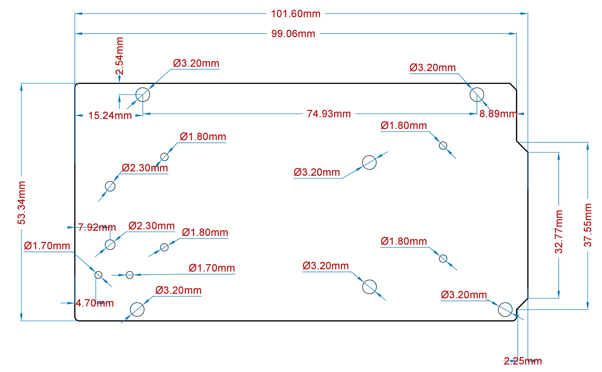

<!---
Feature Image: A descriptive image of the product to identify it on the first page of the Datasheet. Image must be put inside the "assets" folder and be named "featured.png" Actual Image for example purposes.
-->

# Description

<!---
Description: A paragraph describing the product in an official and commercial way. This text is normally taken from the official description inside the Product Sales brief slides and adapted the text if necessary to the datasheet. The actual text is for examples purposes.
-->

The Arduino Due is a groundbreaking microcontroller board featuring the Atmel SAM3X8E ARM Cortex-M3 CPU, making it the first Arduino board built around a 32-bit ARM core microcontroller. With its 54 digital input/output pins, 12 analog inputs, 4 UARTs, USB OTG capability, and 84 MHz clock, the Due offers enhanced performance and versatility for a wide range of projects. Compatible with all Arduino shields designed for operation at 3.3V and compliant with the 1.0 Arduino pinout standard, the Due is a powerful tool for both beginners and experienced makers alike.

**Warning: Unlike most Arduino boards, the Arduino Due board runs at 3.3V. The maximum voltage that the I/O pins can tolerate is 3.3V. Applying voltages higher than 3.3V to any I/O pin could damage the board.**

# Target Areas

<!---
Target Areas: Tags about the main keywords of the product, can be taken from the sales brief or asking the Project Manager about the right ones. Tags must be first letter in caps and must be separated by commas. Actual tags for example purposes.
-->

Embedded Systems Development, Robotics, 3D Printing & CNC Machines and Prototyping

# Contents
## Application Examples

<!---
Application Examples: Section regarding main application examples of the product. Normally consists of an initial descriptive paragraph of the product explaining some of its main features to be applied on intended fields and three bullet points examples of application. Information is normally taken from the sales brief or Project Manager. Mandatory for Pro products, recommended for Maker and Education. The actual text is intended for example purposes.
-->

The Arduino Due combines the performance of the Atmel SAM3X8E microcontroller with the flexibility of the Arduino platform, offering a versatile solution for developers, hobbyists, and professionals alike. With its 32-bit architecture and clock speed of 84 MHz, the Due delivers robust performance for demanding applications.

- **Embedded Systems Development:** The Arduino Due can be utilized to create a real-time data acquisition system for monitoring and analyzing environmental parameters in industrial settings. By interfacing sensors such as temperature, humidity, and pressure sensors with the Due's abundant I/O pins, developers can capture real-time data and process it using the Due's powerful microcontroller. The system can then transmit this data wirelessly or via USB to a host computer for analysis, allowing for continuous monitoring and remote management of critical processes.

- **Robotics:** The Arduino Due can serve as the brain of an autonomous mobile robot capable of navigating and interacting with its environment. By integrating sensors such as ultrasonic range finders, gyroscopes, and encoders, developers can equip the robot with perception capabilities to sense its surroundings and detect obstacles. Using the Due's abundant I/O pins and powerful processing capabilities, algorithms for localization, mapping, and path planning can be implemented to enable autonomous navigation. Additionally, actuators such as motors or servos can be controlled by the Due to execute motion commands, allowing the robot to move and manipulate objects in its environment autonomously.

- **3D Printing & CNC Machines:** the Arduino Due can function as a versatile controller for DIY projects. By interfacing stepper motor drivers and endstop switches with the Due's numerous I/O pins, enthusiasts can create their own 3D printers or CNC machines. The Due's high-speed processing capabilities enable precise control of stepper motors for accurate positioning and movement.

- **Prototyping:** The Arduino Due serves as an invaluable tool for quickly iterating and testing new ideas for IoT devices. By leveraging the Due's extensive I/O capabilities and compatibility with various sensors, communication modules, and actuators, developers can rapidly assemble and test prototypes of IoT devices. Whether it's a smart home sensor node, a weather station, or a remote monitoring system, the Arduino Due provides a flexible platform for integrating components, writing firmware, and validating functionality. With the Due's support for Arduino libraries and easy-to-use development environment, prototypers can focus on innovation and experimentation, accelerating the process of bringing ideas to fruition.

## Features
### General Specifications Overview

<!---
General Specifications Overview: This section covers the main technical descriptions and a full summary of the main technical specifications of the product. The section normally starts with another descriptive 3/4 lines paragraph this time focused mostly on the technical features of the product plus a table with its main technical specifications. It is important to note that this section and the following related one where the product specifications are broken down into detail in new sections and tables hugely vary from product to product, being really important to cover all the main technical features of each product properly. That info will be expanded later in the specific sections related to that feature. The actual text and the following table are intended for example purposes.
-->

The Arduino Due is a versatile microcontroller board designed for a wide range of applications. Powered by the Atmel SAM3X8E ARM Cortex-M3 CPU, it offers high performance and a robust set of features, making it suitable for complex projects. The Due's 32-bit architecture provides enhanced processing capabilities compared to traditional Arduino boards. Designed with a similar form factor to the Arduino Mega, it maintains compatibility with most Arduino shields through its extensive set of I/O pins and headers. The following table summarizes the board's main features.

| Feature               | Description                                                                          |
| --------------------- | ------------------------------------------------------------------------------------ |
| Microcontroller       | **Atmel SAM3X8E ARM Cortex-M3**  32-bit ARM Cortex-M3 / 84 MHzClock speed            |
| Memory                | **SAM3X** 512 KB Flash / 96 KB SRAM (divided into two banks: 64 KB and 32 KB)        |
| USB-to-serial         | **ATmega16U2** Connected to the SAM3X hardware UART                                  |
| Digital Inputs        | Digital Inputs not 5 V compatible (x54)                                              |
| Analog Inputs         | The Due's analog inputs pins measure from ground to a maximum value of 3.3V (x12)    |
| PWM Pins              | PWM Pins with 8 bits resolution (x12)                                                |
| Communication         | UART (x4), I2C (x2), SPI (x1 SPI header), Native USB port, Programming USB port      |
| Power                 | Input voltage (VIN): 7-12 V / DC Current per I/O Pin: 8 mA                           |
| Dimensions            | 101.6 mm x 53.34 mm                                                                  |
| Weight                | 36 g                                                                                 |
| Operating Temperature | -40 °C to +85 °C                                                                     |
| Certifications        |                                                                                      |

### Microcontroller

<!---
Subsection about a Main Feature: The subsection inside features and under General Specification Overview to talk about some of the main features of the product, from the microprocessor's main specifications to the wifi chipset, Camera, Audio, Important Interfaces like CAN, etc. Ideally those sections should contain an initial 2/3 line paragraph, a table or multiple tables explaining the main specs and related media like images or schemas to explain better the technical specifications. Warnings and Note blocks regarding special things of the feature to take into account are also recommended it.
-->

| Component                | Details                                                                                        |
| ------------------------ | ---------------------------------------------------------------------------------------------- |
| Atmel SAM3X8E            | 32-bit ARM Cortex-M3 at 84 MHz                                                                 |
| Flash Memory             | 512 KB Flash                                                                                   |
| Programming Memory       | 96 KB SRAM (divided into two banks: 64 KB and 32 KB)                                           |

### Inputs

<!---
Subsection about a Main Feature: The subsection inside features and under General Specification Overview talks about some of the main features of the product, from the microprocessor's main specifications, to the wifi chipset, Camera, Audio, Important Interfaces like CAN, etc. Ideally those sections should contain an initial 2/3 line paragraph, a table or multiple tables explaining the main specs and related media like images or schemas to explain better the technical specifications. Warnings and Note blocks regarding special things of the feature to take into account are also recommended.
-->

| Characteristics               | Details                  |
| ----------------------------- | ------------------------ |
| Number of inputs              | 66x Analog/Digital inputs|
| Inputs overvoltage protection | yes                      |
| Antipolarity protection       | yes                      |
| Input impedance               | 8.9 kΩ                   |

### Outputs

<!---
Subsection about a Main Feature: The subsection inside features and under General Specification Overview talks about some of the main features of the product, from the microprocessor's main specifications, to the wifi chipset, Camera, Audio, Important Interfaces like CAN, etc. Ideally those sections should contain an initial 2/3 line paragraph, a table or multiple tables explaining the main specs and related media like images or schemas to explain better the technical specifications. Warnings and Note blocks regarding special things of the feature to take into account are also recommended it.
-->

| Characteristics                       | Details                                             |
| ------------------------------------- | --------------------------------------------------- |
| DAC1 and DAC2                         | True analog output 12-bits resolution (4096 levels) |
| PWM outputs                           | 12x                                                 |

## Accessories (<included / not included>)

<!---
Accessories: This section lists some of the related accessories that come or not with the product, like USB cables, antennas or batteries. It is important to put in whether the accessory is included or not. Actual items only for purposes examples.
-->

- USB Cable Type A Male to Micro Type B Male (Not included)

## Related Products

<!---
Related products: This section lists some of the related products like shields or others. Ask and align with the Project Manager responsible for the product and check the sales brief. It is important to put the SKU of each item. Actual items are only for example purposes.
-->

- Arduino Mega Proto Shield Rev3 (A000080)
- Arduino 4 Relays Shield (A000110)
- Arduino Motor Shield Rev3 (A000079)

## Rating

<!---
Rating: This section is really important from the technical point of view, containing important information regarding the minimum and maximum values of this like voltage and current. The better the information is, the fewer support tickets the company will receive due to burn boards.
-->

### Recommended Operating Conditions

<!---
Recommended Operating Conditions/Power Specifications: This section contains the minimum, typical and Maximum main values, normally related to voltage, current and temperature, but there can be additional specifications depending on the product. Table for example purposes. Warnings or Notes are recommended in case the product needs them to make sure the user does not commit mistakes.
-->

| Symbol          | Description                      | Min                | Typ | Max                | Unit |
|-----------------|----------------------------------|--------------------|-----|--------------------|------|
| VIN  | Input voltage from VIN pad       | 6                  | 7.0 | 16                 | V    |
| VUSB | Input voltage from USB connector | 4.8                | 5.0 | 5.5                | V    |
| VDD  | Input high-level voltage         | 0.7*VDD |     | VDD     | V    |
| VIL  | Input low-level voltage          | 0                  |     | 0.3*VDD | V    |
| TOP  | Operating Temperature            | -40                | 25  | 85                 | °C   |

**Note:** VDD controls the logic level and is connected to the 3.3V power rail. VAREF is for the analog logic.

### Power Specification

<!---
Recommended Operating Conditions/Power Specifications: This section contains the minimum, typical and Maximum main values, normally related to voltage, current and temperature, but there can be additional specifications depending on the product. Table for example purposes. Warnings or Notes are recommended in case the product needs them to make sure the user does not commit mistakes.
-->

| Property               | Min   | Typ | Max  | Unit |
|----------------------- |------ |-----|------|------|
| Supply voltage         | 7     | -   | 12   | V    |
| Permissible range      | 6     | -   | 16   | V    |

### Current Consumption

<!---
Current Consumption: This section contains information about the current consumption of the product. This information is really useful but always tricky to get and can help users understand the real estimated current consumption in different scenarios like sleep modes.
-->

| Parameter                                       | Symbol         | Min | Typ | Max | Unit |
| ----------------------------------------------- | -------------- | --- | --- | --- | ---- |
| Normal Mode Current Consumption2     | INM | 130 | --- | 800 | mA   |

## Functional Overview

<!---
Functional Overview: The functional overview contains important information about the product in terms of pinout, block diagram, mechanical information, power tree and much more. Sections and text for example purposes.
-->

### Pinout

<!---
Pinout: It is always interesting to show the pinout of the product inside the datasheet. Pinout and text for example purposes.
-->

The Arduino due pinout is shown in the following figure.

<!---
Notes and warnings: If the product has some important tips to take into account regarding its pins it can be a good idea to put that information as a warning. Note code for example purposes
-->

<strong>Safety Note:</strong> Disconnect power before board modifications. Avoid short-circuiting. Refer to the full guide for more safety tips.

### Full Pinout Table

<!---
Full Pinout Table: The full pinout tables are done only necessary in case of really complex products intended for the professional sector. These tables are extracted from the Pinout Table Spreadsheet normally done before the graphical simple pinout and used as an internal tool. Following text and tables for example purposes.
-->

The full pinout of the Arduino due is available in the following tables.

#### 24-Pin Header

| Pin  | Function   | Type      | Description                                       |
| ---- | ---------- | --------- | ------------------------------------------------- |
|  1   | NC         | NC        | Not Connected                                     |
|  2   | IOREF      | IOREF     | Reference for digital logic V - connected to 3.3V |
|  3   | Reset      | Reset     | Reset                                             |
|  4   | +3V3       | Power     | +3V3 Power Rail                                   |
|  5   | +5V        | Power     | +5V Power Rail                                    |
|  6   | GND        | Power     | Ground                                            |
|  7   | GND        | Power     | Ground                                            |
|  8   | VIN        | Power     | Voltage Input                                     |
|  9   | A0         | Analog    | Analog input 0 /GPIO                              |
|  10  | A1         | Analog    | Analog input 1 /GPIO                              |
|  11  | A2         | Analog    | Analog input 2 /GPIO                              |
|  12  | A3         | Analog    | Analog input 3 /GPIO                              |
|  13  | A4         | Analog    | Analog input 4 /GPIO                              |
|  14  | A5         | Analog    | Analog input 5 /GPIO                              |
|  15  | A6         | Analog    | Analog input 6 /GPIO                              |
|  16  | A7         | Analog    | Analog input 7 /GPIO                              |
|  17  | A8         | Analog    | Analog input 8 /GPIO                              |
|  18  | A9         | Analog    | Analog input 9 /GPIO                              |
|  19  | A10        | Analog    | Analog input 10 /GPIO                             |
|  20  | A11        | Analog    | Analog input 11 /GPIO                             |
|  21  | DAC0       | Analog    | Digital to Analog Converter 0                     |
|  22  | DAC1       | Analog    | Digital to Analog Converter 1                     |
|  23  | CANRX      | Digital   | CAN Bus Receive                                   |
|  24  | CANTX      | Digital   | CAN Bus Transfer                                  |

<caption>24-Pin Header pinout</caption>

<!---
Div page break tags: Sometimes the format is not perfect and some sections are added/cut in the pages we do not want to. This kind of div page break tag can be used to fix those problems
-->

#### 26-Pin Header

| Pin | Function | Type    | Description                                     |
| --- | -------- | ------- | ----------------------------------------------- |
| 1   | D21/SCL1 | Digital | GPIO 21/I2C 1 Clock                             |
| 2   | D20/SDA1 | Digital | GPIO 20/I2C 1 Dataline                          |
| 3   | AREF     | Digital | Analog Reference Voltage                        |
| 4   | GND      | Power   | Ground                                          |
| 5   | D13/SCK  | Digital | GPIO 13/SPI Clock (PWM~)                        |
| 6   | D12/CIPO | Digital | GPIO 12/SPI Controller In Peripheral Out (PWM~) |
| 7   | D11/COPI | Digital | GPIO 11/SPI Controller Out Peripheral In (PWM~) |
| 8   | D10/CS   | Digital | GPIO 10/SPI Chip Select (PWM~)                  |
| 9   | D9/SDA2  | Digital | GPIO 9/I2C 2 Dataline (PWM~)                    |
| 10  | D8/SCL2  | Digital | GPIO 8/I2C 2 Clockline (PWM~)                   |
| 11  | D7       | Digital | GPIO 7 (PWM~)                                   |
| 12  | D6       | Digital | GPIO 6 (PWM~)                                   |
| 13  | D5       | Digital | GPIO 5 (PWM~)                                   |
| 14  | D4       | Digital | GPIO 4 (PWM~)                                   |
| 15  | D3       | Digital | GPIO 3 (PWM~)                                   |
| 16  | D2       | Digital | GPIO 2 (PWM~)                                   |
| 17  | D1/TX0   | Digital | GPIO 1 / Serial 0 Transmitter                   |
| 18  | D0/TX0   | Digital | GPIO 0 / Serial 0 Receiver                      |
| 19  | D14/TX3  | Digital | GPIO 14 / Serial 3 Transmitter                  |
| 20  | D15/RX3  | Digital | GPIO 15 / Serial 3 Receiver                     |
| 21  | D16/TX2  | Digital | GPIO 16 / Serial 2 Transmitter                  |
| 22  | D17/RX2  | Digital | GPIO 17 / Serial 2 Receiver                     |
| 23  | D18/TX1  | Digital | GPIO 18 / Serial 1 Transmitter                  |
| 24  | D19/RX1  | Digital | GPIO 19 / Serial 1 Receiver                     |
| 25  | D20/SDA  | Digital | GPIO 20 / I2C 0 Dataline                        |
| 26  | D21/SCL  | Digital | GPIO 21 / I2C 0 Clock                           |

<caption>26-Pin Header pinout</caption>

#### SPI

| Pin | Function | Type     | Description                  |
|-----|----------|----------|------------------------------|
| 1   | CIPO     | Internal | Controller In Peripheral Out |
| 2   | +5V      | Internal | Power Supply of 5V           |
| 3   | SCK      | Internal | Serial Clock                 |
| 4   | COPI     | Internal | Controller Out Peripheral In |
| 5   | RESET    | Internal | Reset                        |
| 6   | GND      | Internal | Ground                       |

<caption>SPI pinout</caption>

#### Digital Pins D22 - D53 LHS

| Pin | Function | Type    | Description    |
|-----|----------|---------|----------------|
| 1   | +5V      | Power   | +5V Power Rail |
| 2   | D22      | Digital | GPIO 22        |
| 3   | D24      | Digital | GPIO 24        |
| 4   | D26      | Digital | GPIO 26        |
| 5   | D28      | Digital | GPIO 28        |
| 6   | D30      | Digital | GPIO 30        |
| 7   | D32      | Digital | GPIO 32        |
| 8   | D34      | Digital | GPIO 34        |
| 9   | D36      | Digital | GPIO 36        |
| 10  | D38      | Digital | GPIO 38        |
| 11  | D40      | Digital | GPIO 40        |
| 12  | D42      | Digital | GPIO 42        |
| 13  | D44      | Digital | GPIO 44        |
| 14  | D46      | Digital | GPIO 46        |
| 15  | D48      | Digital | GPIO 48        |
| 16  | D50      | Digital | GPIO 50        |
| 17  | D52      | Digital | GPIO 52        |
| 18  | GND      | Power   | Ground         |

<caption>D22 - D53 LHS pinout</caption>

#### Digital Pins D22 - D53 RHS

| Pin | Function | Type    | Description    |
|-----|----------|---------|----------------|
| 1   | +5V      | Power   | +5V Power Rail |
| 2   | D23      | Digital | GPIO 23        |
| 3   | D25      | Digital | GPIO 25        |
| 4   | D27      | Digital | GPIO 27        |
| 5   | D29      | Digital | GPIO 29        |
| 6   | D31      | Digital | GPIO 31        |
| 7   | D33      | Digital | GPIO 33        |
| 8   | D35      | Digital | GPIO 35        |
| 9   | D37      | Digital | GPIO 37        |
| 10  | D39      | Digital | GPIO 39        |
| 11  | D41      | Digital | GPIO 41        |
| 12  | D43      | Digital | GPIO 43        |
| 13  | D45      | Digital | GPIO 45        |
| 14  | D47      | Digital | GPIO 47        |
| 15  | D49      | Digital | GPIO 49        |
| 16  | D51      | Digital | GPIO 51        |
| 17  | D53      | Digital | GPIO 53        |
| 18  | GND      | Power   | Ground         |

<caption>D22 - D53 RHS pinout</caption>

### Block Diagram

<!---
Block Diagram: The block diagram is really important from the technical point of view and for certification purposes. Must be good and consistent with Arduino`s visual style. The raw diagram is created by the R&D team and adapted and converted to the final one by the content team using Figma. Clock signals are mandatory for certification purposes. Diagram and text for example purposes.
-->

The block diagram with the main parts of the product can be checked in the following image:

### Power Supply

<!---
Power tree: The power tree is really important from the technical point of view and for certification purposes. Must be good and consistent with Arduino`s visual style. The raw diagram is created by the R&D team and adapted and converted to the final one by the content team using Figma. Diagram and text for example purposes.
-->

The Arduino Due can be powered through multiple interfaces:

- USB Type-B port (Native port and Programming port)
- The Due can also be powered using an external voltage source connected to the VIN pin, which has a recommended voltage range of 7 to 12 volts.
- The Power Jack: Alternatively, the Due can be powered using a DC power supply connected to the power jack, which accepts a voltage range of 7 to 12 volts.

**It is essential to note that the Arduino Due operates at 3.3V, so any external power sources must be regulated to this voltage level. Additionally, the power supply should be able to provide sufficient current for the board's operation and any connected peripherals.** 

### Product Topology

<!---
Product Topology: Product topology is an important section of the datasheet and a combination of two elements: the diagram with the main components references, and the table listing and describing those main components. It is important to describe only the components interesting for the final user, so capacitors, resistors and other passive components should not be described in this section as a general rule. Image and text for example purposes
-->

| **Ref.** | **Description**                         | **Ref.** | **Description**                     |
|----------|-----------------------------------------|----------|-------------------------------------|
| U1       | STM32H7 Dual Core Microcontroller IC    | U8       | AT25SF128A-MHB-T 16 MB Flash IC     |
| U3       | AS4C4M16SA 8MB SDRAM IC                 | U4       | ATECC608A-MAHDA-T Secure Element IC |
| U5       | LBEE5KL1DX-883 Wi-Fi®/Bluetooth® Module | U6       | MP2322GQH Buck Converter 3.3V IC    |
| U7       | MP2269GD-Z Buck Converter 5V IC         | JANALOG  | Analog input/output headers         |
| JDIGITAL | Digital input/output headers            | JSIDE    | Digital input/output headers        |
| SPI      | SPI headers                             | JTAG     | JTAG Headers                        |
| J2       | USB 2.0 A Host                          | J15      | 3.5 mm audio in/out                 |
| PB1      | RESET Button                            | PB2      | BOOT0 button                        |
| J14      | Micro UFL connector                     | J5       | Camera                              |
| J6       | Camera                                  | DL1      | Power LED                           |
| DL2      | RGB SMLP34RGB2W3 Common anode LED       | J12      | CX90B-16P USB-C® connector          |

<!---
Product Topology specific subsections: Different subsections about specific features and important parts of the product can be added inside the product topology, explaining for example more information about the microprocessors, the MIPI camera connector, the GPS connectivity, the GPIO pins, JTAG connectors, USB, etc etc. Some of the Portenta Hat Carrier specific sections have been added as a nice example.
-->

#### JTAG Connector

Debugging capabilities are integrated directly into the Arduino due and are accessible via the 6-pin JTAG connector.

#### Native USB port

The Arduino Due's Native USB port features a USB Type-B connector. This port allows the board to communicate directly with a computer as a USB device, enabling functionalities such as USB host/device capabilities and USB OTG (On-The-Go) functionality.

#### Programming USB port

This port allows the board to be programmed and powered via a USB connection to a computer. It facilitates serial communication between the Arduino Due and the computer, enabling the uploading of sketches and interaction with the Arduino IDE. The port is connected to the ATmega16U2 microcontroller, which acts as a USB-to-serial converter, simplifying the programming process. When connected to a computer, the Arduino IDE recognizes the board as a COM port, enabling seamless communication for programming and debugging purposes.

#### 24-Pin Header Connector

The 24-pin header connector provides a range of interfaces and general-purpose pins essential for various applications

These pins offer a range of functionalities, including analog and digital input/output, power supply connections, analog-to-digital and digital-to-analog conversion, and CAN bus communication.

#### 26-Pin Header Connector

The 26-pin header connector on the Arduino Due offers a comprehensive set of interfaces and versatile pins crucial for diverse applications

These pins offer a range of functionalities, including digital input/output, serial communication, PWM (Pulse Width Modulation) outputs, and I2C (Inter-Integrated Circuit) communication.

#### SPI

These pins facilitate communication between the Arduino Due and external SPI devices 

#### D22 to D53 on the left-hand side (LHS) and right-hand side (RHS)

These digital pins provide a wide range of GPIO (General Purpose Input/Output) capabilities for interfacing with external sensors, actuators, and other digital devices in Arduino Due projects. 

## Device Operation

<!---
Device Operation: This section is the only section where we mention software-related topics, like IDEs and additional documentation, tools and resources. Normally is generic and only needs to change names and make sure citations are in order but make sure that is this way for your products. Some products are also compatible with Linux, micropython or PLC IDE.
-->

### Getting Started - IDE

If you want to program your Arduino Due while offline you need to install the Arduino® Desktop IDE **[1]**. To connect the Arduino Due to your computer, you will need a USB Type-B cable, which can also provide power to the board, as indicated by the LED (DL1).

### Getting Started - Arduino Web Editor

All Arduino boards, including this one, work out-of-the-box on the Arduino® Web Editor **[2]**, by just installing a simple plugin.

The Arduino Web Editor is hosted online, therefore it will always be up-to-date with the latest features and support for all boards. Follow **[3]** to start coding on the browser and upload your sketches onto your board.

### Getting Started - Arduino Cloud

All Arduino IoT enabled products are supported on Arduino Cloud which allows you to log, graph and analyze sensor data, trigger events, and automate your home or business.

### Online Resources

Now that you have gone through the basics of what you can do with the board you can explore the endless possibilities it provides by checking exciting projects on ProjectHub **[4]**, the Arduino Library Reference **[5]**, and the online store **[6]**; where you will be able to complement your board with sensors, actuators and more.

### Board Recovery

<!---
Board Recovery:  Make sure to explain how to put the board in recovery mode. If that information is not available, please remove.
-->

All Arduino boards have a built-in bootloader which allows flashing the board via USB. In case a sketch locks up the processor and the board is not reachable anymore via USB, it is possible to enter bootloader mode by double-tapping the reset button right after the power-up.

## Mechanical Information

<!---
Mechanical Information: Information related to measurements and drawings, putting special attention to the main components, connectors, holes and more. Nano Matter drawings and text as an example.
-->

The Arduino Due is a microcontroller board measuring 101.52 mm x 53.3 mm, featuring two USB-B connectors.

### Board Dimensions

The Arduino Due board outline and mounting holes dimensions are shown in the figure below; all the dimensions are in mm. 

### Board Connectors

Connectors of the Arduino Due are placed on the left side of the board; their placement is shown in the figure below; all the dimensions are in mm. 

## Certifications

<!---
Important legal information regarding certifications, only change the section "Certification Summary and double check with the Certification and Project Manager of the product the information written.
-->

### Certifications Summary

<!---
Certification Summary: A table including the main certification of the products. Add certifications serial names if possible.
-->

| **Certification** | **Status** |
|:-----------------:|:----------:|
|  CE/RED (Europe)  |         |
|     UKCA (UK)     |         |
|     FCC (USA)     |         |
|    IC (Canada)    |         |
| MIC/Telec (Japan) |         |
|  RCM (Australia)  |         |
|        RoHS       |         |
|       REACH       |         |
|        WEEE       |         |

### Declaration of Conformity CE DoC (EU)

We declare under our sole responsibility that the products above are in conformity with the essential requirements of the following EU Directives and therefore qualify for free movement within markets comprising the European Union (EU) and European Economic Area (EEA).

### Declaration of Conformity to EU RoHS & REACH 211 01/19/2021

Arduino boards are in compliance with RoHS 2 Directive 2011/65/EU of the European Parliament and RoHS 3 Directive 2015/863/EU of the Council of 4 June 2015 on the restriction of the use of certain hazardous substances in electrical and electronic equipment.

| Substance                              | **Maximum limit (ppm)** |
|----------------------------------------|-------------------------|
| Lead (Pb)                              | 1000                    || **Date**   | **Revision** | **Changes**               |
| ---------- | ------------ | ------------------------- |
| 02/11/2023 | 2            | Flashing Mode Description |
| 25/10/2023 | 1            | First Release             |
| Poly Brominated Biphenyls (PBB)        | 1000                    |
| Poly Brominated Diphenyl ethers (PBDE) | 1000                    |
| Bis(2-Ethylhexyl) phthalate (DEHP)     | 1000                    |
| Benzyl butyl phthalate (BBP)           | 1000                    |
| Dibutyl phthalate (DBP)                | 1000                    |
| Diisobutyl phthalate (DIBP)            | 1000                    |

Exemptions: No exemptions are claimed.

Arduino Boards are fully compliant with the related requirements of European Union Regulation (EC) 1907 /2006 concerning the Registration, Evaluation, Authorization and Restriction of Chemicals (REACH). We declare none of the SVHCs (https://echa.europa.eu/web/guest/candidate-list-table), the Candidate List of Substances of Very High Concern for authorization currently released by ECHA, is present in all products (and also package) in quantities totaling in a concentration equal or above 0.1%. To the best of our knowledge, we also declare that our products do not contain any of the substances listed on the "Authorization List" (Annex XIV of the REACH regulations) and Substances of Very High Concern (SVHC) in any significant amounts as specified by the Annex XVII of Candidate list published by ECHA (European Chemical Agency) 1907 /2006/EC.

### Conflict Minerals Declaration

As a global supplier of electronic and electrical components, Arduino is aware of our obligations with regard to laws and regulations regarding Conflict Minerals, specifically the Dodd-Frank Wall Street Reform and Consumer Protection Act, Section 1502. Arduino does not directly source or process conflict minerals such as Tin, Tantalum, Tungsten, or Gold. Conflict minerals are contained in our products in the form of solder or as a component in metal alloys. As part of our reasonable due diligence, Arduino has contacted component suppliers within our supply chain to verify their continued compliance with the regulations. Based on the information received thus far we declare that our products contain Conflict Minerals sourced from conflict-free areas.

### FCC Caution

Any Changes or modifications not expressly approved by the party responsible for compliance could void the user’s authority to operate the equipment.

This device complies with part 15 of the FCC Rules. Operation is subject to the following two conditions:

(1) This device may not cause harmful interference

(2) this device must accept any interference received, including interference that may cause undesired operation.

**FCC RF Radiation Exposure Statement:**

1. This Transmitter must not be co-located or operating in conjunction with any other antenna or transmitter.

2. This equipment complies with RF radiation exposure limits set forth for an uncontrolled environment.

3. This equipment should be installed and operated with a minimum distance of 20 cm between the radiator & your body.

**Note:** This equipment has been tested and found to comply with the limits for a Class B digital
device, pursuant to part 15 of the FCC Rules. These limits are designed to provide
reasonable protection against harmful interference in a residential installation. This equipment
generates, uses and can radiate radio frequency energy and, if not installed and used in
accordance with the instructions, may cause harmful interference to radio communications.
However, there is no guarantee that interference will not occur in a particular installation. If
this equipment does cause harmful interference to radio or television reception, which can be
determined by turning the equipment off and on, the user is encouraged to try to correct the
interference by one or more of the following measures:
- Reorient or relocate the receiving antenna.
- Increase the separation between the equipment and receiver.
- Connect the equipment into an outlet on a circuit different from that to which the
receiver is connected.
- Consult the dealer or an experienced radio/TV technician for help.

English:
User manuals for license-exempt radio apparatus shall contain the following or equivalent notice in a conspicuous location in the user manual or alternatively on the device or both. This device complies with Industry Canada license-exempt RSS standard(s). Operation is subject to the following two conditions:

(1) this device may not cause interference

(2) this device must accept any interference, including interference that may cause undesired operation of the device.

French:
Le présent appareil est conforme aux CNR d’Industrie Canada applicables aux appareils radio exempts de licence. L’exploitation est autorisée aux deux conditions suivantes:

(1) l’ appareil nedoit pas produire de brouillage

(2) l’utilisateur de l’appareil doit accepter tout brouillage radioélectrique subi, même si le brouillage est susceptible d’en compromettre le fonctionnement.

**IC SAR Warning:**

English:
This equipment should be installed and operated with a minimum distance of 20 cm between the radiator and your body.

French:
Lors de l’ installation et de l’ exploitation de ce dispositif, la distance entre le radiateur et le corps est d ’au moins 20 cm.

**Important:** The operating temperature of the EUT can’t exceed 85℃ and shouldn’t be lower than -40℃.

Hereby, Arduino S.r.l. declares that this product is in compliance with essential requirements and other relevant provisions of Directive 2014/53/EU. This product is allowed to be used in all EU member states.

# Company Information

<!---
Company information: Make sure is updated and always the same.
-->

| Company name    | Arduino SRL                                   |
|-----------------|-----------------------------------------------|
| Company Address | Via Andrea Appiani, 25 - 20900 MONZA（Italy)  |

# Reference Documentation

<!---
Reference Documentation: Make sure the quotes this is coherent with the "Device Operation" section.
-->

| Ref                       | Link                                                                                                                                                                                           |
| ------------------------- | ---------------------------------------------------------------------------------------------------------------------------------------------------------------------------------------------- |
| Arduino IDE (Desktop)     | [https://www.arduino.cc/en/Main/Software](https://www.arduino.cc/en/Main/Software)                                                                                                             |
| Arduino IDE (Cloud)       | [https://create.arduino.cc/editor](https://create.arduino.cc/editor)                                                                                                                           |
| Cloud IDE Getting Started | [https://docs.arduino.cc/cloud/web-editor/tutorials/getting-started/getting-started-web-editor](https://docs.arduino.cc/cloud/web-editor/tutorials/getting-started/getting-started-web-editor) |
| Project Hub               | [https://create.arduino.cc/projecthub?by=part&part_id=11332&sort=trending](https://create.arduino.cc/projecthub?by=part&part_id=11332&sort=trending)                                           |
| Library Reference         | [https://github.com/arduino-libraries/](https://github.com/arduino-libraries/)                                                                                                                 |
| Online Store              | [https://store.arduino.cc/](https://store.arduino.cc/)                                                                                                                                         |

## Revision History

<!---
Revision History: Every time there are updates or important changes a new line must be added. Always use date format: dd/mm/yyyy, put the revisions sorted by the most recent one. Put simple but descriptive information in the "Changes" column.
-->

|  **Date**  | **Revision** |                      **Changes**                       |
| :--------: | :----------: | :----------------------------------------------------: |
| 24/05/2024 |      1       |                     First release                      |
