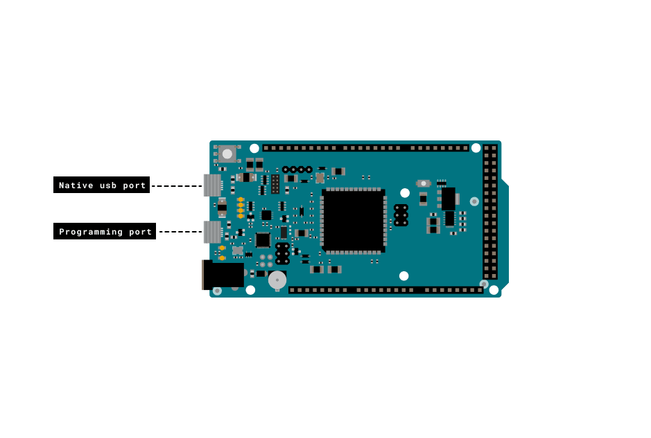

## Introduction

The Arduino Due has the ability to act as a USB host for peripherals such as a keyboard connected to the SerialUSB port. This example demonstrates the use of the KeyboardController library.

## What You Will Learn


- Learn how to use the Arduino Due as a USB host for a keyboard.

## Hardware & Software Needed

- [Arduino Due](https://store.arduino.cc/arduino-due) Board

- USB keyboard (NB : keyboards that connect through an internal USB hub, like Apple keyboards, will not work)
- Arduino IDE ([online](https://create.arduino.cc/) or [offline](https://www.arduino.cc/en/main/software)).
- [USBHost library](https://www.arduino.cc/reference/en/libraries/usbhost/)

## The Circuit

There is no circuit for this tutorial. Simply connect your Arduino Due with the desired USB keyboard.

## Programming the Board

**1.** First, let's make sure we have correct the drivers installed. If we are using the Web Editor, we do not need to install anything. If we are using an offline editor, we need to install it manually. This can be done by navigating to **Tools > Board > Board Manager...**. Here we need to look for the **Arduino SAM boards (32-bits ARM Cortex-M3)** and install it. 

**2.** Now, we need to install the libraries needed. Simply go to **Tools > Manage libraries...** and search for **USBHost** and install it.


The sketch can be found in the snippet below. Upload the sketch to the board.

## Code
Before we begin, let's take a look at some of the core functions in the program:

- `USBHost` - USBHost is the base class for all calls that rely on USB host communication. When invoked, it initializes a USB controller.

- `KeyboardController keyboard(usb);` - KeyboardController is the class for all calls to the USBHost relating to an attached USB keyboard.
  
- `keyPressed()` - A function that is called whenever a key is pressed on a connected USB keyboard.
  
```arduino
/*

 Keyboard Controller HID Example

 Shows the output of a USB Keyboard connected to the USB

 controller of an Arduino Due Board.

 created 8 Oct 2012

 by Cristian Maglie

 */

// Require keyboard control library
#include <KeyboardController.h>

// Initialize USB Controller

USBHost usb;

// Attach keyboard controller to USB

KeyboardController keyboard(usb);

// This function intercepts key press
void keyPressed() {

  Serial.print("Pressed:  ");

  printKey();
}

// This function intercepts key release
void keyReleased() {

  Serial.print("Released: ");

  printKey();
}

void printKey() {

  // getOemKey() returns the OEM-code associated with the key

  Serial.print(" key:");

  Serial.print(keyboard.getOemKey());

  // getModifiers() returns a bits field with the modifiers-keys

  int mod = keyboard.getModifiers();

  Serial.print(" mod:");

  Serial.print(mod);

  Serial.print(" => ");

  if (mod & LeftCtrl)

    Serial.print("L-Ctrl ");

  if (mod & LeftShift)

    Serial.print("L-Shift ");

  if (mod & Alt)

    Serial.print("Alt ");

  if (mod & LeftCmd)

    Serial.print("L-Cmd ");

  if (mod & RightCtrl)

    Serial.print("R-Ctrl ");

  if (mod & RightShift)

    Serial.print("R-Shift ");

  if (mod & AltGr)

    Serial.print("AltGr ");

  if (mod & RightCmd)

    Serial.print("R-Cmd ");

  // getKey() returns the ASCII translation of OEM key

  // combined with modifiers.

  Serial.write(keyboard.getKey());

  Serial.println();
}

void setup()
{

  Serial.begin(115200);

  Serial.println("Program started");

  delay(200);
}

void loop()
{

  // Process USB tasks

  usb.Task();
}
```

## Testing It Out

After you have uploaded the code, plug your keyboard into the Native USB port on the Due. It enables the Due to emulate a USB mouse or keyboard to an attached computer. In the **Arduino IDE**, open the serial monitor and start typing on your keyboard to see the input!




### Troubleshoot

If the code is not working, there are some common issues we can troubleshoot:

- You are using the incorrect USB port
- You have not installed the correct drivers for the Arduino Due.
- You have not installed the [USBHost library](https://www.arduino.cc/reference/en/libraries/usbhost/).

## Conclusion

The Arduino Due has a number of facilities for communicating with a computer, another Arduino or other microcontrollers, and different devices like phones, tablets, cameras and so on. In this example, we have learned how to use the Arduino Due as a USB host for a keyboard. 