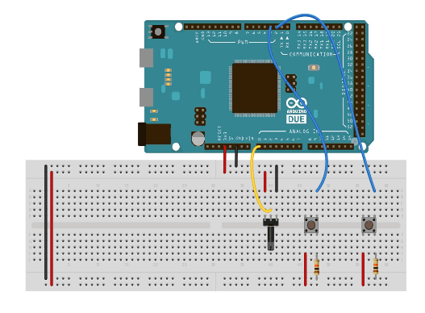
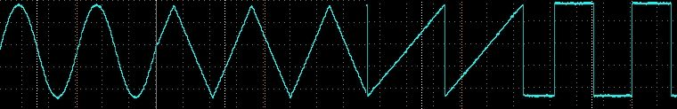

## Introduction

This tutorial shows how to make a simple waveform generator by using the DAC features of the Arduino Due board.

With push buttons, you will be able to choose a waveform shape (sine, triangular, sawtooth, or square) that we will send to to send to the DAC0 and DAC1 channels and change the frequency of the generated signal with a potentiometer.

## Goals

- Create a simple waveform generator.
- Learn about DAC features on the DUE board.

## Hardware & Software Needed

-  [Arduino Due](https://store.arduino.cc/arduino-due)
- 10K Ω potentiometer
- 2x push buttons
- 2x 10K Ω resistors
- Jumper wires
- Breadboard
-  Arduino IDE ([online](https://create.arduino.cc/) or [offline](https://www.arduino.cc/en/main/software)).
- [Waveforms library](https://github.com/hoilett/Waveforms/blob/master/Waveforms.h)
- Oscilloscope (optional)

## Circuit

Connect power and ground on your breadboard to the Arduino. In the image below, the red (power) and black (ground) wires connect to the two long vertical rows on the breadboard, providing access to 3.3V and ground.

Connect a wire from digital pin 2 to one leg of a pushbutton. That same leg of the button connects through a pull-down resistor (10-kilohm) to ground. The other leg of the button connects to the 3.3V power.

Wire up another button in the same fashion, but to digital pin 3.

Hook up the potentiometer by connecting one side to power and the other side to ground. The pin in the middle of the potentiometer goes to analog input 0.

Pins DAC0 and DAC1 will generate the waveform. You can use an oscilloscope to visualize the generated waveforms. 



## Programming the Board

The waveforms are stored inside a two-dimensional array where each row represent a different waveform shape. The waveform samples are contained inside the columns, so you can access the waveform table using two indexes:
 
```arduino
waveformsTable[waveformIndex][samplesIndex]
```

With the waveformIndex array, you choose which samples to read. By incrementing the sampleIndex array from 0 to the maximum in a fixed time, you will create the waveform shape. Repeating this procedure continuously and sending the samples values on the DAC output will give you a constant signal.

In order to choose the waveform shape with a push button, match the button press to the waveformIndex increment. You can use the interrupts, triggering the the press event using the RISING option for easy access. So, when the Arduino Due sees a rising edge on the button pin, it will execute the function linked to the interrupt matched with the button:

`void waveCh0_select()` and `void waveCh1_select()`

The potentiometer connected to analog pin 0 is used to choose the sample rate and the period of the signal is given by the sample rate multiplied for the number of the samples.

Taking into account the time for the instructions to execute, and adding the time for the analog input (around 40 µS to read the pot), maximum frequency for the signal with this sketch is around 170 Hz.

The sketch is composed of two files. One has the two-dimensional arrays, with the table of the samples for all the waveforms for legibility. Download the attached file from [GitHub](https://github.com/hoilett/Waveforms/blob/master/Waveforms.h), or if you want to start from scratch you have to create a new folder inside your sketchbook folder and place the two files inside. The sketch file must have the same name of the folder, and the file with the sample table must be named `"Waveforms.h"`.


### Code

**FunctionGenerator.ino**

```arduino
/*
  Simple Waveform generator with Arduino Due

  * connect two push buttons to the digital pins 2 and 3
    with a 10 kilohm pulldown resistor to choose the waveform
    to send to the DAC0 and DAC1 channels
  * connect a 10 kilohm potentiometer to A0 to control the
    signal frequency

 */

#include "Waveforms.h"

#define oneHzSample 1000000/maxSamplesNum  // sample for the 1Hz signal expressed in microseconds

const int button0 = 2, button1 = 3;
volatile int wave0 = 0, wave1 = 0;

int i = 0;
int sample;


void setup() {
  analogWriteResolution(12);  // set the analog output resolution to 12 bit (4096 levels)
  analogReadResolution(12);   // set the analog input resolution to 12 bit

  attachInterrupt(button0, wave0Select, RISING);  // Interrupt attached to the button connected to pin 2
  attachInterrupt(button1, wave1Select, RISING);  // Interrupt attached to the button connected to pin 3
}

void loop() {
  // Read the the potentiometer and map the value  between the maximum and the minimum sample available
  // 1 Hz is the minimum freq for the complete wave
  // 170 Hz is the maximum freq for the complete wave. Measured considering the loop and the analogRead() time
  sample = map(analogRead(A0), 0, 4095, 0, oneHzSample);
  sample = constrain(sample, 0, oneHzSample);

  analogWrite(DAC0, waveformsTable[wave0][i]);  // write the selected waveform on DAC0
  analogWrite(DAC1, waveformsTable[wave1][i]);  // write the selected waveform on DAC1

  i++;
  if(i == maxSamplesNum)  // Reset the counter to repeat the wave
    i = 0;

  delayMicroseconds(sample);  // Hold the sample value for the sample time
}

// function hooked to the interrupt on digital pin 2
void wave0Select() {
  wave0++;
  if(wave0 == 4)
    wave0 = 0;
}

// function hooked to the interrupt on digital pin 3
void wave1Select() {
  wave1++;
  if(wave1 == 4)
    wave1 = 0;
}
```

**Waveforms.h**

```arduino

#ifndef _Waveforms_h_
#define _Waveforms_h_

#define maxWaveform 4
#define maxSamplesNum 120

static int waveformsTable[maxWaveform][maxSamplesNum] = {
  // Sin wave
  {
    0x7ff, 0x86a, 0x8d5, 0x93f, 0x9a9, 0xa11, 0xa78, 0xadd, 0xb40, 0xba1,
    0xbff, 0xc5a, 0xcb2, 0xd08, 0xd59, 0xda7, 0xdf1, 0xe36, 0xe77, 0xeb4,
    0xeec, 0xf1f, 0xf4d, 0xf77, 0xf9a, 0xfb9, 0xfd2, 0xfe5, 0xff3, 0xffc,
    0xfff, 0xffc, 0xff3, 0xfe5, 0xfd2, 0xfb9, 0xf9a, 0xf77, 0xf4d, 0xf1f,
    0xeec, 0xeb4, 0xe77, 0xe36, 0xdf1, 0xda7, 0xd59, 0xd08, 0xcb2, 0xc5a,
    0xbff, 0xba1, 0xb40, 0xadd, 0xa78, 0xa11, 0x9a9, 0x93f, 0x8d5, 0x86a,
    0x7ff, 0x794, 0x729, 0x6bf, 0x655, 0x5ed, 0x586, 0x521, 0x4be, 0x45d,
    0x3ff, 0x3a4, 0x34c, 0x2f6, 0x2a5, 0x257, 0x20d, 0x1c8, 0x187, 0x14a,
    0x112, 0xdf, 0xb1, 0x87, 0x64, 0x45, 0x2c, 0x19, 0xb, 0x2,
    0x0, 0x2, 0xb, 0x19, 0x2c, 0x45, 0x64, 0x87, 0xb1, 0xdf,
    0x112, 0x14a, 0x187, 0x1c8, 0x20d, 0x257, 0x2a5, 0x2f6, 0x34c, 0x3a4,
    0x3ff, 0x45d, 0x4be, 0x521, 0x586, 0x5ed, 0x655, 0x6bf, 0x729, 0x794
  }
  ,

  // Triangular wave
  {
    0x44, 0x88, 0xcc, 0x110, 0x154, 0x198, 0x1dc, 0x220, 0x264, 0x2a8,
    0x2ec, 0x330, 0x374, 0x3b8, 0x3fc, 0x440, 0x484, 0x4c8, 0x50c, 0x550,
    0x594, 0x5d8, 0x61c, 0x660, 0x6a4, 0x6e8, 0x72c, 0x770, 0x7b4, 0x7f8,
    0x83c, 0x880, 0x8c4, 0x908, 0x94c, 0x990, 0x9d4, 0xa18, 0xa5c, 0xaa0,
    0xae4, 0xb28, 0xb6c, 0xbb0, 0xbf4, 0xc38, 0xc7c, 0xcc0, 0xd04, 0xd48,
    0xd8c, 0xdd0, 0xe14, 0xe58, 0xe9c, 0xee0, 0xf24, 0xf68, 0xfac, 0xff0,
    0xfac, 0xf68, 0xf24, 0xee0, 0xe9c, 0xe58, 0xe14, 0xdd0, 0xd8c, 0xd48,
    0xd04, 0xcc0, 0xc7c, 0xc38, 0xbf4, 0xbb0, 0xb6c, 0xb28, 0xae4, 0xaa0,
    0xa5c, 0xa18, 0x9d4, 0x990, 0x94c, 0x908, 0x8c4, 0x880, 0x83c, 0x7f8,
    0x7b4, 0x770, 0x72c, 0x6e8, 0x6a4, 0x660, 0x61c, 0x5d8, 0x594, 0x550,
    0x50c, 0x4c8, 0x484, 0x440, 0x3fc, 0x3b8, 0x374, 0x330, 0x2ec, 0x2a8,
    0x264, 0x220, 0x1dc, 0x198, 0x154, 0x110, 0xcc, 0x88, 0x44, 0x0
  }
  ,

  // Sawtooth wave
  {
    0x22, 0x44, 0x66, 0x88, 0xaa, 0xcc, 0xee, 0x110, 0x132, 0x154,
    0x176, 0x198, 0x1ba, 0x1dc, 0x1fe, 0x220, 0x242, 0x264, 0x286, 0x2a8,
    0x2ca, 0x2ec, 0x30e, 0x330, 0x352, 0x374, 0x396, 0x3b8, 0x3da, 0x3fc,
    0x41e, 0x440, 0x462, 0x484, 0x4a6, 0x4c8, 0x4ea, 0x50c, 0x52e, 0x550,
    0x572, 0x594, 0x5b6, 0x5d8, 0x5fa, 0x61c, 0x63e, 0x660, 0x682, 0x6a4,
    0x6c6, 0x6e8, 0x70a, 0x72c, 0x74e, 0x770, 0x792, 0x7b4, 0x7d6, 0x7f8,
    0x81a, 0x83c, 0x85e, 0x880, 0x8a2, 0x8c4, 0x8e6, 0x908, 0x92a, 0x94c,
    0x96e, 0x990, 0x9b2, 0x9d4, 0x9f6, 0xa18, 0xa3a, 0xa5c, 0xa7e, 0xaa0,
    0xac2, 0xae4, 0xb06, 0xb28, 0xb4a, 0xb6c, 0xb8e, 0xbb0, 0xbd2, 0xbf4,
    0xc16, 0xc38, 0xc5a, 0xc7c, 0xc9e, 0xcc0, 0xce2, 0xd04, 0xd26, 0xd48,
    0xd6a, 0xd8c, 0xdae, 0xdd0, 0xdf2, 0xe14, 0xe36, 0xe58, 0xe7a, 0xe9c,
    0xebe, 0xee0, 0xf02, 0xf24, 0xf46, 0xf68, 0xf8a, 0xfac, 0xfce, 0xff0
  }
  ,

  // Square wave
  {
    0xfff, 0xfff, 0xfff, 0xfff, 0xfff, 0xfff, 0xfff, 0xfff, 0xfff, 0xfff,
    0xfff, 0xfff, 0xfff, 0xfff, 0xfff, 0xfff, 0xfff, 0xfff, 0xfff, 0xfff,
    0xfff, 0xfff, 0xfff, 0xfff, 0xfff, 0xfff, 0xfff, 0xfff, 0xfff, 0xfff,
    0xfff, 0xfff, 0xfff, 0xfff, 0xfff, 0xfff, 0xfff, 0xfff, 0xfff, 0xfff,
    0xfff, 0xfff, 0xfff, 0xfff, 0xfff, 0xfff, 0xfff, 0xfff, 0xfff, 0xfff,
    0xfff, 0xfff, 0xfff, 0xfff, 0xfff, 0xfff, 0xfff, 0xfff, 0xfff, 0xfff,
    0x0, 0x0, 0x0, 0x0, 0x0, 0x0, 0x0, 0x0, 0x0, 0x0,
    0x0, 0x0, 0x0, 0x0, 0x0, 0x0, 0x0, 0x0, 0x0, 0x0,
    0x0, 0x0, 0x0, 0x0, 0x0, 0x0, 0x0, 0x0, 0x0, 0x0,
    0x0, 0x0, 0x0, 0x0, 0x0, 0x0, 0x0, 0x0, 0x0, 0x0,
    0x0, 0x0, 0x0, 0x0, 0x0, 0x0, 0x0, 0x0, 0x0, 0x0,
    0x0, 0x0, 0x0, 0x0, 0x0, 0x0, 0x0, 0x0, 0x0, 0x0
  }

};

#endif
```


## Testing It Out

After you have uploaded the code, use the pushbuttons that you have hooked up to the breadboard to generate waveforms. If you have an oscilloscope, you can use it to visualize the different waveforms that you generate. You can control the signal frequency by using the potentiometer connected to `A0`.




### Troubleshoot

If the code is not working, there are some common issues we can troubleshoot:

- The wiring is incorrect.
- You have not installed or included all of the libraries.
- Make sure there are no missing curly brackets {}.
- We have not selected the right port and board.


## Conclusion

In this example, we have learned how to generate waveforms by using the DAC features of the Arduino Due. 
