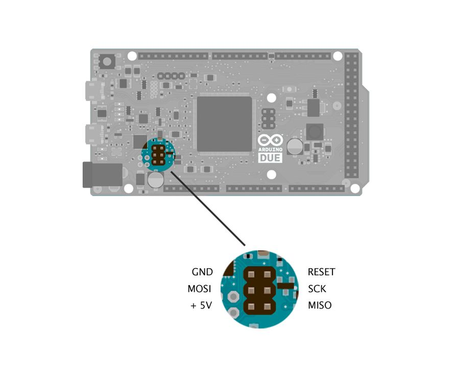

## Introduction

Behind the Arduino Due Programming port there is an AVR microcontroller (ATmega16U2) which converts the USB signals coming from the computer to the first serial port of the SAM3X. In this tutorial you will update the ATmega16U2 firmware using an Arduino UNO or Mega as an AVR-ISP (in-system programmer).

## Instructions

To use your Arduino board to burn a bootloader onto an AVR, you need to follow a few simple steps.

**1.** Open the **ArduinoISP** sketch (in **Examples**) in the Arduino IDE.

**2.** Select the items in the **Tools > Board** and **Serial Port** menus that correspond to the board you are using as the programmer (not the board being programmed).

**3.** Upload the ArduinoISP sketch.

**4.** Connect a 10uF (micro Farad) capacitor between the GND and RESET pin.

**5.** Connect the following pins from the Arduino UNO (or Mega) to the ATmega16U2 ICSP connector:

||UNO|Mega|16U2 ICSP|
|-|-|-|-|
|SCK|13|52|3|
|MISO|12|50|1|
|MOSI|11|51|4|
|Reset|10|10|5|
|GND|GND|GND|6|
|+5V|5V|5V|2|



The Arduino Due will take power from the Arduino UNO set as AVR programmer. If you want further details on the connections between the UNO/Mega and the ICSP connector of the target please look this tutorial: [Arduino as AVR-ISP](https://www.arduino.cc/en/Tutorial/ArduinoISP).

## Upgrade the Firmware Using Avrdude

To upgrade the firmware you need to use a command line tool called "avrdude", that is already included inside your IDE folder. You find it at the following path: `/path_to_arduino/arduino.1.5.x/hardware/tools`


The firmware to upload on the 16U2 is in a binary format that has the .hex extension.

### Linux and Mac

First thing to do is to go to the directory that contains the avrdude tools that comes with the IDE. For doing that, open a terminal window and type:

`cd /home/USER/arduino-1.5.2/hardware/tools`

the path to reach the Arduino directory depends on where you placed it. Then you can execute the avrdude tool specifying all the parameters you need to flash the firmware. Here is the complete line:


```
/home/USER/arduino-1.5.2/hardware/tools$ ./avrdude -C avrdude.conf -c arduino -P /dev/ttyACM0 -b 19200 -p m16u2 -vvv -U flash:w:/home/USER/newFirmware/16u2.hex:i
```

### Windows

First thing to do is to go to the directory that contains the avrdude tools that comes with the IDE. For doing that open a command prompt window clicking on Start and typing `cmd` then press enter.

Once the command prompt is open should display a row like this: `C:\Users\USER` then type the following command to move inside the Arduino folder (it depends where you placed it): `cd arduino-1.5.2\hardware\tools`.

the path to reach the Arduino directory depends where you placed it. Then you can execute the avrdude tool specifying all the parameters you need to flash the firmware. Here is the complete line:


```
arduino-1.5.2/hardware/tool> avrdude.exe -C avrdude.conf -c arduino -P /dev/ttyACM0 -b 19200 -p m16u2 -vvv -U flash:w:/home/USER/newFirmware/16u2.hex:i
```

### Avrdude Parameter Explanations

| | |
|-|-|
|`-C avrdude.conf`|load the configuration file for using the Arduino UNO as programmer|
|`-c arduino`|specify the programmer you want to use|
|`-P /dev/ttyACM0`|the usb port where the programmer is attached|
|`-b 19200`|the baudrate|
|`-p m16u2`|the target device you want to program|
|`-vvv`|enable the verbose output|
|`-U flash:w:/home/USER/newFirmware/16u2.hex:i`|specify that you want to write (w) the .hex file inside the flash memory|
