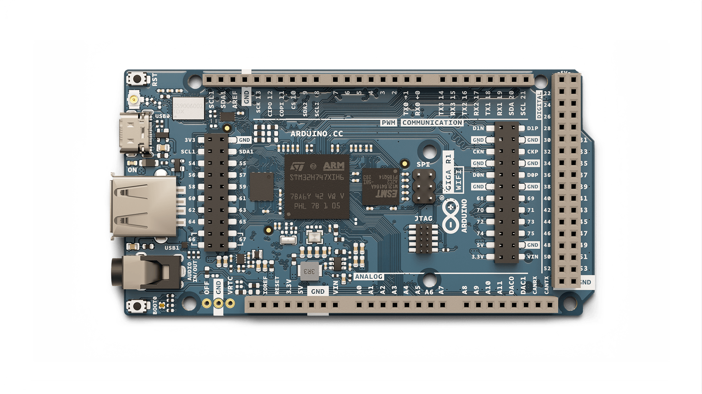
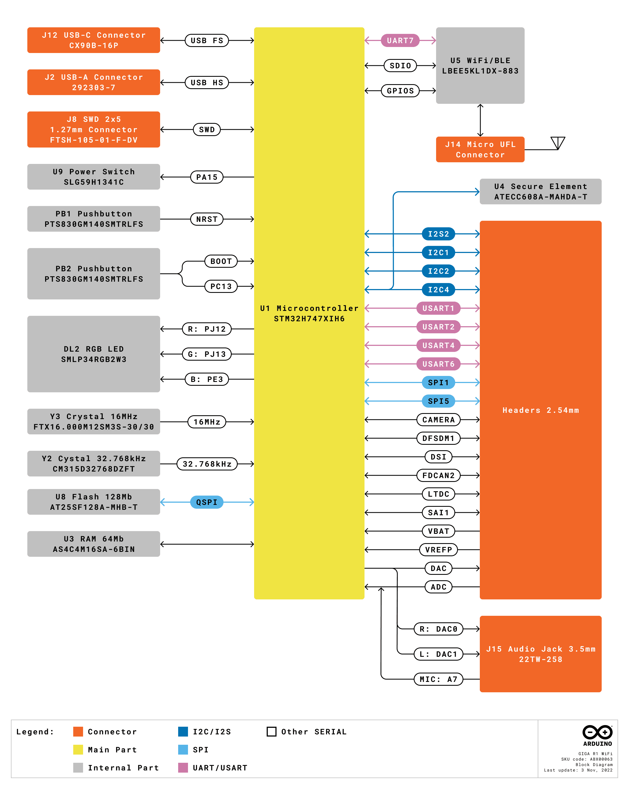
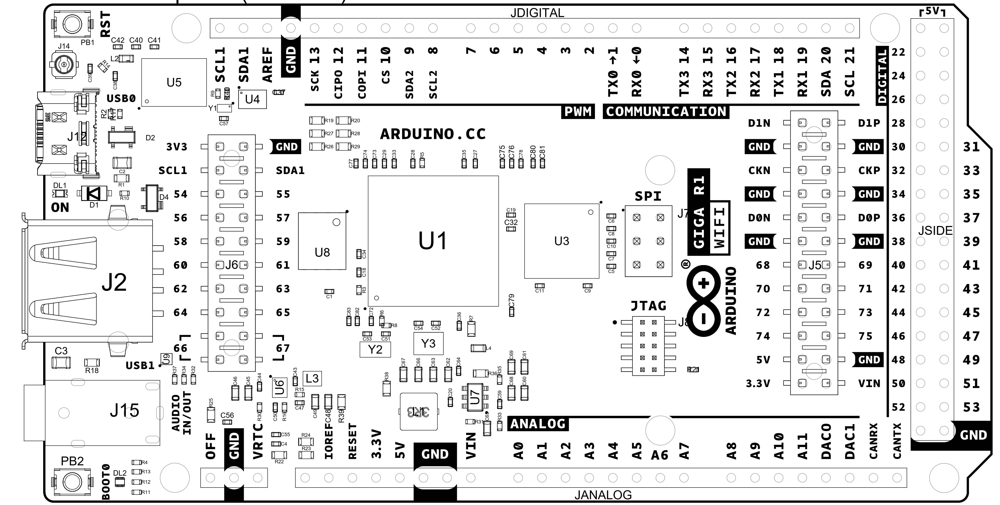
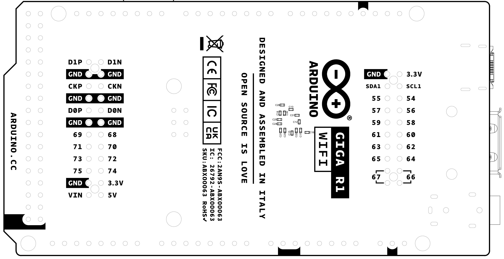
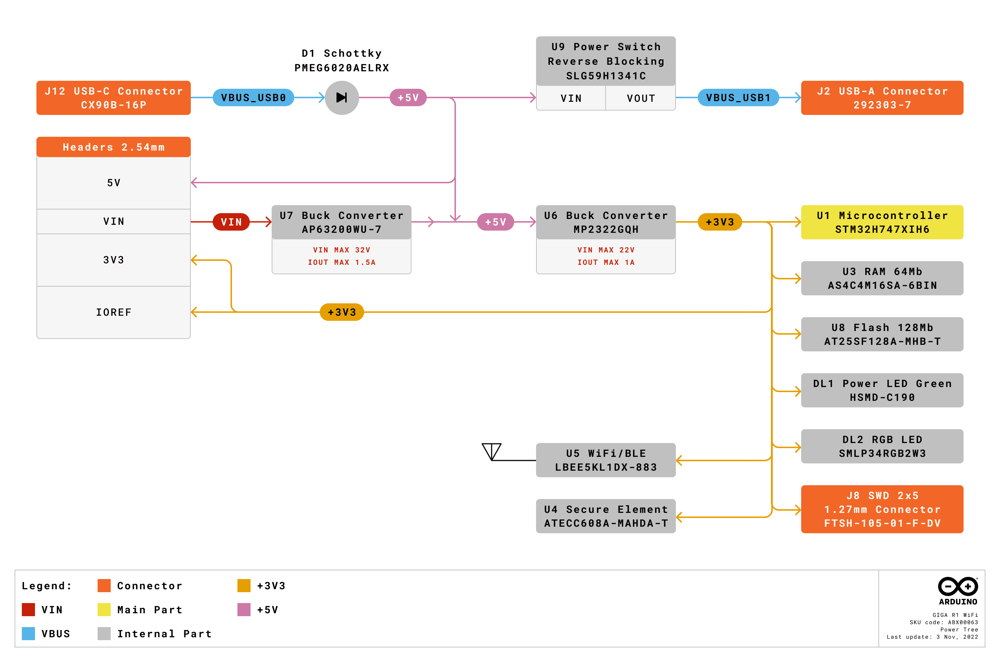

# Description

The Arduino GIGA R1 WiFi brings the power of the STM32H7 to the Mega form factor, being the first Mega board to include onboard Wi-Fi® and Bluetooth® connectivity. The board provides 76 digital inputs/outputs (13 with PWM capability), 14 analog inputs and 2 analog outputs (DAC) all easily accessible via pin headers. The STM32 microprocessor with dual-core Cortex® M7 and Cortex® M4, together with onboard memory and audio jack enables you to perform machine learning and signal processing on the edge.

# Target Areas

3D printing, Signal Processing, Maker, Robotics

# Features

- **STM32H747XIH6** Microcontroller
  - Dual-core
    - 32-bit Arm® Cortex®-M7 core with double-precision FPU and L1 cache up to 480 MHz
    - 32-bit Arm® 32-bit Cortex®-M4 core with FPU up to 240 MHz
  - Full set of DSP instructions
  - Memory Protection Unit (MPU)
- **Murata® 1DX** Wi-Fi®/Bluetooth® Module
  - Wi-Fi® 802.11b/g/n 65 Mbps
  - Bluetooth® Low Energy (version 5.X via Cordio stack, version 4.2 via Arduino Stack)
  - Micro UFL connector for external antenna
- **Memory**
  - **STM32H747XI**
    - 2 MB Flash
    - 1 MB RAM
  - **AT25SF128A-MHB-T**
    - 16 MB NOR Flash
    - QSPI Interface
  - **AS4C4M16SA**
    - 8 MB SDRAM
- **I/O**
  - Digital I/O Pins: 76
  - Analog input pins: 12
  - PWM pins: 13
  - Analog output pins (DAC0/DAC1): 2
  - USB Host: USB 2.0 A
  - USB Peripheral: USB-C®
  - Logic level: 3.3V
  - VRTC: To power the RTC while the board is off
  - OFF pin: To turn off the board
- **Communication**
  - 4x UART
  - 3x I2C
  - 2x SPI
  - 1x CAN (an external transceiver is required)
- **Secure Element** ATECC608A-MAHDA-T Module
- **USB**
  - **USB Host** USB 2.0 Type A
    - Host
  - **USB Peripheral** USB-C®
    - Programming Port
    - HID
- **Connectors**
  - Camera: 20 pin Arducam camera connector
  - Display: D1N, D0N, D1P, D0P, CKN, CKP, D68-D75
  - Audio jack: DAC0, DAC1, A7
  - JTAG connector
- **Power**
  - Circuit operating voltage: 3.3V
  - Input voltage (VIN): 6-24V
  - DC Current per I/O Pin: 8 mA

# Contents

# The Board

## Application Examples

The GIGA R1 WiFi combines the best of the Portenta H7 and the Mega 2560. A generous amount of I/O easily accessible via pins allows for easy and fast testing of new ideas and solutions. The STM32H7 has ample power to handle machine-learning tasks. Your IoT projects can even benefit from the Arduino Cloud with the help of the onboard secure element and its wireless connectivity.

- **3D Printing:** The Mega form factor has been very popular for creating 3D printers. Connect sensors to the high-resolution ADC interfaces for high-performance sensing of the 3D printing process. Together with the dual-core computing power, control the printing process like never before. Monitor filament usage and print status locally over Bluetooth® or from anywhere in the world with the Arduino Cloud, or any other third-party service, and its Wi-Fi® features.

- **Audio Processing:** The GIGA R1 WiFi provides a 3.5 mm audio input/output to easily interact with audio signals in the environment. Analyse and create audio signals directly on the board. Connect a microphone and control a wide range of digital and analog devices. Create your own musical instrument and change the note through the various inputs. Create an online concert with the Arduino Cloud or any other third-party service and connect with people all over the world.

- **Data acquisition device:** Thanks to the numerous analog inputs, including the jack connector (J15) and the two DAC outputs with a resolution up to 12 bits, you can create your own data acquisition device. Make your own multimeter or even an oscilloscope and create an online dashboard with the Arduino Cloud or any other third-party service. Design your own electrochemical experiments, apply custom current/voltage waveforms and check the status of your experiment from the comfort of your home.

## Accessories

- Micro UFL antenna (Included)
- USB-C® cable (Not included)
- USB 2.0 Type-A cable (Not included)

## Related Products

- Arduino Mega Proto Shield Rev3 (A000080)
- Arduino 4 Relays Shield (A000110)
- Arduino Motor Shield Rev3 (A000079)

# Rating

## Recommended Operating Conditions

| Symbol          | Description                      | Min                | Typ | Max                | Unit |
|-----------------|----------------------------------|--------------------|-----|--------------------|------|
| VIN  | Input voltage from VIN pad       | 6                  | 7.0 | 32                 | V    |
| VUSB | Input voltage from USB connector | 4.8                | 5.0 | 5.5                | V    |
| VDD  | Input high-level voltage         | 0.7*VDD |     | VDD     | V    |
| VIL  | Input low-level voltage          | 0                  |     | 0.3*VDD | V    |
| TOP  | Operating Temperature            | -40                | 25  | 85                 | °C   |

**Note:** VDD controls the logic level and is connected to the 3.3V power rail. VAREF is for the analog logic.

 

# Functional Overview

## Block Diagram

## Board Topology

### Front View

| **Ref.** | **Description**                         | **Ref.** | **Description**                     |
|----------|-----------------------------------------|----------|-------------------------------------|
| U1       | STM32H7 Dual Core Microcontroller IC    | U8       | AT25SF128A-MHB-T 16 MB Flash IC     |
| U3       | AS4C4M16SA 8MB SDRAM IC                 | U4       | ATECC608A-MAHDA-T Secure Element IC |
| U5       | LBEE5KL1DX-883 Wi-Fi®/Bluetooth® Module | U6       | MP2322GQH Buck Converter 3.3V IC    |
| U7       | MP2269GD-Z Buck Converter 5V IC         | JANALOG  | Analog input/output headers         |
| JDIGITAL | Digital input/output headers            | JSIDE    | Digital input/output headers        |
| SPI      | SPI headers                             | JTAG     | JTAG Headers                        |
| J2       | USB 2.0 A Host                          | J15      | 3.5 mm audio in/out                 |
| PB1      | RESET Button                            | PB2      | BOOT0 button                        |
| J14      | Micro UFL connector                     | J5       | Camera                              |
| J6       | Camera                                  | DL1      | Power LED                           |
| DL2      | RGB SMLP34RGB2W3 Common anode LED       | J12      | CX90B-16P USB-C® connector          |

### Back View

## Processor

The GIGA R1 WiFi's main processor is the dual-core STM32H747 (U1) including a Cortex® M7 running at 480 MHz and a Cortex® M4 running at 240 MHz. The two cores communicate via a _Remote Procedure Call_ mechanism that allows calling functions between each processor seamlessly.

## Wi-Fi®/Bluetooth® Connectivity

The Murata® LBEE5KL1DX-883 wireless module (U5) simultaneously provides Wi-Fi® and Bluetooth® connectivity in an ultra-small package based on the Cypress CYW4343W. The IEEE802.11 b/g/n Wi-Fi® interface can be operated as an access point (AP), station (STA) or as a dual mode simultaneous AP/STA and supports a maximum transfer rate of 65 Mbps. Bluetooth® interface supports Bluetooth® Classic and Bluetooth® Low Energy. An integrated antenna circuitry switch allows a single external antenna (J14) to be shared between Wi-Fi® and Bluetooth®.

## Onboard Memories

The GIGA R1 WiFi supplements the 2 MB Flash and 1 MB SRAM on the STM32H747 (U1) with 16 MB of NOR Flash with the AT25SF128A-MHB-T (U8) as well as 8 MB of SDRAM with the AS4C4M16SA (U3). U8 connects over a Quad-SPI interface to the main processor (U1). U3 operates at a frequency of 166 MHz.

## USB Connector

Two USB ports are provided on the Arduino GIGA R1 WiFi. One USB 2.0 type A (J2) and a USB-C® (J12). The USB 2.0 connector allows external devices to be connected as peripherals, while the USB-C® connector allows the GIGA board to be connected as a peripheral for other devices. Note that super speed pins on the USB-C® connector (J12) are unpopulated. A TVS diode array is placed on the VBUS of each connector (D4, D2) for ESD protection purposes.

## Audio

The STM32H7 (U1) has two digital-to-analog converters (DAC) which drive the stereo audio output on the 3.5 mm jack connector (J15). Each DAC has a resolution of up to 12 bits. The right and left channels are also accessible via pins DAC0 and DAC1 respectively. A microphone input is also present on the jack connector (J15), which is shared with analog pin A7. The _Buffered mode_ in the STM32H7 can allow for low-impedance output while _Sample and hold_ functionality can help to reduce power consumption. Up to 10 mega samples per second are supported.

 

## Power Tree

Power can either be supplied via the VIN pins, or the 5V of the USB connectors (J2, J12). If power is supplied via VIN, the MP2269GD-Z (U7) buck converter steps the voltage down to 5V. The 5V power rail is then stepped down to 3.3V by the MP2322GQH (U6) buck converter. The logic level of components on the Arduino GIGA R1 WiFi is 3.3V.

## Board Operation

### Getting Started - IDE

If you want to program your GIGA R1 WiFi while offline you need to install the Arduino® Desktop IDE **[1]**. To connect the GIGA R1 WiFi to your computer, you will need a Type-C® USB cable, which can also provide power to the board, as indicated by the LED (DL1).

### Getting Started - Arduino Web Editor

All Arduino boards, including this one, work out-of-the-box on the Arduino® Web Editor **[2]**, by just installing a simple plugin.

The Arduino Web Editor is hosted online, therefore it will always be up-to-date with the latest features and support for all boards. Follow **[3]** to start coding on the browser and upload your sketches onto your board.

### Getting Started - Arduino Cloud

All Arduino IoT enabled products are supported on Arduino Cloud which allows you to log, graph and analyze sensor data, trigger events, and automate your home or business.

### Online Resources

Now that you have gone through the basics of what you can do with the board you can explore the endless possibilities it provides by checking exciting projects on ProjectHub **[4]**, the Arduino Library Reference **[5]**, and the online store **[6]**; where you will be able to complement your board with sensors, actuators and more.

### Board Recovery

All Arduino boards have a built-in bootloader which allows flashing the board via USB. In case a sketch locks up the processor and the board is not reachable anymore via USB, it is possible to enter bootloader mode by double-tapping the reset button right after the power-up.

# Mechanical Information

## Pinout

### Three-Pins Header - J1
| Pin | Function | Type    | Description             |
|-----|----------|---------|-------------------------|
| 1   | OFF      | Digital | 3V3 Enable Pin (U6)     |
| 2   | GND      | Power   | Ground                  |
| 3   | VRTC     | Reset   | Real Time Clock Battery |

### Analog

| Pin  | Function   | Type      | Description                                     |
| ---- | ---------- | --------- | ----------------------------------------------- |
|  1   | NC         | NC        | Not Connected                                   |
|  2   | IOREF      | IOREF     | Reference for digital logic V - connected to 3.3V |
|  3   | Reset      | Reset     | Reset                                           |
|  4   | +3V3       | Power     | +3V3 Power Rail                                 |
|  5   | +5V        | Power     | +5V Power Rail                                  |
|  6   | GND        | Power     | Ground                                          |
|  7   | GND        | Power     | Ground                                          |
|  8   | VIN        | Power     | Voltage Input                                   |
|  9   | A0         | Analog    | Analog input 0 /GPIO                            |
|  10  | A1         | Analog    | Analog input 1 /GPIO                            |
|  11  | A2         | Analog    | Analog input 2 /GPIO                            |
|  12  | A3         | Analog    | Analog input 3 /GPIO                            |
|  13  | A4         | Analog    | Analog input 4 /GPIO                            |
|  14  | A5         | Analog    | Analog input 5 /GPIO                            |
|  15  | A6         | Analog    | Analog input 6 /GPIO                            |
|  16  | A7         | Analog    | Analog input 7 /GPIO                            |
|  17  | A8         | Analog    | Analog input 8 /GPIO                            |
|  18  | A9         | Analog    | Analog input 9 /GPIO                            |
|  19  | A10        | Analog    | Analog input 10 /GPIO                           |
|  20  | A11        | Analog    | Analog input 11 /GPIO                           |
|  21  | DAC0       | Analog    | Digital to Analog Converter 0                   |
|  22  | DAC1       | Analog    | Digital to Analog Converter 1                   |
|  23  | CANRX      | Digital   | CAN Bus Receive                                 |
|  24  | CANTX      | Digital   | CAN Bus Transfer                                |

### Digital

| Pin | Function | Type    | Description                                     |
| --- | -------- | ------- | ----------------------------------------------- |
| 1   | D21/SCL1 | Digital | GPIO 21/I2C 1 Clock                             |
| 2   | D20/SDA1 | Digital | GPIO 20/I2C 1 Dataline                          |
| 3   | AREF     | Digital | Analog Reference Voltage                        |
| 4   | GND      | Power   | Ground                                          |
| 5   | D13/SCK  | Digital | GPIO 13/SPI Clock (PWM~)                        |
| 6   | D12/CIPO | Digital | GPIO 12/SPI Controller In Peripheral Out (PWM~) |
| 7   | D11/COPI | Digital | GPIO 11/SPI Controller Out Peripheral In (PWM~) |
| 8   | D10/CS   | Digital | GPIO 10/SPI Chip Select (PWM~)                  |
| 9   | D9/SDA2  | Digital | GPIO 9/I2C 2 Dataline (PWM~)                    |
| 10  | D8/SCL2  | Digital | GPIO 8/I2C 2 Clockline (PWM~)                   |
| 11  | D7       | Digital | GPIO 7 (PWM~)                                   |
| 12  | D6       | Digital | GPIO 6 (PWM~)                                   |
| 13  | D5       | Digital | GPIO 5 (PWM~)                                   |
| 14  | D4       | Digital | GPIO 4 (PWM~)                                   |
| 15  | D3       | Digital | GPIO 3 (PWM~)                                   |
| 16  | D2       | Digital | GPIO 2 (PWM~)                                   |
| 17  | D1/TX0   | Digital | GPIO 1 / Serial 0 Transmitter                   |
| 18  | D0/TX0   | Digital | GPIO 0 / Serial 0 Receiver                      |
| 19  | D14/TX3  | Digital | GPIO 14 / Serial 3 Transmitter                  |
| 20  | D15/RX3  | Digital | GPIO 15 / Serial 3 Receiver                     |
| 21  | D16/TX2  | Digital | GPIO 16 / Serial 2 Transmitter                  |
| 22  | D17/RX2  | Digital | GPIO 17 / Serial 2 Receiver                     |
| 23  | D18/TX1  | Digital | GPIO 18 / Serial 1 Transmitter                  |
| 24  | D19/RX1  | Digital | GPIO 19 / Serial 1 Receiver                     |
| 25  | D20/SDA  | Digital | GPIO 20 / I2C 0 Dataline                        |
| 26  | D21/SCL  | Digital | GPIO 21 / I2C 0 Clock                           |

### STM32 ICSP

| Pin | Function | Type     | Description                  |
|-----|----------|----------|------------------------------|
| 1   | CIPO     | Internal | Controller In Peripheral Out |
| 2   | +5V      | Internal | Power Supply of 5V           |
| 3   | SCK      | Internal | Serial Clock                 |
| 4   | COPI     | Internal | Controller Out Peripheral In |
| 5   | RESET    | Internal | Reset                        |
| 6   | GND      | Internal | Ground                       |

### Digital Pins D22 - D53 LHS

| Pin | Function | Type    | Description    |
|-----|----------|---------|----------------|
| 1   | +5V      | Power   | +5V Power Rail |
| 2   | D22      | Digital | GPIO 22        |
| 3   | D24      | Digital | GPIO 24        |
| 4   | D26      | Digital | GPIO 26        |
| 5   | D28      | Digital | GPIO 28        |
| 6   | D30      | Digital | GPIO 30        |
| 7   | D32      | Digital | GPIO 32        |
| 8   | D34      | Digital | GPIO 34        |
| 9   | D36      | Digital | GPIO 36        |
| 10  | D38      | Digital | GPIO 38        |
| 11  | D40      | Digital | GPIO 40        |
| 12  | D42      | Digital | GPIO 42        |
| 13  | D44      | Digital | GPIO 44        |
| 14  | D46      | Digital | GPIO 46        |
| 15  | D48      | Digital | GPIO 48        |
| 16  | D50      | Digital | GPIO 50        |
| 17  | D52      | Digital | GPIO 52        |
| 18  | GND      | Power   | Ground         |

### Digital Pins D22 - D53 RHS

| Pin | Function | Type    | Description    |
|-----|----------|---------|----------------|
| 1   | +5V      | Power   | +5V Power Rail |
| 2   | D23      | Digital | GPIO 23        |
| 3   | D25      | Digital | GPIO 25        |
| 4   | D27      | Digital | GPIO 27        |
| 5   | D29      | Digital | GPIO 29        |
| 6   | D31      | Digital | GPIO 31        |
| 7   | D33      | Digital | GPIO 33        |
| 8   | D35      | Digital | GPIO 35        |
| 9   | D37      | Digital | GPIO 37        |
| 10  | D39      | Digital | GPIO 39        |
| 11  | D41      | Digital | GPIO 41        |
| 12  | D43      | Digital | GPIO 43        |
| 13  | D45      | Digital | GPIO 45        |
| 14  | D47      | Digital | GPIO 47        |
| 15  | D49      | Digital | GPIO 49        |
| 16  | D51      | Digital | GPIO 51        |
| 17  | D53      | Digital | GPIO 53        |
| 18  | GND      | Power   | Ground         |

## Mounting Holes And Board Outline

 

# Certifications

## Declaration of Conformity CE DoC (EU)

We declare under our sole responsibility that the products above are in conformity with the essential requirements of the following EU Directives and therefore qualify for free movement within markets comprising the European Union (EU) and European Economic Area (EEA).

## Declaration of Conformity to EU RoHS & REACH 211 01/19/2021

Arduino boards are in compliance with RoHS 2 Directive 2011/65/EU of the European Parliament and RoHS 3 Directive 2015/863/EU of the Council of 4 June 2015 on the restriction of the use of certain hazardous substances in electrical and electronic equipment.

| **Substance**                          | **Maximum Limit (ppm)** |
|----------------------------------------|-------------------------|
| Lead (Pb)                              | 1000                    |
| Cadmium (Cd)                           | 100                     |
| Mercury (Hg)                           | 1000                    |
| Hexavalent Chromium (Cr6+)             | 1000                    |
| Poly Brominated Biphenyls (PBB)        | 1000                    |
| Poly Brominated Diphenyl ethers (PBDE) | 1000                    |
| Bis(2-Ethylhexyl} phthalate (DEHP)     | 1000                    |
| Benzyl butyl phthalate (BBP)           | 1000                    |
| Dibutyl phthalate (DBP)                | 1000                    |
| Diisobutyl phthalate (DIBP)            | 1000                    |

Exemptions : No exemptions are claimed.

Arduino Boards are fully compliant with the related requirements of European Union Regulation (EC) 1907 /2006 concerning the Registration, Evaluation, Authorization and Restriction of Chemicals (REACH). We declare none of the SVHCs ([https://echa.europa.eu/web/guest/candidate-list-table](https://echa.europa.eu/web/guest/candidate-list-table)), the Candidate List of Substances of Very High Concern for authorization currently released by ECHA, is present in all products (and also package) in quantities totaling in a concentration equal or above 0.1%. To the best of our knowledge, we also declare that our products do not contain any of the substances listed on the "Authorization List" (Annex XIV of the REACH regulations) and Substances of Very High Concern (SVHC) in any significant amounts as specified by the Annex XVII of Candidate list published by ECHA (European Chemical Agency) 1907 /2006/EC.

## Conflict Minerals Declaration

As a global supplier of electronic and electrical components, Arduino is aware of our obligations with regards to laws and regulations regarding Conflict Minerals, specifically the Dodd-Frank Wall Street Reform and Consumer Protection Act, Section 1502. Arduino does not directly source or process conflict minerals such as Tin, Tantalum, Tungsten, or Gold. Conflict minerals are contained in our products in the form of solder, or as a component in metal alloys. As part of our reasonable due diligence Arduino has contacted component suppliers within our supply chain to verify their continued compliance with the regulations. Based on the information received thus far we declare that our products contain Conflict Minerals sourced from conflict-free areas.

## FCC Caution

Any Changes or modifications not expressly approved by the party responsible for compliance could void the user’s authority to operate the equipment.

This device complies with part 15 of the FCC Rules. Operation is subject to the following two conditions:

(1) This device may not cause harmful interference

(2) this device must accept any interference received, including interference that may cause undesired operation.

**FCC RF Radiation Exposure Statement:**

1. This Transmitter must not be co-located or operating in conjunction with any other antenna or transmitter.

2. This equipment complies with RF radiation exposure limits set forth for an uncontrolled environment.

3. This equipment should be installed and operated with a minimum distance of 20 cm between the radiator & your body.

English:
User manuals for licence-exempt radio apparatus shall contain the following or equivalent notice in a conspicuous location in the user manual or alternatively on the device or both. This device complies with Industry Canada licence-exempt RSS standard(s). Operation is subject to the following two conditions:

(1) this device may not cause interference

(2) this device must accept any interference, including interference that may cause undesired operation of the device.

French:
Le présent appareil est conforme aux CNR d’Industrie Canada applicables aux appareils radio exempts de licence. L’exploitation est autorisée aux deux conditions suivantes :

(1) l’ appareil nedoit pas produire de brouillage

(2) l’utilisateur de l’appareil doit accepter tout brouillage radioélectrique subi, même si le brouillage est susceptible d’en compromettre le fonctionnement.

**IC SAR Warning:**

English
This equipment should be installed and operated with a minimum distance of 20 cm between the radiator and your body.

French:
Lors de l’ installation et de l’ exploitation de ce dispositif, la distance entre le radiateur et le corps est d ’au moins 20 cm.

**Important:** The operating temperature of the EUT can’t exceed 85℃ and shouldn’t be lower than -40℃.

Hereby, Arduino S.r.l. declares that this product is in compliance with essential requirements and other relevant provisions of Directive 201453/EU. This product is allowed to be used in all EU member states.

| Frequency bands      | Maximum output power (ERP) |
|----------------------|----------------------------|
| 2.4 GHz, 40 channels | TBD                        |

## Company Information

| Company name    | Arduino SRL                                   |
|-----------------|-----------------------------------------------|
| Company Address | Via Andrea Appiani, 25 - 20900 MONZA（Italy)  |

## Reference Documentation

| Ref                       | Link                                                                                            |
|---------------------------|-------------------------------------------------------------------------------------------------|
| Arduino IDE (Desktop)     | [https://www.arduino.cc/en/Main/Software](https://www.arduino.cc/en/Main/Software)                                                      |
| Arduino IDE (Cloud)       | [https://create.arduino.cc/editor](https://create.arduino.cc/editor)                                                              |
| Cloud IDE Getting Started | [https://docs.arduino.cc/cloud/web-editor/tutorials/getting-started/getting-started-web-editor](https://docs.arduino.cc/cloud/web-editor/tutorials/getting-started/getting-started-web-editor) |
| Project Hub               | [https://create.arduino.cc/projecthub?by=part&part_id=11332&sort=trending](https://create.arduino.cc/projecthub?by=part&part_id=11332&sort=trending)                     |
| Library Reference         | [https://github.com/arduino-libraries/](https://github.com/arduino-libraries/)                                                        |
| Online Store              | [https://store.arduino.cc/](https://store.arduino.cc/)                                                                    |

## Change Log

| **Date**   | **Changes**   |
| ---------- | ------------- |
| 03/02/2023 | Release       |
| 12/07/2023 | Pinout Update |
