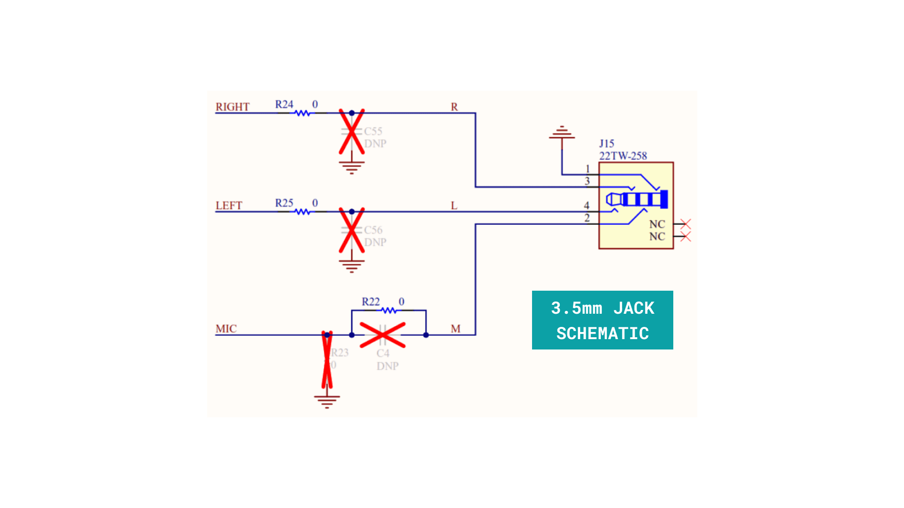
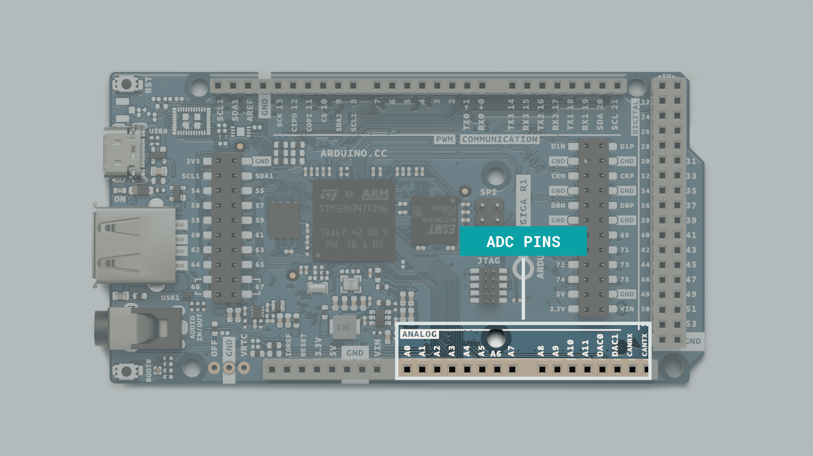
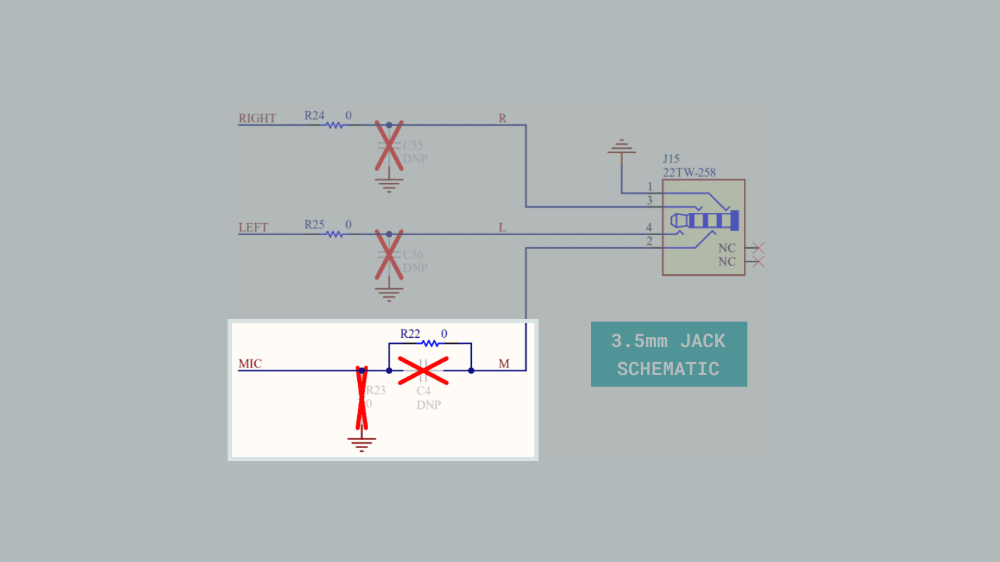
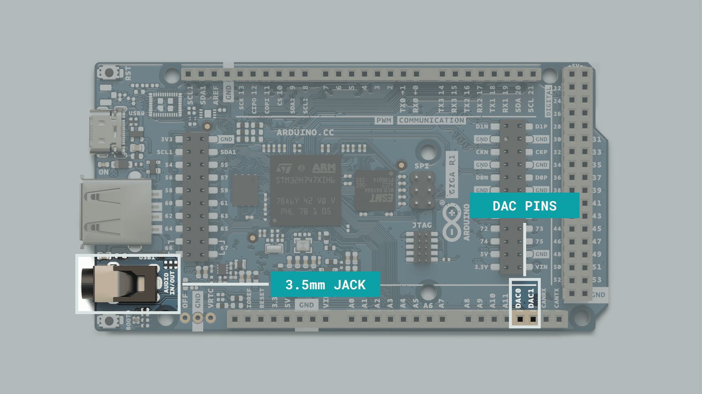
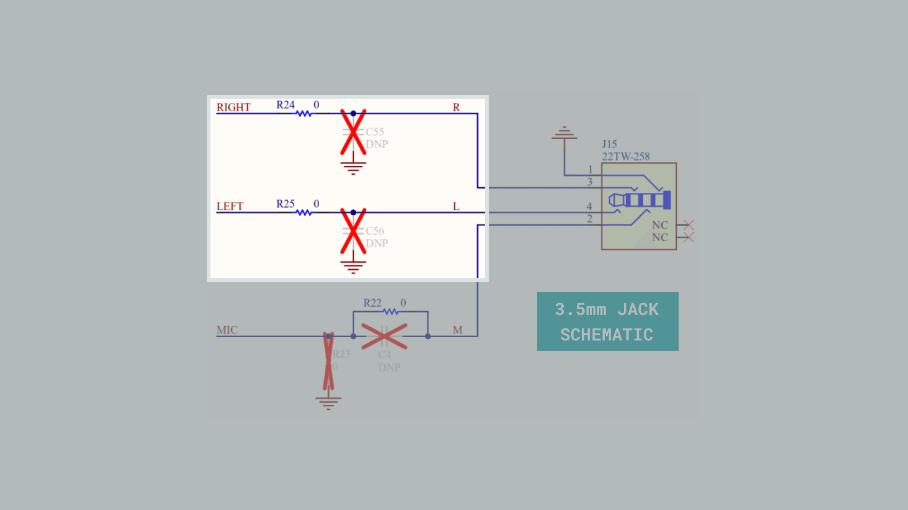

In the GIGA R1, you can find the powerful STM32H747XI, a dual-core 32-bit Arm® Cortex® microcontroller from STMicroelectronics; this is the same microcontroller found in the [Portenta H7](/hardware/portenta-h7) board. 

In this guide, we will focus on the advanced ADC/DAC features, utilizing the [Arduino_AdvancedAnalog](https://github.com/arduino-libraries/Arduino_AdvancedAnalog) library. The examples found in this guide can be used to:
- Set up and read ADCs with specific parameters (resolution, sample rate, number of samples per channel, queue depth). 
- Set up and write to a DAC channel with specific parameters (resolution, frequency, number of samples per channel, queue depth). 
- Generate specific waveforms through input via serial commands (triangle, square, sine, sawtooth waves) as well as adjusting the frequency.
- Read and play audio files (`.wav`) from a USB stick (connected to USB-A) to a speaker, using the audio jack.

***Important note: the GIGA R1 does NOT have an amplifying circuit onboard. Connecting speakers that does not have an amplifier can damage the DAC and the board itself.***

## Hardware & Software Needed

- [GIGA R1 WiFi](/hardware/giga-r1-wifi).
- [Arduino IDE](https://www.arduino.cc/en/software)
- [Arduino_AdvancedAnalog](https://github.com/arduino-libraries/Arduino_AdvancedAnalog) library.

And for specific examples:

- USB Mass Storage Device (USB Stick).
- Auxiliary Cable.
- Speaker with a built-in amplifier.

## ADC/DAC Pins and Connectors

The GIGA gives you access to more pins than any other Arduino board accessible for makers. Many have unique features; we will focus on the pins that have audio features or can be used for developing audio applications. Audio pins and connectors in the GIGA can be divided into three important groups:

- Analog-to-Digital Converters (ADC) pins
- Digital-to-Analog Converters (DAC) pins
- Tip, Ring, Ring, Sleeve (TRRS) 3.5mm jack

The image below shows the position of the audio pins and connectors of the GIGA R1:


The table below explains the full functionality of the listed on it; notice that some pins have more than one functionality, such as `DAC0`, `DAC1`, `CANRX`, and `CANTX`:

|  Pin  |  Functionality |
|:-----:|:--------------:|
|   A0  |       ADC      |
|   A1  |       ADC      |
|   A2  |       ADC      |
|   A3  |       ADC      |
|   A4  |       ADC      |
|   A5  |       ADC      |
|   A6  |       ADC      |
|   A7  |       ADC      |
|   A8  |       ADC      |
|   A9  |       ADC      |
|  A10  |       ADC      |
|  A11  |       ADC      |
|  DAC0 |   ADC and DAC  |
|  DAC1 |   ADC and DAC  |
| CANRX | ADC and CAN RX |
| CANTX | ADC and CAN TX |

Pins `A7`, `DAC0`, and `DAC1` can also be accessed via the built-in TRRS 3.5mm jack. `DAC0` is connected to ring 1 (right channel), `DAC1` is connected to the tip (left channel), and `A7` is connected to ring 2 (microphone) of the jack, as shown in the schematic below:



## Analog-to-Digital Converter (ADC)

An analog-to-digital converter (ADC) is a device that converts an analog voltage, or signal, into digital data. The GIGA R1 microcontroller, the STM32H747XI, embeds three ADCs whose resolution can be configured to 8, 10, 12, 14, or 16 bits. Each ADC shares up to 20 external channels that can be accessed in the GIGA R1 board through pins `A0`, `A1`, `A2`, `A3`, `A4`, `A5`, `A6`, `A7`, `A8`, `A9`, `A10`, and `A11`; pins `DAC0`, `DAC1`, `CANRX`, and `CANTX` can also be used as ADCs.



`A7` is connected to ring 2 (microphone) of the jack, as shown in the schematic below:



The GIGA R1 ADCs can be used with the [built-in analog input/output functions of the Arduino programming language](https://www.arduino.cc/reference/de/language/functions/analog-io/analogread/), though they only provide the basic functionalities of the ADCs. To use all of the capabilities of the DACs from the GIGA R1, we can use the [Arduino_AdvancedAnalog](https://github.com/bcmi-labs/Arduino_AdvancedAnalog) library from Arduino. Let's check some interesting examples that show some capabilities of the GIGA R1 ADCs!

### Multi Channel ADC

The following example code show how to use two GIGA R1 ADCs simultaneously with the **Arduino_AdvancedAnalog** library from Arduino:

```arduino
// This example shows how to use 2 ADC simultaneously.
#include <Arduino_AdvancedAnalog.h>

AdvancedADC adc1(A0);
AdvancedADC adc2(A1);
uint64_t last_millis = 0;

void setup() {
    Serial.begin(9600);

    // Resolution, sample rate, number of samples per channel, queue depth.
    if (!adc1.begin(AN_RESOLUTION_16, 16000, 32, 64)) {
        Serial.println("Failed to start analog acquisition!");
        while (1);
    }

    if (!adc2.begin(AN_RESOLUTION_16, 8000, 32, 64)) {
        Serial.println("Failed to start analog acquisition!");
        while (1);
    }
}

void adc_print_buf(AdvancedADC &adc) {
    if (adc.available()) {
        SampleBuffer buf = adc.read();

        // Print first sample.
        Serial.println(buf[0]);

        // Release the buffer to return it to the pool.
        buf.release();
    }
}

void loop() {
    if (millis() - last_millis > 1) {
        adc_print_buf(adc1);
        adc_print_buf(adc2);
        last_millis = millis();
    }
}
```

### ADC Serial Plotter Example

The following example code shows how to use two GIGA R1 ADCs simultaneously with the **Arduino_AdvancedAnalog** library from Arduino and displays the readings via the Serial Plotter of the Arduino IDE:

```arduino
#include <Arduino_AdvancedAnalog.h>

AdvancedADC adc(A0, A1);
uint64_t last_millis = 0;

void setup() {
    Serial.begin(9600);

    // Resolution, sample rate, number of samples per channel, queue depth.
    if (!adc.begin(AN_RESOLUTION_16, 16000, 32, 128)) {
        Serial.println("Failed to start analog acquisition!");
        while (1);
    }
}

void loop() {
    if (adc.available()) {
        SampleBuffer buf = adc.read();
        // Process the buffer.
        if ((millis() - last_millis) > 20) {
          Serial.println(buf[0]);   // Sample from first channel
          Serial.println(buf[1]);   // Sample from second channel
          last_millis = millis();
        }
        // Release the buffer to return it to the pool.
        buf.release();
    }
}
```

## Digital-to-Analog Converters (DAC)

A digital-to-analog converter (DAC) is a device that has a function opposite to that of the analog-to-digital converter (ADC); a DAC converts digital data to an analog voltage. The GIGA R1 microcontroller, the STM32H747XI, features two 12-bit buffered DAC channels that can convert two digital signals into two analog voltage signals. Some of the features of the DACs found in the GIGA R1 are the following:

- 8-bit or 12-bit monotonic output
- Left or right data alignment in 12-bit mode
- Dual DAC channel independent or simultaneous conversions 
- DMA capability for each channel
- External triggers for conversion
- Input voltage reference or internal voltage reference
- Analog waveform generation

The GIGA R1 DACs are named `DAC0` and `DAC1`; they can be found on pins `A12` and `A13` correspondingly, as shown in the image below:



Besides pins `A12` and `A13`, `DAC0` and `DAC1` can also be accessed via the built-in TRRS 3.5mm jack. `DAC0` is connected to the right channel (tip), while `DAC1` is connected to the left channel (ring) of the input jack as shown in the schematic below:



### Waveform Generation with the GIGA R1 DACs

Waveform generation is an exciting application used in audio systems, for example, synthesizers, for audio signal generation.

The following example shows how to output an 8kHz square wave on `DAC0`:

```arduino
// This example outputs an 8KHz square wave on A12/DAC0.
#include <Arduino_AdvancedAnalog.h>

AdvancedDAC dac1(A12);

void setup() {
    Serial.begin(9600);

    while (!Serial) {

    }

    if (!dac1.begin(AN_RESOLUTION_12, 8000, 32, 64)) {
        Serial.println("Failed to start DAC1 !");
        while (1);
    }
}

void dac_output_sq(AdvancedDAC &dac_out) {
    if (dac_out.available()) {

        // Get a free buffer for writing.
        SampleBuffer buf = dac_out.dequeue();

        // Write data to buffer.
        for (int i=0; i<buf.size(); i++) {
            buf.data()[i] =  (i % 2 == 0) ? 0: 0xfff;
        }

        // Write the buffer to DAC.
        dac_out.write(buf);
    }
}

void loop() {
    dac_output_sq(dac1);
}
```

### DAC Multi Channel Square Waves

It is also possible to simultaneously output at both DAC channels, `DAC0` and `DAC1`. The following example generates an 8kHz square wave on `DAC0`, while a 16kHz square wave is generated on `DAC1`:

```arduino
// This example outputs an 8KHz square wave on A12/DAC0 and 16KHz square wave on ADC13/DAC1.
#include <Arduino_AdvancedAnalog.h>

AdvancedDAC dac1(A12);
AdvancedDAC dac2(A13);

void setup() {
    Serial.begin(9600);

    while (!Serial) {

    }

    if (!dac1.begin(AN_RESOLUTION_12, 8000, 32, 64)) {
        Serial.println("Failed to start DAC1 !");
        while (1);
    }

    if (!dac2.begin(AN_RESOLUTION_12, 16000, 32, 64)) {
        Serial.println("Failed to start DAC2 !");
        while (1);
    }
}

void dac_output_sq(AdvancedDAC &dac_out) {
    if (dac_out.available()) {
      
        // Get a free buffer for writing.
        SampleBuffer buf = dac_out.dequeue();
        
        // Write data to buffer.
        for (int i=0; i<buf.size(); i++) {
          buf.data()[i] =  (i % 2 == 0) ? 0: 0xfff;
        }
        
        // Write the buffer to DAC.
        dac_out.write(buf);
    }
}

void loop() {
  dac_output_sq(dac1);
  dac_output_sq(dac2);
}
```

### DAC Sine Wave

A 32kHz sine wave output on `DAC0` can be generated using the following example:

```arduino
// This example outputs a 32KHz sine wave on A12/DAC1.
#include <Arduino_AdvancedAnalog.h>

AdvancedDAC dac1(A12);

uint16_t lut[] = {
    0x0800,0x08c8,0x098f,0x0a52,0x0b0f,0x0bc5,0x0c71,0x0d12,0x0da7,0x0e2e,0x0ea6,0x0f0d,0x0f63,0x0fa7,0x0fd8,0x0ff5,
    0x0fff,0x0ff5,0x0fd8,0x0fa7,0x0f63,0x0f0d,0x0ea6,0x0e2e,0x0da7,0x0d12,0x0c71,0x0bc5,0x0b0f,0x0a52,0x098f,0x08c8,
    0x0800,0x0737,0x0670,0x05ad,0x04f0,0x043a,0x038e,0x02ed,0x0258,0x01d1,0x0159,0x00f2,0x009c,0x0058,0x0027,0x000a,
    0x0000,0x000a,0x0027,0x0058,0x009c,0x00f2,0x0159,0x01d1,0x0258,0x02ed,0x038e,0x043a,0x04f0,0x05ad,0x0670,0x0737
};

static size_t lut_size = sizeof(lut) / sizeof(lut[0]);

void setup() {
    Serial.begin(9600);
    if (!dac1.begin(AN_RESOLUTION_12, 32000 * lut_size, 64, 128)) {
        Serial.println("Failed to start DAC1 !");
        while (1);
    }
}

void loop() {
    static size_t lut_offs = 0;

    if (dac1.available()) {
        // Get a free buffer for writing.
        SampleBuffer buf = dac1.dequeue();

        // Write data to buffer.
        for (size_t i=0; i<buf.size(); i++, lut_offs++) {
            buf[i] =  lut[lut_offs % lut_size];
        }

        // Write the buffer to DAC.
        dac1.write(buf);
    }
}
```

### Waveform Generation Based on Input

The following example allows you to switch between several waveforms via a serial interface. Uploading the example will allow you to change it based on the character input.

- **`t`** : generatestriangle wave
- **`q`** : square wave
- **`s`** : sine wave
- **`r`** : sawtooth wave
- **`+`** : increase frequency
- **`-`** : decrease frequency

```arduino
// This example generates different waveforms based on user input on A12/DAC1.

#include <Arduino_AdvancedAnalog.h>

#define N_SAMPLES           (256)
#define DEFAULT_FREQUENCY   (16000)

AdvancedDAC dac1(A12);
uint8_t SAMPLES_BUFFER[N_SAMPLES];
size_t dac_frequency = DEFAULT_FREQUENCY;

void generate_waveform(int cmd) 
{   
    switch (cmd) {
        case 't':
            // Triangle wave
            Serial.print("Waveform: Triangle ");
            for (int i=0; i<N_SAMPLES; i++){
                SAMPLES_BUFFER[i] = abs((i % 255) - 127);
            }
            break;

        case 'q':
            // Square wave
            Serial.print("Waveform: Square ");
            for (int i=0; i<N_SAMPLES; i++){
                SAMPLES_BUFFER[i] = (i % 255) < 127 ? 127 : 0;
            }
            break;

        case 's':
            // Sine wave
            Serial.print("Waveform: Sine ");
            for (int i=0; i<N_SAMPLES; i++){
                SAMPLES_BUFFER[i] = sin(2 * 3.14 * (i / (float) N_SAMPLES)) * 127 + 127;
            }
            break;

        case 'r':
            // Sawtooth
            Serial.print("Waveform: Sawtooth");
            for (int i=0; i<N_SAMPLES; i++){
                SAMPLES_BUFFER[i] = i;
            }
            break;

        case '+':
        case '-':
            Serial.print("Current frequency: ");
            
            if (cmd == '+' && dac_frequency < 64000) {
              dac_frequency *= 2;
            } else if (cmd == '-' && dac_frequency > 1000) {
              dac_frequency /= 2;
            } else {
              break;
            }
            
            dac1.stop();
            delay(500);
            if (!dac1.begin(AN_RESOLUTION_8, dac_frequency * N_SAMPLES, N_SAMPLES, 32)) {
              Serial.println("Failed to start DAC1 !");
            }
            delay(500);
            break;
            
        default:
            Serial.print("Unknown command ");
            Serial.println((char) cmd);
            return;
    }
    
    Serial.print(dac_frequency/1000);
    Serial.println("KHz");
}

void setup() {
    Serial.begin(115200);

    while (!Serial) {

    }

    
    Serial.println("Enter a command:");
    Serial.println("t: Triangle wave");
    Serial.println("q: Square wave");
    Serial.println("s: Sine wave");
    Serial.println("r: Sawtooth wave");
    Serial.println("+: Increase frequency");
    Serial.println("-: Decrease frequency");
    
    generate_waveform('s');
    
    // DAC initialization
    if (!dac1.begin(AN_RESOLUTION_8, DEFAULT_FREQUENCY * N_SAMPLES, N_SAMPLES, 32)) {
        Serial.println("Failed to start DAC1 !");
        while (1);
    }
}

void loop() {
    if (Serial.available() > 0) {
        int cmd = Serial.read();
        if (cmd != '\n') {
          generate_waveform(cmd);
        }
    } 
    
    if (dac1.available()) {
        // Get a free buffer for writing.
        SampleBuffer buf = dac1.dequeue();

        // Write data to buffer.
        for (size_t i=0; i<buf.size(); i++) {
            buf[i] =  SAMPLES_BUFFER[i];
        }

        dac1.write(buf);
    }
}
```

## Audio Playback

The GIGA R1 12-bit DAC channels can also be used to read `.wav` files from a USB stick and stream them directly to a speaker. 

For this example, you will need:
- A speaker, that has a built in amplifier.
- A USB mass storage device (USB stick).\*
- [USBHostMbed5](https://github.com/facchinm/USBHostMbed5) library installed.

***\*USB mass storage devices connected needs to be formatted with the FAT32 as a file system, using the MBR partitioning scheme. Read more in the [USB Mass Storage](/tutorials/giga-r1-wifi/giga-usb/#usb-mass-storage) section.***

### USB Stick Configuration

The **Arduino_AdvancedAnalog** library contains the necessary functions that enable us to use the advanced capabilities of the GIGA R1 DACs. 

To read `.wav` files from the USB stick we are using the **USBHostMbed5** library. It is important that the USB stick is formatted properly, and that we define its name in the sketch. In this case, we name it `USB_DRIVE`, and is defined like this: 

```arduino 
mbed::FATFileSystem usb("USB_DRIVE");
```

Another line of code defines the audio file to be played. Here we need to write the name of the `.wav` file we want to play, but also the directory (which is `/USB_DRIVE` in this case).

```arduino
file = fopen("/USB_DRIVE/AUDIO_SAMPLE.wav", "rb");
```

### Play Single Audio File

The following example plays a single `.wav` file named `AUDIO_SAMPLE.wav` from a USB mass storage device named `USB_DRIVE`.

The file is read, processed and writes the values to a buffer, which is then outputted via the DAC0 channel. The DAC0 channel is connected to the 3.5mm audio jack, and when connecting it to a speaker, it will play the file **once**.

Note that to start the sketch, you need to open Serial Monitor due to the `while(!Serial)` blocker in the `setup()`. Information on the operation is printed in the monitor, as well as errors if the operation fails.

```arduino
/*
 * GIGA R1 - Audio Playback
 * Simple wav format audio playback via 12-Bit DAC output by reading from a USB drive.
 * In order for this sketch to work you need to rename 'USB_DRIVE' to the name of your USB stick drive.
 * Furthermore you need to store the provided audio file AUDIO_SAMPLE.wav on it.
*/

#include <Arduino_AdvancedAnalog.h>
#include <DigitalOut.h>
#include <USBHostMbed5.h>
#include <FATFileSystem.h>

AdvancedDAC dac1(A12);

USBHostMSD msd;
mbed::FATFileSystem usb("USB_DRIVE");

FILE * file = nullptr;
int sample_size = 0;
int samples_count = 0;


void setup()
{
  Serial.begin(115200);
  while (!Serial);

  /* Enable power for HOST USB connector. */
  pinMode(PA_15, OUTPUT);
  digitalWrite(PA_15, HIGH);

  Serial.println("Please connect a USB stick to the GIGA's USB port ...");
  while (!msd.connect()) delay(100);

  Serial.println("Mounting USB device ...");
  int const rc_mount = usb.mount(&msd);
  if (rc_mount)
  {
    Serial.print("Error mounting USB device ");
    Serial.println(rc_mount);
    return;
  }

  Serial.println("Opening audio file ...");

  /* 16-bit PCM Mono 16kHz realigned noise reduction */
  file = fopen("/USB_DRIVE/AUDIO_SAMPLE.wav", "rb");
  if (file == nullptr)
  {
    Serial.print("Error opening audio file: ");
    Serial.println(strerror(errno));
    return;
  }

  Serial.println("Reading audio header ...");
  struct wav_header_t
  {
    char chunkID[4]; //"RIFF" = 0x46464952
    unsigned long chunkSize; //28 [+ sizeof(wExtraFormatBytes) + wExtraFormatBytes] + sum(sizeof(chunk.id) + sizeof(chunk.size) + chunk.size)
    char format[4]; //"WAVE" = 0x45564157
    char subchunk1ID[4]; //"fmt " = 0x20746D66
    unsigned long subchunk1Size; //16 [+ sizeof(wExtraFormatBytes) + wExtraFormatBytes]
    unsigned short audioFormat;
    unsigned short numChannels;
    unsigned long sampleRate;
    unsigned long byteRate;
    unsigned short blockAlign;
    unsigned short bitsPerSample;
  };

  wav_header_t header;
  fread(&header, sizeof(header), 1, file);

  Serial.println("WAV File Header read:");
  char msg[64] = {0};
  snprintf(msg, sizeof(msg), "File Type: %s", header.chunkID);
  Serial.println(msg);
  snprintf(msg, sizeof(msg), "File Size: %ld", header.chunkSize);
  Serial.println(msg);
  snprintf(msg, sizeof(msg), "WAV Marker: %s", header.format);
  Serial.println(msg);
  snprintf(msg, sizeof(msg), "Format Name: %s", header.subchunk1ID);
  Serial.println(msg);
  snprintf(msg, sizeof(msg), "Format Length: %ld", header.subchunk1Size);
  Serial.println(msg);
  snprintf(msg, sizeof(msg), "Format Type: %hd", header.audioFormat);
  Serial.println(msg);
  snprintf(msg, sizeof(msg), "Number of Channels: %hd", header.numChannels);
  Serial.println(msg);
  snprintf(msg, sizeof(msg), "Sample Rate: %ld", header.sampleRate);
  Serial.println(msg);
  snprintf(msg, sizeof(msg), "Sample Rate * Bits/Sample * Channels / 8: %ld", header.byteRate);
  Serial.println(msg);
  snprintf(msg, sizeof(msg), "Bits per Sample * Channels / 8: %hd", header.blockAlign);
  Serial.println(msg);
  snprintf(msg, sizeof(msg), "Bits per Sample: %hd", header.bitsPerSample);
  Serial.println(msg);

  /* Find the data section of the WAV file. */
  struct chunk_t
  {
    char ID[4];
    unsigned long size;
  };

  chunk_t chunk;
  snprintf(msg, sizeof(msg), "id\t" "size");
  Serial.println(msg);
  /* Find data chunk. */
  while (true)
  {
    fread(&chunk, sizeof(chunk), 1, file);
    snprintf(msg, sizeof(msg), "%c%c%c%c\t" "%li", chunk.ID[0], chunk.ID[1], chunk.ID[2], chunk.ID[3], chunk.size);
    Serial.println(msg);
    if (*(unsigned int *) &chunk.ID == 0x61746164)
      break;
    /* Skip chunk data bytes. */
    fseek(file, chunk.size, SEEK_CUR);
  }

  /* Determine number of samples. */
  sample_size = header.bitsPerSample / 8;
  samples_count = chunk.size * 8 / header.bitsPerSample;
  snprintf(msg, sizeof(msg), "Sample size = %i", sample_size); Serial.println(msg);
  snprintf(msg, sizeof(msg), "Samples count = %i", samples_count); Serial.println(msg);

  /* Configure the advanced DAC. */
  if (!dac1.begin(AN_RESOLUTION_12, header.sampleRate, 256, 16))
  {
    Serial.println("Failed to start DAC1 !");
    return;
  }
}

void loop()
{
  if (dac1.available() && !feof(file))
  {
    /* Read data from file. */
    uint16_t sample_data[256] = {0};
    fread(sample_data, sample_size, 256, file);

    /* Get a free buffer for writing. */
    SampleBuffer buf = dac1.dequeue();

    /* Write data to buffer. */
    for (size_t i = 0; i < buf.size(); i++)
    {
      /* Scale down to 12 bit. */
      uint16_t const dac_val = ((static_cast<unsigned int>(sample_data[i])+32768)>>4) & 0x0fff;
      buf[i] = dac_val;
    }

    /* Write the buffer to DAC. */
    dac1.write(buf);
  }
}
```

### Loop Multiple Audio Files

This example is similar to the **Play Single Audio File** example, but with some key changes:

- This example uses multiple audio files.
- The file read is moved to a separate function, `configFile()`, as it will be continuously called from the sketch.
- Instead of playing a file once, it keeps looping it. 
- The **BOOT0** (`PC_13`) button (right next to the audio jack) is used as a regular pushbutton to loop through the audio files.
- Pressing the button changes the file played.

The files used are called `DRUM.wav`, `WARP.wav`, `BASS.wav` and `SHAKE.wav`. They are very short (around 1 second). These needs to be present on the USB stick used.

You can download them from [this link](/resources/misc/giga_audio_examples.zip).

```arduino
/*
 * GIGA R1 - Audio Playback
 * Simple wav format audio playback via 12-Bit DAC output by reading from a USB drive.
 * In order for this sketch to work you need to rename 'USB_DRIVE' to the name of your USB stick drive.
 * Furthermore you need to store the provided audio file AUDIO_SAMPLE.wav on it.
*/

#include <Arduino_AdvancedAnalog.h>
#include <DigitalOut.h>
#include <USBHostMbed5.h>
#include <FATFileSystem.h>

AdvancedDAC dac1(A12);

USBHostMSD msd;
mbed::FATFileSystem usb("usb");

FILE *file = nullptr;
int sample_size = 0;
int samples_count = 0;

int swapFile;

void setup() {
  Serial.begin(115200);
  while (!Serial)
    ;

  /* Enable power for HOST USB connector. */

  pinMode(PA_15, OUTPUT);
  digitalWrite(PA_15, HIGH);

  Serial.println("Please connect a USB stick to the GIGA's USB port ...");
  while (!msd.connect()) delay(100);

  Serial.println("Mounting USB device ...");
  int const rc_mount = usb.mount(&msd);
  if (rc_mount) {
    Serial.print("Error mounting USB device ");
    Serial.println(rc_mount);
    return;
  }
  configFile();
}

void loop() {
  if (dac1.available() && !feof(file)) {
    /* Read data from file. */
    uint16_t sample_data[256] = { 0 };
    fread(sample_data, sample_size, 256, file);

    /* Get a free buffer for writing. */
    SampleBuffer buf = dac1.dequeue();

    /* Write data to buffer. */
    for (size_t i = 0; i < buf.size(); i++) {
      /* Scale down to 12 bit. */
      uint16_t const dac_val = ((static_cast<unsigned int>(sample_data[i]) + 32768) >> 4) & 0x0fff;
      buf[i] = dac_val;
    }

    /* Write the buffer to DAC. */
    dac1.write(buf);

    if(feof(file)){
      fclose(file);
      configFile();
    }
  }

  int buttonState = digitalRead(PC_13);

  if (buttonState == 1) {
    swapFile = swapFile + 1;
    if (swapFile == 4) {
      swapFile = 0;
    }
    delay(500);
    configFile();
  }
}


void configFile() {
  Serial.println("Opening audio file ...");

  /* 16-bit PCM Mono 16kHz realigned noise reduction */
  if (swapFile == 0) {
    file = fopen("/usb/DRUM.wav", "rb");
  } else if (swapFile == 1) {
    file = fopen("/usb/WARP.wav", "rb");
  } else if (swapFile == 2) {
    file = fopen("/usb/BASS.wav", "rb");
  } else if (swapFile == 3) {
    file = fopen("/usb/SHAKE.wav", "rb");
  }

  if (file == nullptr) {
    Serial.print("Error opening audio file: ");
    Serial.println(strerror(errno));
    return;
  }

  Serial.println("Reading audio header ...");
  struct wav_header_t {
    char chunkID[4];              //"RIFF" = 0x46464952
    unsigned long chunkSize;      //28 [+ sizeof(wExtraFormatBytes) + wExtraFormatBytes] + sum(sizeof(chunk.id) + sizeof(chunk.size) + chunk.size)
    char format[4];               //"WAVE" = 0x45564157
    char subchunk1ID[4];          //"fmt " = 0x20746D66
    unsigned long subchunk1Size;  //16 [+ sizeof(wExtraFormatBytes) + wExtraFormatBytes]
    unsigned short audioFormat;
    unsigned short numChannels;
    unsigned long sampleRate;
    unsigned long byteRate;
    unsigned short blockAlign;
    unsigned short bitsPerSample;
  };

  wav_header_t header;
  fread(&header, sizeof(header), 1, file);

  Serial.println("WAV File Header read:");
  char msg[64] = { 0 };
  snprintf(msg, sizeof(msg), "File Type: %s", header.chunkID);
  Serial.println(msg);
  snprintf(msg, sizeof(msg), "File Size: %ld", header.chunkSize);
  Serial.println(msg);
  snprintf(msg, sizeof(msg), "WAV Marker: %s", header.format);
  Serial.println(msg);
  snprintf(msg, sizeof(msg), "Format Name: %s", header.subchunk1ID);
  Serial.println(msg);
  snprintf(msg, sizeof(msg), "Format Length: %ld", header.subchunk1Size);
  Serial.println(msg);
  snprintf(msg, sizeof(msg), "Format Type: %hd", header.audioFormat);
  Serial.println(msg);
  snprintf(msg, sizeof(msg), "Number of Channels: %hd", header.numChannels);
  Serial.println(msg);
  snprintf(msg, sizeof(msg), "Sample Rate: %ld", header.sampleRate);
  Serial.println(msg);
  snprintf(msg, sizeof(msg), "Sample Rate * Bits/Sample * Channels / 8: %ld", header.byteRate);
  Serial.println(msg);
  snprintf(msg, sizeof(msg), "Bits per Sample * Channels / 8: %hd", header.blockAlign);
  Serial.println(msg);
  snprintf(msg, sizeof(msg), "Bits per Sample: %hd", header.bitsPerSample);
  Serial.println(msg);

  /* Find the data section of the WAV file. */
  struct chunk_t {
    char ID[4];
    unsigned long size;
  };

  chunk_t chunk;
  snprintf(msg, sizeof(msg), "id\t"
                             "size");
  Serial.println(msg);
  /* Find data chunk. */
  while (true) {
    fread(&chunk, sizeof(chunk), 1, file);
    snprintf(msg, sizeof(msg), "%c%c%c%c\t"
                               "%li",
             chunk.ID[0], chunk.ID[1], chunk.ID[2], chunk.ID[3], chunk.size);
    Serial.println(msg);
    if (*(unsigned int *)&chunk.ID == 0x61746164)
      break;
    /* Skip chunk data bytes. */
    fseek(file, chunk.size, SEEK_CUR);
  }

  /* Determine number of samples. */
  sample_size = header.bitsPerSample / 8;
  samples_count = chunk.size * 8 / header.bitsPerSample;
  snprintf(msg, sizeof(msg), "Sample size = %i", sample_size);
  Serial.println(msg);
  snprintf(msg, sizeof(msg), "Samples count = %i", samples_count);
  Serial.println(msg);

  /* Configure the advanced DAC. */
  if (!dac1.begin(AN_RESOLUTION_12, header.sampleRate, 256, 16)) {
    Serial.println("Failed to start DAC1 !");
    return;
  }
}
```

## Pulse Density Modulation Support

Pulse Density Support (PDM) is a form of modulation used to represent analog information into digital information; PDM uses a high-frequency stream of 1-bit digital samples. In PDM, a large cluster of ones represents a positive amplitude, while a large cluster of zeros represents a negative amplitude.

The GIGA R1 PDM support can be used with the [built-in PDM library](https://docs.arduino.cc/learn/built-in-libraries/pdm). Let's check an interesting example that shows of how to read a PDM microphone wwith the GIGA R1:

```arduino
#include <PDM.h>

// Default number of output channels
static const char channels = 1;

// Default PCM output frequency
static const int frequency = 16000;

// Buffer to read samples into, each sample is 16-bits
short sampleBuffer[128];

// Number of audio samples read
volatile int samplesRead;

void setup() {
  Serial.begin(9600);
  while (!Serial);

  // Configure the callback function and gain
  PDM.onReceive(onPDMdata);
  PDM.setGain(30);

  // Initialize PDM microphone in mono mode, and a 16 kHz sample rate:
  if (!PDM.begin(channels, frequency)) {
    Serial.println("Failed to start PDM!");
    while (1);
  }
}

void loop() {
  // Wait for samples to be read
  if (samplesRead) {

    // Print samples to the Serial Monitor
    for (int i = 0; i < samplesRead; i++) {
      if(channels == 2) {
        Serial.print("L:");
        Serial.print(sampleBuffer[i]);
        Serial.print(" R:");
        i++;
      }
      Serial.println(sampleBuffer[i]);
    }

    samplesRead = 0;
  }
}

// Callback function
void onPDMdata() {
  int bytesAvailable = PDM.available();
  PDM.read(sampleBuffer, bytesAvailable);
  samplesRead = bytesAvailable / 2;
}
```