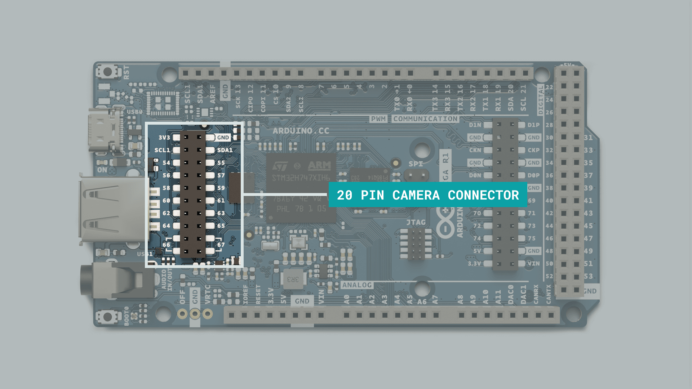
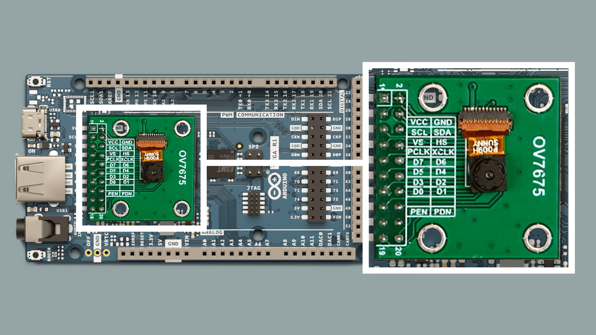
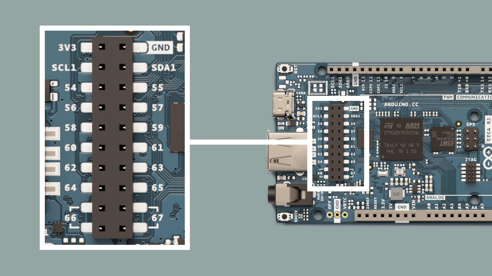
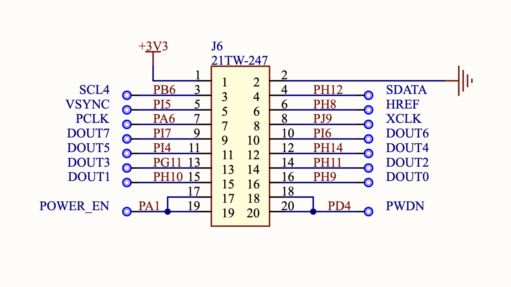

The GIGA R1 has a dedicated camera connector that allows certain camera modules to mount directly on the board. This makes it possible to add machine vision to your GIGA R1 board without much effort at all.

In this guide, we will explore the following:

- Where the camera connector is located.
- What cameras are compatible.
- What library to use.
- How to setup a camera stream to a processing application.

## Hardware & Software Needed

To follow and use the examples provided in this guide, you will need an [Arduino GIGA R1 WiFi](/hardware/giga-r1-wifi)

You will also need the following software:
- [Arduino IDE](https://www.arduino.cc/en/software) (any version).
- [Processing](https://processing.org/download) (for displaying camera feed).

## Supported Cameras

The GIGA R1 currently supports the following cameras, via the [Camera](https://github.com/arduino/ArduinoCore-mbed/tree/master/libraries/Camera) library that is bundled with the [Arduino Mbed Core](https://github.com/arduino/ArduinoCore-mbed):

- **OV7670** and **OV7675**
- **GC2145**
- **Himax HM01B0**
- **Himax HM0360**

## Camera Connector



The 20 pin camera connector onboard the GIGA R1 is designed to be directly compatible with some breakout boards from ArduCam. 

This allows you to simply connect the camera module directly to the board, without making any additional circuit.



Some of the 20 pin connector breakout boards from ArduCam can be found [here](https://www.arducam.com/product-category/stm32-camera-modules-dcmi-and-spi/).

The complete pin map can be found below:

| Left | Right |
| ---- | ----- |
| 3V3  | GND   |
| SCL1 | SDA1  |
| 54   | 55    |
| 56   | 57    |
| 58   | 59    |
| 60   | 61    |
| 62   | 63    |
| 64   | 65    |
| 66   | 67    |
| 66   | 67    |



You can also view the schematic for this connector in more detail just below. This is useful to understand exactly which pins on the STM32H747XI microcontroller is used.



## Raw Bytes Over Serial (Processing)


This example allows you to stream the sensor data from your camera to a Processing application, using serial over USB. This will allow you to see the image directly in your computer.

***This example requires a version of [Processing](https://processing.org/download) on your machine.***

### Step 1: Arduino

Upload the following sketch to your board.

This sketch is also available in the Arduino IDE via **Examples > Camera > CameraCaptureRawBytes**.

```arduino
#include "camera.h"

#ifdef ARDUINO_NICLA_VISION
  #include "gc2145.h"
  GC2145 galaxyCore;
  Camera cam(galaxyCore);
  #define IMAGE_MODE CAMERA_RGB565
#elif defined(ARDUINO_PORTENTA_H7_M7)
  #include "hm0360.h"
  HM0360 himax;
  Camera cam(himax);
  #define IMAGE_MODE CAMERA_GRAYSCALE
#elif defined(ARDUINO_GIGA)
  #include "ov7670.h"
  OV7670 ov7670;
  Camera cam(ov7670);
  #define IMAGE_MODE CAMERA_RGB565
#else
#error "This board is unsupported."
#endif

/*
Other buffer instantiation options:
  FrameBuffer fb(0x30000000);
  FrameBuffer fb(320,240,2);
*/
FrameBuffer fb;

unsigned long lastUpdate = 0;


void blinkLED(uint32_t count = 0xFFFFFFFF)
{
  pinMode(LED_BUILTIN, OUTPUT);
  while (count--) {
    digitalWrite(LED_BUILTIN, LOW);  // turn the LED on (HIGH is the voltage level)
    delay(50);                       // wait for a second
    digitalWrite(LED_BUILTIN, HIGH); // turn the LED off by making the voltage LOW
    delay(50);                       // wait for a second
  }
}

void setup() {
  // Init the cam QVGA, 30FPS
  if (!cam.begin(CAMERA_R320x240, IMAGE_MODE, 30)) {
    blinkLED();
  }

  blinkLED(5);
}

void loop() {
  if(!Serial) {    
    Serial.begin(921600);
    while(!Serial);
  }

  // Time out after 2 seconds and send new data
  bool timeoutDetected = millis() - lastUpdate > 2000;
  
  // Wait for sync byte.
  if(!timeoutDetected && Serial.read() != 1) return;  

  lastUpdate = millis();
  
  // Grab frame and write to serial
  if (cam.grabFrame(fb, 3000) == 0) {
    Serial.write(fb.getBuffer(), cam.frameSize());
  } else {
    blinkLED(20);
  }
}

```

### Step 2: Processing

The following Processing sketch will launch a Java app that allows you to view the camera feed. As data is streamed via serial, make sure you close the Serial Monitor during this process, else it will not work.

***Important! Make sure to replace the following line in the code below: `/dev/cu.usbmodem14301`, with the name of your port.***

Click on the **"PLAY"** button to initialize the app.

```cpp
/*
  Use with the Examples -> CameraCaptureRawBytes Arduino sketch.
  This example code is in the public domain.
*/

import processing.serial.*;
import java.nio.ByteBuffer;
import java.nio.ByteOrder;

Serial myPort;

// must match resolution used in the Arduino sketch
final int cameraWidth = 320;
final int cameraHeight = 240;

// Must match the image mode in the Arduino sketch
final boolean useGrayScale = true;

// Must match the baud rate in the Arduino sketch
final int baudRate = 921600;

final int cameraBytesPerPixel = useGrayScale ? 1 : 2;
final int cameraPixelCount = cameraWidth * cameraHeight;
final int bytesPerFrame = cameraPixelCount * cameraBytesPerPixel;
final int timeout =  int((bytesPerFrame / float(baudRate / 10)) * 1000 * 2); // Twice the transfer rate

PImage myImage;
byte[] frameBuffer = new byte[bytesPerFrame];
int lastUpdate = 0;
boolean shouldRedraw = false;

void setup() {
  size(640, 480);  

  // If you have only ONE serial port active you may use this:
  //myPort = new Serial(this, Serial.list()[0], baudRate);          // if you have only ONE serial port active

  // If you know the serial port name
  //myPort = new Serial(this, "COM5", baudRate);                    // Windows
  //myPort = new Serial(this, "/dev/ttyACM0", baudRate);            // Linux
  myPort = new Serial(this, "/dev/cu.usbmodem14301", baudRate);     // Mac

  // wait for a full frame of bytes
  myPort.buffer(bytesPerFrame);  

  myImage = createImage(cameraWidth, cameraHeight, ALPHA);
  
  // Let the Arduino sketch know we're ready to receive data
  myPort.write(1);
}

void draw() {
  // Time out after a few seconds and ask for new data
  if(millis() - lastUpdate > timeout) {
    println("Connection timed out.");    
    myPort.clear();
    myPort.write(1);
  }
  
  if(shouldRedraw){    
    PImage img = myImage.copy();
    img.resize(640, 480);
    image(img, 0, 0);
    shouldRedraw = false;
  }
}

int[] convertRGB565ToRGB888(short pixelValue){  
  //RGB565
  int r = (pixelValue >> (6+5)) & 0x01F;
  int g = (pixelValue >> 5) & 0x03F;
  int b = (pixelValue) & 0x01F;
  //RGB888 - amplify
  r <<= 3;
  g <<= 2;
  b <<= 3; 
  return new int[]{r,g,b};
}

void serialEvent(Serial myPort) {  
  lastUpdate = millis();
  
  // read the received bytes
  myPort.readBytes(frameBuffer);

  // Access raw bytes via byte buffer  
  ByteBuffer bb = ByteBuffer.wrap(frameBuffer);
  
  // Ensure proper endianness of the data for > 8 bit values.
  // The 1 byte bb.get() function will always return the bytes in the correct order.
  bb.order(ByteOrder.BIG_ENDIAN);

  int i = 0;

  while (bb.hasRemaining()) {
    if(useGrayScale){
      // read 8-bit pixel data
      byte pixelValue = bb.get();

      // set pixel color
      myImage.pixels[i++] = color(Byte.toUnsignedInt(pixelValue));
    } else {
      // read 16-bit pixel data
      int[] rgbValues = convertRGB565ToRGB888(bb.getShort());

      // set pixel RGB color
      myImage.pixels[i++] = color(rgbValues[0], rgbValues[1], rgbValues[2]);
    }       
  }
  
  myImage.updatePixels();
  
  // Ensures that the new image data is drawn in the next draw loop
  shouldRedraw = true;
  
  // Let the Arduino sketch know we received all pixels
  // and are ready for the next frame
  myPort.write(1);
}
```

If all goes well, you should now be able to see the camera feed.

## Summary

In this article, we learned a bit more about the camera connector on board the GIGA R1 board, how it is connected to the STM32H747XI microcontroller, and a simple example on how to connect an inexpensive OV7675 camera module to a Processing application.