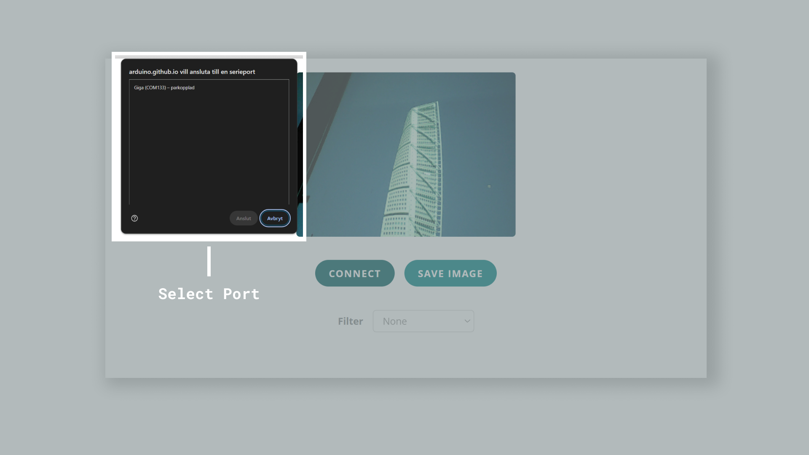
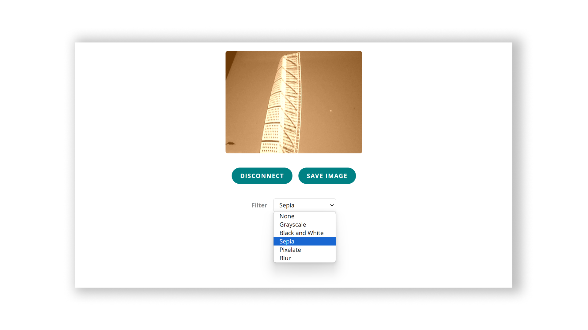

The GIGA R1 has a dedicated camera connector that allows certain camera modules to mount directly on the board. This makes it possible to add machine vision to your GIGA R1 board without much effort at all.

In this guide, we will explore the following:

- Where the camera connector is located.
- What cameras are compatible?
- What library to use?
- How to set up a camera stream to a browser using Web Serial.

## Hardware & Software Needed

To follow and use the examples provided in this guide, you will need an [Arduino GIGA R1 WiFi](/hardware/giga-r1-wifi)

You will also need the following software:

- [Arduino IDE](https://www.arduino.cc/en/software) (any version).
- [Web Serial Web Application](https://arduino.github.io/labs-pages/web-serial-camera/) (for displaying camera feed).

## Supported Cameras

The GIGA R1 currently supports the following cameras, via the [Camera](https://github.com/arduino/ArduinoCore-mbed/tree/master/libraries/Camera) library that is bundled with the [Arduino Mbed Core](https://github.com/arduino/ArduinoCore-mbed):

- **OV7670** and **OV7675**
- **GC2145**
- **Himax HM01B0**

## Camera Connector


The 20 pin camera connector onboard the GIGA R1 is designed to be directly compatible with some breakout boards from ArduCam.

This allows you to simply connect the camera module directly to the board, without making any additional circuit.


Some of the 20 pin connector breakout boards from ArduCam can be found [here](https://www.arducam.com/product-category/embedded-camera-module/camera-breakout-board/).

The complete pin map can be found below:

| Left | Right |
| ---- | ----- |
| 3V3  | GND   |
| SCL1 | SDA1  |
| 54   | 55    |
| 56   | 57    |
| 58   | 59    |
| 60   | 61    |
| 62   | 63    |
| 64   | 65    |
| 66   | 67    |
| 66   | 67    |


You can also view the schematic for this connector in more detail just below. This is useful to understand exactly which pins on the STM32H747XI microcontroller is used.


## Raw Bytes Over Serial

This example allows you to stream the sensor data from your camera to a web interface, using serial over USB. This will allow you to see the image directly in your browser.

### Step 1: Arduino

Upload the following sketch to your board.

This sketch is also available in the Arduino IDE via **Examples > Camera > CameraCaptureWebSerial**.

```arduino
/*
 * This example shows how to capture images from the camera and send them over Web Serial.
 * 
 * There is a companion web app that receives the images and displays them in a canvas.
 * It can be found in the "extras" folder of this library.
 * The on-board LED lights up while the image is being sent over serial.
 * 
 * Instructions:
 * 1. Make sure the correct camera is selected in the #include section below by uncommenting the correct line.
 * 2. Upload this sketch to your camera-equipped board.
 * 3. Open the web app in a browser (Chrome or Edge) by opening the index.html file 
 * in the "WebSerialCamera" folder which is located in the "extras" folder.
 * 
 * Initial author: Sebastian Romero @sebromero
 */

#include "camera.h"

#ifdef ARDUINO_NICLA_VISION
  #include "gc2145.h"
  GC2145 galaxyCore;
  Camera cam(galaxyCore);
  #define IMAGE_MODE CAMERA_RGB565
#elif defined(ARDUINO_PORTENTA_H7_M7)
  // uncomment the correct camera in use
  #include "hm0360.h"
  HM0360 himax;
  // #include "himax.h";
  // HM01B0 himax;
  Camera cam(himax);
  #define IMAGE_MODE CAMERA_GRAYSCALE
#elif defined(ARDUINO_GIGA)
  #include "ov767x.h"
  // uncomment the correct camera in use
  OV7670 ov767x;
  // OV7675 ov767x;
  Camera cam(ov767x);
  #define IMAGE_MODE CAMERA_RGB565
#else
#error "This board is unsupported."
#endif

/*
Other buffer instantiation options:
  FrameBuffer fb(0x30000000);
  FrameBuffer fb(320,240,2);

If resolution higher than 320x240 is required, please use external RAM via
  #include "SDRAM.h"
  FrameBuffer fb(SDRAM_START_ADDRESS);
  ...
  // and adding in setup()
  SDRAM.begin();
*/
constexpr uint16_t CHUNK_SIZE = 512;  // Size of chunks in bytes
constexpr uint8_t RESOLUTION  = CAMERA_R320x240; // CAMERA_R160x120
constexpr uint8_t CONFIG_SEND_REQUEST = 2;
constexpr uint8_t IMAGE_SEND_REQUEST = 1;

uint8_t START_SEQUENCE[4] = { 0xfa, 0xce, 0xfe, 0xed };
uint8_t STOP_SEQUENCE[4] = { 0xda, 0xbb, 0xad, 0x00 };
FrameBuffer fb;

/**
 * Blinks the LED a specified number of times.
 * @param ledPin The pin number of the LED.
 * @param count The number of times to blink the LED. Default is 0xFFFFFFFF.
 */
void blinkLED(int ledPin, uint32_t count = 0xFFFFFFFF) { 
  while (count--) {
    digitalWrite(ledPin, LOW);  // turn the LED on (HIGH is the voltage level)
    delay(50);                       // wait for a second
    digitalWrite(ledPin, HIGH); // turn the LED off by making the voltage LOW
    delay(50);                       // wait for a second
  }
}

void setup() {
  pinMode(LED_BUILTIN, OUTPUT);  
  pinMode(LEDR, OUTPUT);
  digitalWrite(LED_BUILTIN, HIGH);
  digitalWrite(LEDR, HIGH);

  // Init the cam QVGA, 30FPS
  if (!cam.begin(RESOLUTION, IMAGE_MODE, 30)) {
    blinkLED(LEDR);
  }

  blinkLED(LED_BUILTIN, 5);
}

/**
 * Sends a chunk of data over a serial connection.
 * 
 * @param buffer The buffer containing the data to be sent.
 * @param bufferSize The size of the buffer.
 */
void sendChunk(uint8_t* buffer, size_t bufferSize){
  Serial.write(buffer, bufferSize);
  Serial.flush();
  delay(1); // Optional: Add a small delay to allow the receiver to process the chunk
}

/**
 * Sends a frame of camera image data over a serial connection.
 */
void sendFrame(){
  // Grab frame and write to serial
  if (cam.grabFrame(fb, 3000) == 0) {    
    byte* buffer = fb.getBuffer();
    size_t bufferSize = cam.frameSize();
    digitalWrite(LED_BUILTIN, LOW);
    
    sendChunk(START_SEQUENCE, sizeof(START_SEQUENCE));

    // Split buffer into chunks
    for(size_t i = 0; i < bufferSize; i += CHUNK_SIZE) {
      size_t chunkSize = min(bufferSize - i, CHUNK_SIZE);
      sendChunk(buffer + i, chunkSize);
    }    
    
    sendChunk(STOP_SEQUENCE, sizeof(STOP_SEQUENCE));
    
    digitalWrite(LED_BUILTIN, HIGH);
  } else {
    blinkLED(20);
  }
}

/**
 * Sends the camera configuration over a serial connection.
 * This is used to configure the web app to display the image correctly.
 */
void sendCameraConfig(){
  Serial.write(IMAGE_MODE);
  Serial.write(RESOLUTION);
  Serial.flush();
  delay(1);
}

void loop() {
  if(!Serial) {    
    Serial.begin(115200);
    while(!Serial);    
  }

  if(!Serial.available()) return;

  byte request = Serial.read();

  switch(request){
    case IMAGE_SEND_REQUEST:
      sendFrame();
      break; 
    case CONFIG_SEND_REQUEST:
      sendCameraConfig();
      break;
  }
  
}

```

### Step 2: Web Serial

Open the [Web Serial Interface](https://arduino.github.io/labs-pages/web-serial-camera/) which allows you to view the camera feed. Make sure to close the Serial Monitor in the Arduino IDE beforehand, otherwise it will not work as the serial port would be occupied.

Press on **Connect** and select the correct port.



You should now be able to see the camera feed.

There is also a variety of video filters that can be applied.



## Summary

In this article, we learned a bit more about the camera connector on board the GIGA R1 board, how it is connected to the STM32H747XI microcontroller, and a simple example of how to connect ArduCam camera modules through web serial.
