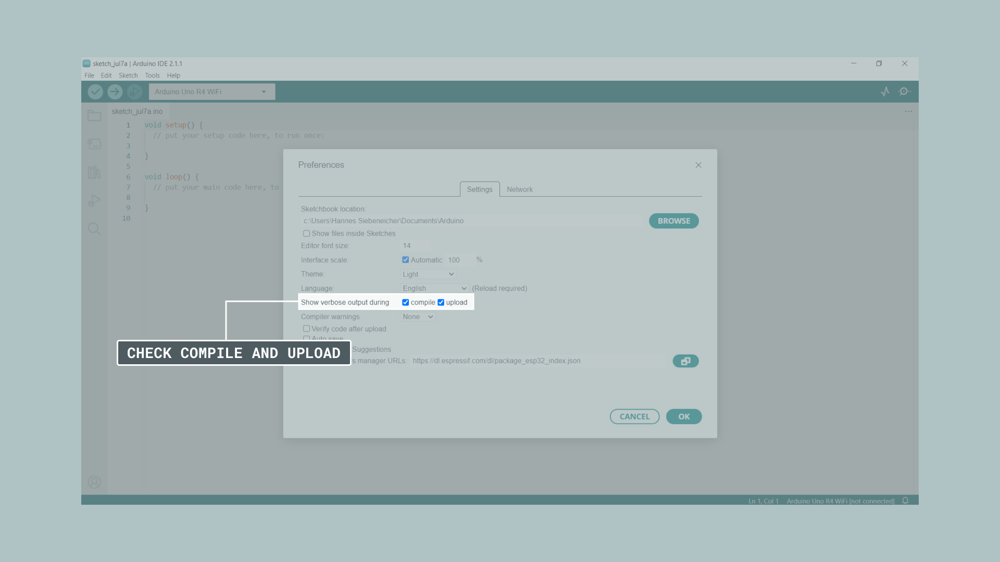
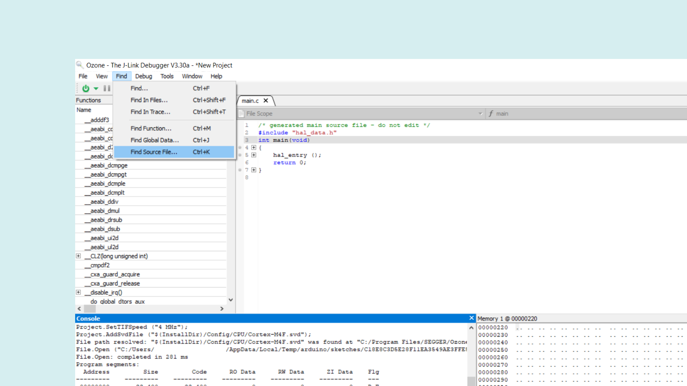
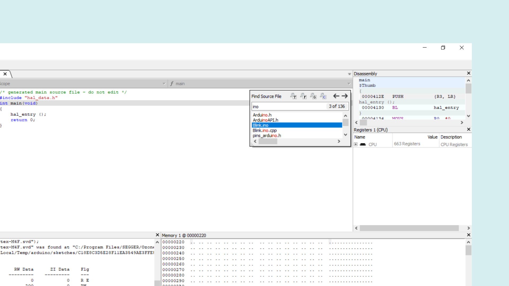

Debugging is the process of identifying and fixing errors in your code. It’s a vital skill for anyone writing code especially when dealing with microcontrollers like those on your Arduino. As with everything, debugging can be done at different levels, you can read up on the topic [here](/learn/microcontrollers/debugging). 

The GIGA R1 WiFi is a special candidate because it allows you to use two cores at the same time ([read more](/tutorials/giga-r1-wifi/giga-dual-core/)). For example, one core can continuously read sensor data while the other core performs some computation based on that data. By dedicating different cores to different tasks, you can keep operations separate, which leads to more efficient coding, especially in more complex projects. This also means you can debug each sketch independently making it easier to troubleshoot potential issues.

This article covers the basic steps for debugging both cores on the GIGA R1 WiFi using the SWD pins and a J-Link® debugger.

In addition to the necessary hardware we also need some software allowing us to set breakpoints in our code. A breakpoint is an intentional stopping or pausing place at a specific point in the code, allowing you to read values at that exact point. In this case, we will be using Ozone which is a software developed by Segger®. It’s a graphical debugger for embedded applications and we can use it to set breakpoints, read out memory addresses, and read the value of any variable at a specific point in time.

## Goals

The goals of this tutorial are:

- learn to debug both cores on the GIGA R1 WiFi.
- learn how to connect the GIGA R1 WiFi to the Segger J-Link debugger.
- learn how to use the Ozone debugger software to debug an Arduino sketch.

## Hardware & Software Needed

- [Arduino IDE](https://www.arduino.cc/en/main/software)
- [Arduino GIGA R1 WiFi](https://store.arduino.cc/products/giga-r1-wifi)
- [GIGA R1 WiFi Board Package](/tutorials/giga-r1-wifi/giga-getting-started/)
- [Segger J-Link](https://www.segger.com/products/debug-probes/j-link/)
- [Ozone](https://www.segger.com/products/development-tools/ozone-j-link-debugger/)

## Debugging

Debugging your Arduino project allows you to dive deep into your code and troubleshoot as well as analyze the code execution. J-Link is a popular debugging tool that provides a direct connection between your computer and the Arduino board. By connecting it you can gain full access to the microcontroller's internal registers, memory, and variables. This is especially helpful when working on more complex projects where understanding the code execution flow is crucial. With J-Link and Ozone, you can step through the code line by line, allowing you to analyze why your code might break at a specific point.

## Connection

Connecting the J-link to your GIGA R1 WiFi is super easy because there are special pins for debugging labeled as **JTAG** pins.


Your J-link should come with a cable included and if you look closer you will see that one side is marked with red, indicating the orientation of the cable. The red side of the cable should be on the same side as the VCC pin on the JTAG pad. To know the exact orientation of your cable be sure to check the respective documentation or datasheet of your debugger. If it doesn't work you can try placing it differently until you get a working connection. Once we start using the debugger software in the following steps you will know if the cable is placed correctly.

***You can refer to the [Segger's documentation](https://wiki.segger.com/Arduino_Giga_R1_WiFi) to for the correct orientation of the cable.***

## Software 

### Setting up with the Arduino IDE

First, if you haven't done it yet, install the [Arduino IDE](https://www.arduino.cc/en/software) and connect your GIGA R1 WiFi. Make sure to download the GIGA R1 [board package](tutorials/giga-r1-wifi/giga-getting-started/#install-board-package). Restart the IDE to make sure all options are visible to you When uploading a sketch to your Arduino board with the Arduino IDE, it will build an `.ELF` file of the sketch. We will need this file to debug in Ozone in the next steps. To easily find the file path of the `.ELF` file, we can enable the show verbose output option in the Arduino IDE. To do this, open up the preferences under **File > Preferences** in the Arduino IDE.


When you have the preferences window open, look for the **Show verbose output during: compilation** option and make sure that the checkbox is ticked.



Now we are ready to upload the script that we want to debug. If you don't have a sketch to test, you can use any example sketch found in the IDE.

When we upload the sketch with the Arduino IDE, we need to know where the `.ELF` file will be saved. Build your project in the Arduino IDE and highlight the output directory; it should look for example like `C:\Users\profile\AppData\Local\Temp\arduino_build_815037`. Note down the path for easier access in the next step.


### Dual Cores

Since we want to debug both cores we need to make sure the memory is correctly allocated and a sketch is running on each core. If this is your first time trying out coding dual cores we strongly suggest you take a look at our [Guide to GIGA R1 Dual Cores](/tutorials/giga-r1-wifi/giga-dual-core/).

For those already familiar with dual core coding on the GIGA here is a breakdown of the steps:

- Open two instances of the Arduino IDE

Inside the first instance:

- Select **Flash split** > **1MB M7 + 1MB M4**.

- Select **Main Core** as **Target core**.

- Upload **"Sketch M7"** (see below).

Inside the second instance:

- Select **Flash split** > **1MB M7 + 1MB M4**.

- Select **MM4 Co-processor** as **Target core**.

- Upload **Sketch M4** (see below).

**Sketch M7**

```arduino
#include <RPC.h>

const int ledPin = 11;

void setup() {
  pinMode(ledPin, OUTPUT);
}

void loop() {
  RPC.begin();
  digitalWrite(ledPin, HIGH);
  delay(1000);
  digitalWrite(ledPin, LOW);
  delay(1000);
}
```

**Sketch M4**

```arduino
#include <RPC.h>

const int ledPin = 10;

void setup() {
  pinMode(ledPin, OUTPUT);
}

void loop() {
  RPC.begin();
  digitalWrite(ledPin, HIGH);
  delay(1000);
  digitalWrite(ledPin, LOW);
  delay(1000);
}

```

### Using the Setup with Segger® Ozone

Download and install [Ozone debugger](https://www.segger.com/products/development-tools/ozone-j-link-debugger/). If you are on Windows, make sure to also download the [J-Link Software and Documentation Pack for Windows.](https://www.segger.com/products/debug-probes/j-link/tools/j-link-gdb-server/about-j-link-gdb-server/)

Since we are working with two cores we also need to open two instances of Ozone. When starting Ozone, make sure to enter the correct CPU into the settings box. The GIGA R1 WiFi uses the **STM32H747XI**. Select **M7** for one instance and **M4** for the other. 


Continue to the next step. Here you need to change the **Target Interface** to **SWD**. Then select your J-Link device in the list of emulators and head to the next page.


Now you get to the window that asks you to select the program to be debugged, this is where you load the project's `.ELF` file with the temporary output path that we noted before. Navigate to the correct directory, and select the `.ELF` file. Remember to add the file generated by the M4 sketch to the Ozone instance targeting the M4 core and vice versa for the M7. Otherwise it won't work.


In the 'optional settings' dialog, set both options 'Initial PC' and 'Initial Stack Pointer' to 'Do not set' as it would skip the Arduino bootloader, otherwise this may prevent the sketch from running correctly.


When the setup is finished, Ozone will open the file containing the main function. You will note that this is not the .ino sketch you wrote since this is an abstraction layer generated by the IDE. To open our .ino sketch we need to go to **Find > Find source file** in the top toolbar.



In the little window that appears, type ".ino". You should now be able to see the file, select the file and open it in Ozone.



***Remember to follow the steps above and select the `.ino` for both instances.***

Now you are ready to start debugging. It's important to follow the steps below otherwise you won't be able to connect to the M4 core properly.

- Start with the M7 and go to **Debug** > **Start Debug Session** > **Download & Reset Program**. If successful both LEDs should stop blinking.


- At the top go back to the `.ino`.

- Press the small play button at the top. You should see the LEDs starting to blink again. This means we have connected the J-Link successfully to the sketch running on the M7 and can control it through Ozone.

- Now, select the M4 Ozone instance and go to **Debug** > **Start Debug Session** > **Attach to Running Program**. It's important to that you don't reset the program otherwise the connection will be lost. Using the play button at the top you can now control the M4 sketch.


### Setting Breakpoints

As mentioned above a breakpoint is an intentional stopping or pausing place at a specific point in the code. You can add them by clicking the sidebar next to your sketch, and you should see a red dot appear. You have now set a breakpoint.

You will see how your code is executed and **stopped** at the line you set the breakpoint. You can set as many breakpoints as you want, depending on where you want to stop your code.  For more information about the features present in the Ozone debugger, please go [here.](https://www.segger.com/products/development-tools/ozone-j-link-debugger/technology/application-debugging/)


## Conclusion

In this tutorial, you learned how to connect your GIGA R1 WiFi to a J-Link device using the SWD pins and use it with the Ozone debugger to debug both cores. We also went through how to create a file with Arduino IDE that can be debugged in Ozone. And eventually how to use the Ozone debugger to debug an Arduino sketch.