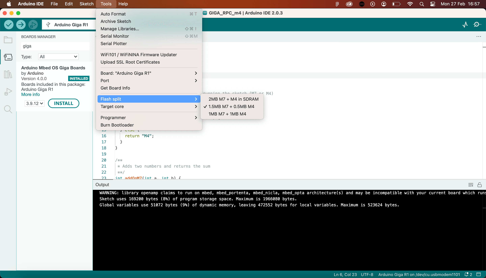
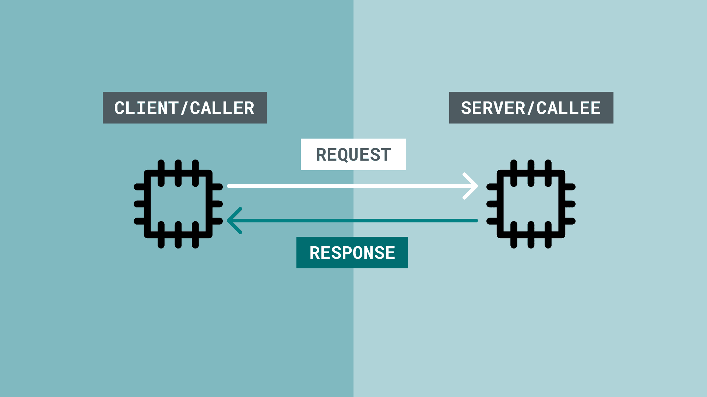
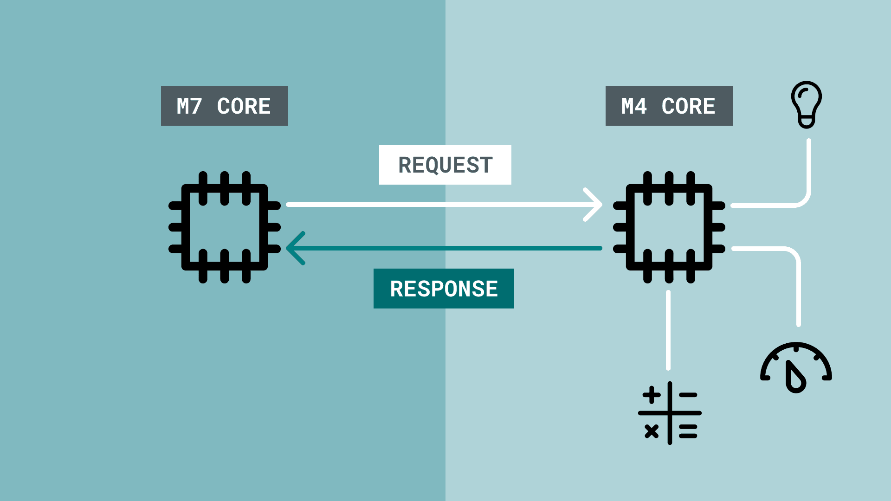

The GIGA R1's [STM32H747XI](static/resources/datasheets/stm32h747xi.pdf) has two cores, the M4 and the M7. Each core can be programmed individually, with M7 acting as the main processor, and the M4 as a co-processor.

The M7 is referred to as the main processor due its superior hardware features, as well as it is required to run to boot the M4 core (you boot the M4 from within the M7). 

These two cores can run applications in parallel, for example, running a servo motor on one core, and a display on another, without blocking each other. In a single core, such operations would slow down the program, resulting in lesser performance.

The M4 and M7 cores are programmed with separate sketches, using the same serial port. In the Arduino IDE, you can select the core you want to program, and then upload the sketch you want to run on that specific core. 

## Goals

In this guide you will discover:
- How to configure and program the M4/M7 cores and conventional approaches to do so.
- How to boot the M4 core.
- How to communicate between the cores via Remote Call Procedures (RPC).
- Useful examples based on the dual core & RPC features.
- The `RPC` library API.

## Hardware & Software Needed

- [GIGA R1 WiFi](/hardware/giga-r1-wifi)
- [Arduino IDE](https://www.arduino.cc/en/software)
- Arduino GIGA Board Package installed.\*

***\*For instructions on how to install the GIGA Board Package, follow the [Getting Started with GIGA R1 guide](/tutorials/giga-r1-wifi/giga-getting-started).***

## M4 Support

The M4 processor can access most of the peripherals that the M7 can access, with some exceptions.

The M4 supports:
- Wi-Fi®
- I2C
- SPI
- UART
- CAN
- DAC
- ADC
- Bluetooth® Low Energy (via [ArduinoBLE Library](https://www.arduino.cc/reference/en/libraries/arduinoble/))

The M4 does **not** support:
- Serial communication\*
- [Arduino Cloud](https://app.arduino.cc) sketches.

***\*Serial Communication from the M4 can be enabled by setting up an RPC that allows the M4 & M7 cores to communicate. Using `RPC.print()` (M4) and `RPC.read()` (M7) helps achieve this. See [RPC Serial Example](#rpc-serial).***

### Boot / Disable M4

The M4 core is by manufacturing default, disabled when booting the board. The M4 core can however be booted by using the `RPC.begin()` command, which includes the necessary functions to boot the M4 core. See the [RPC.cpp source file](https://github.com/arduino/ArduinoCore-mbed/blob/main/libraries/RPC/src/RPC.cpp#L122-L140) for more details.

### Boot / Disable M7

The M7 is booted by default and there is currently **no option to disable** this core.

### Peripheral Interference

When booting the M4, the M4 will execute the sketch that has been uploaded to its flash memory. It is a good idea to track what type of code you are running on the M4, as you may create interference between different peripherals. If you run simply a blank sketch on the M4, it should **not** create any interference.

An example of this is if you use the `CAN` library. If you are running a CAN application on the **M7**, you will disrupt it if you enable it on the **M4**. The dual core feature is not intended for using the same peripheral, bus etc.

***Tip: name your sketches with a `_M4` and `_M7` suffix/prefix, and create an initialization sequence. E.g. blink the blue LED three times whenever the M4 boots up.***

## Pin Priority

As the M7 and M4 core share their pins, which one gets priority to the pin? It can be assumed that as the M7 is the more powerful core, it gets first access.

This is however **not true** as pin priority is random. If both cores tries to access the same pin (e.g. `D27`), it is simply random who gets access.

***When developing dual core applications, it is a good idea avoiding using the same pins & peripheral for many reasons.*** 

## Programming M4/M7

When programming the GIGA R1 WiFi's M7 and M4, we **create a sketch for each core**, and program them like we would program two individual Arduino boards. As only a single serial port is available, we need to specify which core we want to target. 

Some essential things to consider when programming the cores are:
- You need to [partition the memory](#partitioning-the-flash-memory), allocating flash memory to the M4 core.
- You need to select the [target core](#target-core), which is either **Main Core** or **M4 Co-processor**.
- The M4 has no serial communication enabled, here we need to use RPC (see [RPC Serial example](#rpc-serial)).

When writing multiple sketches, there are some things to consider to make your development experience easier:
- Name your sketches with either `_M4` or `_M7` suffix or prefix. This will make it easier if the code is intended to be shared with others.
- Consider having a starting sequence (e.g. the blue LED blinking 3 times), whenever a core is initialized.
- Always include `RPC.begin()` on your M7 core sketch.

### Partitioning The Flash Memory

To allocate the flash memory for the M4, the flash memory can be partitioned. This is done by navigating to **Tools > Flash Split** in the IDE. 

***Note that the flash memory is the space where the application code (your sketch) is stored. It is not the RAM memory (which is significantly lower).***



- **2MB M7 + M4 in SDRAM (default)** - this option is the default configuration, which is for programming the M7 only. This allocates no flash memory to the M4.
- **1.5MB M7 + 0.5MB M4** - useful when larger amount of flash memory is required on the M7.
- **1MB M7 + 1MB M4** - useful when you need to balance the flash memory equally between the M4 and M7 cores.

***It is required to use option 2 or 3 if you intend to program the M4 via the IDE, as the default option provides no memory allocation for the M4.***

### Target Core

To select the core you want to program, navigate to **Tools > Target Core** in the IDE. 


Here you can choose between:
- **Main Core** - this is the M7 core, the main processor on the board.
- **M4 Co-processor** - this is the M4 core, the co-processor on the board.

### Uploading 

As both cores share the same serial port, choosing the **Flash Split** + **Target Core** is required so that the program is uploaded to the correct core.

Uploading is no different than to any other Arduino board: simply click the upload button and wait for it to finish. 

### Booting M4 Core

The M4 core does not boot by itself as it requires interaction from the M7 core. This boot function is built into the `RPC` library, and needs to be included in the sketch uploaded to the M7:

```arduino
#include <RPC.h>

void setup() {
  RPC.begin(); //boots M4
}
void loop(){
}
```

Once the M4 is booted from the M7, both cores will run in parallel, much like two Arduinos sharing the same board.

### Writing Over Existing Sketch

Uploading new sketches works the same as a typical upload procedure. The new sketch will overwrite the current sketch running on the core you upload to.

## Identify Core Used

To identify which core is being used, use the `HAL_GetCurrentCPUID()` method. Below is a function that returns which core is currently being used. This can be useful to identify that your program is running on the right core.

```arduino
/*
GIGA R1 WiFi - Core identify sketch.

This simple sketch blinks an LED on boot.
You will need to upload it to both the M7 and M4 core.

It checks whether current CPU is M7 or M4, and blinks either 
the blue LED or the green LED, 10 times. 

As the M4 is booted when invoking RPC.begin() on the M7,
the M4 sketch will run as soon as the blink() function
finishes on the M7. 
*/

#include <RPC.h>

void setup() {
  pinMode(LEDB, OUTPUT);
  pinMode(LEDG, OUTPUT);

  if (HAL_GetCurrentCPUID() == CM7_CPUID) {
    blink(LEDB, 100); //blink blue LED (M7 core)
  } else {
    blink(LEDG, 100); //blink green LED (M4 core)
  }
}

void loop() {
}

void blink(int led, int delaySeconds) {
  for (int i; i < 10; i++) {
    digitalWrite(led, LOW);
    delay(delaySeconds);
    digitalWrite(led, HIGH);
    delay(delaySeconds);
  }
  RPC.begin();
}
```

- The `HAL_GetCurrentCPUID()` is a method that checks the CPU ID, and returns the value in a `uint32_t` format.
- The `CM7_CPUID` flag that we compare with holds the value `0x00000003` (hexadecimal), or `3` (decimal).
- It is also possible to use `CM4_CPUID` flag which holds the value `0x00000003`, or `1` (decimal).

## Remote Call Procedures (RPC)

RPC is a method that allows programs to make requests to programs located elsewhere. It is based on the client-server model (also referred to as caller/callee), where the client makes a request to the server. 

An RPC is a synchronous operation, and while a request is being made from the caller to another system, the operation is suspended. On return of the results, the operation is resumed. 

The server side then performs the subroutine on request, and suspends any other operation as well. After it sends the result to the client, it resumes its operation, while waiting for another request.



### RPCs in the Arduino Environment

At the moment, only a limited amount of boards supports RPC, as in this context, it is designed to be a communication line between **two cores.** The GIGA R1 is one of them.

What makes this implementation possible is the `RPC` library ([see API section](#rpc-library-api)), which utilises the [rpclib](https://github.com/rpclib/rpclib) C++ library as well as functions from the [Stream](https://www.arduino.cc/reference/en/language/functions/communication/stream/) class.

The library makes it possible to set up either of the M4/M7 cores as a server/client, where remote calls can be made between them. This is done by "binding" a function to a name on the server side, and calling that function from the client side. 

On the server side, it could look like this:

```arduino
//server side, for example M7
int addFunction(int a, int b){ 
  return a + b;
}

RPC.bind("addFunction", addFunction);
```

On the client side, it could look like this:

```arduino
int x,y = 10;

RPC.call("addFunction", x, y);
```

When `call()` is used, a request is sent, it is processed on the server side, and returned. The `x` and `y` variables are used as arguments, and the result returned should be 20 (10+10).



## RPC Examples

In this section, you will find a series of examples that is based on the `RPC` library. 

### RPC Serial

The `Serial.print()` command only works on the **M7 core**. In order to print values on the **M4**, we need to:
- Use `RPC.println()` on the M4. This will print the values to the RPC1 stream.
- Use `RPC.available()` and `RPC.read()`.

**M4 Sketch:**

```arduino
#include <RPC.h>

void setup() {
RPC.begin();
}

void loop() {
RPC.println("Printed from M4 core");
delay(1000);
}
```

**M7 Sketch:**

```arduino
#include <RPC.h>

void setup() {
Serial.begin(9600);
RPC.begin();
}

void loop() {
  String buffer = "";
  while (RPC.available()) {
    buffer += (char)RPC.read();  // Fill the buffer with characters
  }
  if (buffer.length() > 0) {
    Serial.print(buffer);
  }
}
```

### RPC Sensor

This example demonstrates how to request a sensor reading from one core to the other, using:
- M4 as a client.
- M7 as a server.

**M4 Sketch:**

```arduino
#include "Arduino.h"
#include "RPC.h"

using namespace rtos;

Thread sensorThread;

void setup() {
  RPC.begin();
  Serial.begin(115200);

  /*
  Starts a new thread that loops the requestReading() function
  */
  sensorThread.start(requestReading);
}

void loop() {
}

/*
This thread calls the sensorThread() function remotely
every second. Result is printed to the RPC1 stream.
*/
void requestReading() {
  while (true) {
    delay(1000);
    auto result = RPC.call("sensorRead").as<int>();
    RPC.println("Result is " + String(result));
  }
}
```

**M7 Sketch:**

```arduino
#include "Arduino.h"
#include "RPC.h"

void setup() {
  RPC.begin();
  Serial.begin(115200);

  //Bind the sensorRead() function on the M7
  RPC.bind("sensorRead", sensorRead);
}

void loop() {
  // On M7, let's print everything that is received over the RPC1 stream interface
  // Buffer it, otherwise all characters will be interleaved by other prints
  String buffer = "";
  while (RPC.available()) {
    buffer += (char)RPC.read();  // Fill the buffer with characters
  }
  if (buffer.length() > 0) {
    Serial.print(buffer);
  }
}

/*
Function on the M7 that returns an analog reading (A0)
*/
int sensorRead() {
  int result = analogRead(A0);
  return result;
}
```

### RPC Servo Motor

This example demonstrates how to request a servo motor on another core to move to a specific angle, using:
- M4 as a client.
- M7 as a server.

Each example is written as a **single sketch** intended to be uploaded to **both cores**.

**M4 sketch:**

```arduino
#include "Arduino.h"
#include "RPC.h"

using namespace rtos;

Thread servoThread;

void setup() {
  RPC.begin();
  Serial.begin(115200);

  /*
  Starts a new thread that loops the requestServoMove() function
  */
  servoThread.start(requestServoMove);
}

void loop() {
}

/*
This thread calls the servoMove() function remotely
every second, passing the angle variable (0-180).
*/
void requestServoMove() {
  while (true) {
    //Read a pot meter
    int rawAnalog = analogRead(A0);

    //Map value to 180
    int angle = map(rawAnalog, 0, 1023, 0, 180);

    delay(1000);
    auto result = RPC.call("servoMove", angle).as<int>();
    RPC.println("Servo angle is: " + String(result));
  }
}
```

**M7 sketch:**

```arduino
#include "Arduino.h"
#include "RPC.h"
#include <Servo.h>

Servo myservo;

void setup() {
  RPC.begin();
  myservo.attach(5); //attach servo to pin 5

  Serial.begin(115200);

  //Bind the servoMove() function on the M7
  RPC.bind("servoMove", servoMove);
}

void loop() {
  // On M7, let's print everything that is received over the RPC1 stream interface
  // Buffer it, otherwise all characters will be interleaved by other prints
  String buffer = "";
  while (RPC.available()) {
    buffer += (char)RPC.read();  // Fill the buffer with characters
  }
  if (buffer.length() > 0) {
    Serial.print(buffer);
  }
}

/*
Function on the M7 that returns an analog reading (A0)
*/
int servoMove(int angle) {
  myservo.write(angle);
  delay(10);
  return angle;
  /*
  After the operation is done, return angle to the client.
  The value passed to this function does not change, but this
  verifies it has been passed correctly.
  */
}
```

## RPC Library API

The `RPC` library is based on the [rpclib](https://github.com/rpclib/rpclib) C++ library which provides a client and server implementation. In addition, it provides a method for communication between the M4 and M7 cores. 

This library is included in the GIGA Board Package, so it is automatically installed with the Board Package. To use this library, you need to include `RPC.h`:

```arduino
#include <RPC.h>
```

### RPC.begin()

Initializes the library. This function also boots the M4 core.

#### Syntax

```arduino
RPC.begin()
```

#### Returns

- `1` on success.
- `0` on failure.

### RPC.bind()

Used on the server side to bind a name to a function, and makes it possible for remotely calling it from another system.

#### Syntax

```arduino
RPC.bind("this_function", thisfunction)
```

#### Parameters

- `"name_of_func"` - name given for the function to be called from the client side.
- `name_of_func` - name of the function on the server side.

#### Returns

- None.

### RPC.call()

Used on the client side to call a function with optional parameters.

```arduino
RPC.call("this_function", int args)
```

#### Parameters

- `"name_of_func"` - the name of the function declared on the server side.
- `args` - arguments to be passed to the function.

#### Returns

- Result of the function if arguments are passed.

## RPC Serial API

The RPC Serial methods are also included in the `RPC` library, and uses methods from the [Stream](https://www.arduino.cc/reference/en/language/functions/communication/stream/) base class, and is similar to the [Serial](https://www.arduino.cc/reference/en/language/functions/communication/serial/) class.

As the `Serial` class is only available on the M7 core, the M4 core uses `RPC` library to print data, where the M7 can read the data and print it to a computer.

### RPC.println()

Prints data to a serial port. This is used on the M4 core to send data to the M7.

#### Syntax

```arduino
RPC.println(val);
```

#### Parameters

- The value to print. Can be any data type, but not multiple (e.g. string + integer in the same call).

#### Returns

- Number of bytes used. E.g. printing ("hello") returns 7. As hello (5) + new line (2) = 7. 

### RPC.available()

Get the number of available bytes to read from the M4.

#### Syntax

```arduino
RPC.available();
```

#### Parameters

- None.

#### Returns

- The number of bytes available to read.
- `-1` if there is none.

### RPC.read()

Reads the first available byte from the M4.

#### Syntax

```arduino
RPC.read();
```

#### Parameters

- None.

#### Returns

- The first available byte from the M4.
- `-1` if there is none.