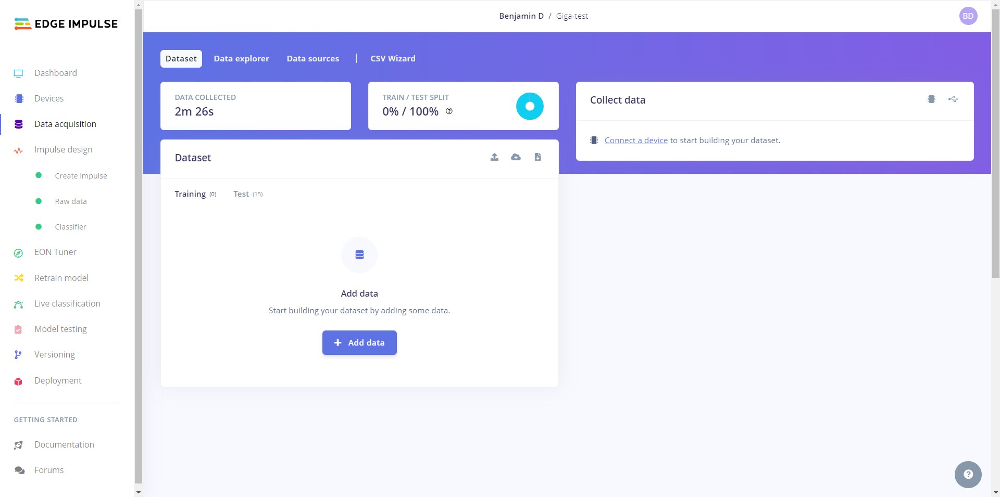
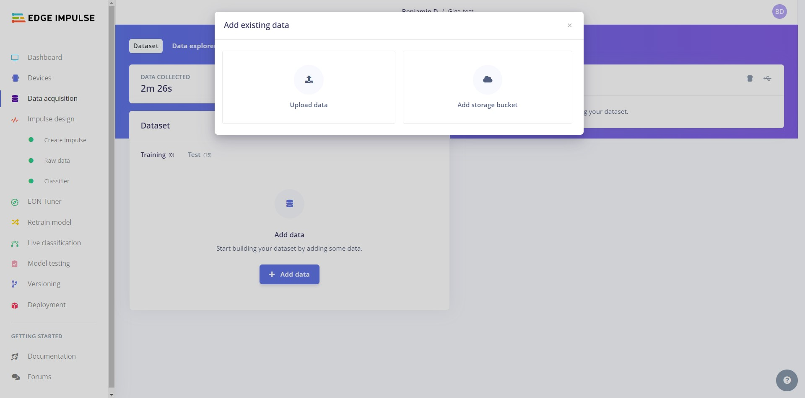
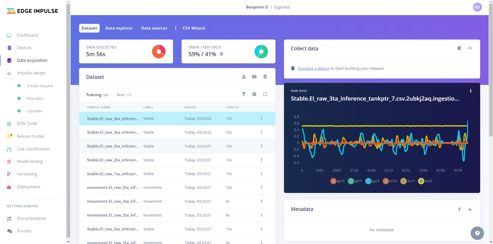
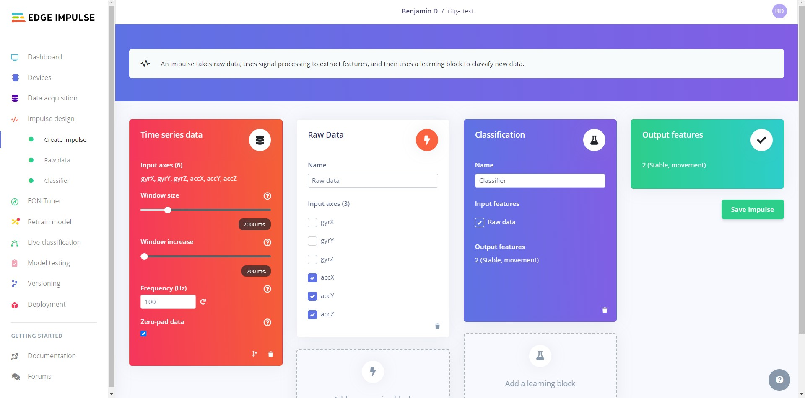
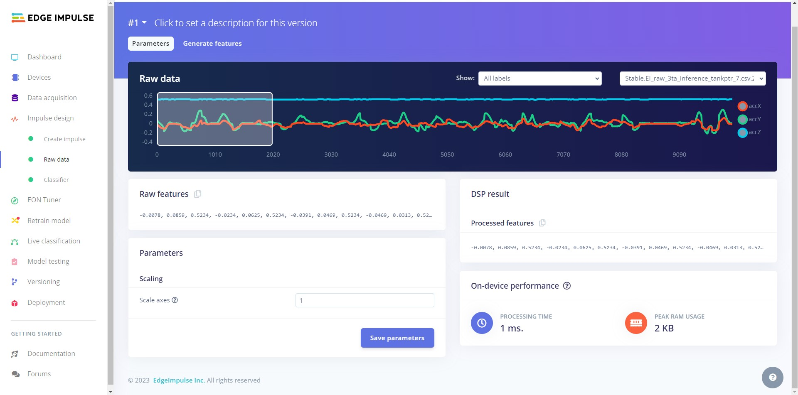
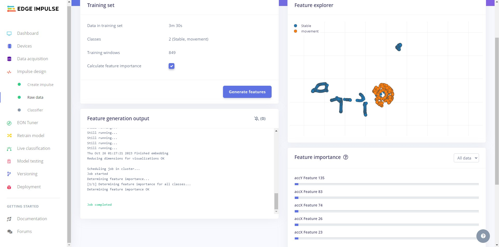
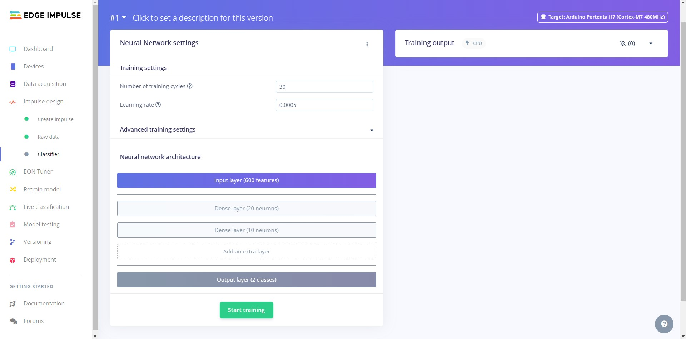
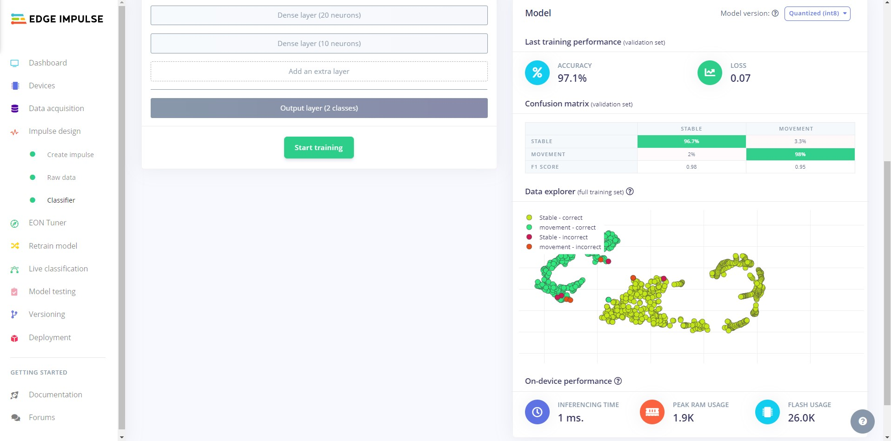
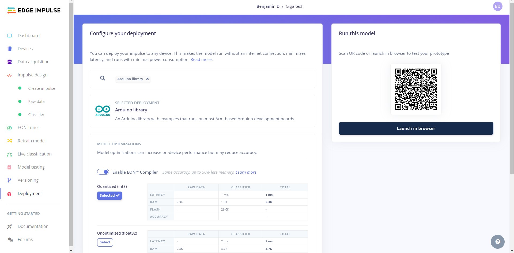

## Overview

The Arduino GIGA R1 WiFi is a versatile board. Combining it with a Inertial Measurement Unit (IMU) we can create a functioning motion detection application with machine learning.

The simple motion detection application will be created on the Edge Impulse® platform, a leading platform in developing intelligent devices and a powerful facilitator for ML applications.

By the end of this tutorial, you will have a fully functional motion detection application running on your board!

## Goals

- Learn how to use Edge Impulse with the GIGA

## Hardware and Software Requirements

- [GIGA R1 WiFi](https://store.arduino.cc/products/giga-r1-wifi) (x1)
- [Micro-USB](https://store.arduino.cc/products/usb-2-0-cable-type-a-micro) cable (x1)
- [Arduino IDE 2.0+](https://www.arduino.cc/en/software), or [Arduino Web Editor](https://create.arduino.cc/editor)
- [Edge Impulse account](https://studio.edgeimpulse.com)

## Instructions

## Setting up Edge Impulse Project

### Machine Learning Data

The GIGA R1 WiFi does not have an on-board IMU, meaning we will have to get data using different boards or from other sources online.

When you have your data, import it into the Edge Impulse project. Go to the **data aquasition** tab and you will see the following window:

From here upload the data. 

When the data is uploaded you will see the individual clips and other information on this page.

### Impulse Design

With the training dataset captured, you can design an **impulse**. An impulse takes raw data and uses signal processing to extract features, then uses a learning block to classify new data. Signal processing blocks always return the same values for the same input and are used to make raw data easier to process, while learning blocks learn from past experiences.

In this tutorial, we are going to use the following processing blocks:

- **Raw Data processing block**: The Raw Data block generates windows from data samples without any specific signal processing.
- **Classification learning block**: This block takes the generated features and learns to distinguish between the different classes.

To set both blocks, navigate to the **Create impulse** tab, select the window size to `600` ms, increase it to `200`, add the `Raw Data` and `Classification` blocks, and click the **Save impulse** button. Your impulse should be as shown below:

### Raw Data Block Configuration

The Raw Data block generates windows from data samples without any specific signal processing. Start by pressing the **Save Parameters** button.

On this page you can see a representation of how well the modell can differentiate the different classes. Go ahead and press the **Generate features** button.

You can check on the progress in the **Feature generation output** window.

### Classification Block Configuration

Now, it's time to start training the neural network. Neural networks are algorithms that can learn to recognize patterns in their training data, for example, certain types of movements. The neural network you will train will take the processing block features as input and try to map it to one of the two classes of our model (stable and movement).

Click on the **Classifier** tab, you'll see the following window:

Click the **Start training**. When it's complete, you'll see the **Model** performance window appear at the bottom-right of the window:

From the **Model** performance window, we can see the **model's accuracy**. Accuracy refers to the percentage of windows of movement that were correctly classified; the higher the number, the better. However, **an accuracy of 100% is unlikely and often a sign that your model has overfit the training data**. For most applications, an accuracy above 85% is very good. The confusion matrix shows the balance of correctly versus incorrectly classified.

Now that you have trained a neural network with the Machine Learning Tools, we are ready to deploy it!

### Deploying and Running an Impulse

Now we can deploy it as a library for Arduino. Go to **Deployment** and set the option to **Arduino Library**.

### Arduino IDE

