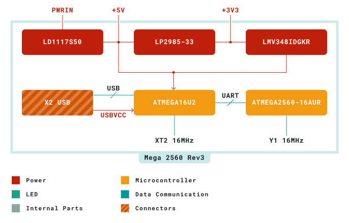
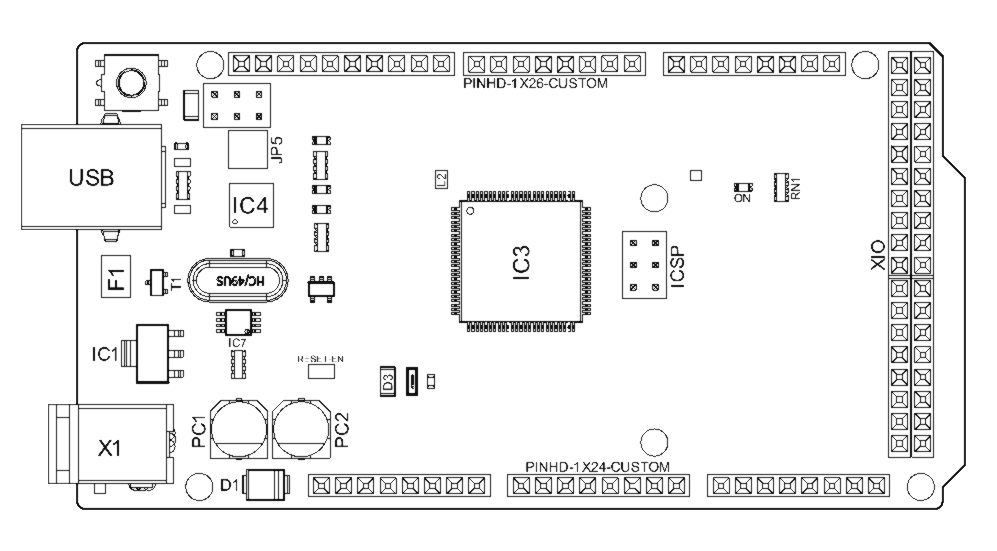
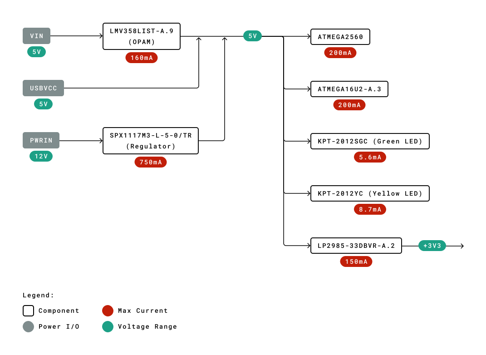
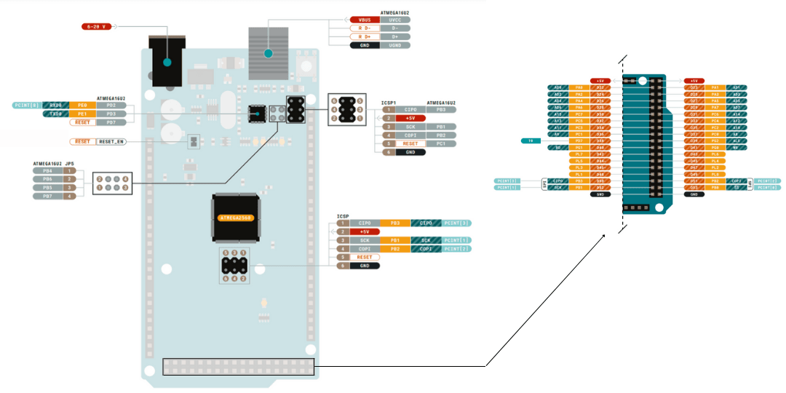
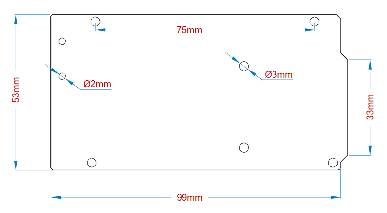
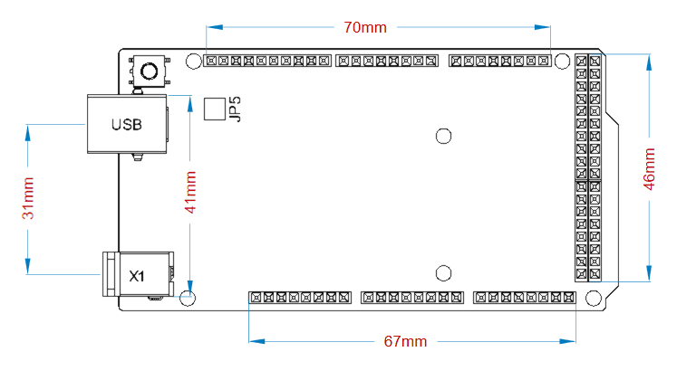

# Description
Arduino® Mega 2560 is an exemplary development board dedicated for building extensive applications as compared to other maker boards by Arduino. The board accommodates the ATmega2560 microcontroller, which operates at a frequency of 16 MHz. The board contains 54 digital input/output pins, 16 analog inputs, 4 UARTs (hardware serial ports), a USB connection, a power jack, an ICSP header, and a reset button.  

# Target Areas 
3D Printing, Robotics, Maker

# Features
- **ATmega2560 Processor**
    - Up to 16 MIPS Throughput at 16MHz
    - 256k bytes (of which 8k is used for the bootloader)
    - 4k bytes EEPROM
    - 8k bytes Internal SRAM
    - 32 × 8 General Purpose Working Registers
    - Real Time Counter with Separate Oscillator
    - Four 8-bit PWM Channels
    - Four Programmable Serial USART
    - Controller/Peripheral SPI Serial Interface
- **ATmega16U2**
    - Up to 16 MIPS Throughput at 16 MHz
    - 16k bytes ISP Flash Memory
    - 512 bytes EEPROM
    - 512 bytes SRAM
    - USART with SPI master only mode and hardware flow control (RTS/CTS)
    - Master/Slave SPI Serial Interface
- **Sleep Modes**
    - Idle
    - ADC Noise Reduction
    - Power-save
    - Power-down
    - Standby
    - Extended Standby
- **Power**
    - USB Connection
    - External AC/DC Adapter
- **I/O**
    - 54 Digital
    - 16 Analog
    - 15 PWM Output

# Contents 

## The Board

Arduino® Mega 2560 is a successor board of Arduino Mega,  it is dedicated to applications and projects that require large number of input output pins and the use cases which need high processing power. The Arduino® Mega 2560 comes with a much larger set of IOs when we compare it with traditional Uno board considering the form factor of both the boards.

### Application Examples

- **Robotics**: Featuring the high processing capacitity, the Arduino Mega 2560 can handle the extensive robotic applications. It is compatible with the motor controller shield that enables it to control multiple motors at an instance, thus making it perfect of robotic applications. The large number of I/O pins can accommodate many robotic sensors as well.
  
- **3D Printing**: Algorithms play a significant role in implementation of 3D printers. Arduino Mega 2560 has the power to process these complex algorithms required for 3D printing. Additionally, the slight changes to the code is easily possible with the Arduino IDE and thus 3D printing programs can be customized according to user requirements.

- **Wi-Fi**: Integrating wireless functionality enhances the utility of the applications. Arduino Mega 2560 is compatible with WiFi shields hence allowing the wireless features for the applications in 3D printing and Robotics. 

### Accessories

### Related Products

- Arduino® Uno Rev 3
- Arduino® Nano
- Arduino® DUE without headers

## Ratings

### Recommended Operating Conditions

| Symbol          | Description                          | Min | Typ | Max | Unit |
| --------------- | ------------------------------------ | --- | --- | --- | ---- |
| VIN  | Input voltage from VIN pad / DC Jack | 7   | 7.0 | 12  | V    |
| VUSB | Input voltage from USB connector     | 4.8 | 5.0 | 5.5 | V    |
| TOP  | Operating Temperature                | -40 | 25  | 85  | °C   |

## Functional Overview

### Block Diagram

### Board Topology
**Front View**

| **Ref.** | **Description**                  | **Ref.** | **Description**                  |
| -------- | -------------------------------- | -------- | -------------------------------- |
| USB      | USB B Connector                  | F1       | Chip Capacitor                   |
| IC1      | 5V Linear Regulator              | X1       | Power Jack Connector             |
| JP5      | Plated Holes                     | IC4      | ATmega16U2 chip                  |
| PC1      | Electrolytic Alumninum Capacitor | PC2      | Electrolytic Alumninum Capacitor |
| D1       | General Purpose Rectifier        | D3       | General Purpose Diode            |
| L2       | Fixed Inductor                   | IC3      | ATmega2560 chip                  |
| ICSP     | Connector Header                 | ON       | Green LED                        |
| RN1      | Resistor Array                   | XIO      | Connector                        |

### Processor
Primary processor of Arduino Mega 2560 Rev3 board is ATmega2560 chip which operates at a frequency of 16 MHz. It accommodates a large number of input and output lines which gives the provision of interfacing many external devices. At the same time the operations and processing is not slowed due to its significantly larger RAM than the other processors. The board also features a USB serial processor ATmega16U2 which acts an interface between the USB input signals and the main processor. This increases the flexibility of interfacing and connecting peripherals to the Arduino Mega 2560 Rev 3 board.

### Power Tree

## Board Operation
### Getting Started - IDE
If you want to program your Arduino® MEGA 2560 while offline you need to install the Arduino® Desktop IDE **[1]** To connect the Arduino® MEGA 2560 to your computer, you’ll need a Type-B USB cable. This also provides power to the board, as indicated by the LED.

### Getting Started - Arduino Web Editor
All Arduino® boards, including this one, work out-of-the-box on the Arduino® Web Editor **[2]**, by just installing a simple plugin. 

The Arduino® Web Editor is hosted online, therefore it will always be up-to-date with the latest features and support for all boards. Follow **[3]** to start coding on the browser and upload your sketches onto your board.

### Sample Sketches
Sample sketches for the Arduino® MEGA 2560 can be found either in the “Examples” menu in the Arduino® IDE 

### Online Resources
Now that you have gone through the basics of what you can do with the board you can explore the endless possibilities it provides by checking exciting projects on ProjectHub **[5]**, the Arduino® Library Reference **[6]** and the online store **[7]** where you will be able to complement your board with sensors, actuators and more.

## Connector Pinouts

### Analog
| Pin | Function | Type   | Description                                     |
| --- | -------- | ------ | ----------------------------------------------- |
| 1   | NC       | NC     | Not Connected                                   |
| 2   | IOREF    | IOREF  | Reference for digital logic V - connected to 5V |
| 3   | Reset    | Reset  | Reset                                           |
| 4   | +3V3     | Power  | +3V3 Power Rail                                 |
| 5   | +5V      | Power  | +5V Power Rail                                  |
| 6   | GND      | Power  | Ground                                          |
| 7   | GND      | Power  | Ground                                          |
| 8   | VIN      | Power  | Voltage Input                                   |
| 9   | A0       | Analog | Analog input 0 /GPIO                            |
| 10  | A1       | Analog | Analog input 1 /GPIO                            |
| 11  | A2       | Analog | Analog input 2 /GPIO                            |
| 12  | A3       | Analog | Analog input 3 /GPIO                            |
| 13  | A4       | Analog | Analog input 4 /GPIO                            |
| 14  | A5       | Analog | Analog input 5 /GPIO                            |
| 15  | A6       | Analog | Analog input 6 /GPIO                            |
| 16  | A7       | Analog | Analog input 7 /GPIO                            |
| 17  | A8       | Analog | Analog input 8 /GPIO                            |
| 18  | A9       | Analog | Analog input 9 /GPIO                            |
| 19  | A10      | Analog | Analog input 10 /GPIO                           |
| 20  | A11      | Analog | Analog input 11 /GPIO                           |
| 21  | A12      | Analog | Analog input 12 /GPIO                           |
| 22  | A13      | Analog | Analog input 13 /GPIO                           |
| 23  | A14      | Analog | Analog input 14 /GPIO                           |
| 24  | A15      | Analog | Analog input 15 /GPIO                           |
### Digital
| Pin | Function | Type              | Description                   |
| --- | -------- | ----------------- | ----------------------------- |
| 1   | D21/SCL  | Digital Input/I2C | Digital input 21/I2C Dataline |
| 2   | D20/SDA  | Digital Input/I2C | Digital input 20/I2C Dataline |
| 3   | AREF     | Digital           | Analog Reference Voltage      |
| 4   | GND      | Power             | Ground                        |
| 5   | D13      | Digital/GPIO      | Digital input 13/GPIO         |
| 6   | D12      | Digital/GPIO      | Digital input 12/GPIO         |
| 7   | D11      | Digital/GPIO      | Digital input 11/GPIO         |
| 8   | D10      | Digital/GPIO      | Digital input 10/GPIO         |
| 9   | D9       | Digital/GPIO      | Digital input 9/GPIO          |
| 10  | D8       | Digital/GPIO      | Digital input 8/GPIO          |
| 11  | D7       | Digital/GPIO      | Digital input 7/GPIO          |
| 12  | D6       | Digital/GPIO      | Digital input 6/GPIO          |
| 13  | D5       | Digital/GPIO      | Digital input 5/GPIO          |
| 14  | D4       | Digital/GPIO      | Digital input 4/GPIO          |
| 15  | D3       | Digital/GPIO      | Digital input 3/GPIO          |
| 16  | D2       | Digital/GPIO      | Digital input 2/GPIO          |
| 17  | D1/TX0   | Digital/GPIO      | Digital input 1 /GPIO         |
| 18  | D0/Tx1   | Digital/GPIO      | Digital input 0 /GPIO         |
| 19  | D14      | Digital/GPIO      | Digital input 14 /GPIO        |
| 20  | D15      | Digital/GPIO      | Digital input 15 /GPIO        |
| 21  | D16      | Digital/GPIO      | Digital input 16 /GPIO        |
| 22  | D17      | Digital/GPIO      | Digital input 17 /GPIO        |
| 23  | D18      | Digital/GPIO      | Digital input 18 /GPIO        |
| 24  | D19      | Digital/GPIO      | Digital input 19 /GPIO        |
| 25  | D20      | Digital/GPIO      | Digital input 20 /GPIO        |
| 26  | D21      | Digital/GPIO      | Digital input 21 /GPIO        |

### ATMEGA16U2 JP5
| Pin | Function | Type     | Description       |
| --- | -------- | -------- | ----------------- |
| 1   | PB4      | Internal | Serial Wire Debug |
| 2   | PB6      | Internal | Serial Wire Debug |
| 3   | PB5      | Internal | Serial Wire Debug |
| 4   | PB7      | Internal | Serial Wire Debug |

### ATMEGA16U2 ICSP1
| Pin | Function | Type     | Description                  |
| --- | -------- | -------- | ---------------------------- |
| 1   | CIPO     | Internal | Controller In Peripheral Out |
| 2   | +5V      | Internal | Power Supply of 5V           |
| 3   | SCK      | Internal | Serial Clock                 |
| 4   | COPI     | Internal | Controller Out Peripheral In |
| 5   | RESET    | Internal | Reset                        |
| 6   | GND      | Internal | Ground                       |

### Digital Pins D22 - D53 LHS
| Pin | Function | Type    | Description           |
| --- | -------- | ------- | --------------------- |
| 1   | +5V      | Power   | Power Supply of 5V    |
| 2   | D22      | Digital | Digital input 22/GPIO |
| 3   | D24      | Digital | Digital input 24/GPIO |
| 4   | D26      | Digital | Digital input 26/GPIO |
| 5   | D28      | Digital | Digital input 28/GPIO |
| 6   | D30      | Digital | Digital input 30/GPIO |
| 7   | D32      | Digital | Digital input 32/GPIO |
| 8   | D34      | Digital | Digital input 34/GPIO |
| 9   | D36      | Digital | Digital input 36/GPIO |
| 10  | D38      | Digital | Digital input 38/GPIO |
| 11  | D40      | Digital | Digital input 40/GPIO |
| 12  | D42      | Digital | Digital input 42/GPIO |
| 13  | D44      | Digital | Digital input 44/GPIO |
| 14  | D46      | Digital | Digital input 46/GPIO |
| 15  | D48      | Digital | Digital input 48/GPIO |
| 16  | D50      | Digital | Digital input 50/GPIO |
| 17  | D52      | Digital | Digital input 52/GPIO |
| 18  | GND      | Power   | Ground                |

### Digital Pins D22 - D53 RHS
| Pin | Function | Type    | Description           |
| --- | -------- | ------- | --------------------- |
| 1   | +5V      | Power   | Power Supply of 5V    |
| 2   | D23      | Digital | Digital input 23/GPIO |
| 3   | D25      | Digital | Digital input 25/GPIO |
| 4   | D27      | Digital | Digital input 27/GPIO |
| 5   | D29      | Digital | Digital input 29/GPIO |
| 6   | D31      | Digital | Digital input 31/GPIO |
| 7   | D33      | Digital | Digital input 33/GPIO |
| 8   | D35      | Digital | Digital input 35/GPIO |
| 9   | D37      | Digital | Digital input 37/GPIO |
| 10  | D39      | Digital | Digital input 39/GPIO |
| 11  | D41      | Digital | Digital input 41/GPIO |
| 12  | D43      | Digital | Digital input 43/GPIO |
| 13  | D45      | Digital | Digital input 45/GPIO |
| 14  | D47      | Digital | Digital input 47/GPIO |
| 15  | D49      | Digital | Digital input 49/GPIO |
| 16  | D51      | Digital | Digital input 51/GPIO |
| 17  | D53      | Digital | Digital input 53/GPIO |
| 18  | GND      | Power   | Ground                |

## Mechanical Information

### Board Outline

### Board Mount Holes

# Certifications
## Declaration of Conformity CE DoC (EU)
We declare under our sole responsibility that the products above are in conformity with the essential requirements of the following EU Directives and therefore qualify for free movement within markets comprising the European Union (EU) and European Economic Area (EEA). 

## Declaration of Conformity to EU RoHS & REACH 211 01/19/2021
Arduino boards are in compliance with RoHS 2 Directive 2011/65/EU of the European Parliament and RoHS 3 Directive 2015/863/EU of the Council of 4 June 2015 on the restriction of the use of certain hazardous substances in electrical and electronic equipment. 

| **Substance**                          | **Maximum Limit (ppm)** |
| -------------------------------------- | ----------------------- |
| Lead (Pb)                              | 1000                    |
| Cadmium (Cd)                           | 100                     |
| Mercury (Hg)                           | 1000                    |
| Hexavalent Chromium (Cr6+)             | 1000                    |
| Poly Brominated Biphenyls (PBB)        | 1000                    |
| Poly Brominated Diphenyl ethers (PBDE) | 1000                    |
| Bis(2-Ethylhexyl} phthalate (DEHP)     | 1000                    |
| Benzyl butyl phthalate (BBP)           | 1000                    |
| Dibutyl phthalate (DBP)                | 1000                    |
| Diisobutyl phthalate (DIBP)            | 1000                    |

Exemptions : No exemptions are claimed. 

Arduino Boards are fully compliant with the related requirements of European Union Regulation (EC) 1907 /2006 concerning the Registration, Evaluation, Authorization and Restriction of Chemicals (REACH). We declare none of the SVHCs (https://echa.europa.eu/web/guest/candidate-list-table), the Candidate List of Substances of Very High Concern for authorization currently released by ECHA, is present in all products (and also package) in quantities totaling in a concentration equal or above 0.1%. To the best of our knowledge, we also declare that our products do not contain any of the substances listed on the "Authorization List" (Annex XIV of the REACH regulations) and Substances of Very High Concern (SVHC) in any significant amounts as specified by the Annex XVII of Candidate list published by ECHA (European Chemical Agency) 1907 /2006/EC.

## Conflict Minerals Declaration 
As a global supplier of electronic and electrical components, Arduino is aware of our obligations with regards to laws and regulations regarding Conflict Minerals, specifically the Dodd-Frank Wall Street Reform and Consumer Protection Act, Section 1502. Arduino does not directly source or process conflict minerals such as Tin, Tantalum, Tungsten, or Gold. Conflict minerals are contained in our products in the form of solder, or as a component in metal alloys. As part of our reasonable due diligence Arduino has contacted component suppliers within our supply chain to verify their continued compliance with the regulations. Based on the information received thus far we declare that our products contain Conflict Minerals sourced from conflict-free areas. 

## FCC Caution
Any Changes or modifications not expressly approved by the party responsible for compliance could void the user’s authority to operate the equipment.

This device complies with part 15 of the FCC Rules. Operation is subject to the following two conditions: 

(1) This device may not cause harmful interference

(2) this device must accept any interference received, including interference that may cause undesired operation.

**FCC RF Radiation Exposure Statement:**

1. This Transmitter must not be co-located or operating in conjunction with any other antenna or transmitter.

2. This equipment complies with RF radiation exposure limits set forth for an uncontrolled environment.

3. This equipment should be installed and operated with minimum distance 20cm between the radiator & your body.

English: 
User manuals for licence-exempt radio apparatus shall contain the following or equivalent notice in a conspicuous location in the user manual or alternatively on the device or both. This device complies with Industry Canada licence-exempt RSS standard(s). Operation is subject to the following two conditions:

(1) this device may not cause interference

(2) this device must accept any interference, including interference that may cause undesired operation of the device.

French: 
Le présent appareil est conforme aux CNR d’Industrie Canada applicables aux appareils radio exempts de licence. L’exploitation est autorisée aux deux conditions suivantes :

(1) l’ appareil nedoit pas produire de brouillage

(2) l’utilisateur de l’appareil doit accepter tout brouillage radioélectrique subi, même si le brouillage est susceptible d’en compromettre le fonctionnement.

**IC SAR Warning:**

English 
This equipment should be installed and operated with minimum distance 20 cm between the radiator and your body.  

French: 
Lors de l’ installation et de l’ exploitation de ce dispositif, la distance entre le radiateur et le corps est d ’au moins 20 cm.

**Important:** The operating temperature of the EUT can’t exceed 85℃ and shouldn’t be lower than -40℃.

Hereby, Arduino S.r.l. declares that this product is in compliance with essential requirements and other relevant provisions of Directive 201453/EU. This product is allowed to be used in all EU member states. 

## Company Information

| Company name    | Arduino S.r.l.                                            |
| --------------- | --------------------------------------------------------- |
| Company Address | Arduino SRL, Via Andrea Appiani 25, 20900 Monza MB, Italy |

## Reference Documentation

| Ref                       | Link                                                                                                |
| ------------------------- | --------------------------------------------------------------------------------------------------- |
| Arduino IDE (Desktop)     | https://www.arduino.cc/en/Main/Software                                                             |
| Arduino IDE (Cloud)       | https://create.arduino.cc/editor                                                                    |
| Cloud IDE Getting Started | https://create.arduino.cc/projecthub/Arduino_Genuino/getting-started-with-arduino-web-editor-4b3e4a |
| Arduino Pro Website       | https://www.arduino.cc/pro                                                                          |
| Project Hub               | https://create.arduino.cc/projecthub?by=part&part_id=11332&sort=trending                            |
| Library Reference         | https://www.arduino.cc/reference/en/libraries/                                                      |
| Online Store              | https://store.arduino.cc/                                                                           |

## Revision History

| **Date**   | **Revision** | **Changes**                              |
| ---------- | ------------ | ---------------------------------------- |
| 09/10/2023 | 2            | Updated recommended operating conditions |
| 29/09/2020 | 1            | First Release                            |

