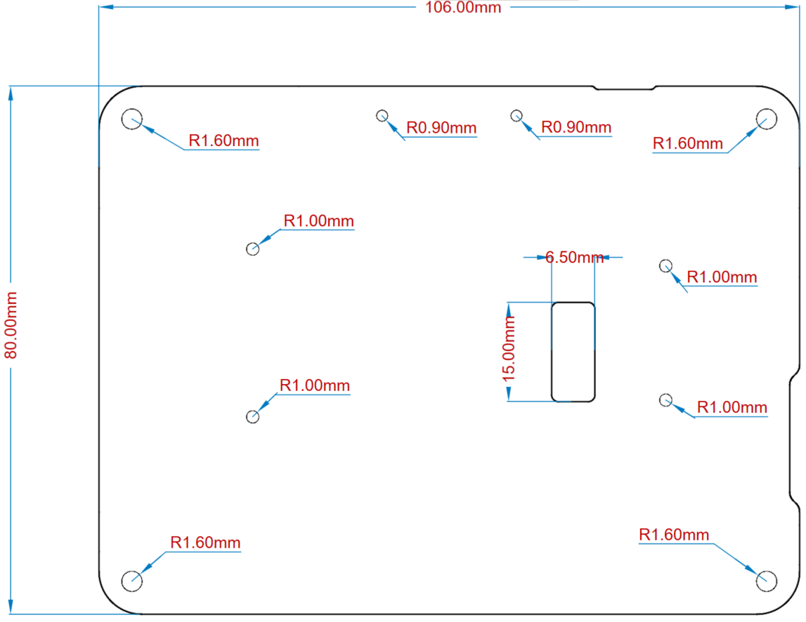

# Description

The Arduino GIGA Display Shield (from now on referred to as GIGA Display Shield) is an easy way to add a touchscreen display with orientation detection to your Arduino GIGA R1 WiFi (from now on referred to as GIGA R1 WiFi) board.

# Target Areas
Human-Machine Interface, Display, Shield

# Features
Note: The GIGA Display Shield requires a GIGA R1 WiFi board to function. It has no microcontroller and cannot be programmed independently.

- **KD040WVFID026-01-C025A** 3.97" TFT Display
  - 480x800 resolution
  - 16.7 million colors
  - 0.108 mm pixel size
  - Capacitive Touch sensor
  - 5-point and gesture support
  - Edge LED backlight
- **BMI270** 6-axis IMU (Accelerometer and Gyroscope)
  - 16-bit
  - 3-axis accelerometer with ±2g/±4g/±8g/±16g range
  - 3-axis gyroscope with ±125dps/±250dps/±500dps/±1000dps/±2000dps range
- **SMLP34RGB2W3** RGB LED
  - Common Anode
  - IS31FL3197-QFLS2-TR Driver with integrated charge pump
- **MP34DT06JTR** Digital Microphone
  - AOP = 122.5 dbSPL
  - 64 dB signal-to-noise ratio
  - Omnidirectional sensitivity
  - –26 dBFS ± 3 dB sensitivity
- **I/O**
  - GIGA Connector
  - 2.54 mm Camera Connector

# Contents

# The Board

## Application Examples
The GIGA Display Shield provides easy cross-form factor support for an external touch display, together with several useful peripherals.

- **Human-Machine Interface Systems:** The GIGA Display Shield can be paired together with a GIGA R1 WiFi board for rapid development of a Human-Machine Interface system. The included gyroscope allows for easy orientation detection to adjust the visual element orientation.

- **Interaction Design Prototyping:** Quickly explore novel interaction design concepts and develop new ways to communicate with technology, including social robots that respond to sound.

- **Voice Assistant** Use the included microphone, together with the edge computing power of the GIGA R1 WiFi for voice automation with visual feedback. 

## Accessories (Not Included)

## Related Products

- Arduino GIGA R1 WiFi (ABX00063)

# Rating

## Recommended Operating Conditions

| Symbol         | Description                   | Min  | Typ | Max | Unit |
| -------------- | ----------------------------- | ---- | --- | --- | ---- |
| VIN | Input voltage from VIN header | 6    | 7.0 | 32  | V    |
| VDD | Input high-level voltage      | 2.31 |     | 3.3 | V    |
| VIL | Input low-level voltage       | 0    |     | 1   | V    |
| TOP | Operating Temperature         | -20  | +25 | +70 | °C   |

 

# Functional Overview

## Block Diagram

## Board Topology

### Front View

| **Ref.** | **Description**                           | **Ref.** | **Description** |
| -------- | ----------------------------------------- | -------- | --------------- |
| U1       | MP34DT06JTR MEMS Microphone IC            |          | TFT Display     |
| DL1      | SMLP34RGB2W3 LED RGB DIFFUSED PICOLED SMD |          |                 |

### Back View

| **Ref.** | **Description**                    | **Ref.** | **Description**                          |
| -------- | ---------------------------------- | -------- | ---------------------------------------- |
| U2       | IS31FL3197-QFLS2-TR                | U3       | LV52204MTTBG LED Driver IC               |
| U7       | BMI270 6-axis IMU                  | J3       | 21TW-247 Camera Connector 2.54 mm Header |
| J4       | F32Q-1A7H1-11020 Display Connector | J5       | F32Q-1A7H1-11008 Touch Connector         |
| J6       | 2.54 mm Header GIGA Connector      | J7       | 2.54mm Header GIGA Connector             |

## TFT Display

The KD040WVFID026-01-C025A TFT Display has a 3.97" diagonal size with two connectors. The J4 connector for video (DSI) signals and the J5 connector for the touch panel signals. TFT display and capacitance touch panel resolution is 480 x 800 with a pixel size of 0.108 mm. The touch module communicates via I2C to the main board. The edge LED backlight is driven by the LV52204MTTBG (U3) LED Driver.

## 6-Axis IMU
The GIGA Display Shield provides 6-axis IMU capabilities, via the 6-axis BMI270 (U7) IMU. The BMI270 includes both a three-axis gyroscope as well as a three-axis accelerometer. The information obtained can be used for measuring raw movement parameters as well as for machine learning. The BMI270 is connected to the GIGA R1 WiFi via a common I2C connection.

## RGB LED

A common anode RGB (DL1) is driven by a dedicated IS31FL3197-QFLS2-TR RGB LED Driver IC (U2) which can deliver sufficient current to each LED. The RGB LED Driver is connected via a common I2C connection to the GIGA main board. An included integrated charge pump ensures that the voltage delivered to the LED is sufficient. 

## Digital Microphone

The MP34DT06JTR is an ultra-compact, low-power, omnidirectional, digital MEMS microphone built with a capacitive sensing element and an PDM interface. The sensing element, capable of detecting acoustic waves, is manufactured using a specialized silicon micromachining process dedicated to produce audio sensors. The microphone is in a single channel configuration, with audio signals transmitter over PDM.

## Power Tree

The 3V3 voltage power is delivered by the GIGA R1 WiFi (J6 and J7). All onboard logic including the microphone (U1) and IMU (U7) operate at 3V3. The RGB LED Driver includes an integrated charge pump which increases the voltage as defined by the I2C commands. The edge backlight intensity is controlled by the LED driver (U3).

## Board Operation

### Getting Started - IDE

If you want to program your GIGA Display Shield while offline you need to install the Arduino® Desktop IDE **[1]**. A GIGA R1 WiFi is needed to use it. 

### Getting Started - Arduino Web Editor

All Arduino boards, including this one, work out-of-the-box on the Arduino Web Editor **[2]**, by just installing a simple plugin.

The Arduino Web Editor is hosted online, therefore it will always be up-to-date with the latest features and support for all boards. Follow **[3]** to start coding on the browser and upload your sketches onto your board.

### Getting Started - Arduino Cloud

All Arduino IoT enabled products are supported on Arduino Cloud which allows you to log, graph and analyze sensor data, trigger events, and automate your home or business.

### Online Resources

Now that you have gone through the basics of what you can do with the board you can explore the endless possibilities it provides by checking exciting projects on Arduino Project Hub **[4]**, the Arduino Library Reference **[5]** and the online store **[6]** where you will be able to complement your board with sensors, actuators and more.

# Mechanical Information

## Mounting Holes And Board Outline

 

# Certifications

## Declaration of Conformity CE DoC (EU)

We declare under our sole responsibility that the products above are in conformity with the essential requirements of the following EU Directives and therefore qualify for free movement within markets comprising the European Union (EU) and European Economic Area (EEA).

## Declaration of Conformity to EU RoHS & REACH

Arduino boards are in compliance with RoHS 2 Directive 2011/65/EU of the European Parliament and RoHS 3 Directive 2015/863/EU of the Council of 4 June 2015 on the restriction of the use of certain hazardous substances in electrical and electronic equipment.

| **Substance**                          | **Maximum Limit (ppm)** |
| -------------------------------------- | ----------------------- |
| Lead (Pb)                              | 1000                    |
| Cadmium (Cd)                           | 100                     |
| Mercury (Hg)                           | 1000                    |
| Hexavalent Chromium (Cr6+)             | 1000                    |
| Poly Brominated Biphenyls (PBB)        | 1000                    |
| Poly Brominated Diphenyl ethers (PBDE) | 1000                    |
| Bis(2-Ethylhexyl} phthalate (DEHP)     | 1000                    |
| Benzyl butyl phthalate (BBP)           | 1000                    |
| Dibutyl phthalate (DBP)                | 1000                    |
| Diisobutyl phthalate (DIBP)            | 1000                    |

Exemptions : No exemptions are claimed.

Arduino Boards are fully compliant with the related requirements of European Union Regulation (EC) 1907 /2006 concerning the Registration, Evaluation, Authorization and Restriction of Chemicals (REACH). We declare none of the SVHCs (<https://echa.europa.eu/web/guest/candidate-list-table>), the Candidate List of Substances of Very High Concern for authorization currently released by ECHA, is present in all products (and also package) in quantities totaling in a concentration equal or above 0.1%. To the best of our knowledge, we also declare that our products do not contain any of the substances listed on the "Authorization List" (Annex XIV of the REACH regulations) and Substances of Very High Concern (SVHC) in any significant amounts as specified by the Annex XVII of Candidate list published by ECHA (European Chemical Agency) 1907 /2006/EC.

## Conflict Minerals Declaration

As a global supplier of electronic and electrical components, Arduino is aware of our obligations with regards to laws and regulations regarding Conflict Minerals, specifically the Dodd-Frank Wall Street Reform and Consumer Protection Act, Section 1502. Arduino does not directly source or process conflict minerals such as Tin, Tantalum, Tungsten, or Gold. Conflict minerals are contained in our products in the form of solder, or as a component in metal alloys. As part of our reasonable due diligence Arduino has contacted component suppliers within our supply chain to verify their continued compliance with the regulations. Based on the information received thus far we declare that our products contain Conflict Minerals sourced from conflict-free areas.

## FCC Caution

Any Changes or modifications not expressly approved by the party responsible for compliance could void the user’s authority to operate the equipment.

This device complies with part 15 of the FCC Rules. Operation is subject to the following two conditions:

(1) This device may not cause harmful interference

(2) this device must accept any interference received, including interference that may cause undesired operation.

**FCC RF Radiation Exposure Statement:**

1. This Transmitter must not be co-located or operating in conjunction with any other antenna or transmitter.

2. This equipment complies with RF radiation exposure limits set forth for an uncontrolled environment.

3. This equipment should be installed and operated with minimum distance 20cm between the radiator & your body.

English:
User manuals for licence-exempt radio apparatus shall contain the following or equivalent notice in a conspicuous location in the user manual or alternatively on the device or both. This device complies with Industry Canada licence-exempt RSS standard(s). Operation is subject to the following two conditions:

(1) this device may not cause interference

(2) this device must accept any interference, including interference that may cause undesired operation of the device.

French:
Le présent appareil est conforme aux CNR d’Industrie Canada applicables aux appareils radio exempts de licence. L’exploitation est autorisée aux deux conditions suivantes :

(1) l’ appareil nedoit pas produire de brouillage

(2) l’utilisateur de l’appareil doit accepter tout brouillage radioélectrique subi, même si le brouillage est susceptible d’en compromettre le fonctionnement.

**IC SAR Warning:**

English
This equipment should be installed and operated with minimum distance 20 cm between the radiator and your body.  

French:
Lors de l’ installation et de l’ exploitation de ce dispositif, la distance entre le radiateur et le corps est d ’au moins 20 cm.

**Important:** The operating temperature of the EUT can’t exceed 65 ℃ and shouldn’t be lower than 0 ℃.

Hereby, Arduino S.r.l. declares that this product is in compliance with essential requirements and other relevant provisions of Directive 201453/EU. This product is allowed to be used in all EU member states.

## Company Information

| Company name    | Arduino SRL                                  |
| --------------- | -------------------------------------------- |
| Company Address | Via Andrea Appiani, 25 - 20900 MONZA（Italy) |

## Reference Documentation

| Ref                       | Link                                                                                            |
| ------------------------- | ----------------------------------------------------------------------------------------------- |
| Arduino IDE (Desktop)     | <https://www.arduino.cc/en/Main/Software>                                                       |
| Arduino IDE (Cloud)       | <https://create.arduino.cc/editor>                                                              |
| Cloud IDE Getting Started | <https://docs.arduino.cc/cloud/web-editor/tutorials/getting-started/getting-started-web-editor> |
| Project Hub               | <https://create.arduino.cc/projecthub?by=part&part_id=11332&sort=trending>                      |
| Library Reference         | <https://github.com/arduino-libraries/>                                                         |
| Online Store              | <https://store.arduino.cc/>                                                                     |

## Change Log

| **Date**   | **Changes**                  |
| ---------- | ---------------------------- |
| 2023/07/24 | Release                      |
| 2023/11/17 | Update operating temperature |