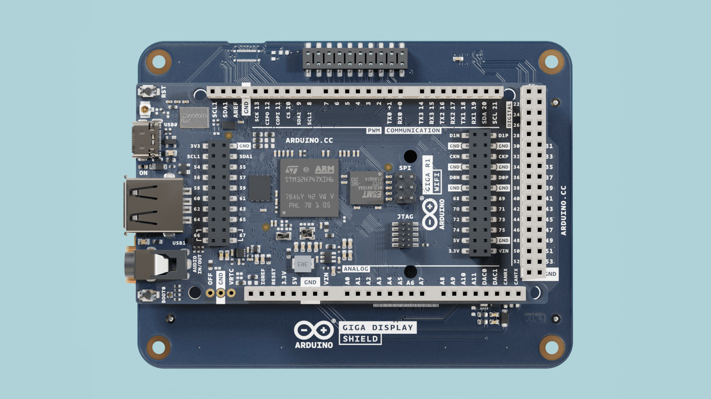
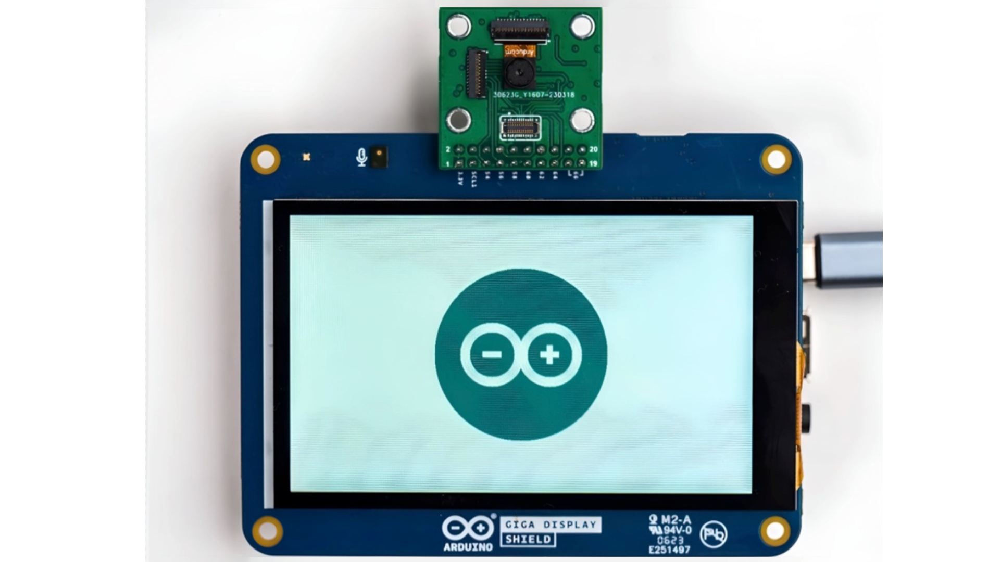

The [GIGA Display Shield](/hardware/giga-display-shield) is an accessory shield designed for the [GIGA R1 WiFi](/hardware/giga-r1-wifi) board. With it, you can render fast & sophisticated user interfaces on a **800x480** display with **touch support**.

In this guide you will learn how to set your board up with the GIGA R1 WiFi board & become familiar with the available libraries to control it.

## Hardware & Software Needed

- [Arduino GIGA R1 WiFi](https://store.arduino.cc/products/giga-r1-wifi)
- [Arduino GIGA Display Shield](https://store.arduino.cc/products/giga-display-shield)
- [Arduino IDE](https://www.arduino.cc/en/software)

## Overview

To use the GIGA Display Shield, there are currently three supported alternatives to draw on the display.

### Option 1: GFX Library

The [Arduino_GigaDisplay_GFX](https://github.com/arduino/Arduino_GigaDisplay_GFX) library is a layer library for the [Adafruit_GFX](https://github.com/adafruit/Adafruit-GFX-Library) graphic core library. This library makes it easy to draw geometrical shapes, printing values, drawing pixels and more. 

***To get started with the GFX library, visit the [GIGA Display Shield GFX Guide](/tutorials/giga-display-shield/gfx-guide).***

### Option 2: LVGL

The LVGL framework supports building more advanced UIs with dropdown menus, interactive buttons, scroll functionality using a grid system.

***To get started, visit the [GIGA Display LVGL Guide](/tutorials/giga-display-shield/lvgl-guide).***

### Option 3: ArduinoGraphics

[ArduinoGraphics](https://www.arduino.cc/reference/en/libraries/arduinographics/) is a simple library for more primitive drawings with a similar API to the GFX library.

***To get started, visit the [GIGA Display Shield Draw Images Guide](/tutorials/giga-display-shield/basic-draw-and-image).***

## Core & Libraries

The GIGA Display Shield requires you to install the core for GIGA boards, along with some additional software libraries.

The libraries can be installed via the Arduino IDE's library manager, where you will also discover examples.

### GIGA Core

To use the shield you will need a [GIGA R1 WiFi](https://store.arduino.cc/products/giga-r1-wifi) board. You also need to install the **GIGA core**, which can be done directly in the Arduino IDE, under "Board Manager". The source code for this core can be found in [this GitHub repository](https://github.com/arduino/ArduinoCore-mbed).

***For more details, see [Getting Started with GIGA R1 WiFi](/tutorials/giga-r1-wifi/giga-getting-started).***

### Arduino_H7_Video

The [Arduino_H7_Video](https://github.com/arduino/ArduinoCore-mbed/tree/main/libraries/Arduino_H7_Video) manages the video output and integrates third party frameworks such as [LVGL](https://lvgl.io/). This library is used to configure and initialize the display and to perform basic draw functions.

***This library is included with the GIGA core, and does not need to be installed. The documentation for this library is available [here](https://github.com/arduino/ArduinoCore-mbed/tree/main/libraries/Arduino_H7_Video/docs).***

### ArduinoGraphics

The [ArduinoGraphics](https://www.arduino.cc/reference/en/libraries/arduinographics/) is required for drawing operations on the screen. 

***For source code and issues with the ArduinoGraphics library, please see the [GitHub repository](https://github.com/arduino-libraries/ArduinoGraphics).***

### Arduino_GigaDisplayTouch

The [Arduino_GigaDisplayTouch](https://www.arduino.cc/reference/en/libraries/arduino_gigadisplaytouch/) is required for reading touch points on the screen, and is needed when using the LVGL's framework.

***For source code and issues with the Arduino_GigaDisplayTouch library, please see the [GitHub repository](https://github.com/arduino-libraries/Arduino_GigaDisplayTouch).***

### Arduino_GigaDisplay_GFX

The [Arduino_GigaDisplay_GFX](https://github.com/arduino-libraries/Arduino_GigaDisplay_GFX) library is a layer library for the [Adafruit_GFX](https://github.com/adafruit/Adafruit-GFX-Library) graphics core library.

This library is great for drawing geometrical shapes, printing text & values, drawing pixels and so on. It is recommended for beginners.

***Learn more about this library in the [GIGA Display Shield GFX Guide](/tutorials/giga-display-shield/gfx-guide).***

### Arduino_GigaDisplay

The [Arduino_GigaDisplay](https://github.com/arduino-libraries/Arduino_GigaDisplay) provides a large set of examples that can be used with the shield, many of which are included in the guides found in the documentation. 

This library is also required to use the built-in RGB, which you can read more about in the [RGB](#rgb) section.

***This library lists out all recommended libraries as dependencies. Installing it through the IDE will also prompt you to install the libraries listed above.***

### Arduino_BMI270_BMM150 (IMU)

To access the onboard IMU, use the [Arduino_BMI270_BMM150](https://github.com/arduino-libraries/Arduino_BMI270_BMM150) library. 

You can read more about its methods in the [library documentation](https://www.arduino.cc/reference/en/libraries/arduino_bmi270_bmm150/).

More information available in the [IMU section](#imu) in this document.

## Hardware Setup

To use the GIGA Display Shield, mount it on the **bottom** side of the GIGA R1 WiFi board. The GIGA R1 WiFi board will be flipped upside down when the display is used.



This makes it possible to freely use the GIGA R1 WiFi's pins while the display shield is connected.

## Camera Connector

Located on the top side of the shield is a 20 pin camera connector, which is Arducam® compatible and supports a wide range of cameras. The connector is connected to the [GIGA R1 WiFi's camera connector](/tutorials/giga-r1-wifi/giga-camera#camera-connector), and is compatible with a wide range of cameras ([see Arducam cameras](https://www.arducam.com/camera-for-arduino-giga/)).

The camera can only be mounted **on the front** of the display shield, meaning it only works in selfie mode. Do not attempt to connect the camera from the back. See the image below for how to connect it:



Read more about this in the [GIGA Display Camera Connector Guide](/tutorials/giga-display-shield/camera-tutorial), complete with an example.

## IMU

This shield has a built-in IMU module, the **BMI270**. This sensor can be used for a number of purposes, for example to automatically orientate an object on the screen, see the following tutorial: 

- [GIGA Display Shield Automatic Orientation](/tutorials/giga-display-shield/image-orientation)

To access **BMI270**, use the [BMI270-250](https://www.arduino.cc/reference/en/libraries/arduino_bmi270_bmm150/) library. Please note that the sensor is not connected to the main I2C bus, so you will need to initialize the sensor on another bus. To do so, simply add the line below to the top of your sketch:

```arduino
BoschSensorClass imu(Wire1);
``` 

Note that the examples use the default `IMU` (uppercase) class, which you will need to replace. Example:

```
IMU.begin() //for other boards
imu.begin() //for GIGA Display Shield
```

### Gyroscope

The below example can be used to access the gyroscope data:

```arduino
#include "Arduino_BMI270_BMM150.h"
BoschSensorClass imu(Wire1);

void setup() {
  Serial.begin(9600);
  while (!Serial);
  Serial.println("Started");

  if (!imu.begin()) {
    Serial.println("Failed to initialize imu!");
    while (1);
  }
  Serial.print("Gyroscope sample rate = ");
  Serial.print(imu.gyroscopeSampleRate());
  Serial.println(" Hz");
  Serial.println();
  Serial.println("Gyroscope in degrees/second");
  Serial.println("X\tY\tZ");
}

void loop() {
  float x, y, z;

  if (imu.gyroscopeAvailable()) {
    imu.readGyroscope(x, y, z);

    Serial.print(x);
    Serial.print('\t');
    Serial.print(y);
    Serial.print('\t');
    Serial.println(z);
  }
}
```

### Accelerometer

The below example can be used to access the accelerometer data:

```arduino
#include "Arduino_BMI270_BMM150.h"
BoschSensorClass imu(Wire1);

void setup() {
  Serial.begin(9600);
  while (!Serial);
  Serial.println("Started");

  if (!imu.begin()) {
    Serial.println("Failed to initialize imu!");
    while (1);
  }

  Serial.print("Accelerometer sample rate = ");
  Serial.print(imu.accelerationSampleRate());
  Serial.println(" Hz");
  Serial.println();
  Serial.println("Acceleration in G's");
  Serial.println("X\tY\tZ");
}

void loop() {
  float x, y, z;

  if (imu.accelerationAvailable()) {
    imu.readAcceleration(x, y, z);

    Serial.print(x);
    Serial.print('\t');
    Serial.print(y);
    Serial.print('\t');
    Serial.println(z);
  }
}
```

## Microphone

This shield has an embedded omnidirectional microphone, **MP34DT06JTR**, which can be used together with the [PDM](https://docs.arduino.cc/learn/built-in-libraries/pdm) library. This library is shipped with the GIGA core, so there's no need to manually install it.

Below is a minimal sketch that will print out the samples in the serial plotter (See [Using the Serial Plotter Tool](/software/ide-v2/tutorials/ide-v2-serial-plotter) for more information). 

```arduino
#include <PDM.h>

// default number of output channels
static const char channels = 1;

// default PCM output frequency
static const int frequency = 16000;

// Buffer to read samples into, each sample is 16-bits
short sampleBuffer[512];

// Number of audio samples read
volatile int samplesRead;

void setup() {
  Serial.begin(9600);
  while (!Serial);

  // Configure the data receive callback
  PDM.onReceive(onPDMdata);

  // Optionally set the gain
  // Defaults to 20 on the BLE Sense and 24 on the Portenta Vision Shield
  // PDM.setGain(30);

  // Initialize PDM with:
  // - one channel (mono mode)
  // - a 16 kHz sample rate for the Arduino Nano 33 BLE Sense
  // - a 32 kHz or 64 kHz sample rate for the Arduino Portenta Vision Shield
  if (!PDM.begin(channels, frequency)) {
    Serial.println("Failed to start PDM!");
    while (1);
  }
}

void loop() {
  // Wait for samples to be read
  if (samplesRead) {

    // Print samples to the serial monitor or plotter
    for (int i = 0; i < samplesRead; i++) {
      if(channels == 2) {
        Serial.print("L:");
        Serial.print(sampleBuffer[i]);
        Serial.print(" R:");
        i++;
      }
      Serial.println(sampleBuffer[i]);
    }

    // Clear the read count
    samplesRead = 0;
  }
}

/**
 * Callback function to process the data from the PDM microphone.
 * NOTE: This callback is executed as part of an ISR.
 * Therefore using `Serial` to print messages inside this function isn't supported.
 * */
void onPDMdata() {
  // Query the number of available bytes
  int bytesAvailable = PDM.available();

  // Read into the sample buffer
  PDM.read(sampleBuffer, bytesAvailable);

  // 16-bit, 2 bytes per sample
  samplesRead = bytesAvailable / 2;
}
```

To get started with the microphone, visit the [GIGA Display Shield Microphone Guide](/tutorials/giga-display-shield/microphone-tutorial).

## RGB

This shield has a built in RGB pixel that is controlled via I2C. To use this, install the [Arduino_GigaDisplay](https://github.com/arduino-libraries/Arduino_GigaDisplay) library. The following sketch is a minimal example that will blink the blue pixel every second.

```arduino
#include <Arduino_GigaDisplay.h>

GigaDisplayRGB rgb; //create rgb object

void setup() {
  rgb.begin(); //init the library
}

void loop() {
  rgb.on(0, 0, 255); //turn on blue pixel
  delay(1000);
  rgb.off(); //turn off all pixels
  delay(1000);
}
```