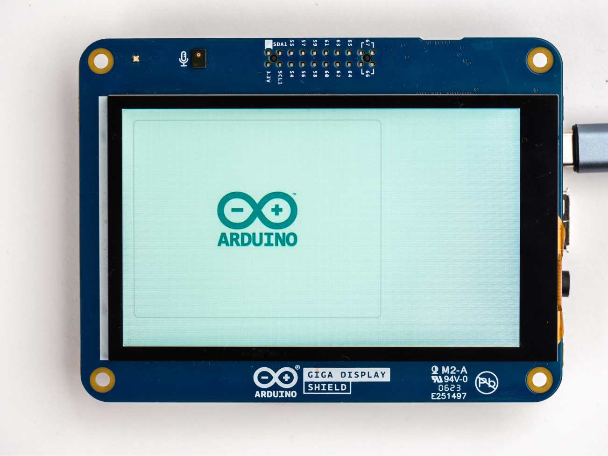
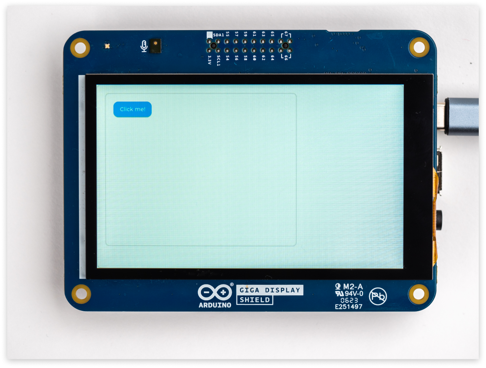
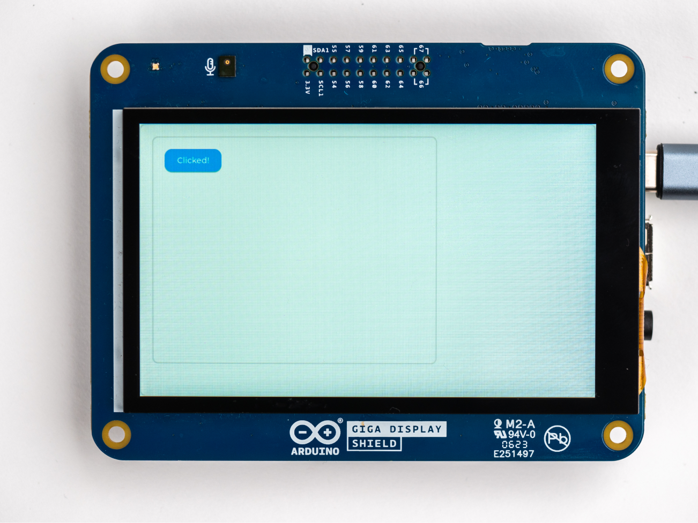

## Introduction

[LVGL](https://lvgl.io/) is a graphical framework for building powerful UIs, and is fully compatible with the GIGA Display Shield. It allows you to build UIs, using pre-made widgets like buttons, images, loading bars, sliders, checkboxes, etc. It also allows you to fully customize the screenspace on the display. In this guide, we will go through some of the different components, so you can learn how to best implement it in your projects.

***LVGL is a large framework, and the aim of this guide is to get you familiar with it. For much more information, visit the [LVGL documentation](https://docs.lvgl.io/master/).***

## Hardware & Software Needed

- [Arduino GIGA R1 WiFi](https://store.arduino.cc/products/giga-r1-wifi)
- [Arduino GIGA Display Shield](https://store.arduino.cc/products/giga-display-shield)
- [Arduino IDE](https://www.arduino.cc/en/software)

## Downloading the Library and Core

The GIGA R1 core includes the [Arduino_H7_Video](https://github.com/arduino/ArduinoCore-mbed/tree/main/libraries/Arduino_H7_Video) library that handles the display.

In this guide, we will be using three different libraries:
- [Arduino_H7_Video](https://github.com/arduino/ArduinoCore-mbed/tree/main/libraries/Arduino_H7_Video), this one is bundled with the core, so make sure you have the latest version of the [Mbed core](https://github.com/arduino/ArduinoCore-mbed) installed.
- [Arduino_GigaDisplayTouch](https://www.arduino.cc/reference/en/libraries/arduino_gigadisplaytouch/)
- [lvgl](https://github.com/lvgl/lvgl)

To install them, open the library manager and install the latest version by searching for **"Arduino_GigaDisplayTouch"** and **"lvgl"**.

In the sketch include the libraries like this:

```arduino
#include "Arduino_H7_Video.h"
#include "lvgl.h"
#include "Arduino_GigaDisplayTouch.h"
```

## General Set Up

In this section, we will go through the fundamental elements of an LVGL sketch:
- How to define & configure the display,
- how to create a grid layout,
- how to add an object to the grid,
- how to update the display.

***At the end of this section, you will find a complete example which implements a grid layout. You can [skip directly to the example](#minimal-example), but if you have no prior experience with LVGL, we recommend you follow the information below.***

### Display Shield Configuration

The first thing we need to do is to define the display we are using, by creating a object using the `Arduino_H7_Video` class, specifying the height, width and type of display.

```arduino
Arduino_H7_Video          Display(800, 480, GigaDisplayShield);
```` 

And if you want to use touch with your application, we need to create an object using the `Arduino_GigaDisplayTouch` class.

```arduino
Arduino_GigaDisplayTouch  TouchDetector;
```

In the `setup()`, we begin by initializing the display and the touch detector.

```arduino
void setup(){
  Display.begin();
  TouchDetector.begin();
}
```

With these things set up, we can go on to configure the LVGL elements.

### LVGL Screen Configuration

When creating elements, information about the screen and placement needs to be provided. Let's create a pointer variable that can be used whenever the screenspace needs to be used. The pointer variable will be named `screen` and to use the current screen for the pointer use `lv_scr_act()`. This code should also be added inside `setup()`.

```arduino
  lv_obj_t * screen = lv_obj_create(lv_scr_act());
```

The size of the screen space needs to be set for the pointer that is declared. The size can be set to anything within the display's size parameters. To make it easy we can use the entire size:

```arduino
  lv_obj_set_size(screen, Display.width(), Display.height());
```

### Creating a Grid Layout

Creating a grid that you can then fill with elements will consist of a defined column and row. This `col_dsc[] = {370, 370, LV_GRID_TEMPLATE_LAST};` will create two columns with 370 px width. To add more columns simply add more values, like so `col_dsc[] = {100, 100, 100, 100, LV_GRID_TEMPLATE_LAST};`, this will create four columns with 100 px width. The same logic is applied to the row definition.

```arduino
  static lv_coord_t col_dsc[] = {370, 370, LV_GRID_TEMPLATE_LAST};
  static lv_coord_t row_dsc[] = {215, 215, LV_GRID_TEMPLATE_LAST};
```

Then like before a pointer for the screenspace needs to be created. Here it will be called `grid`. 

```arduino
  lv_obj_t * grid = lv_obj_create(lv_scr_act());
```

To set the grid description that we defined before use:

```arduino
  lv_obj_set_grid_dsc_array(grid, col_dsc, row_dsc);
```

Now that the columns and rows have been defined the overall screen needs to be taken into account. This is achieved by using `lv_obj_set_size(grid, Display.width(), Display.height())`, to make it easy we will allow the `grid` to use the entire screen. 

```arduino
  lv_obj_set_size(grid, Display.width(), Display.height());
```

Then, just to test it out, let's add an object to the grid:
 
- first declare the `obj` pointer add it to the `grid`,
- then we set the grid cell via `lv_obj_set_grid_cell()` method.

```arduino
lv_obj_t* obj;
obj = lv_obj_create(grid);
lv_obj_set_grid_cell(obj, LV_GRID_ALIGN_STRETCH, 0, 1,  //column
                        LV_GRID_ALIGN_STRETCH, 0, 1);      //row
```


The `lv_obj_set_grid_cell())` have a set of parameters related to how the object is positioned and aligned. In this case, we have created a 2x2 grid, where the `0` (column) and `0` (row) indicates where on the grid it should go.

Take a look at this graphic to understand it better:


### Update Loop

Include this in the loop of your sketch to make sure the LVGL engine is running and updating the screen.

```arduino
void loop() { 
  lv_timer_handler();
}
```

### Minimal Example

The summary of all code snippets in this section can be found in the example below. It implements a 2x2 grid, as well as adds an object in each slot.

```arduino
#include "Arduino_H7_Video.h"
#include "lvgl.h"
#include "Arduino_GigaDisplayTouch.h"

Arduino_H7_Video Display(800, 480, GigaDisplayShield);
Arduino_GigaDisplayTouch TouchDetector;

void setup() {
  Display.begin();
  TouchDetector.begin();

  //Display & Grid Setup
  lv_obj_t* screen = lv_obj_create(lv_scr_act());
  lv_obj_set_size(screen, Display.width(), Display.height());

  static lv_coord_t col_dsc[] = { 370, 370, LV_GRID_TEMPLATE_LAST };
  static lv_coord_t row_dsc[] = { 215, 215, 215, 215, LV_GRID_TEMPLATE_LAST };

  lv_obj_t* grid = lv_obj_create(lv_scr_act());
  lv_obj_set_grid_dsc_array(grid, col_dsc, row_dsc);
  lv_obj_set_size(grid, Display.width(), Display.height());

  //top left
  lv_obj_t* obj;
  obj = lv_obj_create(grid);
  lv_obj_set_grid_cell(obj, LV_GRID_ALIGN_STRETCH, 0, 1,  //column
                       LV_GRID_ALIGN_STRETCH, 0, 1);      //row

  //bottom left
  obj = lv_obj_create(grid);
  lv_obj_set_grid_cell(obj, LV_GRID_ALIGN_STRETCH, 0, 1,  //column
                       LV_GRID_ALIGN_STRETCH, 1, 1);      //row
  //top right
  obj = lv_obj_create(grid);
  lv_obj_set_grid_cell(obj, LV_GRID_ALIGN_STRETCH, 1, 1,  //column
                       LV_GRID_ALIGN_STRETCH, 0, 1);      //row

  //bottom right
  obj = lv_obj_create(grid);
  lv_obj_set_grid_cell(obj, LV_GRID_ALIGN_STRETCH, 1, 1,  //column
                       LV_GRID_ALIGN_STRETCH, 1, 1);      //row
}

void loop() {
  lv_timer_handler();
}
```

## Visual Elements

### Image

To display an image on the screen we first need to define what that image that should be. Take the desired image, [convert it into the correct format](https://docs.lvgl.io/master/overview/img.html#online-converter) and place the image in the same folder as the sketch. Now use `LV_IMG_DECLARE(filename);`. For example the image we use will be named `img_arduinologo`.

```arduino
  LV_IMG_DECLARE(img_arduinologo);
```

`obj` will be a pointer that will be used to hold the information about the screenspace information for the image. The `img1` pointer will be used for the elements of the image itself.

```arduino
  lv_obj_t * obj;
  lv_obj_t * img1;
```

Then create the image object with `obj` as a parent. Then we can link the image and image pointer together.

```arduino
  img1 = lv_img_create(obj);
  lv_img_set_src(img1, &img_arduinologo);
```

To make sure we see the image use the align function to make it centered. Then at last set the size of image with `lv_obj_set_size(img1, WIDTH, HEIGHT)`.

```arduino
  lv_obj_align(img1, LV_ALIGN_CENTER, 0, 0);
  lv_obj_set_size(img1, 200, 150);
```



**Full Example:**

```arduino
#include "Arduino_H7_Video.h"
#include "lvgl.h"

Arduino_H7_Video          Display(800, 480, GigaDisplayShield);

void setup() {
  Display.begin();

  lv_obj_t * screen = lv_obj_create(lv_scr_act());
  lv_obj_set_size(screen, Display.width(), Display.height());

  static lv_coord_t col_dsc[] = { 500, LV_GRID_TEMPLATE_LAST};
  static lv_coord_t row_dsc[] = { 400, LV_GRID_TEMPLATE_LAST};

  lv_obj_t * grid = lv_obj_create(lv_scr_act());

  lv_obj_set_grid_dsc_array(grid, col_dsc, row_dsc);

  lv_obj_set_size(grid, Display.width(), Display.height());

  lv_obj_center(grid);

  lv_obj_t * obj;
  lv_obj_t * img1;

  obj = lv_obj_create(grid);
  lv_obj_set_grid_cell(obj, LV_GRID_ALIGN_STRETCH, 0, 1,
                        LV_GRID_ALIGN_STRETCH, 0, 1);

  LV_IMG_DECLARE(img_arduinologo);

  img1 = lv_img_create(obj);
  lv_img_set_src(img1, &img_arduinologo);

  lv_obj_align(img1, LV_ALIGN_CENTER, 0, 0);
  lv_obj_set_size(img1, 200, 150);
}

void loop() {
  lv_timer_handler();
}
```

## Functional Elements

### Checkbox

`obj` will be a pointer that will be used to hold the information about the screenspace information for the checkbox. The `checkbox` pointer will be used for the elements in the checkbox itself.

```arduino
  lv_obj_t * obj;
  lv_obj_t * checkbox;
```

Assign the screenspace info to `obj`, that was detailed in the [Screen Configuration](#lvgl-screen-configuration) section. To create the checkbox object use `lv_checkbox_create(obj)` and assign it to a suitable variable, here we use the `checkbox` pointer. Next set the text that will appear next to the checkbox by using `lv_checkbox_set_text(checkbox, "Example");`, here `Example` will be printed next to the checkbox.

```arduino
  obj = lv_obj_create(screen);
  checkbox = lv_checkbox_create(obj);
  lv_checkbox_set_text(checkbox, "Example");
```

The startup state of the checkbox can be set with `lv_obj_add_state()`. Where the object and state has to be specified:

```arduino
  lv_obj_add_state(checkbox, LV_STATE_CHECKED);
```


**Full Example:**

```arduino
#include "Arduino_H7_Video.h"
#include "lvgl.h"
#include "Arduino_GigaDisplayTouch.h"

Arduino_H7_Video          Display(800, 480, GigaDisplayShield);
Arduino_GigaDisplayTouch  TouchDetector;

void setup() {
  Display.begin();
  TouchDetector.begin();

  lv_obj_t * screen = lv_obj_create(lv_scr_act());
  lv_obj_set_size(screen, Display.width(), Display.height());

  static lv_coord_t col_dsc[] = { 500, LV_GRID_TEMPLATE_LAST};
  static lv_coord_t row_dsc[] = { 400, LV_GRID_TEMPLATE_LAST};

  lv_obj_t * grid = lv_obj_create(lv_scr_act());

  lv_obj_set_grid_dsc_array(grid, col_dsc, row_dsc);

  lv_obj_set_size(grid, Display.width(), Display.height());

  lv_obj_center(grid);

  lv_obj_t * obj;

  obj = lv_obj_create(grid);
  lv_obj_set_grid_cell(obj, LV_GRID_ALIGN_STRETCH, 0, 1,
                        LV_GRID_ALIGN_STRETCH, 0, 1);
  lv_obj_set_flex_flow(obj, LV_FLEX_FLOW_COLUMN);

  lv_obj_t * cb;
  cb = lv_checkbox_create(obj);
  lv_checkbox_set_text(cb, "Apple");

  cb = lv_checkbox_create(obj);
  lv_checkbox_set_text(cb, "Banana");
  lv_obj_add_state(cb, LV_STATE_CHECKED);
}

void loop() {
  lv_timer_handler();
}

```

### Radio Button

A radio button is created in the same way as a checkbox, but with some additional calls to change the style of the element. Adding these two style elements will allow for them to be added to the checkbox options.

```arduino
  static lv_style_t style_radio;
  static lv_style_t style_radio_chk;
```

Now initialize the style variable that was set in the previous step:

```arduino
  lv_style_init(&style_radio);
```

The size of the radio button is set with `lv_style_set_radius`. To make the radio button checkable use `lv_style_init(&style_radio_chk);`. And the color or background of the filled radio check can be set with `lv_style_set_bg_img_src`.

```arduino
  lv_style_set_radius(&style_radio, LV_RADIUS_CIRCLE);
  lv_style_init(&style_radio_chk);
  lv_style_set_bg_img_src(&style_radio_chk, NULL);
```


**Full Example:**

```arduino
#include "Arduino_H7_Video.h"
#include "lvgl.h"
#include "Arduino_GigaDisplayTouch.h"

Arduino_H7_Video          Display(800, 480, GigaDisplayShield);
Arduino_GigaDisplayTouch  TouchDetector;

void setup() {
  Display.begin();
  TouchDetector.begin();

  lv_obj_t * screen = lv_obj_create(lv_scr_act());
  lv_obj_set_size(screen, Display.width(), Display.height());

  static lv_coord_t col_dsc[] = { 500, LV_GRID_TEMPLATE_LAST};
  static lv_coord_t row_dsc[] = { 400, LV_GRID_TEMPLATE_LAST};

  lv_obj_t * grid = lv_obj_create(lv_scr_act());

  lv_obj_set_grid_dsc_array(grid, col_dsc, row_dsc);

  lv_obj_set_size(grid, Display.width(), Display.height());

  lv_obj_center(grid);

  lv_obj_t * obj;

  obj = lv_obj_create(grid);
  lv_obj_set_grid_cell(obj, LV_GRID_ALIGN_STRETCH, 0, 1,
                        LV_GRID_ALIGN_STRETCH, 0, 1);
  lv_obj_set_flex_flow(obj, LV_FLEX_FLOW_COLUMN);

  lv_obj_t * cb;

  static lv_style_t style_radio;
  static lv_style_t style_radio_chk;
  lv_style_init(&style_radio);
  lv_style_set_radius(&style_radio, LV_RADIUS_CIRCLE);
  lv_style_init(&style_radio_chk);
  lv_style_set_bg_img_src(&style_radio_chk, NULL);
  
  cb = lv_checkbox_create(obj);
  lv_checkbox_set_text(cb, "Lemon");
  lv_obj_add_flag(cb, LV_OBJ_FLAG_EVENT_BUBBLE);
  lv_obj_add_style(cb, &style_radio, LV_PART_INDICATOR);
  lv_obj_add_style(cb, &style_radio_chk, LV_PART_INDICATOR | LV_STATE_CHECKED);
  
  cb = lv_checkbox_create(obj);
  lv_checkbox_set_text(cb, "Melon");
  lv_obj_add_flag(cb, LV_OBJ_FLAG_EVENT_BUBBLE);
  lv_obj_add_style(cb, &style_radio, LV_PART_INDICATOR);
  lv_obj_add_style(cb, &style_radio_chk, LV_PART_INDICATOR | LV_STATE_CHECKED);
  lv_obj_add_state(cb, LV_STATE_CHECKED);
}

void loop() {
  lv_timer_handler();
}
```

### Slider

`obj` will be a pointer that will be used to hold the information about the screenspace information for the slider. The `slider` pointer will be used for the elements of the slider itself. The `label` pointer will be used for the text that will attached to the slider.

```arduino
  lv_obj_t * obj;
  lv_obj_t * slider;
  lv_obj_t * label;
```

Now the slider can be created with:

```arduino
  slider = lv_slider_create(obj);
```

Now the value of the slider needs to be defined, here the max value of the slider will be `75` and the animation will be default set as off as it is only needed when it is interacted with.

```arduino
  lv_slider_set_value(slider, 75, LV_ANIM_OFF);
```

If you want a label by your slider it can be created like you would create any other label. Using `lv_obj_align_to` allows for the label to be attached to the slider element. Changing the `LV_ALIGN_OUT_BOTTOM_MID` to determine where the text will be relative to the slider. You can find all the different options for alignment [here](https://docs.lvgl.io/master/widgets/obj.html#coordinates).

```arduino
  label = lv_label_create(obj);
  lv_label_set_text(label, "Drag me!");
  lv_obj_align_to(label, slider, LV_ALIGN_OUT_BOTTOM_MID, 0, 10);
```


**Full Example:**

```arduino
#include "Arduino_H7_Video.h"
#include "Arduino_GigaDisplayTouch.h"

#include "lvgl.h"

Arduino_H7_Video          Display(800, 480, GigaDisplayShield); /* Arduino_H7_Video Display(1024, 768, USBCVideo); */
Arduino_GigaDisplayTouch  TouchDetector;

void setup() {
  Display.begin();
  TouchDetector.begin();

  lv_obj_t * screen = lv_obj_create(lv_scr_act());
  lv_obj_set_size(screen, Display.width(), Display.height());

  static lv_coord_t col_dsc[] = { 500, LV_GRID_TEMPLATE_LAST};
  static lv_coord_t row_dsc[] = { 400, LV_GRID_TEMPLATE_LAST};

  lv_obj_t * grid = lv_obj_create(lv_scr_act());

  lv_obj_set_grid_dsc_array(grid, col_dsc, row_dsc);

  lv_obj_set_size(grid, Display.width(), Display.height());

  lv_obj_center(grid);

  lv_obj_t * label;
  lv_obj_t * obj;

  obj = lv_obj_create(grid);
  lv_obj_set_grid_cell(obj, LV_GRID_ALIGN_STRETCH, 0, 1,
                        LV_GRID_ALIGN_STRETCH, 0, 1);
  lv_obj_set_flex_flow(obj, LV_FLEX_FLOW_COLUMN);

  lv_obj_t * slider = lv_slider_create(obj);
  lv_slider_set_value(slider, 75, LV_ANIM_OFF);
  lv_obj_center(slider);
  label = lv_label_create(obj);
  lv_label_set_text(label, "Drag me!");
  lv_obj_align_to(label, slider, LV_ALIGN_OUT_BOTTOM_MID, 0, 10);

}

void loop() {
  lv_timer_handler();
}
```

### Bar

To make a bar, like a loading bar, we need to include some animation. Let's first set up the slider itself and then move on to the animation.

`obj` will be a pointer that will be used to hold the information about the screenspace information for the bar. The `bar` pointer will be used for the elements of the bar itself.

```arduino
  lv_obj_t * obj;
  lv_obj_t * bar;
```

Now the bar can be created with:

```arduino
  bar = lv_bar_create(obj);
```

Set the desired size of the bar with `lv_obj_set_size`. The value of the bar needs to be defined, here the max value of the bar will be `70` and the animation will be default set as off.

```arduino
  lv_obj_set_size(bar, 200, 20);
  lv_bar_set_value(bar, 70, LV_ANIM_OFF);
```

Now for the animation. First create the slider variable and initialize it:

```arduino
  lv_anim_t animation;
  lv_anim_init(&animation);
```

The animation time needs to be defined. It can be set with `lv_anim_set_time` which sets the duration of the animation and `lv_anim_set_playback_time` which makes the animation play back to when the forward direction is ready. The animation variable and the time in milliseconds has to be defined.

```arduino
  lv_anim_set_time(&animation, 3000);
  lv_anim_set_playback_time(&animation, 3000);
```

To connect the animation to the bar use:

```arduino
  lv_anim_set_var(&animation, bar);
```

The start and end values of the animation has to be set, here they are `0` and `100` respectively.

```arduino
  lv_anim_set_values(&animation, 0, 100);
```

How many times the animation will repeat can also be set, with this code the animation will repeat forever. And then at last we can create the animation with `lv_anim_start`.

```arduino
  lv_anim_set_repeat_count(&animation, LV_ANIM_REPEAT_INFINITE);
  lv_anim_start(&animation);
```

When the bar animates we can set it so that a separate callback function will be called. Here that function will be named `set_bar_val`.

```arduino
  lv_anim_set_exec_cb(&animation, set_bar_val);
```

In this separate callback function the bar value will be reset and the animation will be turned on again.

```arduino
static void set_bar_val(void * bar, int32_t val) {
  lv_bar_set_value((lv_obj_t *)bar, val, LV_ANIM_ON);
}
```


**Full Example:**

```arduino
#include "Arduino_H7_Video.h"
#include "Arduino_GigaDisplayTouch.h"

#include "lvgl.h"

Arduino_H7_Video          Display(800, 480, GigaDisplayShield); /* Arduino_H7_Video Display(1024, 768, USBCVideo); */
Arduino_GigaDisplayTouch  TouchDetector;

static void set_slider_val(void * bar, int32_t val) {
  lv_bar_set_value((lv_obj_t *)bar, val, LV_ANIM_ON);
}

void setup() {
  Display.begin();
  TouchDetector.begin();

  lv_obj_t * screen = lv_obj_create(lv_scr_act());
  lv_obj_set_size(screen, Display.width(), Display.height());

  static lv_coord_t col_dsc[] = { 500, LV_GRID_TEMPLATE_LAST};
  static lv_coord_t row_dsc[] = { 400, LV_GRID_TEMPLATE_LAST};

  lv_obj_t * grid = lv_obj_create(lv_scr_act());

  lv_obj_set_grid_dsc_array(grid, col_dsc, row_dsc);

  lv_obj_set_size(grid, Display.width(), Display.height());

  lv_obj_center(grid);

  lv_obj_t * label;
  lv_obj_t * obj;

  obj = lv_obj_create(grid);
  lv_obj_set_grid_cell(obj, LV_GRID_ALIGN_STRETCH, 0, 1,
                        LV_GRID_ALIGN_STRETCH, 0, 1);
  lv_obj_set_flex_flow(obj, LV_FLEX_FLOW_COLUMN);

  lv_obj_t * bar = lv_bar_create(obj);
  lv_obj_set_size(bar, 200, 20);
  lv_obj_center(bar);
  lv_bar_set_value(bar, 70, LV_ANIM_OFF);

  lv_anim_t a;
  lv_anim_init(&a);
  lv_anim_set_exec_cb(&a, set_slider_val);
  lv_anim_set_time(&a, 3000);
  lv_anim_set_playback_time(&a, 3000);
  lv_anim_set_var(&a, bar);
  lv_anim_set_values(&a, 0, 100);
  lv_anim_set_repeat_count(&a, LV_ANIM_REPEAT_INFINITE);
  lv_anim_start(&a);

}

void loop() {
  lv_timer_handler();
}
```

### Button

A button will need two parts, the design of the button itself and the callback event function which determines what happens when the button is pressed. Let's start with designing the button.


`obj` will be a pointer that will be used to hold the information about the screenspace information for the button. The `button` pointer will be used for the elements in the button itself. The `label` pointer will be used for the text that will be put on the button.

```arduino
  lv_obj_t * obj;
  lv_obj_t * button;
  lv_obj_t * label;
```

Now the button can be created with:

```arduino
  button = lv_btn_create(obj);
```

Set the size of the button with `lv_obj_set_size(btn, WIDTH, HEIGHT)`. For example:

```arduino
  lv_obj_set_size(btn, 100, 40);
```

Let's make the label on the button a child of the button by using `label = lv_label_create(button)`. Then the label can be set to whatever text it needs to be and center the text on top of the button so that it looks correct. The button will now say `Click me!` at the center of it.

```arduino
  label = lv_label_create(button);
  lv_label_set_text(label, "Click me!");
  lv_obj_center(label);
```

When the button is clicked we need to assign it a function to execute, let's call this function `button_event_callback`. Assign it to the correct button and set it to be executed when the button is clicked with `LV_EVENT_CLICKED`.

```arduino
  lv_obj_add_event_cb(button, button_event_callback, LV_EVENT_CLICKED, NULL);
```

Now let's create the callback function that will be called when the button is clicked. By creating pointers that will point to the original elements we can change them easily in our function. This function will make it so that when the button is clicked the label text on the button will be changed to `Clicked!`.


```arduino
static void button_event_callback(lv_event_t * e) {
  lv_obj_t * button = lv_event_get_target(e);
  lv_obj_t * label = lv_obj_get_child(button, 0);
  lv_label_set_text_fmt(label, "Clicked!");
}
```





**Full Example:**

```arduino
#include "Arduino_H7_Video.h"
#include "lvgl.h"
#include "Arduino_GigaDisplayTouch.h"

Arduino_H7_Video          Display(800, 480, GigaDisplayShield);
Arduino_GigaDisplayTouch  TouchDetector;

static void btn_event_cb(lv_event_t * e) {
  lv_obj_t * btn = lv_event_get_target(e);
  lv_obj_t * label = lv_obj_get_child(btn, 0);
  lv_label_set_text_fmt(label, "Clicked!");
}

void setup() {
  Display.begin();
  TouchDetector.begin();

  lv_obj_t * screen = lv_obj_create(lv_scr_act());
  lv_obj_set_size(screen, Display.width(), Display.height());

  static lv_coord_t col_dsc[] = { 500, LV_GRID_TEMPLATE_LAST};
  static lv_coord_t row_dsc[] = { 400, LV_GRID_TEMPLATE_LAST};

  lv_obj_t * grid = lv_obj_create(lv_scr_act());

  lv_obj_set_grid_dsc_array(grid, col_dsc, row_dsc);

  lv_obj_set_size(grid, Display.width(), Display.height());

  lv_obj_center(grid);

  lv_obj_t * label;
  lv_obj_t * obj;

  obj = lv_obj_create(grid);
  lv_obj_set_grid_cell(obj, LV_GRID_ALIGN_STRETCH, 0, 1,
                        LV_GRID_ALIGN_STRETCH, 0, 1);
  lv_obj_set_flex_flow(obj, LV_FLEX_FLOW_COLUMN);

  lv_obj_t * btn = lv_btn_create(obj);
  lv_obj_set_size(btn, 100, 40);
  lv_obj_center(btn);
  lv_obj_add_event_cb(btn, btn_event_cb, LV_EVENT_CLICKED, NULL);

  label = lv_label_create(btn);
  lv_label_set_text(label, "Click me!");
  lv_obj_center(label);

}

void loop() {
  lv_timer_handler();
}
```

## Conclusion

This guide went through the building blocks of the different components that can be implemented with LVGL. To see these examples in a full running example sketch go to **File > Examples > Arduino_H7_Video > LVGLDemo**.


This example sketch will show the different components in a 2x2 grid.

## Next Step
LVGL has a lot of customizability, if you are interested in playing around more with this, you can find many different examples on the official website for [LVGL](https://docs.lvgl.io/master/examples.html). These can easily be put in a sketch for the GIGA Display Shield, just remember to use the display-specific configuration that was shown at the [start of this tutorial](#display-shield-configuration).

The GIGA Display Shield features some on-board sensors, like an IMU and a microphone. To see how these can be used with LVGL check out our [Orientation tutorial](/tutorials/giga-display-shield/image-orientation), which will show you how to use the on-board IMU to rotate an image. Or have a look at our [Microphone tutorial](/tutorials/giga-display-shield/microphone-tutorial), which will show you how to merge microphone readings with LVGL components.
