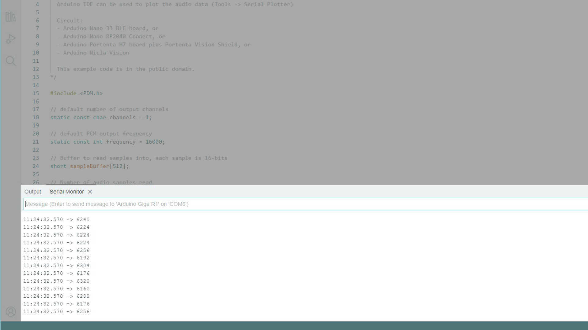

The GIGA Display Shield has an embedded MEMS microphone (**MP34DT06JTR**) that when combined with the visual element of the GIGA Display Screen can be used in a number of ways. 

- Stream microphone data (plot it / print it),
- Display volume as a bar,
- Detect a clap or other noises

Using the [Arduino_Graphics](https://github.com/arduino-libraries/ArduinoGraphics),[Arduino_GigaDisplay_GFX](https://github.com/arduino-libraries/Arduino_GigaDisplay_GFX) and [lvgl](https://github.com/lvgl/lvgl) we can also create animations and screen changes based on microphone data.

In this guide we will take a closer look at the [PDM library](https://docs.arduino.cc/learn/built-in-libraries/pdm), and provide some examples that can be used with this shield.

## Hardware & Software Needed

- [Arduino GIGA R1 WiFi](https://store.arduino.cc/products/giga-r1-wifi)
- [Arduino GIGA Display Shield](https://store.arduino.cc/products/giga-display-shield)
- [Arduino IDE](https://www.arduino.cc/en/software)

## Downloading the Library and Board Package

Make sure the latest GIGA Board Package is installed in the Arduino IDE. You can install it directly in the IDE by navigating to the board manager and searching for **Arduino Mbed OS Giga Boards** and install it.

The [PDM library](https://docs.arduino.cc/learn/built-in-libraries/pdm) is included in the Board Package, as well as the video driver library, [Arduino_H7_Video library](https://github.com/arduino/ArduinoCore-mbed/tree/main/libraries/Arduino_H7_Video). Some examples in this guide uses other libraries that are listed in each example.

## PDM Library

Pulse Density Modulation (PDM) is a technique used to convert analog signals into a digital 1-bit stream. 

The [PDM library](https://github.com/arduino/ArduinoCore-mbed/tree/main/libraries/PDM) is library built-in to the GIGA Board Package and allows you to read and process PDM signals. In this case, it reads the signal from the 

- Source code is available [here](https://github.com/arduino/ArduinoCore-mbed/tree/main/libraries/PDM)
- Library documentation is available [here](https://docs.arduino.cc/learn/built-in-libraries/pdm)

## Microphone PDM Example

The GIGA R1 Board Package includes a sample sketch called **PDM**, and in this section it is explained in more detail.

First we need to define the number of output channels, output frequency, a variable for counting when reading from the buffer and creating the buffer which the readings will be put into. This is done with the following lines:

```arduino
// default number of output channels
static const char channels = 1;

// default PCM output frequency
static const int frequency = 16000;

// Buffer to read samples into, each sample is 16-bits
short sampleBuffer[512];

// Number of audio samples read
volatile int samplesRead;
```

A callback function needs to be set, which is called when new PDM data is ready to be read. We do this in the `setup()` function using:

```arduino
  PDM.onReceive(onPDMdata);
```

`onPDMdata` is the callback function that we will have to create at the end of the sketch.

Now when we want to print or use the readings let's do it with a `for` loop since they are inside a buffer, which we need to step through. But let's first check so that there are readings to be printed with a simple `if` statement. These lines will step through the buffer until all the readings inside are printed and then start over:

```arduino
if (samplesRead) {
    for (int i = 0; i < samplesRead; i++) {
      Serial.println(sampleBuffer[i]);
    }
}
```

Its inside this `for` loop where we can get readings that will then change visual elements on the screen. This is where you would put any code that needs to react to the microphone readings.

And the last important part is the callback function that we used in the `setup()` function. This will take care of reading the values into the buffer and setting the value of the `samplesRead` variable which we used in the previous step.


```arduino
/**
 * Callback function to process the data from the PDM microphone.
 * NOTE: This callback is executed as part of an ISR.
 * Therefore using `Serial` to print messages inside this function isn't supported.
 * */
void onPDMdata() {
  // Query the number of available bytes
  int bytesAvailable = PDM.available();

  // Read into the sample buffer
  PDM.read(sampleBuffer, bytesAvailable);

  // 16-bit, 2 bytes per sample
  samplesRead = bytesAvailable / 2;
}
```

The full example is available in the [PDM Example](#pdm-example) section just below.

## Microphone Examples

In this section you will find a series of examples that uses the microphone. 

### PDM Example

This sketch can be found in **File > Examples > PDM > PDMSerialPlotter** in the Arduino IDE. It reads the microphone data, stores it in a buffer and prints it to the Serial Monitor / Serial Plotter tool in the IDE.

```arduino
#include <PDM.h>

// default number of output channels
static const char channels = 1;

// default PCM output frequency
static const int frequency = 16000;

// Buffer to read samples into, each sample is 16-bits
short sampleBuffer[512];

// Number of audio samples read
volatile int samplesRead;

void setup() {
  Serial.begin(9600);
  while (!Serial);

  // Configure the data receive callback
  PDM.onReceive(onPDMdata);

  // Optionally set the gain
  // Defaults to 20 on the BLE Sense and 24 on the Portenta Vision Shield
  // PDM.setGain(30);

  // Initialize PDM with:
  // - one channel (mono mode)
  // - a 16 kHz sample rate for the Arduino Nano 33 BLE Sense
  // - a 32 kHz or 64 kHz sample rate for the Arduino Portenta Vision Shield
  if (!PDM.begin(channels, frequency)) {
    Serial.println("Failed to start PDM!");
    while (1);
  }
}

void loop() {
  // Wait for samples to be read
  if (samplesRead) {

    // Print samples to the serial monitor or plotter
    for (int i = 0; i < samplesRead; i++) {
      if(channels == 2) {
        Serial.print("L:");
        Serial.print(sampleBuffer[i]);
        Serial.print(" R:");
        i++;
      }
      Serial.println(sampleBuffer[i]);
    }

    // Clear the read count
    samplesRead = 0;
  }
}

/**
 * Callback function to process the data from the PDM microphone.
 * NOTE: This callback is executed as part of an ISR.
 * Therefore using `Serial` to print messages inside this function isn't supported.
 * */
void onPDMdata() {
  // Query the number of available bytes
  int bytesAvailable = PDM.available();

  // Read into the sample buffer
  PDM.read(sampleBuffer, bytesAvailable);

  // 16-bit, 2 bytes per sample
  samplesRead = bytesAvailable / 2;
}
```

Open the Serial Monitor / Serial Plotter to see the data in real time.



### Clap Detection Sketch (ArduinoGraphics)

This sketch uses the [Arduino_Graphics library](https://www.arduino.cc/reference/en/libraries/arduinographics/) to change the color of the background when a loud noise is detected, such as a clap.

```arduino
#include "Arduino_H7_Video.h"
#include "ArduinoGraphics.h"
#include <PDM.h>

Arduino_H7_Video Display(800, 480, GigaDisplayShield);

// default number of output channels
static const char channels = 1;

// default PCM output frequency
static const int frequency = 16000;

// Buffer to read samples into, each sample is 16-bits
short sampleBuffer[512];

// Number of audio samples read
volatile int samplesRead;

void setup() {
  Display.begin();
  Display.beginDraw();
  Display.background(255, 255, 255);
  Display.clear();

  PDM.onReceive(onPDMdata);

  if (!PDM.begin(channels, frequency)) {
    Serial.println("Failed to start PDM!");
    while (1);
  }
  Display.endDraw();
}

int count = 1;

void loop(){
  int micValue;

  if (samplesRead) {
    // Print samples to the serial monitor or plotter
    for (int i = 0; i < samplesRead; i++) {
      micValue = sampleBuffer[i];
      if(micValue > 10000){
        clap_switch();
      }
    }
    // Clear the read count
    samplesRead = 0;
  }
}

void clap_switch(){
  Display.beginDraw();
  switch(count){
    case 1:
    Display.clear();
    Display.background(0, 0, 204);
    break;

    case 2:
    Display.clear();
    Display.background(255, 128, 0);
    break;

    case 3:
    Display.clear();
    Display.background(255, 255, 0);
    break;
    }
    if(count == 3)
    {
      count = 0;
    }
    count++;
    Display.endDraw();
    delay(1000);
}

void onPDMdata() {
  // Query the number of available bytes
  int bytesAvailable = PDM.available();

  // Read into the sample buffer
  PDM.read(sampleBuffer, bytesAvailable);

  // 16-bit, 2 bytes per sample
  samplesRead = bytesAvailable / 2;
}
```

After uploading a sketch, snap your fingers or clap your hands to produce a noise that meets the threshold. You should see the background color of the screen change.

### Volume Indication Sketch (LVGL)

This sketch requires the [lvgl library](https://github.com/lvgl/lvgl), please make sure that is installed before you upload the sketch. The sketch will show a bar on the screen that is animated when noise is made, functionally making it display the volume of the microphones readings. You will find the full sketch just below.

***For more information about using LVGL with the GIGA Display Shield, take a look at our documentation [here](tutorials/lvgl-guide).***

```arduino
#include <PDM.h>
#include "Arduino_H7_Video.h"
#include "lvgl.h"

Arduino_H7_Video          Display(800, 480, GigaDisplayShield);

static void set_slider_val(void * bar, int32_t val) {
  lv_bar_set_value((lv_obj_t *)bar, val, LV_ANIM_ON);
}

// default number of output channels
static const char channels = 1;

// default PCM output frequency
static const int frequency = 16000;

// Buffer to read samples into, each sample is 16-bits
short sampleBuffer[512];

// Number of audio samples read
volatile int samplesRead;

lv_obj_t * obj;
lv_anim_t a;
int micValue;

void setup() {
  Display.begin();

  PDM.onReceive(onPDMdata);

  if (!PDM.begin(channels, frequency)) {
    Serial.println("Failed to start PDM!");
    while (1);
  }

  // Create the bar
  obj = lv_bar_create(lv_scr_act());
  lv_obj_set_size(obj, 600, 50);
  lv_obj_center(obj);
  lv_bar_set_value(obj, 500, LV_ANIM_OFF);
  
  // Create the animation for the bar
  lv_anim_init(&a);
  lv_anim_set_exec_cb(&a, set_slider_val);
  lv_anim_set_time(&a, 300);
  lv_anim_set_playback_time(&a, 300);
  lv_anim_set_var(&a, obj);
}

void loop() {
  
  // Wait for samples to be read
  if (samplesRead) {

    // Print samples to the serial monitor or plotter
    for (int i = 0; i < samplesRead; i++) {
      Serial.println(sampleBuffer[i]);
      micValue = sampleBuffer[i];
      micValue = micValue / 100;
      if (micValue > 500)
      {
        micValue = 500;
      }
      lv_anim_set_values(&a, 0, micValue);
      lv_anim_start(&a);
    }

    // Clear the read count
    samplesRead = 0;
    delay(10);
  }
  lv_timer_handler();
}

/**
 * Callback function to process the data from the PDM microphone.
 * NOTE: This callback is executed as part of an ISR.
 * Therefore using `Serial` to print messages inside this function isn't supported.
 * */
void onPDMdata() {
  // Query the number of available bytes
  int bytesAvailable = PDM.available();

  // Read into the sample buffer
  PDM.read(sampleBuffer, bytesAvailable);

  // 16-bit, 2 bytes per sample
  samplesRead = bytesAvailable / 2;
}
```

## Next Step
Now that you know how to use the on-board microphone, feel free to explore the shield's other features, like the IMU with our [Orientation tutorial](/tutorials/giga-display-shield/image-orientation). Or if you rather dive deeper into LVGL, take a look at our [LVGL guide](tutorials/giga-display-shield/lvgl-guide).

For the complete documentation for this shield, check out the [GIGA Display Shield](/hardware/giga-display-shield) documentation page.