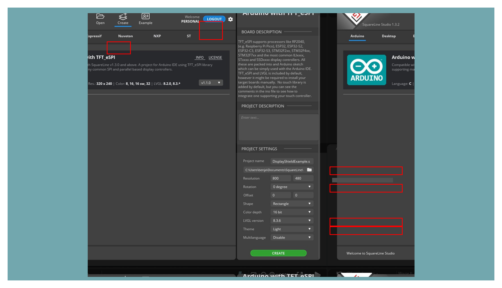
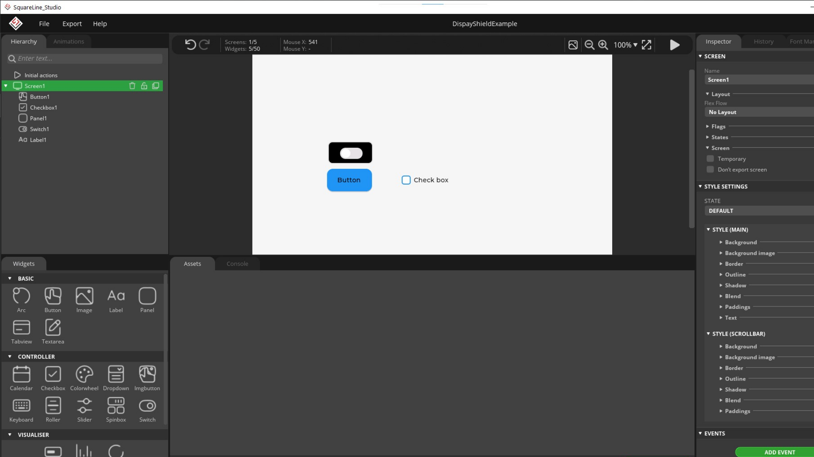
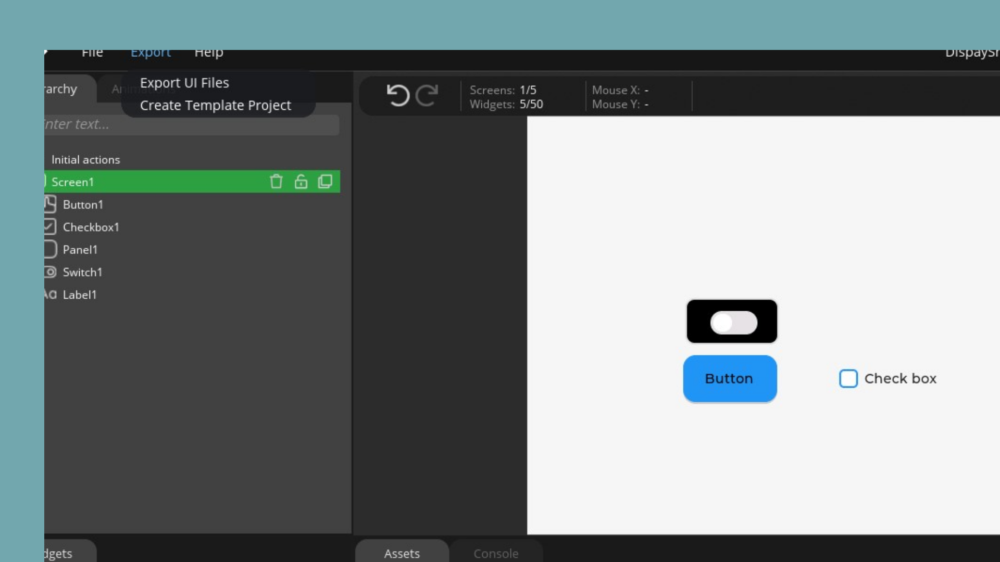
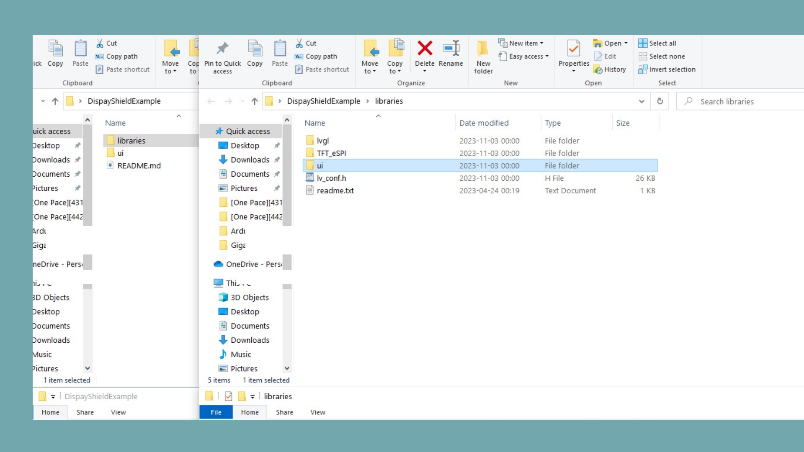

The GIGA Display Shield with the GIGA R1 WiFi board can run LVGL which allows for the creation of GUIs. To make the design of the GUI easier we can use the software SquareLine Studio. This will allow us to drag and drop different elements and then export it for usage on the display shield.

## Hardware & Software Needed

- [Arduino GIGA R1 WiFi](https://store.arduino.cc/products/giga-r1-wifi)
- [Arduino GIGA Display Shield](https://store.arduino.cc/products/giga-display-shield)
- [Arduino IDE](https://www.arduino.cc/en/software)
- [SquareLine Studio](https://squareline.io/)

## Downloading the Library and Core

Make sure the latest GIGA Core is installed in the Arduino IDE. **Tools > Board > Board Manager...**. Here you need to look for the **Arduino Mbed OS Giga Boards** and install it, the [Arduino_H7_Video library](https://github.com/arduino/ArduinoCore-mbed/tree/main/libraries/Arduino_H7_Video) is included in the core. Now you have to install the library needed. Go to **Tools > Manage libraries..**, search for [**LVGL**](https://github.com/lvgl/lvgl) and [**Arduino_GigaDisplayTouch**](https://github.com/arduino-libraries/Arduino_GigaDisplayTouch), install both of these libraries.

## Using SquareLine Studio

First download SquareLine Studio from the link above. Now in SquareLine Studio go to the "create" section and select the Arduino tab. On the right you can set the "project settings". These needs to be set like so:

- **Project name**: Set the name of your project
- **Resolution**: 800x480 (to fully use the 800x480 screen in landscape mode, select 480x800 for portrait)
- **Color depth**: 16 bit
- **LVGL version**: 8.3.x

As show on this image:



Finally click on the "create" button.

### Creating the GUI

Now it is time to create the GUI that will be on the display shield. Feel free to customize your GUI however you want. On the left there are plenty of handy widgets that can be drag and dropped. On the right you can set more specific options for the widgets.



### Exporting a Project From SquareLine Studio

Now that the project is ready it is time to export it. First click on the "Export" tab at the top, then select "Create Template Project" and select the destination for your exported files. When that is done click on the "Export UI Files" and wait for the process to finish.



Now all the files should be in the folder that you specified.

### Running the SquareLine Studio Project on Arduino IDE

In the folder that you exported the files to, go into the "libraries" folder and then copy the "ui" folder.



Place this folder in your **Arduino->Libraries** folder.

Now to run the SquareLine Studio project, use this sketch:

```arduino
#include "Arduino_H7_Video.h"
#include "Arduino_GigaDisplayTouch.h"

#include "lvgl.h"
#include "ui.h"

/* Insert resolution WxH according to your SquareLine studio project settings */
Arduino_H7_Video          Display(800, 480, GigaDisplayShield); 
Arduino_GigaDisplayTouch  Touch;

void setup() {
  Display.begin();
  Touch.begin();

  ui_init();
}

void loop() {

  /* Feed LVGL engine */
  lv_timer_handler();
}
```

## Next Step

If you are curious about how LVGL works with the GIGA Display Shield, take a look at our [LVGL Guide](/tutorials/giga-display-shield/lvgl-guide).

LVGL can also be used in combination with the sensors on the display shield. Have a look at our [Image Orientation tutorial](/tutorials/giga-display-shield/image-orientation).
