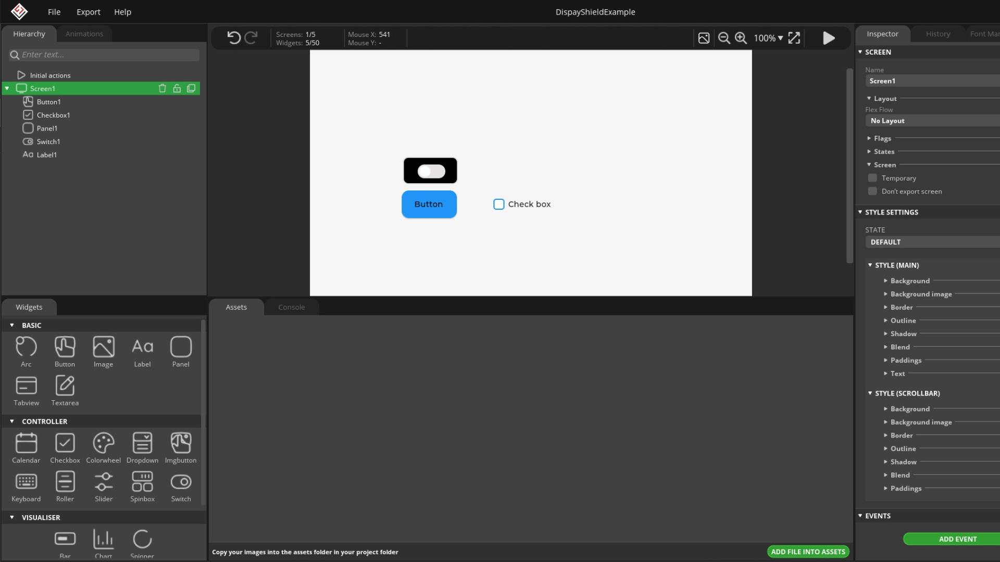
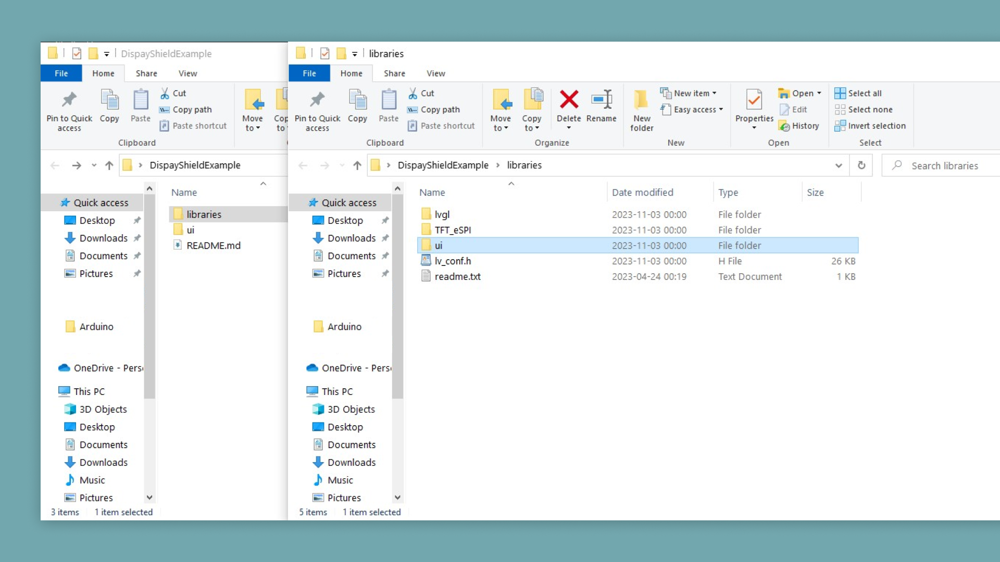
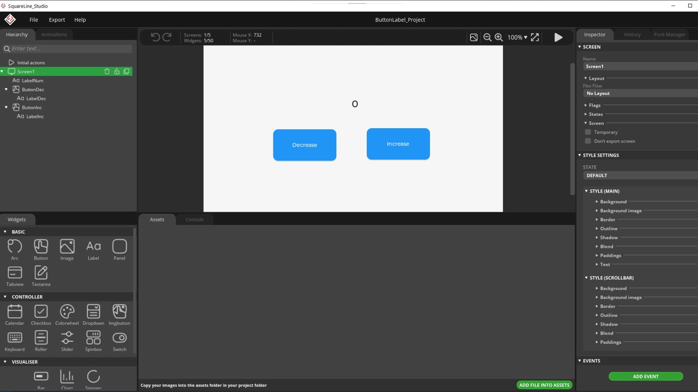
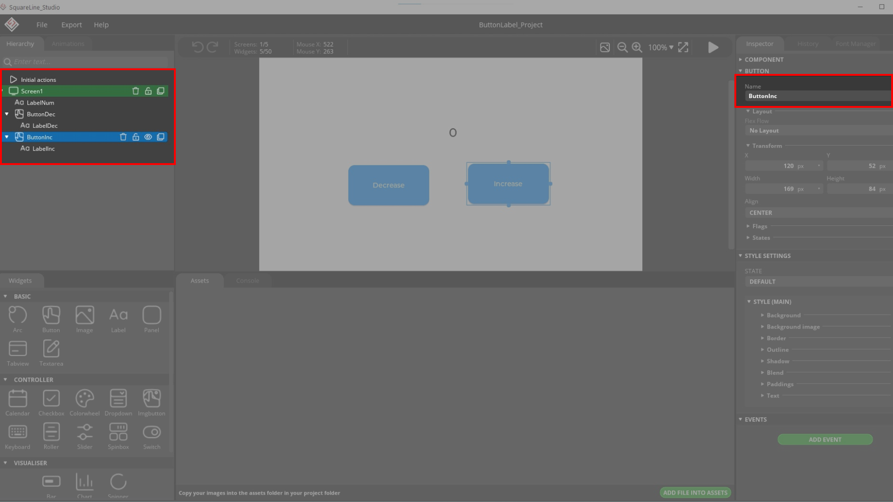
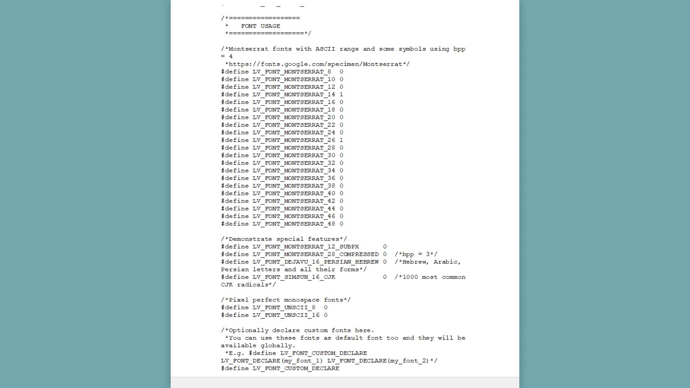
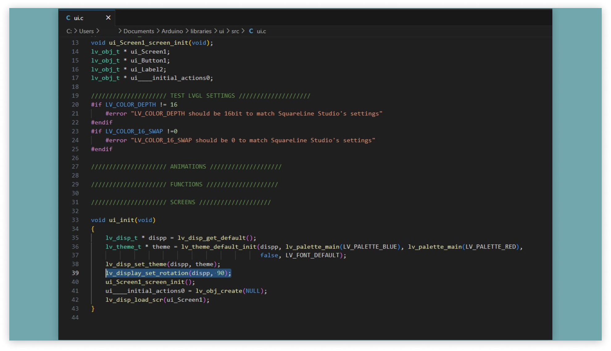

The GIGA Display Shield with the GIGA R1 WiFi board can run LVGL which allows for the creation of advanced GUIs. To make the design of the GUI easier we can use the software SquareLine Studio. This will allow us to drag and drop different elements and then export it for usage on the display shield.

## Hardware & Software Needed

- [Arduino GIGA R1 WiFi](https://store.arduino.cc/products/giga-r1-wifi)
- [Arduino GIGA Display Shield](https://store.arduino.cc/products/giga-display-shield)
- [Arduino IDE](https://www.arduino.cc/en/software)
- [SquareLine Studio](https://squareline.io/)

## Downloading the Library and Board Package

Make sure the latest GIGA Board Package is installed in the Arduino IDE. **Tools > Board > Board Manager...**. Here you need to look for the **Arduino Mbed OS Giga Boards** and install it, the [Arduino_H7_Video library](https://github.com/arduino/ArduinoCore-mbed/tree/main/libraries/Arduino_H7_Video) is included in the Board Package. Now you have to install the library needed. Go to **Tools > Manage libraries..**, search for [**lvgl**](https://github.com/lvgl/lvgl)(SquareLine studio is only compatible with LVGL version 8.3.11 or earlier, please keep the version that you install in mind here) and [**Arduino_GigaDisplayTouch**](https://github.com/arduino-libraries/Arduino_GigaDisplayTouch), install both of these libraries.

## Using SquareLine Studio

First download SquareLine Studio from the link above. Now in SquareLine Studio go to the "create" section and select the Arduino tab. Here you can select the GIGA Display Shield as a preset option so the project will be set up for the board and shield. Keep note of the LVGL version selected here on the right side.


Finally click on the "create" button.

### Creating the GUI

Now it is time to create the GUI that will be on the display shield. Feel free to customize your GUI however you want. On the left there are plenty of handy widgets that can be drag and dropped. On the right you can set more specific options for the widgets.



### Exporting a Project From SquareLine Studio

Now that the project is ready it is time to export it. First click on the "Export" tab at the top, then select "Create Template Project" and select the destination for your exported files. When that is done click on the "Export UI Files" and wait for the process to finish.


Now all the files should be in the folder that you specified.

### Running the SquareLine Studio Project on Arduino IDE

In the folder that you exported the files to, go into the "libraries" folder and then copy the "ui" folder.



Place this folder in your **Libraries** folder found inside your **Arduino** folder. This is the same **Arduino** folder that contains your Arduino IDE sketches.

Now to run the SquareLine Studio project, use this sketch:

```arduino
#include "Arduino_H7_Video.h"
#include "Arduino_GigaDisplayTouch.h"

#include "lvgl.h"
#include "ui.h"

/* Insert resolution WxH according to your SquareLine studio project settings */
Arduino_H7_Video          Display(800, 480, GigaDisplayShield); 
Arduino_GigaDisplayTouch  Touch;

void setup() {
  Display.begin();
  Touch.begin();

  ui_init();
}

void loop() {

  /* Feed LVGL engine */
  lv_timer_handler();
}
```

## Using SquareLine Studio Widgets in Arduino IDE

The project from SquareLine Studio is exported as a library, let's take a look at how we can reference a specific element in the GUI. To demonstrate this we will first create a simple GUI with a increase button, a decrease button and a label. The label will show the number that will decrease or increase depending on what button is pressed. Our GUI will look like this:



Pay attention to the names of the button and the label, which can be seen on the right side and the upper left side here:



Name the widgets accordingly:

- **Increase Button**: ui_ButtonInc
- **Decrease Button**: ui_ButtonDec
- **Number Label**: ui_LabelNum

Also pay attention to the size of the font set for the counter label. We set the size to 26, this then needs to be enabled in the lv_conf.h file. This file can be found in the **mbed_giga/libraries/Arduino_H7_Video/src** folder.


And to enable the font size find the **FONT USAGE** section. If you want to enable any other size simply change the `0` next to any of the font sizes into a `1`:



Now export the project and put the library in the Arduino libraries folder, as shown in the previous section.

First declare the libraries and set up the screen, this will be the same as the sketch above.

```arduino
#include "Arduino_H7_Video.h"
#include "Arduino_GigaDisplayTouch.h"

#include "lvgl.h"
#include "ui.h"

/* Insert resolution WxH according to your SquareLine studio project settings */
Arduino_H7_Video          Display(800, 480, GigaDisplayShield); 
Arduino_GigaDisplayTouch  Touch;
```

Then it is as simple as using the names of the widgets in a LVGL function. For example, when a function like `lv_label_set_text_fmt(NAME_OF_LABEL, "Label");` needs a reference to a label object, we can enter the name of the label that we created in SquareLine Studio. Same goes for the button widgets, like this in the `setup()` function:

```arduino
void setup() {
    Display.begin();
    Touch.begin();

    /* Initialize the user interface designed with SquareLine Studio */
    ui_init();

    /* Add buttons event handlers */
    lv_obj_add_event_cb(ui_ButtonInc, ButtonInc_evt_handler, LV_EVENT_ALL, NULL);
    lv_obj_add_event_cb(ui_ButtonDec, ButtonDec_evt_handler, LV_EVENT_ALL, NULL);

    /* Set initial value of the label to zero */
    label_val = 0;
    lv_label_set_text_fmt(ui_LabelNum, "%d", label_val);
}
```

The last important part of the sketch are the callback functions that will run when a button is pressed. In the segment above you can see how the callback functions are tied to the buttons. The function will check when the button is pressed and increase the count on the label:

```arduino
static void ButtonInc_evt_handler(lv_event_t * e) {
    lv_event_code_t code = lv_event_get_code(e);

    if(code == LV_EVENT_CLICKED) {
        label_val++;
        lv_label_set_text_fmt(ui_LabelNum, "%d", label_val);
    }
}
```

### Full Sketch

```arduino
#include "Arduino_H7_Video.h"
#include "Arduino_GigaDisplayTouch.h"

#include "lvgl.h"
#include "ui.h"

/* Initialize the GIGA Display Shield with a resolution of 800x480 pixels */
Arduino_H7_Video Display(800, 480, GigaDisplayShield);
Arduino_GigaDisplayTouch Touch;

int label_val;

static void ButtonInc_evt_handler(lv_event_t * e) {
    lv_event_code_t code = lv_event_get_code(e);

    if(code == LV_EVENT_CLICKED) {
        label_val++;
        lv_label_set_text_fmt(ui_LabelNum, "%d", label_val);
    }
}

static void ButtonDec_evt_handler(lv_event_t * e) {
    lv_event_code_t code = lv_event_get_code(e);

    if(code == LV_EVENT_CLICKED) {
        label_val--;
        lv_label_set_text_fmt(ui_LabelNum, "%d", label_val);
    }
}

void setup() {
    Display.begin();
    Touch.begin();

    /* Initialize the user interface designed with SquareLine Studio */
    ui_init();

    /* Add buttons event handlers */
    lv_obj_add_event_cb(ui_ButtonInc, ButtonInc_evt_handler, LV_EVENT_ALL, NULL);
    lv_obj_add_event_cb(ui_ButtonDec, ButtonDec_evt_handler, LV_EVENT_ALL, NULL);

    /* Set initial value of the label to zero */
    label_val = 0;
    lv_label_set_text_fmt(ui_LabelNum, "%d", label_val);
}

void loop() {
    /* Feed LVGL engine */
    lv_timer_handler();
}
```

## Rotating the SquareLine UI

If there is a need to rotate the UI created in SquareLine on the GIGA Display Shield, there is a single line that needs to be added to one of the exported library files. In the `/ui/src` folder, find the `ui.c` file and open it.

The code we need to add is:

```arduino
lv_display_set_rotation(dispp, rotation);
```

The `rotation` can be set to `0`, `90`, `180` or `270` depending on how much you want to rotate the UI.



## Next Step

If you are curious about how LVGL works with the GIGA Display Shield, take a look at our [LVGL Guide](/tutorials/giga-display-shield/lvgl-guide).

LVGL can also be used in combination with the sensors on the display shield. Have a look at our [Image Orientation tutorial](/tutorials/giga-display-shield/image-orientation).
