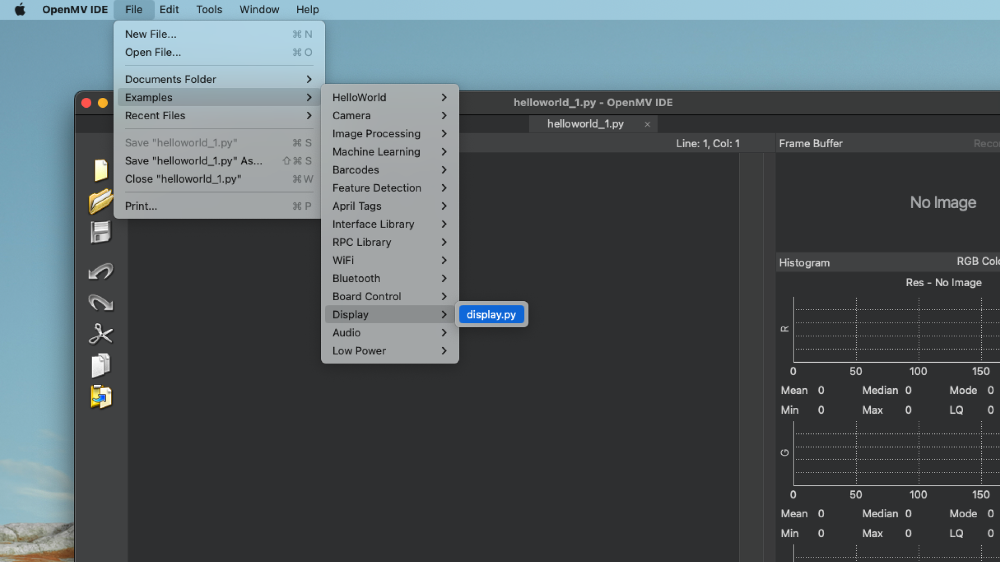

The [GIGA Display Shield](https://store.arduino.cc/products/giga-display-shield) has a camera connector which is extended from the [GIGA R1 WiFi](https://store.arduino.cc/products/giga-r1-wifi) board. The inexpensive 20 pin [OV7675](https://store.arduino.cc/products/arducam-camera-module)camera module can be directly mounted without any other circuitry, and using the OpenMV platform, we can directly display the camera feed on the display, at a framerate of about 15~ FPS.

In this guide, you will learn how to set up your [OV7675](https://store.arduino.cc/products/arducam-camera-module) camera module with the GIGA R1 WiFi / GIGA Display Shield, using the OpenMV platform.

***Note that the OpenMV IDE includes the firmware and the script for this guide. There is no need for any other external tools.***

## Hardware & Software Needed

- [Arduino GIGA R1 WiFi](https://store.arduino.cc/products/giga-r1-wifi)
- [Arduino GIGA Display Shield](https://store.arduino.cc/products/giga-display-shield)
- [OV7675 camera module](https://store.arduino.cc/products/arducam-camera-module)
- [OpenMV](https://openmv.io/pages/download) (`v4.1.1` and above).

## Hardware Setup

1. Mount the GIGA Display Shield on the back side of the GIGA R1 WiFi.
2. Mount the OV7675 camera module to the camera connector just above long side of the display.

## OpenMV Setup

The **OpenMV IDE** includes all tools necessary for flashing your board with the right firmware, as well as the script needed to run the application.

1. Download and install the [OpenMV IDE](https://openmv.io/pages/download).
2. Launch the editor, and connect your board to your computer. In the bottom left corner of the editor, click the button, and the editor should detect your board, and prompt you to install the latest firmware.
   
3. Run the installation, but be aware that this will erase any existing sketch on your board. Wait until it is finished (do not disconnect the board). This can take up to a minute.
4. Once complete, you will need to run a script to see the camera feed. In the OpenMV IDE, navigate to **File > Examples > Display > display.py**.
    
5. Click the "Play" button to launch the script. You should now see the camera feed on the GIGA Display Shield.
    

Congratulations, you have now set up GIGA R1 board to stream camera sensor data to the GIGA Display Shield!

The image below demonstrates how the setup shoud look like when complete.

## Code Example

The full script for this guide can be copied from below:

<CodeBlock url="https://github.com/openmv/openmv/blob/master/scripts/examples/50-Arduino-Boards/Giga-H7/51-Display/display.py" className="arduino"/>