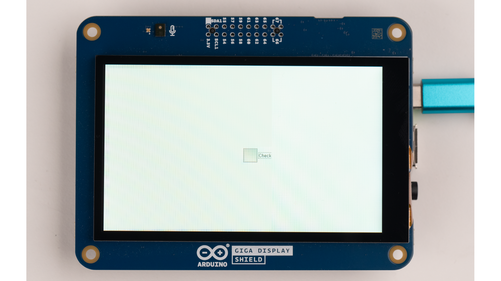

## Introduction

Segger's emWin is a graphical framework for building powerful UIs, and is fully compatible with the GIGA Display Shield. It allows you to build UIs, using pre-made widgets like buttons, images, loading bars, sliders, checkboxes, etc. It also allows you to fully customize the screenspace on the display. In this guide, we will go through some of the different components, so you can learn how to best implement it in your projects.


## Hardware & Software Needed

- [Arduino GIGA R1 WiFi](https://store.arduino.cc/products/giga-r1-wifi)
- [Arduino GIGA Display Shield](https://store.arduino.cc/products/giga-display-shield)
- [Arduino IDE](https://www.arduino.cc/en/software)

## Downloading the Library and Core

The GIGA R1 core includes the [Arduino_H7_Video](https://github.com/arduino/ArduinoCore-mbed/tree/main/libraries/Arduino_H7_Video) library that handles the display.

In this guide, we will be using three different libraries:
- [Arduino_H7_Video](https://github.com/arduino/ArduinoCore-mbed/tree/main/libraries/Arduino_H7_Video), this one is bundled with the core, so make sure you have the latest version of the [Mbed core](https://github.com/arduino/ArduinoCore-mbed) installed.
- [Arduino_GigaDisplayTouch](https://www.arduino.cc/reference/en/libraries/arduino_gigadisplaytouch/), handles touch on the GIGA Display Shield
- [emWin-Arduino-Library](https://github.com/SEGGERMicro/emWin-Arduino-Library)

To install them, open the library manager and install the latest version by searching for **"emWin"** and **"Arduino_GigaDisplayTouch"**.

In the sketch include the emWin library like this:

```arduino
#include "DIALOG.h"
```

There is no need to include the **"Arduino_GigaDisplayTouch"** library separately, as it is already incorporated within the emWin library.

## emWin Library Setup

In this section, we will go through the fundamental elements of an emWin sketch:
- How to define & configure the display,
- how to create a grid layout,
- how to add an object to the grid,
- how to update the display.

### emWin Screen Configuration

When creating elements, information about the screen and placement needs to be provided. The provided code initializes the emWin library, configuring display and touch controller settings. It sets the display to landscape mode, enables multi-buffering for the Windows manager, and creates a main window for content rendering.

**Full Example:**

```arduino
void setup() {
  delay(3000);
  /* Init SEGGER emWin library. It also init display and touch controller */
  GUI_Init();

  LCD_ROTATE_SetSel(1); /* Set landscape mode */
  WM_MULTIBUF_Enable(1); /* Enable multi buffering mode for Windows manager */

  /* Create the main window. It will include all the sub-windows */
  WM_CreateWindowAsChild(0, 0, LCD_GetXSize(), LCD_GetYSize(), WM_HBKWIN, WM_CF_SHOW, _cbWin, 0);
}
```

### Window Manager

The examples in this tutorial will be using the window manager method. This makes it easier to manage the screen elements and widgets. However, it is also possible to create emWin sketches without the window manager, which will be shown in this section.

Here is an example that sets the screen background color to green and prints the text "Hello world" in red on the screen. Lets first take a look at how this would look without the window manager:

```arduino
#include <DIALOG.h>

void setup() {
  delay(3000);
  GUI_Init();
  GUI_MULTIBUF_Begin();
  GUI_SetBkColor(GUI_GREEN);
  GUI_Clear();
  GUI_SetColor(GUI_RED);
  GUI_DispString("Hello world");
  GUI_MULTIBUF_End();
}

void loop() {
  GUI_Exec();
}
```

And to get the same result with a window manager, it would look like this:

```arduino
#include "DIALOG.h"

static void _cbWin(WM_MESSAGE * pMsg) {
  switch (pMsg->MsgId) {
  case WM_PAINT:
    GUI_SetBkColor(GUI_GREEN);
    GUI_Clear();
    GUI_SetColor(GUI_RED);
    GUI_DispString("Hello world");
    break;
  default:
    WM_DefaultProc(pMsg);
    break;
  }
}

void setup() {
  GUI_Init();
  WM_MULTIBUF_Enable(1);
  WM_CreateWindowAsChild(0, 0, LCD_GetXSize(), LCD_GetYSize(), WM_HBKWIN, WM_CF_SHOW, _cbWin, 0);
}

void loop() {
  GUI_Exec();
}
```

Using the window manager method is more complex and require more lines of code, but this method helps with keeping your GUI structured as it gets more elements and widgets to display. For example with the window manager it is impossible to overwrite areas outside a windows designated area. For simpler applications, the window manager may not be needed. Keep this in mind when developing your own emWin solutions! For more information, navigate over to the [emWin on Arduino documentation](https://wiki.segger.com/emWin_on_Arduino#:~:text=Without%20the%20Window%20Manager%3A).


### Creating a Grid Layout

To create different windows inside our display, use the `WM_CreateWindowAsChild()` function. Here is the function with the parameters that should be given:

```arduino
WM_CreateWindowAsChild(X-position, Y-position, Height, Width, ParentWindow, VisibilityFlag, WindowsCallback, AdditionalBytes);
```


This is how it would look to use emWin to create a 2x2 grid layout inside the main window:

**Full Example:**
```arduino
static void _cbWin(WM_MESSAGE * pMsg) {
  switch (pMsg->MsgId) {
    case WM_CREATE:
      /* [0, 0] - Image */
      WM_CreateWindowAsChild(20, 20, 370, 210, pMsg->hWin, WM_CF_SHOW, _cbChildWinImg, 0);

      /* [1, 0] - Slider */
      WM_CreateWindowAsChild(20, 210+20*2, 370, 210, pMsg->hWin, WM_CF_SHOW, _cbChildWinSlider, 0);

      /* [0, 1] - Checkbox, button and labels */
      WM_CreateWindowAsChild(370+20*2, 20, 370, 210, pMsg->hWin, WM_CF_SHOW, _cbChildWinChkBtn, 0);

      /* [1, 1] - Progress bar */
      WM_CreateWindowAsChild(370+20*2, 210+20*2, 370, 210, pMsg->hWin, WM_CF_SHOW, _cbChildWinPgrBar, 0);
      break;
    case WM_PAINT:
      GUI_SetBkColor(0x03989e); /* Background color set to: R(0x03),G(0x98),B(0x9E) */
      GUI_Clear();
      break;
    default:
      WM_DefaultProc(pMsg);
      break;
  }
}
```

### Update Loop

In the loop of any emWin sketch, the bare minimum that needs to be called is `GUI_Exec()`. This will keep the engine alive, handle touch events for the rest of the sketch among other things.

```arduino
void loop(){
  GUI_Exec();
}
```

## Visual Elements

### Image

To be able to display an image it first needs to be defined. **bmarduinologo** is the filename of the image. The image file needs to be in the same folder as the sketch. The image needs to be referenced like this:

```arduino
extern GUI_CONST_STORAGE GUI_BITMAP bmarduinologo; /* Image bitmap structure (see img_arduinologo_emwin.c in attach) */
```

To convert images into the emWin format, you can use the [emWin Bitmap Converter](https://www.segger.com/products/user-interface/emwin/tools/tools-overview/#:~:text=Download%20AppWizard%20Trial-,Bitmap%20Converter,-The%20Bitmap%20Converter) tool.

Now the image can be drawn by specifying the image file along with the x and y position. Like this:

```arduino
GUI_DrawBitmap(&bmarduinologo, X-position, Y-position);
```


**Full Example:**

**Remember that the image file needs to be in the same folder as the sketch, use the image that comes with the full demo (File > Examples > Arduino_H7_Video > emWinDemo).**

```arduino
#include "DIALOG.h"

extern GUI_CONST_STORAGE GUI_BITMAP bmarduinologo; /* Image bitmap structure (see img_arduinologo_emwin.c in attach) */

static void _cbWin(WM_MESSAGE * pMsg) {
  switch (pMsg->MsgId) {
    case WM_CREATE:
      break;
    case WM_PAINT:
      GUI_SetBkColor(GUI_WHITE);
      GUI_Clear();
      /* Draw image */
      GUI_DrawBitmap(&bmarduinologo, 85, 35);
      break;
    default:
      WM_DefaultProc(pMsg);
      break;
  }
}

void setup() {
  /* Init SEGGER emWin library. It also init display and touch controller */
  GUI_Init();

  LCD_ROTATE_SetSel(1); /* Set landscape mode */
  WM_MULTIBUF_Enable(1); /* Enable multi buffering mode for Windows manager */

  /* Create the main window.*/
  WM_CreateWindowAsChild(0, 0, LCD_GetXSize(), LCD_GetYSize(), WM_HBKWIN, WM_CF_SHOW, _cbWin, 0);
}

void loop() {
  /* Keep emWin alive, handle touch and other stuff */
  GUI_Exec();
}
```

### Text

Most widgets have label functions attached to them. However if you want to print something independent of a widget you can use the `GUI_DispString("")` function. This will display any text put in as a parameter.

Calling `GUI_SetColor()` before the text print will allow you to change the color of the text that is then printed. [Here](https://wiki.segger.com/CHOOSECOLOR_(Sample)) you can find the colors available.

For changing the font size, use `GUI_SetFont(&GUI_Font16_1);`, this call will set the font size to 16.

**Full Example:**

```arduino
#include "DIALOG.h"

static void _cbWin(WM_MESSAGE * pMsg) {
  switch (pMsg->MsgId) {
  case WM_PAINT:
    GUI_SetBkColor(GUI_GREEN);
    GUI_Clear();
    GUI_SetColor(GUI_RED);
    GUI_SetFont(&GUI_Font16_1);
    GUI_DispString("Hello world");
    break;
  default:
    WM_DefaultProc(pMsg);
    break;
  }
}

void setup() {
  delay(3000);
  GUI_Init();
  WM_MULTIBUF_Enable(1);
  WM_CreateWindowAsChild(0, 0, LCD_GetXSize(), LCD_GetYSize(), WM_HBKWIN, WM_CF_SHOW, _cbWin, 0);
}

void loop() {
  GUI_Exec();
}
```

## Functional Elements

### Checkbox

Like with other widgets this line creates the checkbox widget:

```arduino
  hBox = CHECKBOX_CreateEx(X-position, Y-position, Height, Width, pMsg->hWin, WM_CF_SHOW, 0, GUI_ID_CHECK0);
```

If we want a label next to the checkbox, use `CHECKBOX_SetText(hBox, "Check");`. Where you specify the checkbox the text belongs to and what the text should say. The font and color can then be set for the text with the following lines of code:

```arduino
  CHECKBOX_SetText(hBox, "Check");
  CHECKBOX_SetTextColor(hBox, GUI_BLACK);
  CHECKBOX_SetFont(hBox, &GUI_Font16_1);
```

Then for the state of the checkbox the number of states and where it should start will be determined by these lines:

```arduino
  CHECKBOX_SetNumStates(hBox, 3);
  CHECKBOX_SetState(hBox, 1);
```




**Full Example:**

```arduino
#include "DIALOG.h"

static void _cbChildWinCheck(WM_MESSAGE * pMsg) {
  static WM_HWIN  hBox;
  BUTTON_Handle   hButton;
  int             NCode, Id;
  char            acBuffer[32];
  int             State;
  static int      Clicked, Released;

  switch(pMsg->MsgId) {
    case WM_CREATE:
      /* Create CHECKBOX widget */
      hBox = CHECKBOX_CreateEx((LCD_GetXSize()/2), (LCD_GetYSize()/2), 80, 40, pMsg->hWin, WM_CF_SHOW, 0, GUI_ID_CHECK0);
      /* Edit widget properties */
      CHECKBOX_SetText(hBox, "Check");
      CHECKBOX_SetTextColor(hBox, GUI_BLACK);
      CHECKBOX_SetFont(hBox, &GUI_Font16_1);
      /* Set number of possible states to 3 (if needed). The minimum number of states is 2 and the maximum is 3 */
      CHECKBOX_SetNumStates(hBox, 3);
      /* Manually set the state */
      CHECKBOX_SetState(hBox, 1);
      break;
    case WM_PAINT:
      GUI_SetBkColor(GUI_WHITE);
      GUI_Clear();

      /* Display current CHECKBOX state */
      State = CHECKBOX_GetState(hBox);
      sprintf(acBuffer, "State of checkbox: %d", State);
      GUI_DispStringAt(acBuffer, 10, 60);
      break;

    case WM_NOTIFY_PARENT:
    /* Get Id of sender window and notification code */
      Id    = WM_GetId(pMsg->hWinSrc);
      NCode = pMsg->Data.v;

      switch (Id) {
        case GUI_ID_CHECK0:
          switch(NCode) {
            case WM_NOTIFICATION_VALUE_CHANGED:
              /* When the value of the checkbox changed, redraw parent window to update the display of the state */
              WM_InvalidateWindow(pMsg->hWin);
              break;
          }
          break;
      }
      break;
  default:
    WM_DefaultProc(pMsg);
  }
}

void setup() {
  delay(3000);
  /* Init SEGGER emWin library. It also init display and touch controller */
  GUI_Init();

  LCD_ROTATE_SetSel(1); /* Set landscape mode */
  WM_MULTIBUF_Enable(1); /* Enable multi buffering mode for Windows manager */

  /* Create the main window. It will include all the sub-windows */
  WM_CreateWindowAsChild(0, 0, LCD_GetXSize(), LCD_GetYSize(), WM_HBKWIN, WM_CF_SHOW, _cbChildWinCheck, 0);
}

void loop() {
  /* Keep emWin alive, handle touch and other stuff */
  GUI_Exec();
}
```

### Slider

Like the other widgets this line of code creates it:

```arduino
  hSlider = SLIDER_CreateEx(X-position, Y-position, Height, Width, pMsg->hWin, WM_CF_SHOW, SLIDER_CF_HORIZONTAL, GUI_ID_SLIDER0);
```

The specifications of the slider, such as range, number of ticks marks, value and width of the marker are set by the following lines:

```arduino
  SLIDER_SetRange(hSlider, 0, 100);
  SLIDER_SetNumTicks(hSlider, 10);
  SLIDER_SetValue(hSlider, 20);
  SLIDER_SetWidth(hSlider, 20);
```

If you want to display the sliders value adjacent to the slider, use the following lines:

```arduino
  Value = SLIDER_GetValue(hSlider);
  sprintf(acBuffer, "Value: %d", Value);
  GUI_DispStringAt(acBuffer, 110, 120);
```

`sprintf()` will print the value as text and `GUI_DispStringAt()` will decide where the text is printed.

The GUI will also have to be re-drawn when the value changes so the display stays accurate. This can be achieved with:

```arduino
  case WM_NOTIFICATION_VALUE_CHANGED:
    WM_InvalidateWindow(pMsg->hWin);
    break;
    }
    break;
```


**Full Example:**

```arduino
#include "DIALOG.h"

static void _cbChildWinSlider(WM_MESSAGE * pMsg) {
  static WM_HWIN hSlider;
  int            NCode, Id;
  int            Value;
  char           acBuffer[32];

  switch(pMsg->MsgId) {
    case WM_CREATE:
      /* Create horizonzal slider */
      hSlider = SLIDER_CreateEx(300, 180, 200, 50, pMsg->hWin, WM_CF_SHOW, SLIDER_CF_HORIZONTAL, GUI_ID_SLIDER0);
      /* Set range of slider */
      SLIDER_SetRange(hSlider, 0, 100);
      /* Set number of tick marks */
      SLIDER_SetNumTicks(hSlider, 10);
      /* Set value of slider */
      SLIDER_SetValue(hSlider, 20);
      /* Set width of thumb */
      SLIDER_SetWidth(hSlider, 20);
      break;
    case WM_PAINT:
      GUI_SetBkColor(GUI_WHITE);
      GUI_Clear();
      GUI_SetFont(&GUI_Font16B_1);
      GUI_SetColor(GUI_BLACK);

      /* Display slider value */
      Value = SLIDER_GetValue(hSlider);
      sprintf(acBuffer, "Value: %d", Value);
      GUI_DispStringAt(acBuffer, 300, 240);
      break;
    case WM_NOTIFY_PARENT:
      Id    = WM_GetId(pMsg->hWinSrc);
      NCode = pMsg->Data.v;

      switch(Id) {
        case GUI_ID_SLIDER0:
          switch(NCode) {
            case WM_NOTIFICATION_VALUE_CHANGED:
              /* Redraw the window when a value has changed so the displayed value will be updated */
              WM_InvalidateWindow(pMsg->hWin);
              break;
          }
          break;
      }
      break;
    default:
      WM_DefaultProc(pMsg);
  }
}

void setup() {
  delay(3000);
  /* Init SEGGER emWin library. It also init display and touch controller */
  GUI_Init();

  LCD_ROTATE_SetSel(1); /* Set landscape mode */
  WM_MULTIBUF_Enable(1); /* Enable multi buffering mode for Windows manager */

  /* Create the main window. It will include all the sub-windows */
  WM_CreateWindowAsChild(0, 0, LCD_GetXSize(), LCD_GetYSize(), WM_HBKWIN, WM_CF_SHOW, _cbChildWinSlider, 0);
}

void loop() {
  /* Keep emWin alive, handle touch and other stuff */
  GUI_Exec();
}
```

### Progress Bar

Creating the progress bar is similar to the other widgets:

```arduino
PROGBAR_Handle hProg;
hProg = PROGBAR_CreateEx(X-position, Y-position, Height, Width, pMsg->hWin, WM_CF_SHOW, PROGBAR_CF_HORIZONTAL, GUI_ID_PROGBAR0);
```

The progress bar needs a callback function that will handle the calculation and animation of the progress that is being displayed. The progress bar and callback function that should be linked are defined in the `WM_SetCallback()` function, like so:

```arduino
WM_SetCallback(hProg, _cbProgbar);
```

To display the progress on the progress bar, a rectangle will have to be drawn inside of the existing progress bar, like this:

```arduino
  WM_GetClientRect(&Rect);
  GUI_SetColor(GUI_BLACK);
  GUI_AA_DrawRoundedRectEx(&Rect, 3);
```

The progress bars value, or the progress of it can be calculated and displayed with these lines:

```arduino
  Value = PROGBAR_GetValue(pMsg->hWin);
  ValueF = Value / 100.0F;
  sprintf(acBuffer, "Progress: %d%%", Value);
```

In the `void loop()` of the sketch the calculation of time for the animation needs to be defined. Here the reset of the progress bar will also be set. Using `PROGBAR_SetValue(progressbar, progressbarcount)` the value of the progress bar can be set from the `loop()`. Then it can be redrawn to show how it updates.

```arduino
  if (millis() - previousMillis >= 100) {
    previousMillis = millis();
    progbarCnt++;
    if (progbarCnt > 100) {
      progbarCnt = 0;
    }
    PROGBAR_SetValue(hProg, progbarCnt);
    WM_InvalidateWindow(hProg); /* Make sure the entire PROGBAR gets redrawn */
  }
```

<video width="100%" loop autoplay>
<source src="assets/emwin_progbar.mp4" type="video/mp4" />
</video>

<br />

**Full Example:**

```arduino
#include "DIALOG.h"

PROGBAR_Handle hProg;

static void _cbChildWinPgrBar(WM_MESSAGE * pMsg) {
  GUI_RECT Rect;
  float    ValueF;
  int      Value;
  char     acBuffer[16];

  switch (pMsg->MsgId) {
    case WM_CREATE:
      hProg = PROGBAR_CreateEx(250, 150, 200, 30, pMsg->hWin, WM_CF_SHOW, PROGBAR_CF_HORIZONTAL, GUI_ID_PROGBAR0);
      WM_SetCallback(hProg, _cbProgbar);
      break;
    case WM_PAINT:
      GUI_SetBkColor(GUI_WHITE);
      GUI_Clear();
      break;
    default:
      WM_DefaultProc(pMsg);
      break;
  }
}

static void _cbProgbar(WM_MESSAGE * pMsg) {
  GUI_RECT Rect;
  float    ValueF;
  int      Value;
  char     acBuffer[16];

  switch (pMsg->MsgId) {
    case WM_PAINT:
      GUI_SetBkColor(GUI_WHITE);
      GUI_Clear();
      /* Draw progress bar */
      WM_GetClientRect(&Rect);
      GUI_SetColor(GUI_BLACK);
      GUI_AA_DrawRoundedRectEx(&Rect, 3);
      Value = PROGBAR_GetValue(pMsg->hWin);
      ValueF = Value / 100.0F;
      sprintf(acBuffer, "Progress: %d%%", Value);
      Rect.x0 += 2;
      Rect.y0 += 2;
      Rect.x1 -= 2;
      Rect.y1 -= 2;
      Rect.x1 = Rect.x1 * (ValueF);
      GUI_SetColor(GUI_GRAY_9A);
      GUI_AA_FillRoundedRectEx(&Rect, 1);
      WM_GetClientRect(&Rect);
      Rect.x0 += 2;
      Rect.y0 += 2;
      Rect.x1 -= 2;
      Rect.y1 -= 2;
      GUI_SetColor(GUI_BLACK);
      GUI_SetTextMode(GUI_TM_TRANS);
      GUI_SetFont(&GUI_Font16B_1);
      GUI_DispStringInRect(acBuffer, &Rect, GUI_TA_HCENTER | GUI_TA_VCENTER);
      break;
    default:
      PROGBAR_Callback(pMsg);
      break;
   }
}

int progbarCnt = 0;
unsigned long previousMillis = 0;

void setup() {
  delay(3000);
  /* Init SEGGER emWin library. It also init display and touch controller */
  GUI_Init();

  LCD_ROTATE_SetSel(1); /* Set landscape mode */
  WM_MULTIBUF_Enable(1); /* Enable multi buffering mode for Windows manager */

  /* Create the main window. It will include all the sub-windows */
  WM_CreateWindowAsChild(0, 0, LCD_GetXSize(), LCD_GetYSize(), WM_HBKWIN, WM_CF_SHOW, _cbChildWinPgrBar, 0);
}

void loop() {
  /* Update progress bar value */
  if (millis() - previousMillis >= 100) {
    previousMillis = millis();
    progbarCnt++;
    if (progbarCnt > 100) {
      progbarCnt = 0;
    }
    PROGBAR_SetValue(hProg, progbarCnt);
    WM_InvalidateWindow(hProg); /* Make sure the entire PROGBAR gets redrawn */
  }

  /* Keep emWin alive, handle touch and other stuff */
  GUI_Exec();
}
```

### Button

Like the other widgets, this one is created with:

```arduino
hButton = BUTTON_CreateEx(10, 100, 80, 20, pMsg->hWin, WM_CF_SHOW, 0, ID_BUTTON);
```

And to set the text on the button, use:

```arduino
BUTTON_SetText(hButton, "Click me");
```

To check for the button being pressed, you can use two integers, `Clicked` and `Released`. Then simply put these inside the `if()` statements to make them trigger whenever the button is pressed or released.

```arduino
static int      Clicked, Released;

if(Clicked) {
  sprintf(acBuffer, "Button was clicked at: %d.", Clicked);
  GUI_DispStringAt(acBuffer, 10, 130);
}
if(Released) {
  sprintf(acBuffer, "Button was released at: %d.", Released);
  GUI_DispStringAt(acBuffer, 10, 150);
}
```


**Full Example:**

```arduino
#include "DIALOG.h"

#define ID_BUTTON  1

static void _cbChildWinBtn(WM_MESSAGE * pMsg) {
  static WM_HWIN  hBox;
  BUTTON_Handle   hButton;
  int             NCode, Id;
  char            acBuffer[32];
  int             State;
  static int      Clicked, Released;

  switch(pMsg->MsgId) {
    case WM_CREATE:
      /* Create a button */
      hButton = BUTTON_CreateEx(300, 150, 120, 80, pMsg->hWin, WM_CF_SHOW, 0, ID_BUTTON);
      BUTTON_SetText(hButton, "Click me");
      break;
    case WM_PAINT:
      GUI_SetBkColor(GUI_WHITE);
      GUI_Clear();
      GUI_SetFont(&GUI_Font16_1);
      GUI_SetColor(GUI_BLACK);

      /* Check button state and print info on labels */
      if(Clicked) {
        sprintf(acBuffer, "Button was clicked at: %d.", Clicked);
        GUI_DispStringAt(acBuffer, 300, 240);
      }
      if(Released) {
        sprintf(acBuffer, "Button was released at: %d.", Released);
        GUI_DispStringAt(acBuffer, 300, 260);
      }
      break;
    case WM_NOTIFY_PARENT:
    /* Get Id of sender window and notification code */
      Id    = WM_GetId(pMsg->hWinSrc);
      NCode = pMsg->Data.v;

      switch (Id) {
        case ID_BUTTON:
          switch(NCode) {
            case WM_NOTIFICATION_CLICKED:
              Clicked = GUI_GetTime();
              WM_InvalidateWindow(pMsg->hWin);
              break;
            case WM_NOTIFICATION_RELEASED:
              Released = GUI_GetTime();
              WM_InvalidateWindow(pMsg->hWin);
              break;
          }
          break;
      break;
    }
    break;
  default:
    WM_DefaultProc(pMsg);
  }
}

void setup() {
  delay(3000);
  /* Init SEGGER emWin library. It also init display and touch controller */
  GUI_Init();

  LCD_ROTATE_SetSel(1); /* Set landscape mode */
  WM_MULTIBUF_Enable(1); /* Enable multi buffering mode for Windows manager */

  /* Create the main window. It will include all the sub-windows */
  WM_CreateWindowAsChild(0, 0, LCD_GetXSize(), LCD_GetYSize(), WM_HBKWIN, WM_CF_SHOW, _cbChildWinBtn, 0);
}

void loop() {
 /* Keep emWin alive, handle touch and other stuff */
  GUI_Exec();
}
```

## Conclusion

This guide went through the building blocks of the different components that can be implemented with emWin. To see these examples in a full running example sketch go to **File > Examples > Arduino_H7_Video > emWinDemo**.


This demo sketch will show the different components using a screen manager in a 2x2 grid.

## Next Step
emWin is a comprehensive library and GUI framework that has a lot of customizability, if you are interested in playing around more with it, you can find many different examples and widgets on the official website for [Segger® emWin](https://wiki.segger.com/Main_Page). The code on the website can easily be adapted into a sketch for the GIGA Display Shield.
