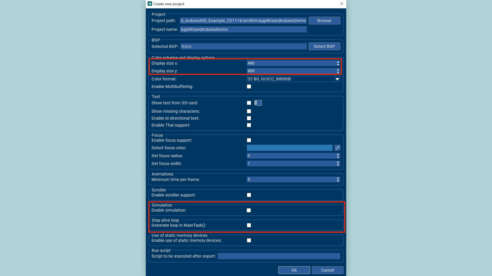
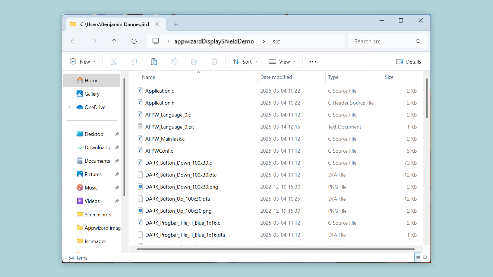
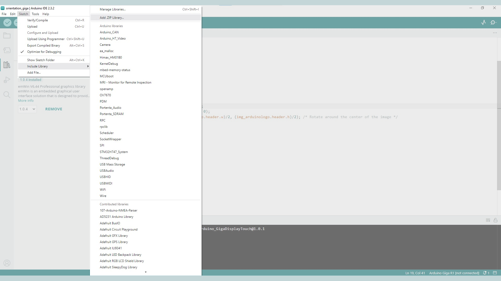

## Introduction

Segger AppWizard is a graphical framework for building powerful UIs, and is fully compatible with the GIGA Display Shield. It allows you to build UIs, using pre-made widgets like buttons, images, loading bars, sliders, checkboxes, etc. It also allows you to fully customize the screenspace on the display. In this guide, we will go through some of the different components and interactions, so you can learn how to best use AppWizard for your own projects.

Specifically, we will show you how to create a screen with AppWizard that includes some of the most common elements: a button, a text label, a progress bar, and a slider. We will also demonstrate how to export the code from AppWizard and create an Arduino library that implements the designed screen.

## Hardware & Software Needed

- [Arduino GIGA R1 WiFi](https://store.arduino.cc/products/giga-r1-wifi)
- [Arduino GIGA Display Shield](https://store.arduino.cc/products/giga-display-shield)
- [Arduino IDE](https://www.arduino.cc/en/software)
- [AppWizard](https://www.segger.com/products/user-interface/emwin/tools/appwizard/)
- [emWin Arduino Library](https://github.com/SEGGERMicro/emWin-Arduino-Library/)

## Downloading the Library and Core

The GIGA R1 core includes the [Arduino_H7_Video](https://github.com/arduino/ArduinoCore-mbed/tree/main/libraries/Arduino_H7_Video) library that handles the display.

In this guide, we will be using three different libraries:
- [Arduino_H7_Video](https://github.com/arduino/ArduinoCore-mbed/tree/main/libraries/Arduino_H7_Video), this one is bundled with the core, so make sure you have the latest version of the [Mbed core](https://github.com/arduino/ArduinoCore-mbed) installed.
- [Arduino_GigaDisplayTouch](https://www.arduino.cc/reference/en/libraries/arduino_gigadisplaytouch/), handles touch on the GIGA Display Shield
- [emWin Arduino Library](https://github.com/SEGGERMicro/emWin-Arduino-Library/)

To install this, open the library manager and install the latest version by searching for **"Arduino_GigaDisplayTouch"**.

## Creating an App Wizard Project

First go to  **File -> New Project** to start your new project. Here we need to configure certain settings so it will work on the GIGA Display Shield. Set the  display size x to **480** and display size y to **800**. Then we need to disable the **Enable simulation** and **Generate loop in MainTask()** options. It should look like the image below.



## Setting Up The Project
First add a **screen** element to your project, this will be the base that contains all the other elements of the project. To add a background color add the **Box** object and set the color on the right side properties menu.


### Button

Add a button from the object menu. On the right hand properties menu you can set the color of the button when it is unpressed and pressed.


In the right hand properties menu you can also add text to the button. Press the **set text** option. This will bring up a window that contains all the text elements in the project. Press **add text**, this will create a new text object with a unique id. Now to set the text that will be displayed press **New language** and enter **En**, we will be using English in this tutorial. Under the new **En** tab you can set the text that will be visible, change the **-** to **Button** and this text will be displayed on the button.


## Adding Interactions

### Textbox

Let's add a textbox which will display a value that will increase when the button is pressed.

First add a textbox by clicking the **Text** box in the "Add objects" section. Then feel free to set the text color and background color to your desired color in the properties menu. Here the textbox needs to be set to decimal mode, do that by clicking the "Set decimal mode" button and then putting a "0" in the mask box.


Next a variable is needed to keep track of the value. In the bottom left "Resources" section press the **Open variables window** button. This will open a window where variables can be managed. Press **Add variable** and then rename the variable to something relevant so it is easier to keep track of later, here we will name it "ID_BUTTON_VAR".


Now we need to add interactions for the button and text. Press the **+** button in the interactions box to add an interaction. Set the variable as the "Emitter", the signal should be "VALUE_CHANGED", job should be "SETVALUE" and the receiver should be the text box which here is "ID_TEXT_00". Now the text will be set to the same value as the variable.

To add the buttons interaction, set the emitter as the button, the signal should be "RELEASED", so that the value increases when the button is released. The job should be "ADDVALUE" and the receiver should be the variable, so the value gets added to the variable. In the window that pops up the increment of the value added to the variable, here we set it to "1". You can try out the interaction by pressing the **Start play mode** in the upper right corner of the "Editor" window.


### Progress Bar

Now lets try adding a progress bar to the previous interaction. Start by pressing the **progbar** button and set the initial value to "0". Set the min value to "0" and max value to "100". Now add an interaction with the emitter as the button variable, the signal to "VALUE_CHANGED", job as "SETVALUE" and the receiver as the progress bar. Now try it out in play mode and you will see the progress bar increase whenever the button is pressed.


### Slider And Gauge

Now let's try adding a slider and gauge to the project. Press the **Gauge** button in the top left menu. Set initial value to "0", the min value to "0" and max value to "100".


Next create a slider by pressing the **Slider** button on the top left menu. You can configure the visual elements of the slider in the right "Properties" menu.


Now there needs to be a variable that will keep track of the value, press the **Open variables window** button in the bottom left.

Press **Add variable** and then rename the variable to something relevant so it is easier to keep track of later, here we will name it "ID_SLIDER_VAR".


Now to add the interaction that will fill the gauge when the slider is moved. First, create a new interaction, set the emitter as the slider variable, the signal should be "VALUE_CHANGED". The job should be "SETVALUE" and the receiver should be the gauge. Now create the interaction that makes the slider change the variable. Create a new interaction and set the emitter as the slider, the signal should be "VALUE_CHANGED". The job should be "SETVALUE" and the receiver should be the slider variable.


## Exporting the Project

In AppWizard, go to **File -> Export & Save** in the upper left of the window. Now open the folder of the project. Create a new folder which we will put the exported files into, in this new folder create another folder named **src**. Now from the exported project folder, copy all the files contained in the **Resource** and **Source** subfolders (without copying the subfolders themselves) into the newly created **src** folder. Take all the files out of the folders before putting them in the **src** folder, if you have any folders inside of the **src** folder it will not import into the Arduino IDE later.



Now the folder name needs to be removed from the `#include` directives of the generated files. Inside the **ID_SCREEN_00_Slots.c** file change the `#include "../Generated/Resource.h"`
and `#include "../Generated/ID_SCREEN_00.h"` to `#include "Resource.h"` and `#include "ID_SCREEN_00.h"`.


When this is done create a **library.properties** file inside the root of the newly created folder. Then put this text into the file:

```arduino
name=AppWizardDemoLib
version=1.0.0
author=SEGGER Microcontroller GmbH
maintainer=SEGGER Microcontroller GmbH info@segger.com
sentence=
paragraph=
category=Display
url=
architectures=
includes=
depends=
```


And lastly to create the Arduino sketch. Create an **examples** folder inside the root of the newly created folder, inside this **examples** folder you can create another folder containing the **demo.ino** file. Use the following code for the **demo.ino**:

```arduino
#include <Resource.h>
void setup() {
  MainTask();                 
}
void loop() {
  GUI_Exec();
}
```


Now all that is left is to import this whole folder as a library into the Arduino IDE. First compress the folder into a .zip format. And then in the Arduino IDE go to **Sketch -> Include library -> Add .ZIP Library**. Then select the created .zip file and add it.



Now the demo sketch should be accessible under the examples tab inside the library. The library will have the name given inside the **library.properties** file.


Now select your board and upload the sketch. The GUI created in AppWizard should now display on the GIGA Display Shield!

### Conclusion

Now you have an idea of how to use the basic features of AppWizard! With interactions and visual elements the possibilities of design solutions are endless. This tutorial also showed how easy it is to import your design to your Arduino board using the Arduino IDE. You are now ready to create your own design and play around with AppWizard! 