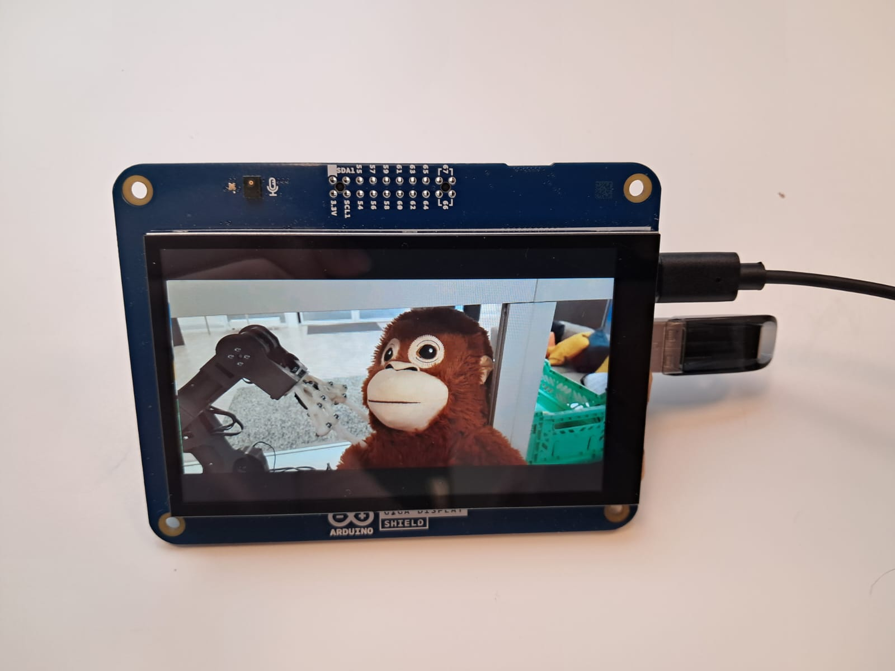
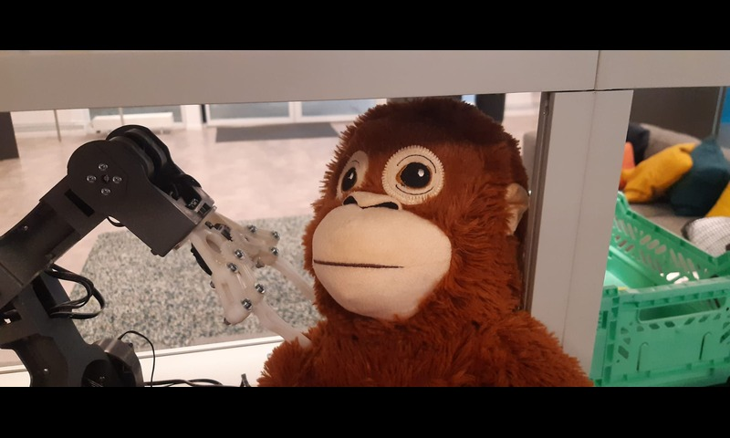
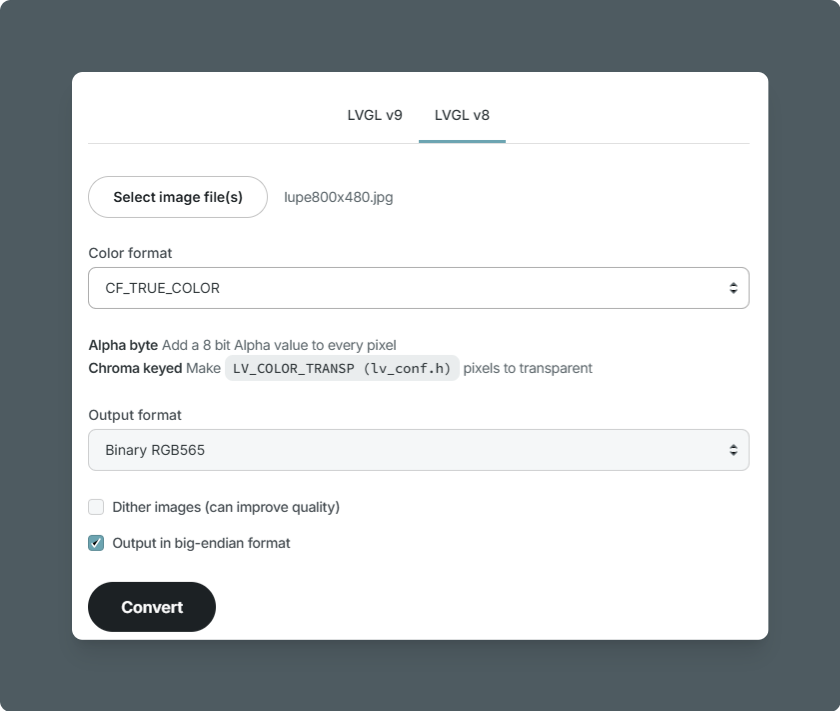
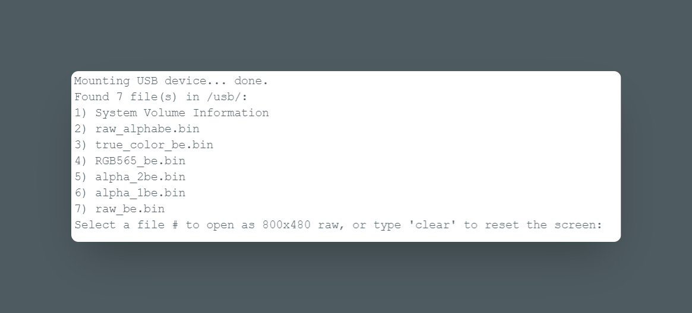

## Introduction

This guide explores how to read and display raw RGB565 images from a USB drive onto an Arduino GIGA Display Shield. Making it possible for you to list files from a USB drive, select an image, and render it.



## Hardware Requirements

- [Arduino GIGA R1 WiFi](https://store.arduino.cc/products/giga-r1-wifi)
- [Arduino GIGA Display Shield](https://store.arduino.cc/products/giga-display-shield)
- USB mass storage device (formatted with FAT32)

## Software Requirements

- **USBHostMbed5** (for USB host functionality)
- **FATFileSystem** (to read files from USB)
- **ArduinoH7Video**(Included in the core) and [**ArduinoGraphics**](https://docs.arduino.cc/libraries/arduinographics/) libraries (for handling display rendering)

## Features

- Lists all files in the `/usb/` directory.
- Allows users to select an image via the Serial Monitor.
- Automatically reads and displays an **800x480 RGB565** image.
- Clears the display upon request.

## Preparing Your Image

To ensure your image is in the correct format (800x480, 16-bit RGB565), you can use an online converter such as the [**LVGL Image Converter**](https://lvgl.io/tools/imageconverter). Select **RGB565** as the output format and set the resolution to 800x480 before saving the file to your USB drive. Make sure the USB drive is formatted for FAT32.
For testing we used the image:


For image conversion we selected the following settings:


## Code Breakdown

### Setting Up USB Host and Display

With the following code the USB host is initialized, enabling support for mass storage devices. The display is also set up using the `Arduino_H7_Video` class.

```arduino
USBHostMSD msd;
mbed::FATFileSystem usb("usb");
Arduino_H7_Video Display(800, 480, GigaDisplayShield);
```

### Listing Files on USB Storage

Once mounted, the USB drive is scanned for available files. Again, make sure the USB is in FAT32 format:

```arduino
void listRootDirectory() {
  fileCount = 0;
  DIR* dir = opendir("/usb/");
  if (!dir) return;
  while (true) {
    struct dirent* entry = readdir(dir);
    if (!entry || fileCount >= MAX_FILES) break;
    strncpy(fileNames[fileCount], entry->d_name, MAX_NAME_LEN - 1);
    fileCount++;
  }
  closedir(dir);
}
```

### Selecting an Image via Serial Input

Now by entering a file number in the Serial Monitor an image is selected and will be displayed on the GIGA Display Shield.

```arduino
void handleUserInput() {
  if (Serial.available() > 0) {
    int sel = Serial.parseInt();
    if (sel >= 1 && sel <= fileCount) {
      char path[256];
      snprintf(path, sizeof(path), "/usb/%s", fileNames[sel - 1]);
      displayRawRowByRow(path);
    }
  }
}
```


### Reading and Displaying RAW Images

The file is read row-by-row (800 pixels per row, 2 bytes per pixel). If the entire image (800x480 pixels) were loaded into memory at once, it would require approximately 768 KB of RAM (800 \* 480 \* 2 bytes). However, by processing only one row at a time (800 * 2 bytes), the memory usage is reduced to just `1.6 KB`, making this approach much more efficient and feasible for devices with restricted memory (like the GIGA). This approach minimizes memory usage by processing smaller chunks of the image at one time, avoiding large allocations that may exceed available RAM (512 KB for the GIGA).
We use, `fopen()` and `fclose()` are used for file management. `fopen()` allows us to open the image file and read data as needed, rather than loading everything at once. `fclose()` ensures that the file is properly closed after reading, freeing up system resources and preventing potential memory leaks.


```arduino
bool displayRawRowByRow(const char* path) {
  FILE* f = fopen(path, "rb");
  if (!f) return false;

  uint8_t* rowBuffer = (uint8_t*) malloc(IMG_WIDTH * 2);
  if (!rowBuffer) {
    fclose(f);
    return false;
  }

  Display.beginDraw();
  for (int y = 0; y < IMG_HEIGHT; y++) {
    fread(rowBuffer, 1, IMG_WIDTH * 2, f);
    Image rowImage(ENCODING_RGB16, rowBuffer, IMG_WIDTH, 1);
    Display.image(rowImage, 0, y);
  }
  Display.endDraw();

  free(rowBuffer);
  fclose(f);
  return true;
}
```

### Clearing the Display

Users can reset the display by entering `clear` in the Serial Monitor.
This simply fills all pixels with black.

```arduino
void forceScreenClear() {
  Display.beginDraw();
  Display.fill(0x0000); // Fill with black
  Display.endDraw();
}
```

### Full Code

```arduino
#include <Arduino_USBHostMbed5.h>
#include <DigitalOut.h>
#include <FATFileSystem.h>
#include <Arduino_H7_Video.h>
#include <ArduinoGraphics.h>

USBHostMSD msd;
mbed::FATFileSystem usb("usb");

const int USB_HOST_ENABLE_PIN = PA_15;
const int MAX_FILES = 50;
const int MAX_NAME_LEN = 128;
char fileNames[MAX_FILES][MAX_NAME_LEN];
int fileCount = 0;
const int MAX_CONNECTION_ATTEMPTS = 10;

Arduino_H7_Video Display(800, 480, GigaDisplayShield);
const int IMG_WIDTH = 800;
const int IMG_HEIGHT = 480;
const uint32_t EXPECTED_FILE_SIZE = IMG_WIDTH * IMG_HEIGHT * 2;

uint8_t rowBuffer[IMG_WIDTH * 2]; // Static buffer

void setup() {
    Serial.begin(115200);
    pinMode(USB_HOST_ENABLE_PIN, OUTPUT);
    digitalWrite(USB_HOST_ENABLE_PIN, HIGH);
    while (!Serial) {}
    delay(1500);

    Serial.println("=== USB File List ===");
    Display.begin();
    forceScreenClear();

    if (!initUSBHost() || !mountUSB()) return;
    listRootDirectory();
    if (fileCount == 0) return;

    printFileList();
    Serial.println("Select a file # to open as 800x480 .bin, or type 'clear' to reset the screen:");
}

void loop() {
    if (fileCount > 0) handleUserInput();
}

bool initUSBHost() {
    for (int i = 0; i < MAX_CONNECTION_ATTEMPTS; i++) {
        if (msd.connect()) {
            Serial.println("USB mass storage device connected!");
            return true;
        }
        Serial.println("USB device not detected, retrying...");
        delay(1000);
    }
    return false;
}

bool mountUSB() {
    Serial.print("Mounting USB device... ");
    if (usb.mount(&msd)) {
        Serial.println("Failed to mount USB.");
        return false;
    }
    Serial.println("done.");
    return true;
}

void listRootDirectory() {
    fileCount = 0;
    DIR* dir = opendir("/usb/");
    if (!dir) return;
    while (fileCount < MAX_FILES) {
        struct dirent* entry = readdir(dir);
        if (!entry) break;
        strncpy(fileNames[fileCount], entry->d_name, MAX_NAME_LEN - 1);
        fileNames[fileCount][MAX_NAME_LEN - 1] = '\0';
        fileCount++;
    }
    closedir(dir);
}

void printFileList() {
    Serial.print("Found "); Serial.print(fileCount); Serial.println(" file(s) in /usb/:");
    for (int i = 0; i < fileCount; i++) {
        Serial.print(i + 1); Serial.print(") "); Serial.println(fileNames[i]);
    }
}

void handleUserInput() {
    if (Serial.available() > 0) {
        String input = Serial.readStringUntil('\n');
        input.trim();

        if (input.equalsIgnoreCase("clear")) {
            forceScreenClear();
            return;
        }

        int sel = input.toInt();
        if (sel < 1 || sel > fileCount) return;

        Serial.print("Displaying: /usb/");
        Serial.println(fileNames[sel - 1]);

        displayRawRowByRow(fileNames[sel - 1]);
    }
}

bool displayRawRowByRow(const char* fileName) {
    String path = "/usb/" + String(fileName);
    FILE* f = fopen(path.c_str(), "rb");
    if (!f) return false;

    forceScreenClear();
    Display.beginDraw();

    for (int y = 0; y < IMG_HEIGHT; y++) {
        if (fread(rowBuffer, 1, IMG_WIDTH * 2, f) != IMG_WIDTH * 2) break;
        Image rowImage(ENCODING_RGB16, rowBuffer, IMG_WIDTH, 1);
        Display.image(rowImage, 0, y);
    }

    Display.endDraw();
    fclose(f);
    Serial.println("Image displayed successfully!");
    return true;
}

void forceScreenClear() {
    Display.beginDraw();
    Display.fill(0x0000);
    Display.endDraw();
}
```

### Conclusion

This project demonstrates how to read and display **16-bit RGB565 images** from a USB drive onto the Arduino GIGA Display. The row-by-row approach optimizes memory usage while ensuring smooth rendering.


