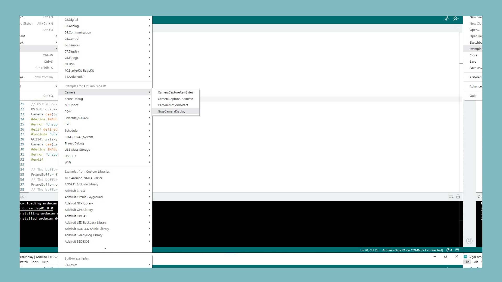

## Introduction

The GIGA Display Shield comes with an Arducam camera connector. In this tutorial, we will go through what cameras are compatible with the display shield, how to connect the camera, and how to run a sketch to stream the camera feed to the display.

## Hardware & Software Needed

- [Arduino GIGA R1 WiFi](/hardware/giga-r1)
- [Arduino GIGA Display Shield]()
- [Arduino IDE](https://www.arduino.cc/en/software)
- HM01B0, HM0360, GC2145 or OV7675 camera

## Downloading the Library and Core

The Arduino Mbed OS Giga Boards core contains most of the libraries you need to work with the shield's camera connector. To install the core for GIGA boards, navigate to **Tools > Board > Boards Manager** or click the Boards Manager icon in the left tab of the IDE. In the Boards Manager tab, search for giga and install the latest Arduino Mbed OS Giga Boards version, the [Arduino_H7_Video library](https://github.com/arduino/ArduinoCore-mbed/tree/main/libraries/Arduino_H7_Video) library is included in the core. Now open the library tab on the left, search for [**Arducam_dvp**](https://www.arduino.cc/reference/en/libraries/arducam_dvp/), and install this library.


## Compatible Cameras

The GIGA Display Shield is compatible with the following cameras:

- [HM01B0](https://www.arducam.com/product/hm01b0-qvga-monochrome-dvp-camera-module-for-arduino-giga-r1-wifi-board/)
- [HM0360](https://www.arducam.com/product/hm0360-vga-monochrome-dvp-camera-module-for-arduino-giga-r1-wifi-board/)
- [GC2145](https://www.arducam.com/product/2mp-gc2145-color-dvp-camera-module-for-arduino-giga-r1-wifi-board/)
- [OV7675](https://store.arduino.cc/products/arducam-camera-module?queryID=undefined)

Connect the camera to the connector on the front of the display shield as shown in the image below.


## Full Sketch

Open the example sketch by going to **File > Examples > Camera > GigaCameraDisplay** in the Arduino IDE.



Whichever of the compatible cameras you are using the sketch will include libraries and definitions for them all, meaning no modification to the sketch is necessary to get it working. The sketch will capture frames into the framebuffer and then print a live camera feed to the display.

```arduino
#include "arducam_dvp.h"
#include "Arduino_H7_Video.h"
#include "dsi.h"
#include "SDRAM.h"

// This example only works with Greyscale cameras (due to the palette + resize&rotate algo)
#define ARDUCAM_CAMERA_HM01B0

#ifdef ARDUCAM_CAMERA_HM01B0
#include "Himax_HM01B0/himax.h"
HM01B0 himax;
Camera cam(himax);
#define IMAGE_MODE CAMERA_GRAYSCALE
#elif defined(ARDUCAM_CAMERA_HM0360)
#include "Himax_HM0360/hm0360.h"
HM0360 himax;
Camera cam(himax);
#define IMAGE_MODE CAMERA_GRAYSCALE
#elif defined(ARDUCAM_CAMERA_OV767X)
#include "OV7670/ov767x.h"
// OV7670 ov767x;
OV7675 ov767x;
Camera cam(ov767x);
#define IMAGE_MODE CAMERA_RGB565
#elif defined(ARDUCAM_CAMERA_GC2145)
#include "GC2145/gc2145.h"
GC2145 galaxyCore;
Camera cam(galaxyCore);
#define IMAGE_MODE CAMERA_RGB565
#endif

// The buffer used to capture the frame
FrameBuffer fb;
// The buffer used to rotate and resize the frame
FrameBuffer outfb;
// The buffer used to rotate and resize the frame
Arduino_H7_Video Display(800, 480, GigaDisplayShield);

void blinkLED(uint32_t count = 0xFFFFFFFF)
{
  pinMode(LED_BUILTIN, OUTPUT);
  while (count--) {
    digitalWrite(LED_BUILTIN, LOW);  // turn the LED on (HIGH is the voltage level)
    delay(50);                       // wait for a second
    digitalWrite(LED_BUILTIN, HIGH); // turn the LED off by making the voltage LOW
    delay(50);                       // wait for a second
  }
}

uint32_t palette[256];

void setup() {
  // Init the cam QVGA, 30FPS
  if (!cam.begin(CAMERA_R320x240, IMAGE_MODE, 30)) {
    blinkLED();
  }

  // Setup the palette to convert 8 bit greyscale to 32bit greyscale
  for (int i = 0; i < 256; i++) {
    palette[i] = 0xFF000000 | (i << 16) | (i << 8) | i;
  }

  Display.begin();

  if (IMAGE_MODE == CAMERA_GRAYSCALE) {
    dsi_configueCLUT((uint32_t*)palette);
  }
  outfb.setBuffer((uint8_t*)SDRAM.malloc(1024 * 1024));

  // clear the display (gives a nice black background)
  dsi_lcdClear(0);
  dsi_drawCurrentFrameBuffer();
  dsi_lcdClear(0);
  dsi_drawCurrentFrameBuffer();
}

#define HTONS(x)    (((x >> 8) & 0x00FF) | ((x << 8) & 0xFF00))

void loop() {

  // Grab frame and write to another framebuffer
  if (cam.grabFrame(fb, 3000) == 0) {

    // double the resolution and transpose (rotate by 90 degrees) in the same step
    // this only works if the camera feed is 320x240 and the area where we want to display is 640x480
    for (int i = 0; i < 320; i++) {
      for (int j = 0; j < 240; j++) {
        if (IMAGE_MODE == CAMERA_GRAYSCALE) {
          ((uint8_t*)outfb.getBuffer())[j * 2 + (i * 2) * 480] = ((uint8_t*)fb.getBuffer())[i + j * 320];
          ((uint8_t*)outfb.getBuffer())[j * 2 + (i * 2) * 480 + 1] = ((uint8_t*)fb.getBuffer())[i + j * 320];
          ((uint8_t*)outfb.getBuffer())[j * 2 + (i * 2 + 1) * 480] = ((uint8_t*)fb.getBuffer())[i + j * 320];
          ((uint8_t*)outfb.getBuffer())[j * 2 + (i * 2 + 1) * 480 + 1] = ((uint8_t*)fb.getBuffer())[i + j * 320];
        } else {
          ((uint16_t*)outfb.getBuffer())[j * 2 + (i * 2) * 480] = HTONS(((uint16_t*)fb.getBuffer())[i + j * 320]);
          ((uint16_t*)outfb.getBuffer())[j * 2 + (i * 2) * 480 + 1] = HTONS(((uint16_t*)fb.getBuffer())[i + j * 320]);
          ((uint16_t*)outfb.getBuffer())[j * 2 + (i * 2 + 1) * 480] = HTONS(((uint16_t*)fb.getBuffer())[i + j * 320]);
          ((uint16_t*)outfb.getBuffer())[j * 2 + (i * 2 + 1) * 480 + 1] = HTONS(((uint16_t*)fb.getBuffer())[i + j * 320]);
        }
      }
    }
    dsi_lcdDrawImage((void*)outfb.getBuffer(), (void*)dsi_getCurrentFrameBuffer(), 480, 640, IMAGE_MODE == CAMERA_GRAYSCALE ? DMA2D_INPUT_L8 : DMA2D_INPUT_RGB565);
    dsi_drawCurrentFrameBuffer();
  } else {
    blinkLED(20);
  }
}
```

## Conclusion

This tutorial went through how to connect a compatible camera to the shield and also how to test it out quickly with the example sketch included in the core. Now you should see a live feed from the camera on your GIGA Display Shield!
