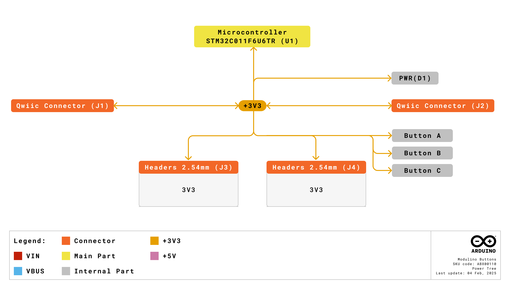

# Description

The Modulino® Buttons, powered by an on-board STM32C011F4 microcontroller, features three SPST push buttons and three indicator LEDs. This setup enables both simple digital input reading via I2C and more advanced interfacing or reprogramming options. Ideal for projects that require user interaction, menu navigation, or quick control inputs.

# Target Areas

Maker, beginner, education

# Contents
## Application Examples

- **Interactive Interfaces**
  Integrate multiple buttons into a project to navigate menus or adjust settings in real time.

- **Educational Projects**
  Teach fundamentals of state detection (pressed/released) and microcontroller-based I2C communication.

- **Control Panels**
  Combine button inputs with other Modulino® nodes (e.g., display, buzzer) for a complete user interface.

## Features
- Three **SPST push buttons** and three on-board indicator LEDs.
- Integrated **STM32C011F4** microcontroller providing I2C interface by default.
- **Optional SWD** interface for custom firmware and advanced features.
- Designed for **3.3 V** operation via the Qwiic connector (I2C).
- Ideal for **user interaction** and input within modular IoT or maker projects.

### Contents
| **SKU**    | **Name**              | **Purpose**                            | **Quantity** |
| ---------- | --------------------- | -------------------------------------- | ------------ |
| ABX00110   | Modulino® Buttons     | 3× push buttons and indicator LEDs     | 1            |
|            | I2C Qwiic cable       | Compatible with the Qwiic standard     | 1            |

## Related Products
- **SKU: ASX00027** – [Arduino® Sensor Kit](https://store.arduino.cc/products/arduino-sensor-kit)
- **SKU: K000007** – [Arduino® Starter Kit](https://store.arduino.cc/products/arduino-starter-kit-multi-language)
- **SKU: AKX00026** – [Arduino® Oplà IoT Kit](https://store.arduino.cc/products/opla-iot-kit)

## Rating

### Recommended Operating Conditions
- **Microcontroller supply range:** 2.0 V – 3.6 V (STM32C011F4)
- **Powered at 3.3 V** through the Qwiic interface (in accordance with the Qwiic standard)
- **Operating temperature:** –40 °C to +85 °C

**Typical current consumption:**
- Push buttons + LEDs: ~2.5 mA × 3 + ~3.4 mA
- Microcontroller idle: ~3.4 mA

## Power Tree
The power tree for the Modulino® node can be consulted below:

## Block Diagram
This module includes an STM32C011F4 microcontroller handling button inputs and LED outputs. It communicates via I2C by default, but can be reprogrammed via SWD for custom functionality.

## Functional Overview
The Modulino® Buttons node has a dedicated microcontroller (STM32C011F4) which scans the three SPST push buttons and drives the three LEDs. By default, it exposes a standard I2C interface over the Qwiic connector. The on-board firmware reports button states and allows simple LED control via I2C registers. Advanced users can re-flash the microcontroller via the SWD interface for additional custom logic.

### Technical Specifications (Module-Specific)
| **Specification**       | **Details**                                     |
| ----------------------- | ----------------------------------------------- |
| **Microcontroller**     | STM32C011F4                                     |
| **Accuracy**     | ADC: ±2 LSB typical INL                               |
| **Resolution**     | 12-bit ADC                               |
| **Supply Voltage**      | Min: 2.0 V, Max: 3.6 V                           |
| **Power Consumption**   | ~2.5 mA × 3 + 3.4 mA (LEDs + MCU)                |
| **User Inputs**         | 3× SPST push buttons                            |
| **LEDs**                | 3× indicator LEDs (controlled by MCU)           |
| **Communication**       | I2C (Qwiic), SWD (reprogramming), UART (option) |

### Pinout

**Qwiic / I2C (1×4 Header)**  
| **Pin** | **Function**              |
|---------|---------------------------|
| GND     | Ground                   |
| 3.3 V   | Power Supply (3.3 V)     |
| SDA     | I2C Data                 |
| SCL     | I2C Clock                |

These pads and the Qwiic connectors share the same I2C bus at 3.3 V.

**Additional 1×10 Header**  

| **Pin** | **Function** |
|---------|--------------|
| A     | Button A       |
| GND   | Ground         |
| 3V3   | 3.3 V Power    |
| PF2   | RESET          |
| SWCLK | SWD Clock      |
| SWDIO | SWD Data       |
| TX1   | USART Transmit |
| RX1   | USART Receive  |
| B     | Button B       |
| C     | Button C       |

 **Note:**
 - The board can be reprogrammed via SWD to implement custom functionality.  
 - Pull-up resistor pads exist for optional I2C lines, but are not populated by default.

### Power Specifications
- **Nominal operating voltage:** 3.3 V via Qwiic
- **Microcontroller voltage range:** 2.0 V–3.6 V

### Mechanical Information

- Board dimensions: 41 mm × 25.36 mm
- Thickness: 1.6 mm (±0.2 mm)
- Four mounting holes (Ø 3.2 mm)
  - Hole spacing: 16 mm vertically, 32 mm horizontally

### I2C Address Reference
| **Board Silk Name** | **Sensor/Actuator**     | **Modulino® I2C Address (HEX)** | **Editable Addresses (HEX)**                | **Hardware I2C Address (HEX)** |
|---------------------|-------------------------|--------------------------------|---------------------------------------------|--------------------------------|
| MODULINO BUTTONS    | 3× SPST Push Buttons    | 0x7C                           | Any custom address (via software config.)   | 0x3E                           |

 **Note:**
 - Default I2C address is **0x7C**.
 - “Hardware I2C Address” might be seen by advanced scanners, but you should use 0x7C in your code unless changed.  
 - A white rectangle on the bottom silk allows users to write a new address after reconfiguration.
  

#### Pull-up Resistors

This module has pads for optional I2C pull-up mounting in both data lines. No resistors are mounted by default but in case the resistors are need 4.7 K resistors in an SMD 0402 format are recommended.

These are positioned between the button B and C.

## Device Operation
By default, the board is an I2C target device. It manages button inputs and LED outputs through integrated firmware. Simply connect it to a 3.3 V Qwiic interface. If needed, you can reprogram the STM32C011F4 via SWD to modify or extend functionality. A LED positioned near each button can be controlled through the microcontroller's GPIOs PA3, PA4 and PA5.

# Certifications

## Certifications Summary

| **Certification** | **Status** |
|:-----------------:|:----------:|
|  CE/RED (Europe)  |     Yes    |
|     UKCA (UK)     |     Yes    |
|     FCC (USA)     |     Yes    |
|    IC (Canada)    |     Yes    |
|        RoHS       |     Yes    |
|       REACH       |     Yes    |
|        WEEE       |     Yes    |

## Declaration of Conformity CE DoC (EU)

We declare under our sole responsibility that the products above are in conformity with the essential requirements of the following EU Directives and therefore qualify for free movement within markets comprising the European Union (EU) and European Economic Area (EEA).

## Declaration of Conformity to EU RoHS & REACH 211 01/19/2021

Arduino boards are in compliance with RoHS 2 Directive 2011/65/EU of the European Parliament and RoHS 3 Directive 2015/863/EU of the Council of 4 June 2015 on the restriction of the use of certain hazardous substances in electrical and electronic equipment.

| Substance                              | **Maximum limit (ppm)** |
|----------------------------------------|-------------------------|
| Lead (Pb)                              | 1000                    |
| Cadmium (Cd)                           | 100                     |
| Mercury (Hg)                           | 1000                    |
| Hexavalent Chromium (Cr6+)             | 1000                    |
| Poly Brominated Biphenyls (PBB)        | 1000                    |
| Poly Brominated Diphenyl ethers (PBDE) | 1000                    |
| Bis(2-Ethylhexyl) phthalate (DEHP)     | 1000                    |
| Benzyl butyl phthalate (BBP)           | 1000                    |
| Dibutyl phthalate (DBP)                | 1000                    |
| Diisobutyl phthalate (DIBP)            | 1000                    |

Exemptions: No exemptions are claimed.

Arduino Boards are fully compliant with the related requirements of European Union Regulation (EC) 1907 /2006 concerning the Registration, Evaluation, Authorization and Restriction of Chemicals (REACH). We declare none of the SVHCs (https://echa.europa.eu/web/guest/candidate-list-table), the Candidate List of Substances of Very High Concern for authorization currently released by ECHA, is present in all products (and also package) in quantities totaling in a concentration equal or above 0.1%. To the best of our knowledge, we also declare that our products do not contain any of the substances listed on the "Authorization List" (Annex XIV of the REACH regulations) and Substances of Very High Concern (SVHC) in any significant amounts as specified by the Annex XVII of Candidate list published by ECHA (European Chemical Agency) 1907 /2006/EC.

## FCC WARNING

This device complies with part 15 of the FCC Rules.

Operation is subject to the following two conditions: 

(1) This device may not cause harmful interference, and (2) this device must accept any interference received, including interference that may cause undesired operation.

## IC Caution

This device complies with Industry Canada licence-exempt RSS standard(s). 

Operation is subject to the following two conditions: 

(1) This device may not cause interference, and (2) this device must accept any interference, including interference that may cause undesired operation of the device.

## Conflict Minerals Declaration

As a global supplier of electronic and electrical components, Arduino is aware of our obligations with regard to laws and regulations regarding Conflict Minerals, specifically the Dodd-Frank Wall Street Reform and Consumer Protection Act, Section 1502. Arduino does not directly source or process conflict minerals such as Tin, Tantalum, Tungsten, or Gold. Conflict minerals are contained in our products in the form of solder or as a component in metal alloys. As part of our reasonable due diligence, Arduino has contacted component suppliers within our supply chain to verify their continued compliance with the regulations. Based on the information received thus far we declare that our products contain Conflict Minerals sourced from conflict-free areas.

# Company Information

| Company name    | Arduino SRL                                   |
|-----------------|-----------------------------------------------|
| Company Address | Via Andrea Appiani, 25 - 20900 MONZA（Italy)  |

# Reference Documentation

| Ref                       | Link                                                                                                                                                                                           |
| ------------------------- | ---------------------------------------------------------------------------------------------------------------------------------------------------------------------------------------------- |
| Arduino IDE (Desktop)     | [https://www.arduino.cc/en/Main/Software](https://www.arduino.cc/en/Main/Software)                                                                                                             |
| Arduino Courses           | [https://www.arduino.cc/education/courses](https://www.arduino.cc/education/courses)                                                                                                           |
| Arduino Documentation     | [https://docs.arduino.cc/](https://docs.arduino.cc/)                                                                                                           |
| Arduino IDE (Cloud)       | [https://create.arduino.cc/editor](https://create.arduino.cc/editor)                                                                                                                           |
| Cloud IDE Getting Started | [https://docs.arduino.cc/cloud/web-editor/tutorials/getting-started/getting-started-web-editor](https://docs.arduino.cc/cloud/web-editor/tutorials/getting-started/getting-started-web-editor) |
| Project Hub               | [https://projecthub.arduino.cc/](https://projecthub.arduino.cc/)                                                                                                                          |
| Library Reference         | [https://github.com/arduino-libraries/](https://github.com/arduino-libraries/)                                                                                                            |
| Online Store              | [https://store.arduino.cc/](https://store.arduino.cc/)                                                                                                                                    |

# Revision History
| **Date**   | **Revision** | **Changes**                       |
|------------|--------------|-----------------------------------|
| 01/07/2025 | 5            | Certification                     |
| 17/06/2025 | 4            | Nomenclature updates              |
| 23/05/2025 | 3            | Fixed pinout table and power info |
| 21/05/2025 | 2            | Fixed info on LEDs                |
| 14/05/2025 | 1            | First release                     |
